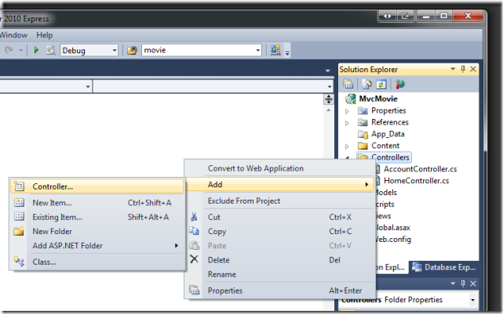
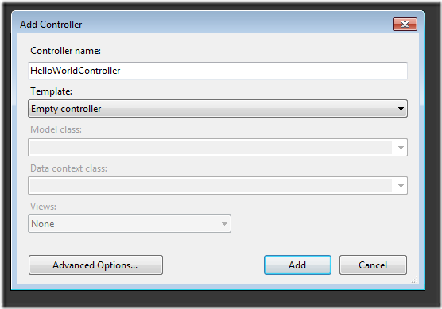
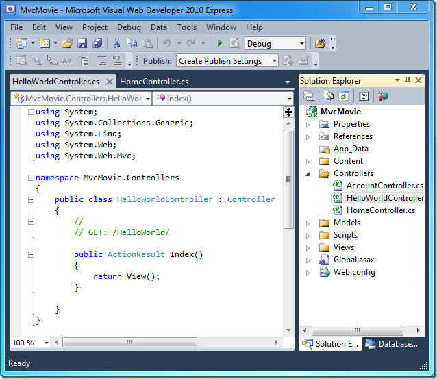
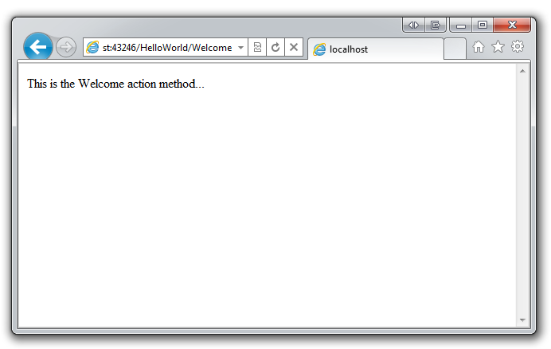

Adding a Controller (C#)
====================
by [Rick Anderson](https://github.com/Rick-Anderson)

> > [!NOTE]
> > An updated version of this tutorial is available [here](../../../getting-started/introduction/getting-started.md) that uses ASP.NET MVC 5 and Visual Studio 2013. It's more secure, much simpler to follow and demonstrates more features.
> 
> 
> This tutorial will teach you the basics of building an ASP.NET MVC Web application using Microsoft Visual Web Developer 2010 Express Service Pack 1, which is a free version of Microsoft Visual Studio. Before you start, make sure you've installed the prerequisites listed below. You can install all of them by clicking the following link: [Web Platform Installer](https://www.microsoft.com/web/gallery/install.aspx?appid=VWD2010SP1Pack). Alternatively, you can individually install the prerequisites using the following links:
> 
> - [Visual Studio Web Developer Express SP1 prerequisites](https://www.microsoft.com/web/gallery/install.aspx?appid=VWD2010SP1Pack)
> - [ASP.NET MVC 3 Tools Update](https://www.microsoft.com/web/gallery/install.aspx?appsxml=&amp;appid=MVC3)
> - [SQL Server Compact 4.0](https://www.microsoft.com/web/gallery/install.aspx?appid=SQLCE;SQLCEVSTools_4_0)(runtime + tools support)
> 
> If you're using Visual Studio 2010 instead of Visual Web Developer 2010, install the prerequisites by clicking the following link: [Visual Studio 2010 prerequisites](https://www.microsoft.com/web/gallery/install.aspx?appsxml=&amp;appid=VS2010SP1Pack).
> 
> A Visual Web Developer project with C# source code is available to accompany this topic. [Download the C# version](https://code.msdn.microsoft.com/Introduction-to-MVC-3-10d1b098). If you prefer Visual Basic, switch to the [Visual Basic version](../vb/intro-to-aspnet-mvc-3.md) of this tutorial.

MVC stands for *model-view-controller*. MVC is a pattern for developing applications that are well architected and easy to maintain. MVC-based applications contain:

- Controllers: Classes that handle incoming requests to the application, retrieve model data, and then specify view templates that return a response to the client.
- Models: Classes that represent the data of the application and that use validation logic to enforce business rules for that data.
- Views: Template files that your application uses to dynamically generate HTML responses.

We'll be covering all these concepts in this tutorial series and show you how to use them to build an application.

Let's begin by creating a controller class. In **Solution Explorer**, right-click the *Controllers* folder and then select **Add Controller**.

Name your new controller "HelloWorldController". Leave the default template as **Empty controller** and click **Add**.

Notice in **Solution Explorer** that a new file has been created named *HelloWorldController.cs*. The file is open in the IDE.

Inside the `public class HelloWorldController` block, create two methods that look like the following code. The controller will return a string of HTML as an example.

[!code-csharp[Main](adding-a-controller/samples/sample1.cs)]

Your controller is named `HelloWorldController` and the first method above is named `Index`. Let's invoke it from a browser. Run the application (press F5 or Ctrl+F5). In the browser, append "HelloWorld" to the path in the address bar. (For example, in the illustration below, it's `http://localhost:43246/HelloWorld.`) The page in the browser will look like the following screenshot. In the method above, the code returned a string directly. You told the system to just return some HTML, and it did!

ASP.NET MVC invokes different controller classes (and different action methods within them) depending on the incoming URL. The default mapping logic used by ASP.NET MVC uses a format like this to determine what code to invoke:

`/[Controller]/[ActionName]/[Parameters]`

The first part of the URL determines the controller class to execute. So */HelloWorld* maps to the `HelloWorldController` class. The second part of the URL determines the action method on the class to execute. So */HelloWorld/Index* would cause the `Index` method of the `HelloWorldController` class to execute. Notice that we only had to browse to */HelloWorld* and the `Index` method was used by default. This is because a method named `Index` is the default method that will be called on a controller if one is not explicitly specified.

Browse to `http://localhost:xxxx/HelloWorld/Welcome`. The `Welcome` method runs and returns the string "This is the Welcome action method...". The default MVC mapping is `/[Controller]/[ActionName]/[Parameters]`. For this URL, the controller is `HelloWorld` and `Welcome` is the action method. You haven't used the `[Parameters]` part of the URL yet.

Let's modify the example slightly so that you can pass some parameter information from the URL to the controller (for example, */HelloWorld/Welcome?name=Scott&amp;numtimes=4*). Change your `Welcome` method to include two parameters as shown below. Note that the code uses the C# optional-parameter feature to indicate that the `numTimes` parameter should default to 1 if no value is passed for that parameter.

[!code-csharp[Main](adding-a-controller/samples/sample2.cs)]

Run your application and browse to the example URL (`http://localhost:xxxx/HelloWorld/Welcome?name=Scott&numtimes=4)`. You can try different values for `name` and `numtimes` in the URL. The system automatically maps the named parameters from the query string in the address bar to parameters in your method.

In both these examples the controller has been doing the "VC" portion of MVC — that is, the view and controller work. The controller is returning HTML directly. Ordinarily you don't want controllers returning HTML directly, since that becomes very cumbersome to code. Instead we'll typically use a separate view template file to help generate the HTML response. Let's look next at how we can do this.

>[!div class="step-by-step"]
[Previous](intro-to-aspnet-mvc-3.md)
[Next](adding-a-view.md)