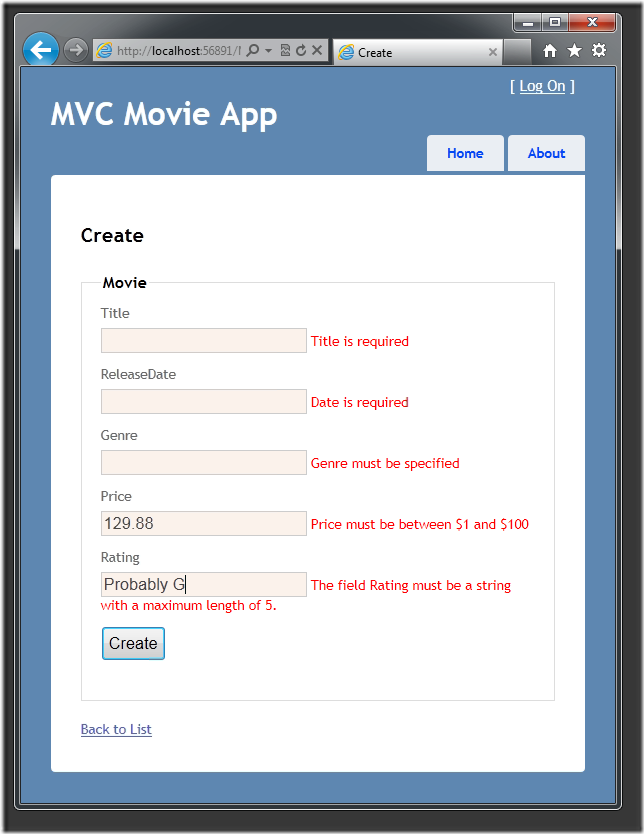

Adding Validation to the Model (C#)
====================
by [Rick Anderson](https://github.com/Rick-Anderson)

> > [!NOTE]
> > An updated version of this tutorial is available [here](../../../getting-started/introduction/getting-started.md) that uses ASP.NET MVC 5 and Visual Studio 2013. It's more secure, much simpler to follow and demonstrates more features.
> 
> 
> This tutorial will teach you the basics of building an ASP.NET MVC Web application using Microsoft Visual Web Developer 2010 Express Service Pack 1, which is a free version of Microsoft Visual Studio. Before you start, make sure you've installed the prerequisites listed below. You can install all of them by clicking the following link: [Web Platform Installer](https://www.microsoft.com/web/gallery/install.aspx?appid=VWD2010SP1Pack). Alternatively, you can individually install the prerequisites using the following links:
> 
> - [Visual Studio Web Developer Express SP1 prerequisites](https://www.microsoft.com/web/gallery/install.aspx?appid=VWD2010SP1Pack)
> - [ASP.NET MVC 3 Tools Update](https://www.microsoft.com/web/gallery/install.aspx?appsxml=&amp;appid=MVC3)
> - [SQL Server Compact 4.0](https://www.microsoft.com/web/gallery/install.aspx?appid=SQLCE;SQLCEVSTools_4_0)(runtime + tools support)
> 
> If you're using Visual Studio 2010 instead of Visual Web Developer 2010, install the prerequisites by clicking the following link: [Visual Studio 2010 prerequisites](https://www.microsoft.com/web/gallery/install.aspx?appsxml=&amp;appid=VS2010SP1Pack).
> 
> A Visual Web Developer project with C# source code is available to accompany this topic. [Download the C# version](https://code.msdn.microsoft.com/Introduction-to-MVC-3-10d1b098). If you prefer Visual Basic, switch to the [Visual Basic version](../vb/intro-to-aspnet-mvc-3.md) of this tutorial.

In this section you'll add validation logic to the `Movie` model, and you'll ensure that the validation rules are enforced any time a user attempts to create or edit a movie using the application.

## Keeping Things DRY

One of the core design tenets of ASP.NET MVC is DRY ("Don't Repeat Yourself"). ASP.NET MVC encourages you to specify functionality or behavior only once, and then have it be reflected everywhere in an application. This reduces the amount of code you need to write and makes the code you do write much easier to maintain.

The validation support provided by ASP.NET MVC and Entity Framework Code First is a great example of the DRY principle in action. You can declaratively specify validation rules in one place (in the model class) and then those rules are enforced everywhere in the application.

Let's look at how you can take advantage of this validation support in the movie application.

## Adding Validation Rules to the Movie Model

You'll begin by adding some validation logic to the `Movie` class.

Open the *Movie.cs* file. Add a `using` statement at the top of the file that references the [`System.ComponentModel.DataAnnotations`](https://msdn.microsoft.com/en-us/library/system.componentmodel.dataannotations.aspx) namespace:

[!code-csharp[Main](adding-validation-to-the-model/samples/sample1.cs)]

The namespace is part of the .NET Framework. It provides a built-in set of validation attributes that you can apply declaratively to any class or property.

Now update the `Movie` class to take advantage of the built-in [`Required`](https://msdn.microsoft.com/en-us/library/system.componentmodel.dataannotations.requiredattribute.aspx), [`StringLength`](https://msdn.microsoft.com/en-us/library/system.componentmodel.dataannotations.stringlengthattribute.aspx), and [`Range`](https://msdn.microsoft.com/en-us/library/system.componentmodel.dataannotations.rangeattribute.aspx) validation attributes. Use the following code as an example of where to apply the attributes.

[!code-csharp[Main](adding-validation-to-the-model/samples/sample2.cs)]

The validation attributes specify behavior that you want to enforce on the model properties they are applied to. The `Required` attribute indicates that a property must have a value; in this sample, a movie has to have values for the `Title`, `ReleaseDate`, `Genre`, and `Price` properties in order to be valid. The `Range` attribute constrains a value to within a specified range. The `StringLength` attribute lets you set the maximum length of a string property, and optionally its minimum length.

Code First ensures that the validation rules you specify on a model class are enforced before the application saves changes in the database. For example, the code below will throw an exception when the `SaveChanges` method is called, because several required `Movie` property values are missing and the price is zero (which is out of the valid range).

[!code-csharp[Main](adding-validation-to-the-model/samples/sample3.cs)]

Having validation rules automatically enforced by the .NET Framework helps make your application more robust. It also ensures that you can't forget to validate something and inadvertently let bad data into the database.

Here's a complete code listing for the updated *Movie.cs* file:

[!code-csharp[Main](adding-validation-to-the-model/samples/sample4.cs)]

## Validation Error UI in ASP.NET MVC

Re-run the application and navigate to the */Movies* URL.

Click the **Create Movie** link to add a new movie. Fill out the form with some invalid values and then click the **Create** button.

Notice how the form has automatically used a background color to highlight the text boxes that contain invalid data and has emitted an appropriate validation error message next to each one. The error messages match the error strings you specified when you annotated the `Movie` class. The errors are enforced both client-side (using JavaScript) and server-side (in case a user has JavaScript disabled).

A real benefit is that you didn't need to change a single line of code in the `MoviesController` class or in the *Create.cshtml* view in order to enable this validation UI. The controller and views you created earlier in this tutorial automatically picked up the validation rules that you specified using attributes on the `Movie` model class.

## How Validation Occurs in the Create View and Create Action Method

You might wonder how the validation UI was generated without any updates to the code in the controller or views. The next listing shows what the `Create` methods in the `MovieController` class look like. They're unchanged from how you created them earlier in this tutorial.

[!code-csharp[Main](adding-validation-to-the-model/samples/sample5.cs)]

The first action method displays the initial Create form. The second handles the form post. The second `Create` method calls `ModelState.IsValid` to check whether the movie has any validation errors. Calling this method evaluates any validation attributes that have been applied to the object. If the object has validation errors, the `Create` method redisplays the form. If there are no errors, the method saves the new movie in the database.

Below is the *Create.cshtml* view template that you scaffolded earlier in the tutorial. It's used by the action methods shown above both to display the initial form and to redisplay it in the event of an error.

[!code-cshtml[Main](adding-validation-to-the-model/samples/sample6.cshtml)]

Notice how the code uses an `Html.EditorFor` helper to output the `<input>` element for each `Movie` property. Next to this helper is a call to the `Html.ValidationMessageFor` helper method. These two helper methods work with the model object that's passed by the controller to the view (in this case, a `Movie` object). They automatically look for validation attributes specified on the model and display error messages as appropriate.

What's really nice about this approach is that neither the controller nor the Create view template knows anything about the actual validation rules being enforced or about the specific error messages displayed. The validation rules and the error strings are specified only in the `Movie` class.

If you want to change the validation logic later, you can do so in exactly one place. You won't have to worry about different parts of the application being inconsistent with how the rules are enforced — all validation logic will be defined in one place and used everywhere. This keeps the code very clean, and makes it easy to maintain and evolve. And it means that that you'll be fully honoring the DRY principle.

## Adding Formatting to the Movie Model

Open the *Movie.cs* file. The [`System.ComponentModel.DataAnnotations`](https://msdn.microsoft.com/en-us/library/system.componentmodel.dataannotations.aspx) namespace provides formatting attributes in addition to the built-in set of validation attributes. You'll apply the [`DisplayFormat`](https://msdn.microsoft.com/en-us/library/system.componentmodel.dataannotations.displayformatattribute.aspx) attribute and a [`DataType`](https://msdn.microsoft.com/en-us/library/system.componentmodel.dataannotations.datatype.aspx) enumeration value to the release date and to the price fields. The following code shows the `ReleaseDate` and `Price` properties with the appropriate [`DisplayFormat`](https://msdn.microsoft.com/en-us/library/system.componentmodel.dataannotations.displayformatattribute.aspx) attribute.

[!code-csharp[Main](adding-validation-to-the-model/samples/sample7.cs)]

Alternatively, you could explicitly set a [`DataFormatString`](https://msdn.microsoft.com/en-us/library/system.string.format.aspx) value. The following code shows the release date property with a date format string (namely, "d"). You'd use this to specify that you don't want to time as part of the release date.

[!code-csharp[Main](adding-validation-to-the-model/samples/sample8.cs)]

The following code formats the `Price` property as currency.

[!code-csharp[Main](adding-validation-to-the-model/samples/sample9.cs)]

The complete `Movie` class is shown below.

[!code-csharp[Main](adding-validation-to-the-model/samples/sample10.cs)]

Run the application and browse to the `Movies` controller.

In the next part of the series, we'll review the application and make some improvements to the automatically generated `Details` and `Delete` methods.

>[!div class="step-by-step"]
[Previous](adding-a-new-field.md)
[Next](improving-the-details-and-delete-methods.md)