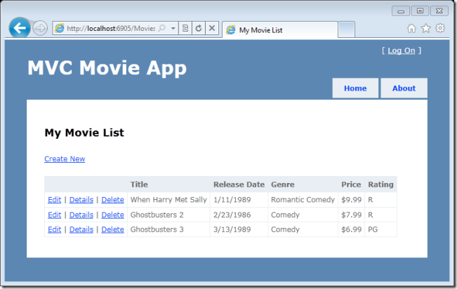
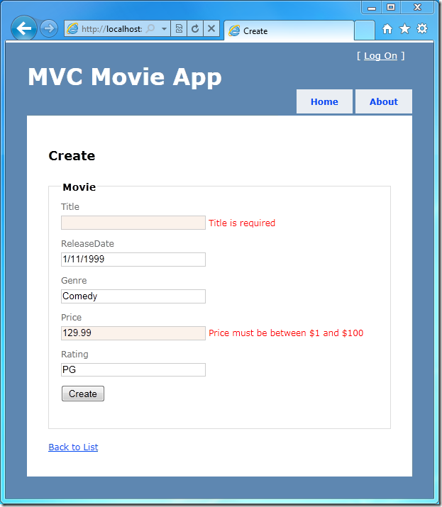
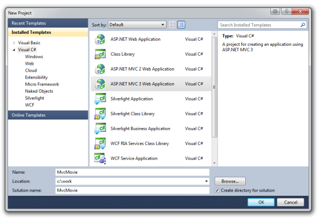
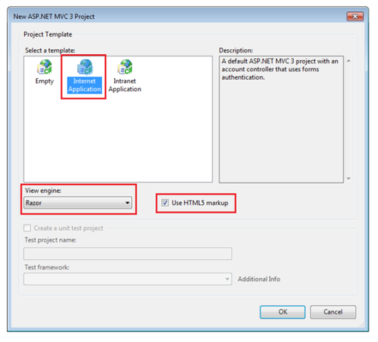
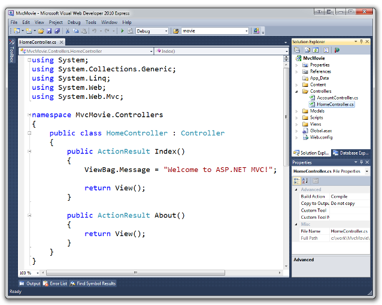
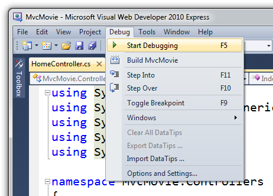
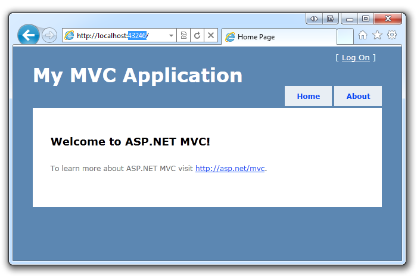

Intro to ASP.NET MVC 3 (C#)
====================
by [Rick Anderson](https://github.com/Rick-Anderson)

> > [!NOTE]
> > An updated version of this tutorial is available [here](../../../getting-started/introduction/getting-started.md) that uses ASP.NET MVC 5 and Visual Studio 2013. It's more secure, much simpler to follow and demonstrates more features.
> 
> 
> This tutorial will teach you the basics of building an ASP.NET MVC Web application using Microsoft Visual Web Developer 2010 Express Service Pack 1, which is a free version of Microsoft Visual Studio. Before you start, make sure you've installed the prerequisites listed below. You can install all of them by clicking the following link: [Web Platform Installer](https://www.microsoft.com/web/gallery/install.aspx?appid=VWD2010SP1Pack). Alternatively, you can individually install the prerequisites using the following links:
> 
> - [Visual Studio Web Developer Express SP1 prerequisites](https://www.microsoft.com/web/gallery/install.aspx?appid=VWD2010SP1Pack)
> - [ASP.NET MVC 3 Tools Update](https://www.microsoft.com/web/gallery/install.aspx?appsxml=&amp;appid=MVC3)
> - [SQL Server Compact 4.0](https://www.microsoft.com/web/gallery/install.aspx?appid=SQLCE;SQLCEVSTools_4_0)(runtime + tools support)
> 
> If you're using Visual Studio 2010 instead of Visual Web Developer 2010, install the prerequisites by clicking the following link: [Visual Studio 2010 prerequisites](https://www.microsoft.com/web/gallery/install.aspx?appsxml=&amp;appid=VS2010SP1Pack).
> 
> A Visual Web Developer project with C# source code is available to accompany this topic. [Download the C# version](https://code.msdn.microsoft.com/Introduction-to-MVC-3-10d1b098). If you prefer Visual Basic, switch to the [Visual Basic version](../vb/intro-to-aspnet-mvc-3.md) of this tutorial.

## What You'll Build

You'll implement a simple movie-listing application that supports creating, editing, and listing movies from a database. Below are two screenshots of the application you'll build. It includes a page that displays a list of movies from a database:

The application also lets you add, edit, and delete movies, as well as see details about individual ones. All data-entry scenarios include validation to ensure that the data stored in the database is correct.

## Skills You'll Learn

Here's what you'll learn:

- How to create a new ASP.NET MVC project.
- How to create ASP.NET MVC controllers and views.
- How to create a new database using the Entity Framework Code First paradigm.
- How to retrieve and display data.
- How to edit data and enable data validation.

## Getting Started

Start by running Visual Web Developer 2010 Express ("Visual Web Developer" for short) and select **New Project** from the **Start** page.

Visual Web Developer is an IDE, or integrated development environment. Just like you use Microsoft Word to write documents, you'll use an IDE to create applications. In Visual Web Developer there's a toolbar along the top showing various options available to you. There's also a menu that provides another way to perform tasks in the IDE. (For example, instead of selecting **New Project** from the **Start** page, you can use the menu and select **File** &gt; **New Project**.)

## Creating Your First Application

You can create applications using either Visual Basic or Visual C# as the programming language. Select Visual C# on the left and then select **ASP.NET MVC 3 Web Application**. Name your project "MvcMovie" and then click **OK**. (If you prefer Visual Basic, switch to the [Visual Basic version](../vb/intro-to-aspnet-mvc-3.md) of this tutorial.)

In the **New ASP.NET MVC 3 Project** dialog box, select **Internet Application**. Check **Use HTML5 markup** and leave **Razor** as the default view engine.

Click **OK**. Visual Web Developer used a default template for the ASP.NET MVC project you just created, so you have a working application right now without doing anything! This is a simple "Hello World!" project, and it's a good place to start your application.

From the **Debug** menu, select **Start Debugging**.

Notice that the keyboard shortcut to start debugging is F5.

F5 causes Visual Web Developer to start a development web server and run your web application. Visual Web Developer then launches a browser and opens the application's home page. Notice that the address bar of the browser says `localhost` and not something like `example.com`. That's because `localhost` always points to your own local computer, which in this case is running the application you just built. When Visual Web Developer runs a web project, a random port is used for the web server. In the image below, the random port number is 43246. When you run the application, you'll probably see a different port number.

Right out of the box this default template gives you two pages to visit and a basic login page. The next step is to change how this application works and learn a little bit about ASP.NET MVC in the process. Close your browser and let's change some code.

>[!div class="step-by-step"]
[Next](adding-a-controller.md)