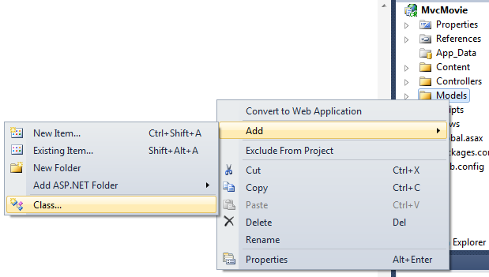

Adding a Model (VB)
====================
by [Rick Anderson](https://github.com/Rick-Anderson)

> This tutorial will teach you the basics of building an ASP.NET MVC Web application using Microsoft Visual Web Developer 2010 Express Service Pack 1, which is a free version of Microsoft Visual Studio. Before you start, make sure you've installed the prerequisites listed below. You can install all of them by clicking the following link: [Web Platform Installer](https://www.microsoft.com/web/gallery/install.aspx?appid=VWD2010SP1Pack). Alternatively, you can individually install the prerequisites using the following links:
> 
> - [Visual Studio Web Developer Express SP1 prerequisites](https://www.microsoft.com/web/gallery/install.aspx?appid=VWD2010SP1Pack)
> - [ASP.NET MVC 3 Tools Update](https://www.microsoft.com/web/gallery/install.aspx?appsxml=&amp;appid=MVC3)
> - [SQL Server Compact 4.0](https://www.microsoft.com/web/gallery/install.aspx?appid=SQLCE;SQLCEVSTools_4_0)(runtime + tools support)
> 
> If you're using Visual Studio 2010 instead of Visual Web Developer 2010, install the prerequisites by clicking the following link: [Visual Studio 2010 prerequisites](https://www.microsoft.com/web/gallery/install.aspx?appsxml=&amp;appid=VS2010SP1Pack).
> 
> A Visual Web Developer project with VB.NET source code is available to accompany this topic. [Download the VB.NET version](https://code.msdn.microsoft.com/Introduction-to-MVC-3-10d1b098). If you prefer C#, switch to the [C# version](../cs/adding-a-model.md) of this tutorial.

## Adding a Model

In this section you'll add some classes for managing movies in a database. These classes will be the "model" part of the ASP.NET MVC application.

You'll use a .NET Framework data-access technology known as the Entity Framework to define and work with these model classes. The Entity Framework (often referred to as EF) supports a development paradigm called *Code First*. Code First allows you to create model objects by writing simple classes. (These are also known as POCO classes, from "plain-old CLR objects.") You can then have the database created on the fly from your classes, which enables a very clean and rapid development workflow.

## Adding Model Classes

In **Solution Explorer**, right click the *Models* folder, select **Add**, and then select **Class**.

Name the class "Movie".

Add the following five properties to the `Movie` class:

[!code-vb[Main](adding-a-model/samples/sample1.vb)]

We'll use the `Movie` class to represent movies in a database. Each instance of a `Movie` object will correspond to a row within a database table, and each property of the `Movie` class will map to a column in the table.

In the same file, add the following `MovieDBContext` class:

[!code-vb[Main](adding-a-model/samples/sample2.vb)]

The `MovieDBContext` class represents the Entity Framework movie database context, which handles fetching, storing, and updating `Movie` class instances in a database. The `MovieDBContext` derives from the `DbContext` base class provided by the Entity Framework. For more information about `DbContext` and `DbSet`, see [Productivity Improvements for the Entity Framework](https://blogs.msdn.com/b/efdesign/archive/2010/06/21/productivity-improvements-for-the-entity-framework.aspx?wa=wsignin1.0).

In order to be able to reference `DbContext` and `DbSet`, you need to add the following `imports` statement at the top of the file:

[!code-vb[Main](adding-a-model/samples/sample3.vb)]

The complete *Movie.vb* file is shown below.

[!code-vb[Main](adding-a-model/samples/sample4.vb)]

## Creating a Connection String and Working with SQL Server Compact

The `MovieDBContext` class you created handles the task of connecting to the database and mapping `Movie` objects to database records. One question you might ask, though, is how to specify which database it will connect to. You'll do that by adding connection information in the *Web.config* file of the application.

Open the application root *Web.config* file. (Not the *Web.config* file in the *Views* folder.) The image below show both *Web.config* files; open the *Web.config* file circled in red.

## 

Add the following connection string to the `<connectionStrings>` element in the *Web.config* file.

[!code-xml[Main](adding-a-model/samples/sample5.xml)]

The following example shows a portion of the *Web.config* file with the new connection string added:

[!code-xml[Main](adding-a-model/samples/sample6.xml)]

This small amount of code and XML is everything you need to write in order to represent and store the movie data in a database.

Next, you'll build a new `MoviesController` class that you can use to display the movie data and allow users to create new movie listings.

>[!div class="step-by-step"]
[Previous](adding-a-view.md)
[Next](accessing-your-models-data-from-a-controller.md)