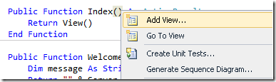
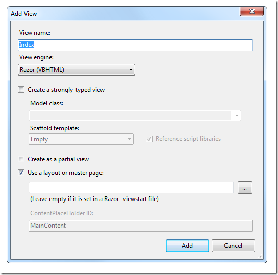
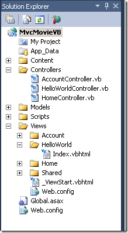
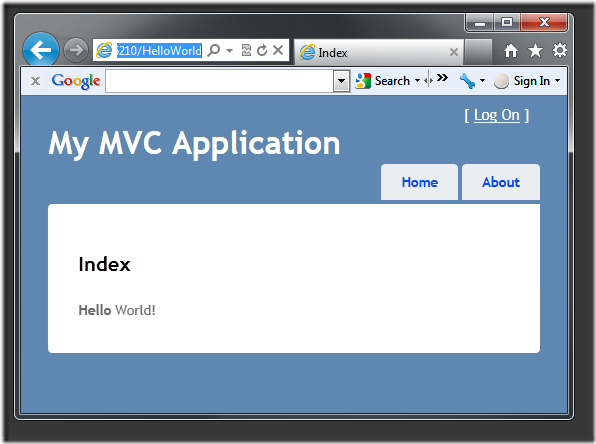
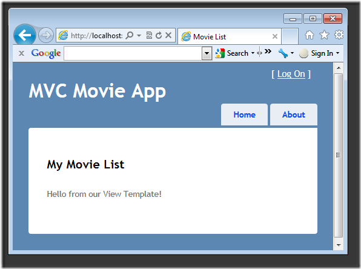
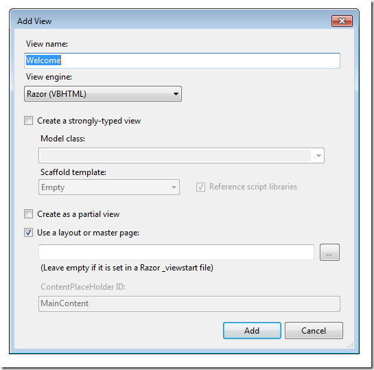
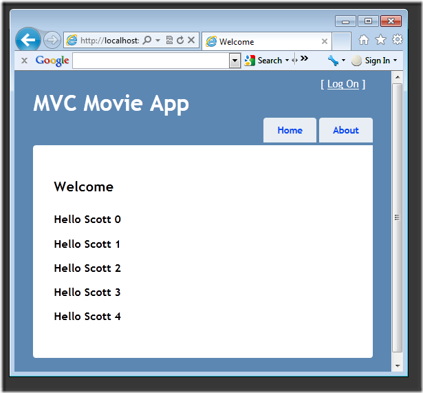

Adding a View (VB)
====================
by [Rick Anderson](https://github.com/Rick-Anderson)

> This tutorial will teach you the basics of building an ASP.NET MVC Web application using Microsoft Visual Web Developer 2010 Express Service Pack 1, which is a free version of Microsoft Visual Studio. Before you start, make sure you've installed the prerequisites listed below. You can install all of them by clicking the following link: [Web Platform Installer](https://www.microsoft.com/web/gallery/install.aspx?appid=VWD2010SP1Pack). Alternatively, you can individually install the prerequisites using the following links:
> 
> - [Visual Studio Web Developer Express SP1 prerequisites](https://www.microsoft.com/web/gallery/install.aspx?appid=VWD2010SP1Pack)
> - [ASP.NET MVC 3 Tools Update](https://www.microsoft.com/web/gallery/install.aspx?appsxml=&amp;appid=MVC3)
> - [SQL Server Compact 4.0](https://www.microsoft.com/web/gallery/install.aspx?appid=SQLCE;SQLCEVSTools_4_0)(runtime + tools support)
> 
> If you're using Visual Studio 2010 instead of Visual Web Developer 2010, install the prerequisites by clicking the following link: [Visual Studio 2010 prerequisites](https://www.microsoft.com/web/gallery/install.aspx?appsxml=&amp;appid=VS2010SP1Pack).
> 
> A Visual Web Developer project with VB.NET source code is available to accompany this topic. [Download the VB.NET version](https://code.msdn.microsoft.com/Introduction-to-MVC-3-10d1b098). If you prefer C#, switch to the [C# version](../cs/adding-a-view.md) of this tutorial.

In this section we're going to modify the `HelloWorldController` class to use a view template file to cleanly encapsulate the process of generating HTML responses to a client.

Let's start by using a view template with the `Index` method in the `HelloWorldController` class. Currently the `Index` method returns a string with a message that is hard-coded within the controller class. Change the `Index` method to return a `View` object, as shown in the following:

[!code-vb[Main](adding-a-view/samples/sample1.vb)]

Let's now add a view template to our project that we can invoke with the `Index` method. To do this, right-click inside the `Index` method and click **Add View**.

The **Add View** dialog box appears. Leave the default entries and click the **Add** button.

The *MvcMovie\Views\HelloWorld* folder and the *MvcMovie\Views\HelloWorld\Index.vbhtml* file are created. You can see them in **Solution Explorer**:

Add some HTML under the `<h2>` tag. The modified *MvcMovie\Views\HelloWorld\Index.vbhtml* file is shown below.

[!code-vbhtml[Main](adding-a-view/samples/sample2.vbhtml)]

Run the application and browse to the &quot;hello world&quot; controller (`http://localhost:xxxx/HelloWorld`). The `Index` method in your controller didn't do much work; it simply ran the statement `return View()`, which indicated that we wanted to use a view template file to render a response to the client. Because we did not explicitly specify the name of the view template file to use, ASP.NET MVC defaulted to using the *Index.vbhtml* view file within the *\Views\HelloWorld* folder. The image below shows the string hard-coded in the view.

Looks pretty good. However, notice that the browser's title bar says &quot;Index&quot; and the big title on the page says &quot;My MVC Application.&quot; Let's change those.

## Changing views and layout pages

First, let's change the text &quot;My MVC Application.&quot; That text is shared and appears on every page. It actually appears in only one place in our project, even though it's on every page in our application. Go to the */Views/Shared* folder in **Solution Explorer** and open the *\_Layout.vbhtml* file. This file is called a layout page and it's the shared &quot;shell&quot; that all other pages use.

Note the `@RenderBody()` line of code near the bottom of the file. `RenderBody` is a placeholder where all the pages you create show up, &quot;wrapped&quot; in the layout page. Change the `<h1>` heading from **&quot;** My MVC Application&quot; to &quot;MVC Movie App&quot;.

[!code-html[Main](adding-a-view/samples/sample3.html)]

Run the application and note it now says &quot;MVC Movie App&quot;. Click the **About** link, and that page shows &quot;MVC Movie App&quot;, too.

The complete *\_Layout.vbhtml* file is shown below:

[!code-cshtml[Main](adding-a-view/samples/sample4.cshtml)]

Now, let's change the title of the Index page (view).

[!code-vbhtml[Main](adding-a-view/samples/sample5.vbhtml)]

Open *MvcMovie\Views\HelloWorld\Index.vbhtml*. There are two places to make a change: first, the text that appears in the title of the browser, and then in the secondary header (the `<h2>` element). We'll make them slightly different so you can see which bit of code changes which part of the app.

Run the application and browse to`http://localhost:xx/HelloWorld`. Notice that the browser title, the primary heading, and the secondary headings have changed. It's easy to make big changes in your application with small changes to a view. (If you don't see changes in the browser, you might be viewing cached content. Press Ctrl+F5 in your browser to force the response from the server to be loaded.)

Our little bit of &quot;data&quot; (in this case the &quot;Hello World!&quot; message) is hard-coded, though. Our MVC application has V (views) and we've got C (controllers), but no M (model) yet. Shortly, we'll walk through how create a database and retrieve model data from it.

## Passing Data from the Controller to the View

Before we go to a database and talk about models, though, let's first talk about passing information from the Controller to a View. We want to pass what a view template requires in order to render an HTML response to a client. These objects are typically created and passed by a controller class to a view template, and they should contain only the data that the view template requires — and no more.

Previously with the `HelloWorldController` class, the `Welcome` action method took a `name` and a `numTimes` parameter and then output the parameter values to the browser. Rather than have the controller continue to render this response directly, let's instead we'll put that data in a bag for the View. Controllers and Views can use a `ViewBag` object to hold that data. That will be passed over to a view template automatically, and used to render the HTML response using the contents of the bag as data. That way the controller is concerned with one thing and the view template with another — enabling us to maintain clean &quot;separation of concerns&quot; within the application.

Alternatively, we could define a custom class, then create an instance of that object on our own, fill it with data and pass it to the View. That is often called a ViewModel, because it's a custom Model for the View. For small amounts of data, however, the ViewBag works great.

Return to the *HelloWorldController.vb* file change the `Welcome` method inside the controller to put the Message and NumTimes into the ViewBag. The ViewBag is a dynamic object. That means you can put whatever you want in to it. The ViewBag has no defined properties until you put something inside it.

The complete `HelloWorldController.vb` with the new class in the same file.

[!code-vb[Main](adding-a-view/samples/sample6.vb)]

Now our ViewBag contains data that will be passed over to the View automatically. Again, alternatively we could have passed in our own object like this if we liked:

[!code-csharp[Main](adding-a-view/samples/sample7.cs)]

Now we need a `WelcomeView` template! Run the application so the new code is compiled. Close the browser, right-click inside the `Welcome` method, and then click **Add View**.

Here's what your **Add View** dialog box looks like.

Add the following code under the `<h2>` element in the new *Welcome.*vbhtml file. We'll make a loop and say &quot;Hello&quot; as many times as the user says we should!

[!code-vbhtml[Main](adding-a-view/samples/sample8.vbhtml)]

Run the application and browse to `http://localhost:xx/HelloWorld/Welcome?name=Scott&numtimes=4`

Now data is taken from the URL and passed to the controller automatically. The controller packages up the data into a `Model` object and passes that object to the view. The view than displays the data as HTML to the user.

Well, that was a kind of an &quot;M&quot; for model, but not the database kind. Let's take what we've learned and create a database of movies.

>[!div class="step-by-step"]
[Previous](adding-a-controller.md)
[Next](adding-a-model.md)