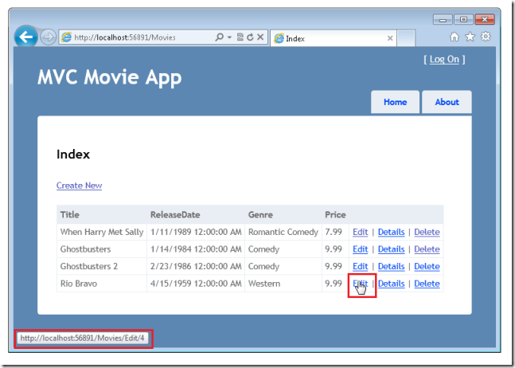
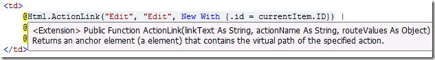
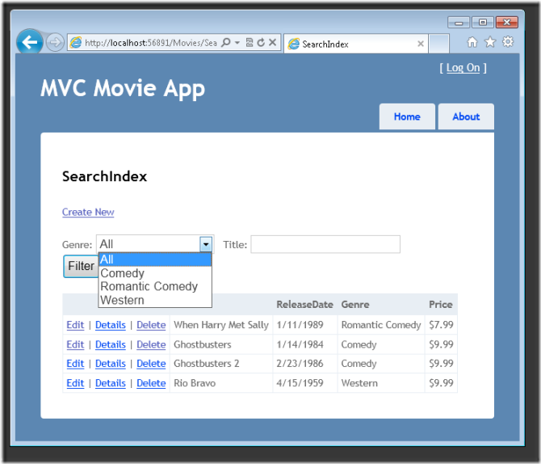
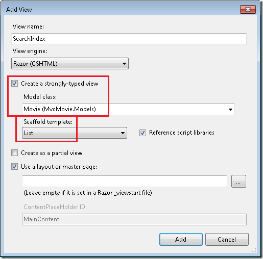
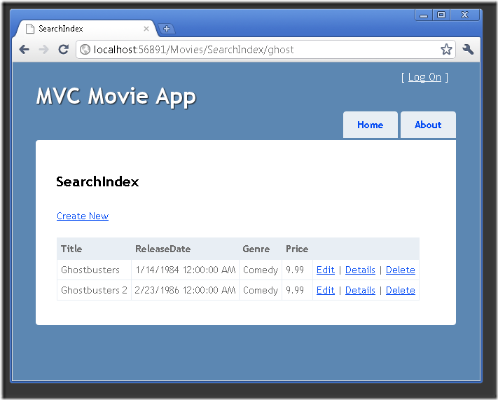

Examining the Edit Methods and Edit View (VB)
====================
by [Rick Anderson](https://github.com/Rick-Anderson)

> This tutorial will teach you the basics of building an ASP.NET MVC Web application using Microsoft Visual Web Developer 2010 Express Service Pack 1, which is a free version of Microsoft Visual Studio. Before you start, make sure you've installed the prerequisites listed below. You can install all of them by clicking the following link: [Web Platform Installer](https://www.microsoft.com/web/gallery/install.aspx?appid=VWD2010SP1Pack). Alternatively, you can individually install the prerequisites using the following links:
> 
> - [Visual Studio Web Developer Express SP1 prerequisites](https://www.microsoft.com/web/gallery/install.aspx?appid=VWD2010SP1Pack)
> - [ASP.NET MVC 3 Tools Update](https://www.microsoft.com/web/gallery/install.aspx?appsxml=&amp;appid=MVC3)
> - [SQL Server Compact 4.0](https://www.microsoft.com/web/gallery/install.aspx?appid=SQLCE;SQLCEVSTools_4_0)(runtime + tools support)
> 
> If you're using Visual Studio 2010 instead of Visual Web Developer 2010, install the prerequisites by clicking the following link: [Visual Studio 2010 prerequisites](https://www.microsoft.com/web/gallery/install.aspx?appsxml=&amp;appid=VS2010SP1Pack).
> 
> A Visual Web Developer project with VB.NET source code is available to accompany this topic. [Download the VB.NET version](https://code.msdn.microsoft.com/Introduction-to-MVC-3-10d1b098). If you prefer C#, switch to the [C# version](../cs/examining-the-edit-methods-and-edit-view.md) of this tutorial.

In this section, you'll examine the generated action methods and views for the movie controller. Then you'll add a custom search page.

Run the application and browse to the `Movies` controller by appending */Movies* to the URL in the address bar of your browser. Hold the mouse pointer over an **Edit** link to see the URL that it links to.

The **Edit** link was generated by the `Html.ActionLink` method in the *Views\Movies\Index.vbhtml* view:

[!code-cshtml[Main](examining-the-edit-methods-and-edit-view/samples/sample1.cshtml)]

The `Html` object is a helper that's exposed using a property on the `WebViewPage` base class. The `ActionLink` method of the helper makes it easy to dynamically generate HTML hyperlinks that link to action methods on controllers. The first argument to the `ActionLink` method is the link text to render (for example, `<a>Edit Me</a>`). The second argument is the name of the action method to invoke. The final argument is an [anonymous object](https://weblogs.asp.net/scottgu/archive/2007/05/15/new-orcas-language-feature-anonymous-types.aspx) that generates the route data (in this case, the ID of 4).

The generated link shown in the previous image is `http://localhost:xxxxx/Movies/Edit/4`. The default route takes the URL pattern `{controller}/{action}/{id}`. Therefore, ASP.NET translates `http://localhost:xxxxx/Movies/Edit/4` into a request to the `Edit` action method of the `Movies` controller with the parameter `ID` equal to 4.

You can also pass action method parameters using a query string. For example, the URL `http://localhost:xxxxx/Movies/Edit?ID=4` also passes the parameter `ID` of 4 to the `Edit` action method of the `Movies` controller.

Open the `Movies` controller. The two `Edit` action methods are shown below.

[!code-vb[Main](examining-the-edit-methods-and-edit-view/samples/sample3.vb)]

Notice the second `Edit` action method is preceded by the `HttpPost` attribute. This attribute specifies that that overload of the `Edit` method can be invoked only for POST requests. You could apply the `HttpGet` attribute to the first edit method, but that's not necessary because it's the default. (We'll refer to action methods that are implicitly assigned the `HttpGet` attribute as `HttpGet` methods.)

The `HttpGet` `Edit` method takes the movie ID parameter, looks up the movie using the Entity Framework `Find` method, and returns the selected movie to the Edit view. When the scaffolding system created the Edit view, it examined the `Movie` class and created code to render `<label>` and `<input>` elements for each property of the class. The following example shows the Edit view that was generated:

[!code-vbhtml[Main](examining-the-edit-methods-and-edit-view/samples/sample4.vbhtml)]

Notice how the view template has a `@ModelType MvcMovie.Models.Movie` statement at the top of the file — this specifies that the view expects the model for the view template to be of type `Movie`.

The scaffolded code uses several *helper methods* to streamline the HTML markup. The [`Html.LabelFor`](https://msdn.microsoft.com/en-us/library/gg401864(VS.98).aspx) helper displays the name of the field (&quot;Title&quot;, &quot;ReleaseDate&quot;, &quot;Genre&quot;, or &quot;Price&quot;). The [`Html.EditorFor`](https://msdn.microsoft.com/en-us/library/system.web.mvc.html.editorextensions.editorfor(VS.98).aspx) helper displays an HTML `<input>` element. The [`Html.ValidationMessageFor`](https://msdn.microsoft.com/en-us/library/system.web.mvc.html.validationextensions.validationmessagefor(VS.98).aspx) helper displays any validation messages associated with that property.

Run the application and navigate to the */Movies* URL. Click an **Edit** link. In the browser, view the source for the page. The HTML in the page looks like the following example. (The menu markup was excluded for clarity.)

[!code-html[Main](examining-the-edit-methods-and-edit-view/samples/sample5.html)]

The `<input>` elements are in an HTML `<form>` element whose `action` attribute is set to post to the */Movies/Edit* URL. The form data will be posted to the server when the **Edit** button is clicked.

## Processing the POST Request

The following listing shows the `HttpPost` version of the `Edit` action method.

[!code-vb[Main](examining-the-edit-methods-and-edit-view/samples/sample6.vb)]

The ASP.NET framework model binder takes the posted form values and creates a `Movie` object that's passed as the `movie` parameter. The `ModelState.IsValid` check in the code verifies that the data submitted in the form can be used to modify a `Movie` object. If the data is valid, the code saves the movie data to the `Movies` collection of the `MovieDBContext` instance. The code then saves the new movie data to the database by calling the `SaveChanges` method of `MovieDBContext`, which persists changes to the database. After saving the data, the code redirects the user to the `Index` action method of the `MoviesController` class, which causes the updated movie to be displayed in the listing of movies.

If the posted values aren't valid, they are redisplayed in the form. The `Html.ValidationMessageFor` helpers in the *Edit.vbhtml* view template take care of displaying appropriate error messages.

> **Note about locales** If you normally work with a locale other than English, see [Supporting ASP.NET MVC 3 Validation with Non-English Locales.](https://msdn.microsoft.com/en-us/library/gg674880(VS.98).aspx)

## Making the Edit Method More Robust

The `HttpGet` `Edit` method generated by the scaffolding system doesn't check that the ID that's passed to it is valid. If a user removes the ID segment from the URL (`http://localhost:xxxxx/Movies/Edit`), the following error is displayed:

A user could also pass an ID that doesn't exist in the database, such as `http://localhost:xxxxx/Movies/Edit/1234`. You can make two changes to the `HttpGet` `Edit` action method to address this limitation. First, change the `ID` parameter to have a default value of zero when an ID isn't explicitly passed. You can also check that the `Find` method actually found a movie before returning the movie object to the view template. The updated `Edit` method is shown below.

[!code-vb[Main](examining-the-edit-methods-and-edit-view/samples/sample7.vb)]

If no movie is found, the `HttpNotFound` method is called.

All the `HttpGet` methods follow a similar pattern. They get a movie object (or list of objects, in the case of `Index`), and pass the model to the view. The `Create` method passes an empty movie object to the Create view. All the methods that create, edit, delete, or otherwise modify data do so in the `HttpPost` overload of the method. Modifying data in an HTTP GET method is a security risk, as described in the blog post entry [ASP.NET MVC Tip #46 – Don't use Delete Links because they create Security Holes](http://stephenwalther.com/blog/archive/2009/01/21/asp.net-mvc-tip-46-ndash-donrsquot-use-delete-links-because.aspx). Modifying data in a GET method also violates HTTP best practices and the architectural REST pattern, which specifies that GET requests should not change the state of your application. In other words, performing a GET operation should be a safe operation that has no side effects.

## Adding a Search Method and Search View

In this section you'll add a `SearchIndex` action method that lets you search movies by genre or name. This will be available using the */Movies/SearchIndex* URL. The request will display an HTML form that contains input elements that a user can fill in in order to search for a movie. When a user submits the form, the action method will get the search values posted by the user and use the values to search the database.

## Displaying the SearchIndex Form

Start by adding a `SearchIndex` action method to the existing `MoviesController` class. The method will return a view that contains an HTML form. Here's the code:

[!code-vb[Main](examining-the-edit-methods-and-edit-view/samples/sample8.vb)]

The first line of the `SearchIndex` method creates the following [LINQ](https://msdn.microsoft.com/en-us/library/bb397926.aspx) query to select the movies:

[!code-vb[Main](examining-the-edit-methods-and-edit-view/samples/sample9.vb)]

The query is defined at this point, but hasn't yet been run against the data store.

If the `searchString` parameter contains a string, the movies query is modified to filter on the value of the search string, using the following code:

If Not String.IsNullOrEmpty(searchString) Then   
 movies = movies.Where(Function(s) s.Title.Contains(searchString))   
 End If

LINQ queries are not executed when they are defined or when they are modified by calling a method such as `Where` or `OrderBy`. Instead, query execution is deferred, which means that the evaluation of an expression is delayed until its realized value is actually iterated over or the [`ToList`](https://msdn.microsoft.com/en-us/library/bb342261.aspx) method is called. In the `SearchIndex` sample, the query is executed in the SearchIndex view. For more information about deferred query execution, see [Query Execution](https://msdn.microsoft.com/en-us/library/bb738633.aspx).

Now you can implement the `SearchIndex` view that will display the form to the user. Right-click inside the `SearchIndex` method and then click **Add View**. In the **Add View** dialog box, specify that you're going to pass a `Movie` object to the view template as its model class. In the **Scaffold template** list, choose **List**, then click **Add**.

When you click the **Add** button, the *Views\Movies\SearchIndex.vbhtml* view template is created. Because you selected **List** in the **Scaffold template** list, Visual Web Developer automatically generated (scaffolded) some default content in the view. The scaffolding created an HTML form. It examined the `Movie` class and created code to render `<label>` elements for each property of the class. The listing below shows the Create view that was generated:

[!code-vbhtml[Main](examining-the-edit-methods-and-edit-view/samples/sample10.vbhtml)]

Run the application and navigate to */Movies/SearchIndex*. Append a query string such as `?searchString=ghost` to the URL. The filtered movies are displayed.

If you change the signature of the `SearchIndex` method to have a parameter named `id`, the `id` parameter will match the `{id}` placeholder for the default routes set in the *Global.asax* file.

[!code-json[Main](examining-the-edit-methods-and-edit-view/samples/sample11.json)]

The modified `SearchIndex` method would look as follows:

[!code-vb[Main](examining-the-edit-methods-and-edit-view/samples/sample12.vb)]

You can now pass the search title as route data (a URL segment) instead of as a query string value.

However, you can't expect users to modify the URL every time they want to search for a movie. So now you you'll add UI to help them filter movies. If you changed the signature of the `SearchIndex` method to test how to pass the route-bound ID parameter, change it back so that your `SearchIndex` method takes a string parameter named `searchString`:

Open the *Views\Movies\SearchIndex.vbhtml* file, and just after `@Html.ActionLink("Create New", "Create")`, add the following:

[!code-vbhtml[Main](examining-the-edit-methods-and-edit-view/samples/sample13.vbhtml)]

The `Html.BeginForm` helper creates an opening `<form>` tag. The `Html.BeginForm` helper causes the form to post to itself when the user submits the form by clicking the **Filter** button.

Run the application and try searching for a movie.

There's no `HttpPost` overload of the `SearchIndex` method. You don't need it, because the method isn't changing the state of the application, just filtering data. If you added the following `HttpPost` `SearchIndex` method, the action invoker would match the `HttpPost` `SearchIndex` method, and the `HttpPost` `SearchIndex` method would run as shown in the image below.

[!code-vb[Main](examining-the-edit-methods-and-edit-view/samples/sample14.vb)]

## Adding Search by Genre

If you added the `HttpPost` version of the `SearchIndex` method, delete it now.

Next, you'll add a feature to let users search for movies by genre. Replace the `SearchIndex` method with the following code:

[!code-vb[Main](examining-the-edit-methods-and-edit-view/samples/sample15.vb)]

This version of the `SearchIndex` method takes an additional parameter, namely `movieGenre`. The first few lines of code create a `List` object to hold movie genres from the database.

The following code is a LINQ query that retrieves all the genres from the database.

[!code-vb[Main](examining-the-edit-methods-and-edit-view/samples/sample16.vb)]

The code uses the `AddRange` method of the generic `List` collection to add all the distinct genres to the list. (Without the `Distinct` modifier, duplicate genres would be added — for example, comedy would be added twice in our sample). The code then stores the list of genres in the `ViewBag` object.

The following code shows how to check the `movieGenre` parameter. If it's not empty the code further constrains the movies query to limit the selected movies to the specified genre.

[!code-vb[Main](examining-the-edit-methods-and-edit-view/samples/sample17.vb)]

## Adding Markup to the SearchIndex View to Support Search by Genre

Add an `Html.DropDownList` helper to the *Views\Movies\SearchIndex.vbhtml* file, just before the `TextBox` helper. The completed markup is shown below:

[!code-vbhtml[Main](examining-the-edit-methods-and-edit-view/samples/sample18.vbhtml)]

Run the application and browse to */Movies/SearchIndex*. Try a search by genre, by movie name, and by both criteria.

In this section you examined the CRUD action methods and views generated by the framework. You created a search action method and view that let users search by movie title and genre. In the next section, you'll look at how to add a property to the `Movie` model and how to add an initializer that will automatically create a test database.

>[!div class="step-by-step"]
[Previous](accessing-your-models-data-from-a-controller.md)
[Next](adding-a-new-field.md)