Accessing Your Model's Data from a Controller
====================
by [Rick Anderson](https://github.com/Rick-Anderson)

> > [!NOTE]
> > An updated version of this tutorial is available [here](../../getting-started/introduction/getting-started.md) that uses ASP.NET MVC 5 and Visual Studio 2013. It's more secure, much simpler to follow and demonstrates more features.

In this section, you'll create a new `MoviesController` class and write code that retrieves the movie data and displays it in the browser using a view template.

**Build the application** before going on to the next step.

Right-click the *Controllers* folder and create a new `MoviesController` controller. The options below will not appear until you build your application. Select the following options:

- Controller name: **MoviesController**. (This is the default. )
- Template: **MVC Controller with read/write actions and views, using Entity Framework**.
- Model class: **Movie (MvcMovie.Models)**.
- Data context class: **MovieDBContext (MvcMovie.Models)**.
- Views: **Razor (CSHTML)**. (The default.)

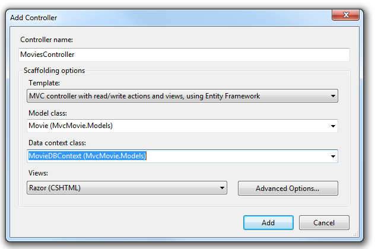

Click **Add**. Visual Studio Express creates the following files and folders:

- *A MoviesController.cs* file in the project's *Controllers* folder.
- A *Movies* folder in the project's *Views* folder.
- *Create.cshtml, Delete.cshtml, Details.cshtml, Edit.cshtml*, and *Index.cshtml* in the new *Views\Movies* folder.

ASP.NET MVC 4 automatically created the CRUD (create, read, update, and delete) action methods and views for you (the automatic creation of CRUD action methods and views is known as scaffolding). You now have a fully functional web application that lets you create, list, edit, and delete movie entries.

Run the application and browse to the `Movies` controller by appending */Movies* to the URL in the address bar of your browser. Because the application is relying on the default routing (defined in the *Global.asax* file), the browser request `http://localhost:xxxxx/Movies` is routed to the default `Index` action method of the `Movies` controller. In other words, the browser request `http://localhost:xxxxx/Movies` is effectively the same as the browser request `http://localhost:xxxxx/Movies/Index`. The result is an empty list of movies, because you haven't added any yet.

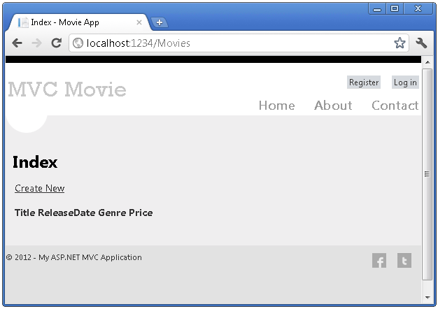

### Creating a Movie

Select the **Create New** link. Enter some details about a movie and then click the **Create** button.

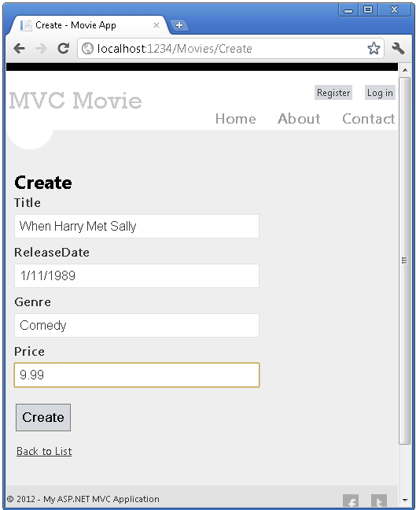

Clicking the **Create** button causes the form to be posted to the server, where the movie information is saved in the database. You're then redirected to the */Movies* URL, where you can see the newly created movie in the listing.

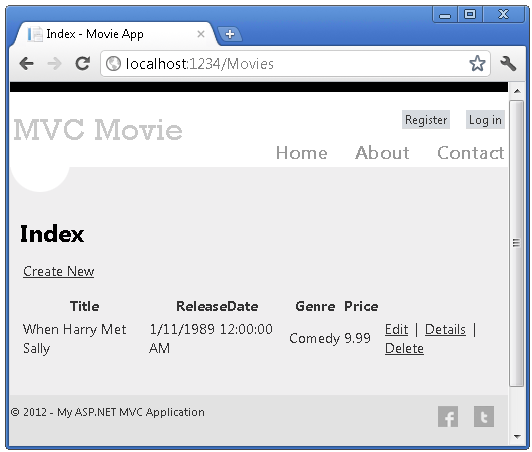

Create a couple more movie entries. Try the **Edit**, **Details**, and **Delete** links, which are all functional.

## Examining the Generated Code

Open the *Controllers\MoviesController.cs* file and examine the generated `Index` method. A portion of the movie controller with the `Index` method is shown below.

[!code-csharp[Main](accessing-your-models-data-from-a-controller/samples/sample1.cs)]

The following line from the `MoviesController` class instantiates a movie database context, as described previously. You can use the movie database context to query, edit, and delete movies.

[!code-csharp[Main](accessing-your-models-data-from-a-controller/samples/sample2.cs)]

A request to the `Movies` controller returns all the entries in the `Movies` table of the movie database and then passes the results to the `Index` view.

## Strongly Typed Models and the @model Keyword

Earlier in this tutorial, you saw how a controller can pass data or objects to a view template using the `ViewBag` object. The `ViewBag` is a dynamic object that provides a convenient late-bound way to pass information to a view.

ASP.NET MVC also provides the ability to pass strongly typed data or objects to a view template. This strongly typed approach enables better compile-time checking of your code and richer IntelliSense in the Visual Studio editor. The scaffolding mechanism in Visual Studio used this approach with the `MoviesController` class and view templates when it created the methods and views.

In the *Controllers\MoviesController.cs* file examine the generated `Details` method. A portion of the movie controller with the `Details` method is shown below.

[!code-csharp[Main](accessing-your-models-data-from-a-controller/samples/sample3.cs?highlight=3,8)]

If a `Movie` is found, an instance of the `Movie` model is passed to the Details view. Examine the contents of the *Views\Movies\Details.cshtml* file.

By including a `@model` statement at the top of the view template file, you can specify the type of object that the view expects. When you created the movie controller, Visual Studio automatically included the following `@model` statement at the top of the *Details.cshtml* file:

[!code-cshtml[Main](accessing-your-models-data-from-a-controller/samples/sample4.cshtml)]

This `@model` directive allows you to access the movie that the controller passed to the view by using a `Model` object that's strongly typed. For example, in the *Details.cshtml* template, the code passes each movie field to the `DisplayNameFor` and [DisplayFor](https://msdn.microsoft.com/en-us/library/system.web.mvc.html.displayextensions.displayfor(VS.98).aspx) HTML Helpers with the strongly typed `Model` object. The Create and Edit methods and view templates also pass a movie model object.

Examine the *Index.cshtml* view template and the `Index` method in the *MoviesController.cs* file. Notice how the code creates a [`List`](https://msdn.microsoft.com/en-us/library/6sh2ey19.aspx) object when it calls the `View` helper method in the `Index` action method. The code then passes this `Movies` list from the controller to the view:

[!code-csharp[Main](accessing-your-models-data-from-a-controller/samples/sample5.cs?highlight=3)]

When you created the movie controller, Visual Studio Express automatically included the following `@model` statement at the top of the *Index.cshtml* file:

[!code-cshtml[Main](accessing-your-models-data-from-a-controller/samples/sample6.cshtml)]

This `@model` directive allows you to access the list of movies that the controller passed to the view by using a `Model` object that's strongly typed. For example, in the *Index.cshtml* template, the code loops through the movies by doing a `foreach` statement over the strongly typed `Model` object:

[!code-cshtml[Main](accessing-your-models-data-from-a-controller/samples/sample7.cshtml?highlight=1,4,7,10,13,16,19-21)]

Because the `Model` object is strongly typed (as an `IEnumerable<Movie>` object), each `item` object in the loop is typed as `Movie`. Among other benefits, this means that you get compile-time checking of the code and full IntelliSense support in the code editor:

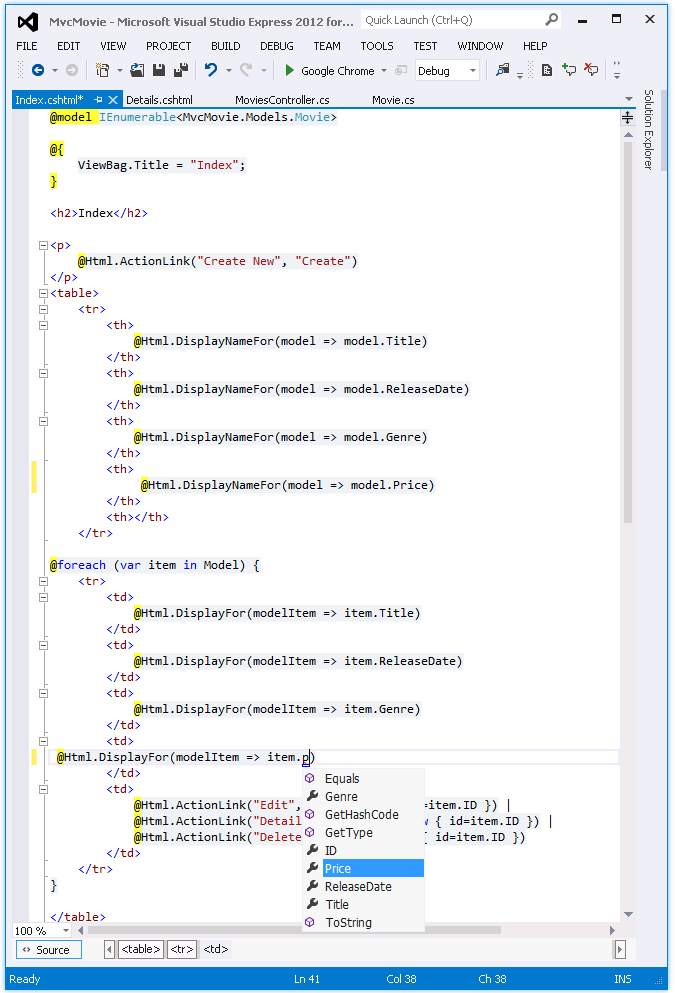

## Working with SQL Server LocalDB

Entity Framework Code First detected that the database connection string that was provided pointed to a `Movies` database that didn't exist yet, so Code First created the database automatically. You can verify that it's been created by looking in the *App\_Data* folder. If you don't see the *Movies.mdf* file, click the **Show All Files** button in the **Solution Explorer** toolbar, click the **Refresh** button, and then expand the *App\_Data* folder.

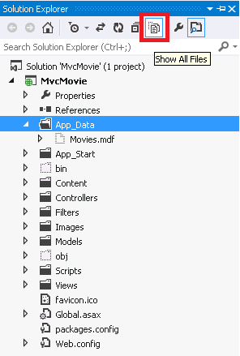

Double-click *Movies.mdf* to open **DATABASE EXPLORER**, then expand the **Tables** folder to see the Movies table.

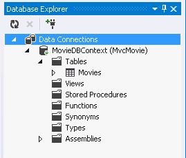

> [!NOTE]
> If the database explorer doesn't appear, from the **TOOLS** menu, select **Connect to Database**, then cancel the **Choose Data Source** dialog. This will force open the database explorer.

> [!NOTE]
> If you are using VWD or Visual Studio 2010 and get an error similar to any of the following following:
> 
> - The database 'C:\Webs\MVC4\MVCMOVIE\MVCMOVIE\APP\_DATA\MOVIES.MDF' cannot be opened because it is version 706. This server supports version 655 and earlier. A downgrade path is not supported.
> - &quot;InvalidOperation Exception was unhandled by user code&quot; The supplied SqlConnection does not specify an initial catalog.
> 
> You need to install the [SQL Server Data Tools](https://blogs.msdn.com/b/rickandy/archive/2012/08/02/installing-and-using-sql-server-data-tools-ssdt-on-visual-studio-2010-and-vwd.aspx) and [LocalDB](https://www.microsoft.com/web/gallery/install.aspx?appid=SQLLocalDBOnly_11_0). Verify the `MovieDBContext` connection string specified on the previous page.

Right-click the `Movies` table and select **Show Table Data** to see the data you created.

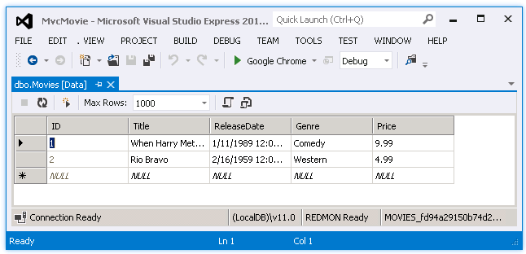

Right-click the `Movies` table and select **Open Table Definition** to see the table structure that Entity Framework Code First created for you.

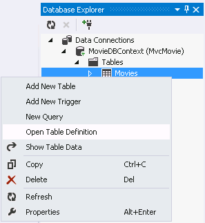

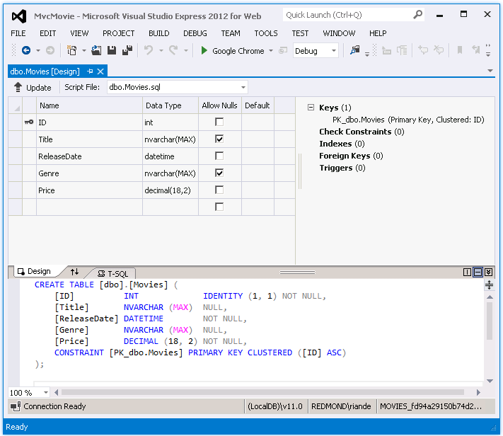

Notice how the schema of the `Movies` table maps to the `Movie` class you created earlier. Entity Framework Code First automatically created this schema for you based on your `Movie` class.

When you're finished, close the connection by right clicking *MovieDBContext* and selecting **Close Connection**. (If you don't close the connection, you might get an error the next time you run the project).

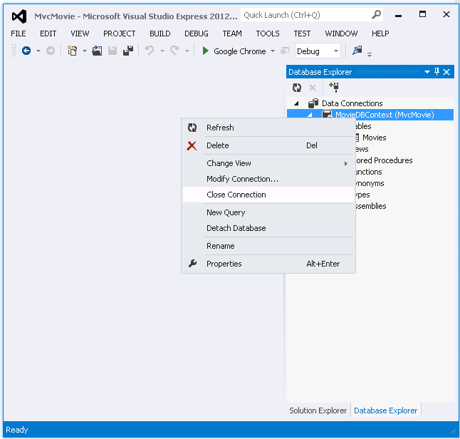

You now have the database and a simple listing page to display content from it. In the next tutorial, we'll examine the rest of the scaffolded code and add a `SearchIndex` method and a `SearchIndex` view that lets you search for movies in this database.

>[!div class="step-by-step"]
[Previous](adding-a-model.md)
[Next](examining-the-edit-methods-and-edit-view.md)