Adding a View
====================
by [Rick Anderson](https://github.com/Rick-Anderson)

> > [!NOTE]
> > An updated version of this tutorial is available [here](../../getting-started/introduction/getting-started.md) that uses ASP.NET MVC 5 and Visual Studio 2013. It's more secure, much simpler to follow and demonstrates more features.

In this section you're going to modify the `HelloWorldController` class to use view template files to cleanly encapsulate the process of generating HTML responses to a client.

You'll create a view template file using the [Razor view engine](https://weblogs.asp.net/scottgu/archive/2010/07/02/introducing-razor.aspx) introduced with ASP.NET MVC 3. Razor-based view templates have a *.cshtml* file extension, and provide an elegant way to create HTML output using C#. Razor minimizes the number of characters and keystrokes required when writing a view template, and enables a fast, fluid coding workflow.

Currently the `Index` method returns a string with a message that is hard-coded in the controller class. Change the `Index` method to return a `View` object, as shown in the following code:

[!code-csharp[Main](adding-a-view/samples/sample1.cs)]

The `Index` method above uses a view template to generate an HTML response to the browser. Controller methods (also known as [action methods](http://rachelappel.com/asp.net-mvc-actionresults-explained)), such as the `Index` method above, generally return an [ActionResult](https://msdn.microsoft.com/en-us/library/system.web.mvc.actionresult.aspx) (or a class derived from [ActionResult](https://msdn.microsoft.com/en-us/library/system.web.mvc.actionresult.aspx)), not primitive types like string.

In the project, add a view template that you can use with the `Index` method. To do this, right-click inside the `Index` method and click **Add View**.

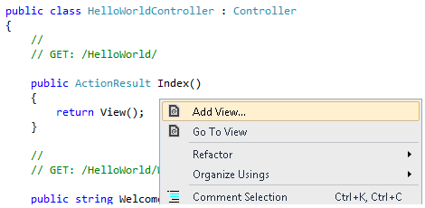

The **Add View** dialog box appears. Leave the defaults the way they are and click the **Add** button:

The *MvcMovie\Views\HelloWorld* folder and the *MvcMovie\Views\HelloWorld\Index.cshtml* file are created. You can see them in **Solution Explorer**:

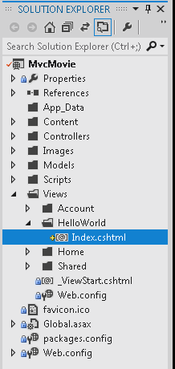

The following shows the *Index.cshtml* file that was created:

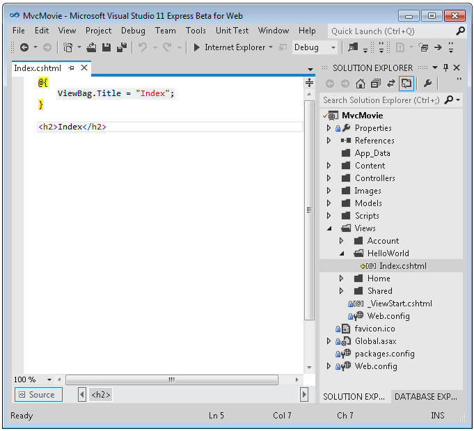

Add the following HTML under the `<h2>` tag.

[!code-html[Main](adding-a-view/samples/sample2.html)]

The complete *MvcMovie\Views\HelloWorld\Index.cshtml* file is shown below.

[!code-cshtml[Main](adding-a-view/samples/sample3.cshtml?highlight=7-8)]

If you are using Visual Studio 2012, in solution explorer, right click the *Index.cshtml* file and select **View in Page Inspector**.

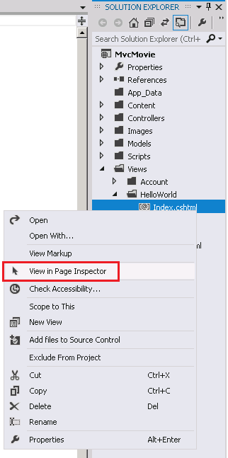

The [Page Inspector tutorial](../../views/using-page-inspector-in-aspnet-mvc.md) has more information about this new tool.

Alternatively, run the application and browse to the `HelloWorld` controller (`http://localhost:xxxx/HelloWorld`). The `Index` method in your controller didn't do much work; it simply ran the statement `return View()`, which specified that the method should use a view template file to render a response to the browser. Because you didn't explicitly specify the name of the view template file to use, ASP.NET MVC defaulted to using the *Index.cshtml* view file in the *\Views\HelloWorld* folder. The image below shows the string &quot;Hello from our View Template!&quot; hard-coded in the view.

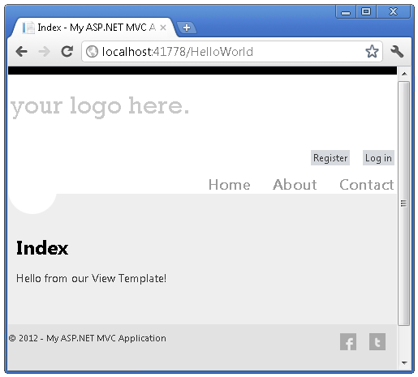

Looks pretty good. However, notice that the browser's title bar shows &quot;Index My ASP.NET A&quot; and the big link on the top of the page says &quot;your logo here.&quot; Below the &quot;your logo here.&quot; link are registration and log in links, and below that links to Home, About and Contact pages. Let's change some of these.

## Changing Views and Layout Pages

First, you want to change the &quot;your logo here.&quot; title at the top of the page. That text is common to every page. It's actually implemented in only one place in the project, even though it appears on every page in the application. Go to the */Views/Shared* folder in **Solution Explorer** and open the *\_Layout.cshtml* file. This file is called a *layout page* and it's the shared &quot;shell&quot; that all other pages use.

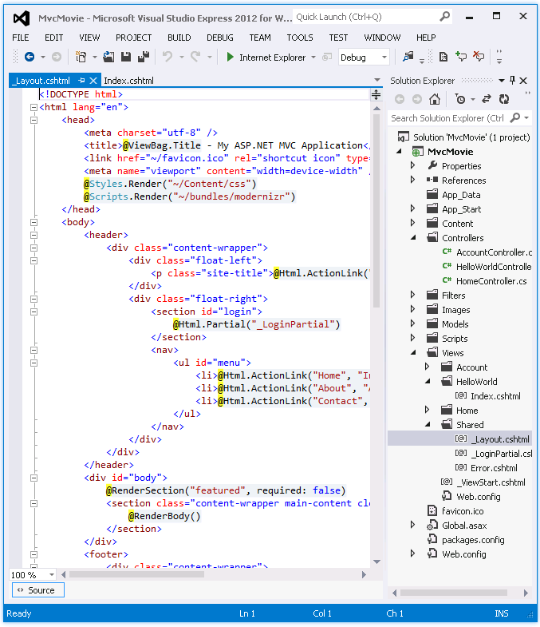

Layout templates allow you to specify the HTML container layout of your site in one place and then apply it across multiple pages in your site. Find the `@RenderBody()` line. `RenderBody` is a placeholder where all the view-specific pages you create show up, &quot;wrapped&quot; in the layout page. For example, if you select the About link, the *Views\Home\About.cshtml* view is rendered inside the `RenderBody` method.

Change the site-title heading in the layout template from &quot;your logo here&quot; to &quot;MVC Movie&quot;.

[!code-cshtml[Main](adding-a-view/samples/sample4.cshtml)]

Replace the contents of the title element with the following markup:

[!code-cshtml[Main](adding-a-view/samples/sample5.cshtml)]

Run the application and notice that it now says &quot;MVC Movie &quot;. Click the **About** link, and you see how that page shows &quot;MVC Movie&quot;, too. We were able to make the change once in the layout template and have all pages on the site reflect the new title.

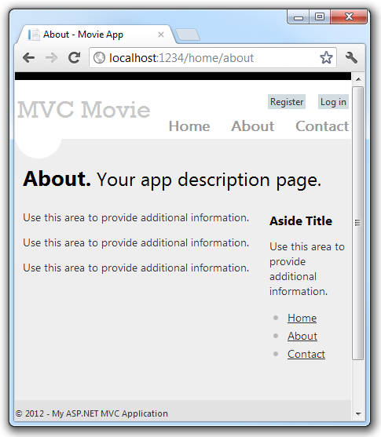

Now, let's change the title of the Index view.

Open *MvcMovie\Views\HelloWorld\Index.cshtml*. There are two places to make a change: first, the text that appears in the title of the browser, and then in the secondary header (the `<h2>` element). You'll make them slightly different so you can see which bit of code changes which part of the app.

[!code-cshtml[Main](adding-a-view/samples/sample6.cshtml)]

To indicate the HTML title to display, the code above sets a `Title` property of the `ViewBag` object (which is in the *Index.cshtml* view template). If you look back at the source code of the layout template, you'll notice that the template uses this value in the `<title>` element as part of the `<head>` section of the HTML that we modified previously. Using this `ViewBag` approach, you can easily pass other parameters between your view template and your layout file.

Run the application and browse to `http://localhost:xx/HelloWorld`. Notice that the browser title, the primary heading, and the secondary headings have changed. (If you don't see changes in the browser, you might be viewing cached content. Press Ctrl+F5 in your browser to force the response from the server to be loaded.) The browser title is created with the `ViewBag.Title` we set in the *Index.cshtml* view template and the additional &quot;- Movie App&quot; added in the layout file.

Also notice how the content in the *Index.cshtml* view template was merged with the *\_Layout.cshtml* view template and a single HTML response was sent to the browser. Layout templates make it really easy to make changes that apply across all of the pages in your application.

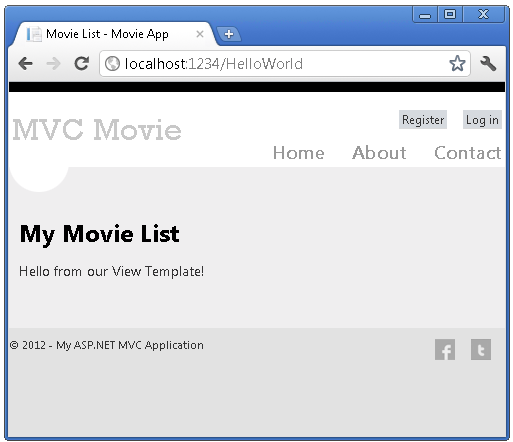

Our little bit of &quot;data&quot; (in this case the &quot;Hello from our View Template!&quot; message) is hard-coded, though. The MVC application has a &quot;V&quot; (view) and you've got a &quot;C&quot; (controller), but no &quot;M&quot; (model) yet. Shortly, we'll walk through how create a database and retrieve model data from it.

## Passing Data from the Controller to the View

Before we go to a database and talk about models, though, let's first talk about passing information from the controller to a view. Controller classes are invoked in response to an incoming URL request. A controller class is where you write the code that handles the incoming browser requests, retrieves data from a database, and ultimately decides what type of response to send back to the browser. View templates can then be used from a controller to generate and format an HTML response to the browser.

Controllers are responsible for providing whatever data or objects are required in order for a view template to render a response to the browser. A best practice: **A view template should never perform business logic or interact with a database directly**. Instead, a view template should work only with the data that's provided to it by the controller. Maintaining this &quot;separation of concerns&quot; helps keep your code clean, testable and more maintainable.

Currently, the `Welcome` action method in the `HelloWorldController` class takes a `name` and a `numTimes` parameter and then outputs the values directly to the browser. Rather than have the controller render this response as a string, let's change the controller to use a view template instead. The view template will generate a dynamic response, which means that you need to pass appropriate bits of data from the controller to the view in order to generate the response. You can do this by having the controller put the dynamic data (parameters) that the view template needs in a `ViewBag` object that the view template can then access.

Return to the *HelloWorldController.cs* file and change the `Welcome` method to add a `Message` and `NumTimes` value to the `ViewBag` object. `ViewBag` is a dynamic object, which means you can put whatever you want in to it; the `ViewBag` object has no defined properties until you put something inside it. The [ASP.NET MVC model binding system](http://odetocode.com/Blogs/scott/archive/2009/04/27/6-tips-for-asp-net-mvc-model-binding.aspx) automatically maps the named parameters (`name` and `numTimes`) from the query string in the address bar to parameters in your method. The complete *HelloWorldController.cs* file looks like this:

[!code-csharp[Main](adding-a-view/samples/sample7.cs)]

Now the `ViewBag` object contains data that will be passed to the view automatically.

Next, you need a Welcome view template! In the **Build** menu, select **Build MvcMovie** to make sure the project is compiled.

Then right-click inside the `Welcome` method and click **Add View**.

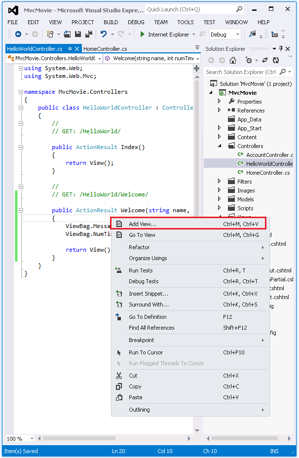

Here's what the **Add View** dialog box looks like:

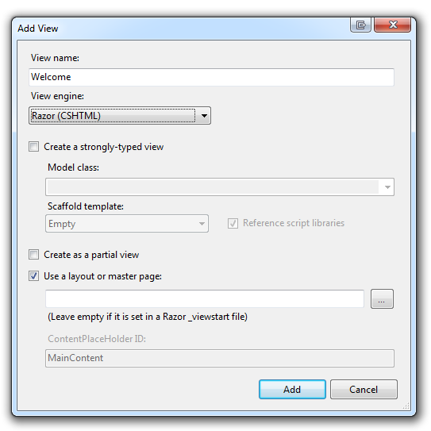

Click **Add**, and then add the following code under the `<h2>` element in the new *Welcome.cshtml* file. You'll create a loop that says &quot;Hello&quot; as many times as the user says it should. The complete *Welcome.cshtml* file is shown below.

[!code-cshtml[Main](adding-a-view/samples/sample8.cshtml)]

Run the application and browse to the following URL:

`http://localhost:xx/HelloWorld/Welcome?name=Scott&numtimes=4`

Now data is taken from the URL and passed to the controller using the [model binder](http://odetocode.com/Blogs/scott/archive/2009/04/27/6-tips-for-asp-net-mvc-model-binding.aspx). The controller packages the data into a `ViewBag` object and passes that object to the view. The view then displays the data as HTML to the user.

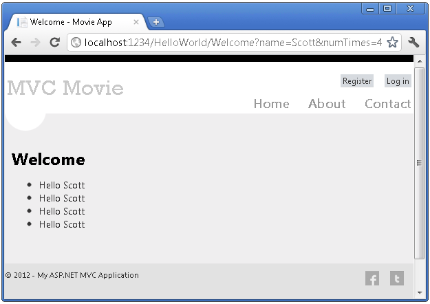

In the sample above, we used a `ViewBag` object to pass data from the controller to a view. Latter in the tutorial, we will use a view model to pass data from a controller to a view. The view model approach to passing data is generally much preferred over the view bag approach. See the blog entry [Dynamic V Strongly Typed Views](https://blogs.msdn.com/b/rickandy/archive/2011/01/28/dynamic-v-strongly-typed-views.aspx) for more information.

Well, that was a kind of an &quot;M&quot; for model, but not the database kind. Let's take what we've learned and create a database of movies.

>[!div class="step-by-step"]
[Previous](adding-a-controller.md)
[Next](adding-a-model.md)