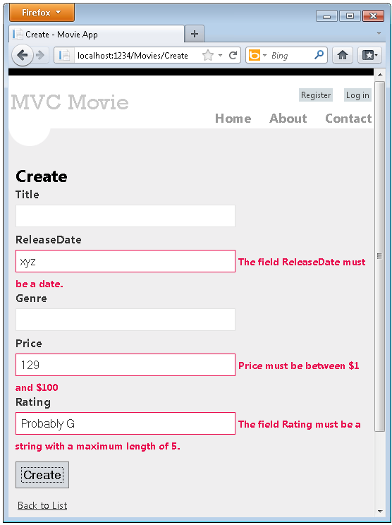
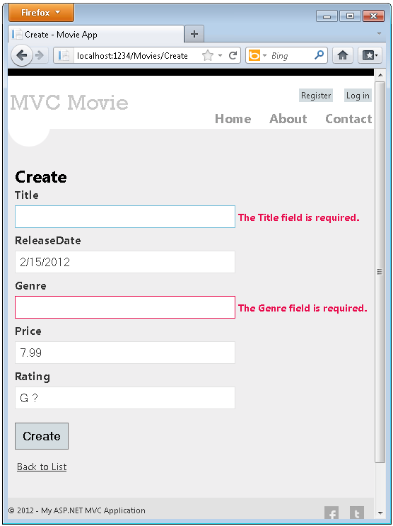
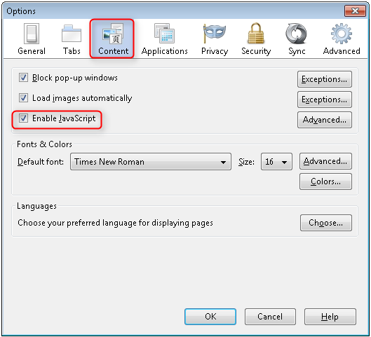
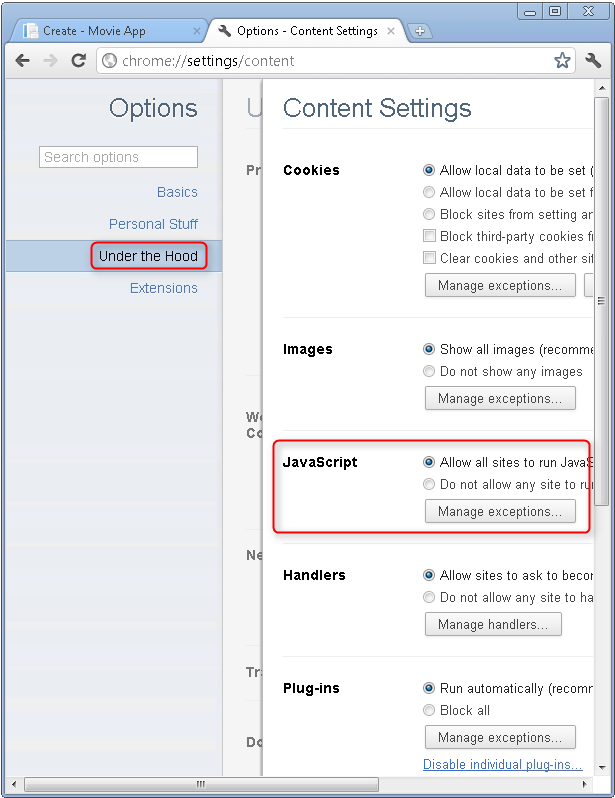
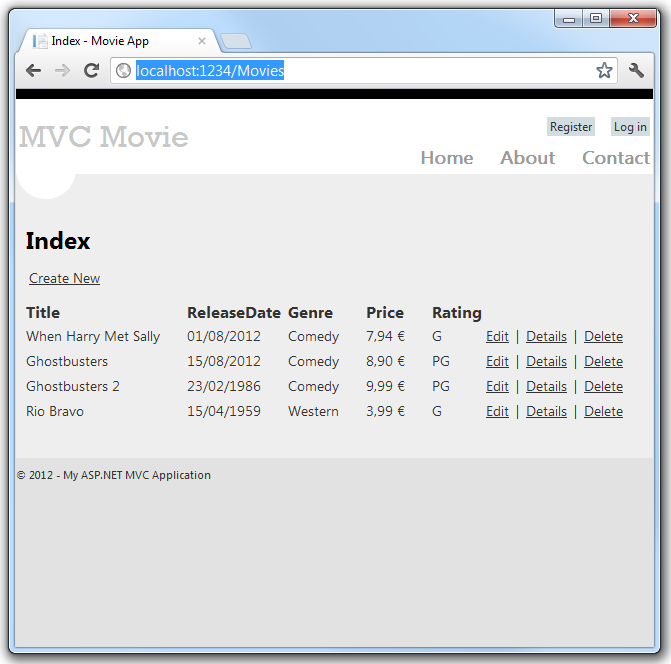
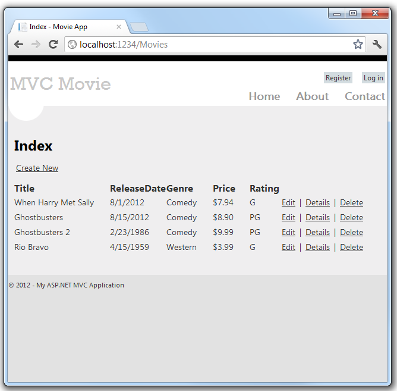

Adding Validation to the Model
====================
by [Rick Anderson](https://github.com/Rick-Anderson)

> > [!NOTE]
> > An updated version of this tutorial is available [here](../../getting-started/introduction/getting-started.md) that uses ASP.NET MVC 5 and Visual Studio 2013. It's more secure, much simpler to follow and demonstrates more features.

In this this section you'll add validation logic to the `Movie` model, and you'll ensure that the validation rules are enforced any time a user attempts to create or edit a movie using the application.

## Keeping Things DRY

One of the core design tenets of ASP.NET MVC is DRY (&quot;Don't Repeat Yourself&quot;). ASP.NET MVC encourages you to specify functionality or behavior only once, and then have it be reflected everywhere in an application. This reduces the amount of code you need to write and makes the code you do write less error prone and easier to maintain.

The validation support provided by ASP.NET MVC and Entity Framework Code First is a great example of the DRY principle in action. You can declaratively specify validation rules in one place (in the model class) and the rules are enforced everywhere in the application.

Let's look at how you can take advantage of this validation support in the movie application.

## Adding Validation Rules to the Movie Model

You'll begin by adding some validation logic to the `Movie` class.

Open the *Movie.cs* file. Add a `using` statement at the top of the file that references the [`System.ComponentModel.DataAnnotations`](https://msdn.microsoft.com/en-us/library/system.componentmodel.dataannotations.aspx) namespace:

[!code-csharp[Main](adding-validation-to-the-model/samples/sample1.cs)]

Notice the namespace does not contain `System.Web`. DataAnnotations provides a built-in set of validation attributes that you can apply declaratively to any class or property.

Now update the `Movie` class to take advantage of the built-in [`Required`](https://msdn.microsoft.com/en-us/library/system.componentmodel.dataannotations.requiredattribute.aspx), [`StringLength`](https://msdn.microsoft.com/en-us/library/system.componentmodel.dataannotations.stringlengthattribute.aspx), and [`Range`](https://msdn.microsoft.com/en-us/library/system.componentmodel.dataannotations.rangeattribute.aspx) validation attributes. Use the following code as an example of where to apply the attributes.

[!code-csharp[Main](adding-validation-to-the-model/samples/sample2.cs?highlight=4,10,13,17)]

Run the application and you will again get the following run time error:

***The model backing the 'MovieDBContext' context has changed since the database was created. Consider using Code First Migrations to update the database ([https://go.microsoft.com/fwlink/?LinkId=238269](https://go.microsoft.com/fwlink/?LinkId=238269)).***

We will use migrations to update the schema. Build the solution, and then open the **Package Manager Console** window and enter the following commands:

[!code-console[Main](adding-validation-to-the-model/samples/sample3.cmd)]

When this command finishes, Visual Studio opens the class file that defines the new `DbMIgration` derived class with the name specified (*AddDataAnnotationsMig*), and in the `Up` method you can see the code that updates the schema constraints. The `Title` and `Genre` fields are no longer nullable (that is, you must enter a value) and the `Rating` field has a maximum length of 5.

The validation attributes specify behavior that you want to enforce on the model properties they are applied to. The `Required` attribute indicates that a property must have a value; in this sample, a movie has to have values for the `Title`, `ReleaseDate`, `Genre`, and `Price` properties in order to be valid. The `Range` attribute constrains a value to within a specified range. The `StringLength` attribute lets you set the maximum length of a string property, and optionally its minimum length. Intrinsic types (such as `decimal, int, float, DateTime`) are required by default and don't need the `Required` attribute.

Code First ensures that the validation rules you specify on a model class are enforced before the application saves changes in the database. For example, the code below will throw an exception when the `SaveChanges` method is called, because several required `Movie` property values are missing and the price is zero (which is out of the valid range).

[!code-csharp[Main](adding-validation-to-the-model/samples/sample4.cs?highlight=7-8)]

Having validation rules automatically enforced by the .NET Framework helps make your application more robust. It also ensures that you can't forget to validate something and inadvertently let bad data into the database.

Here's a complete code listing for the updated *Movie.cs* file:

[!code-csharp[Main](adding-validation-to-the-model/samples/sample5.cs)]

## Validation Error UI in ASP.NET MVC

Re-run the application and navigate to the */Movies* URL.

Click the **Create New** link to add a new movie. Fill out the form with some invalid values and then click the **Create** button.

> [!NOTE]
> to support jQuery validation for non-English locales that use a comma (&quot;,&quot;) for a decimal point, you must include *globalize.js* and your specific *cultures/globalize.cultures.js* file(from [https://github.com/jquery/globalize](https://github.com/jquery/globalize) ) and JavaScript to use `Globalize.parseFloat`. The following code shows the modifications to the Views\Movies\Edit.cshtml file to work with the &quot;fr-FR&quot; culture:

[!code-cshtml[Main](adding-validation-to-the-model/samples/sample6.cshtml)]

Notice how the form has automatically used a red border color to highlight the text boxes that contain invalid data and has emitted an appropriate validation error message next to each one. The errors are enforced both client-side (using JavaScript and jQuery) and server-side (in case a user has JavaScript disabled).

A real benefit is that you didn't need to change a single line of code in the `MoviesController` class or in the *Create.cshtml* view in order to enable this validation UI. The controller and views you created earlier in this tutorial automatically picked up the validation rules that you specified by using validation attributes on the properties of the `Movie` model class.

You might have noticed for the properties `Title` and `Genre`, the required attribute is not enforced until you submit the form (hit the **Create** button), or enter text into the input field and removed it. For a field which is initially empty (such as the fields on the Create view) and which has only the required attribute and no other validation attributes, you can do the following to trigger validation:

1. Tab into the field.
2. Enter some text.
3. Tab out.
4. Tab back into the field.
5. Remove the text.
6. Tab out.

The above sequence will trigger the required validation without hitting the submit button. Simply hitting the submit button without entering any of the fields will trigger client side validation. The form data is not sent to the server until there are no client side validation errors. You can test this by putting a break point in the HTTP Post method or using the [fiddler tool](http://fiddler2.com/fiddler2/) or the IE 9 [F12 developer tools](https://msdn.microsoft.com/en-us/ie/aa740478).

## How Validation Occurs in the Create View and Create Action Method

You might wonder how the validation UI was generated without any updates to the code in the controller or views. The next listing shows what the `Create` methods in the `MovieController` class look like. They're unchanged from how you created them earlier in this tutorial.

[!code-csharp[Main](adding-validation-to-the-model/samples/sample7.cs?highlight=12,15)]

The first (HTTP GET) `Create` action method displays the initial Create form. The second (`[HttpPost]`) version handles the form post. The second `Create` method (The `HttpPost` version) calls `ModelState.IsValid` to check whether the movie has any validation errors. Calling this method evaluates any validation attributes that have been applied to the object. If the object has validation errors, the `Create` method re-displays the form. If there are no errors, the method saves the new movie in the database. In our movie example we are using, **the form is not posted to the server when their are validation errors detected on the client side; the second** `Create`**method is never called**. If you disable JavaScript in your browser, client validation is disabled and the HTTP POST `Create` method calls `ModelState.IsValid` to check whether the movie has any validation errors.

You can set a break point in the `HttpPost Create` method and verify the method is never called, client side validation will not submit the form data when validation errors are detected. If you disable JavaScript in your browser, then submit the form with errors, the break point will be hit. You still get full validation without JavaScript. The following image shows how to disable JavaScript in Internet Explorer.

The following image shows how to disable JavaScript in the FireFox browser.

The following image shows how to disable JavaScript with the Chrome browser.

Below is the *Create.cshtml* view template that you scaffolded earlier in the tutorial. It's used by the action methods shown above both to display the initial form and to redisplay it in the event of an error.

[!code-cshtml[Main](adding-validation-to-the-model/samples/sample8.cshtml?highlight=22-23,30-31,38-39,46-47)]

Notice how the code uses an `Html.EditorFor` helper to output the `<input>` element for each `Movie` property. Next to this helper is a call to the `Html.ValidationMessageFor` helper method. These two helper methods work with the model object that's passed by the controller to the view (in this case, a `Movie` object). They automatically look for validation attributes specified on the model and display error messages as appropriate.

What's really nice about this approach is that neither the controller nor the Create view template knows anything about the actual validation rules being enforced or about the specific error messages displayed. The validation rules and the error strings are specified only in the `Movie` class. These same validation rules are automatically applied to the Edit view and any other views templates you might create that edit your model.

If you want to change the validation logic later, you can do so in exactly one place by adding validation attributes to the model (in this example, the `movie` class). You won't have to worry about different parts of the application being inconsistent with how the rules are enforced — all validation logic will be defined in one place and used everywhere. This keeps the code very clean, and makes it easy to maintain and evolve. And it means that that you'll be fully honoring the DRY principle.

## Adding Formatting to the Movie Model

Open the *Movie.cs* file and examine the `Movie` class. The [`System.ComponentModel.DataAnnotations`](https://msdn.microsoft.com/en-us/library/system.componentmodel.dataannotations.aspx) namespace provides formatting attributes in addition to the built-in set of validation attributes. We've already applied a [`DataType`](https://msdn.microsoft.com/en-us/library/system.componentmodel.dataannotations.datatype.aspx) enumeration value to the release date and to the price fields. The following code shows the `ReleaseDate` and `Price` properties with the appropriate [`DisplayFormat`](https://msdn.microsoft.com/en-us/library/system.componentmodel.dataannotations.displayformatattribute.aspx) attribute.

[!code-csharp[Main](adding-validation-to-the-model/samples/sample9.cs)]

The [`DataType`](https://msdn.microsoft.com/en-us/library/system.componentmodel.dataannotations.datatype.aspx) attributes are not validation attributes, they are used to tell the view engine how to render the HTML. In the example above, the `DataType.Date` attribute displays the movie dates as dates only, without time. For example, the following [`DataType`](https://msdn.microsoft.com/en-us/library/system.componentmodel.dataannotations.datatype.aspx) attributes don't validate the format of the data:

[!code-csharp[Main](adding-validation-to-the-model/samples/sample10.cs)]

The attributes listed above only provide hints for the view engine to format the data (and supply attributes such as &lt;a&gt; for URL's and &lt;a href=&quot;mailto:EmailAddress.com&quot;&gt; for email. You can use the [RegularExpression](https://msdn.microsoft.com/en-us/library/system.componentmodel.dataannotations.regularexpressionattribute.aspx) attribute to validate the format of the data.

An alternative approach to using the `DataType` attributes, you could explicitly set a [`DataFormatString`](https://msdn.microsoft.com/en-us/library/system.string.format.aspx) value. The following code shows the release date property with a date format string (namely, &quot;d&quot;). You'd use this to specify that you don't want to time as part of the release date.

[!code-csharp[Main](adding-validation-to-the-model/samples/sample11.cs)]

The complete `Movie` class is shown below.

[!code-csharp[Main](adding-validation-to-the-model/samples/sample12.cs)]

Run the application and browse to the `Movies` controller. The release date and price are nicely formatted. The image below shows the release date and price using &quot;fr-FR&quot; as the culture.

The image below shows the same data displayed with the default culture (English US).

In the next part of the series, we'll review the application and make some improvements to the automatically generated `Details` and `Delete` methods.

>[!div class="step-by-step"]
[Previous](adding-a-new-field-to-the-movie-model-and-table.md)
[Next](examining-the-details-and-delete-methods.md)