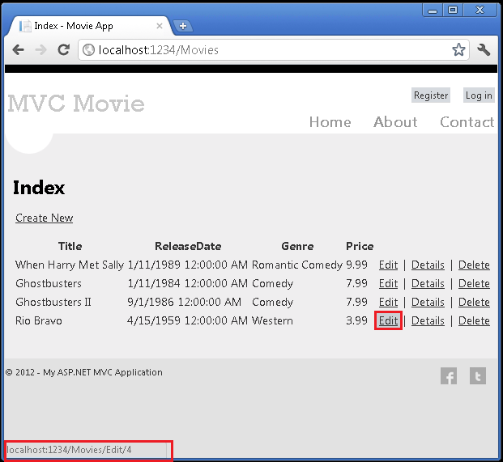
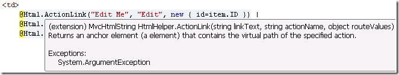
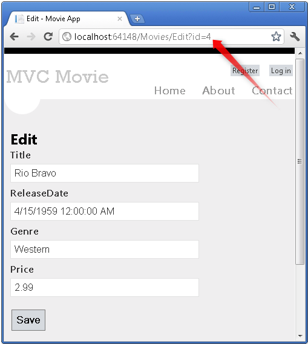
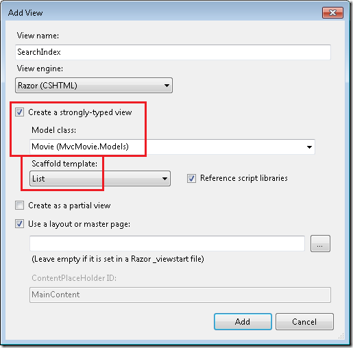
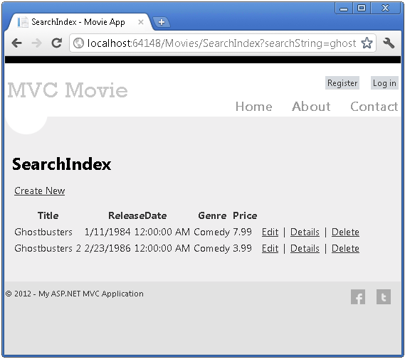
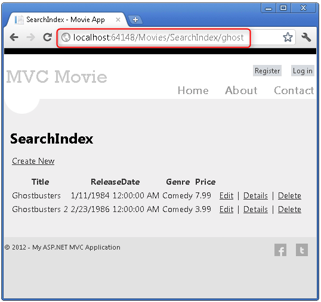
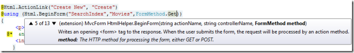
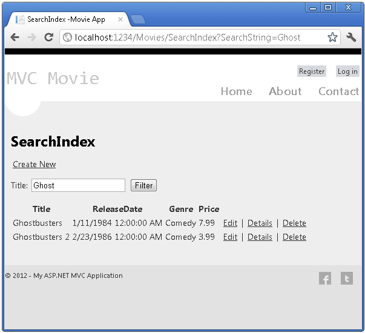
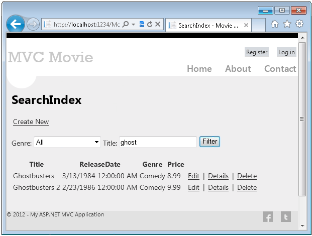

Examining the Edit Methods and Edit View
====================
by [Rick Anderson](https://github.com/Rick-Anderson)

> > [!NOTE]
> > An updated version of this tutorial is available [here](../../getting-started/introduction/getting-started.md) that uses ASP.NET MVC 5 and Visual Studio 2013. It's more secure, much simpler to follow and demonstrates more features.

In this section, you'll examine the generated action methods and views for the movie controller. Then you'll add a custom search page.

Run the application and browse to the `Movies` controller by appending */Movies* to the URL in the address bar of your browser. Hold the mouse pointer over an **Edit** link to see the URL that it links to.

The **Edit** link was generated by the `Html.ActionLink` method in the *Views\Movies\Index.cshtml* view:

[!code-cshtml[Main](examining-the-edit-methods-and-edit-view/samples/sample1.cshtml)]

The `Html` object is a helper that's exposed using a property on the [System.Web.Mvc.WebViewPage](https://msdn.microsoft.com/en-us/library/gg402107(VS.98).aspx) base class. The `ActionLink` method of the helper makes it easy to dynamically generate HTML hyperlinks that link to action methods on controllers. The first argument to the `ActionLink` method is the link text to render (for example, `<a>Edit Me</a>`). The second argument is the name of the action method to invoke. The final argument is an [anonymous object](https://weblogs.asp.net/scottgu/archive/2007/05/15/new-orcas-language-feature-anonymous-types.aspx) that generates the route data (in this case, the ID of 4).

The generated link shown in the previous image is `http://localhost:xxxxx/Movies/Edit/4`. The default route (established in *App\_Start\RouteConfig.cs*) takes the URL pattern `{controller}/{action}/{id}`. Therefore, ASP.NET translates `http://localhost:xxxxx/Movies/Edit/4` into a request to the `Edit` action method of the `Movies` controller with the parameter `ID` equal to 4. Examine the following code from the *App\_Start\RouteConfig.cs* file.

[!code-csharp[Main](examining-the-edit-methods-and-edit-view/samples/sample2.cs)]

You can also pass action method parameters using a query string. For example, the URL `http://localhost:xxxxx/Movies/Edit?ID=4` also passes the parameter `ID` of 4 to the `Edit` action method of the `Movies` controller.

Open the `Movies` controller. The two `Edit` action methods are shown below.

[!code-csharp[Main](examining-the-edit-methods-and-edit-view/samples/sample3.cs)]

Notice the second `Edit` action method is preceded by the `HttpPost` attribute. This attribute specifies that that overload of the `Edit` method can be invoked only for POST requests. You could apply the `HttpGet` attribute to the first edit method, but that's not necessary because it's the default. (We'll refer to action methods that are implicitly assigned the `HttpGet` attribute as `HttpGet` methods.)

The `HttpGet` `Edit` method takes the movie ID parameter, looks up the movie using the Entity Framework `Find` method, and returns the selected movie to the Edit view. The ID parameter specifies a [default value](https://msdn.microsoft.com/en-us/library/dd264739.aspx) of zero if the `Edit` method is called without a parameter. If a movie cannot be found, [HttpNotFound](https://msdn.microsoft.com/en-us/library/gg453938(VS.98).aspx) is returned. When the scaffolding system created the Edit view, it examined the `Movie` class and created code to render `<label>` and `<input>` elements for each property of the class. The following example shows the Edit view that was generated:

[!code-cshtml[Main](examining-the-edit-methods-and-edit-view/samples/sample4.cshtml)]

Notice how the view template has a `@model MvcMovie.Models.Movie` statement at the top of the file — this specifies that the view expects the model for the view template to be of type `Movie`.

The scaffolded code uses several *helper methods* to streamline the HTML markup. The [`Html.LabelFor`](https://msdn.microsoft.com/en-us/library/gg401864(VS.98).aspx) helper displays the name of the field (&quot;Title&quot;, &quot;ReleaseDate&quot;, &quot;Genre&quot;, or &quot;Price&quot;). The [`Html.EditorFor`](https://msdn.microsoft.com/en-us/library/system.web.mvc.html.editorextensions.editorfor(VS.98).aspx) helper renders an HTML `<input>` element. The [`Html.ValidationMessageFor`](https://msdn.microsoft.com/en-us/library/system.web.mvc.html.validationextensions.validationmessagefor(VS.98).aspx) helper displays any validation messages associated with that property.

Run the application and navigate to the */Movies* URL. Click an **Edit** link. In the browser, view the source for the page. The HTML for the form element is shown below.

[!code-html[Main](examining-the-edit-methods-and-edit-view/samples/sample5.html?highlight=7,10-11)]

The `<input>` elements are in an HTML `<form>` element whose `action` attribute is set to post to the */Movies/Edit* URL. The form data will be posted to the server when the **Edit** button is clicked.

## Processing the POST Request

The following listing shows the `HttpPost` version of the `Edit` action method.

[!code-csharp[Main](examining-the-edit-methods-and-edit-view/samples/sample6.cs)]

The [ASP.NET MVC model binder](https://msdn.microsoft.com/en-us/magazine/hh781022.aspx) takes the posted form values and creates a `Movie` object that's passed as the `movie` parameter. The `ModelState.IsValid` method verifies that the data submitted in the form can be used to modify (edit or update) a `Movie` object. If the data is valid, the movie data is saved to the `Movies` collection of the `db(MovieDBContext` instance). The new movie data is saved to the database by calling the `SaveChanges` method of `MovieDBContext`. After saving the data, the code redirects the user to the `Index` action method of the `MoviesController` class, which displays the of movie collection, including the changes just made.

If the posted values aren't valid, they are redisplayed in the form. The `Html.ValidationMessageFor` helpers in the *Edit.cshtml* view template take care of displaying appropriate error messages.

> [!NOTE]
> to support jQuery validation for non-English locales that use a comma (&quot;,&quot;) for a decimal point, you must include *globalize.js* and your specific *cultures/globalize.cultures.js* file(from [https://github.com/jquery/globalize](https://github.com/jquery/globalize) ) and JavaScript to use `Globalize.parseFloat`. The following code shows the modifications to the Views\Movies\Edit.cshtml file to work with the &quot;fr-FR&quot; culture:

[!code-cshtml[Main](examining-the-edit-methods-and-edit-view/samples/sample7.cshtml)]

The decimal field may require a comma, not a decimal point. As a temporary fix, you can add the globalization element to the projects root web.config file. The following code shows the globalization element with the culture set to United States English.

[!code-xml[Main](examining-the-edit-methods-and-edit-view/samples/sample8.xml)]

All the `HttpGet` methods follow a similar pattern. They get a movie object (or list of objects, in the case of `Index`), and pass the model to the view. The `Create` method passes an empty movie object to the Create view. All the methods that create, edit, delete, or otherwise modify data do so in the `HttpPost` overload of the method. Modifying data in an HTTP GET method is a security risk, as described in the blog post entry [ASP.NET MVC Tip #46 – Don't use Delete Links because they create Security Holes](http://stephenwalther.com/blog/archive/2009/01/21/asp.net-mvc-tip-46-ndash-donrsquot-use-delete-links-because.aspx). Modifying data in a GET method also violates HTTP best practices and the architectural [REST](http://en.wikipedia.org/wiki/Representational_State_Transfer) pattern, which specifies that GET requests should not change the state of your application. In other words, performing a GET operation should be a safe operation that has no side effects and doesn't modify your persisted data.

## Adding a Search Method and Search View

In this section you'll add a `SearchIndex` action method that lets you search movies by genre or name. This will be available using the */Movies/SearchIndex* URL. The request will display an HTML form that contains input elements that a user can enter in order to search for a movie. When a user submits the form, the action method will get the search values posted by the user and use the values to search the database.

## Displaying the SearchIndex Form

Start by adding a `SearchIndex` action method to the existing `MoviesController` class. The method will return a view that contains an HTML form. Here's the code:

[!code-csharp[Main](examining-the-edit-methods-and-edit-view/samples/sample9.cs)]

The first line of the `SearchIndex` method creates the following [LINQ](https://msdn.microsoft.com/en-us/library/bb397926.aspx) query to select the movies:

[!code-csharp[Main](examining-the-edit-methods-and-edit-view/samples/sample10.cs)]

The query is defined at this point, but hasn't yet been run against the data store.

If the `searchString` parameter contains a string, the movies query is modified to filter on the value of the search string, using the following code:

[!code-csharp[Main](examining-the-edit-methods-and-edit-view/samples/sample11.cs)]

The `s => s.Title` code above is a [Lambda Expression](https://msdn.microsoft.com/en-us/library/bb397687.aspx). Lambdas are used in method-based [LINQ](https://msdn.microsoft.com/en-us/library/bb397926.aspx) queries as arguments to standard query operator methods such as the [Where](https://msdn.microsoft.com/en-us/library/system.linq.enumerable.where.aspx) method used in the above code. LINQ queries are not executed when they are defined or when they are modified by calling a method such as `Where` or `OrderBy`. Instead, query execution is deferred, which means that the evaluation of an expression is delayed until its realized value is actually iterated over or the [`ToList`](https://msdn.microsoft.com/en-us/library/bb342261.aspx) method is called. In the `SearchIndex` sample, the query is executed in the SearchIndex view. For more information about deferred query execution, see [Query Execution](https://msdn.microsoft.com/en-us/library/bb738633.aspx).

Now you can implement the `SearchIndex` view that will display the form to the user. Right-click inside the `SearchIndex` method and then click **Add View**. In the **Add View** dialog box, specify that you're going to pass a `Movie` object to the view template as its model class. In the **Scaffold template** list, choose **List**, then click **Add**.

When you click the **Add** button, the *Views\Movies\SearchIndex.cshtml* view template is created. Because you selected **List** in the **Scaffold template** list, Visual Studio automatically generated (scaffolded) some default markup in the view. The scaffolding created an HTML form. It examined the `Movie` class and created code to render `<label>` elements for each property of the class. The listing below shows the Create view that was generated:

[!code-cshtml[Main](examining-the-edit-methods-and-edit-view/samples/sample12.cshtml)]

Run the application and navigate to */Movies/SearchIndex*. Append a query string such as `?searchString=ghost` to the URL. The filtered movies are displayed.

If you change the signature of the `SearchIndex` method to have a parameter named `id`, the `id` parameter will match the `{id}` placeholder for the default routes set in the *Global.asax* file.

[!code-json[Main](examining-the-edit-methods-and-edit-view/samples/sample13.json)]

The original `SearchIndex` method looks like this::

[!code-csharp[Main](examining-the-edit-methods-and-edit-view/samples/sample14.cs)]

The modified `SearchIndex` method would look as follows:

[!code-csharp[Main](examining-the-edit-methods-and-edit-view/samples/sample15.cs?highlight=1,3)]

You can now pass the search title as route data (a URL segment) instead of as a query string value.

However, you can't expect users to modify the URL every time they want to search for a movie. So now you you'll add UI to help them filter movies. If you changed the signature of the `SearchIndex` method to test how to pass the route-bound ID parameter, change it back so that your `SearchIndex` method takes a string parameter named `searchString`:

[!code-csharp[Main](examining-the-edit-methods-and-edit-view/samples/sample16.cs)]

Open the *Views\Movies\SearchIndex.cshtml* file, and just after `@Html.ActionLink("Create New", "Create")`, add the following:

[!code-cshtml[Main](examining-the-edit-methods-and-edit-view/samples/sample17.cshtml?highlight=2)]

The following example shows a portion of the *Views\Movies\SearchIndex.cshtml* file with the added filtering markup.

[!code-cshtml[Main](examining-the-edit-methods-and-edit-view/samples/sample18.cshtml?highlight=12-15)]

The `Html.BeginForm` helper creates an opening `<form>` tag. The `Html.BeginForm` helper causes the form to post to itself when the user submits the form by clicking the **Filter** button.

Run the application and try searching for a movie.

There's no `HttpPost` overload of the `SearchIndex` method. You don't need it, because the method isn't changing the state of the application, just filtering data.

You could add the following `HttpPost SearchIndex` method. In that case, the action invoker would match the `HttpPost SearchIndex` method, and the `HttpPost SearchIndex` method would run as shown in the image below.

[!code-csharp[Main](examining-the-edit-methods-and-edit-view/samples/sample19.cs)]

However, even if you add this `HttpPost` version of the `SearchIndex` method, there's a limitation in how this has all been implemented. Imagine that you want to bookmark a particular search or you want to send a link to friends that they can click in order to see the same filtered list of movies. Notice that the URL for the HTTP POST request is the same as the URL for the GET request (localhost:xxxxx/Movies/SearchIndex) -- there's no search information in the URL itself. Right now, the search string information is sent to the server as a form field value. This means you can't capture that search information to bookmark or send to friends in a URL.

The solution is to use an overload of `BeginForm` that specifies that the POST request should add the search information to the URL and that it should be routed to the HttpGet version of the `SearchIndex` method. Replace the existing parameterless `BeginForm` method with the following:

[!code-cshtml[Main](examining-the-edit-methods-and-edit-view/samples/sample20.cshtml)]

Now when you submit a search, the URL contains a search query string. Searching will also go to the `HttpGet SearchIndex` action method, even if you have a `HttpPost SearchIndex` method.

## Adding Search by Genre

If you added the `HttpPost` version of the `SearchIndex` method, delete it now.

Next, you'll add a feature to let users search for movies by genre. Replace the `SearchIndex` method with the following code:

[!code-csharp[Main](examining-the-edit-methods-and-edit-view/samples/sample21.cs)]

This version of the `SearchIndex` method takes an additional parameter, namely `movieGenre`. The first few lines of code create a `List` object to hold movie genres from the database.

The following code is a LINQ query that retrieves all the genres from the database.

[!code-csharp[Main](examining-the-edit-methods-and-edit-view/samples/sample22.cs)]

The code uses the `AddRange` method of the generic `List` collection to add all the distinct genres to the list. (Without the `Distinct` modifier, duplicate genres would be added — for example, comedy would be added twice in our sample). The code then stores the list of genres in the `ViewBag` object.

The following code shows how to check the `movieGenre` parameter. If it's not empty, the code further constrains the movies query to limit the selected movies to the specified genre.

[!code-csharp[Main](examining-the-edit-methods-and-edit-view/samples/sample23.cs)]

## Adding Markup to the SearchIndex View to Support Search by Genre

Add an `Html.DropDownList` helper to the *Views\Movies\SearchIndex.cshtml* file, just before the `TextBox` helper. The completed markup is shown below:

[!code-cshtml[Main](examining-the-edit-methods-and-edit-view/samples/sample24.cshtml?highlight=4)]

Run the application and browse to */Movies/SearchIndex*. Try a search by genre, by movie name, and by both criteria.

In this section you examined the CRUD action methods and views generated by the framework. You created a search action method and view that let users search by movie title and genre. In the next section, you'll look at how to add a property to the `Movie` model and how to add an initializer that will automatically create a test database.

>[!div class="step-by-step"]
[Previous](accessing-your-models-data-from-a-controller.md)
[Next](adding-a-new-field-to-the-movie-model-and-table.md)