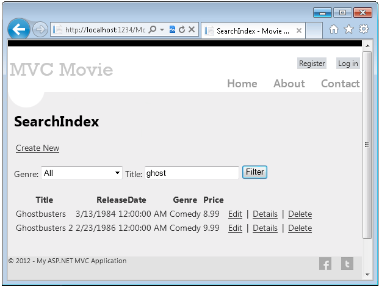
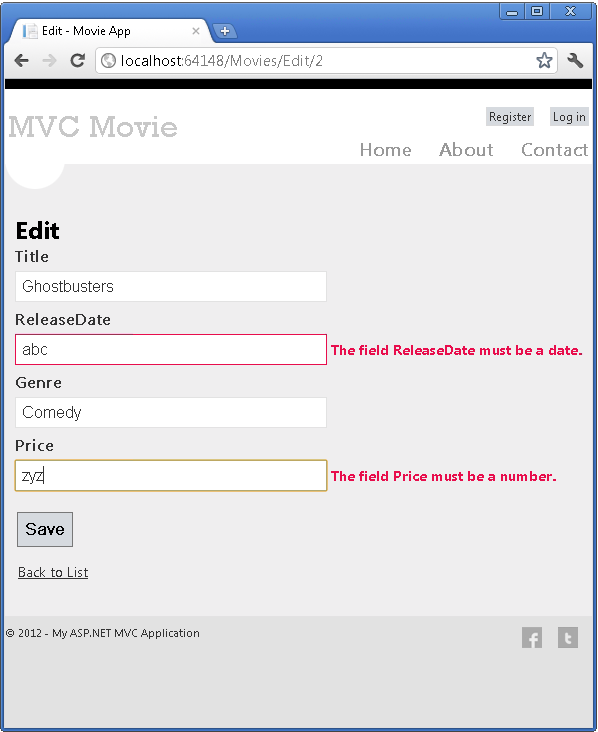
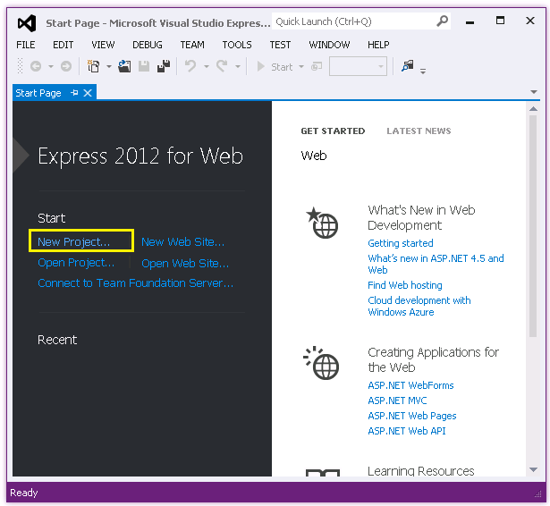
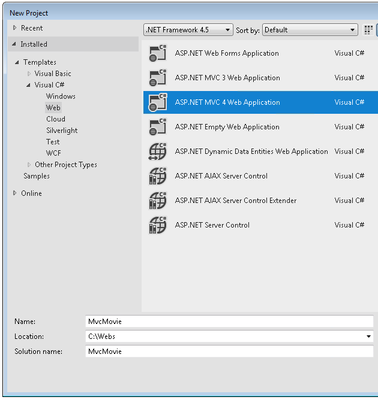
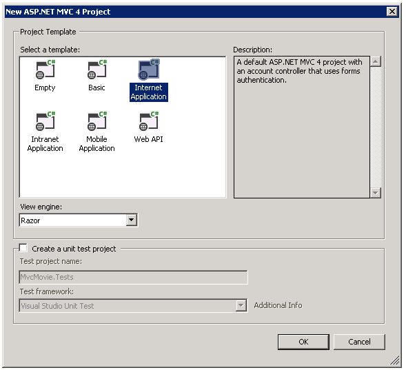
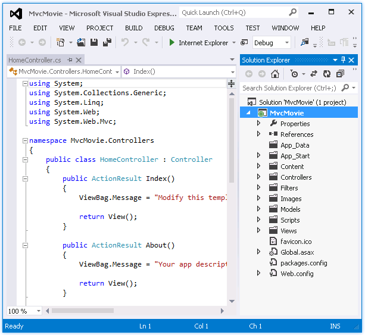
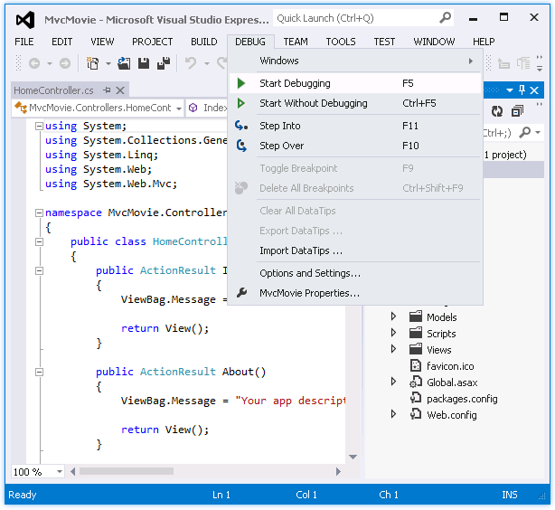
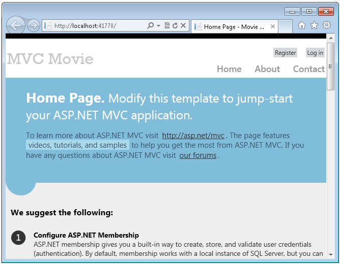

Intro to ASP.NET MVC 4
====================
by [Rick Anderson](https://github.com/Rick-Anderson)

> An updated version if this tutorial is available [here](../../getting-started/introduction/getting-started.md) using [Visual Studio 2013](https://www.microsoft.com/visualstudio/eng/2013-downloads). The new tutorial uses ASP.NET MVC 5, which provides many improvements over this tutorial.
> 
> This tutorial will teach you the basics of building an ASP.NET MVC 4 Web application using Microsoft [Visual Studio Express 2012](https://www.microsoft.com/visualstudio/11/en-us/products/express) or Visual Web Developer 2010 Express Service Pack 1. Visual Studio 2012 is recommended, you won't need to install anything to complete the tutorial. If you are using Visual Studio 2010 you must install the components below. You can install all of them by clicking the following links:
> 
> - [Visual Studio Web Developer Express SP1 prerequisites](https://www.microsoft.com/web/gallery/install.aspx?appid=VWD2010SP1Pack)
> - [WPI installer for ASP.NET MVC 4](https://go.microsoft.com/fwlink/?LinkId=243392)
> - [LocalDB](https://www.microsoft.com/web/gallery/install.aspx?appid=SQLLocalDBOnly_11_0)
> - [SSDT](https://blogs.msdn.com/b/rickandy/archive/2012/08/02/installing-and-using-sql-server-data-tools-ssdt-on-visual-studio-2010-and-vwd.aspx)
> 
> If you're using Visual Studio 2010 instead of Visual Web Developer 2010, install the [WPI installer for ASP.NET MVC 4](https://go.microsoft.com/fwlink/?LinkId=243392) and the: [Visual Studio 2010 prerequisites](https://www.microsoft.com/web/gallery/install.aspx?appsxml=&amp;appid=VS2010SP1Pack)
> 
> A Visual Web Developer project with C# source code is available to accompany this topic. [Download the C# version](https://code.msdn.microsoft.com/Intro-to-ASPNET-MVC-4-61d0219d/file/114480/1/MvcMovie.zip).
> 
> In the tutorial you run the application in Visual Studio. You can also make the application available over the Internet by deploying it to a hosting provider. Microsoft offers free web hosting for up to 10 web sites in a [free Windows Azure trial account](https://www.windowsazure.com/en-us/pricing/free-trial/?WT.mc_id=A443DD604). For information about how to deploy a Visual Studio web project to a Windows Azure Web Site, see [Create and deploy an ASP.NET web site and SQL Database with Visual Studio](https://www.windowsazure.com/en-us/develop/net/compute/). That tutorial also shows how to use Entity Framework Code First Migrations to deploy your SQL Server database to Windows Azure SQL Database (formerly SQL Azure).
> 
> This tutorial was written by Rick Anderson ( [@RickAndMSFT](https://twitter.com/#!/RickAndMSFT) ).

## What You'll Build

> [!NOTE]
> An updated version if this tutorial is available [here](../../getting-started/introduction/getting-started.md) using [Visual Studio 2013](https://www.microsoft.com/visualstudio/eng/2013-downloads). The new tutorial uses ASP.NET MVC 5, which provides many improvements over this tutorial.

You'll implement a simple movie-listing application that supports creating, editing, searching and listing movies from a database. Below are two screenshots of the application you'll build. It includes a page that displays a list of movies from a database:

The application also lets you add, edit, and delete movies, as well as see details about individual ones. All data-entry scenarios include validation to ensure that the data stored in the database is correct.

## Getting Started

Start by running Visual Studio Express 2012 or Visual Web Developer 2010 Express. Most of the screen shots in this series use Visual Studio Express 2012, but you can complete this tutorial with Visual Studio 2010/SP1, Visual Studio 2012, Visual Studio Express 2012 or Visual Web Developer 2010 Express. Select **New Project** from the **Start** page.

Visual Studio is an IDE, or integrated development environment. Just like you use Microsoft Word to write documents, you'll use an IDE to create applications. In Visual Studio there's a toolbar along the top showing various options available to you. There's also a menu that provides another way to perform tasks in the IDE. (For example, instead of selecting **New Project** from the **Start** page, you can use the menu and select **File** &gt; **New Project**.)

## Creating Your First Application

You can create applications using either Visual Basic or Visual C# as the programming language. Select Visual C# on the left and then select **ASP.NET MVC 4 Web Application**. Name your project &quot;MvcMovie&quot; and then click **OK**.

In the **New ASP.NET MVC 4 Project** dialog box, select **Internet Application**. Leave **Razor** as the default view engine.

Click **OK**. Visual Studio used a default template for the ASP.NET MVC project you just created, so you have a working application right now without doing anything! This is a simple &quot;Hello World!&quot; project, and it's a good place to start your application.

From the **Debug** menu, select **Start Debugging**.

Notice that the keyboard shortcut to start debugging is F5.

F5 causes Visual Studio to start IIS Express and run your web application. Visual Studio then launches a browser and opens the application's home page. Notice that the address bar of the browser says `localhost` and not something like `example.com`. That's because `localhost` always points to your own local computer, which in this case is running the application you just built. When Visual Studio runs a web project, a random port is used for the web server. In the image below, the port number is 41788. When you run the application, you'll probably see a different port number.

Right out of the box this default template gives you Home, Contact and About pages. It also provides support to register and log in, and links to Facebook and Twitter. The next step is to change how this application works and learn a little bit about ASP.NET MVC. Close your browser and let's change some code.

>[!div class="step-by-step"]
[Next](adding-a-controller.md)