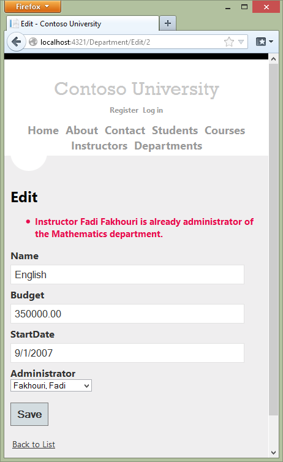
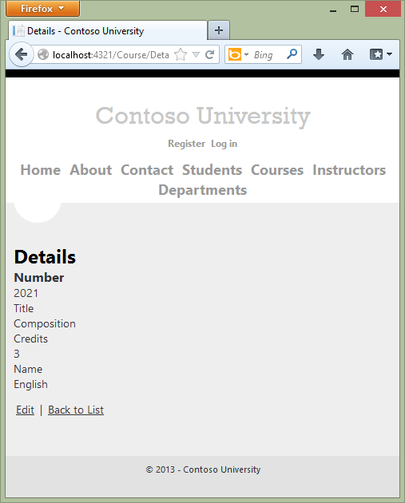
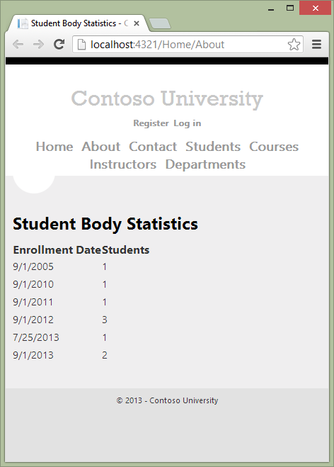
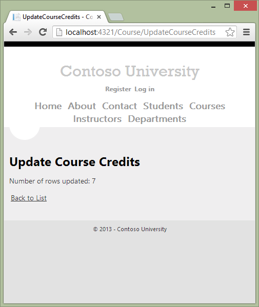
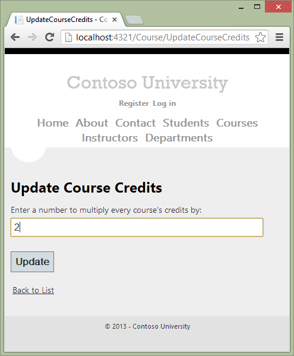
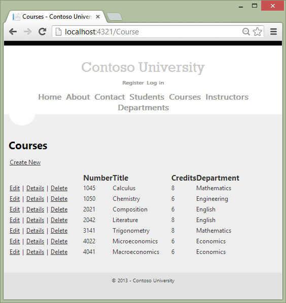
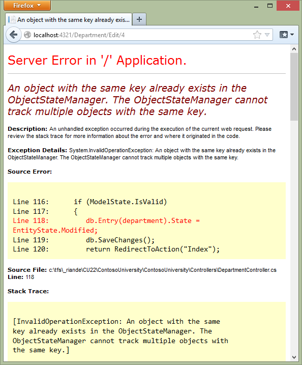
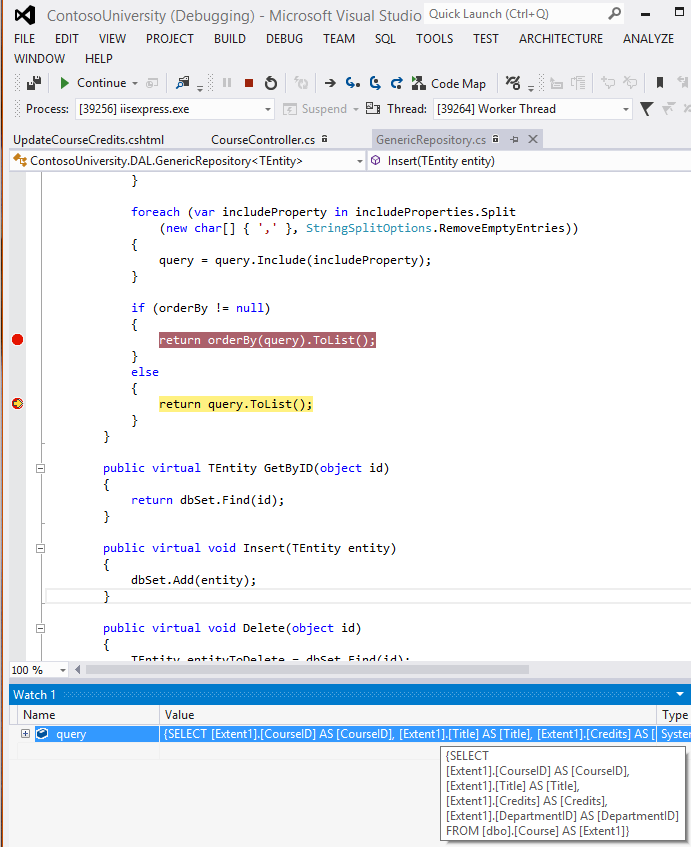
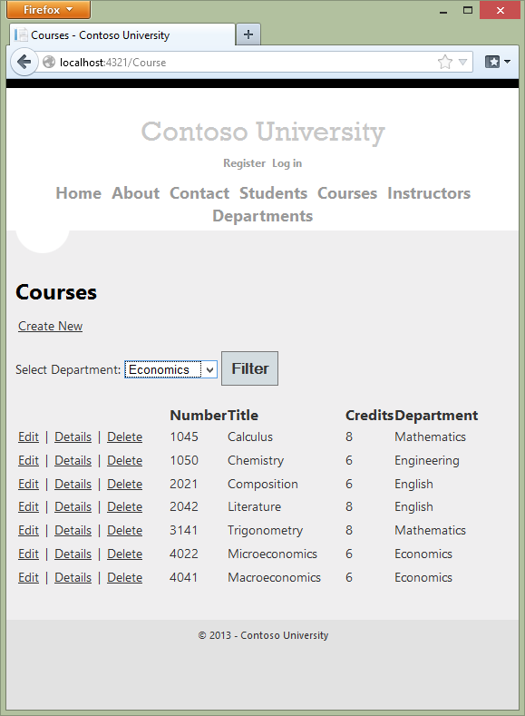

Advanced Entity Framework Scenarios for an MVC Web Application (10 of 10)
====================
by [Tom Dykstra](https://github.com/tdykstra)

[Download Completed Project](http://code.msdn.microsoft.com/Getting-Started-with-dd0e2ed8)

> The Contoso University sample web application demonstrates how to create ASP.NET MVC 4 applications using the Entity Framework 5 Code First and Visual Studio 2012. For information about the tutorial series, see [the first tutorial in the series](creating-an-entity-framework-data-model-for-an-asp-net-mvc-application.md). You can start the tutorial series from the beginning or [download a starter project for this chapter](building-the-ef5-mvc4-chapter-downloads.md) and start here.
> 
> > [!NOTE] 
> > 
> > If you run into a problem you can't resolve, [download the completed chapter](building-the-ef5-mvc4-chapter-downloads.md) and try to reproduce your problem. You can generally find the solution to the problem by comparing your code to the completed code. For some common errors and how to solve them, see [Errors and Workarounds.](advanced-entity-framework-scenarios-for-an-mvc-web-application.md#errors)

In the previous tutorial you implemented the repository and unit of work patterns. This tutorial covers the following topics:

- Performing raw SQL queries.
- Performing no-tracking queries.
- Examining queries sent to the database.
- Working with proxy classes.
- Disabling automatic detection of changes.
- Disabling validation when saving changes.
- [Errors and Work Arounds](#errors)

For most of these topics, you'll work with pages that you already created. To use raw SQL to do bulk updates you'll create a new page that updates the number of credits of all courses in the database:

And to use a no-tracking query you'll add new validation logic to the Department Edit page:

## Performing Raw SQL Queries

The Entity Framework Code First API includes methods that enable you to pass SQL commands directly to the database. You have the following options:

- Use the `DbSet.SqlQuery` method for queries that return entity types. The returned objects must be of the type expected by the `DbSet` object, and they are automatically tracked by the database context unless you turn tracking off. (See the following section about the `AsNoTracking` method.)
- Use the `Database.SqlQuery` method for queries that return types that aren't entities. The returned data isn't tracked by the database context, even if you use this method to retrieve entity types.
- Use the [Database.ExecuteSqlCommand](https://msdn.microsoft.com/en-us/library/gg679456(v=vs.103).aspx) for non-query commands.

One of the advantages of using the Entity Framework is that it avoids tying your code too closely to a particular method of storing data. It does this by generating SQL queries and commands for you, which also frees you from having to write them yourself. But there are exceptional scenarios when you need to run specific SQL queries that you have manually created, and these methods make it possible for you to handle such exceptions.

As is always true when you execute SQL commands in a web application, you must take precautions to protect your site against SQL injection attacks. One way to do that is to use parameterized queries to make sure that strings submitted by a web page can't be interpreted as SQL commands. In this tutorial you'll use parameterized queries when integrating user input into a query.

### Calling a Query that Returns Entities

Suppose you want the `GenericRepository` class to provide additional filtering and sorting flexibility without requiring that you create a derived class with additional methods. One way to achieve that would be to add a method that accepts a SQL query. You could then specify any kind of filtering or sorting you want in the controller, such as a `Where` clause that depends on a joins or a subquery. In this section you'll see how to implement such a method.

Create the `GetWithRawSql` method by adding the following code to *GenericRepository.cs*:

[!code-csharp[Main](advanced-entity-framework-scenarios-for-an-mvc-web-application/samples/sample1.cs)]

In *CourseController.cs*, call the new method from the `Details` method, as shown in the following example:

[!code-csharp[Main](advanced-entity-framework-scenarios-for-an-mvc-web-application/samples/sample2.cs)]

In this case you could have used the `GetByID` method, but you're using the `GetWithRawSql` method to verify that the `GetWithRawSQL` method works.

Run the Details page to verify that the select query works (select the **Course** tab and then **Details** for one course).

### Calling a Query that Returns Other Types of Objects

Earlier you created a student statistics grid for the About page that showed the number of students for each enrollment date. The code that does this in *HomeController.cs* uses LINQ:

[!code-csharp[Main](advanced-entity-framework-scenarios-for-an-mvc-web-application/samples/sample3.cs)]

Suppose you want to write the code that retrieves this data directly in SQL rather than using LINQ. To do that you need to run a query that returns something other than entity objects, which means you need to use the `Database.SqlQuery` method.

In *HomeController.cs*, replace the LINQ statement in the `About` method with the following code:

[!code-csharp[Main](advanced-entity-framework-scenarios-for-an-mvc-web-application/samples/sample4.cs)]

Run the About page. It displays the same data it did before.

### Calling an Update Query

Suppose Contoso University administrators want to be able to perform bulk changes in the database, such as changing the number of credits for every course. If the university has a large number of courses, it would be inefficient to retrieve them all as entities and change them individually. In this section you'll implement a web page that allows the user to specify a factor by which to change the number of credits for all courses, and you'll make the change by executing a SQL `UPDATE` statement. The web page will look like the following illustration:

In the previous tutorial you used the generic repository to read and update `Course` entities in the `Course` controller. For this bulk update operation, you need to create a new repository method that isn't in the generic repository. To do that, you'll create a dedicated `CourseRepository` class that derives from the `GenericRepository` class.

In the *DAL* folder, create *CourseRepository.cs* and replace the existing code with the following code:

[!code-csharp[Main](advanced-entity-framework-scenarios-for-an-mvc-web-application/samples/sample5.cs)]

In *UnitOfWork.cs*, change the `Course` repository type from `GenericRepository<Course>` to `CourseRepository:`

[!code-csharp[Main](advanced-entity-framework-scenarios-for-an-mvc-web-application/samples/sample6.cs)]

[!code-csharp[Main](advanced-entity-framework-scenarios-for-an-mvc-web-application/samples/sample7.cs)]

In *CourseContoller.cs*, add an `UpdateCourseCredits` method:

[!code-csharp[Main](advanced-entity-framework-scenarios-for-an-mvc-web-application/samples/sample8.cs)]

This method will be used for both `HttpGet` and `HttpPost`. When the `HttpGet` `UpdateCourseCredits` method runs, the `multiplier` variable will be null and the view will display an empty text box and a submit button, as shown in the preceding illustration.

When the **Update** button is clicked and the `HttpPost` method runs, `multiplier` will have the value entered in the text box. The code then calls the repository `UpdateCourseCredits` method, which returns the number of affected rows, and that value is stored in the `ViewBag` object. When the view receives the number of affected rows in the `ViewBag` object, it displays that number instead of the text box and submit button, as shown in the following illustration:

Create a view in the *Views\Course* folder for the Update Course Credits page:

In *Views\Course\UpdateCourseCredits.cshtml*, replace the template code with the following code:

[!code-cshtml[Main](advanced-entity-framework-scenarios-for-an-mvc-web-application/samples/sample9.cshtml)]

Run the `UpdateCourseCredits` method by selecting the **Courses** tab, then adding "/UpdateCourseCredits" to the end of the URL in the browser's address bar (for example: `http://localhost:50205/Course/UpdateCourseCredits`). Enter a number in the text box:

Click **Update**. You see the number of rows affected:

Click **Back to List** to see the list of courses with the revised number of credits.

For more information about raw SQL queries, see [Raw SQL Queries](https://blogs.msdn.com/b/adonet/archive/2011/02/04/using-dbcontext-in-ef-feature-ctp5-part-10-raw-sql-queries.aspx) on the Entity Framework team blog.

## No-Tracking Queries

When a database context retrieves database rows and creates entity objects that represent them, by default it keeps track of whether the entities in memory are in sync with what's in the database. The data in memory acts as a cache and is used when you update an entity. This caching is often unnecessary in a web application because context instances are typically short-lived (a new one is created and disposed for each request) and the context that reads an entity is typically disposed before that entity is used again.

You can specify whether the context tracks entity objects for a query by using the `AsNoTracking` method. Typical scenarios in which you might want to do that include the following:

- The query retrieves such a large volume of data that turning off tracking might noticeably enhance performance.
- You want to attach an entity in order to update it, but you earlier retrieved the same entity for a different purpose. Because the entity is already being tracked by the database context, you can't attach the entity that you want to change. One way to prevent this from happening is to use the `AsNoTracking` option with the earlier query.

In this section you'll implement business logic that illustrates the second of these scenarios. Specifically, you'll enforce a business rule that says that an instructor can't be the administrator of more than one department.

In *DepartmentController.cs*, add a new method that you can call from the `Edit` and `Create` methods to make sure that no two departments have the same administrator:

[!code-csharp[Main](advanced-entity-framework-scenarios-for-an-mvc-web-application/samples/sample10.cs)]

Add code in the `try` block of the `HttpPost` `Edit` method to call this new method if there are no validation errors. The `try` block now looks like the following example:

[!code-csharp[Main](advanced-entity-framework-scenarios-for-an-mvc-web-application/samples/sample11.cs?highlight=9-12)]

Run the Department Edit page and try to change a department's administrator to an instructor who is already the administrator of a different department. You get the expected error message:

Now run the Department Edit page again and this time change the **Budget** amount. When you click **Save**, you see an error page:

The exception error message is "`An object with the same key already exists in the ObjectStateManager. The ObjectStateManager cannot track multiple objects with the same key.`" This happened because of the following sequence of events:

- The `Edit` method calls the `ValidateOneAdministratorAssignmentPerInstructor` method, which retrieves all departments that have Kim Abercrombie as their administrator. That causes the English department to be read. Because that's the department being edited, no error is reported. As a result of this read operation, however, the English department entity that was read from the database is now being tracked by the database context.
- The `Edit` method tries to set the `Modified` flag on the English department entity created by the MVC model binder, but that fails because the context is already tracking an entity for the English department.

One solution to this problem is to keep the context from tracking in-memory department entities retrieved by the validation query. There's no disadvantage to doing this, because you won't be updating this entity or reading it again in a way that would benefit from it being cached in memory.

In *DepartmentController.cs*, in the `ValidateOneAdministratorAssignmentPerInstructor` method, specify no tracking, as shown in the following:

[!code-csharp[Main](advanced-entity-framework-scenarios-for-an-mvc-web-application/samples/sample12.cs?highlight=4)]

Repeat your attempt to edit the **Budget** amount of a department. This time the operation is successful, and the site returns as expected to the Departments Index page, showing the revised budget value.

## Examining Queries Sent to the Database

Sometimes it's helpful to be able to see the actual SQL queries that are sent to the database. To do this, you can examine a query variable in the debugger or call the query's `ToString` method. To try this out, you'll look at a simple query and then look at what happens to it as you add options such eager loading, filtering, and sorting.

In *Controllers/CourseController*, replace the `Index` method with the following code:

[!code-csharp[Main](advanced-entity-framework-scenarios-for-an-mvc-web-application/samples/sample13.cs?highlight=3)]

Now set a breakpoint in *GenericRepository.cs* on the `return query.ToList();` and the `return orderBy(query).ToList();` statements of the `Get` method. Run the project in debug mode and select the Course Index page. When the code reaches the breakpoint, examine the `query` variable. You see the query that's sent to SQL Server. It's a simple `Select` statement:

[!code-json[Main](advanced-entity-framework-scenarios-for-an-mvc-web-application/samples/sample14.json)]

Queries can be too long to display in the debugging windows in Visual Studio. To see the entire query, you can copy the variable value and paste it into a text editor:

Now you'll add a drop-down list to the Course Index page so that users can filter for a particular department. You'll sort the courses by title, and you'll specify eager loading for the `Department` navigation property. In *CourseController.cs*, replace the `Index` method with the following code:

[!code-csharp[Main](advanced-entity-framework-scenarios-for-an-mvc-web-application/samples/sample15.cs)]

The method receives the selected value of the drop-down list in the `SelectedDepartment` parameter. If nothing is selected, this parameter will be null.

A `SelectList` collection containing all departments is passed to the view for the drop-down list. The parameters passed to the `SelectList` constructor specify the value field name, the text field name, and the selected item.

For the `Get` method of the `Course` repository, the code specifies a filter expression, a sort order, and eager loading for the `Department` navigation property. The filter expression always returns `true` if nothing is selected in the drop-down list (that is, `SelectedDepartment` is null).

In *Views\Course\Index.cshtml*, immediately before the opening `table` tag, add the following code to create the drop-down list and a submit button:

[!code-cshtml[Main](advanced-entity-framework-scenarios-for-an-mvc-web-application/samples/sample16.cshtml)]

With the breakpoints still set in the `GenericRepository` class, run the Course Index page. Continue through the first two times that the code hits a breakpoint, so that the page is displayed in the browser. Select a department from the drop-down list and click **Filter**:

This time the first breakpoint will be for the departments query for the drop-down list. Skip that and view the `query` variable the next time the code reaches the breakpoint in order to see what the `Course` query now looks like. You'll see something like the following:

[!code-json[Main](advanced-entity-framework-scenarios-for-an-mvc-web-application/samples/sample17.json)]

You can see that the query is now a `JOIN` query that loads `Department` data along with the `Course` data, and that it includes a `WHERE` clause.

## Working with Proxy Classes

When the Entity Framework creates entity instances (for example, when you execute a query), it often creates them as instances of a dynamically generated derived type that acts as a proxy for the entity. This proxy overrides some virtual properties of the entity to insert hooks for performing actions automatically when the property is accessed. For example, this mechanism is used to support lazy loading of relationships.

Most of the time you don't need to be aware of this use of proxies, but there are exceptions:

- In some scenarios you might want to prevent the Entity Framework from creating proxy instances. For example, serializing non-proxy instances might be more efficient than serializing proxy instances.
- When you instantiate an entity class using the `new` operator, you don't get a proxy instance. This means you don't get functionality such as lazy loading and automatic change tracking. This is typically okay; you generally don't need lazy loading, because you're creating a new entity that isn't in the database, and you generally don't need change tracking if you're explicitly marking the entity as `Added`. However, if you do need lazy loading and you need change tracking, you can create new entity instances with proxies using the `Create` method of the `DbSet` class.
- You might want to get an actual entity type from a proxy type. You can use the `GetObjectType` method of the `ObjectContext` class to get the actual entity type of a proxy type instance.

For more information, see [Working with Proxies](https://blogs.msdn.com/b/adonet/archive/2011/02/02/using-dbcontext-in-ef-feature-ctp5-part-8-working-with-proxies.aspx) on the Entity Framework team blog.

## Disabling Automatic Detection of Changes

The Entity Framework determines how an entity has changed (and therefore which updates need to be sent to the database) by comparing the current values of an entity with the original values. The original values are stored when the entity was queried or attached. Some of the methods that cause automatic change detection are the following:

- `DbSet.Find`
- `DbSet.Local`
- `DbSet.Remove`
- `DbSet.Add`
- `DbSet.Attach`
- `DbContext.SaveChanges`
- `DbContext.GetValidationErrors`
- `DbContext.Entry`
- `DbChangeTracker.Entries`

If you're tracking a large number of entities and you call one of these methods many times in a loop, you might get significant performance improvements by temporarily turning off automatic change detection using the [AutoDetectChangesEnabled](https://msdn.microsoft.com/en-us/library/system.data.entity.infrastructure.dbcontextconfiguration.autodetectchangesenabled(VS.103).aspx) property. For more information, see [Automatically Detecting Changes](https://blogs.msdn.com/b/adonet/archive/2011/02/06/using-dbcontext-in-ef-feature-ctp5-part-12-automatically-detecting-changes.aspx).

## Disabling Validation When Saving Changes

When you call the `SaveChanges` method, by default the Entity Framework validates the data in all properties of all changed entities before updating the database. If you've updated a large number of entities and you've already validated the data, this work is unnecessary and you could make the process of saving the changes take less time by temporarily turning off validation. You can do that using the [ValidateOnSaveEnabled](https://msdn.microsoft.com/en-us/library/system.data.entity.infrastructure.dbcontextconfiguration.validateonsaveenabled(VS.103).aspx) property. For more information, see [Validation](https://blogs.msdn.com/b/adonet/archive/2010/12/15/ef-feature-ctp5-validation.aspx).

## Summary

This completes this series of tutorials on using the Entity Framework in an ASP.NET MVC application. Links to other Entity Framework resources can be found in the [ASP.NET Data Access Content Map](../../../../whitepapers/aspnet-data-access-content-map.md).

For more information about how to deploy your web application after you've built it, see [ASP.NET Deployment Content Map](https://msdn.microsoft.com/en-us/library/bb386521.aspx) in the MSDN Library.

For information about other topics related to MVC, such as authentication and authorization, see the [MVC Recommended Resources](../../getting-started/recommended-resources-for-mvc.md).

## Acknowledgments

- Tom Dykstra wrote the original version of this tutorial and is a senior programming writer on the Microsoft Web Platform and Tools Content Team.
- [Rick Anderson](https://blogs.msdn.com/b/rickandy/) (twitter [@RickAndMSFT](http://twitter.com/RickAndMSFT)) co-authored this tutorial and did most of the work updating it for EF 5 and MVC 4. Rick is a senior programming writer for Microsoft focusing on Azure and MVC.
- [Rowan Miller](http://www.romiller.com) and other members of the Entity Framework team assisted with code reviews and helped debug many issues with migrations that arose while we were updating the tutorial for EF 5.

## VB

When the tutorial was originally produced, we provided both C# and VB versions of the completed download project. With this update we are providing a C# downloadable project for each chapter to make it easier to get started anywhere in the series, but due to time limitations and other priorities we did not do that for VB. If you build a VB project using these tutorials and would be willing to share that with others, please let us know.

## Errors and Workarounds

### Cannot create/shadow copy

Error Message:

*Cannot create/shadow copy 'DotNetOpenAuth.OpenId' when that file already exists.*

Solution:

Wait a few seconds and refresh the page.

### Update-Database not recognized

Error Message:

*The term 'Update-Database' is not recognized as the name of a cmdlet, function, script file, or operable program. Check the spelling of the name, or if a path was included, verify that the path is correct and try again.*(From the *`Update-Database`* command in the PMC.)

Solution:

Exit Visual Studio. Reopen project and try again.

### Validation failed

Error Message:

*Validation failed for one or more entities. See 'EntityValidationErrors' property for more details.* (From the *`Update-Database`* command in the PMC.)

Solution:

One cause of this problem is validation errors when the `Seed` method runs. See [Seeding and Debugging Entity Framework (EF) DBs](https://blogs.msdn.com/b/rickandy/archive/2013/02/12/seeding-and-debugging-entity-framework-ef-dbs.aspx) for tips on debugging the `Seed` method.

### HTTP 500.19 error

Error Message:

*HTTP Error 500.19 - Internal Server Error  
The requested page cannot be accessed because the related configuration data for the page is invalid.*

Solution:

One way you can get this error is from having multiple copies of the solution, each of them using the same port number. You can usually solve this problem by exiting all instances of Visual Studio, then restarting the project your working on. If that doesn't work, try changing the port number. Right click on the project file and then click properties. Select the **Web** tab and then change the port number in the **Project Url** text box.

### Error locating SQL Server instance

Error Message:

*A network-related or instance-specific error occurred while establishing a connection to SQL Server. The server was not found or was not accessible. Verify that the instance name is correct and that SQL Server is configured to allow remote connections. (provider: SQL Network Interfaces, error: 26 - Error Locating Server/Instance Specified)*

Solution:

Check connection string. If you have manually deleted the database, change the name of the database in the construction string.

>[!div class="step-by-step"]
[Previous](implementing-the-repository-and-unit-of-work-patterns-in-an-asp-net-mvc-application.md)
[Next](building-the-ef5-mvc4-chapter-downloads.md)