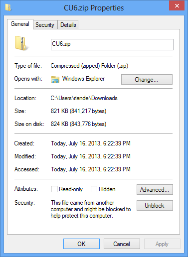
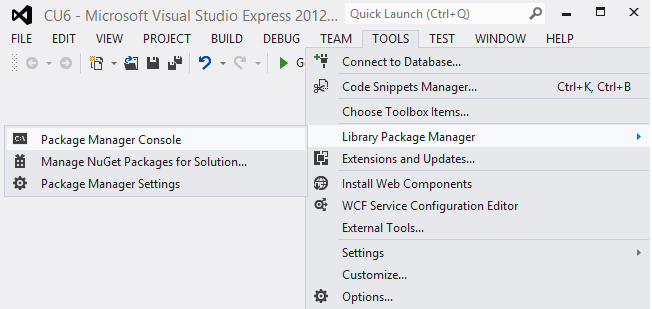
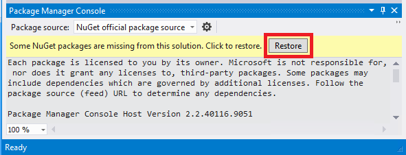
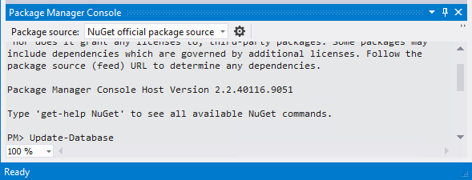
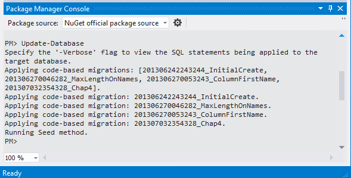

Building the Chapter Downloads for the EF 5 MVC 4 Tutorials
====================
by [Rick Anderson](https://github.com/Rick-Anderson)

[Download Completed Project](http://code.msdn.microsoft.com/Getting-Started-with-dd0e2ed8)

> The Contoso University sample web application demonstrates how to create ASP.NET MVC 4 applications using the Entity Framework 5 Code First and Visual Studio 2012. For information about the tutorial series, see [the first tutorial in the series](creating-an-entity-framework-data-model-for-an-asp-net-mvc-application.md).

## Building the Chapter Downloads

1. Download and unzip the  project sample zip file. In the unzipped download package, you will find additional zip files, one for the completion of each chapter.
2. Right click on the desired zip file, click **Properties**, and click the **Unblock** button.  
  
    
3. Unzip the file.
4. Double-click the *CUx.sln* file to launch Visual Studio.
5. From the **Tools** menu, click **Library Package Manager**, then **Package Manager Console**.  
  
    
6. In the Package Manager Console (PMC), click **Restore**.  
  
    
7. Exit Visual Studio.
8. Restart Visual Studio, opening the solution file you closed in the step above.
9. In the Package Manager Console (PMC), enter the `Update-Database` command:  
  
      

    > [!NOTE]
    > If you get the following error:  
    >   
    >  *The term 'Update-Database' is not recognized as the name of a cmdlet, function, script file, or operable program. Check the spelling of the name, or if a path was included, verify that the path is correct and try again.*  
    > Exit and restart Visual Studio.

    Each migration will run, then the seed method will run. You can now run the app.

    

>[!div class="step-by-step"]
[Previous](advanced-entity-framework-scenarios-for-an-mvc-web-application.md)