Creating a More Complex Data Model for an ASP.NET MVC Application (4 of 10)
====================
by [Tom Dykstra](https://github.com/tdykstra)

[Download Completed Project](http://code.msdn.microsoft.com/Getting-Started-with-dd0e2ed8)

> The Contoso University sample web application demonstrates how to create ASP.NET MVC 4 applications using the Entity Framework 5 Code First and Visual Studio 2012. For information about the tutorial series, see [the first tutorial in the series](creating-an-entity-framework-data-model-for-an-asp-net-mvc-application.md). You can start the tutorial series from the beginning or [download a starter project for this chapter](building-the-ef5-mvc4-chapter-downloads.md) and start here.
> 
> > [!NOTE] 
> > 
> > If you run into a problem you can't resolve, [download the completed chapter](building-the-ef5-mvc4-chapter-downloads.md) and try to reproduce your problem. You can generally find the solution to the problem by comparing your code to the completed code. For some common errors and how to solve them, see [Errors and Workarounds.](advanced-entity-framework-scenarios-for-an-mvc-web-application.md#errors)

In the previous tutorials you worked with a simple data model that was composed of three entities. In this tutorial you'll add more entities and relationships and you'll customize the data model by specifying formatting, validation, and database mapping rules. You'll see two ways to customize the data model: by adding attributes to entity classes and by adding code to the database context class.

When you're finished, the entity classes will make up the completed data model that's shown in the following illustration:

## Customize the Data Model by Using Attributes

In this section you'll see how to customize the data model by using attributes that specify formatting, validation, and database mapping rules. Then in several of the following sections you'll create the complete `School` data model by adding attributes to the classes you already created and creating new classes for the remaining entity types in the model.

### The DataType Attribute

For student enrollment dates, all of the web pages currently display the time along with the date, although all you care about for this field is the date. By using data annotation attributes, you can make one code change that will fix the display format in every view that shows the data. To see an example of how to do that, you'll add an attribute to the `EnrollmentDate` property in the `Student` class.

In *Models\Student.cs*, add a `using` statement for the `System.ComponentModel.DataAnnotations` namespace and add `DataType` and `DisplayFormat` attributes to the `EnrollmentDate` property, as shown in the following example:

[!code-csharp[Main](creating-a-more-complex-data-model-for-an-asp-net-mvc-application/samples/sample1.cs?highlight=3,13-14)]

The [DataType](https://msdn.microsoft.com/en-us/library/system.componentmodel.dataannotations.datatypeattribute.aspx) attribute is used to specify a data type that is more specific than the database intrinsic type. In this case we only want to keep track of the date, not the date and time. The [DataType Enumeration](https://msdn.microsoft.com/en-us/library/system.componentmodel.dataannotations.datatype.aspx) provides for many data types, such as *Date, Time, PhoneNumber, Currency, EmailAddress* and more. The `DataType` attribute can also enable the application to automatically provide type-specific features. For example, a `mailto:` link can be created for [DataType.EmailAddress](https://msdn.microsoft.com/en-us/library/system.componentmodel.dataannotations.datatype.aspx), and a date selector can be provided for [DataType.Date](https://msdn.microsoft.com/en-us/library/system.componentmodel.dataannotations.datatype.aspx) in browsers that support [HTML5](http://html5.org/). The [DataType](https://msdn.microsoft.com/en-us/library/system.componentmodel.dataannotations.datatypeattribute.aspx) attributes emits HTML 5 [data-](http://ejohn.org/blog/html-5-data-attributes/) (pronounced *data dash*) attributes that HTML 5 browsers can understand. The [DataType](https://msdn.microsoft.com/en-us/library/system.componentmodel.dataannotations.datatypeattribute.aspx) attributes do not provide any validation.

`DataType.Date` does not specify the format of the date that is displayed. By default, the data field is displayed according to the default formats based on the server's [CultureInfo](https://msdn.microsoft.com/en-us/library/vstudio/system.globalization.cultureinfo(v=vs.110).aspx).

The `DisplayFormat` attribute is used to explicitly specify the date format:

[!code-csharp[Main](creating-a-more-complex-data-model-for-an-asp-net-mvc-application/samples/sample2.cs)]

The `ApplyFormatInEditMode` setting specifies that the specified formatting should also be applied when the value is displayed in a text box for editing. (You might not want that for some fields — for example, for currency values, you might not want the currency symbol in the text box for editing.)

You can use the [DisplayFormat](https://msdn.microsoft.com/en-us/library/system.componentmodel.dataannotations.displayformatattribute.aspx) attribute by itself, but it's generally a good idea to use the [DataType](https://msdn.microsoft.com/en-us/library/system.componentmodel.dataannotations.datatypeattribute.aspx) attribute also. The `DataType` attribute conveys the *semantics* of the data as opposed to how to render it on a screen, and provides the following benefits that you don't get with `DisplayFormat`:

- The browser can enable HTML5 features (for example to show a calendar control, the locale-appropriate currency symbol, email links, etc.).
- By default, the browser will render data using the correct format based on your [locale](https://msdn.microsoft.com/en-us/library/vstudio/wyzd2bce.aspx).
- The [DataType](https://msdn.microsoft.com/en-us/library/system.componentmodel.dataannotations.datatypeattribute.aspx) attribute can enable MVC to choose the right field template to render the data (the [DisplayFormat](https://msdn.microsoft.com/en-us/library/system.componentmodel.dataannotations.displayformatattribute.aspx) if used by itself uses the string template). For more information, see Brad Wilson's [ASP.NET MVC 2 Templates](http://bradwilson.typepad.com/blog/2009/10/aspnet-mvc-2-templates-part-1-introduction.html). (Though written for MVC 2, this article still applies to the current version of ASP.NET MVC.)

If you use the `DataType` attribute with a date field, you have to specify the `DisplayFormat` attribute also in order to ensure that the field renders correctly in Chrome browsers. For more information, see [this StackOverflow thread](http://stackoverflow.com/questions/12633471/mvc4-datatype-date-editorfor-wont-display-date-value-in-chrome-fine-in-ie).

Run the Student Index page again and notice that times are no longer displayed for the enrollment dates. The same will be true for any view that uses the `Student` model.

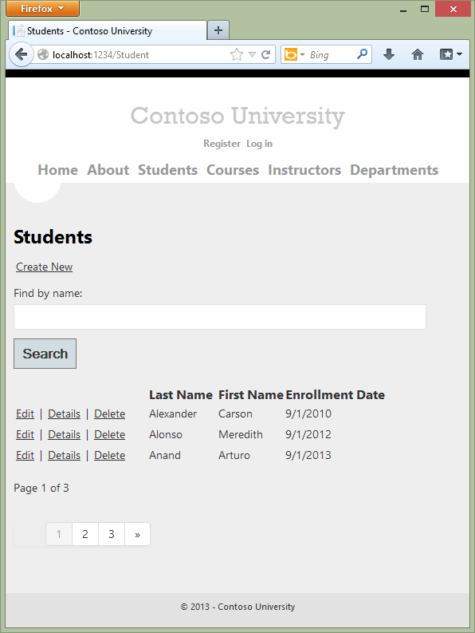

### The StringLengthAttribute

You can also specify data validation rules and messages using attributes. Suppose you want to ensure that users don't enter more than 50 characters for a name. To add this limitation, add [StringLength](https://msdn.microsoft.com/en-us/library/system.componentmodel.dataannotations.stringlengthattribute.aspx) attributes to the `LastName` and `FirstMidName` properties, as shown in the following example:

[!code-csharp[Main](creating-a-more-complex-data-model-for-an-asp-net-mvc-application/samples/sample3.cs?highlight=10,12)]

The [StringLength](https://msdn.microsoft.com/en-us/library/system.componentmodel.dataannotations.stringlengthattribute.aspx) attribute won't prevent a user from entering white space for a name. You can use the [RegularExpression](https://msdn.microsoft.com/en-us/library/system.componentmodel.dataannotations.regularexpressionattribute.aspx) attribute to apply restrictions to the input. For example the following code requires the first character to be upper case and the remaining characters to be alphabetical:

`[RegularExpression(@"^[A-Z]+[a-zA-Z''-'\s]*$")]`

The [MaxLength](https://msdn.microsoft.com/en-us/library/System.ComponentModel.DataAnnotations.MaxLengthAttribute.aspx) attribute provides similar functionality to the [StringLength](https://msdn.microsoft.com/en-us/library/system.componentmodel.dataannotations.stringlengthattribute.aspx) attribute but doesn't provide client side validation.

Run the application and click the **Students** tab. You get the following error:

*The model backing the 'SchoolContext' context has changed since the database was created. Consider using Code First Migrations to update the database ([https://go.microsoft.com/fwlink/?LinkId=238269](https://go.microsoft.com/fwlink/?LinkId=238269)).*

The database model has changed in a way that requires a change in the database schema, and Entity Framework detected that. You'll use migrations to update the schema without losing any data that you added to the database by using the UI. If you changed data that was created by the `Seed` method, that will be changed back to its original state because of the [AddOrUpdate](https://msdn.microsoft.com/en-us/library/hh846520(v=vs.103).aspx) method that you're using in the `Seed` method. ([AddOrUpdate](https://msdn.microsoft.com/en-us/library/hh846520(v=vs.103).aspx) is equivalent to an "upsert" operation from database terminology.)

In the Package Manager Console (PMC), enter the following commands:

[!code-console[Main](creating-a-more-complex-data-model-for-an-asp-net-mvc-application/samples/sample4.cmd)]

The `add-migration MaxLengthOnNames` command creates a file named *&lt;timeStamp&gt;\_MaxLengthOnNames.cs*. This file contains code that will update the database to match the current data model. The timestamp prepended to the migrations file name is used by Entity Framework to order the migrations. After you have created multiple migrations, if you drop the database, or if you deploy the project by using Migrations, all of the migrations are applied in the order in which they were created.

Run the **Create** page, and enter either name longer than 50 characters. As soon as you exceed 50 characters, client side validation immediately shows an error message.

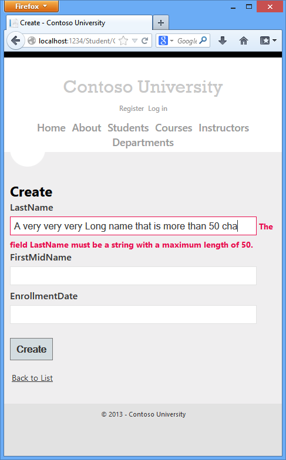

### The Column Attribute

You can also use attributes to control how your classes and properties are mapped to the database. Suppose you had used the name `FirstMidName` for the first-name field because the field might also contain a middle name. But you want the database column to be named `FirstName`, because users who will be writing ad-hoc queries against the database are accustomed to that name. To make this mapping, you can use the `Column` attribute.

The `Column` attribute specifies that when the database is created, the column of the `Student` table that maps to the `FirstMidName` property will be named `FirstName`. In other words, when your code refers to `Student.FirstMidName`, the data will come from or be updated in the `FirstName` column of the `Student` table. If you don't specify column names, they are given the same name as the property name.

Add a using statement for [System.ComponentModel.DataAnnotations.Schema](https://msdn.microsoft.com/en-us/library/system.componentmodel.dataannotations.schema.aspx) and the column name attribute to the `FirstMidName` property, as shown in the following highlighted code:

[!code-csharp[Main](creating-a-more-complex-data-model-for-an-asp-net-mvc-application/samples/sample5.cs?highlight=4,14)]

The addition of the [Column attribute](https://msdn.microsoft.com/en-us/library/system.componentmodel.dataannotations.schema.columnattribute.aspx) changes the model backing the SchoolContext, so it won't match the database. Enter the following commands in the PMC to create another migration:

[!code-console[Main](creating-a-more-complex-data-model-for-an-asp-net-mvc-application/samples/sample6.cmd)]

In **Server Explorer** (**Database Explorer** if you are using Express for Web), double-click the *Student* table.

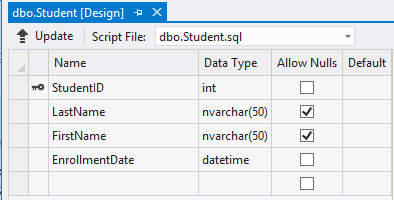

The following image shows the original column name as it was before you applied the first two migrations. In addition to the column name changing from `FirstMidName` to `FirstName`, the two name columns have changed from `MAX` length to 50 characters.

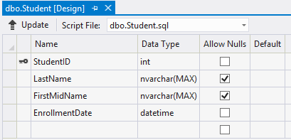

You can also make database mapping changes using the [Fluent API](https://msdn.microsoft.com/en-us/data/jj591617), as you'll see later in this tutorial.

> [!NOTE]
> If you try to compile before you finish creating all of these entity classes, you might get compiler errors.

## Create the Instructor Entity

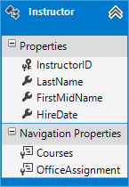

Create *Models\Instructor.cs*, replacing the template code with the following code:

[!code-csharp[Main](creating-a-more-complex-data-model-for-an-asp-net-mvc-application/samples/sample7.cs)]

Notice that several properties are the same in the `Student` and `Instructor` entities. In the [Implementing Inheritance](implementing-inheritance-with-the-entity-framework-in-an-asp-net-mvc-application.md) tutorial later in this series, you'll refactor using inheritance to eliminate this redundancy.

### The Required and Display Attributes

The attributes on the `LastName` property specify that it's a required field, that the caption for the text box should be "Last Name" (instead of the property name, which would be "LastName" with no space), and that the value can't be longer than 50 characters.

[!code-csharp[Main](creating-a-more-complex-data-model-for-an-asp-net-mvc-application/samples/sample8.cs)]

The [StringLength attribute](https://msdn.microsoft.com/en-us/library/system.componentmodel.dataannotations.stringlengthattribute.aspx) sets the maximum length in the database and provides client side and server side validation for ASP.NET MVC. You can also specify the minimum string length in this attribute, but the minimum value has no impact on the database schema. The [Required attribute](https://msdn.microsoft.com/en-us/library/system.componentmodel.dataannotations.requiredattribute.aspx) is not needed for value types such as DateTime, int, double, and float. Value types cannot be assigned a null value, so they are inherently required. You could remove the [Required attribute](https://msdn.microsoft.com/en-us/library/system.componentmodel.dataannotations.requiredattribute.aspx) and replace it with a minimum length parameter for the `StringLength` attribute:

[!code-csharp[Main](creating-a-more-complex-data-model-for-an-asp-net-mvc-application/samples/sample9.cs?highlight=2)]

You can put multiple attributes on one line, so you could also write the instructor class as follows:

[!code-csharp[Main](creating-a-more-complex-data-model-for-an-asp-net-mvc-application/samples/sample10.cs)]

### The FullName Calculated Property

`FullName` is a calculated property that returns a value that's created by concatenating two other properties. Therefore it has only a `get` accessor, and no `FullName` column will be generated in the database.

[!code-csharp[Main](creating-a-more-complex-data-model-for-an-asp-net-mvc-application/samples/sample11.cs)]

### The Courses and OfficeAssignment Navigation Properties

The `Courses` and `OfficeAssignment` properties are navigation properties. As was explained earlier, they are typically defined as [virtual](https://msdn.microsoft.com/en-us/library/9fkccyh4(v=vs.110).aspx) so that they can take advantage of an Entity Framework feature called [lazy loading](https://msdn.microsoft.com/en-us/magazine/hh205756.aspx). In addition, if a navigation property can hold multiple entities, its type must implement the [ICollection&lt;T&gt;](https://msdn.microsoft.com/en-us/library/92t2ye13.aspx) Interface. (For example [IList&lt;T&gt;](https://msdn.microsoft.com/en-us/library/5y536ey6.aspx) qualifies but not [IEnumerable&lt;T&gt;](https://msdn.microsoft.com/en-us/library/9eekhta0.aspx) because `IEnumerable<T>` doesn't implement [Add](https://msdn.microsoft.com/en-us/library/63ywd54z.aspx).

An instructor can teach any number of courses, so `Courses` is defined as a collection of `Course` entities. Our business rules state an instructor can only have at most one office, so `OfficeAssignment` is defined as a single `OfficeAssignment` entity (which may be `null` if no office is assigned).

[!code-csharp[Main](creating-a-more-complex-data-model-for-an-asp-net-mvc-application/samples/sample12.cs)]

## Create the OfficeAssignment Entity

Create *Models\OfficeAssignment.cs* with the following code:

[!code-csharp[Main](creating-a-more-complex-data-model-for-an-asp-net-mvc-application/samples/sample13.cs)]

Build the project, which saves your changes and verifies you haven't made any copy and paste errors the compiler can catch.

### The Key Attribute

There's a one-to-zero-or-one relationship between the `Instructor` and the `OfficeAssignment` entities. An office assignment only exists in relation to the instructor it's assigned to, and therefore its primary key is also its foreign key to the `Instructor` entity. But the Entity Framework can't automatically recognize `InstructorID` as the primary key of this entity because its name doesn't follow the `ID` or *classname* `ID` naming convention. Therefore, the `Key` attribute is used to identify it as the key:

[!code-csharp[Main](creating-a-more-complex-data-model-for-an-asp-net-mvc-application/samples/sample14.cs)]

You can also use the `Key` attribute if the entity does have its own primary key but you want to name the property something different than `classnameID` or `ID`. By default EF treats the key as non-database-generated because the column is for an identifying relationship.

### The ForeignKey Attribute

When there is a one-to-zero-or-one relationship or a one-to-one relationship between two entities (such as between `OfficeAssignment` and `Instructor`), EF can't work out which end of the relationship is the principal and which end is dependent. One-to-one relationships have a reference navigation property in each class to the other class. The [ForeignKey Attribute](https://msdn.microsoft.com/en-us/library/system.componentmodel.dataannotations.schema.foreignkeyattribute.aspx) can be applied to the dependent class to establish the relationship. If you omit the [ForeignKey Attribute](https://msdn.microsoft.com/en-us/library/system.componentmodel.dataannotations.schema.foreignkeyattribute.aspx), you get the following error when you try to create the migration:

Unable to determine the principal end of an association between the types 'ContosoUniversity.Models.OfficeAssignment' and 'ContosoUniversity.Models.Instructor'. The principal end of this association must be explicitly configured using either the relationship fluent API or data annotations.

Later in the tutorial we'll show how to configure this relationship with the fluent API.

### The Instructor Navigation Property

The `Instructor` entity has a nullable `OfficeAssignment` navigation property (because an instructor might not have an office assignment), and the `OfficeAssignment` entity has a non-nullable `Instructor` navigation property (because an office assignment can't exist without an instructor -- `InstructorID` is non-nullable). When an `Instructor` entity has a related `OfficeAssignment` entity, each entity will have a reference to the other one in its navigation property.

You could put a `[Required]` attribute on the Instructor navigation property to specify that there must be a related instructor, but you don't have to do that because the InstructorID foreign key (which is also the key to this table) is non-nullable.

## Modify the Course Entity

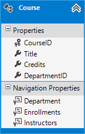

In *Models\Course.cs*, replace the code you added earlier with the following code:

[!code-csharp[Main](creating-a-more-complex-data-model-for-an-asp-net-mvc-application/samples/sample15.cs)]

The course entity has a foreign key property `DepartmentID` which points to the related `Department` entity and it has a `Department` navigation property. The Entity Framework doesn't require you to add a foreign key property to your data model when you have a navigation property for a related entity. EF automatically creates foreign keys in the database wherever they are needed. But having the foreign key in the data model can make updates simpler and more efficient. For example, when you fetch a course entity to edit, the `Department` entity is null if you don't load it, so when you update the course entity, you would have to first fetch the `Department` entity. When the foreign key property `DepartmentID` is included in the data model, you don't need to fetch the `Department` entity before you update.

### The DatabaseGenerated Attribute

The [DatabaseGenerated attribute](https://msdn.microsoft.com/en-us/library/system.componentmodel.dataannotations.schema.databasegeneratedattribute.aspx) with the [None](https://msdn.microsoft.com/en-us/library/system.componentmodel.dataannotations.schema.databasegeneratedoption(v=vs.110).aspx) parameter on the `CourseID` property specifies that primary key values are provided by the user rather than generated by the database.

[!code-csharp[Main](creating-a-more-complex-data-model-for-an-asp-net-mvc-application/samples/sample16.cs)]

By default, the Entity Framework assumes that primary key values are generated by the database. That's what you want in most scenarios. However, for `Course` entities, you'll use a user-specified course number such as a 1000 series for one department, a 2000 series for another department, and so on.

### Foreign Key and Navigation Properties

The foreign key properties and navigation properties in the `Course` entity reflect the following relationships:

- A course is assigned to one department, so there's a `DepartmentID` foreign key and a `Department` navigation property for the reasons mentioned above. 

    [!code-csharp[Main](creating-a-more-complex-data-model-for-an-asp-net-mvc-application/samples/sample17.cs)]
- A course can have any number of students enrolled in it, so the `Enrollments` navigation property is a collection: 

    [!code-csharp[Main](creating-a-more-complex-data-model-for-an-asp-net-mvc-application/samples/sample18.cs)]
- A course may be taught by multiple instructors, so the `Instructors` navigation property is a collection: 

    [!code-csharp[Main](creating-a-more-complex-data-model-for-an-asp-net-mvc-application/samples/sample19.cs)]

## Creating the Department Entity

Create *Models\Department.cs* with the following code:

[!code-csharp[Main](creating-a-more-complex-data-model-for-an-asp-net-mvc-application/samples/sample20.cs)]

### The Column Attribute

Earlier you used the [Column attribute](https://msdn.microsoft.com/en-us/library/system.componentmodel.dataannotations.schema.columnattribute.aspx) to change column name mapping. In the code for the `Department` entity, the `Column` attribute is being used to change SQL data type mapping so that the column will be defined using the SQL Server [money](https://msdn.microsoft.com/en-us/library/ms179882.aspx) type in the database:

[!code-csharp[Main](creating-a-more-complex-data-model-for-an-asp-net-mvc-application/samples/sample21.cs)]

Column mapping is generally not required, because the Entity Framework usually chooses the appropriate SQL Server data type based on the CLR type that you define for the property. The CLR `decimal` type maps to a SQL Server `decimal` type. But in this case you know that the column will be holding currency amounts, and the [money](https://msdn.microsoft.com/en-us/library/ms179882.aspx) data type is more appropriate for that.

### Foreign Key and Navigation Properties

The foreign key and navigation properties reflect the following relationships:

- A department may or may not have an administrator, and an administrator is always an instructor. Therefore the `InstructorID` property is included as the foreign key to the `Instructor` entity, and a question mark is added after the `int` type designation to mark the property as nullable.The navigation property is named `Administrator` but holds an `Instructor` entity: 

    [!code-csharp[Main](creating-a-more-complex-data-model-for-an-asp-net-mvc-application/samples/sample22.cs)]
- A department may have many courses, so there's a `Courses` navigation property: 

    [!code-csharp[Main](creating-a-more-complex-data-model-for-an-asp-net-mvc-application/samples/sample23.cs)]

 > [!NOTE]
 > By convention, the Entity Framework enables cascade delete for non-nullable foreign keys and for many-to-many relationships. This can result in circular cascade delete rules, which will cause an exception when your initializer code runs. For example, if you didn't define the `Department.InstructorID` property as nullable, you'd get the following exception message when the initializer runs: "The referential relationship will result in a cyclical reference that's not allowed." If your business rules required `InstructorID` property as non-nullable, you would have to use the following fluent API to disable cascade delete on the relationship: 

[!code-csharp[Main](creating-a-more-complex-data-model-for-an-asp-net-mvc-application/samples/sample24.cs)]

## Modifying the Student Entity

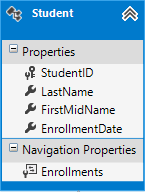

In *Models\Student.cs*, replace the code you added earlier with the following code. The changes are highlighted.

[!code-csharp[Main](creating-a-more-complex-data-model-for-an-asp-net-mvc-application/samples/sample25.cs?highlight=12,15,24-27)]

## The Enrollment Entity

 In *Models\Enrollment.cs*, replace the code you added earlier with the following code

[!code-csharp[Main](creating-a-more-complex-data-model-for-an-asp-net-mvc-application/samples/sample26.cs?highlight=16)]

### Foreign Key and Navigation Properties

The foreign key properties and navigation properties reflect the following relationships:

- An enrollment record is for a single course, so there's a `CourseID` foreign key property and a `Course` navigation property: 

    [!code-csharp[Main](creating-a-more-complex-data-model-for-an-asp-net-mvc-application/samples/sample27.cs)]
- An enrollment record is for a single student, so there's a `StudentID` foreign key property and a `Student` navigation property: 

    [!code-csharp[Main](creating-a-more-complex-data-model-for-an-asp-net-mvc-application/samples/sample28.cs)]

### Many-to-Many Relationships

There's a many-to-many relationship between the `Student` and `Course` entities, and the `Enrollment` entity functions as a many-to-many join table *with payload* in the database. This means that the `Enrollment` table contains additional data besides foreign keys for the joined tables (in this case, a primary key and a `Grade` property).

The following illustration shows what these relationships look like in an entity diagram. (This diagram was generated using the [Entity Framework Power Tools](https://visualstudiogallery.msdn.microsoft.com/72a60b14-1581-4b9b-89f2-846072eff19d); creating the diagram isn't part of the tutorial, it's just being used here as an illustration.)

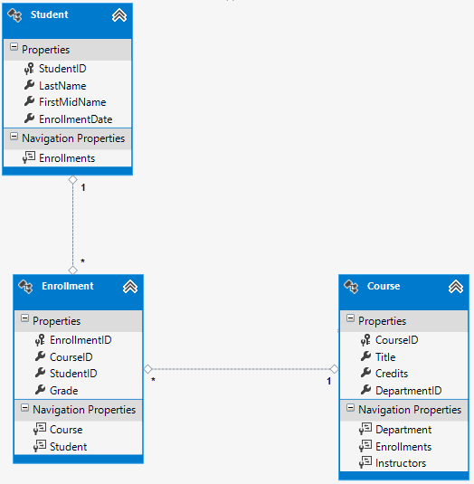

Each relationship line has a 1 at one end and an asterisk (\*) at the other, indicating a one-to-many relationship.

If the `Enrollment` table didn't include grade information, it would only need to contain the two foreign keys `CourseID` and `StudentID`. In that case, it would correspond to a many-to-many join table *without payload* (or a *pure join table*) in the database, and you wouldn't have to create a model class for it at all. The `Instructor` and `Course` entities have that kind of many-to-many relationship, and as you can see, there is no entity class between them:

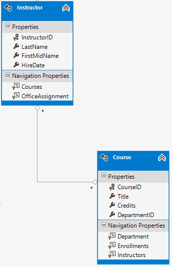

A join table is required in the database, however, as shown in the following database diagram:

The Entity Framework automatically creates the `CourseInstructor` table, and you read and update it indirectly by reading and updating the `Instructor.Courses` and `Course.Instructors` navigation properties.

## Entity Diagram Showing Relationships

The following illustration shows the diagram that the Entity Framework Power Tools create for the completed School model.

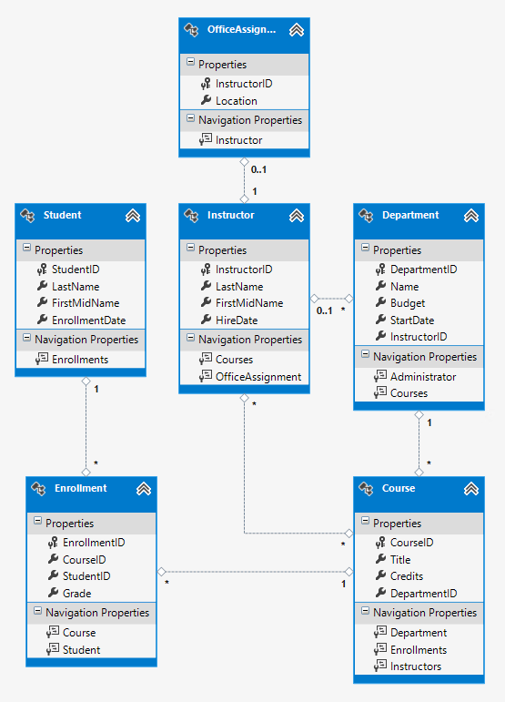

Besides the many-to-many relationship lines (\* to \*) and the one-to-many relationship lines (1 to \*), you can see here the one-to-zero-or-one relationship line (1 to 0..1) between the `Instructor` and `OfficeAssignment` entities and the zero-or-one-to-many relationship line (0..1 to \*) between the Instructor and Department entities.

## Customize the Data Model by adding Code to the Database Context

Next you'll add the new entities to the `SchoolContext` class and customize some of the mapping using [fluent API](https://msdn.microsoft.com/en-us/data/jj591617) calls. (The API is "fluent" because it's often used by stringing a series of method calls together into a single statement.)

In this tutorial you'll use the fluent API only for database mapping that you can't do with attributes. However, you can also use the fluent API to specify most of the formatting, validation, and mapping rules that you can do by using attributes. Some attributes such as `MinimumLength` can't be applied with the fluent API. As mentioned previously, `MinimumLength` doesn't change the schema, it only applies a client and server side validation rule

Some developers prefer to use the fluent API exclusively so that they can keep their entity classes "clean." You can mix attributes and fluent API if you want, and there are a few customizations that can only be done by using fluent API, but in general the recommended practice is to choose one of these two approaches and use that consistently as much as possible.

To add the new entities to the data model and perform database mapping that you didn't do by using attributes, replace the code in *DAL\SchoolContext.cs* with the following code:

[!code-csharp[Main](creating-a-more-complex-data-model-for-an-asp-net-mvc-application/samples/sample29.cs)]

The new statement in the [OnModelCreating](https://msdn.microsoft.com/en-us/library/system.data.entity.dbcontext.onmodelcreating(v=vs.103).aspx) method configures the many-to-many join table:

- For the many-to-many relationship between the `Instructor` and `Course` entities, the code specifies the table and column names for the join table. Code First can configure the many-to-many relationship for you without this code, but if you don't call it, you will get default names such as `InstructorInstructorID` for the `InstructorID` column.

    [!code-csharp[Main](creating-a-more-complex-data-model-for-an-asp-net-mvc-application/samples/sample30.cs)]

The following code provides an example of how you could have used fluent API instead of attributes to specify the relationship between the `Instructor` and `OfficeAssignment` entities:

[!code-csharp[Main](creating-a-more-complex-data-model-for-an-asp-net-mvc-application/samples/sample31.cs)]

For information about what "fluent API" statements are doing behind the scenes, see the [Fluent API](https://blogs.msdn.com/b/aspnetue/archive/2011/05/04/entity-framework-code-first-tutorial-supplement-what-is-going-on-in-a-fluent-api-call.aspx) blog post.

## Seed the Database with Test Data

Replace the code in the *Migrations\Configuration.cs* file with the following code in order to provide seed data for the new entities you've created.

[!code-csharp[Main](creating-a-more-complex-data-model-for-an-asp-net-mvc-application/samples/sample32.cs)]

As you saw in the first tutorial, most of this code simply updates or creates new entity objects and loads sample data into properties as required for testing. However, notice how the `Course` entity, which has a many-to-many relationship with the `Instructor` entity, is handled:

[!code-csharp[Main](creating-a-more-complex-data-model-for-an-asp-net-mvc-application/samples/sample33.cs)]

When you create a `Course` object, you initialize the `Instructors` navigation property as an empty collection using the code `Instructors = new List<Instructor>()`. This makes it possible to add `Instructor` entities that are related to this `Course` by using the `Instructors.Add` method. If you didn't create an empty list, you wouldn't be able to add these relationships, because the `Instructors` property would be null and wouldn't have an `Add` method. You could also add the list initialization to the constructor.

## Add a Migration and Update the Database

From the PMC, enter the `add-migration` command:

`PM> add-Migration Chap4`

If you try to update the database at this point, you'll get the following error:

*The ALTER TABLE statement conflicted with the FOREIGN KEY constraint "FK\_dbo.Course\_dbo.Department\_DepartmentID". The conflict occurred in database "ContosoUniversity", table "dbo.Department", column 'DepartmentID'.*

Edit the &lt;*timestamp&gt;\_Chap4.cs* file, and make the following code changes (you'll add a SQL statement and modify an `AddColumn` statement):

[!code-csharp[Main](creating-a-more-complex-data-model-for-an-asp-net-mvc-application/samples/sample34.cs?highlight=14-18)]

(Make sure that you comment out or delete the existing `AddColumn` line when you add the new one, or you'll get an error when you enter the `update-database` command.)

Sometimes when you execute migrations with existing data, you need to insert stub data into the database to satisfy foreign key constraints, and that's what you're doing now. The generated code adds a non-nullable `DepartmentID` foreign key to the `Course` table. If there are already rows in the `Course` table when the code runs, the `AddColumn` operation would fail because SQL Server doesn't know what value to put in the column that can't be null. Therefore you've changed the code to give the new column a default value, and you've created a stub department named "Temp" to act as the default department. As a result, if there are existing `Course` rows when this code runs, they will all be related to the "Temp" department.

When the `Seed` method runs, it will insert rows in the `Department` table and it will relate existing `Course` rows to those new `Department` rows. If you haven't added any courses in the UI, you would then no longer need the "Temp" department or the default value on the `Course.DepartmentID` column. To allow for the possibility that someone might have added courses by using the application, you'd also want to update the `Seed` method code to ensure that all `Course` rows (not just the ones inserted by earlier runs of the `Seed` method) have valid `DepartmentID` values before you remove the default value from the column and delete the "Temp" department.

After you have finished editing the &lt;*timestamp&gt;\_Chap4.cs* file, enter the `update-database` command in the PMC to execute the migration.

> [!NOTE]
> It's possible to get other errors when migrating data and making schema changes. If you get migration errors you can't resolve, you can either change the connection string in the *Web.config* file or delete the database. The simplest approach is to rename the database in *Web.config* file. For example, change the database name to CU\_test as shown in the following:
> 
> [!code-xml[Main](creating-a-more-complex-data-model-for-an-asp-net-mvc-application/samples/sample35.xml?highlight=1-2)]
> 
>  With a new database, there is no data to migrate, and the `update-database` command is much more likely to complete without errors. For instructions on how to delete the database, see [How to Drop a Database from Visual Studio 2012](http://romiller.com/2013/05/17/how-to-drop-a-database-from-visual-studio-2012/).

Open the database in **Server Explorer** as you did earlier, and expand the **Tables** node to see that all of the tables have been created. (If you still have **Server Explorer** open from the earlier time, click the **Refresh** button.)

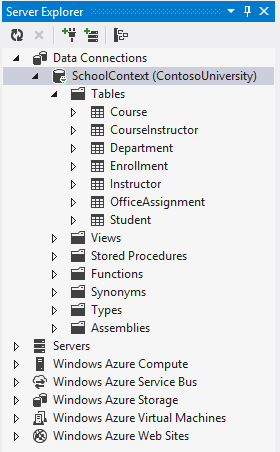

You didn't create a model class for the `CourseInstructor` table. As explained earlier, this is a join table for the many-to-many relationship between the `Instructor` and `Course` entities.

Right-click the `CourseInstructor` table and select **Show Table Data** to verify that it has data in it as a result of the `Instructor` entities you added to the `Course.Instructors` navigation property.

## Summary

You now have a more complex data model and corresponding database. In the following tutorial you'll learn more about different ways to access related data.

Links to other Entity Framework resources can be found in the [ASP.NET Data Access Content Map](../../../../whitepapers/aspnet-data-access-content-map.md).

>[!div class="step-by-step"]
[Previous](sorting-filtering-and-paging-with-the-entity-framework-in-an-asp-net-mvc-application.md)
[Next](reading-related-data-with-the-entity-framework-in-an-asp-net-mvc-application.md)