Creating an Entity Framework Data Model for an ASP.NET MVC Application (1 of 10)
====================
by [Tom Dykstra](https://github.com/tdykstra)

[Download Completed Project](http://code.msdn.microsoft.com/Getting-Started-with-dd0e2ed8)

> > [!NOTE] 
> > 
> > A [newer version of this tutorial series](../../getting-started/getting-started-with-ef-using-mvc/creating-an-entity-framework-data-model-for-an-asp-net-mvc-application.md) is available, for Visual Studio 2013, Entity Framework 6, and MVC 5.
> 
> 
> The Contoso University sample web application demonstrates how to create ASP.NET MVC 4 applications using the Entity Framework 5 and Visual Studio 2012. The sample application is a web site for a fictional Contoso University. It includes functionality such as student admission, course creation, and instructor assignments. This tutorial series explains how to build the Contoso University sample application. You can [download the completed application](https://code.msdn.microsoft.com/Getting-Started-with-dd0e2ed8).
> 
> ## Code First
> 
> There are three ways you can work with data in the Entity Framework: *Database First*, *Model First*, and *Code First*. This tutorial is for Code First. For information about the differences between these workflows and guidance on how to choose the best one for your scenario, see [Entity Framework Development Workflows](https://msdn.microsoft.com/en-us/library/ms178359.aspx#dbfmfcf).
> 
> ## MVC
> 
> The sample application is built on [ASP.NET MVC](../../../index.md). If you prefer to work with the ASP.NET Web Forms model, see the [Model Binding and Web Forms](../../../../web-forms/overview/presenting-and-managing-data/model-binding/retrieving-data.md) tutorial series and [ASP.NET Data Access Content Map](../../../../whitepapers/aspnet-data-access-content-map.md).
> 
> ## Software versions
> 
> | **Shown in the tutorial** | **Also works with** |
> | --- | --- |
> | Windows 8 | Windows 7 |
> | Visual Studio 2012 | Visual Studio 2012 Express for Web. This is automatically installed by the Windows Azure SDK if you don't already have VS 2012 or VS 2012 Express for Web. Visual Studio 2013 should work, but the tutorial has not been tested with it, and some menu selections and dialog boxes are different. The [VS 2013 version of the Windows Azure SDK](https://go.microsoft.com/fwlink/p/?linkid=323510) is required for Windows Azure deployment. |
> | .NET 4.5 | Most of the features shown will work in .NET 4, but some won't. For example, enum support in EF requires .NET 4.5. |
> | Entity Framework 5 |  |
> | [Windows Azure SDK 2.1](https://go.microsoft.com/fwlink/p/?linkid=323511) | If you skip the Windows Azure deployment steps, you don't need the SDK. When a new version of the SDK is released, the link will install the newer version. In that case, you might have to adapt some of the instructions to new UI and features. |
> 
> ## Questions
> 
> If you have questions that are not directly related to the tutorial, you can post them to the [ASP.NET Entity Framework forum](https://forums.asp.net/1227.aspx), the [Entity Framework and LINQ to Entities forum](https://social.msdn.microsoft.com/forums/en-US/adodotnetentityframework/threads/), or [StackOverflow.com](http://stackoverflow.com/).
> 
> ## Acknowledgments
> 
> See the last tutorial in the series for [acknowledgments and a note about VB](advanced-entity-framework-scenarios-for-an-mvc-web-application.md#acknowledgments).
> 
> ## Original version of the tutorial
> 
> The original version of the tutorial is available in the [the EF 4.1 / MVC 3 e-book](https://social.technet.microsoft.com/wiki/contents/articles/11608.e-book-gallery-for-microsoft-technologies.aspx#GettingStartedwiththeEntityFramework4.1usingASP.NETMVC).

## The Contoso University Web Application

The application you'll be building in these tutorials is a simple university web site.

Users can view and update student, course, and instructor information. Here are a few of the screens you'll create.

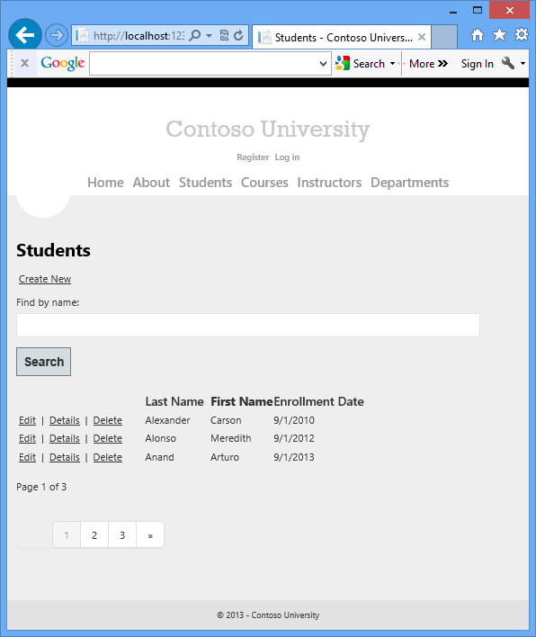

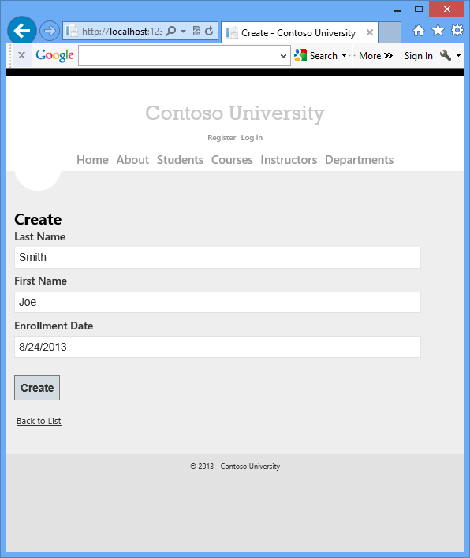

The UI style of this site has been kept close to what's generated by the built-in templates, so that the tutorial can focus mainly on how to use the Entity Framework.

## Prerequisites

The directions and screen shots in this tutorial assume that you're using [Visual Studio 2012](https://www.microsoft.com/visualstudio/eng/downloads) or [Visual Studio 2012 Express for Web](https://go.microsoft.com/fwlink/?LinkID=275131), with the latest update and Azure SDK for .NET installed as of July, 2013. You can get all of this with the following link:

[Azure SDK for .NET (Visual Studio 2012)](https://go.microsoft.com/fwlink/?LinkId=254364)

If you have Visual Studio installed, the link above will install any missing components. If you don't have Visual Studio, the link will install Visual Studio 2012 Express for Web. You can use Visual Studio 2013, but some of the required procedures and screens will differ.

## Create an MVC Web Application

Open Visual Studio and create a new C# project named "ContosoUniversity" using the **ASP.NET MVC 4 Web Application** template. Make sure you target **.NET Framework 4.5** (you'll be using [`enum` properties](https://msdn.microsoft.com/en-us/data/hh859576.aspx), and that requires .NET 4.5).

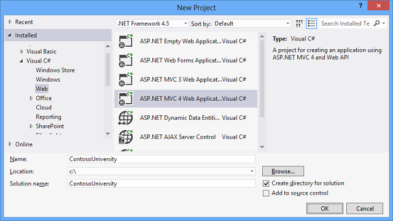

In the **New ASP.NET MVC 4 Project** dialog box select the **Internet Application** template.

Leave the **Razor** view engine selected, and leave the **Create a unit test project** check box cleared.

Click **OK**.

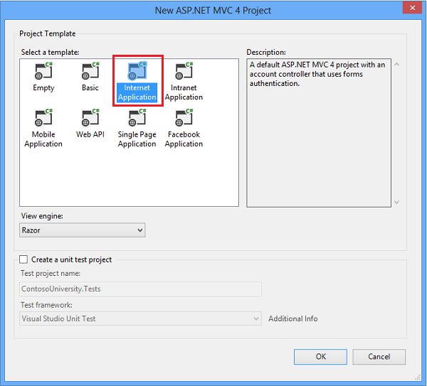

## Set Up the Site Style

A few simple changes will set up the site menu, layout, and home page.

Open *Views\Shared\\_Layout.cshtml*, and replace the contents of the file with the following code. The changes are highlighted.

[!code-cshtml[Main](creating-an-entity-framework-data-model-for-an-asp-net-mvc-application/samples/sample1.cshtml?highlight=5,15,25-28,43)]

This code makes the following changes:

- Replaces the template instances of "My ASP.NET MVC Application" and "your logo here" with "Contoso University".
- Adds several action links that will be used later in the tutorial.

In *Views\Home\Index.cshtml*, replace the contents of the file with the following code to eliminate the template paragraphs about ASP.NET and MVC:

[!code-cshtml[Main](creating-an-entity-framework-data-model-for-an-asp-net-mvc-application/samples/sample2.cshtml)]

In *Controllers\HomeController.cs*, change the value for `ViewBag.Message` in the `Index` Action method to "Welcome to Contoso University!", as shown in the following example:

[!code-csharp[Main](creating-an-entity-framework-data-model-for-an-asp-net-mvc-application/samples/sample3.cs?highlight=3)]

Press CTRL+F5 to run the site. You see the home page with the main menu.

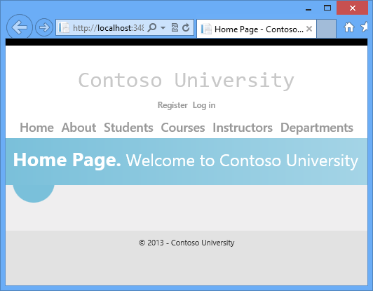

## Create the Data Model

Next you'll create entity classes for the Contoso University application. You'll start with the following three entities:

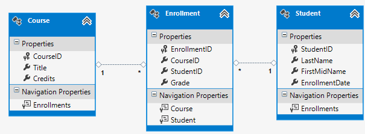

There's a one-to-many relationship between `Student` and `Enrollment` entities, and there's a one-to-many relationship between `Course` and `Enrollment` entities. In other words, a student can be enrolled in any number of courses, and a course can have any number of students enrolled in it.

In the following sections you'll create a class for each one of these entities.

> [!NOTE]
> If you try to compile the project before you finish creating all of these entity classes, you'll get compiler errors.

### The Student Entity

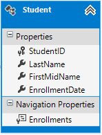

In the *Models* folder, create *Student.cs* and replace the existing code with the following code:

[!code-csharp[Main](creating-an-entity-framework-data-model-for-an-asp-net-mvc-application/samples/sample4.cs)]

The `StudentID` property will become the primary key column of the database table that corresponds to this class. By default, the Entity Framework interprets a property that's named `ID` or *classname* `ID` as the primary key.

The `Enrollments` property is a *navigation property*. Navigation properties hold other entities that are related to this entity. In this case, the `Enrollments` property of a `Student` entity will hold all of the `Enrollment` entities that are related to that `Student` entity. In other words, if a given `Student` row in the database has two related `Enrollment` rows (rows that contain that student's primary key value in their `StudentID` foreign key column), that `Student` entity's `Enrollments` navigation property will contain those two `Enrollment` entities.

Navigation properties are typically defined as `virtual` so that they can take advantage of certain Entity Framework functionality such as *lazy loading*. (Lazy loading will be explained later, in the [Reading Related Data](reading-related-data-with-the-entity-framework-in-an-asp-net-mvc-application.md) tutorial later in this series.

If a navigation property can hold multiple entities (as in many-to-many or one-to-many relationships), its type must be a list in which entries can be added, deleted, and updated, such as `ICollection`.

### The Enrollment Entity

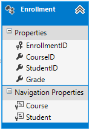

In the *Models* folder, create *Enrollment.cs* and replace the existing code with the following code:

[!code-csharp[Main](creating-an-entity-framework-data-model-for-an-asp-net-mvc-application/samples/sample5.cs)]

The Grade property is an [enum](https://msdn.microsoft.com/en-us/data/hh859576.aspx). The question mark after the `Grade` type declaration indicates that the `Grade` property is [nullable](https://msdn.microsoft.com/en-us/library/2cf62fcy.aspx). A grade that's null is different from a zero grade — null means a grade isn't known or hasn't been assigned yet.

The `StudentID` property is a foreign key, and the corresponding navigation property is `Student`. An `Enrollment` entity is associated with one `Student` entity, so the property can only hold a single `Student` entity (unlike the `Student.Enrollments` navigation property you saw earlier, which can hold multiple `Enrollment` entities).

The `CourseID` property is a foreign key, and the corresponding navigation property is `Course`. An `Enrollment` entity is associated with one `Course` entity.

### The Course Entity

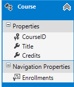

In the *Models* folder, create *Course.cs*, replacing the existing code with the following code:

[!code-csharp[Main](creating-an-entity-framework-data-model-for-an-asp-net-mvc-application/samples/sample6.cs)]

The `Enrollments` property is a navigation property. A `Course` entity can be related to any number of `Enrollment` entities.

We'll say more about the [[DatabaseGenerated](https://msdn.microsoft.com/en-us/library/system.componentmodel.dataannotations.schema.databasegeneratedattribute(v=vs.110).aspx)([DatabaseGeneratedOption](https://msdn.microsoft.com/en-us/library/system.componentmodel.dataannotations.schema.databasegeneratedoption(v=vs.95).aspx).None)] attribute in the next tutorial. Basically, this attribute lets you enter the primary key for the course rather than having the database generate it.

## Create the Database Context

The main class that coordinates Entity Framework functionality for a given data model is the *database context* class. You create this class by deriving from the [System.Data.Entity.DbContext](https://msdn.microsoft.com/en-us/library/system.data.entity.dbcontext(v=VS.103).aspx) class. In your code you specify which entities are included in the data model. You can also customize certain Entity Framework behavior. In this project, the class is named `SchoolContext`.

Create a folder named *DAL* (for Data Access Layer). In that folder create a new class file named *SchoolContext.cs*, and replace the existing code with the following code:

[!code-csharp[Main](creating-an-entity-framework-data-model-for-an-asp-net-mvc-application/samples/sample7.cs)]

This code creates a [DbSet](https://msdn.microsoft.com/en-us/library/system.data.entity.dbset(v=VS.103).aspx) property for each entity set. In Entity Framework terminology, an *entity set* typically corresponds to a database table, and an *entity* corresponds to a row in the table.

The `modelBuilder.Conventions.Remove` statement in the [OnModelCreating](https://msdn.microsoft.com/en-us/library/system.data.entity.dbcontext.onmodelcreating(v=vs.103).aspx) method prevents table names from being pluralized. If you didn't do this, the generated tables would be named `Students`, `Courses`, and `Enrollments`. Instead, the table names will be `Student`, `Course`, and `Enrollment`. Developers disagree about whether table names should be pluralized or not. This tutorial uses the singular form, but the important point is that you can select whichever form you prefer by including or omitting this line of code.

## SQL Server Express LocalDB

[LocalDB](https://blogs.msdn.com/b/sqlexpress/archive/2011/07/12/introducing-localdb-a-better-sql-express.aspx) is a lightweight version of the SQL Server Express Database Engine that starts on demand and runs in user mode. LocalDB runs in a special execution mode of SQL Server Express that enables you to work with databases as *.mdf* files. Typically, LocalDB database files are kept in the *App\_Data* folder of a web project. The user instance feature in SQL Server Express also enables you to work with *.mdf* files, but the user instance feature is deprecated; therefore, LocalDB is recommended for working with *.mdf* files.

Typically SQL Server Express is not used for production web applications. LocalDB in particular is not recommended for production use with a web application because it is not designed to work with IIS.

In Visual Studio 2012 and later versions, LocalDB is installed by default with Visual Studio. In Visual Studio 2010 and earlier versions, SQL Server Express (without LocalDB) is installed by default with Visual Studio; you have to install it manually if you're using Visual Studio 2010.

In this tutorial you'll work with LocalDB so that the database can be stored in the *App\_Data* folder as an *.mdf* file. Open the root *Web.config* file and add a new connection string to the `connectionStrings` collection, as shown in the following example. (Make sure you update the *Web.config* file in the root project folder. There's also a *Web.config* file is in the *Views* subfolder that you don't need to update.)

[!code-xml[Main](creating-an-entity-framework-data-model-for-an-asp-net-mvc-application/samples/sample8.xml)]

By default, the Entity Framework looks for a connection string named the same as the `DbContext` class (`SchoolContext` for this project). The connection string you've added specifies a LocalDB database named *ContosoUniversity.mdf* located in the *App\_Data* folder. For more information, see [SQL Server Connection Strings for ASP.NET Web Applications](https://msdn.microsoft.com/en-us/library/jj653752.aspx).

You don't actually need to specify the connection string. If you don't supply a connection string, Entity Framework will create one for you; however, the database might not be in the *App\_data* folder of your app. For information on where the database will be created, see [Code First to a New Database](https://msdn.microsoft.com/en-us/data/jj193542).

The `connectionStrings` collection also has a connection string named `DefaultConnection` which is used for the membership database. You won't be using the membership database in this tutorial. The only difference between the two connection strings is the database name and the name attribute value.

## Set up and Execute a Code First Migration

When you first start to develop an application, your data model changes frequently, and each time the model changes it gets out of sync with the database. You can configure the Entity Framework to automatically drop and re-create the database each time you change the data model. This is not a problem early in development because test data is easily re-created, but after you have deployed to production you usually want to update the database schema without dropping the database. The Migrations feature enables Code First to update the database without dropping and re-creating it. Early in the development cycle of a new project you might want to use [DropCreateDatabaseIfModelChanges](https://msdn.microsoft.com/en-us/library/gg679604(v=vs.103).aspx) to drop, recreate and re-seed the database each time the model changes. One you get ready to deploy your application, you can convert to the migrations approach. For this tutorial you'll only use migrations. For more information, see [Code First Migrations](https://msdn.microsoft.com/en-us/data/jj591621) and [Migrations Screencast Series](https://blogs.msdn.com/b/adonet/archive/2014/03/12/migrations-screencast-series.aspx).

### Enable Code First Migrations

1. From the **Tools** menu, click **Library Package Manager** and then **Package Manager Console**.

    
2. At the `PM>` prompt enter the following command:

    [!code-powershell[Main](creating-an-entity-framework-data-model-for-an-asp-net-mvc-application/samples/sample9.ps1)]

    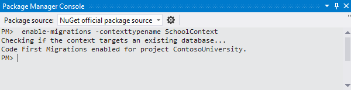

    This command creates a *Migrations* folder in the ContosoUniversity project, and it puts in that folder a *Configuration.cs* file that you can edit to configure Migrations.

    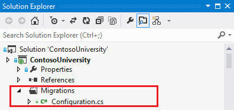

    The `Configuration` class includes a `Seed` method that is called when the database is created and every time it is updated after a data model change.

    [!code-csharp[Main](creating-an-entity-framework-data-model-for-an-asp-net-mvc-application/samples/sample10.cs)]

    The purpose of this `Seed` method is to enable you to insert test data into the database after Code First creates it or updates it.

### Set up the Seed Method

The [Seed](https://msdn.microsoft.com/en-us/library/hh829453(v=vs.103).aspx) method runs when Code First Migrations creates the database and every time it updates the database to the latest migration. The purpose of the Seed method is to enable you to insert data into your tables before the application accesses the database for the first time.

In earlier versions of Code First, before Migrations was released, it was common for `Seed` methods to insert test data, because with every model change during development the database had to be completely deleted and re-created from scratch. With Code First Migrations, test data is retained after database changes, so including test data in the [Seed](https://msdn.microsoft.com/en-us/library/hh829453(v=vs.103).aspx) method is typically not necessary. In fact, you don't want the `Seed` method to insert test data if you'll be using Migrations to deploy the database to production, because the `Seed` method will run in production. In that case you want the `Seed` method to insert into the database only the data that you want to be inserted in production. For example, you might want the database to include actual department names in the `Department` table when the application becomes available in production.

For this tutorial, you'll be using Migrations for deployment, but your `Seed` method will insert test data anyway in order to make it easier to see how application functionality works without having to manually insert a lot of data.

1. Replace the contents of the *Configuration.cs* file with the following code, which will load test data into the new database. 

    [!code-csharp[Main](creating-an-entity-framework-data-model-for-an-asp-net-mvc-application/samples/sample11.cs)]

    The [Seed](https://msdn.microsoft.com/en-us/library/hh829453(v=vs.103).aspx) method takes the database context object as an input parameter, and the code in the method uses that object to add new entities to the database. For each entity type, the code creates a collection of new entities, adds them to the appropriate [DbSet](https://msdn.microsoft.com/en-us/library/system.data.entity.dbset(v=vs.103).aspx) property, and then saves the changes to the database. It isn't necessary to call the [SaveChanges](https://msdn.microsoft.com/en-us/library/system.data.entity.dbcontext.savechanges(v=VS.103).aspx) method after each group of entities, as is done here, but doing that helps you locate the source of a problem if an exception occurs while the code is writing to the database.

    Some of the statements that insert data use the [AddOrUpdate](https://msdn.microsoft.com/en-us/library/system.data.entity.migrations.idbsetextensions.addorupdate(v=vs.103).aspx) method to perform an "upsert" operation. Because the `Seed` method runs with every migration, you can't just insert data, because the rows you are trying to add will already be there after the first migration that creates the database. The "upsert" operation prevents errors that would happen if you try to insert a row that already exists, but it ***overrides*** any changes to data that you may have made while testing the application. With test data in some tables you might not want that to happen: in some cases when you change data while testing you want your changes to remain after database updates. In that case you want to do a conditional insert operation: insert a row only if it doesn't already exist. The Seed method uses both approaches.

    The first parameter passed to the [AddOrUpdate](https://msdn.microsoft.com/en-us/library/system.data.entity.migrations.idbsetextensions.addorupdate(v=vs.103).aspx) method specifies the property to use to check if a row already exists. For the test student data that you are providing, the `LastName` property can be used for this purpose since each last name in the list is unique:

    [!code-csharp[Main](creating-an-entity-framework-data-model-for-an-asp-net-mvc-application/samples/sample12.cs)]

    This code assumes that last names are unique. If you manually add a student with a duplicate last name, you'll get the following exception the next time you perform a migration.

    Sequence contains more than one element

    For more information about the `AddOrUpdate` method, see [Take care with EF 4.3 AddOrUpdate Method](http://thedatafarm.com/blog/data-access/take-care-with-ef-4-3-addorupdate-method/) on Julie Lerman's blog.

    The code that adds `Enrollment` entities doesn't use the `AddOrUpdate` method. It checks if an entity already exists and inserts the entity if it doesn't exist. This approach will preserve changes you make to an enrollment grade when migrations run. The code loops through each member of the `Enrollment`[List](https://msdn.microsoft.com/en-us/library/6sh2ey19.aspx) and if the enrollment is not found in the database, it adds the enrollment to the database. The first time you update the database, the database will be empty, so it will add each enrollment.

    [!code-csharp[Main](creating-an-entity-framework-data-model-for-an-asp-net-mvc-application/samples/sample13.cs)]

    For information about how to debug the `Seed` method and how to handle redundant data such as two students named "Alexander Carson", see [Seeding and Debugging Entity Framework (EF) DBs](https://blogs.msdn.com/b/rickandy/archive/2013/02/12/seeding-and-debugging-entity-framework-ef-dbs.aspx) on Rick Anderson's blog.
2. Build the project.

### Create and Execute the First Migration

1. In the Package Manager Console window, enter the following commands: 

    [!code-powershell[Main](creating-an-entity-framework-data-model-for-an-asp-net-mvc-application/samples/sample14.ps1)]

    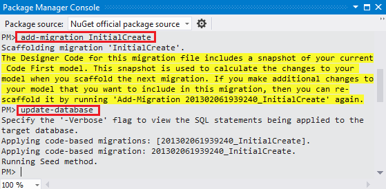

    The `add-migration` command adds to the Migrations folder a *[DateStamp]\_InitialCreate.cs* file that contains code which creates the database. The first parameter (`InitialCreate)` is used for the file name and can be whatever you want; you typically choose a word or phrase that summarizes what is being done in the migration. For example, you might name a later migration &quot;AddDepartmentTable&quot;.

    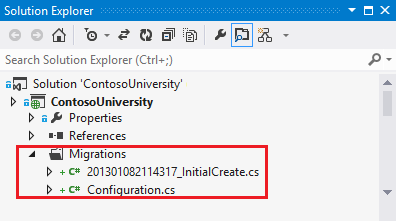

    The `Up` method of the `InitialCreate` class creates the database tables that correspond to the data model entity sets, and the `Down` method deletes them. Migrations calls the `Up` method to implement the data model changes for a migration. When you enter a command to roll back the update, Migrations calls the `Down` method. The following code shows the contents of the `InitialCreate` file:

    [!code-csharp[Main](creating-an-entity-framework-data-model-for-an-asp-net-mvc-application/samples/sample15.cs)]

    The `update-database` command runs the `Up` method to create the database and then it runs the `Seed` method to populate the database.

A SQL Server database has now been created for your data model. The name of the database is *ContosoUniversity*, and the *.mdf* file is in your project's *App\_Data* folder because that's what you specified in your connection string.

You can use either **Server Explorer** or **SQL Server Object Explorer** (SSOX) to view the database in Visual Studio. For this tutorial you'll use **Server Explorer**. In Visual Studio Express 2012 for Web, **Server Explorer** is called **Database Explorer**.

1. From the **View** menu, click **Server Explorer**.
2. Click the **Add Connection** icon.

    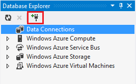
3. If you are prompted with the **Choose Data Source** dialog, click **Microsoft SQL Server**, and then click **Continue**.  
  
    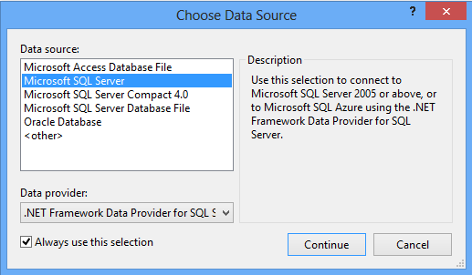
4. In the **Add Connection** dialog box, enter **(localdb)\v11.0** for the **Server Name**. Under **Select or enter a database name**, select **ContosoUniversity.**  
  
    
5. Click **OK.**
6. Expand **SchoolContext** and then expand **Tables**.  
  
    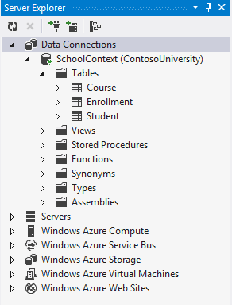
7. Right-click the **Student** table and click **Show Table Data** to see the columns that were created and the rows that were inserted into the table.

    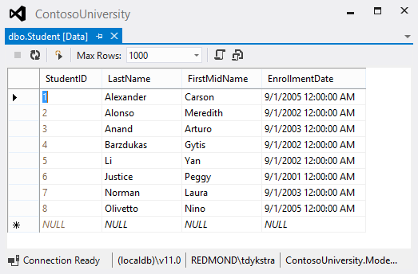

## Creating a Student Controller and Views

The next step is to create an ASP.NET MVC controller and views in your application that can work with one of these tables.

1. To create a `Student` controller, right-click the **Controllers** folder in **Solution Explorer**, select **Add**, and then click **Controller**. In the **Add Controller** dialog box, make the following selections and then click **Add**: 

    - Controller name: **StudentController**.
    - Template: **MVC controller with read/write actions and views, using Entity Framework**.
    - Model class: **Student (ContosoUniversity.Models)**. (If you don't see this option in the drop-down list, build the project and try again.)
    - Data context class: **SchoolContext (ContosoUniversity.Models)**.
    - Views: **Razor (CSHTML)**. (The default.)

    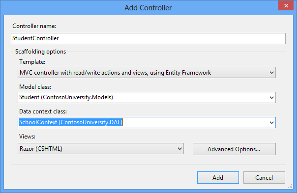
- Visual Studio opens the *Controllers\StudentController.cs* file. You see a class variable has been created that instantiates a database context object:

    [!code-csharp[Main](creating-an-entity-framework-data-model-for-an-asp-net-mvc-application/samples/sample16.cs)]

    The `Index` action method gets a list of students from the *Students* entity set by reading the `Students` property of the database context instance:

    [!code-csharp[Main](creating-an-entity-framework-data-model-for-an-asp-net-mvc-application/samples/sample17.cs)]

    The *Student\Index.cshtml* view displays this list in a table:

    [!code-cshtml[Main](creating-an-entity-framework-data-model-for-an-asp-net-mvc-application/samples/sample18.cshtml)]
- Press CTRL+F5 to run the project.

    Click the **Students** tab to see the test data that the `Seed` method inserted.

    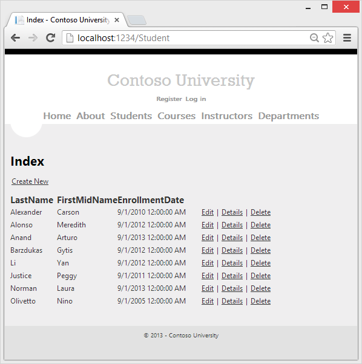

## Conventions

The amount of code you had to write in order for the Entity Framework to be able to create a complete database for you is minimal because of the use of *conventions*, or assumptions that the Entity Framework makes. Some of them have already been noted:

- The pluralized forms of entity class names are used as table names.
- Entity property names are used for column names.
- Entity properties that are named `ID` or *classname* `ID` are recognized as primary key properties.

You've seen that conventions can be overridden (for example, you specified that table names shouldn't be pluralized), and you'll learn more about conventions and how to override them in the [Creating a More Complex Data Model](creating-a-more-complex-data-model-for-an-asp-net-mvc-application.md) tutorial later in this series. For more information, see [Code First Conventions](https://msdn.microsoft.com/en-us/data/jj679962).

## Summary

You've now created a simple application that uses the Entity Framework and SQL Server Express to store and display data. In the following tutorial you'll learn how to perform basic CRUD (create, read, update, delete) operations. You can leave feedback at the bottom of this page. Please let us know how you liked this portion of the tutorial and how we could improve it.

Links to other Entity Framework resources can be found in the [ASP.NET Data Access Content Map](../../../../whitepapers/aspnet-data-access-content-map.md).

>[!div class="step-by-step"]
[Next](implementing-basic-crud-functionality-with-the-entity-framework-in-asp-net-mvc-application.md)