Handling Concurrency with the Entity Framework in an ASP.NET MVC Application (7 of 10)
====================
by [Tom Dykstra](https://github.com/tdykstra)

[Download Completed Project](http://code.msdn.microsoft.com/Getting-Started-with-dd0e2ed8)

> The Contoso University sample web application demonstrates how to create ASP.NET MVC 4 applications using the Entity Framework 5 Code First and Visual Studio 2012. For information about the tutorial series, see [the first tutorial in the series](creating-an-entity-framework-data-model-for-an-asp-net-mvc-application.md). You can start the tutorial series from the beginning or [download a starter project for this chapter](building-the-ef5-mvc4-chapter-downloads.md) and start here.
> 
> > [!NOTE] 
> > 
> > If you run into a problem you can't resolve, [download the completed chapter](building-the-ef5-mvc4-chapter-downloads.md) and try to reproduce your problem. You can generally find the solution to the problem by comparing your code to the completed code. For some common errors and how to solve them, see [Errors and Workarounds.](advanced-entity-framework-scenarios-for-an-mvc-web-application.md#errors)

In the previous two tutorials you worked with related data. This tutorial shows how to handle concurrency. You'll create web pages that work with the `Department` entity, and the pages that edit and delete `Department` entities will handle concurrency errors. The following illustrations show the Index and Delete pages, including some messages that are displayed if a concurrency conflict occurs.

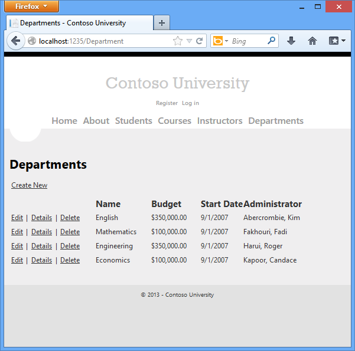

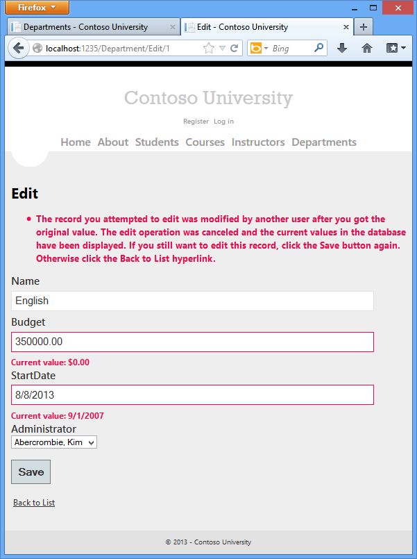

## Concurrency Conflicts

A concurrency conflict occurs when one user displays an entity's data in order to edit it, and then another user updates the same entity's data before the first user's change is written to the database. If you don't enable the detection of such conflicts, whoever updates the database last overwrites the other user's changes. In many applications, this risk is acceptable: if there are few users, or few updates, or if isn't really critical if some changes are overwritten, the cost of programming for concurrency might outweigh the benefit. In that case, you don't have to configure the application to handle concurrency conflicts.

### Pessimistic Concurrency (Locking)

If your application does need to prevent accidental data loss in concurrency scenarios, one way to do that is to use database locks. This is called *pessimistic concurrency*. For example, before you read a row from a database, you request a lock for read-only or for update access. If you lock a row for update access, no other users are allowed to lock the row either for read-only or update access, because they would get a copy of data that's in the process of being changed. If you lock a row for read-only access, others can also lock it for read-only access but not for update.

Managing locks has disadvantages. It can be complex to program. It requires significant database management resources, and it can cause performance problems as the number of users of an application increases (that is, it doesn't scale well). For these reasons, not all database management systems support pessimistic concurrency. The Entity Framework provides no built-in support for it, and this tutorial doesn't show you how to implement it.

### Optimistic Concurrency

The alternative to pessimistic concurrency is *optimistic concurrency*. Optimistic concurrency means allowing concurrency conflicts to happen, and then reacting appropriately if they do. For example, John runs the Departments Edit page, changes the **Budget** amount for the English department from $350,000.00 to $0.00.

Before John clicks **Save**, Jane runs the same page and changes the **Start Date** field from 9/1/2007 to 8/8/2013.

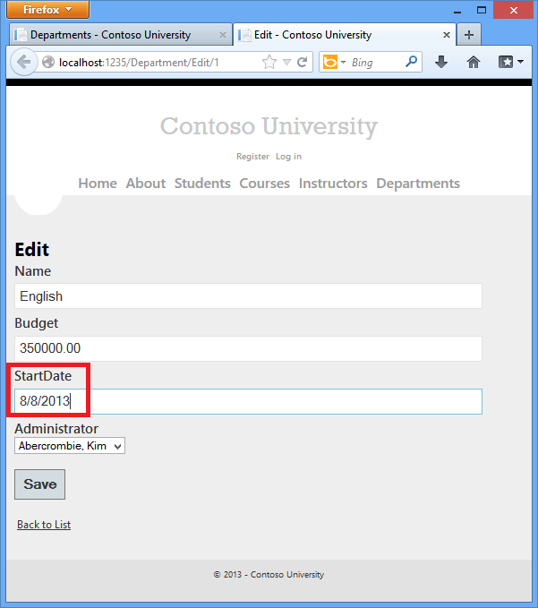

John clicks **Save** first and sees his change when the browser returns to the Index page, then Jane clicks **Save**. What happens next is determined by how you handle concurrency conflicts. Some of the options include the following:

- You can keep track of which property a user has modified and update only the corresponding columns in the database. In the example scenario, no data would be lost, because different properties were updated by the two users. The next time someone browses the English department, they'll see both John's and Jane's changes — a start date of 8/8/2013 and a budget of Zero dollars.

    This method of updating can reduce the number of conflicts that could result in data loss, but it can't avoid data loss if competing changes are made to the same property of an entity. Whether the Entity Framework works this way depends on how you implement your update code. It's often not practical in a web application, because it can require that you maintain large amounts of state in order to keep track of all original property values for an entity as well as new values. Maintaining large amounts of state can affect application performance because it either requires server resources or must be included in the web page itself (for example, in hidden fields).
- You can let Jane's change overwrite John's change. The next time someone browses the English department, they'll see 8/8/2013 and the restored $350,000.00 value. This is called a *Client Wins* or *Last in Wins* scenario. (The client's values take precedence over what's in the data store.) As noted in the introduction to this section, if you don't do any coding for concurrency handling, this will happen automatically.
- You can prevent Jane's change from being updated in the database. Typically, you would display an error message, show her the current state of the data, and allow her to reapply her changes if she still wants to make them. This is called a *Store Wins* scenario. (The data-store values take precedence over the values submitted by the client.) You'll implement the Store Wins scenario in this tutorial. This method ensures that no changes are overwritten without a user being alerted to what's happening.

### Detecting Concurrency Conflicts

You can resolve conflicts by handling [OptimisticConcurrencyException](https://msdn.microsoft.com/en-us/library/system.data.optimisticconcurrencyexception.aspx) exceptions that the Entity Framework throws. In order to know when to throw these exceptions, the Entity Framework must be able to detect conflicts. Therefore, you must configure the database and the data model appropriately. Some options for enabling conflict detection include the following:

- In the database table, include a tracking column that can be used to determine when a row has been changed. You can then configure the Entity Framework to include that column in the `Where` clause of SQL `Update` or `Delete` commands.

    The data type of the tracking column is typically [rowversion](https://msdn.microsoft.com/en-us/library/ms182776(v=sql.110).aspx). The [rowversion](https://msdn.microsoft.com/en-us/library/ms182776(v=sql.110).aspx) value is a sequential number that's incremented each time the row is updated. In an `Update` or `Delete` command, the `Where` clause includes the original value of the tracking column (the original row version). If the row being updated has been changed by another user, the value in the `rowversion` column is different than the original value, so the `Update` or `Delete` statement can't find the row to update because of the `Where` clause. When the Entity Framework finds that no rows have been updated by the `Update` or `Delete` command (that is, when the number of affected rows is zero), it interprets that as a concurrency conflict.
- Configure the Entity Framework to include the original values of every column in the table in the `Where` clause of `Update` and `Delete` commands.

    As in the first option, if anything in the row has changed since the row was first read, the `Where` clause won't return a row to update, which the Entity Framework interprets as a concurrency conflict. For database tables that have many columns, this approach can result in very large `Where` clauses, and can require that you maintain large amounts of state. As noted earlier, maintaining large amounts of state can affect application performance because it either requires server resources or must be included in the web page itself. Therefore this approach generally not recommended, and it isn't the method used in this tutorial.

    If you do want to implement this approach to concurrency, you have to mark all non-primary-key properties in the entity you want to track concurrency for by adding the [ConcurrencyCheck](https://msdn.microsoft.com/en-us/library/system.componentmodel.dataannotations.concurrencycheckattribute.aspx) attribute to them. That change enables the Entity Framework to include all columns in the SQL `WHERE` clause of `UPDATE` statements.

In the remainder of this tutorial you'll add a [rowversion](https://msdn.microsoft.com/en-us/library/ms182776(v=sql.110).aspx) tracking property to the `Department` entity, create a controller and views, and test to verify that everything works correctly.

## Add an Optimistic Concurrency Property to the Department Entity

In *Models\Department.cs*, add a tracking property named `RowVersion`:

[!code-csharp[Main](handling-concurrency-with-the-entity-framework-in-an-asp-net-mvc-application/samples/sample1.cs?highlight=18-19)]

The [Timestamp](https://msdn.microsoft.com/en-us/library/system.componentmodel.dataannotations.timestampattribute.aspx) attribute specifies that this column will be included in the `Where` clause of `Update` and `Delete` commands sent to the database. The attribute is called [Timestamp](https://msdn.microsoft.com/en-us/library/system.componentmodel.dataannotations.timestampattribute.aspx) because previous versions of SQL Server used a SQL [timestamp](https://msdn.microsoft.com/en-us/library/ms182776(v=SQL.90).aspx) data type before the SQL [rowversion](https://msdn.microsoft.com/en-us/library/ms182776(v=sql.110).aspx) replaced it. The .Net type for `rowversion` is a byte array. If you prefer to use the fluent API, you can use the [IsConcurrencyToken](https://msdn.microsoft.com/en-us/library/gg679501(v=VS.103).aspx) method to specify the tracking property, as shown in the following example:

[!code-csharp[Main](handling-concurrency-with-the-entity-framework-in-an-asp-net-mvc-application/samples/sample2.cs)]

By adding a property you changed the database model, so you need to do another migration. In the Package Manager Console (PMC), enter the following commands:

[!code-console[Main](handling-concurrency-with-the-entity-framework-in-an-asp-net-mvc-application/samples/sample3.cmd)]

## Create a Department Controller

Create a `Department` controller and views the same way you did the other controllers, using the following settings:

In *Controllers\DepartmentController.cs*, add a `using` statement:

[!code-csharp[Main](handling-concurrency-with-the-entity-framework-in-an-asp-net-mvc-application/samples/sample4.cs)]

Change "LastName" to "FullName" everywhere in this file (four occurrences) so that the department administrator drop-down lists will contain the full name of the instructor rather than just the last name.

[!code-csharp[Main](handling-concurrency-with-the-entity-framework-in-an-asp-net-mvc-application/samples/sample5.cs?highlight=1)]

Replace the existing code for the `HttpPost` `Edit` method with the following code:

[!code-csharp[Main](handling-concurrency-with-the-entity-framework-in-an-asp-net-mvc-application/samples/sample6.cs)]

The view will store the original `RowVersion` value in a hidden field. When the model binder creates the `department` instance, that object will have the original `RowVersion` property value and the new values for the other properties, as entered by the user on the Edit page. Then when the Entity Framework creates a SQL `UPDATE` command, that command will include a `WHERE` clause that looks for a row that has the original `RowVersion` value.

If no rows are affected by the `UPDATE` command (no rows have the original `RowVersion` value), the Entity Framework throws a `DbUpdateConcurrencyException` exception, and the code in the `catch` block gets the affected `Department` entity from the exception object. This entity has both the values read from the database and the new values entered by the user:

[!code-csharp[Main](handling-concurrency-with-the-entity-framework-in-an-asp-net-mvc-application/samples/sample7.cs)]

Next, the code adds a custom error message for each column that has database values different from what the user entered on the Edit page:

[!code-csharp[Main](handling-concurrency-with-the-entity-framework-in-an-asp-net-mvc-application/samples/sample8.cs)]

A longer error message explains what happened and what to do about it:

[!code-csharp[Main](handling-concurrency-with-the-entity-framework-in-an-asp-net-mvc-application/samples/sample9.cs)]

Finally, the code sets the `RowVersion` value of the `Department` object to the new value retrieved from the database. This new `RowVersion` value will be stored in the hidden field when the Edit page is redisplayed, and the next time the user clicks **Save**, only concurrency errors that happen since the redisplay of the Edit page will be caught.

In *Views\Department\Edit.cshtml*, add a hidden field to save the `RowVersion` property value, immediately following the hidden field for the `DepartmentID` property:

[!code-cshtml[Main](handling-concurrency-with-the-entity-framework-in-an-asp-net-mvc-application/samples/sample10.cshtml?highlight=17)]

In *Views\Department\Index.cshtml*, replace the existing code with the following code to move row links to the left and change the page title and column headings to display `FullName` instead of `LastName` in the **Administrator** column:

[!code-cshtml[Main](handling-concurrency-with-the-entity-framework-in-an-asp-net-mvc-application/samples/sample11.cshtml)]

## Testing Optimistic Concurrency Handling

Run the site and click **Departments**:

Right click the **Edit** hyperlink for Kim Abercrombie and select **Open in new tab,** then click the **Edit** hyperlink for Kim Abercrombie. The two windows display the same information.

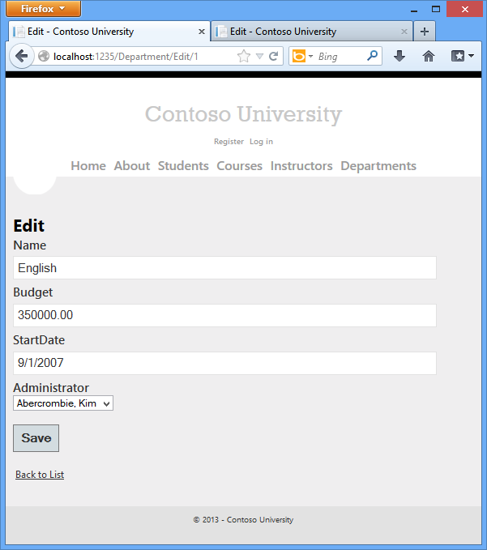

Change a field in the first browser window and click **Save**.

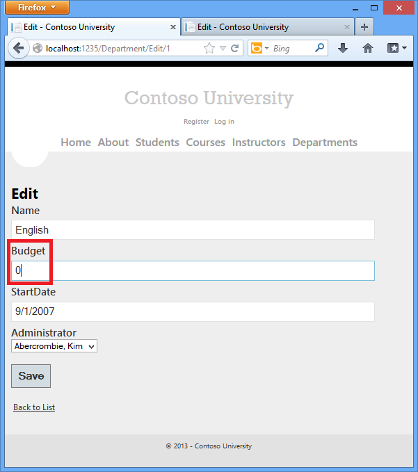

The browser shows the Index page with the changed value.

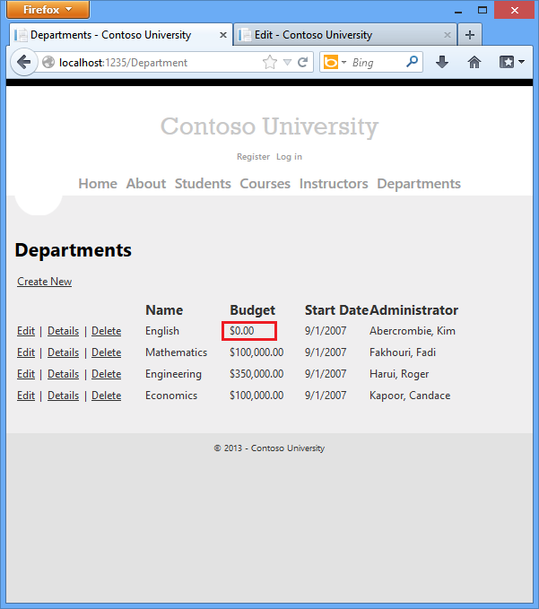

Change the any field in the second browser window and click **Save**.

Click **Save** in the second browser window. You see an error message:

Click **Save** again. The value you entered in the second browser is saved along with the original value of the data you change in the first browser. You see the saved values when the Index page appears.

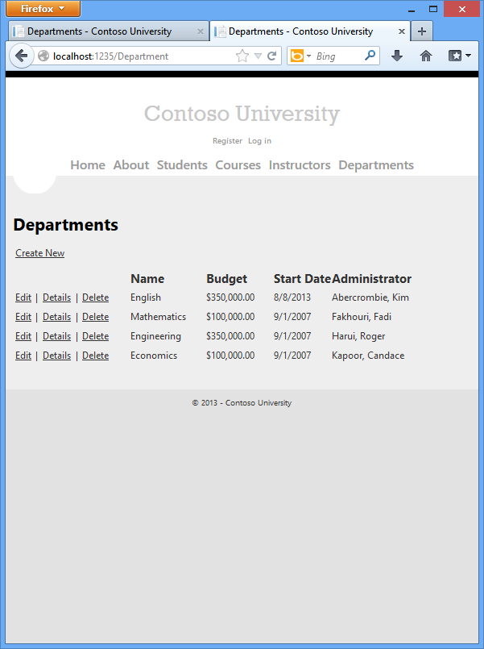

## Updating the Delete Page

For the Delete page, the Entity Framework detects concurrency conflicts caused by someone else editing the department in a similar manner. When the `HttpGet` `Delete` method displays the confirmation view, the view includes the original `RowVersion` value in a hidden field. That value is then available to the `HttpPost` `Delete` method that's called when the user confirms the deletion. When the Entity Framework creates the SQL `DELETE` command, it includes a `WHERE` clause with the original `RowVersion` value. If the command results in zero rows affected (meaning the row was changed after the Delete confirmation page was displayed), a concurrency exception is thrown, and the `HttpGet Delete` method is called with an error flag set to `true` in order to redisplay the confirmation page with an error message. It's also possible that zero rows were affected because the row was deleted by another user, so in that case a different error message is displayed.

In *DepartmentController.cs*, replace the `HttpGet` `Delete` method with the following code:

[!code-csharp[Main](handling-concurrency-with-the-entity-framework-in-an-asp-net-mvc-application/samples/sample12.cs)]

The method accepts an optional parameter that indicates whether the page is being redisplayed after a concurrency error. If this flag is `true`, an error message is sent to the view using a `ViewBag` property.

Replace the code in the `HttpPost` `Delete` method (named `DeleteConfirmed`) with the following code:

[!code-csharp[Main](handling-concurrency-with-the-entity-framework-in-an-asp-net-mvc-application/samples/sample13.cs)]

In the scaffolded code that you just replaced, this method accepted only a record ID:

[!code-csharp[Main](handling-concurrency-with-the-entity-framework-in-an-asp-net-mvc-application/samples/sample14.cs)]

You've changed this parameter to a `Department` entity instance created by the model binder. This gives you access to the `RowVersion` property value in addition to the record key.

[!code-csharp[Main](handling-concurrency-with-the-entity-framework-in-an-asp-net-mvc-application/samples/sample15.cs)]

You have also changed the action method name from `DeleteConfirmed` to `Delete`. The scaffolded code named the `HttpPost` `Delete` method `DeleteConfirmed` to give the `HttpPost` method a unique signature. (The CLR requires overloaded methods to have different method parameters.) Now that the signatures are unique, you can stick with the MVC convention and use the same name for the `HttpPost` and `HttpGet` delete methods.

If a concurrency error is caught, the code redisplays the Delete confirmation page and provides a flag that indicates it should display a concurrency error message.

In *Views\Department\Delete.cshtml*, replace the scaffolded code with the following code that makes some formatting changes and adds an error message field. The changes are highlighted.

[!code-cshtml[Main](handling-concurrency-with-the-entity-framework-in-an-asp-net-mvc-application/samples/sample16.cshtml?highlight=9,37,40,45-46)]

This code adds an error message between the `h2` and `h3` headings:

[!code-cshtml[Main](handling-concurrency-with-the-entity-framework-in-an-asp-net-mvc-application/samples/sample17.cshtml)]

It replaces `LastName` with `FullName` in the `Administrator` field:

[!code-cshtml[Main](handling-concurrency-with-the-entity-framework-in-an-asp-net-mvc-application/samples/sample18.cshtml)]

Finally, it adds hidden fields for the `DepartmentID` and `RowVersion` properties after the `Html.BeginForm` statement:

[!code-cshtml[Main](handling-concurrency-with-the-entity-framework-in-an-asp-net-mvc-application/samples/sample19.cshtml)]

Run the Departments Index page. Right click the **Delete** hyperlink for the English department and select **Open in new window,** then in the first window click the **Edit** hyperlink for the English department.

In the first window, change one of the values, and click **Save** :

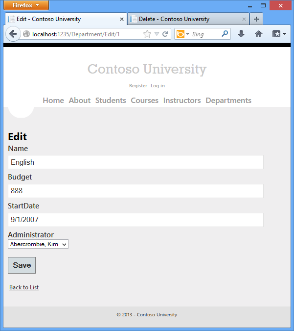

The Index page confirms the change.

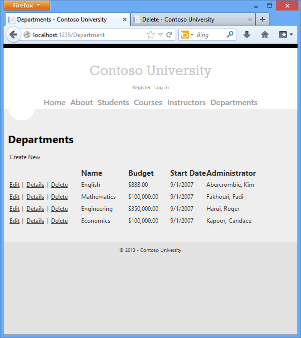

In the second window, click **Delete**.

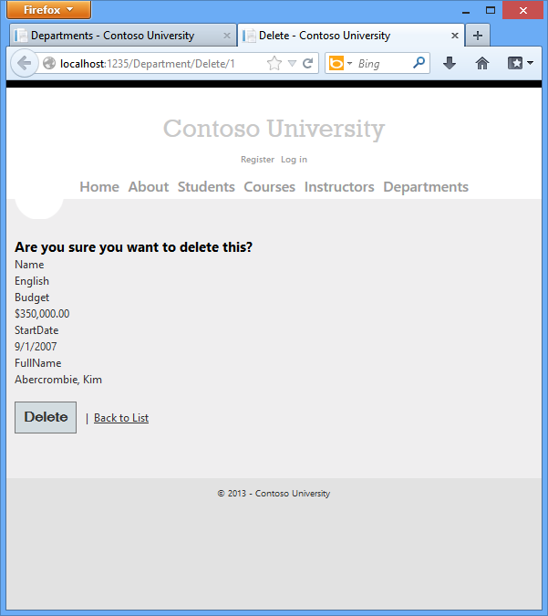

You see the concurrency error message, and the Department values are refreshed with what's currently in the database.

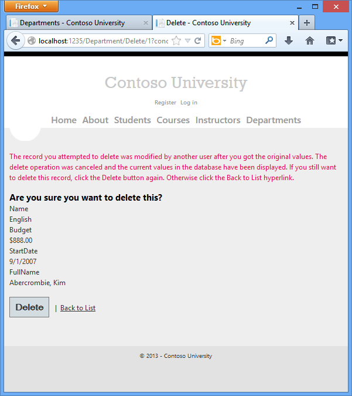

If you click **Delete** again, you're redirected to the Index page, which shows that the department has been deleted.

## Summary

This completes the introduction to handling concurrency conflicts. For information about other ways to handle various concurrency scenarios, see [Optimistic Concurrency Patterns](https://blogs.msdn.com/b/adonet/archive/2011/02/03/using-dbcontext-in-ef-feature-ctp5-part-9-optimistic-concurrency-patterns.aspx) and [Working with Property Values](https://blogs.msdn.com/b/adonet/archive/2011/01/30/using-dbcontext-in-ef-feature-ctp5-part-5-working-with-property-values.aspx) on the Entity Framework team blog. The next tutorial shows how to implement table-per-hierarchy inheritance for the `Instructor` and `Student` entities.

Links to other Entity Framework resources can be found in the [ASP.NET Data Access Content Map](../../../../whitepapers/aspnet-data-access-content-map.md).

>[!div class="step-by-step"]
[Previous](updating-related-data-with-the-entity-framework-in-an-asp-net-mvc-application.md)
[Next](implementing-inheritance-with-the-entity-framework-in-an-asp-net-mvc-application.md)