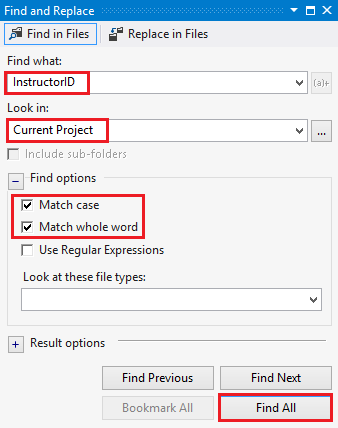
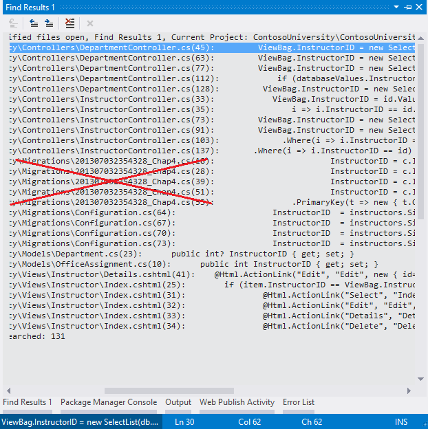
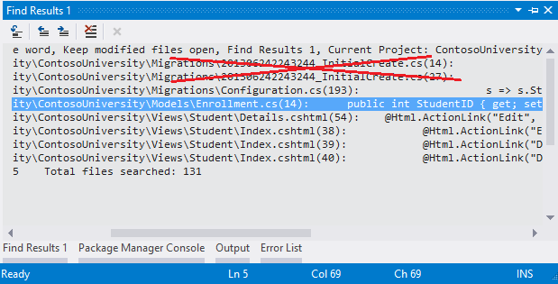
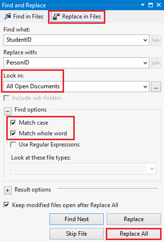
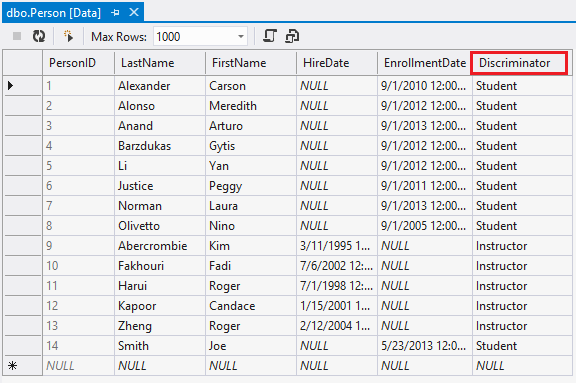

Implementing Inheritance with the Entity Framework in an ASP.NET MVC Application (8 of 10)
====================
by [Tom Dykstra](https://github.com/tdykstra)

[Download Completed Project](http://code.msdn.microsoft.com/Getting-Started-with-dd0e2ed8)

> The Contoso University sample web application demonstrates how to create ASP.NET MVC 4 applications using the Entity Framework 5 Code First and Visual Studio 2012. For information about the tutorial series, see [the first tutorial in the series](creating-an-entity-framework-data-model-for-an-asp-net-mvc-application.md). You can start the tutorial series from the beginning or [download a starter project for this chapter](building-the-ef5-mvc4-chapter-downloads.md) and start here.
> 
> > [!NOTE] 
> > 
> > If you run into a problem you can't resolve, [download the completed chapter](building-the-ef5-mvc4-chapter-downloads.md) and try to reproduce your problem. You can generally find the solution to the problem by comparing your code to the completed code. For some common errors and how to solve them, see [Errors and Workarounds.](advanced-entity-framework-scenarios-for-an-mvc-web-application.md#errors)

In the previous tutorial you handled concurrency exceptions. This tutorial will show you how to implement inheritance in the data model.

In object-oriented programming, you can use inheritance to eliminate redundant code. In this tutorial, you'll change the `Instructor` and `Student` classes so that they derive from a `Person` base class which contains properties such as `LastName` that are common to both instructors and students. You won't add or change any web pages, but you'll change some of the code and those changes will be automatically reflected in the database.

## Table-per-Hierarchy versus Table-per-Type Inheritance

In object-oriented programming, you can use inheritance to make it easier to work with related classes. For example, the `Instructor` and `Student` classes in the `School` data model share several properties, which results in redundant code:

Suppose you want to eliminate the redundant code for the properties that are shared by the `Instructor` and `Student` entities. You could create a `Person` base class which contains only those shared properties, then make the `Instructor` and `Student` entities inherit from that base class, as shown in the following illustration:

There are several ways this inheritance structure could be represented in the database. You could have a `Person` table that includes information about both students and instructors in a single table. Some of the columns could apply only to instructors (`HireDate`), some only to students (`EnrollmentDate`), some to both (`LastName`, `FirstName`). Typically, you'd have a *discriminator* column to indicate which type each row represents. For example, the discriminator column might have "Instructor" for instructors and "Student" for students.

This pattern of generating an entity inheritance structure from a single database table is called *table-per-hierarchy* (TPH) inheritance.

An alternative is to make the database look more like the inheritance structure. For example, you could have only the name fields in the `Person` table and have separate `Instructor` and `Student` tables with the date fields.

This pattern of making a database table for each entity class is called *table per type* (TPT) inheritance.

TPH inheritance patterns generally deliver better performance in the Entity Framework than TPT inheritance patterns, because TPT patterns can result in complex join queries. This tutorial demonstrates how to implement TPH inheritance. You'll do that by performing the following steps:

- Create a `Person` class and change the `Instructor` and `Student` classes to derive from `Person`.
- Add model-to-database mapping code to the database context class.
- Change `InstructorID` and `StudentID` references throughout the project to `PersonID`.

## Creating the Person Class

 Note: You won't be able to compile the project after creating the classes below until you update the controllers that uses these classes. 

In the *Models* folder, create *Person.cs* and replace the template code with the following code:

[!code-csharp[Main](implementing-inheritance-with-the-entity-framework-in-an-asp-net-mvc-application/samples/sample1.cs)]

In *Instructor.cs*, derive the `Instructor` class from the `Person` class and remove the key and name fields. The code will look like the following example:

[!code-csharp[Main](implementing-inheritance-with-the-entity-framework-in-an-asp-net-mvc-application/samples/sample2.cs)]

Make similar changes to *Student.cs*. The `Student` class will look like the following example:

[!code-csharp[Main](implementing-inheritance-with-the-entity-framework-in-an-asp-net-mvc-application/samples/sample3.cs)]

## Adding the Person Entity Type to the Model

In *SchoolContext.cs*, add a `DbSet` property for the `Person` entity type:

[!code-csharp[Main](implementing-inheritance-with-the-entity-framework-in-an-asp-net-mvc-application/samples/sample4.cs)]

This is all that the Entity Framework needs in order to configure table-per-hierarchy inheritance. As you'll see, when the database is re-created, it will have a `Person` table in place of the `Student` and `Instructor` tables.

## Changing InstructorID and StudentID to PersonID

In *SchoolContext.cs*, in the Instructor-Course mapping statement, change `MapRightKey("InstructorID")` to `MapRightKey("PersonID")`:

[!code-csharp[Main](implementing-inheritance-with-the-entity-framework-in-an-asp-net-mvc-application/samples/sample5.cs?highlight=4)]

This change isn't required; it just changes the name of the InstructorID column in the many-to-many join table. If you left the name as InstructorID, the application would still work correctly. Here is the completed *SchoolContext.cs*:

[!code-csharp[Main](implementing-inheritance-with-the-entity-framework-in-an-asp-net-mvc-application/samples/sample6.cs?highlight=15,24)]

Next you need to change `InstructorID` to `PersonID` and `StudentID` to `PersonID` throughout the project ***except*** in the time-stamped migrations files in the *Migrations* folder. To do that you'll find and open only the files that need to be changed, then perform a global change on the opened files. The only file in the *Migrations* folder you should change is *Migrations\Configuration.cs.*

1. > [!IMPORTANT]
 > Begin by closing all the open files in Visual Studio.
2. Click **Find and Replace -- Find all Files** in the **Edit** menu, and then search for all files in the project that contain `InstructorID`.  
  
    
3. Open each file in the **Find Results** window ***except*** the &lt;time-stamp&gt;*\_.cs* migration files in the *Migrations* folder, by double-clicking one line for each file.  
  
    
4. Open the **Replace in Files** dialog and change **Look in** to **All Open Documents**.
5. Use the **Replace in Files** dialog to change all `InstructorID` to `PersonID.`  
  
    
6. Find all the files in the project that contain `StudentID`.
7. Open each file in the **Find Results** window ***except*** the &lt;time-stamp&gt;*\_\*.cs* migration files in the *Migrations* folder, by double-clicking one line for each file.  
  
    
8. Open the **Replace in Files** dialog and change **Look in** to **All Open Documents**.
9. Use the **Replace in Files** dialog to change all `StudentID` to `PersonID`.   
  
    
10. Build the project.

(Note that this demonstrates a *disadvantage* of the `classnameID` pattern for naming primary keys. If you had named primary keys ID without prefixing the class name, *no* renaming would be necessary now.)

## Create and Update a Migrations File

In the Package Manager Console (PMC), enter the following command:

`Add-Migration Inheritance`

Run the `Update-Database` command in the PMC. The command will fail at this point because we have existing data that migrations doesn't know how to handle. You get the following error:

*The ALTER TABLE statement conflicted with the FOREIGN KEY constraint "FK\_dbo.Department\_dbo.Person\_PersonID". The conflict occurred in database "ContosoUniversity", table "dbo.Person", column 'PersonID'.*

Open *Migrations\&lt;timestamp&gt;\_Inheritance.cs* and replace the `Up` method with the following code:

[!code-csharp[Main](implementing-inheritance-with-the-entity-framework-in-an-asp-net-mvc-application/samples/sample7.cs?highlight=25,29-40)]

Run the `update-database` command again.

> [!NOTE]
> It's possible to get other errors when migrating data and making schema changes. If you get migration errors you can't resolve, you can continue with the tutorial by changing the connection string in the *Web.config* file or deleting the database. The simplest approach is to rename the database in the *Web.config* file. For example, change the database name to CU\_test as shown in the following example:
> 
> [!code-xml[Main](implementing-inheritance-with-the-entity-framework-in-an-asp-net-mvc-application/samples/sample8.xml?highlight=1-2)]
> 
> With a new database, there is no data to migrate, and the `update-database` command is much more likely to complete without errors. For instructions on how to delete the database, see [How to Drop a Database from Visual Studio 2012](http://romiller.com/2013/05/17/how-to-drop-a-database-from-visual-studio-2012/). If you take this approach in order to continue with the tutorial, skip the deployment step at the end of this tutorial, since the deployed site would get the same error when it runs migrations automatically. If you want to troubleshoot a migrations error, the best resource is one of the Entity Framework forums or StackOverflow.com.

## Testing

Run the site and try various pages. Everything works the same as it did before.

In **Server Explorer,** expand **SchoolContext** and then **Tables**, and you see that the **Student** and **Instructor** tables have been replaced by a **Person** table. Expand the **Person** table and you see that it has all of the columns that used to be in the **Student** and **Instructor** tables.

Right-click the Person table, and then click **Show Table Data** to see the discriminator column.

The following diagram illustrates the structure of the new School database:

## Summary

Table-per-hierarchy inheritance has now been implemented for the `Person`, `Student`, and `Instructor` classes. For more information about this and other inheritance structures, see [Inheritance Mapping Strategies](https://weblogs.asp.net/manavi/archive/2010/12/24/inheritance-mapping-strategies-with-entity-framework-code-first-ctp5-part-1-table-per-hierarchy-tph.aspx) on Morteza Manavi's blog. In the next tutorial you'll see some ways to implement the repository and unit of work patterns.

Links to other Entity Framework resources can be found in the [ASP.NET Data Access Content Map](../../../../whitepapers/aspnet-data-access-content-map.md).

>[!div class="step-by-step"]
[Previous](handling-concurrency-with-the-entity-framework-in-an-asp-net-mvc-application.md)
[Next](implementing-the-repository-and-unit-of-work-patterns-in-an-asp-net-mvc-application.md)