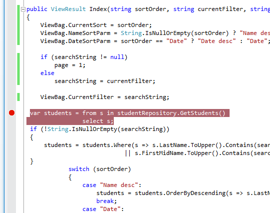
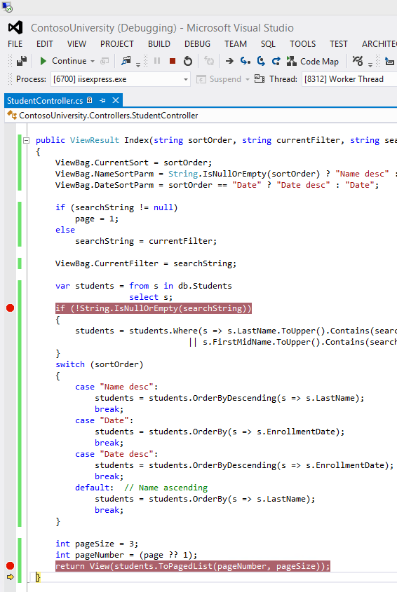
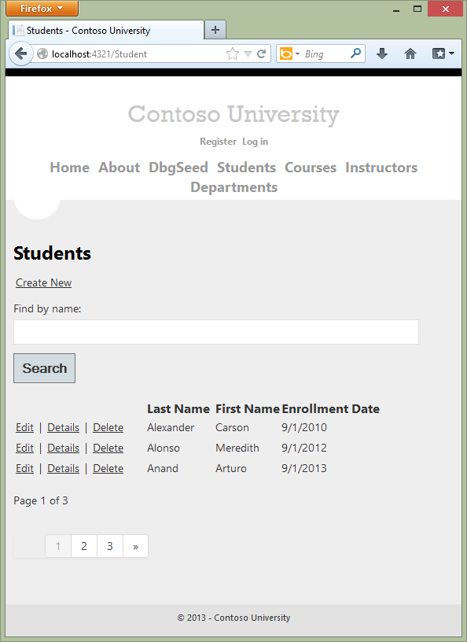

Implementing the Repository and Unit of Work Patterns in an ASP.NET MVC Application (9 of 10)
====================
by [Tom Dykstra](https://github.com/tdykstra)

[Download Completed Project](http://code.msdn.microsoft.com/Getting-Started-with-dd0e2ed8)

> The Contoso University sample web application demonstrates how to create ASP.NET MVC 4 applications using the Entity Framework 5 Code First and Visual Studio 2012. For information about the tutorial series, see [the first tutorial in the series](creating-an-entity-framework-data-model-for-an-asp-net-mvc-application.md). You can start the tutorial series from the beginning or [download a starter project for this chapter](building-the-ef5-mvc4-chapter-downloads.md) and start here.
> 
> > [!NOTE] 
> > 
> > If you run into a problem you can't resolve, [download the completed chapter](building-the-ef5-mvc4-chapter-downloads.md) and try to reproduce your problem. You can generally find the solution to the problem by comparing your code to the completed code. For some common errors and how to solve them, see [Errors and Workarounds.](advanced-entity-framework-scenarios-for-an-mvc-web-application.md#errors)

In the previous tutorial you used inheritance to reduce redundant code in the `Student` and `Instructor` entity classes. In this tutorial you'll see some ways to use the repository and unit of work patterns for CRUD operations. As in the previous tutorial, in this one you'll change the way your code works with pages you already created rather than creating new pages.

## The Repository and Unit of Work Patterns

The repository and unit of work patterns are intended to create an abstraction layer between the data access layer and the business logic layer of an application. Implementing these patterns can help insulate your application from changes in the data store and can facilitate automated unit testing or test-driven development (TDD).

In this tutorial you'll implement a repository class for each entity type. For the `Student` entity type you'll create a repository interface and a repository class. When you instantiate the repository in your controller, you'll use the interface so that the controller will accept a reference to any object that implements the repository interface. When the controller runs under a web server, it receives a repository that works with the Entity Framework. When the controller runs under a unit test class, it receives a repository that works with data stored in a way that you can easily manipulate for testing, such as an in-memory collection.

Later in the tutorial you'll use multiple repositories and a unit of work class for the `Course` and `Department` entity types in the `Course` controller. The unit of work class coordinates the work of multiple repositories by creating a single database context class shared by all of them. If you wanted to be able to perform automated unit testing, you'd create and use interfaces for these classes in the same way you did for the `Student` repository. However, to keep the tutorial simple, you'll create and use these classes without interfaces.

The following illustration shows one way to conceptualize the relationships between the controller and context classes compared to not using the repository or unit of work pattern at all.

You won't create unit tests in this tutorial series. For an introduction to TDD with an MVC application that uses the repository pattern, see [Walkthrough: Using TDD with ASP.NET MVC](https://msdn.microsoft.com/en-us/library/ff847525.aspx). For more information about the repository pattern, see the following resources:

- [The Repository Pattern](https://msdn.microsoft.com/en-us/library/ff649690.aspx) on MSDN.
- [Using Repository and Unit of Work patterns with Entity Framework 4.0](https://blogs.msdn.com/b/adonet/archive/2009/06/16/using-repository-and-unit-of-work-patterns-with-entity-framework-4-0.aspx) on the Entity Framework team blog.
- [Agile Entity Framework 4 Repository](http://thedatafarm.com/blog/data-access/agile-entity-framework-4-repository-part-1-model-and-poco-classes/) series of posts on Julie Lerman's blog.
- [Building the Account at a Glance HTML5/jQuery Application](https://weblogs.asp.net/dwahlin/archive/2011/08/15/building-the-account-at-a-glance-html5-jquery-application.aspx) on Dan Wahlin's blog.

> [!NOTE]
> There are many ways to implement the repository and unit of work patterns. You can use repository classes with or without a unit of work class. You can implement a single repository for all entity types, or one for each type. If you implement one for each type, you can use separate classes, a generic base class and derived classes, or an abstract base class and derived classes. You can include business logic in your repository or restrict it to data access logic. You can also build an abstraction layer into your database context class by using [IDbSet](https://msdn.microsoft.com/en-us/library/gg679233(v=vs.103).aspx) interfaces there instead of [DbSet](https://msdn.microsoft.com/en-us/library/system.data.entity.dbset(v=vs.103).aspx) types for your entity sets. The approach to implementing an abstraction layer shown in this tutorial is one option for you to consider, not a recommendation for all scenarios and environments.

## Creating the Student Repository Class

In the *DAL* folder, create a class file named *IStudentRepository.cs* and replace the existing code with the following code:

[!code-csharp[Main](implementing-the-repository-and-unit-of-work-patterns-in-an-asp-net-mvc-application/samples/sample1.cs)]

This code declares a typical set of CRUD methods, including two read methods — one that returns all `Student` entities, and one that finds a single `Student` entity by ID.

In the *DAL* folder, create a class file named *StudentRepository.cs* file. Replace the existing code with the following code, which implements the `IStudentRepository` interface:

[!code-csharp[Main](implementing-the-repository-and-unit-of-work-patterns-in-an-asp-net-mvc-application/samples/sample2.cs)]

The database context is defined in a class variable, and the constructor expects the calling object to pass in an instance of the context:

[!code-csharp[Main](implementing-the-repository-and-unit-of-work-patterns-in-an-asp-net-mvc-application/samples/sample3.cs)]

You could instantiate a new context in the repository, but then if you used multiple repositories in one controller, each would end up with a separate context. Later you'll use multiple repositories in the `Course` controller, and you'll see how a unit of work class can ensure that all repositories use the same context.

The repository implements [IDisposable](https://msdn.microsoft.com/en-us/library/system.idisposable.aspx) and disposes the database context as you saw earlier in the controller, and its CRUD methods make calls to the database context in the same way that you saw earlier.

## Change the Student Controller to Use the Repository

In *StudentController.cs*, replace the code currently in the class with the following code. The changes are highlighted.

[!code-csharp[Main](implementing-the-repository-and-unit-of-work-patterns-in-an-asp-net-mvc-application/samples/sample4.cs?highlight=13-18,44,75,77,102-103,120,137-138,159,172-174,186)]

The controller now declares a class variable for an object that implements the `IStudentRepository` interface instead of the context class:

[!code-csharp[Main](implementing-the-repository-and-unit-of-work-patterns-in-an-asp-net-mvc-application/samples/sample5.cs)]

The default (parameterless) constructor creates a new context instance, and an optional constructor allows the caller to pass in a context instance.

[!code-csharp[Main](implementing-the-repository-and-unit-of-work-patterns-in-an-asp-net-mvc-application/samples/sample6.cs)]

(If you were using *dependency injection*, or DI, you wouldn't need the default constructor because the DI software would ensure that the correct repository object would always be provided.)

In the CRUD methods, the repository is now called instead of the context:

[!code-csharp[Main](implementing-the-repository-and-unit-of-work-patterns-in-an-asp-net-mvc-application/samples/sample7.cs)]

[!code-csharp[Main](implementing-the-repository-and-unit-of-work-patterns-in-an-asp-net-mvc-application/samples/sample8.cs)]

[!code-csharp[Main](implementing-the-repository-and-unit-of-work-patterns-in-an-asp-net-mvc-application/samples/sample9.cs)]

[!code-csharp[Main](implementing-the-repository-and-unit-of-work-patterns-in-an-asp-net-mvc-application/samples/sample10.cs)]

[!code-csharp[Main](implementing-the-repository-and-unit-of-work-patterns-in-an-asp-net-mvc-application/samples/sample11.cs)]

And the `Dispose` method now disposes the repository instead of the context:

[!code-csharp[Main](implementing-the-repository-and-unit-of-work-patterns-in-an-asp-net-mvc-application/samples/sample12.cs)]

Run the site and click the **Students** tab.

The page looks and works the same as it did before you changed the code to use the repository, and the other Student pages also work the same. However, there's an important difference in the way the `Index` method of the controller does filtering and ordering. The original version of this method contained the following code:

[!code-csharp[Main](implementing-the-repository-and-unit-of-work-patterns-in-an-asp-net-mvc-application/samples/sample13.cs?highlight=1)]

The updated `Index` method contains the following code:

[!code-csharp[Main](implementing-the-repository-and-unit-of-work-patterns-in-an-asp-net-mvc-application/samples/sample14.cs?highlight=1)]

Only the highlighted code has changed.

In the original version of the code, `students` is typed as an `IQueryable` object. The query isn't sent to the database until it's converted into a collection using a method such as `ToList`, which doesn't occur until the Index view accesses the student model. The `Where` method in the original code above becomes a `WHERE` clause in the SQL query that is sent to the database. That in turn means that only the selected entities are returned by the database. However, as a result of changing `context.Students` to `studentRepository.GetStudents()`, the `students` variable after this statement is an `IEnumerable` collection that includes all students in the database. The end result of applying the `Where` method is the same, but now the work is done in memory on the web server and not by the database. For queries that return large volumes of data, this can be inefficient.

> [!TIP] 
> 
> **IQueryable vs. IEnumerable**
> 
> After you implement the repository as shown here, even if you enter something in the **Search** box the query sent to SQL Server returns all Student rows because it doesn't include your search criteria:
> 
> 
> 
> [!code-sql[Main](implementing-the-repository-and-unit-of-work-patterns-in-an-asp-net-mvc-application/samples/sample15.sql)]
> 
> This query returns all of the student data because the repository executed the query without knowing about the search criteria. The process of sorting, applying search criteria, and selecting a subset of the data for paging (showing only 3 rows in this case) is done in memory later when the `ToPagedList` method is called on the `IEnumerable` collection.
> 
> In the previous version of the code (before you implemented the repository), the query is not sent to the database until after you apply the search criteria, when `ToPagedList` is called on the `IQueryable` object.
> 
> 
> 
> When ToPagedList is called on an `IQueryable` object, the query sent to SQL Server specifies the search string, and as a result only rows that meet the search criteria are returned, and no filtering needs to be done in memory.
> 
> [!code-sql[Main](implementing-the-repository-and-unit-of-work-patterns-in-an-asp-net-mvc-application/samples/sample16.sql)]
> 
> (The following tutorial explains how to examine queries sent to SQL Server.)

The following section shows how to implement repository methods that enable you to specify that this work should be done by the database.

You've now created an abstraction layer between the controller and the Entity Framework database context. If you were going to perform automated unit testing with this application, you could create an alternative repository class in a unit test project that implements `IStudentRepository`*.*Instead of calling the context to read and write data, this mock repository class could manipulate in-memory collections in order to test controller functions.

## Implement a Generic Repository and a Unit of Work Class

Creating a repository class for each entity type could result in a lot of redundant code, and it could result in partial updates. For example, suppose you have to update two different entity types as part of the same transaction. If each uses a separate database context instance, one might succeed and the other might fail. One way to minimize redundant code is to use a generic repository, and one way to ensure that all repositories use the same database context (and thus coordinate all updates) is to use a unit of work class.

In this section of the tutorial, you'll create a `GenericRepository` class and a `UnitOfWork` class, and use them in the `Course` controller to access both the `Department` and the `Course` entity sets. As explained earlier, to keep this part of the tutorial simple, you aren't creating interfaces for these classes. But if you were going to use them to facilitate TDD, you'd typically implement them with interfaces the same way you did the `Student` repository.

### Create a Generic Repository

In the *DAL* folder, create *GenericRepository.cs* and replace the existing code with the following code:

[!code-csharp[Main](implementing-the-repository-and-unit-of-work-patterns-in-an-asp-net-mvc-application/samples/sample17.cs)]

Class variables are declared for the database context and for the entity set that the repository is instantiated for:

[!code-csharp[Main](implementing-the-repository-and-unit-of-work-patterns-in-an-asp-net-mvc-application/samples/sample18.cs)]

The constructor accepts a database context instance and initializes the entity set variable:

[!code-csharp[Main](implementing-the-repository-and-unit-of-work-patterns-in-an-asp-net-mvc-application/samples/sample19.cs)]

The `Get` method uses lambda expressions to allow the calling code to specify a filter condition and a column to order the results by, and a string parameter lets the caller provide a comma-delimited list of navigation properties for eager loading:

[!code-csharp[Main](implementing-the-repository-and-unit-of-work-patterns-in-an-asp-net-mvc-application/samples/sample20.cs)]

The code `Expression<Func<TEntity, bool>> filter` means the caller will provide a lambda expression based on the `TEntity` type, and this expression will return a Boolean value. For example, if the repository is instantiated for the `Student` entity type, the code in the calling method might specify `student => student.LastName == "Smith`&quot; for the `filter` parameter.

The code `Func<IQueryable<TEntity>, IOrderedQueryable<TEntity>> orderBy` also means the caller will provide a lambda expression. But in this case, the input to the expression is an `IQueryable` object for the `TEntity` type. The expression will return an ordered version of that `IQueryable` object. For example, if the repository is instantiated for the `Student` entity type, the code in the calling method might specify `q => q.OrderBy(s => s.LastName)` for the `orderBy` parameter.

The code in the `Get` method creates an `IQueryable` object and then applies the filter expression if there is one:

[!code-csharp[Main](implementing-the-repository-and-unit-of-work-patterns-in-an-asp-net-mvc-application/samples/sample21.cs)]

Next it applies the eager-loading expressions after parsing the comma-delimited list:

[!code-csharp[Main](implementing-the-repository-and-unit-of-work-patterns-in-an-asp-net-mvc-application/samples/sample22.cs)]

Finally, it applies the `orderBy` expression if there is one and returns the results; otherwise it returns the results from the unordered query:

[!code-csharp[Main](implementing-the-repository-and-unit-of-work-patterns-in-an-asp-net-mvc-application/samples/sample23.cs)]

When you call the `Get` method, you could do filtering and sorting on the `IEnumerable` collection returned by the method instead of providing parameters for these functions. But the sorting and filtering work would then be done in memory on the web server. By using these parameters, you ensure that the work is done by the database rather than the web server. An alternative is to create derived classes for specific entity types and add specialized `Get` methods, such as `GetStudentsInNameOrder` or `GetStudentsByName`. However, in a complex application, this can result in a large number of such derived classes and specialized methods, which could be more work to maintain.

The code in the `GetByID`, `Insert`, and `Update` methods is similar to what you saw in the non-generic repository. (You aren't providing an eager loading parameter in the `GetByID` signature, because you can't do eager loading with the `Find` method.)

Two overloads are provided for the `Delete` method:

[!code-csharp[Main](implementing-the-repository-and-unit-of-work-patterns-in-an-asp-net-mvc-application/samples/sample24.cs)]

One of these lets you pass in just the ID of the entity to be deleted, and one takes an entity instance. As you saw in the [Handling Concurrency](../../getting-started/getting-started-with-ef-using-mvc/handling-concurrency-with-the-entity-framework-in-an-asp-net-mvc-application.md) tutorial, for concurrency handling you need a `Delete` method that takes an entity instance that includes the original value of a tracking property.

This generic repository will handle typical CRUD requirements. When a particular entity type has special requirements, such as more complex filtering or ordering, you can create a derived class that has additional methods for that type.

## Creating the Unit of Work Class

The unit of work class serves one purpose: to make sure that when you use multiple repositories, they share a single database context. That way, when a unit of work is complete you can call the `SaveChanges` method on that instance of the context and be assured that all related changes will be coordinated. All that the class needs is a `Save` method and a property for each repository. Each repository property returns a repository instance that has been instantiated using the same database context instance as the other repository instances.

In the *DAL* folder, create a class file named *UnitOfWork.cs* and replace the template code with the following code:

[!code-csharp[Main](implementing-the-repository-and-unit-of-work-patterns-in-an-asp-net-mvc-application/samples/sample25.cs)]

The code creates class variables for the database context and each repository. For the `context` variable, a new context is instantiated:

[!code-csharp[Main](implementing-the-repository-and-unit-of-work-patterns-in-an-asp-net-mvc-application/samples/sample26.cs)]

Each repository property checks whether the repository already exists. If not, it instantiates the repository, passing in the context instance. As a result, all repositories share the same context instance.

[!code-csharp[Main](implementing-the-repository-and-unit-of-work-patterns-in-an-asp-net-mvc-application/samples/sample27.cs)]

The `Save` method calls `SaveChanges` on the database context.

Like any class that instantiates a database context in a class variable, the `UnitOfWork` class implements `IDisposable` and disposes the context.

### Changing the Course Controller to use the UnitOfWork Class and Repositories

Replace the code you currently have in *CourseController.cs* with the following code:

[!code-csharp[Main](implementing-the-repository-and-unit-of-work-patterns-in-an-asp-net-mvc-application/samples/sample28.cs?highlight=15,20,22,31,54-55,70,85-86,101-102,122-124,130)]

This code adds a class variable for the `UnitOfWork` class. (If you were using interfaces here, you wouldn't initialize the variable here; instead, you'd implement a pattern of two constructors just as you did for the `Student` repository.)

[!code-csharp[Main](implementing-the-repository-and-unit-of-work-patterns-in-an-asp-net-mvc-application/samples/sample29.cs)]

In the rest of the class, all references to the database context are replaced by references to the appropriate repository, using `UnitOfWork` properties to access the repository. The `Dispose` method disposes the `UnitOfWork` instance.

[!code-csharp[Main](implementing-the-repository-and-unit-of-work-patterns-in-an-asp-net-mvc-application/samples/sample30.cs)]

Run the site and click the **Courses** tab.

The page looks and works the same as it did before your changes, and the other Course pages also work the same.

## Summary

You have now implemented both the repository and unit of work patterns. You have used lambda expressions as method parameters in the generic repository. For more information about how to use these expressions with an `IQueryable` object, see [IQueryable(T) Interface (System.Linq)](https://msdn.microsoft.com/en-us/library/bb351562.aspx) in the MSDN Library. In the next tutorial you'll learn how to handle some advanced scenarios.

Links to other Entity Framework resources can be found in the [ASP.NET Data Access Content Map](../../../../whitepapers/aspnet-data-access-content-map.md).

>[!div class="step-by-step"]
[Previous](implementing-inheritance-with-the-entity-framework-in-an-asp-net-mvc-application.md)
[Next](advanced-entity-framework-scenarios-for-an-mvc-web-application.md)