Sorting, Filtering, and Paging with the Entity Framework in an ASP.NET MVC Application (3 of 10)
====================
by [Tom Dykstra](https://github.com/tdykstra)

[Download Completed Project](http://code.msdn.microsoft.com/Getting-Started-with-dd0e2ed8)

> The Contoso University sample web application demonstrates how to create ASP.NET MVC 4 applications using the Entity Framework 5 Code First and Visual Studio 2012. For information about the tutorial series, see [the first tutorial in the series](creating-an-entity-framework-data-model-for-an-asp-net-mvc-application.md). You can start the tutorial series from the beginning or [download a starter project for this chapter](building-the-ef5-mvc4-chapter-downloads.md) and start here.
> 
> > [!NOTE] 
> > 
> > If you run into a problem you can't resolve, [download the completed chapter](building-the-ef5-mvc4-chapter-downloads.md) and try to reproduce your problem. You can generally find the solution to the problem by comparing your code to the completed code. For some common errors and how to solve them, see [Errors and Workarounds.](advanced-entity-framework-scenarios-for-an-mvc-web-application.md#errors)

In the previous tutorial you implemented a set of web pages for basic CRUD operations for `Student` entities. In this tutorial you'll add sorting, filtering, and paging functionality to the **Students** Index page. You'll also create a page that does simple grouping.

The following illustration shows what the page will look like when you're done. The column headings are links that the user can click to sort by that column. Clicking a column heading repeatedly toggles between ascending and descending sort order.

## Add Column Sort Links to the Students Index Page

To add sorting to the Student Index page, you'll change the `Index` method of the `Student` controller and add code to the `Student` Index view.

### Add Sorting Functionality to the Index Method

In *Controllers\StudentController.cs*, replace the `Index` method with the following code:

[!code-csharp[Main](sorting-filtering-and-paging-with-the-entity-framework-in-an-asp-net-mvc-application/samples/sample1.cs)]

This code receives a `sortOrder` parameter from the query string in the URL. The query string value is provided by ASP.NET MVC as a parameter to the action method. The parameter will be a string that's either "Name" or "Date", optionally followed by an underscore and the string "desc" to specify descending order. The default sort order is ascending.

The first time the Index page is requested, there's no query string. The students are displayed in ascending order by `LastName`, which is the default as established by the fall-through case in the `switch` statement. When the user clicks a column heading hyperlink, the appropriate `sortOrder` value is provided in the query string.

The two `ViewBag` variables are used so that the view can configure the column heading hyperlinks with the appropriate query string values:

[!code-csharp[Main](sorting-filtering-and-paging-with-the-entity-framework-in-an-asp-net-mvc-application/samples/sample2.cs)]

These are ternary statements. The first one specifies that if the `sortOrder` parameter is null or empty, `ViewBag.NameSortParm` should be set to "name\_desc"; otherwise, it should be set to an empty string. These two statements enable the view to set the column heading hyperlinks as follows:

| Current sort order | Last Name Hyperlink | Date Hyperlink |
| --- | --- | --- |
| Last Name ascending | descending | ascending |
| Last Name descending | ascending | ascending |
| Date ascending | ascending | descending |
| Date descending | ascending | ascending |

The method uses [LINQ to Entities](https://msdn.microsoft.com/en-us/library/bb386964.aspx) to specify the column to sort by. The code creates an [IQueryable](https://msdn.microsoft.com/en-us/library/bb351562.aspx) variable before the `switch` statement, modifies it in the `switch` statement, and calls the `ToList` method after the `switch` statement. When you create and modify `IQueryable` variables, no query is sent to the database. The query is not executed until you convert the `IQueryable` object into a collection by calling a method such as `ToList`. Therefore, this code results in a single query that is not executed until the `return View` statement.

### Add Column Heading Hyperlinks to the Student Index View

In *Views\Student\Index.cshtml*, replace the `<tr>` and `<th>` elements for the heading row with the highlighted code:

[!code-cshtml[Main](sorting-filtering-and-paging-with-the-entity-framework-in-an-asp-net-mvc-application/samples/sample3.cshtml?highlight=5-15)]

This code uses the information in the `ViewBag` properties to set up hyperlinks with the appropriate query string values.

Run the page and click the **Last Name** and **Enrollment Date** column headings to verify that sorting works.

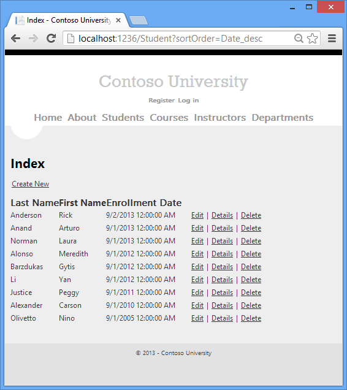

After you click the **Last Name** heading, students are displayed in descending last name order.

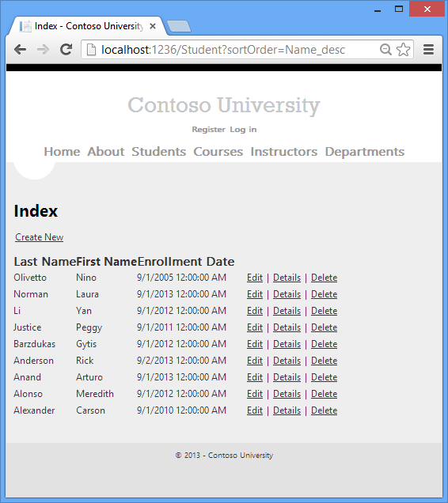

## Add a Search Box to the Students Index Page

To add filtering to the Students Index page, you'll add a text box and a submit button to the view and make corresponding changes in the `Index` method. The text box will let you enter a string to search for in the first name and last name fields.

### Add Filtering Functionality to the Index Method

In *Controllers\StudentController.cs*, replace the `Index` method with the following code (the changes are highlighted):

[!code-csharp[Main](sorting-filtering-and-paging-with-the-entity-framework-in-an-asp-net-mvc-application/samples/sample4.cs?highlight=1,7-11)]

You've added a `searchString` parameter to the `Index` method. You've also added to the LINQ statement a `where` clausethat selects only students whose first name or last name contains the search string. The search string value is received from a text box that you'll add to the Index view.The statement that adds the [where](https://msdn.microsoft.com/en-us/library/bb535040.aspx) clause is executed only if there's a value to search for.

> [!NOTE]
> In many cases you can call the same method either on an Entity Framework entity set or as an extension method on an in-memory collection. The results are normally the same but in some cases may be different. For example, the .NET Framework implementation of the `Contains` method returns all rows when you pass an empty string to it, but the Entity Framework provider for SQL Server Compact 4.0 returns zero rows for empty strings. Therefore the code in the example (putting the `Where` statement inside an `if` statement) makes sure that you get the same results for all versions of SQL Server. Also, the .NET Framework implementation of the `Contains` method performs a case-sensitive comparison by default, but Entity Framework SQL Server providers perform case-insensitive comparisons by default. Therefore, calling the `ToUpper` method to make the test explicitly case-insensitive ensures that results do not change when you change the code later to use a repository, which will return an `IEnumerable` collection instead of an `IQueryable` object. (When you call the `Contains` method on an `IEnumerable` collection, you get the .NET Framework implementation; when you call it on an `IQueryable` object, you get the database provider implementation.)

### Add a Search Box to the Student Index View

In *Views\Student\Index.cshtml*, add the highlighted code immediately before the opening `table` tag in order to create a caption, a text box, and a **Search** button.

[!code-cshtml[Main](sorting-filtering-and-paging-with-the-entity-framework-in-an-asp-net-mvc-application/samples/sample5.cshtml?highlight=5-10)]

Run the page, enter a search string, and click **Search** to verify that filtering is working.

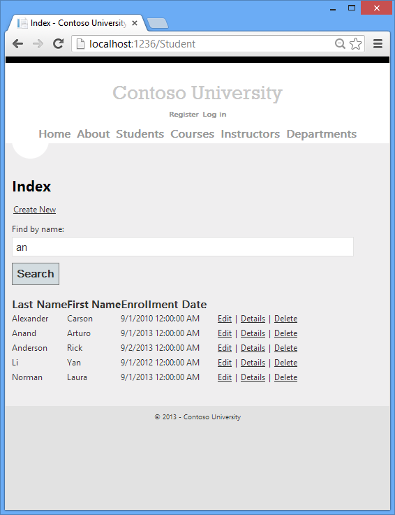

Notice the URL doesn't contain the "an" search string, which means that if you bookmark this page, you won't get the filtered list when you use the bookmark. You'll change the **Search** button to use query strings for filter criteria later in the tutorial.

## Add Paging to the Students Index Page

To add paging to the Students Index page, you'll start by installing the **PagedList.Mvc** NuGet package. Then you'll make additional changes in the `Index` method and add paging links to the `Index` view. **PagedList.Mvc** is one of many good paging and sorting packages for ASP.NET MVC, and its use here is intended only as an example, not as a recommendation for it over other options. The following illustration shows the paging links.

### Install the PagedList.MVC NuGet Package

The NuGet **PagedList.Mvc** package automatically installs the **PagedList** package as a dependency. The **PagedList** package installs a `PagedList` collection type and extension methods for `IQueryable` and `IEnumerable` collections. The extension methods create a single page of data in a `PagedList` collection out of your `IQueryable` or `IEnumerable`, and the `PagedList` collection provides several properties and methods that facilitate paging. The **PagedList.Mvc** package installs a paging helper that displays the paging buttons.

From the **Tools** menu, select **Library Package Manager** and then **Manage NuGet Packages for Solution**.

In the **Manage NuGet Packages** dialog box, click the **Online** tab on the left and then enter "paged" in the search box. When you see the **PagedList.Mvc** package, click **Install**.

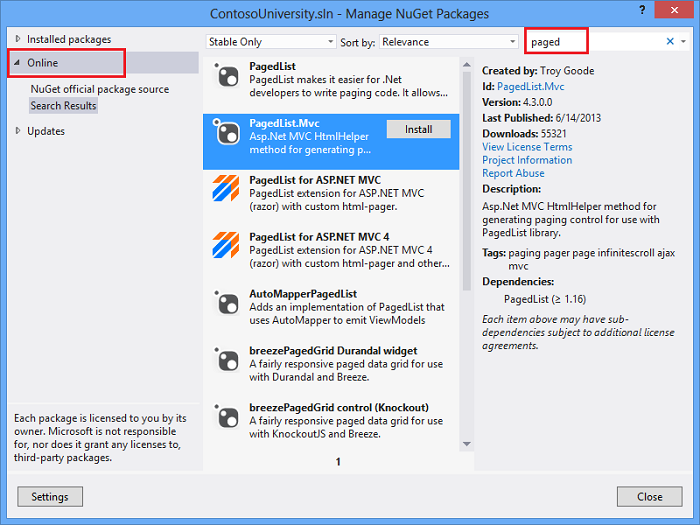

In the **Select Projects** box, click **OK**.

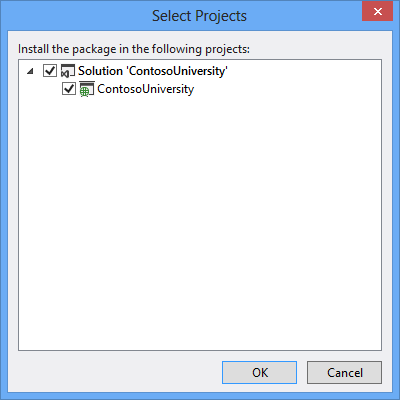

### Add Paging Functionality to the Index Method

In *Controllers\StudentController.cs*, add a `using` statement for the `PagedList` namespace:

[!code-csharp[Main](sorting-filtering-and-paging-with-the-entity-framework-in-an-asp-net-mvc-application/samples/sample6.cs)]

Replace the `Index` method with the following code:

[!code-csharp[Main](sorting-filtering-and-paging-with-the-entity-framework-in-an-asp-net-mvc-application/samples/sample7.cs)]

This code adds a `page` parameter, a current sort order parameter, and a current filter parameter to the method signature, as shown here:

[!code-csharp[Main](sorting-filtering-and-paging-with-the-entity-framework-in-an-asp-net-mvc-application/samples/sample8.cs)]

The first time the page is displayed, or if the user hasn't clicked a paging or sorting link, all the parameters will be null. If a paging link is clicked, the `page` variable will contain the page number to display.

`A ViewBag` property provides the view with the current sort order, because this must be included in the paging links in order to keep the sort order the same while paging:

[!code-csharp[Main](sorting-filtering-and-paging-with-the-entity-framework-in-an-asp-net-mvc-application/samples/sample9.cs)]

Another property, `ViewBag.CurrentFilter`, provides the view with the current filter string. This value must be included in the paging links in order to maintain the filter settings during paging, and it must be restored to the text box when the page is redisplayed. If the search string is changed during paging, the page has to be reset to 1, because the new filter can result in different data to display. The search string is changed when a value is entered in the text box and the submit button is pressed. In that case, the `searchString` parameter is not null.

[!code-csharp[Main](sorting-filtering-and-paging-with-the-entity-framework-in-an-asp-net-mvc-application/samples/sample10.cs)]

At the end of the method, the `ToPagedList` extension method on the students `IQueryable` object converts the student query to a single page of students in a collection type that supports paging. That single page of students is then passed to the view:

[!code-csharp[Main](sorting-filtering-and-paging-with-the-entity-framework-in-an-asp-net-mvc-application/samples/sample11.cs)]

The `ToPagedList` method takes a page number. The two question marks represent the [null-coalescing operator](https://msdn.microsoft.com/en-us/library/ms173224.aspx). The null-coalescing operator defines a default value for a nullable type; the expression `(page ?? 1)` means return the value of `page` if it has a value, or return 1 if `page` is null.

### Add Paging Links to the Student Index View

In *Views\Student\Index.cshtml*, replace the existing code with the following code:

[!code-cshtml[Main](sorting-filtering-and-paging-with-the-entity-framework-in-an-asp-net-mvc-application/samples/sample12.cshtml?highlight=6,9,14-20,56-58)]

The `@model` statement at the top of the page specifies that the view now gets a `PagedList` object instead of a `List` object.

The `using` statement for `PagedList.Mvc` gives access to the MVC helper for the paging buttons.

The code uses an overload of [BeginForm](https://msdn.microsoft.com/en-us/library/system.web.mvc.html.formextensions.beginform(v=vs.108).aspx) that allows it to specify [FormMethod.Get](https://msdn.microsoft.com/en-us/library/system.web.mvc.formmethod(v=vs.100).aspx/css).

[!code-cshtml[Main](sorting-filtering-and-paging-with-the-entity-framework-in-an-asp-net-mvc-application/samples/sample13.cshtml?highlight=1)]

The default [BeginForm](https://msdn.microsoft.com/en-us/library/system.web.mvc.html.formextensions.beginform(v=vs.108).aspx) submits form data with a POST, which means that parameters are passed in the HTTP message body and not in the URL as query strings. When you specify HTTP GET, the form data is passed in the URL as query strings, which enables users to bookmark the URL. The [W3C guidelines for the use of HTTP GET](http://www.w3.org/2001/tag/doc/whenToUseGet.html) specify that you should use GET when the action does not result in an update.

The text box is initialized with the current search string so when you click a new page you can see the current search string.

[!code-cshtml[Main](sorting-filtering-and-paging-with-the-entity-framework-in-an-asp-net-mvc-application/samples/sample14.cshtml?highlight=1)]

The column header links use the query string to pass the current search string to the controller so that the user can sort within filter results:

[!code-cshtml[Main](sorting-filtering-and-paging-with-the-entity-framework-in-an-asp-net-mvc-application/samples/sample15.cshtml?highlight=1)]

The current page and total number of pages are displayed.

[!code-cshtml[Main](sorting-filtering-and-paging-with-the-entity-framework-in-an-asp-net-mvc-application/samples/sample16.cshtml)]

If there are no pages to display, "Page 0 of 0" is shown. (In that case the page number is greater than the page count because `Model.PageNumber` is 1, and `Model.PageCount` is 0.)

The paging buttons are displayed by the `PagedListPager` helper:

[!code-cshtml[Main](sorting-filtering-and-paging-with-the-entity-framework-in-an-asp-net-mvc-application/samples/sample17.cshtml)]

The `PagedListPager` helper provides a number of options that you can customize, including URLs and styling. For more information, see [TroyGoode / PagedList](https://github.com/TroyGoode/PagedList) on the GitHub site.

Run the page.

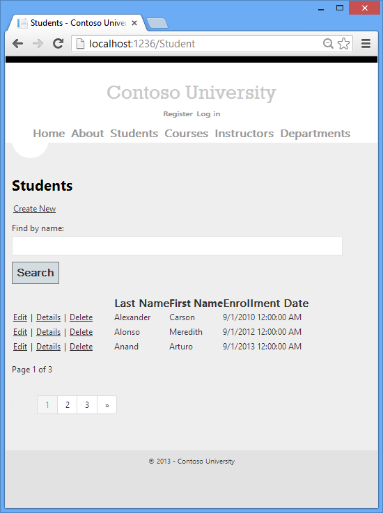

Click the paging links in different sort orders to make sure paging works. Then enter a search string and try paging again to verify that paging also works correctly with sorting and filtering.

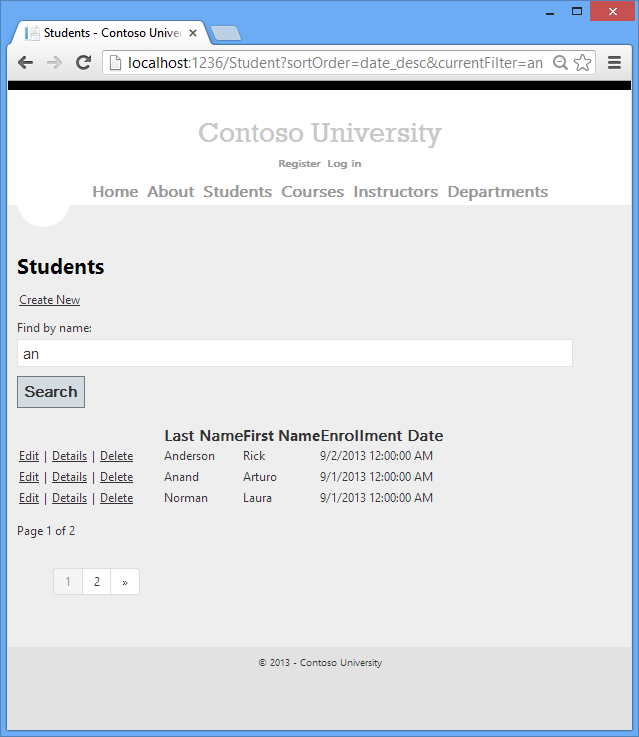

## Create an About Page That Shows Student Statistics

For the Contoso University website's About page, you'll display how many students have enrolled for each enrollment date. This requires grouping and simple calculations on the groups. To accomplish this, you'll do the following:

- Create a view model class for the data that you need to pass to the view.
- Modify the `About` method in the `Home` controller.
- Modify the `About` view.

### Create the View Model

Create a *ViewModels* folder. In that folder, add a class file *EnrollmentDateGroup.cs* and replace the existing code with the following code:

[!code-csharp[Main](sorting-filtering-and-paging-with-the-entity-framework-in-an-asp-net-mvc-application/samples/sample18.cs)]

### Modify the Home Controller

In *HomeController.cs*, add the following `using` statements at the top of the file:

[!code-csharp[Main](sorting-filtering-and-paging-with-the-entity-framework-in-an-asp-net-mvc-application/samples/sample19.cs)]

Add a class variable for the database context immediately after the opening curly brace for the class:

[!code-csharp[Main](sorting-filtering-and-paging-with-the-entity-framework-in-an-asp-net-mvc-application/samples/sample20.cs?highlight=3)]

Replace the `About` method with the following code:

[!code-csharp[Main](sorting-filtering-and-paging-with-the-entity-framework-in-an-asp-net-mvc-application/samples/sample21.cs)]

The LINQ statement groups the student entities by enrollment date, calculates the number of entities in each group, and stores the results in a collection of `EnrollmentDateGroup` view model objects.

Add a `Dispose` method:

[!code-csharp[Main](sorting-filtering-and-paging-with-the-entity-framework-in-an-asp-net-mvc-application/samples/sample22.cs)]

### Modify the About View

Replace the code in the *Views\Home\About.cshtml* file with the following code:

[!code-cshtml[Main](sorting-filtering-and-paging-with-the-entity-framework-in-an-asp-net-mvc-application/samples/sample23.cshtml)]

Run the app and click the **About** link. The count of students for each enrollment date is displayed in a table.

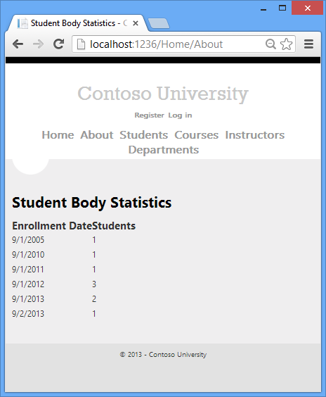

## Optional: Deploy the app to Windows Azure

So far your application has been running locally in IIS Express on your development computer. To make it available for other people to use over the Internet, you have to deploy it to a web hosting provider. In this optional section of the tutorial you'll deploy it to a Windows Azure Web Site.

### Using Code First Migrations to Deploy the Database

To deploy the database you'll use Code First Migrations. When you create the publish profile that you use to configure settings for deploying from Visual Studio, you'll select a check box that is labeled **Execute Code First Migrations (runs on application start)**. This setting causes the deployment process to automatically configure the application *Web.config* file on the destination server so that Code First uses the `MigrateDatabaseToLatestVersion` initializer class.

Visual Studio does not do anything with the database during the deployment process. When the deployed application accesses the database for the first time after deployment, Code First automatically creates the database or updates the database schema to the latest version. If the application implements a Migrations `Seed` method, the method runs after the database is created or the schema is updated.

Your Migrations `Seed` method inserts test data. If you were deploying to a production environment, you would have to change the `Seed` method so that it only inserts data that you want to be inserted into your production database. For example, in your current data model you might want to have real courses but fictional students in the development database. You can write a `Seed` method to load both in development, and then comment out the fictional students before you deploy to production. Or you can write a `Seed` method to load only courses, and enter the fictional students in the test database manually by using the application's UI.

### Get a Windows Azure account

You'll need a Windows Azure account. If you don't already have one, you can create a free trial account in just a couple of minutes. For details, see [Windows Azure Free Trial](https://www.windowsazure.com/en-us/pricing/free-trial/?WT.mc_id=A443DD604).

### Create a web site and a SQL database in Windows Azure

Your Windows Azure Web Site will run in a shared hosting environment, which means it runs on virtual machines (VMs) that are shared with other Windows Azure clients. A shared hosting environment is a low-cost way to get started in the cloud. Later, if your web traffic increases, the application can scale to meet the need by running on dedicated VMs. If you need a more complex architecture, you can migrate to a Windows Azure Cloud Service. Cloud services run on dedicated VMs that you can configure according to your needs.

Windows Azure SQL Database is a cloud-based relational database service that is built on SQL Server technologies. Tools and applications that work with SQL Server also work with SQL Database.

1. In the [Windows Azure Management Portal](https://manage.windowsazure.com/), click **Web Sites** in the left tab, and then click **New**.

    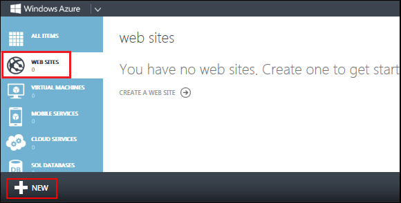
2. Click **CUSTOM CREATE**.

    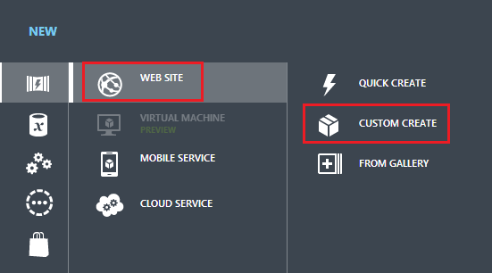

 The **New Web Site - Custom Create** wizard opens.
3. In the **New Web Site** step of the wizard, enter a string in the **URL** box to use as the unique URL for your application. The complete URL will consist of what you enter here plus the suffix that you see next to the text box. The illustration shows "ConU", but that URL is probably taken so you will have to choose a different one.

    
4. In the **Region** drop-down list, choose a region close to you. This setting specifies which data center your web site will run in.
5. In the **Database** drop-down list, choose **Create a free 20 MB SQL database**.

    
6. In the **DB CONNECTION STRING NAME**, enter *SchoolContext*.

    
7. Click the arrow that points to the right at the bottom of the box. The wizard advances to the **Database Settings** step.
8. In the **Name** box, enter *ContosoUniversityDB*.
9. In the **Server** box, select **New SQL Database server**. Alternatively, if you previously created a server, you can select that server from the drop-down list.
10. Enter an administrator **LOGIN NAME** and **PASSWORD**. If you selected **New SQL Database server** you aren't entering an existing name and password here, you're entering a new name and password that you're defining now to use later when you access the database. If you selected a server that you created previously, you'll enter credentials for that server. For this tutorial, you won't select the ***Advanced*** check box. The ***Advanced*** options enable you to set the database [collation](https://msdn.microsoft.com/en-us/library/aa174903(v=SQL.80).aspx).
11. Choose the same **Region** that you chose for the web site.
12. Click the check mark at the bottom right of the box to indicate that you're finished.   
  
      

 The following image shows using an existing SQL Server and Login.   
  
    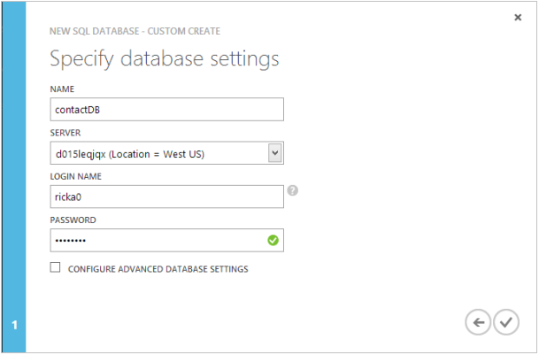  
  
 The Management Portal returns to the Web Sites page, and the **Status** column shows that the site is being created. After a while (typically less than a minute), the **Status** column shows that the site was successfully created. In the navigation bar at the left, the number of sites you have in your account appears next to the **Web Sites** icon, and the number of databases appears next to the **SQL Databases** icon.

## Deploy the application to Windows Azure

1. In Visual Studio, right-click the project in **Solution Explorer** and select **Publish** from the context menu.  
  
    
2. In the **Profile** tab of the **Publish Web** wizard, click **Import**.  
  
    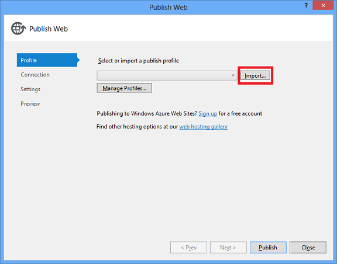
3. If you have not previously added your Windows Azure subscription in Visual Studio, perform the following steps. In these steps you add your subscription so that the drop-down list under **Import from a Windows Azure web site** will include your web site.

    a. In the **Import Publish Profile** dialog box, click **Import from a Windows Azure web site**, and then click **Add Windows Azure subscription**.

    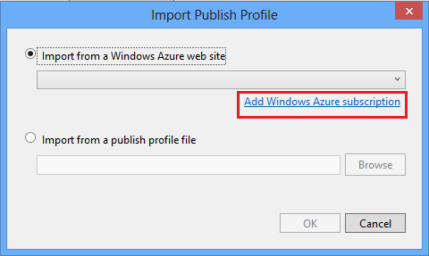

    b. In the **Import Windows Azure Subscriptions** dialog box, click **Download subscription file**.

    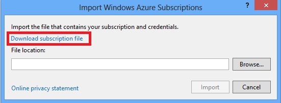

    c. In your browser window, save the *.publishsettings* file.

    

    > [!WARNING]
    > Security - The *publishsettings* file contains your credentials (unencoded) that are used to administer your Windows Azure subscriptions and services. The security best practice for this file is to store it temporarily outside your source directories (for example in the *Libraries\Documents* folder), and then delete it once the import has completed. A malicious user who gains access to the `.publishsettings` file can edit, create, and delete your Windows Azure services.

    d. In the **Import Windows Azure Subscriptions** dialog box, click **Browse** and navigate to the *.publishsettings* file.

    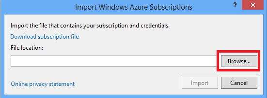

    e. Click **Import**.

    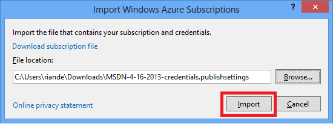
4. In the **Import Publish Profile** dialog box, select **Import from a Windows Azure web site**, select your web site from the drop-down list, and then click **OK**.  
  
    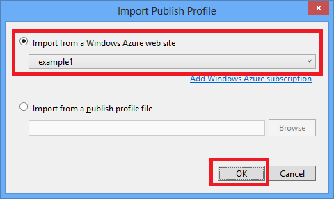
5. In the **Connection** tab, click **Validate Connection** to make sure that the settings are correct.  
  
    
6. When the connection has been validated, a green check mark is shown next to the **Validate Connection** button. Click **Next**.  
  
    
7. Open the **Remote connection string** drop-down list under **SchoolContext** and select the connection string for the database you created.
8. Select **Execute Code First Migrations (runs on application start)**.
9. Uncheck **Use this connection string at runtime** for the **UserContext (DefaultConnection)**, since this application is not using the membership database.   
  
    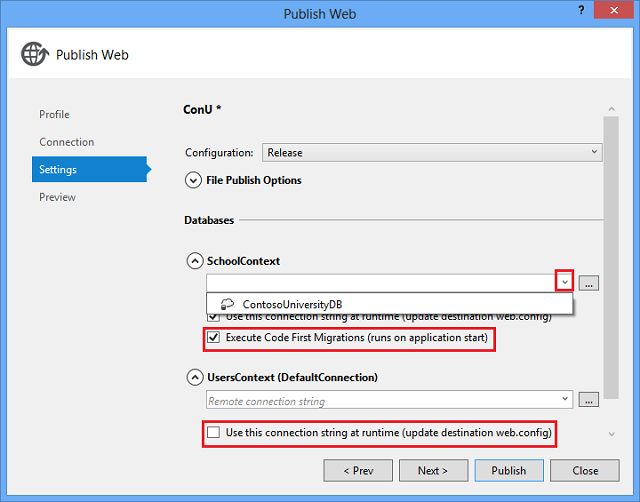
10. Click **Next**.
11. In the **Preview** tab, click **Start Preview**.  
  
      
  
 The tab displays a list of the files that will be copied to the server. Displaying the preview isn't required to publish the application but is a useful function to be aware of. In this case, you don't need to do anything with the list of files that is displayed. The next time you deploy this application, only the files that have changed will be in this list.  
  
    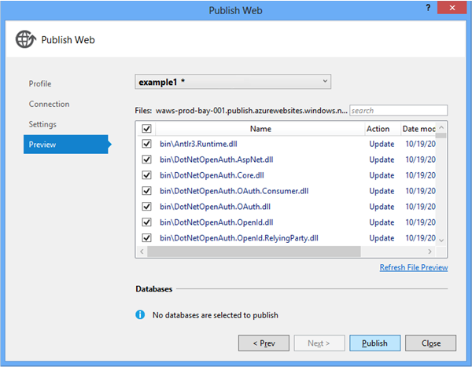
12. Click **Publish**.  
 Visual Studio begins the process of copying the files to the Windows Azure server.
13. The **Output** window shows what deployment actions were taken and reports successful completion of the deployment.  
  
    
14. Upon successful deployment, the default browser automatically opens to the URL of the deployed web site.  
 The application you created is now running in the cloud. Click the Students tab.  
  
    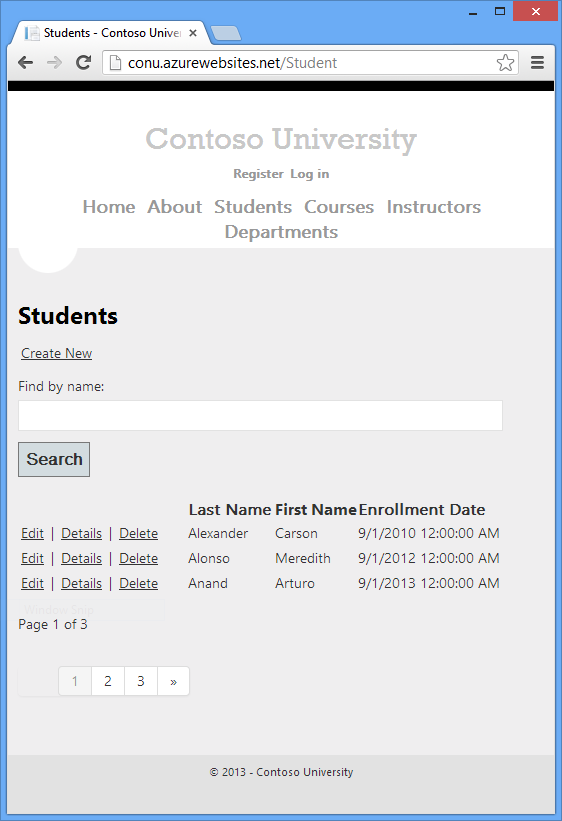

At this point your *SchoolContext* database has been created in the Windows Azure SQL Database because you selected **Execute Code First Migrations (runs on app start)**. The *Web.config* file in the deployed web site has been changed so that the [MigrateDatabaseToLatestVersion](https://msdn.microsoft.com/en-us/library/hh829476(v=vs.103).aspx) initializer would run the first time your code reads or writes data in the database (which happened when you selected the **Students** tab):

The deployment process also created a new connection string *(SchoolContext\_DatabasePublish*) for Code First Migrations to use for updating the database schema and seeding the database.

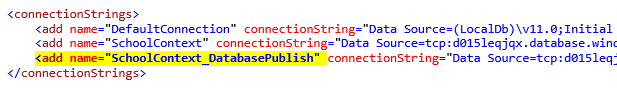

The *DefaultConnection* connection string is for the membership database (which we are not using in this tutorial). The *SchoolContext* connection string is for the ContosoUniversity database.

You can find the deployed version of the Web.config file on your own computer in *ContosoUniversity\obj\Release\Package\PackageTmp\Web.config*. You can access the deployed *Web.config* file itself by using FTP. For instructions, see [ASP.NET Web Deployment using Visual Studio: Deploying a Code Update](../../../../web-forms/overview/deployment/visual-studio-web-deployment/deploying-a-code-update.md). Follow the instructions that start with "To use an FTP tool, you need three things: the FTP URL, the user name, and the password."

> [!NOTE]
> The web app doesn't implement security, so anyone who finds the URL can change the data. For instructions on how to secure the web site, see [Deploy a Secure ASP.NET MVC app with Membership, OAuth, and SQL Database to a Windows Azure Web Site](https://www.windowsazure.com/en-us/develop/net/tutorials/web-site-with-sql-database/). You can prevent other people from using the site by using the Windows Azure Management Portal or **Server Explorer** in Visual Studio to stop the site.

## Code First Initializers

In the deployment section you saw the [MigrateDatabaseToLatestVersion](https://msdn.microsoft.com/en-us/library/hh829476(v=vs.103).aspx) initializer being used. Code First also provides other initializers that you can use, including [CreateDatabaseIfNotExists](https://msdn.microsoft.com/en-us/library/gg679221(v=vs.103).aspx) (the default), [DropCreateDatabaseIfModelChanges](https://msdn.microsoft.com/en-us/library/gg679604(v=VS.103).aspx) and [DropCreateDatabaseAlways](https://msdn.microsoft.com/en-us/library/gg679506(v=VS.103).aspx). The `DropCreateAlways` initializer can be useful for setting up conditions for unit tests. You can also write your own initializers, and you can call an initializer explicitly if you don't want to wait until the application reads from or writes to the database. For a comprehensive explanation of initializers, see chapter 6 of the book [Programming Entity Framework: Code First](http://shop.oreilly.com/product/0636920022220.do) by Julie Lerman and Rowan Miller.

## Summary

In this tutorial you've seen how to create a data model and implement basic CRUD, sorting, filtering, paging, and grouping functionality. In the next tutorial you'll begin looking at more advanced topics by expanding the data model.

Links to other Entity Framework resources can be found in the [ASP.NET Data Access Content Map](../../../../whitepapers/aspnet-data-access-content-map.md).

>[!div class="step-by-step"]
[Previous](implementing-basic-crud-functionality-with-the-entity-framework-in-asp-net-mvc-application.md)
[Next](creating-a-more-complex-data-model-for-an-asp-net-mvc-application.md)