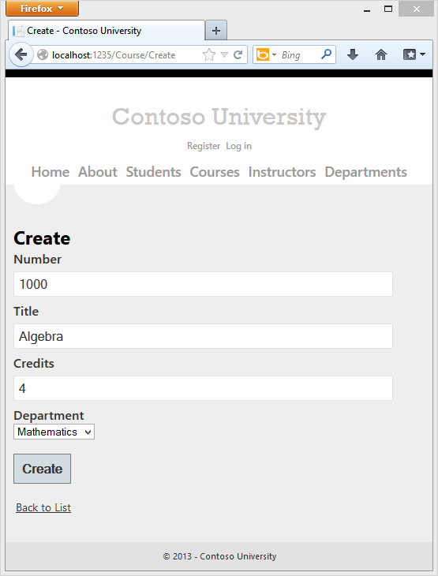
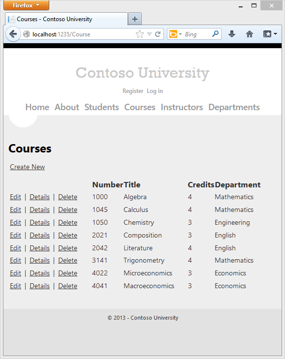
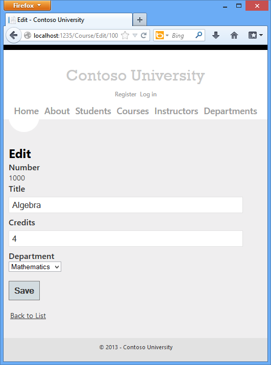
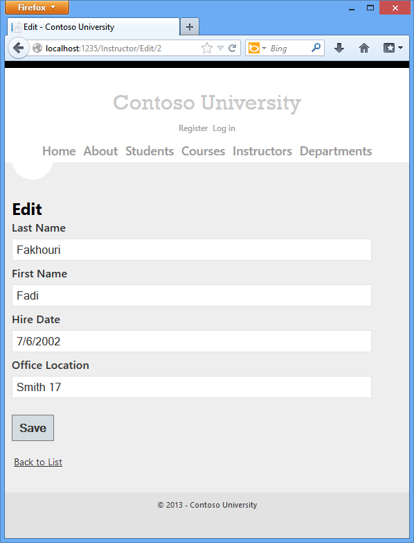
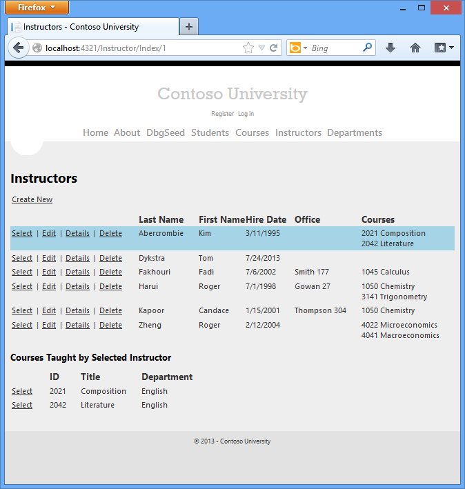

Updating Related Data with the Entity Framework in an ASP.NET MVC Application (6 of 10)
====================
by [Tom Dykstra](https://github.com/tdykstra)

[Download Completed Project](http://code.msdn.microsoft.com/Getting-Started-with-dd0e2ed8)

> The Contoso University sample web application demonstrates how to create ASP.NET MVC 4 applications using the Entity Framework 5 Code First and Visual Studio 2012. For information about the tutorial series, see [the first tutorial in the series](creating-an-entity-framework-data-model-for-an-asp-net-mvc-application.md). You can start the tutorial series from the beginning or [download a starter project for this chapter](building-the-ef5-mvc4-chapter-downloads.md) and start here.
> 
> > [!NOTE] 
> > 
> > If you run into a problem you can't resolve, [download the completed chapter](building-the-ef5-mvc4-chapter-downloads.md) and try to reproduce your problem. You can generally find the solution to the problem by comparing your code to the completed code. For some common errors and how to solve them, see [Errors and Workarounds.](advanced-entity-framework-scenarios-for-an-mvc-web-application.md#errors)

In the previous tutorial you displayed related data; in this tutorial you'll update related data. For most relationships, this can be done by updating the appropriate foreign key fields. For many-to-many relationships, the Entity Framework doesn't expose the join table directly, so you must explicitly add and remove entities to and from the appropriate navigation properties.

The following illustrations show the pages that you'll work with.

## Customize the Create and Edit Pages for Courses

When a new course entity is created, it must have a relationship to an existing department. To facilitate this, the scaffolded code includes controller methods and Create and Edit views that include a drop-down list for selecting the department. The drop-down list sets the `Course.DepartmentID` foreign key property, and that's all the Entity Framework needs in order to load the `Department` navigation property with the appropriate `Department` entity. You'll use the scaffolded code, but change it slightly to add error handling and sort the drop-down list.

In *CourseController.cs*, delete the four `Edit` and `Create` methods and replace them with the following code:

[!code-csharp[Main](updating-related-data-with-the-entity-framework-in-an-asp-net-mvc-application/samples/sample1.cs?highlight=3,10,13-14,21-27,34,41,44-45,52-58,62-68)]

The `PopulateDepartmentsDropDownList` method gets a list of all departments sorted by name, creates a `SelectList` collection for a drop-down list, and passes the collection to the view in a `ViewBag` property. The method accepts the optional `selectedDepartment` parameter that allows the calling code to specify the item that will be selected when the drop-down list is rendered. The view will pass the name `DepartmentID` to [the `DropDownList` helper](../working-with-the-dropdownlist-box-and-jquery/using-the-dropdownlist-helper-with-aspnet-mvc.md), and the helper then knows to look in the `ViewBag` object for a `SelectList` named `DepartmentID`.

The `HttpGet` `Create` method calls the `PopulateDepartmentsDropDownList` method without setting the selected item, because for a new course the department is not established yet:

[!code-csharp[Main](updating-related-data-with-the-entity-framework-in-an-asp-net-mvc-application/samples/sample2.cs)]

The `HttpGet` `Edit` method sets the selected item, based on the ID of the department that is already assigned to the course being edited:

[!code-csharp[Main](updating-related-data-with-the-entity-framework-in-an-asp-net-mvc-application/samples/sample3.cs)]

The `HttpPost` methods for both `Create` and `Edit` also include code that sets the selected item when they redisplay the page after an error:

[!code-csharp[Main](updating-related-data-with-the-entity-framework-in-an-asp-net-mvc-application/samples/sample4.cs)]

This code ensures that when the page is redisplayed to show the error message, whatever department was selected stays selected.

In *Views\Course\Create.cshtml*, add the highlighted code to create a new course number field before the **Title** field. As explained in an earlier tutorial, primary key fields aren't scaffolded by default, but this primary key is meaningful, so you want the user to be able to enter the key value.

[!code-cshtml[Main](updating-related-data-with-the-entity-framework-in-an-asp-net-mvc-application/samples/sample5.cshtml?highlight=17-23)]

In *Views\Course\Edit.cshtml*, *Views\Course\Delete.cshtml*, and *Views\Course\Details.cshtml*, add a course number field before the **Title** field. Because it's the primary key, it's displayed, but it can't be changed.

[!code-cshtml[Main](updating-related-data-with-the-entity-framework-in-an-asp-net-mvc-application/samples/sample6.cshtml)]

Run the **Create** page (display the Course Index page and click **Create New**) and enter data for a new course:

Click **Create**. The Course Index page is displayed with the new course added to the list. The department name in the Index page list comes from the navigation property, showing that the relationship was established correctly.

Run the **Edit** page (display the Course Index page and click **Edit** on a course).

Change data on the page and click **Save**. The Course Index page is displayed with the updated course data.

## Adding an Edit Page for Instructors

When you edit an instructor record, you want to be able to update the instructor's office assignment. The `Instructor` entity has a one-to-zero-or-one relationship with the `OfficeAssignment` entity, which means you must handle the following situations:

- If the user clears the office assignment and it originally had a value, you must remove and delete the `OfficeAssignment` entity.
- If the user enters an office assignment value and it originally was empty, you must create a new `OfficeAssignment` entity.
- If the user changes the value of an office assignment, you must change the value in an existing `OfficeAssignment` entity.

Open *InstructorController.cs* and look at the `HttpGet` `Edit` method:

[!code-csharp[Main](updating-related-data-with-the-entity-framework-in-an-asp-net-mvc-application/samples/sample7.cs)]

The scaffolded code here isn't what you want. It's setting up data for a drop-down list, but you what you need is a text box. Replace this method with the following code:

[!code-csharp[Main](updating-related-data-with-the-entity-framework-in-an-asp-net-mvc-application/samples/sample8.cs)]

This code drops the `ViewBag` statement and adds eager loading for the associated `OfficeAssignment` entity. You can't perform eager loading with the `Find` method, so the `Where` and `Single` methods are used instead to select the instructor.

Replace the `HttpPost` `Edit` method with the following code. which handles office assignment updates:

[!code-csharp[Main](updating-related-data-with-the-entity-framework-in-an-asp-net-mvc-application/samples/sample9.cs)]

The code does the following:

- Gets the current `Instructor` entity from the database using eager loading for the `OfficeAssignment` navigation property. This is the same as what you did in the `HttpGet` `Edit` method.
- Updates the retrieved `Instructor` entity with values from the model binder. The [TryUpdateModel](https://msdn.microsoft.com/en-us/library/dd470908(v=vs.108).aspx) overload used enables you to *whitelist* the properties you want to include. This prevents over-posting, as explained in [the second tutorial](implementing-basic-crud-functionality-with-the-entity-framework-in-asp-net-mvc-application.md).

    [!code-csharp[Main](updating-related-data-with-the-entity-framework-in-an-asp-net-mvc-application/samples/sample10.cs)]
- If the office location is blank, sets the `Instructor.OfficeAssignment` property to null so that the related row in the `OfficeAssignment` table will be deleted.

    [!code-csharp[Main](updating-related-data-with-the-entity-framework-in-an-asp-net-mvc-application/samples/sample11.cs)]
- Saves the changes to the database.

In *Views\Instructor\Edit.cshtml*, after the `div` elements for the **Hire Date** field, add a new field for editing the office location:

[!code-cshtml[Main](updating-related-data-with-the-entity-framework-in-an-asp-net-mvc-application/samples/sample12.cshtml)]

Run the page (select the **Instructors** tab and then click **Edit** on an instructor). Change the **Office Location** and click **Save**.

## Adding Course Assignments to the Instructor Edit Page

Instructors may teach any number of courses. Now you'll enhance the Instructor Edit page by adding the ability to change course assignments using a group of check boxes, as shown in the following screen shot:

The relationship between the `Course` and `Instructor` entities is many-to-many, which means you do not have direct access to the join table. Instead, you will add and remove entities to and from the `Instructor.Courses` navigation property.

The UI that enables you to change which courses an instructor is assigned to is a group of check boxes. A check box for every course in the database is displayed, and the ones that the instructor is currently assigned to are selected. The user can select or clear check boxes to change course assignments. If the number of courses were much greater, you would probably want to use a different method of presenting the data in the view, but you'd use the same method of manipulating navigation properties in order to create or delete relationships.

To provide data to the view for the list of check boxes, you'll use a view model class. Create *AssignedCourseData.cs* in the *ViewModels* folder and replace the existing code with the following code:

[!code-csharp[Main](updating-related-data-with-the-entity-framework-in-an-asp-net-mvc-application/samples/sample13.cs)]

In *InstructorController.cs*, replace the `HttpGet` `Edit` method with the following code. The changes are highlighted.

[!code-csharp[Main](updating-related-data-with-the-entity-framework-in-an-asp-net-mvc-application/samples/sample14.cs?highlight=5,8,12-27)]

The code adds eager loading for the `Courses` navigation property and calls the new `PopulateAssignedCourseData` method to provide information for the check box array using the `AssignedCourseData` view model class.

The code in the `PopulateAssignedCourseData` method reads through all `Course` entities in order to load a list of courses using the view model class. For each course, the code checks whether the course exists in the instructor's `Courses` navigation property. To create efficient lookup when checking whether a course is assigned to the instructor, the courses assigned to the instructor are put into a [HashSet](https://msdn.microsoft.com/en-us/library/bb359438.aspx) collection. The `Assigned` property is set to `true` for courses the instructor is assigned. The view will use this property to determine which check boxes must be displayed as selected. Finally, the list is passed to the view in a `ViewBag` property.

Next, add the code that's executed when the user clicks **Save**. Replace the `HttpPost` `Edit` method with the following code, which calls a new method that updates the `Courses` navigation property of the `Instructor` entity. The changes are highlighted.

[!code-csharp[Main](updating-related-data-with-the-entity-framework-in-an-asp-net-mvc-application/samples/sample15.cs?highlight=3,7,20,33,37-65)]

Since the view doesn't have a collection of `Course` entities, the model binder can't automatically update the `Courses` navigation property. Instead of using the model binder to update the Courses navigation property, you'll do that in the new `UpdateInstructorCourses` method. Therefore you need to exclude the `Courses` property from model binding. This doesn't require any change to the code that calls [TryUpdateModel](https://msdn.microsoft.com/en-us/library/dd470908(v=vs.98).aspx) because you're using the *whitelisting* overload and `Courses` isn't in the include list.

If no check boxes were selected, the code in `UpdateInstructorCourses` initializes the `Courses` navigation property with an empty collection:

[!code-csharp[Main](updating-related-data-with-the-entity-framework-in-an-asp-net-mvc-application/samples/sample16.cs)]

The code then loops through all courses in the database and checks each course against the ones currently assigned to the instructor versus the ones that were selected in the view. To facilitate efficient lookups, the latter two collections are stored in `HashSet` objects.

If the check box for a course was selected but the course isn't in the `Instructor.Courses` navigation property, the course is added to the collection in the navigation property.

[!code-csharp[Main](updating-related-data-with-the-entity-framework-in-an-asp-net-mvc-application/samples/sample17.cs)]

If the check box for a course wasn't selected, but the course is in the `Instructor.Courses` navigation property, the course is removed from the navigation property.

[!code-csharp[Main](updating-related-data-with-the-entity-framework-in-an-asp-net-mvc-application/samples/sample18.cs)]

In *Views\Instructor\Edit.cshtml*, add a **Courses** field with an array of check boxes by adding the following highlighted code immediately after the `div` elements for the `OfficeAssignment` field:

[!code-cshtml[Main](updating-related-data-with-the-entity-framework-in-an-asp-net-mvc-application/samples/sample19.cshtml?highlight=51-73)]

This code creates an HTML table that has three columns. In each column is a check box followed by a caption that consists of the course number and title. The check boxes all have the same name ("selectedCourses"), which informs the model binder that they are to be treated as a group. The `value` attribute of each check box is set to the value of `CourseID.` When the page is posted, the model binder passes an array to the controller that consists of the `CourseID` values for only the check boxes which are selected.

When the check boxes are initially rendered, those that are for courses assigned to the instructor have `checked` attributes, which selects them (displays them checked).

After changing course assignments, you'll want to be able to verify the changes when the site returns to the `Index` page. Therefore, you need to add a column to the table in that page. In this case you don't need to use the `ViewBag` object, because the information you want to display is already in the `Courses` navigation property of the `Instructor` entity that you're passing to the page as the model.

In *Views\Instructor\Index.cshtml*, add a **Courses** heading immediately following the **Office** heading, as shown in the following example:

[!code-html[Main](updating-related-data-with-the-entity-framework-in-an-asp-net-mvc-application/samples/sample20.html?highlight=7)]

Then add a new detail cell immediately following the office location detail cell:

[!code-cshtml[Main](updating-related-data-with-the-entity-framework-in-an-asp-net-mvc-application/samples/sample21.cshtml?highlight=19,50-57)]

Run the **Instructor Index** page to see the courses assigned to each instructor:

Click **Edit** on an instructor to see the Edit page.

Change some course assignments and click **Save**. The changes you make are reflected on the Index page.

 Note: The approach taken to edit instructor course data works well when there is a limited number of courses. For collections that are much larger, a different UI and a different updating method would be required.  
 

## Update the Delete Method

Change the code in the HttpPost Delete method so the office assignment record (if any) is deleted when the instructor is deleted:

[!code-csharp[Main](updating-related-data-with-the-entity-framework-in-an-asp-net-mvc-application/samples/sample22.cs?highlight=6,10)]

If you try to delete an instructor who is assigned to a department as administrator, you'll get a referential integrity error. See [the current version of this tutorial](../../getting-started/getting-started-with-ef-using-mvc/updating-related-data-with-the-entity-framework-in-an-asp-net-mvc-application.md) for additional code that will automatically remove the instructor from any department where the instructor is assigned as an administrator.

## Summary

You have now completed this introduction to working with related data. So far in these tutorials you've done a full range of CRUD operations, but you haven't dealt with concurrency issues. The next tutorial will introduce the topic of concurrency, explain options for handling it, and add concurrency handling to the CRUD code you've already written for one entity type.

Links to other Entity Framework resources, can be found at the end of [the last tutorial in this series](advanced-entity-framework-scenarios-for-an-mvc-web-application.md).

>[!div class="step-by-step"]
[Previous](reading-related-data-with-the-entity-framework-in-an-asp-net-mvc-application.md)
[Next](handling-concurrency-with-the-entity-framework-in-an-asp-net-mvc-application.md)