ASP.NET MVC 4 Custom Action Filters
====================
by [Web Camps Team](https://twitter.com/webcamps)

> ASP.NET MVC provides Action Filters for executing filtering logic either before or after an action method is called. Action Filters are custom attributes that provide declarative means to add pre-action and post-action behavior to the controller's action methods.
> 
> In this Hands-on Lab you will create a custom action filter attribute into MvcMusicStore solution to catch controller's requests and log the activity of a site into a database table. You will be able to add your logging filter by injection to any controller or action. Finally, you will see the log view that shows the list of visitors.
> 
> > [!NOTE]
> > This Hands-on Lab assumes you have basic knowledge of **ASP.NET MVC**. If you have not used **ASP.NET MVC** before, we recommend you to go over **ASP.NET MVC 4 Fundamentals** Hands-on Lab.

### Objectives

In this Hands-On Lab, you will learn how to:

- Create a custom action filter attribute to extend filtering capabilities
- Apply a custom filter attribute by injection to a specific level
- Register a custom action filters globally

### Prerequisites

You must have the following items to complete this lab:

- [Microsoft Visual Studio Express 2012 for Web](https://www.microsoft.com/visualstudio/eng/products/visual-studio-express-for-web) or superior (read [Appendix A](#AppendixA) for instructions on how to install it).

### Setup

**Installing Code Snippets**

For convenience, much of the code you will be managing along this lab is available as Visual Studio code snippets. To install the code snippets run **.\Source\Setup\CodeSnippets.vsi** file.

If you are not familiar with the Visual Studio Code Snippets, and want to learn how to use them, you can refer to the appendix from this document &quot;[Appendix C: Using Code Snippets](#AppendixC)&quot;.

* * *

## Exercises

This Hands-On Lab is comprised by the following exercises:

1. [Exercise 1: Logging actions](#Exercise1)
2. [Exercise 2: Managing Multiple Action Filters](#Exercise2)

Estimated time to complete this lab: **30 minutes**.

> [!NOTE]
> Each exercise is accompanied by an **End** folder containing the resulting solution you should obtain after completing the exercises. You can use this solution as a guide if you need additional help working through the exercises.

### Exercise 1: Logging Actions

In this exercise, you will learn how to create a custom action log filter by using ASP.NET MVC 4 Filter Providers. For that purpose you will apply a logging filter to the MusicStore site that will record all the activities in the selected controllers.

The filter will extend **ActionFilterAttributeClass** and override **OnActionExecuting** method to catch each request and then perform the logging actions. The context information about HTTP requests, executing methods, results and parameters will be provided by ASP.NET MVC **ActionExecutingContext** class **.**

> [!NOTE]
> ASP.NET MVC 4 also has default filters providers you can use without creating a custom filter. ASP.NET MVC 4 provides the following types of filters:
> 
> - **Authorization** filter, which makes security decisions about whether to execute an action method, such as performing authentication or validating properties of the request.
> - **Action** filter, which wraps the action method execution. This filter can perform additional processing, such as providing extra data to the action method, inspecting the return value, or canceling execution of the action method
> - **Result** filter, which wraps execution of the ActionResult object. This filter can perform additional processing of the result, such as modifying the HTTP response.
> - **Exception** filter, which executes if there is an unhandled exception thrown somewhere in action method, starting with the authorization filters and ending with the execution of the result. Exception filters can be used for tasks such as logging or displaying an error page.
> 
> For more information about Filters Providers please visit this MSDN link: ([https://msdn.microsoft.com/en-us/library/dd410209.aspx](https://msdn.microsoft.com/en-us/library/dd410209.aspx)) .

#### About MVC Music Store Application logging feature

This Music Store solution has a new data model table for site logging, **ActionLog**, with the following fields: Name of the controller that received a request, Called action, Client IP and Time stamp.

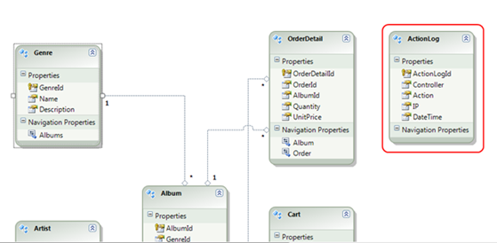

*Data model - ActionLog table*

The solution provides an ASP.NET MVC View for the Action log that can be found at **MvcMusicStores/Views/ActionLog**:

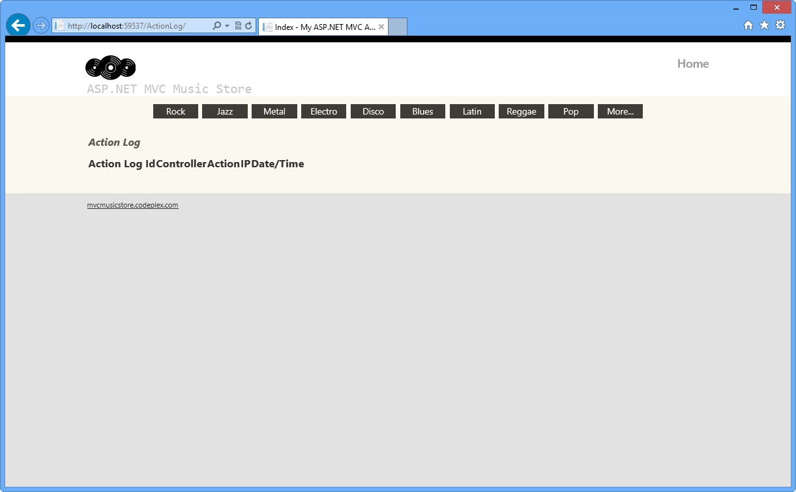

*Action Log view*

With this given structure, all the work will be focused on interrupting controller's request and performing the logging by using custom filtering.

#### Task 1 - Creating a Custom Filter to Catch a Controller's Request

In this task you will create a custom filter attribute class that will contain the logging logic. For that purpose you will extend ASP.NET MVC **ActionFilterAttribute** Class and implement the interface **IActionFilter**.

> [!NOTE]
> The **ActionFilterAttribute** is the base class for all the attribute filters. It provides the following methods to execute a specific logic after and before controller action's execution:
> 
> - **OnActionExecuting**(ActionExecutingContext filterContext): Just before the action method is called.
> - **OnActionExecuted**(ActionExecutedContext filterContext): After the action method is called and before the result is executed (before view render).
> - **OnResultExecuting**(ResultExecutingContext filterContext): Just before the result is executed (before view render).
> - **OnResultExecuted**(ResultExecutedContext filterContext): After the result is executed (after the view is rendered).
> 
> By overriding any of these methods into a derived class, you can execute your own filtering code.

1. Open the **Begin** solution located at **\Source\Ex01-LoggingActions\Begin** folder.

    1. You will need to download some missing NuGet packages before you continue. To do this, click the **Project** menu and select **Manage NuGet Packages**.
    2. In the **Manage NuGet Packages** dialog, click **Restore** in order to download missing packages.
    3. Finally, build the solution by clicking **Build** | **Build Solution**.

    > [!NOTE]
    > One of the advantages of using NuGet is that you don't have to ship all the libraries in your project, reducing the project size. With NuGet Power Tools, by specifying the package versions in the Packages.config file, you will be able to download all the required libraries the first time you run the project. This is why you will have to run these steps after you open an existing solution from this lab.
    > 
    > For more information, see this article: [http://docs.nuget.org/docs/workflows/using-nuget-without-committing-packages](http://docs.nuget.org/docs/workflows/using-nuget-without-committing-packages).
2. Add a new C# class into the **Filters** folder and name it *CustomActionFilter.cs*. This folder will store all the custom filters.
3. Open **CustomActionFilter.cs** and add a reference to **System.Web.Mvc** and **MvcMusicStore.Models** namespaces:

    (Code Snippet - *ASP.NET MVC 4 Custom Action Filters - Ex1-CustomActionFilterNamespaces*)

    [!code-csharp[Main](aspnet-mvc-4-custom-action-filters/samples/sample1.cs)]
4. Inherit the **CustomActionFilter** class from **ActionFilterAttribute** and then make **CustomActionFilter** class implement **IActionFilter** interface.

    [!code-csharp[Main](aspnet-mvc-4-custom-action-filters/samples/sample2.cs)]
5. Make **CustomActionFilter** class override the method **OnActionExecuting** and add the necessary logic to log the filter's execution. To do this, add the following highlighted code within **CustomActionFilter** class.

    (Code Snippet - *ASP.NET MVC 4 Custom Action Filters - Ex1-LoggingActions*)

    [!code-csharp[Main](aspnet-mvc-4-custom-action-filters/samples/sample3.cs#Highlight)]

    > [!NOTE]
    > **OnActionExecuting** method is using **Entity Framework** to add a new ActionLog register. It creates and fills a new entity instance with the context information from **filterContext**.
    > 
    > You can read more about **ControllerContext** class at [msdn](https://msdn.microsoft.com/en-us/library/system.web.mvc.controllercontext.aspx).

#### Task 2 - Injecting a Code Interceptor into the Store Controller Class

In this task you will add the custom filter by injecting it to all controller classes and controller actions that will be logged. For the purpose of this exercise, the Store Controller class will have a log.

The method **OnActionExecuting** from **ActionLogFilterAttribute** custom filter runs when an injected element is called.

It is also possible to intercept a specific controller method.

1. Open the **StoreController** at **MvcMusicStore\Controllers** and add a reference to the **Filters** namespace:

    [!code-csharp[Main](aspnet-mvc-4-custom-action-filters/samples/sample4.cs)]
2. Inject the custom filter **CustomActionFilter** into **StoreController** class by adding **[CustomActionFilter]** attribute before the class declaration.

    [!code-csharp[Main](aspnet-mvc-4-custom-action-filters/samples/sample5.cs)]

    > [!NOTE]
    > When a filter is injected into a controller class, all its actions are also injected. If you would like to apply the filter only for a set of actions, you would have to inject **[CustomActionFilter]** to each one of them:
    > 
    > [!code-csharp[Main](aspnet-mvc-4-custom-action-filters/samples/sample6.cs)]

#### Task 3 - Running the Application

In this task, you will test that the logging filter is working. You will start the application and visit the store, and then you will check logged activities.

1. Press **F5** to run the application.
2. Browse to **/ActionLog** to see log view initial state:

    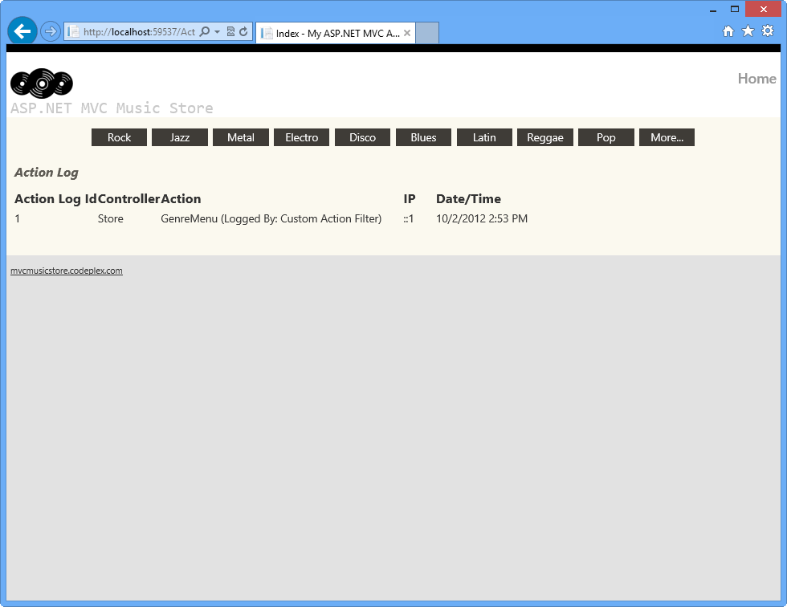

    *Log tracker status before page activity*

    > [!NOTE]
    > By default, it will always show one item that is generated when retrieving the existing genres for the menu.
    > 
    > For simplicity purposes we're cleaning up the **ActionLog** table each time the application runs so it will only show the logs of each particular task's verification.
    > 
    > You might need to remove the following code from the **Session\_Start** method (in the **Global.asax** class), in order to save an historical log for all the actions executed within the Store Controller.
    > 
    > [!code-csharp[Main](aspnet-mvc-4-custom-action-filters/samples/sample7.cs)]
3. Click one of the **Genres** from the menu and perform some actions there, like browsing an available album.
4. Browse to **/ActionLog** and if the log is empty press **F5** to refresh the page. Check that your visits were tracked:

    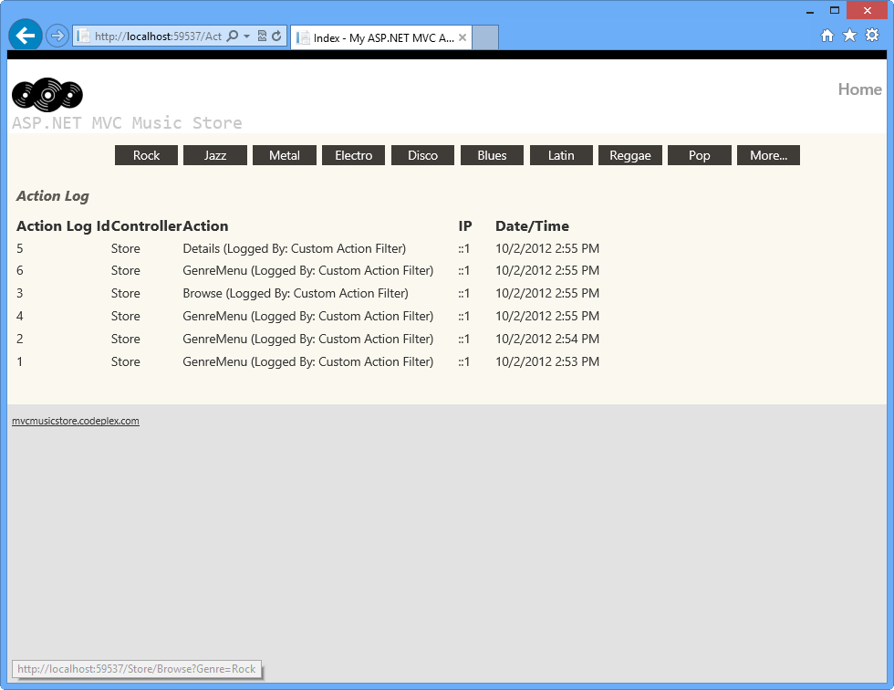

    *Action log with activity logged*

### Exercise 2: Managing Multiple Action Filters

In this exercise you will add a second Custom Action Filter to the StoreController class and define the specific order in which both filters will be executed. Then you will update the code to register the filter Globally.

There are different options to take into account when defining the Filters' execution order. For example, the Order property and the Filters' scope:

You can define a **Scope** for each of the Filters, for example, you could scope all the Action Filters to run within the **Controller Scope**, and all Authorization Filters to run in **Global scope**. The scopes have a defined execution order.

Additionally, each action filter has an Order property which is used to determine the execution order in the scope of the filter.

For more information about Custom Action Filters execution order, please visit this MSDN article: ([https://msdn.microsoft.com/en-us/library/dd381609(v=vs.98).aspx](https://msdn.microsoft.com/en-us/library/dd381609(v=vs.98).aspx)).

#### Task 1: Creating a new Custom Action Filter

In this task, you will create a new Custom Action Filter to inject into the StoreController class, learning how to manage the execution order of the filters.

1. Open the **Begin** solution located at **\Source\Ex02-ManagingMultipleActionFilters\Begin** folder. Otherwise, you might continue using the **End** solution obtained by completing the previous exercise.

    1. If you opened the provided **Begin** solution, you will need to download some missing NuGet packages before continue. To do this, click the **Project** menu and select **Manage NuGet Packages**.
    2. In the **Manage NuGet Packages** dialog, click **Restore** in order to download missing packages.
    3. Finally, build the solution by clicking **Build** | **Build Solution**.

        > [!NOTE]
        > One of the advantages of using NuGet is that you don't have to ship all the libraries in your project, reducing the project size. With NuGet Power Tools, by specifying the package versions in the Packages.config file, you will be able to download all the required libraries the first time you run the project. This is why you will have to run these steps after you open an existing solution from this lab.
        > 
        > For more information, see this article: [http://docs.nuget.org/docs/workflows/using-nuget-without-committing-packages](http://docs.nuget.org/docs/workflows/using-nuget-without-committing-packages).
2. Add a new C# class into the **Filters** folder and name it *MyNewCustomActionFilter.cs*
3. Open **MyNewCustomActionFilter.cs** and add a reference to **System.Web.Mvc** and the **MvcMusicStore.Models** namespace:

    (Code Snippet - *ASP.NET MVC 4 Custom Action Filters - Ex2-MyNewCustomActionFilterNamespaces*)

    [!code-csharp[Main](aspnet-mvc-4-custom-action-filters/samples/sample8.cs)]
4. Replace the default class declaration with the following code.

    (Code Snippet - *ASP.NET MVC 4 Custom Action Filters - Ex2-MyNewCustomActionFilterClass*)

    [!code-csharp[Main](aspnet-mvc-4-custom-action-filters/samples/sample9.cs)]

    > [!NOTE]
    > This Custom Action Filter is almost the same than the one you created in the previous exercise. The main difference is that it has the *&quot;Logged By&quot;* attribute updated with this new class' name to identify wich filter registered the log.

#### Task 2: Injecting a new Code Interceptor into the StoreController Class

In this task, you will add a new custom filter into the StoreController Class and run the solution to verify how both filters work together.

1. Open the **StoreController** class located at **MvcMusicStore\Controllers** and inject the new custom filter **MyNewCustomActionFilter** into **StoreController** class like is shown in the following code.

    [!code-csharp[Main](aspnet-mvc-4-custom-action-filters/samples/sample10.cs)]
2. Now, run the application in order to see how these two Custom Action Filters work. To do this, press **F5** and wait until the application starts.
3. Browse to **/ActionLog** to see log view initial state.

    

    *Log tracker status before page activity*
4. Click one of the **Genres** from the menu and perform some actions there, like browsing an available album.
5. Check that this time; your visits were tracked twice: once for each of the Custom Action Filters you added in the **StorageController** class.

    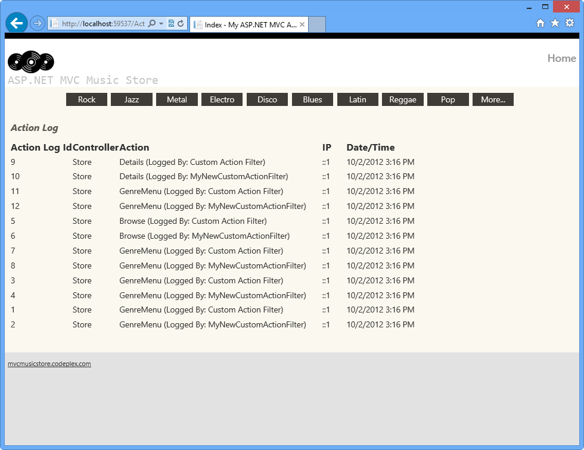

    *Action log with activity logged*
6. Close the browser.

#### Task 3: Managing Filter Ordering

In this task, you will learn how to manage the filters' execution order by using the Order propery.

1. Open the **StoreController** class located at **MvcMusicStore\Controllers** and specify the **Order** property in both filters like shown below.

    [!code-csharp[Main](aspnet-mvc-4-custom-action-filters/samples/sample11.cs)]
2. Now, verify how the filters are executed depending on its Order property's value. You will find that the filter with the smallest Order value (**CustomActionFilter**) is the first one that is executed. Press **F5** and wait until the application starts.
3. Browse to **/ActionLog** to see log view initial state.

    

    *Log tracker status before page activity*
4. Click one of the **Genres** from the menu and perform some actions there, like browsing an available album.
5. Check that this time, your visits were tracked ordered by the filters' Order value: **CustomActionFilter** logs' first.

    

    *Action log with activity logged*
6. Now, you will update the Filters' order value and verify how the logging order changes. In the **StoreController** class, update the Filters' Order value like shown below.

    [!code-csharp[Main](aspnet-mvc-4-custom-action-filters/samples/sample12.cs)]
7. Run the application again by pressing **F5**.
8. Click one of the **Genres** from the menu and perform some actions there, like browsing an available album.
9. Check that this time, the logs created by **MyNewCustomActionFilter** filter appears first.

    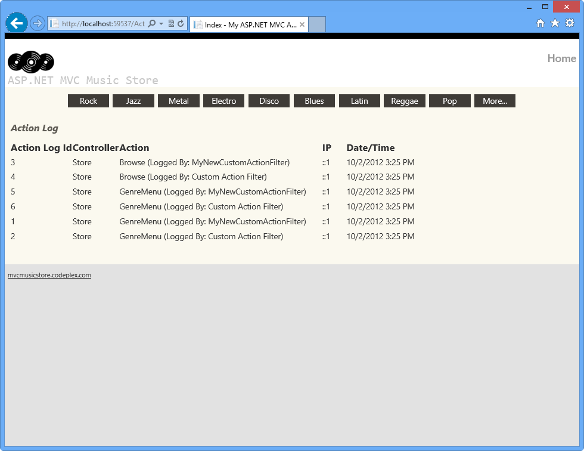

    *Action log with activity logged*

#### Task 4: Registering Filters Globally

In this task, you will update the solution to register the new filter (**MyNewCustomActionFilter**) as a global filter. By doing this, it will be triggered by all the actions perfomed in the application and not only in the StoreController ones as in the previous task.

1. In **StoreController** class, remove **[MyNewCustomActionFilter]** attribute and the order property from **[CustomActionFilter]**. It should look like the following:

    [!code-csharp[Main](aspnet-mvc-4-custom-action-filters/samples/sample13.cs)]
2. Open **Global.asax** file and locate the **Application\_Start** method. Notice that each thime the application starts it is registering the global filters by calling **RegisterGlobalFilters** method within **FilterConfig** class.

    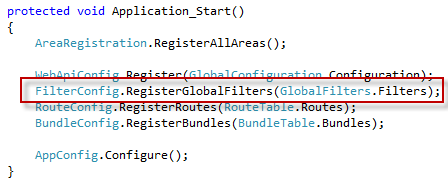

    *Registering Global Filters in Global.asax*
3. Open **FilterConfig.cs** file within **App\_Start** folder.
4. Add a reference to using System.Web.Mvc; using MvcMusicStore.Filters; namespace.

    [!code-csharp[Main](aspnet-mvc-4-custom-action-filters/samples/sample14.cs)]
5. Update **RegisterGlobalFilters** method adding your custom filter. To do this, add the highlighted code:

    [!code-csharp[Main](aspnet-mvc-4-custom-action-filters/samples/sample15.cs)]
6. Run the application by pressing **F5**.
7. Click one of the **Genres** from the menu and perform some actions there, like browsing an available album.
8. Check that now **[MyNewCustomActionFilter]** is being injected in HomeController and ActionLogController too.

    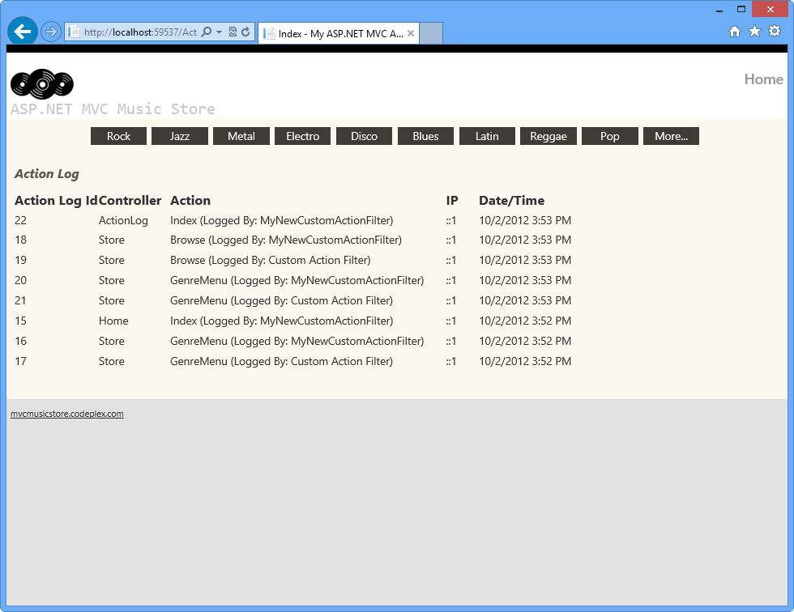

    *Action log with global activity logged*

> [!NOTE]
> Additionally, you can deploy this application to Windows Azure Web Sites following [Appendix B: Publishing an ASP.NET MVC 4 Application using Web Deploy](#AppendixB).

* * *

## Summary

By completing this Hands-On Lab you have learned how to extend an action filter to execute custom actions. You have also learned how to inject any filter to your page controllers. The following concepts were used:

- How to create Custom Action filters with the ASP.NET MVC ActionFilterAttribute class
- How to inject filters into ASP.NET MVC controllers
- How to manage filter ordering using the Order property
- How to register filters globally

## Appendix A: Installing Visual Studio Express 2012 for Web

You can install **Microsoft Visual Studio Express 2012 for Web** or another &quot;Express&quot; version using the **[Microsoft Web Platform Installer](https://www.microsoft.com/web/downloads/platform.aspx)**. The following instructions guide you through the steps required to install *Visual studio Express 2012 for Web* using *Microsoft Web Platform Installer*.

1. Go to [[https://go.microsoft.com/? linkid=9810169](https://go.microsoft.com/?linkid=9810169)](https://go.microsoft.com/?linkid=9810169). Alternatively, if you already have installed Web Platform Installer, you can open it and search for the product &quot;*Visual Studio Express 2012 for Web with Windows Azure SDK*&quot;.
2. Click on **Install Now**. If you do not have **Web Platform Installer** you will be redirected to download and install it first.
3. Once **Web Platform Installer** is open, click **Install** to start the setup.

    

    *Install Visual Studio Express*
4. Read all the products' licenses and terms and click **I Accept** to continue.

    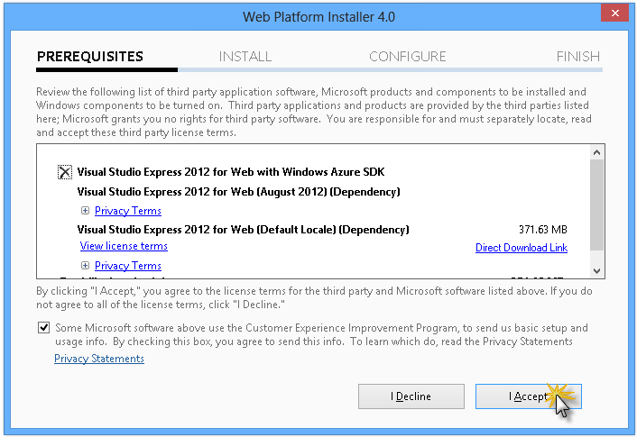

    *Accepting the license terms*
5. Wait until the downloading and installation process completes.

    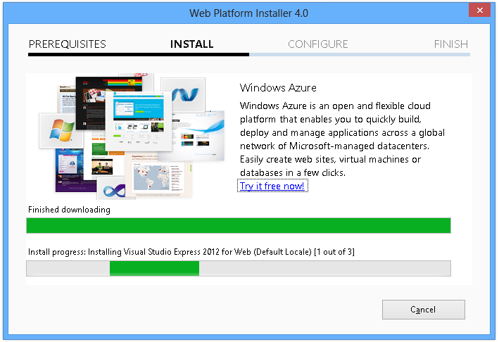

    *Installation progress*
6. When the installation completes, click **Finish**.

    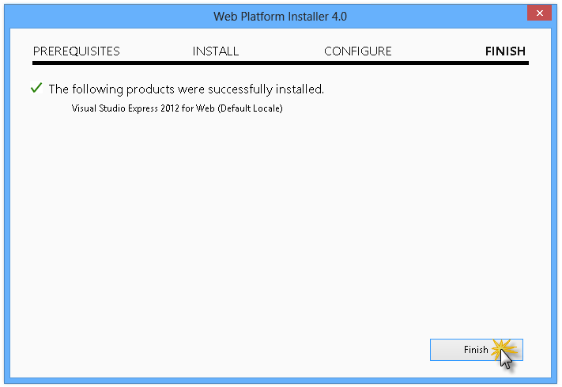

    *Installation completed*
7. Click **Exit** to close Web Platform Installer.
8. To open Visual Studio Express for Web, go to the **Start** screen and start writing &quot;**VS Express**&quot;, then click on the **VS Express for Web** tile.

    

    *VS Express for Web tile*

## Appendix B: Publishing an ASP.NET MVC 4 Application using Web Deploy

This appendix will show you how to create a new web site from the Windows Azure Management Portal and publish the application you obtained by following the lab, taking advantage of the Web Deploy publishing feature provided by Windows Azure.

#### Task 1 - Creating a New Web Site from the Windows Azure Portal

1. Go to the [Windows Azure Management Portal](https://manage.windowsazure.com/) and sign in using the Microsoft credentials associated with your subscription.

    > [!NOTE]
    > With Windows Azure you can host 10 ASP.NET Web Sites for free and then scale as your traffic grows. You can sign up [here](http://aka.ms/aspnet-hol-azure).

    

    *Log on to Windows Azure Management Portal*
2. Click **New** on the command bar.

    

    *Creating a new Web Site*
3. Click **Compute** | **Web Site**. Then select **Quick Create** option. Provide an available URL for the new web site and click **Create Web Site**.

    > [!NOTE]
    > A Windows Azure Web Site is the host for a web application running in the cloud that you can control and manage. The Quick Create option allows you to deploy a completed web application to the Windows Azure Web Site from outside the portal. It does not include steps for setting up a database.

    

    *Creating a new Web Site using Quick Create*
4. Wait until the new **Web Site** is created.
5. Once the Web Site is created click the link under the **URL** column. Check that the new Web Site is working.

    

    *Browsing to the new web site*

    

    *Web site running*
6. Go back to the portal and click the name of the web site under the **Name** column to display the management pages.

    

    *Opening the Web Site management pages*
7. In the **Dashboard** page, under the **quick glance** section, click the **Download publish profile** link.

    > [!NOTE]
    > The *publish profile* contains all of the information required to publish a web application to a Windows Azure website for each enabled publication method. The publish profile contains the URLs, user credentials and database strings required to connect to and authenticate against each of the endpoints for which a publication method is enabled. **Microsoft WebMatrix 2**, **Microsoft Visual Studio Express for Web** and **Microsoft Visual Studio 2012** support reading publish profiles to automate configuration of these programs for publishing web applications to Windows Azure websites.

    

    *Downloading the Web Site publish profile*
8. Download the publish profile file to a known location. Further in this exercise you will see how to use this file to publish a web application to a Windows Azure Web Sites from Visual Studio.

    

    *Saving the publish profile file*

#### Task 2 - Configuring the Database Server

If your application makes use of SQL Server databases you will need to create a SQL Database server. If you want to deploy a simple application that does not use SQL Server you might skip this task.

1. You will need a SQL Database server for storing the application database. You can view the SQL Database servers from your subscription in the Windows Azure Management portal at **Sql Databases** | **Servers** | **Server's Dashboard**. If you do not have a server created, you can create one using the **Add** button on the command bar. Take note of the **server name and URL, administrator login name and password**, as you will use them in the next tasks. Do not create the database yet, as it will be created in a later stage.

    

    *SQL Database Server Dashboard*
2. In the next task you will test the database connection from Visual Studio, for that reason you need to include your local IP address in the server's list of **Allowed IP Addresses**. To do that, click **Configure**, select the IP address from **Current Client IP Address** and paste it on the **Start IP Address** and **End IP Address** text boxes and click the  button.

    

    *Adding Client IP Address*
3. Once the **Client IP Address** is added to the allowed IP addresses list, click on **Save** to confirm the changes.

    

    *Confirm Changes*

#### Task 3 - Publishing an ASP.NET MVC 4 Application using Web Deploy

1. Go back to the ASP.NET MVC 4 solution. In the **Solution Explorer**, right-click the web site project and select **Publish**.

    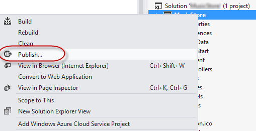

    *Publishing the web site*
2. Import the publish profile you saved in the first task.

    

    *Importing publish profile*
3. Click **Validate Connection**. Once Validation is complete click **Next**.

    > [!NOTE]
    > Validation is complete once you see a green checkmark appear next to the Validate Connection button.

    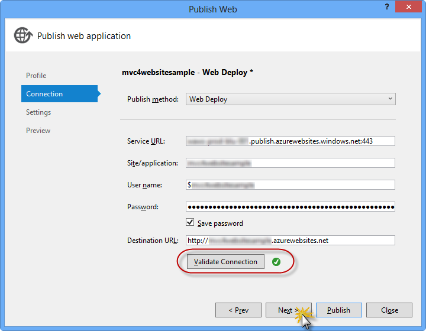

    *Validating connection*
4. In the **Settings** page, under the **Databases** section, click the button next to your database connection's textbox (i.e. **DefaultConnection**).

    

    *Web deploy configuration*
5. Configure the database connection as follows:

    - In the **Server name** type your SQL Database server URL using the *tcp:* prefix.
    - In **User name** type your server administrator login name.
    - In **Password** type your server administrator login password.
    - Type a new database name.

    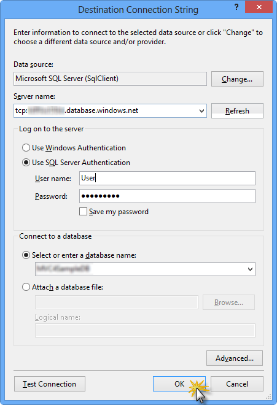

    *Configuring destination connection string*
6. Then click **OK**. When prompted to create the database click **Yes**.

    

    *Creating the database*
7. The connection string you will use to connect to SQL Database in Windows Azure is shown within Default Connection textbox. Then click **Next**.

    

    *Connection string pointing to SQL Database*
8. In the **Preview** page, click **Publish**.

    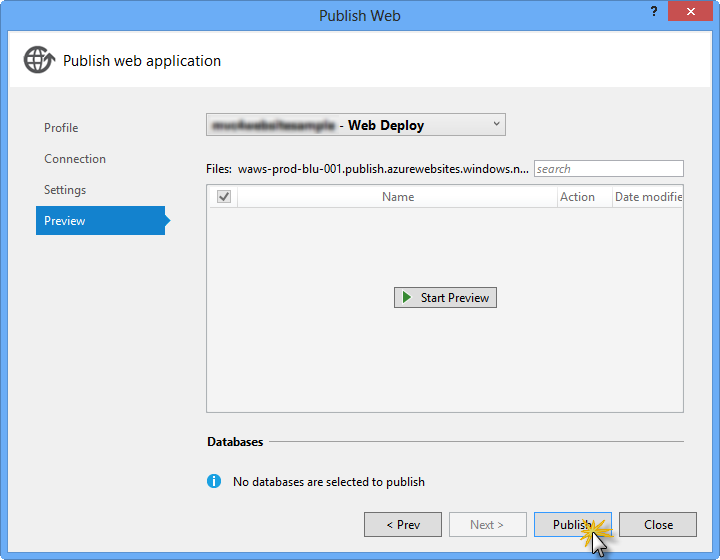

    *Publishing the web application*
9. Once the publishing process finishes, your default browser will open the published web site.

## Appendix C: Using Code Snippets

With code snippets, you have all the code you need at your fingertips. The lab document will tell you exactly when you can use them, as shown in the following figure.

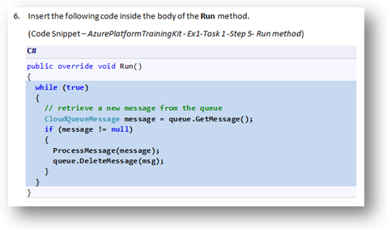

*Using Visual Studio code snippets to insert code into your project*

***To add a code snippet using the keyboard (C# only)***

1. Place the cursor where you would like to insert the code.
2. Start typing the snippet name (without spaces or hyphens).
3. Watch as IntelliSense displays matching snippets' names.
4. Select the correct snippet (or keep typing until the entire snippet's name is selected).
5. Press the Tab key twice to insert the snippet at the cursor location.

*Start typing the snippet name*

*Press Tab to select the highlighted snippet*

*Press Tab again and the snippet will expand*

***To add a code snippet using the mouse (C#, Visual Basic and XML)*** 1. Right-click where you want to insert the code snippet.

1. Select **Insert Snippet** followed by **My Code Snippets**.
2. Pick the relevant snippet from the list, by clicking on it.

*Right-click where you want to insert the code snippet and select Insert Snippet*

*Pick the relevant snippet from the list, by clicking on it*
