ASP.NET MVC 4 Dependency Injection
====================
by [Web Camps Team](https://twitter.com/webcamps)

> [!NOTE]
> This Hands-on Lab assumes you have basic knowledge of **ASP.NET MVC** and **ASP.NET MVC 4 filters**. If you have not used **ASP.NET MVC 4 filters** before, we recommend you to go over **ASP.NET MVC Custom Action Filters** Hands-on Lab.
> 
> All sample code and snippets are included in the Web Camps Training Kit, available at [https://www.microsoft.com/en-us/download/29843](https://www.microsoft.com/en-us/download/29843).

In **Object Oriented Programming** paradigm, objects work together in a collaboration model where there are contributors and consumers. Naturally, this communication model generates dependencies between objects and components, becoming difficult to manage when complexity increases.

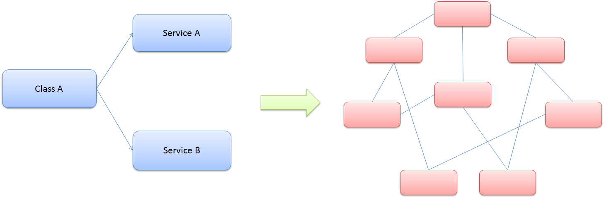

*Class dependencies and model complexity*

You have probably heard about the **Factory Pattern** and the separation between the interface and the implementation using services, where the client objects are often responsible for service location.

The Dependency Injection pattern is a particular implementation of Inversion of Control. **Inversion of Control (IoC)** means that objects do not create other objects on which they rely to do their work. Instead, they get the objects that they need from an outside source (for example, an xml configuration file).

**Dependency Injection (DI)** means that this is done without the object intervention, usually by a framework component that passes constructor parameters and set properties.

### The Dependency Injection (DI) Design Pattern

At a high level, the goal of Dependency Injection is that a client class (e.g. *the golfer*) needs something that satisfies an interface (e.g. *IClub*). It doesn't care what the concrete type is (e.g. *WoodClub, IronClub, WedgeClub* or *PutterClub*), it wants someone else to handle that (e.g. a good *caddy*). The Dependency Resolver in ASP.NET MVC can allow you to register your dependency logic somewhere else (e.g. a container or a *bag of clubs*).

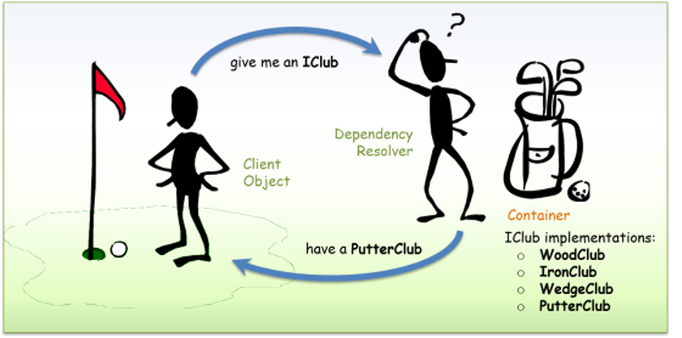

*Dependency Injection - Golf analogy*

The advantages of using Dependency Injection pattern and Inversion of Control are the following:

- Reduces class coupling
- Increases code reusing
- Improves code maintainability
- Improves application testing

> [!NOTE]
> Dependency Injection is sometimes compared with Abstract Factory Design Pattern, but there is a slight difference between both approaches. DI has a Framework working behind to solve dependencies by calling the factories and the registered services.

Now that you understand the Dependency Injection Pattern, you will learn throughout this lab how to apply it in ASP.NET MVC 4. You will start using Dependency Injection in the **Controllers** to include a database access service. Next, you will apply Dependency Injection to the **Views** to consume a service and show information. Finally, you will extend the DI to ASP.NET MVC 4 Filters, injecting a custom action filter in the solution.

In this Hands-on Lab, you will learn how to:

- Integrate ASP.NET MVC 4 with Unity for Dependency Injection using NuGet Packages
- Use Dependency Injection inside an ASP.NET MVC Controller
- Use Dependency Injection inside an ASP.NET MVC View
- Use Dependency Injection inside an ASP.NET MVC Action Filter

> [!NOTE]
> This Lab is using Unity.Mvc3 NuGet Package for dependency resolution, but it is possible to adapt any Dependency Injection Framework to work with ASP.NET MVC 4.

### Prerequisites

You must have the following items to complete this lab:

- [Microsoft Visual Studio Express 2012 for Web](https://www.microsoft.com/visualstudio/eng/products/visual-studio-express-for-web) or superior (read [Appendix A](#AppendixA) for instructions on how to install it).

### Setup

**Installing Code Snippets**

For convenience, much of the code you will be managing along this lab is available as Visual Studio code snippets. To install the code snippets run **.\Source\Setup\CodeSnippets.vsi** file.

If you are not familiar with the Visual Studio Code Snippets, and want to learn how to use them, you can refer to the appendix from this document &quot;[Appendix B: Using Code Snippets](#AppendixB)&quot;.

* * *

## Exercises

This Hands-On Lab is comprised by the following exercises:

1. [Exercise 1: Injecting a Controller](#Exercise1)
2. [Exercise 2: Injecting a View](#Exercise2)
3. [Exercise 3: Injecting Filters](#Exercise3)

> [!NOTE]
> Each exercise is accompanied by an **End** folder containing the resulting solution you should obtain after completing the exercises. You can use this solution as a guide if you need additional help working through the exercises.

Estimated time to complete this lab: **30 minutes**.

### Exercise 1: Injecting a Controller

In this exercise, you will learn how to use Dependency Injection in ASP.NET MVC Controllers by integrating Unity using a NuGet Package. For that reason, you will include services into your MvcMusicStore controllers to separate the logic from the data access. The services will create a new dependency in the controller constructor, which will be resolved using Dependency Injection with the help of **Unity**.

This approach will show you how to generate less coupled applications, which are more flexible and easier to maintain and test. You will also learn how to integrate ASP.NET MVC with Unity.

#### About StoreManager Service

The MVC Music Store provided in the begin solution now includes a service that manages the Store Controller data named **StoreService**. Below you will find the Store Service implementation. Note that all the methods return Model entities.

[!code-csharp[Main](aspnet-mvc-4-dependency-injection/samples/sample1.cs)]

**StoreController** from the begin solution now consumes **StoreService**. All the data references were removed from **StoreController**, and now possible to modify the current data access provider without changing any method that consumes **StoreService**.

You will find below that the **StoreController** implementation has a dependency with **StoreService** inside the class constructor.

> [!NOTE]
> The dependency introduced in this exercise is related to **Inversion of Control** (IoC).
> 
> The **StoreController** class constructor receives an **IStoreService** type parameter, which is essential to perform service calls from inside the class. However, **StoreController** does not implement the default constructor (with no parameters) that any controller must have to work with ASP.NET MVC.
> 
> To resolve the dependency, the controller has to be created by an abstract factory (a class that returns any object of the specified type).

[!code-csharp[Main](aspnet-mvc-4-dependency-injection/samples/sample2.cs)]

> [!NOTE]
> You will get an error when the class tries to create the StoreController without sending the service object, as there is no parameterless constructor declared.

#### Task 1 - Running the Application

In this task, you will run the Begin application, which includes the service into the Store Controller that separates the data access from the application logic.

When running the application, you will receive an exception, as the controller service is not passed as a parameter by default:

1. Open the **Begin** solution located in **Source\Ex01-Injecting Controller\Begin**.

    1. You will need to download some missing NuGet packages before continue. To do this, click the **Project** menu and select **Manage NuGet Packages**.
    2. In the **Manage NuGet Packages** dialog, click **Restore** in order to download missing packages.
    3. Finally, build the solution by clicking **Build** | **Build Solution**.

    > [!NOTE]
    > One of the advantages of using NuGet is that you don't have to ship all the libraries in your project, reducing the project size. With NuGet Power Tools, by specifying the package versions in the Packages.config file, you will be able to download all the required libraries the first time you run the project. This is why you will have to run these steps after you open an existing solution from this lab.
2. Press **Ctrl + F5** to run the application without debugging. You will get the error message &quot;**No parameterless constructor defined for this object**&quot;:

    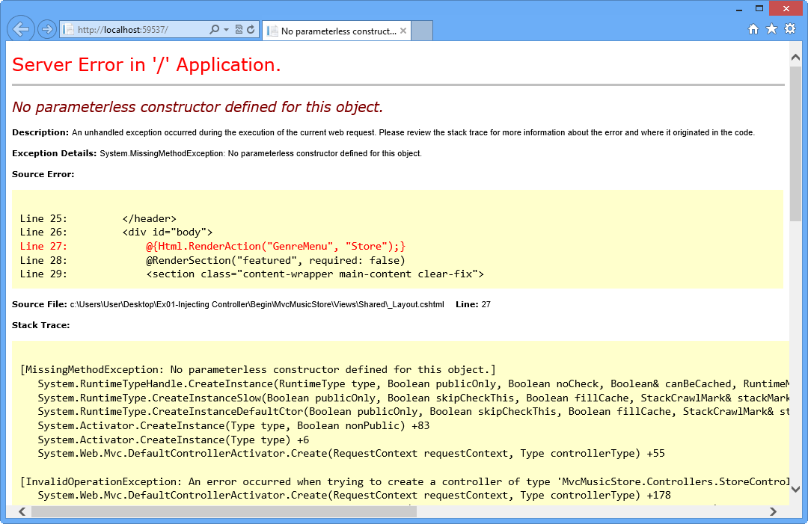

    *Error while running ASP.NET MVC Begin Application*
3. Close the browser.

In the following steps you will work on the Music Store Solution to inject the dependency this controller needs.

#### Task 2 - Including Unity into MvcMusicStore Solution

In this task, you will include **Unity.Mvc3** NuGet Package to the solution.

> [!NOTE]
> Unity.Mvc3 package was designed for ASP.NET MVC 3, but it is fully compatible with ASP.NET MVC 4.
> 
> Unity is a lightweight, extensible dependency injection container with optional support for instance and type interception. It is a general-purpose container for use in any type of .NET application. It provides all the common features found in dependency injection mechanisms including: object creation, abstraction of requirements by specifying dependencies at runtime and flexibility, by deferring the component configuration to the container.

1. Install **Unity.Mvc3** NuGet Package in the **MvcMusicStore** project. To do this, open the **Package Manager Console** from **View** | **Other Windows**.
2. Run the following command.

    PMC

    [!code-powershell[Main](aspnet-mvc-4-dependency-injection/samples/sample3.ps1)]

    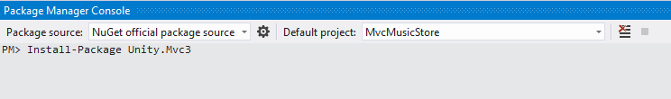

    *Installing Unity.Mvc3 NuGet Package*
3. Once the **Unity.Mvc3** package is installed, explore the files and folders it automatically adds in order to simplify Unity configuration.

    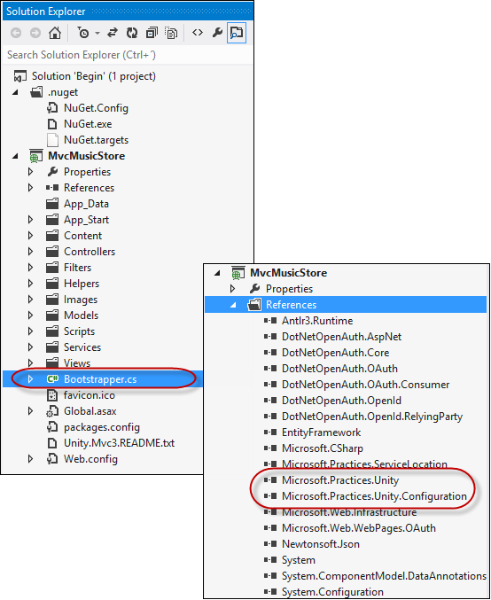

    *Unity.Mvc3 package installed*

#### Task 3 - Registering Unity in Global.asax.cs Application\_Start

In this task, you will update the **Application\_Start** method located in **Global.asax.cs** to call the Unity Bootstrapper initializer and then, update the Bootstrapper file registering the Service and Controller you will use for Dependency Injection.

1. Now, you will hook up the Bootstrapper which is the file that initializes the Unity container and Dependency Resolver. To do this, open **Global.asax.cs** and add the following highlighted code within the **Application\_Start** method.

    (Code Snippet - *ASP.NET Dependency Injection Lab - Ex01 - Initialize Unity*)

    [!code-csharp[Main](aspnet-mvc-4-dependency-injection/samples/sample4.cs)]
2. Open **Bootstrapper.cs** file.
3. Include the following namespaces: **MvcMusicStore.Services** and **MusicStore.Controllers**.

    (Code Snippet - *ASP.NET Dependency Injection Lab - Ex01 - Bootstrapper Adding Namespaces*)

    [!code-csharp[Main](aspnet-mvc-4-dependency-injection/samples/sample5.cs)]
4. Replace **BuildUnityContainer** method's content with the following code that registers Store Controller and Store Service.

    (Code Snippet - *ASP.NET Dependency Injection Lab - Ex01 - Register Store Controller and Service*)

    [!code-csharp[Main](aspnet-mvc-4-dependency-injection/samples/sample6.cs)]

#### Task 4 - Running the Application

In this task, you will run the application to verify that it can now be loaded after including Unity.

1. Press **F5** to run the application, the application should now load without showing any error message.

    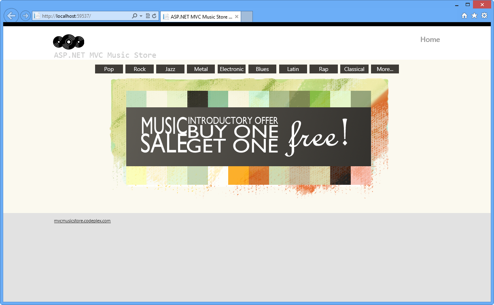

    *Running Application with Dependency Injection*
2. Browse to **/Store**. This will invoke **StoreController**, which is now created using **Unity**.

    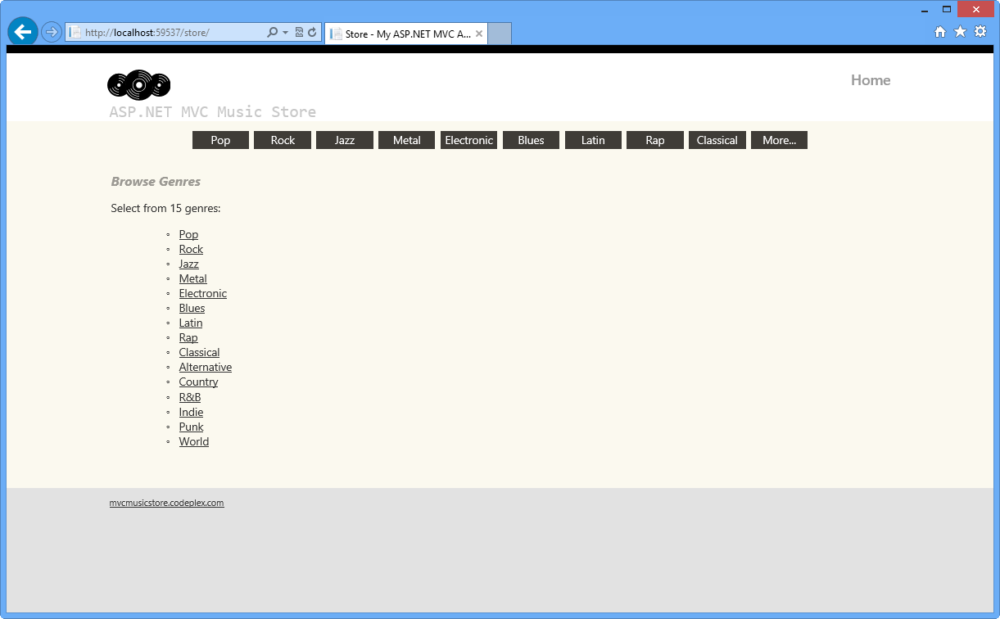

    *MVC Music Store*
3. Close the browser.

In the following exercises you will learn how to extend the Dependency Injection scope to use it inside ASP.NET MVC Views and Action Filters.

### Exercise 2: Injecting a View

In this exercise, you will learn how to use Dependency Injection in a view with the new features of ASP.NET MVC 4 for Unity integration. In order to do that, you will call a custom service inside the Store Browse View, which will show a message and an image below.

Then, you will integrate the project with Unity and create a custom dependency resolver to inject the dependencies.

#### Task 1 - Creating a View that Consumes a Service

In this task, you will create a view that performs a service call to generate a new dependency. The service consists in a simple messaging service included in this solution.

1. Open the **Begin** solution located in the **Source\Ex02-Injecting View\Begin** folder. Otherwise, you might continue using the **End** solution obtained by completing the previous exercise.

    1. If you opened the provided **Begin** solution, you will need to download some missing NuGet packages before continue. To do this, click the **Project** menu and select **Manage NuGet Packages**.
    2. In the **Manage NuGet Packages** dialog, click **Restore** in order to download missing packages.
    3. Finally, build the solution by clicking **Build** | **Build Solution**.

    > [!NOTE]
    > One of the advantages of using NuGet is that you don't have to ship all the libraries in your project, reducing the project size. With NuGet Power Tools, by specifying the package versions in the Packages.config file, you will be able to download all the required libraries the first time you run the project. This is why you will have to run these steps after you open an existing solution from this lab.
    > 
    > For more information, see this article: [http://docs.nuget.org/docs/workflows/using-nuget-without-committing-packages](http://docs.nuget.org/docs/workflows/using-nuget-without-committing-packages).
2. Include the **MessageService.cs** and the **IMessageService.cs** classes located in the **Source \Assets** folder in **/Services**. To do this, right-click **Services** folder and select **Add Existing Item**. Browse to the files' location and include them.

    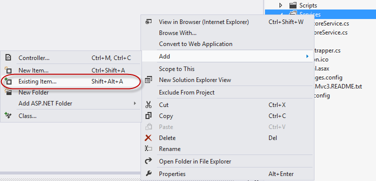

    *Adding Message Service and Service Interface*

    > [!NOTE]
    > The **IMessageService** interface defines two properties implemented by the **MessageService** class. These properties -**Message** and **ImageUrl**- store the message and the URL of the image to be displayed.
3. Create the folder **/Pages** in the project's root folder, and then add the existing class **MyBasePage.cs** from **Source\Assets**. The base page you will inherit from has the following structure.

    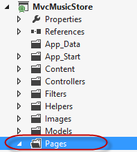

    [!code-csharp[Main](aspnet-mvc-4-dependency-injection/samples/sample7.cs)]
4. Open **Browse.cshtml** view from **/Views/Store** folder, and make it inherit from **MyBasePage.cs**.

    [!code-cshtml[Main](aspnet-mvc-4-dependency-injection/samples/sample8.cshtml)]
5. In the **Browse** view, add a call to **MessageService** to display an image and a message retrieved by the service.
(C#)

    [!code-cshtml[Main](aspnet-mvc-4-dependency-injection/samples/sample9.cshtml)]

#### Task 2 - Including a Custom Dependency Resolver and a Custom View Page Activator

In the previous task, you injected a new dependency inside a view to perform a service call inside it. Now, you will resolve that dependency by implementing the ASP.NET MVC Dependency Injection interfaces **IViewPageActivator** and **IDependencyResolver**. You will include in the solution an implementation of **IDependencyResolver** that will deal with the service retrieval by using Unity. Then, you will include another custom implementation of **IViewPageActivator** interface that will solve the creation of the views.

> [!NOTE]
> Since ASP.NET MVC 3, the implementation for Dependency Injection had simplified the interfaces to register services. **IDependencyResolver** and **IViewPageActivator** are part of ASP.NET MVC 3 features for Dependency Injection.
> 
> **- IDependencyResolver** interface replaces the previous IMvcServiceLocator. Implementers of IDependencyResolver must return an instance of the service or a service collection.
>
> 
> [!code-csharp[Main](aspnet-mvc-4-dependency-injection/samples/sample10.cs)]
> 
> **- IViewPageActivator** interface provides more fine-grained control over how view pages are instantiated via dependency injection. The classes that implement **IViewPageActivator** interface can create view instances using context information.
> 
> 
> [!code-csharp[Main](aspnet-mvc-4-dependency-injection/samples/sample11.cs)]

1. Create the /**Factories** folder in the project's root folder.
2. Include **CustomViewPageActivator.cs** to your solution from **/Sources/Assets/** to **Factories** folder. To do that, right-click the **/Factories** folder, select **Add | Existing Item** and then select **CustomViewPageActivator.cs**. This class implements the **IViewPageActivator** interface to hold the Unity Container.

    [!code-csharp[Main](aspnet-mvc-4-dependency-injection/samples/sample12.cs)]

    > [!NOTE]
    > **CustomViewPageActivator** is responsible for managing the creation of a view by using a Unity container.
3. Include **UnityDependencyResolver.cs** file from **/Sources/Assets** to **/Factories** folder. To do that, right-click the **/Factories** folder, select **Add | Existing Item** and then select **UnityDependencyResolver.cs** file.

    [!code-csharp[Main](aspnet-mvc-4-dependency-injection/samples/sample13.cs)]

    > [!NOTE]
    > **UnityDependencyResolver** class is a custom DependencyResolver for Unity. When a service cannot be found inside the Unity container, the base resolver is invocated.

In the following task both implementations will be registered to let the model know the location of the services and the views.

#### Task 3 - Registering for Dependency Injection within Unity container

In this task, you will put all the previous things together to make Dependency Injection work.

Up to now your solution has the following elements:

- A **Browse** View that inherits from **MyBaseClass** and consumes **MessageService**.
- An intermediate class -**MyBaseClass**- that has dependency injection declared for the service interface.
- A service - **MessageService** - and its interface **IMessageService**.
- A custom dependency resolver for Unity - **UnityDependencyResolver** - that deals with service retrieval.
- A View Page activator - **CustomViewPageActivator** - that creates the page.

To inject **Browse** View, you will now register the custom dependency resolver in the Unity container.

1. Open **Bootstrapper.cs** file.
2. Register an instance of **MessageService** into the Unity container to initialize the service:

    (Code Snippet - *ASP.NET Dependency Injection Lab - Ex02 - Register Message Service*)

    [!code-csharp[Main](aspnet-mvc-4-dependency-injection/samples/sample14.cs)]
3. Add a reference to **MvcMusicStore.Factories** namespace.

    (Code Snippet - *ASP.NET Dependency Injection Lab - Ex02 - Factories Namespace*)

    [!code-csharp[Main](aspnet-mvc-4-dependency-injection/samples/sample15.cs)]
4. Register **CustomViewPageActivator** as a View Page activator into the Unity container:

    (Code Snippet - *ASP.NET Dependency Injection Lab - Ex02 - Register CustomViewPageActivator*)

    [!code-csharp[Main](aspnet-mvc-4-dependency-injection/samples/sample16.cs)]
5. Replace ASP.NET MVC 4 default dependency resolver with an instance of **UnityDependencyResolver**. To do this, replace **Initialise** method content with the following code:

    (Code Snippet - *ASP.NET Dependency Injection Lab - Ex02 - Update Dependency Resolver*)

    [!code-csharp[Main](aspnet-mvc-4-dependency-injection/samples/sample17.cs)]

    > [!NOTE]
    > ASP.NET MVC provides a default dependency resolver class. To work with custom dependency resolvers as the one we have created for unity, this resolver has to be replaced.

#### Task 4 - Running the Application

In this task, you will run the application to verify that the Store Browser consumes the service and shows the image and the message retrieved:

1. Press **F5** to run the application.
2. Click **Rock** within the Genres Menu and see how the **MessageService** was injected to the view and loaded the welcome message and the image. In this example, we are entering to &quot;**Rock**&quot;:

    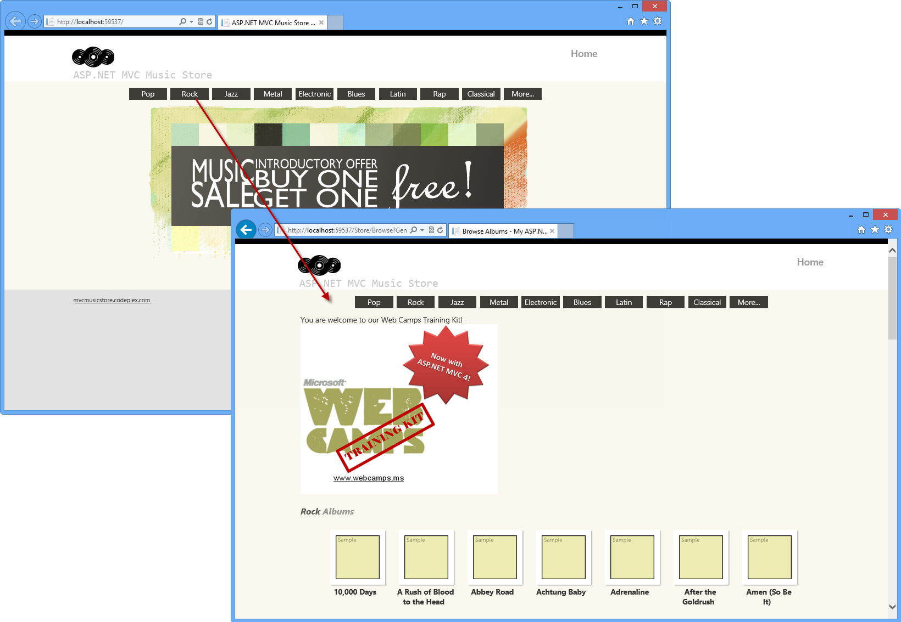

    *MVC Music Store - View Injection*
3. Close the browser.

### Exercise 3: Injecting Action Filters

In the previous Hands-On lab **Custom Action Filters** you have worked with filters customization and injection. In this exercise, you will learn how to inject filters with Dependency Injection by using the Unity container. To do that, you will add to the Music Store solution a custom action filter that will trace the activity of the site.

#### Task 1 - Including the Tracking Filter in the Solution

In this task, you will include in the Music Store a custom action filter to trace events. As custom action filter concepts are already treated in the previous Lab &quot;Custom Action Filters&quot;, you will just include the filter class from the Assets folder of this lab, and then create a Filter Provider for Unity:

1. Open the **Begin** solution located in the **Source\Ex03 - Injecting Action Filter\Begin** folder. Otherwise, you might continue using the **End** solution obtained by completing the previous exercise.

    1. If you opened the provided **Begin** solution, you will need to download some missing NuGet packages before continue. To do this, click the **Project** menu and select **Manage NuGet Packages**.
    2. In the **Manage NuGet Packages** dialog, click **Restore** in order to download missing packages.
    3. Finally, build the solution by clicking **Build** | **Build Solution**.

    > [!NOTE]
    > One of the advantages of using NuGet is that you don't have to ship all the libraries in your project, reducing the project size. With NuGet Power Tools, by specifying the package versions in the Packages.config file, you will be able to download all the required libraries the first time you run the project. This is why you will have to run these steps after you open an existing solution from this lab.
    > 
    > For more information, see this article: [http://docs.nuget.org/docs/workflows/using-nuget-without-committing-packages](http://docs.nuget.org/docs/workflows/using-nuget-without-committing-packages).
2. Include **TraceActionFilter.cs** file from **/Sources/Assets** to **/Filters** folder.

    [!code-csharp[Main](aspnet-mvc-4-dependency-injection/samples/sample18.cs)]

    > [!NOTE]
    > This custom action filter performs ASP.NET tracing. You can check &quot;ASP.NET MVC 4 local and Dynamic Action Filters&quot; Lab for more reference.
3. Add the empty class **FilterProvider.cs** to the project in the folder **/Filters.**
4. Add the **System.Web.Mvc** and **Microsoft.Practices.Unity** namespaces in **FilterProvider.cs**.

    (Code Snippet - *ASP.NET Dependency Injection Lab - Ex03 - Filter Provider Adding Namespaces*)

    [!code-csharp[Main](aspnet-mvc-4-dependency-injection/samples/sample19.cs)]
5. Make the class inherit from **IFilterProvider** Interface.

    [!code-csharp[Main](aspnet-mvc-4-dependency-injection/samples/sample20.cs)]
6. Add a **IUnityContainer** property in the **FilterProvider** class, and then create a class constructor to assign the container.

    (Code Snippet - *ASP.NET Dependency Injection Lab - Ex03 - Filter Provider Constructor*)

    [!code-csharp[Main](aspnet-mvc-4-dependency-injection/samples/sample21.cs)]

    > [!NOTE]
    > The filter provider class constructor is not creating a **new** object inside. The container is passed as a parameter, and the dependency is solved by Unity.
7. In the **FilterProvider** class, implement the method **GetFilters** from **IFilterProvider** interface.

    (Code Snippet - *ASP.NET Dependency Injection Lab - Ex03 - Filter Provider GetFilters*)

    [!code-csharp[Main](aspnet-mvc-4-dependency-injection/samples/sample22.cs)]

#### Task 2 - Registering and Enabling the Filter

In this task, you will enable site tracking. To do that, you will register the filter in **Bootstrapper.cs BuildUnityContainer** method to start tracing:

1. Open **Web.config** located in the project root and enable trace tracking at System.Web group.

    [!code-xml[Main](aspnet-mvc-4-dependency-injection/samples/sample23.xml)]
2. Open **Bootstrapper.cs** at project root.
3. Add a reference to the **MvcMusicStore.Filters** namespace.

    (Code Snippet - *ASP.NET Dependency Injection Lab - Ex03 - Bootstrapper Adding Namespaces*)

    [!code-csharp[Main](aspnet-mvc-4-dependency-injection/samples/sample24.cs)]
4. Select the **BuildUnityContainer** method and register the filter in the Unity Container. You will have to register the filter provider as well as the action filter.

    (Code Snippet - *ASP.NET Dependency Injection Lab - Ex03 - Register FilterProvider and ActionFilter*)

    [!code-csharp[Main](aspnet-mvc-4-dependency-injection/samples/sample25.cs)]

#### Task 3 - Running the Application

In this task, you will run the application and test that the custom action filter is tracing the activity:

1. Press **F5** to run the application.
2. Click **Rock** within the Genres Menu. You can browse to more genres if you want to.

    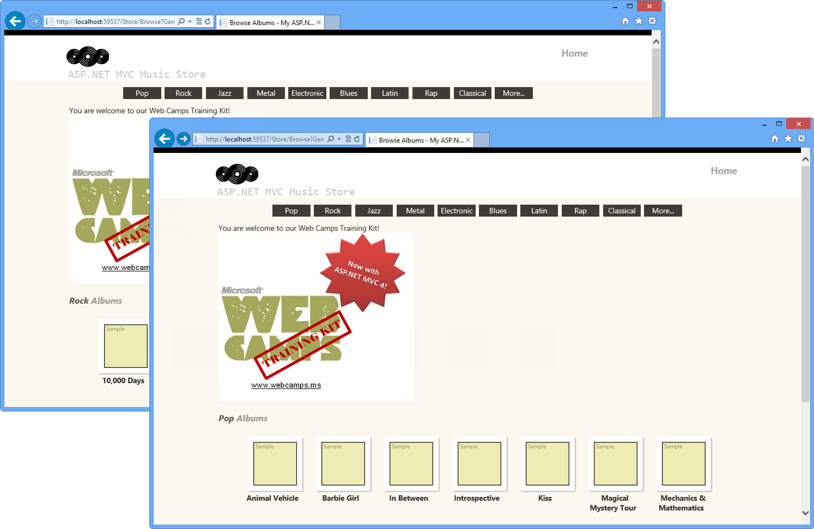

    *Music Store*
3. Browse to **/Trace.axd** to see the Application Trace page, and then click **View Details**.

    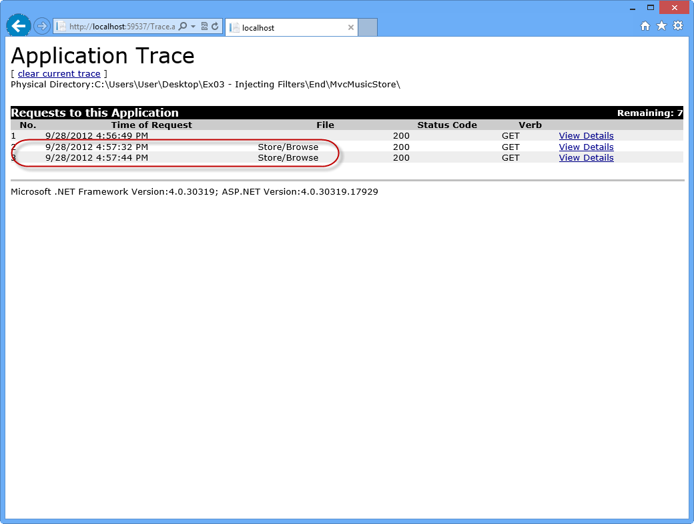

    *Application Trace Log*

    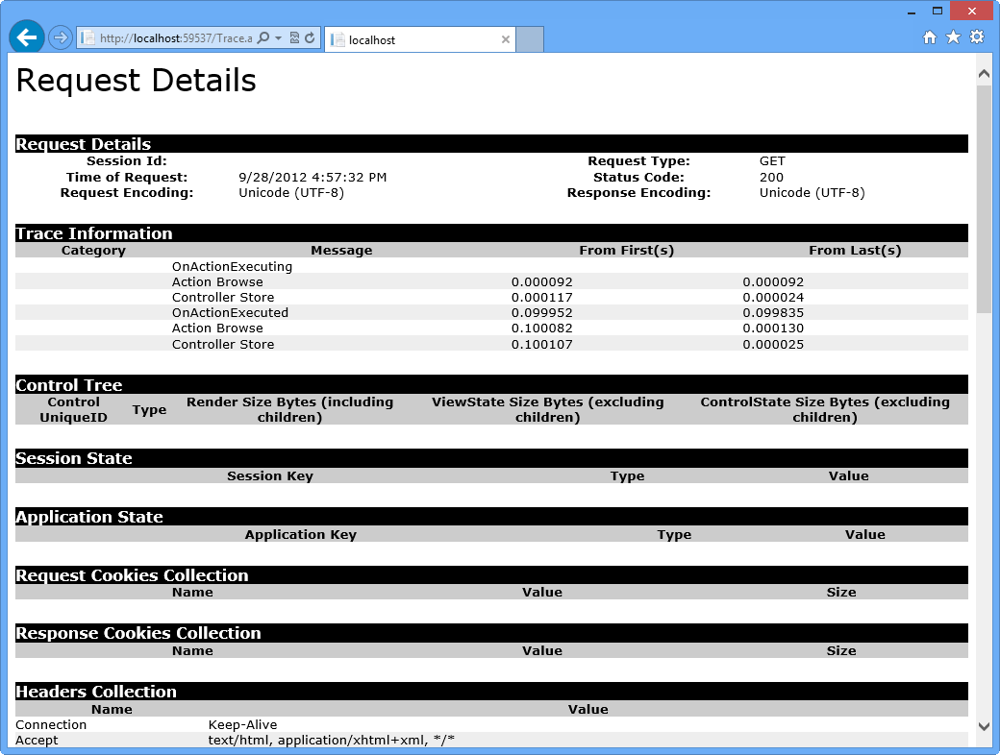

    *Application Trace - Request Details*
4. Close the browser.

* * *

## Summary

By completing this Hands-On Lab you have learned how to use Dependency Injection in ASP.NET MVC 4 by integrating Unity using a NuGet Package. To achieve that, you have used Dependency Injection inside controllers, views and action filters.

The following concepts were covered:

- ASP.NET MVC 4 Dependency Injection features
- Unity integration using Unity.Mvc3 NuGet Package
- Dependency Injection in Controllers
- Dependency Injection in Views
- Dependency injection of Action Filters

## Appendix A: Installing Visual Studio Express 2012 for Web

You can install **Microsoft Visual Studio Express 2012 for Web** or another &quot;Express&quot; version using the **[Microsoft Web Platform Installer](https://www.microsoft.com/web/downloads/platform.aspx)**. The following instructions guide you through the steps required to install *Visual studio Express 2012 for Web* using *Microsoft Web Platform Installer*.

1. Go to [[https://go.microsoft.com/? linkid=9810169](https://go.microsoft.com/?linkid=9810169)](https://go.microsoft.com/?linkid=9810169). Alternatively, if you already have installed Web Platform Installer, you can open it and search for the product &quot;*Visual Studio Express 2012 for Web with Windows Azure SDK*&quot;.
2. Click on **Install Now**. If you do not have **Web Platform Installer** you will be redirected to download and install it first.
3. Once **Web Platform Installer** is open, click **Install** to start the setup.

    

    *Install Visual Studio Express*
4. Read all the products' licenses and terms and click **I Accept** to continue.

    

    *Accepting the license terms*
5. Wait until the downloading and installation process completes.

    

    *Installation progress*
6. When the installation completes, click **Finish**.

    

    *Installation completed*
7. Click **Exit** to close Web Platform Installer.
8. To open Visual Studio Express for Web, go to the **Start** screen and start writing &quot;**VS Express**&quot;, then click on the **VS Express for Web** tile.

    

    *VS Express for Web tile*

## Appendix B: Using Code Snippets

With code snippets, you have all the code you need at your fingertips. The lab document will tell you exactly when you can use them, as shown in the following figure.

*Using Visual Studio code snippets to insert code into your project*

***To add a code snippet using the keyboard (C# only)***

1. Place the cursor where you would like to insert the code.
2. Start typing the snippet name (without spaces or hyphens).
3. Watch as IntelliSense displays matching snippets' names.
4. Select the correct snippet (or keep typing until the entire snippet's name is selected).
5. Press the Tab key twice to insert the snippet at the cursor location.

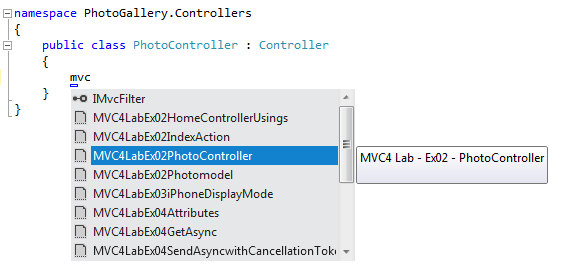

*Start typing the snippet name*

*Press Tab to select the highlighted snippet*

*Press Tab again and the snippet will expand*

***To add a code snippet using the mouse (C#, Visual Basic and XML)*** 1. Right-click where you want to insert the code snippet.

1. Select **Insert Snippet** followed by **My Code Snippets**.
2. Pick the relevant snippet from the list, by clicking on it.

*Right-click where you want to insert the code snippet and select Insert Snippet*

*Pick the relevant snippet from the list, by clicking on it*