ASP.NET MVC 4 Fundamentals
====================
by [Web Camps Team](https://twitter.com/webcamps)

> This Hands-On Lab is based on MVC (Model View Controller) Music Store, a tutorial application that introduces and explains step-by-step how to use ASP.NET MVC and Visual Studio. Throughout the lab you will learn the simplicity, yet power of using these technologies together. You will start with a simple application and will build it until you have a fully functional ASP.NET MVC 4 Web Application.
> 
> This Lab works with ASP.NET MVC 4.
> 
> If you wish to explore the ASP.NET MVC 3 version of the tutorial application, you can find it in [[http://mvcmusicstore.codeplex.com/](http://mvcmusicstore.codeplex.com/)](http://mvcmusicstore.codeplex.com/).
> 
> > [!NOTE]
> > This Hands-On Lab assumes that the developer has experience in Web development technologies, such as HTML and JavaScript.
> 
> 
> All sample code and snippets are included in the Web Camps Training Kit, available at [https://www.microsoft.com/en-us/download/29843](https://www.microsoft.com/en-us/download/29843).

### The Music Store application

The Music Store web application that will be built throughout this Lab comprises three main parts: shopping, checkout, and administration. Visitors will be able to browse albums by genre, add albums to their cart, review their selection and finally proceed to checkout to login and complete the order. Additionally, store administrators will be able to manage the available albums as well as their main properties.

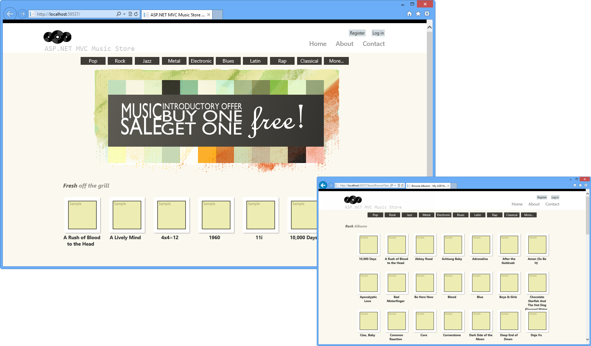

*Music Store screens*

### ASP.NET MVC 4 Essentials

Music Store application will be built using **Model View Controller (MVC)**, an architectural pattern that separates an application into three main components:

- **Models**: Model objects are the parts of the application that implement the domain logic. Often, model objects also retrieve and store model state in a database.
- **Views:** Views are the components that display the application's user interface (UI). Typically, this UI is created from the model data. An example would be the edit view of Albums that displays text boxes and a drop-down list based on the current state of an Album object.
- **Controllers:** Controllers are the components that handle user interaction, manipulate the model, and ultimately select a view to render the UI. In an MVC application, the view only displays information; the controller handles and responds to user input and interaction.

The MVC pattern helps you to create applications that separate the different aspects of the application (input logic, business logic, and UI logic), while providing a loose coupling between these elements. This separation helps you manage complexity when you build an application, as it allows you to focus on one aspect of the implementation at a time. In addition, the MVC pattern makes it easy to test applications, also encouraging the use of test-driven development (TDD) for creating applications.

The **ASP.NET MVC** framework provides an alternative to the ASP.NET Web Forms pattern for creating ASP.NET MVC-based Web applications. The **ASP.NET MVC** framework is a lightweight, highly testable presentation framework that (as with Web-forms-based applications) is integrated with existing ASP.NET features, such as master pages and membership-based authentication so you get all the power of the core .NET framework. This is useful if you are already familiar with ASP.NET Web Forms because all the libraries that you already use are available in ASP.NET MVC 4 as well.

In addition, the loose coupling between the three main components of an MVC application also promotes parallel development. For instance, one developer can work on the view, a second developer can work on the controller logic, and a third developer can focus on the business logic in the model.

### Objectives

In this Hands-On Lab, you will learn how to:

- Create an ASP.NET MVC application from scratch based on the Music Store Application tutorial
- Add Controllers to handle URLs to the Home page of the site and for browsing its main functionality
- Add a View to customize the content displayed along with its style
- Add Model classes to contain and manage data and domain logic
- Use View Model pattern to pass information from controller actions to the view templates
- Explore the ASP.NET MVC 4 new template for internet applications

### Prerequisites

You must have the following items to complete this lab:

- [Visual Studio 2012 Express for Web](https://www.microsoft.com/visualstudio/eng/products/visual-studio-express-for-web) (read [Appendix A](#AppendixA) for instructions on how to install it)

### Setup

**Installing Code Snippets**

For convenience, much of the code you will be managing along this lab is available as Visual Studio code snippets. To install the code snippets run **.\Source\Setup\CodeSnippets.vsi** file.

If you are not familiar with the Visual Studio Code Snippets, and want to learn how to use them, you can refer to the appendix from this document &quot;[Appendix C: Using Code Snippets](#AppendixC)&quot;.

## Exercises

This Hands-On Lab is comprised by the following exercises:

1. [Exercise 1: Creating MusicStore ASP.NET MVC Web Application Project](#Exercise1)
2. [Exercise 2: Creating a Controller](#Exercise2)
3. [Exercise 3: Passing parameters to a Controller](#Exercise3)
4. [Exercise 4: Creating a View](#Exercise4)
5. [Exercise 5: Creating a View Model](#Exercise5)
6. [Exercise 6: Using parameters in View](#Exercise6)
7. [Exercise 7: A lap around ASP.NET MVC 4 New Template](#Exercise7)

> [!NOTE]
> Each exercise is accompanied by an **End** folder containing the resulting solution you should obtain after completing the exercises. You can use this solution as a guide if you need additional help working through the exercises.

Estimated time to complete this lab: **60 minutes**.

### Exercise 1: Creating MusicStore ASP.NET MVC Web Application Project

In this exercise, you will learn how to create an ASP.NET MVC application in Visual Studio 2012 Express for Web as well as its main folder organization. Additionally, you will learn how to add a new Controller and make it display a simple string in the application's home page.

#### Task 1 - Creating the ASP.NET MVC Web Application Project

1. In this task, you will create an empty ASP.NET MVC application project using the MVC Visual Studio template. Start **VS Express for Web**.
2. On the **File** menu, click **New Project**.
3. In the **New Project** dialog box select the **ASP.NET MVC 4 Web Application** project type, located under **Visual C#,** **Web** template list.
4. Change the **Name** to *MvcMusicStore*.
5. Set the location of the solution inside a new **Begin** folder in this Exercise's Source folder, for example **[YOUR-HOL-PATH]\Source\Ex01-CreatingMusicStoreProject\Begin**. Click **OK**.

    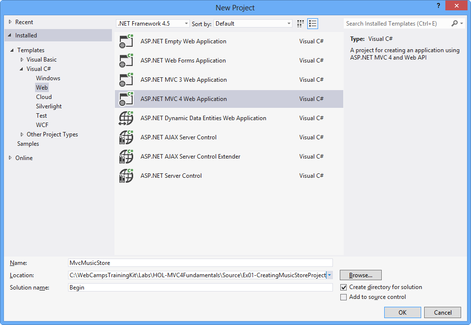

    *Create New Project Dialog Box*
6. In the **New ASP.NET MVC 4 Project** dialog box select the **Basic** template and make sure that the **View engine** selected is **Razor**. Click **OK**.

    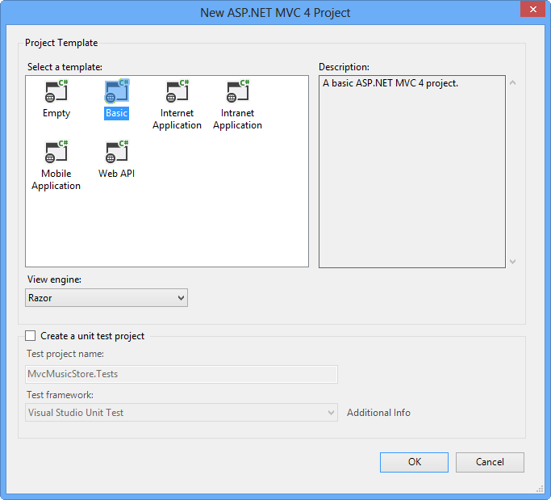

    *New ASP.NET MVC 4 Project Dialog Box*

#### Task 2 - Exploring the Solution Structure

The ASP.NET MVC framework includes a Visual Studio project template that helps you create Web applications supporting the MVC pattern. This template creates a new ASP.NET MVC Web application with the required folders, item templates, and configuration-file entries.

In this task, you will examine the solution structure to understand the elements that are involved and their relationships. The following folders are included in all the ASP.NET MVC application because the ASP.NET MVC framework by default uses a &quot;convention over configuration&quot; approach, and makes some default assumptions based on folder naming conventions.

1. Once the project is created, review the folder structure that has been created in the Solution Explorer on the right side:

    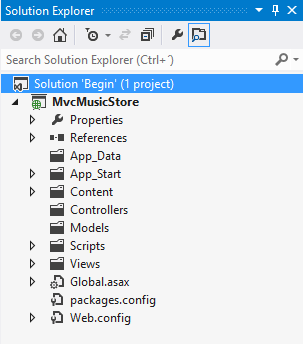

    *ASP.NET MVC Folder structure in Solution Explorer*

    1. **Controllers**. This folder will contain the controller classes. In an MVC based application, controllers are responsible for handling end user interaction, manipulating the model, and ultimately choosing a view to render the UI.

        > [!NOTE]
        > The MVC framework requires the names of all controllers to end with &quot;Controller&quot;-for example, HomeController, LoginController, or ProductController.
    2. **Models**. This folder is provided for classes that represent the application model for the MVC Web application. This usually includes code that defines objects and the logic for interacting with the data store. Typically, the actual model objects will be in separate class libraries. However, when you create a new application, you might include classes and then move them into separate class libraries at a later point in the development cycle.
    3. **Views**. This folder is the recommended location for views, the components responsible for displaying the application's user interface. Views use .aspx, .ascx, .cshtml and .master files, in addition to any other files that are related to rendering views. Views folder contains a folder for each controller; the folder is named with the controller-name prefix. For example, if you have a controller named **HomeController**, the Views folder will contain a folder named Home. By default, when the ASP.NET MVC framework loads a view, it looks for an .aspx file with the requested view name in the Views\controllerName folder (**Views[ControllerName][Action].aspx**) or (**Views[ControllerName][Action].cshtml**) for Razor Views.

    > [!NOTE]
    > In addition to the folders listed previously, an MVC Web application uses the **Global.asax** file to set global URL routing defaults, and it uses the **Web.config** file to configure the application.

#### Task 3 - Adding a HomeController

In ASP.NET applications that do not use the MVC framework, user interaction is organized around pages, and around raising and handling events from those pages. In contrast, user interaction with ASP.NET MVC applications is organized around controllers and their action methods.

On the other hand, ASP.NET MVC framework maps URLs to classes that are referred to as controllers. Controllers process incoming requests, handle user input and interactions, execute appropriate application logic and determine the response to send back to the client (display HTML, download a file, redirect to a different URL, etc.). In the case of displaying HTML, a controller class typically calls a separate view component to generate the HTML markup for the request. In an MVC application, the view only displays information; the controller handles and responds to user input and interaction.

In this task, you will add a Controller class that will handle URLs to the Home page of the Music Store site.

1. Right-click **Controllers** folder within the Solution Explorer, select **Add** and then **Controller** command:

    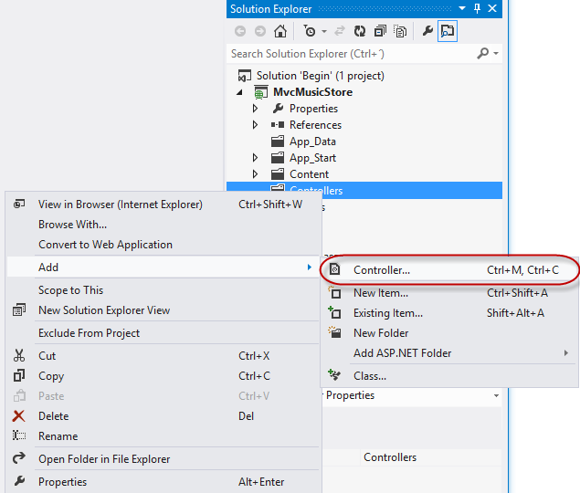

    *Add Controller Command*
2. The **Add Controller** dialog appears. Name the controller *HomeController* and press **Add**.

    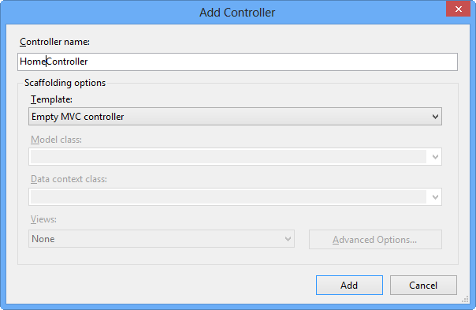

    *Add Controller Dialog*
3. The file **HomeController.cs** is created in the **Controllers** folder. In order to have the **HomeController** return a string on its Index action, replace the **Index** method with the following code:

    (Code Snippet - *ASP.NET MVC 4 Fundamentals - Ex1 HomeController Index*)

    [!code-csharp[Main](aspnet-mvc-4-fundamentals/samples/sample1.cs)]

#### Task 4 - Running the Application

In this task, you will try out the Application in a web browser.

1. Press **F5** to run the Application. The project is compiled and the local IIS Web Server starts. The local IIS Web Server will automatically open a web browser pointing to the URL of the Web server.

    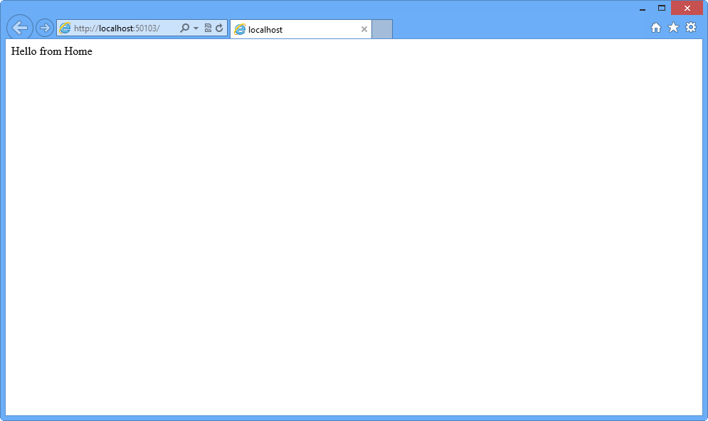

    *Application running in a web browser*

    > [!NOTE]
    > The local IIS Web Server will run the website on a random free port number. In the figure above, the site is running at `http://localhost:50103/`, so it's using port 50103. Your port number may vary.
2. Close the browser.

### Exercise 2: Creating a Controller

In this exercise, you will learn how to update the controller to implement simple functionality of the Music Store application. That controller will define action methods to handle each of the following specific requests:

- A listing page of the music genres in the Music Store
- A browse page that lists all of the music albums for a particular genre
- A details page that shows information about a specific music album

For the scope of this exercise, those actions will simply return a string by now.

#### Task 1 - Adding a New StoreController Class

In this task, you will add a new Controller.

1. If not already open, start **VS Express for Web 2012**.
2. In the **File** menu, choose **Open Project**. In the Open Project dialog, browse to **Source\Ex02-CreatingAController\Begin**, select **Begin.sln** and click **Open**. Alternatively, you may continue with the solution that you obtained after completing the previous exercise.

    1. If you opened the provided **Begin** solution, you will need to download some missing NuGet packages before continue. To do this, click the **Project** menu and select **Manage NuGet Packages**.
    2. In the **Manage NuGet Packages** dialog, click **Restore** in order to download missing packages.
    3. Finally, build the solution by clicking **Build** | **Build Solution**.

    > [!NOTE]
    > One of the advantages of using NuGet is that you don't have to ship all the libraries in your project, reducing the project size. With NuGet Power Tools, by specifying the package versions in the Packages.config file, you will be able to download all the required libraries the first time you run the project. This is why you will have to run these steps after you open an existing solution from this lab.
3. Add the new controller. To do this, right-click the **Controllers** folder within the Solution Explorer, select **Add** and then the **Controller** command. Change the **Controller Name** to *StoreController*, and click **Add**.

    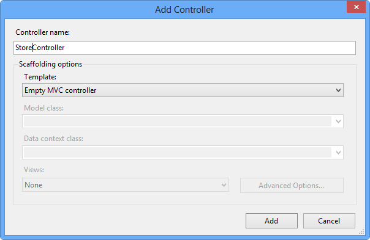

    *Add Controller Dialog*

#### Task 2 - Modifying the StoreController's Actions

In this task, you will modify the Controller methods that are called **actions**. Actions are responsible for handling URL requests and determining the content that should be sent back to the browser or user that invoked the URL.

1. The **StoreController** class already has an **Index** method. You will use it later in this Lab to implement the page that lists all genres of the music store. For now, just replace the **Index** method with the following code that returns a string &quot;Hello from Store.Index()&quot;:

    (Code Snippet - *ASP.NET MVC 4 Fundamentals - Ex2 StoreController Index*)

    [!code-csharp[Main](aspnet-mvc-4-fundamentals/samples/sample2.cs)]
2. Add **Browse** and **Details** methods. To do this, add the following code to the **StoreController**:

    (Code Snippet - *ASP.NET MVC 4 Fundamentals - Ex2 StoreController BrowseAndDetails*)

    [!code-csharp[Main](aspnet-mvc-4-fundamentals/samples/sample3.cs)]

#### Task 3 - Running the Application

In this task, you will try out the Application in a web browser.

1. Press **F5** to run the Application.
2. The project starts in the **Home** page. Change the URL to verify each action's implementation.

    1. **/Store**. You will see **&quot;Hello from Store.Index()&quot;**.
    2. **/Store/Browse**. You will see **&quot;Hello from Store.Browse()&quot;**.
    3. **/Store/Details**. You will see **&quot;Hello from Store.Details()&quot;**.

        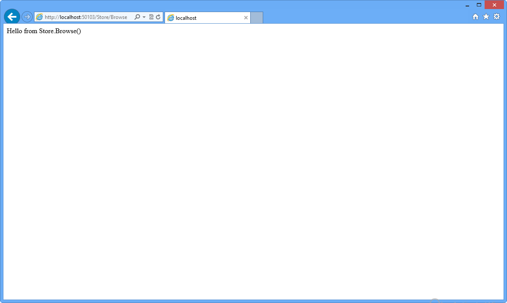

        *Browsing /Store/Browse*
3. Close the browser.

### Exercise 3: Passing parameters to a Controller

Until now, you have been returning constant strings from the Controllers. In this exercise you will learn how to pass parameters to a Controller using the URL and querystring, and then making the method actions respond with text to the browser.

#### Task 1 - Adding Genre Parameter to StoreController

In this task, you will use the **querystring** to send parameters to the **Browse** action method in the **StoreController**.

1. If not already open, start **VS Express for Web**.
2. In the **File** menu, choose **Open Project**. In the Open Project dialog, browse to **Source\Ex03-PassingParametersToAController\Begin**, select **Begin.sln** and click **Open**. Alternatively, you may continue with the solution that you obtained after completing the previous exercise.

    1. If you opened the provided **Begin** solution, you will need to download some missing NuGet packages before continue. To do this, click the **Project** menu and select **Manage NuGet Packages**.
    2. In the **Manage NuGet Packages** dialog, click **Restore** in order to download missing packages.
    3. Finally, build the solution by clicking **Build** | **Build Solution**.

    > [!NOTE]
    > One of the advantages of using NuGet is that you don't have to ship all the libraries in your project, reducing the project size. With NuGet Power Tools, by specifying the package versions in the Packages.config file, you will be able to download all the required libraries the first time you run the project. This is why you will have to run these steps after you open an existing solution from this lab.
3. Open **StoreController** class. To do this, in the **Solution Explorer**, expand the **Controllers** folder and double-click **StoreController.cs**.
4. Change the **Browse** method, adding a string parameter to request for a specific genre. ASP.NET MVC will automatically pass any querystring or form post parameters named **genre** to this action method when invoked. To do this, replace the **Browse** method with the following code:

    (Code Snippet - *ASP.NET MVC 4 Fundamentals - Ex3 StoreController BrowseMethod*)

    [!code-csharp[Main](aspnet-mvc-4-fundamentals/samples/sample4.cs)]

    > [!NOTE]
    > You are using the **HttpUtility.HtmlEncode** utility method to prevents users from injecting Javascript into the View with a link like **/Store/Browse?Genre=&lt;script&gt;window.location='[http://hackersite.com](http://hackersite.com)'&lt;/script&gt;**.
    > 
    > For further explanation, please visit [this msdn article](https://msdn.microsoft.com/en-us/library/a2a4yykt(v=VS.80).aspx).

#### Task 2 - Running the Application

In this task, you will try out the Application in a web browser and use the **genre** parameter.

1. Press **F5** to run the Application.
2. The project starts in the **Home** page. Change the URL to */Store/Browse?Genre=Disco* to verify that the action receives the genre parameter.

    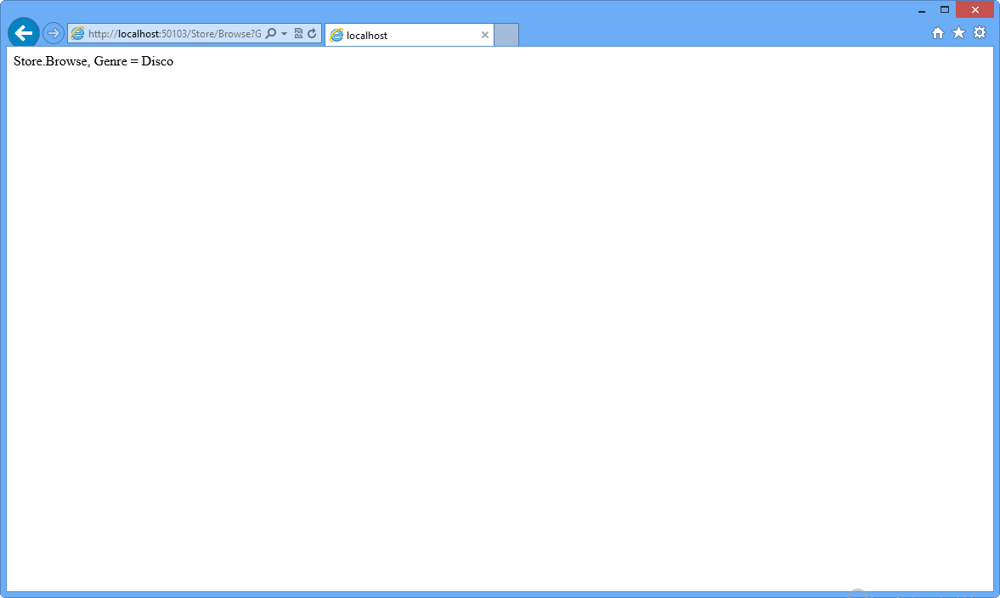

    *Browsing /Store/Browse?Genre=Disco*
3. Close the browser.

#### Task 3 - Adding an Id Parameter Embedded in the URL

In this task, you will use the **URL** to pass an **Id** parameter to the **Details** action method of the **StoreController**. ASP.NET MVC's default routing convention is to treat the segment of a URL after the action method name as a parameter named **Id**. If your action method has parameter named Id, then ASP.NET MVC will automatically pass the URL segment to you as a parameter. In the URL **Store/Details/5**, **Id** will be interpreted as **5**.

1. Change the **Details** method of the **StoreController**, adding an **int** parameter called **id**. To do this, replace the **Details** method with the following code:

    (Code Snippet - *ASP.NET MVC 4 Fundamentals - Ex3 StoreController DetailsMethod*)

    [!code-csharp[Main](aspnet-mvc-4-fundamentals/samples/sample5.cs)]

#### Task 4 - Running the Application

In this task, you will try out the Application in a web browser and use the **Id** parameter.

1. Press **F5** to run the Application.
2. The project starts in the **Home** page. Change the URL to */Store/Details/5* to verify that the action receives the id parameter.

    

    *Browsing /Store/Details/5*

### Exercise 4: Creating a View

So far you have been returning strings from controller actions. Although that is a useful way of understanding how controllers work, it is not how your real Web applications are built. Views are components that provide a better approach for generating HTML back to the browser with the use of template files.

In this exercise you will learn how to add a layout master page to setup a template for common HTML content, a StyleSheet to enhance the look and feel of the site and finally a View template to enable HomeController to return HTML.

#### Task 1 - Modifying the file \_layout.cshtml

The file **~/Views/Shared/\_layout.cshtml** allows you to setup a template for common HTML to use across the entire website. In this task you will add a layout master page with a common header with links to the Home page and Store area.

1. If not already open, start **VS Express for Web**.
2. In the **File** menu, choose **Open Project**. In the Open Project dialog, browse to **Source\Ex04-CreatingAView\Begin**, select **Begin.sln** and click **Open**. Alternatively, you may continue with the solution that you obtained after completing the previous exercise.

    1. If you opened the provided **Begin** solution, you will need to download some missing NuGet packages before continue. To do this, click the **Project** menu and select **Manage NuGet Packages**.
    2. In the **Manage NuGet Packages** dialog, click **Restore** in order to download missing packages.
    3. Finally, build the solution by clicking **Build** | **Build Solution**.

    > [!NOTE]
    > One of the advantages of using NuGet is that you don't have to ship all the libraries in your project, reducing the project size. With NuGet Power Tools, by specifying the package versions in the Packages.config file, you will be able to download all the required libraries the first time you run the project. This is why you will have to run these steps after you open an existing solution from this lab.
3. The file **\_layout.cshtml** contains the HTML container layout for all pages on the site. It includes the **&lt;html&gt;** element for the HTML response, as well as the **&lt;head&gt;** and **&lt;body&gt;** elements. **@RenderBody()** within the HTML body identify regions that view templates will be able to fill in with dynamic content.
(C#)

    [!code-cshtml[Main](aspnet-mvc-4-fundamentals/samples/sample6.cshtml)]
4. Add a common header with links to the Home page and Store area on all pages in the site. In order to do that, add the following code below &lt;body&gt; statement.
(C#)

    [!code-cshtml[Main](aspnet-mvc-4-fundamentals/samples/sample7.cshtml)]
5. Include a div to render the body section of each page. Replace **@RenderBody()** with the following higlighted code:
(C#)

    [!code-cshtml[Main](aspnet-mvc-4-fundamentals/samples/sample8.cshtml)]

    > [!NOTE]
    > Did you know? Visual Studio 2012 has snippets that make it easy to add commonly used code in HTML, code files and more! Try it out by typing **&lt;div&gt;** and pressing **TAB** twice to insert a complete **div** tag.

#### Task 2 - Adding CSS Stylesheet

The empty project template includes a very streamlined CSS file which just includes styles used to display basic forms and validation messages. You will use additional CSS and images (potentially provided by a designer) in order to enhance the look and feel of the site.

In this task, you will add a CSS stylesheet to define the styles of the site.

1. The CSS file and images are included in the **Source\Assets\Content** folder of this Lab. In order to add them to the application, drag their content from a **Windows Explorer** window into the **Solution Explorer** in Visual Studio Express for Web, as shown below:

    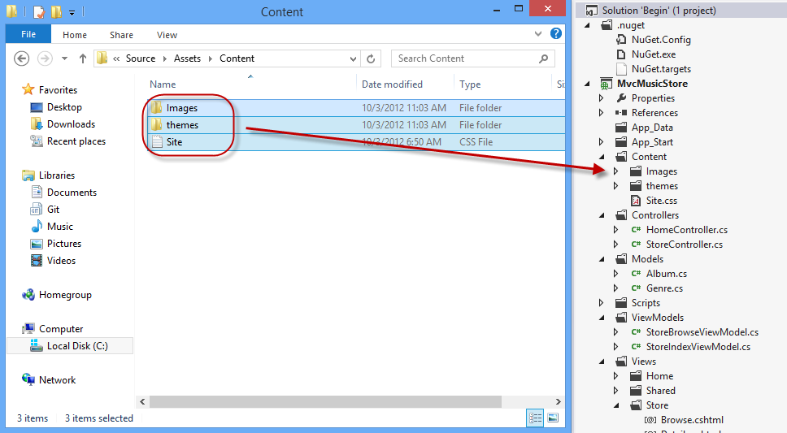

    *Dragging style contents*
2. A warning dialog will appear, asking for confirmation to replace **Site.css** file and some existing images. Check **Apply to all items** and click **Yes**.

#### Task 3 - Adding a View Template

In this task, you will add a View template to generate the HTML response that will use the layout master page and CSS added in this exercise.

1. To use a View template when browsing the site's home page, you will first need to indicate that instead of returning a string, the **HomeController Index** method will return a **View**. Open **HomeController** class and change its **Index** method to return an **ActionResult**, and have it return **View()**.

    (Code Snippet - *ASP.NET MVC 4 Fundamentals - Ex4 HomeController Index*)

    [!code-csharp[Main](aspnet-mvc-4-fundamentals/samples/sample9.cs)]
2. Now, you need to add an appropriate View template. To do this, **right-click** inside the **Index** action method and select **Add View**. This will bring up the **Add View** dialog.

    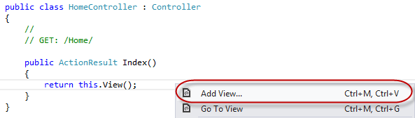

    *Adding a View from within the Index method*
3. The **Add View** Dialog will appear to generate a View template file. By default, this dialog pre-populates the name of the View template so that it matches the action method that will use it. Because you used the **Add View** context menu within the **Index** action method within the HomeController, the **Add View** dialog has Index as the default view name. Click **Add**.

    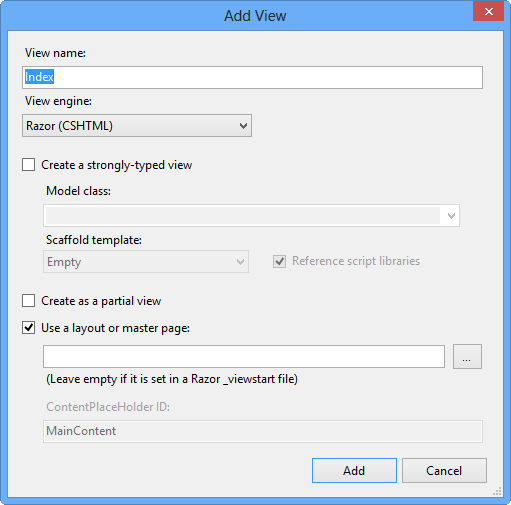

    *Add View Dialog*
4. Visual Studio generates an **Index.cshtml** view template inside the **Views\Home** folder and then opens it.

    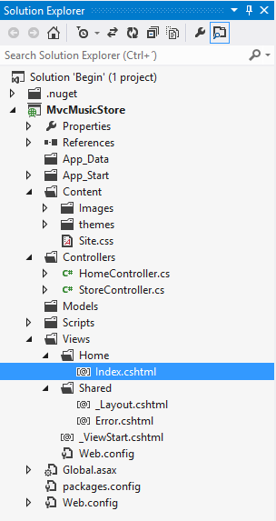

    *Home Index view created*

    > [!NOTE]
    > name and location of the **Index.cshtml** file is relevant and follows the default ASP.NET MVC naming conventions.
    > 
    > The folder \Views\**Home** matches the controller name (**Home** Controller). The View template name (**Index**), matches the controller action method which will be displaying the View.
    > 
    > This way, ASP.NET MVC avoids having to explicitly specify the name or location of a View template when using this naming convention to return a View.
5. The generated View template is based on the **\_layout.cshtml** template earlier defined. Update the ViewBag.Title property to **Home**, and change the main content to **This is the Home Page**, as shown in the code below:

    [!code-cshtml[Main](aspnet-mvc-4-fundamentals/samples/sample10.cshtml)]
6. Select **MvcMusicStore** project in the Solution Explorer and Press **F5** to run the Application.

#### Task 4: Verification

In order to verify that you have correctly performed all the steps in the previous exercise, proceed as follows:

With the application opened in a browser, you should note that:

1. The HomeController's Index action method found and displayed the **\Views\Home\Index.cshtml** View template, even though the code called **return View()**, because the View template followed the standard naming convention.
2. The Home Page displays the welcome message defined within the **\Views\Home\Index.cshtml** view template.
3. The Home Page is using the **\_layout.cshtml** template, and so the welcome message is contained within the standard site HTML layout.

    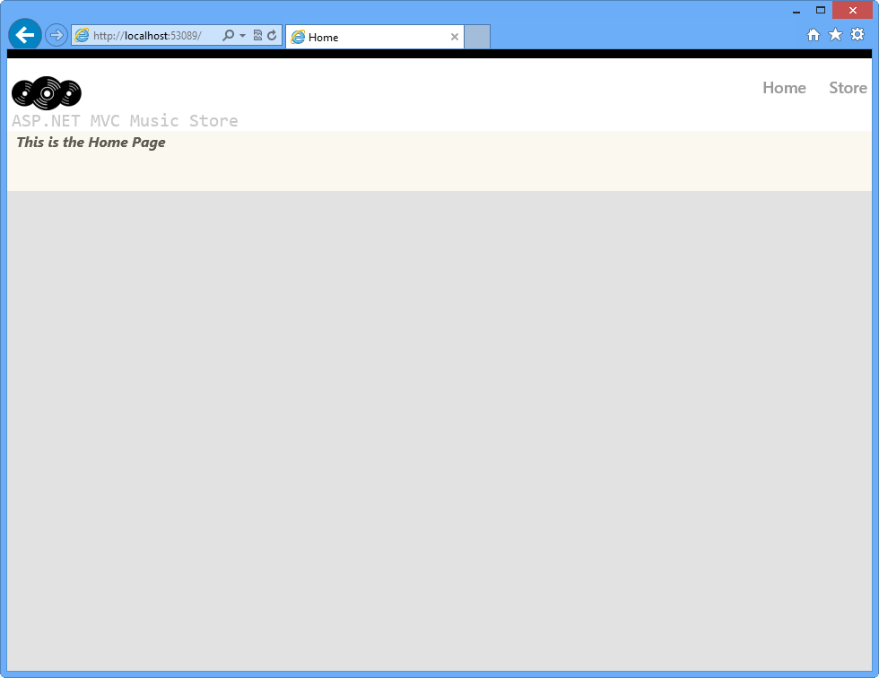

    *Home Index View using the defined LayoutPage and style*

### Exercise 5: Creating a View Model

So far, you made your Views display hardcoded HTML, but, in order to create dynamic web applications, the View template should receive information from the Controller. One common technique to be used for that purpose is the **ViewModel** pattern, which allows a Controller to package up all the information needed to generate the appropriate HTML response.

In this exercise, you will learn how to create a ViewModel class and add the required properties: the number of genres in the store and a list of those genres. You will also update the StoreController to use the created ViewModel, and finally, you will create a new View template that will display the mentioned properties in the page.

#### Task 1 - Creating a ViewModel Class

In this task, you will create a ViewModel class that will implement the Store genre listing scenario.

1. If not already open, start **VS Express for Web**.
2. In the **File** menu, choose **Open Project**. In the Open Project dialog, browse to **Source\Ex05-CreatingAViewModel\Begin**, select **Begin.sln** and click **Open**. Alternatively, you may continue with the solution that you obtained after completing the previous exercise.

    1. If you opened the provided **Begin** solution, you will need to download some missing NuGet packages before continue. To do this, click the **Project** menu and select **Manage NuGet Packages**.
    2. In the **Manage NuGet Packages** dialog, click **Restore** in order to download missing packages.
    3. Finally, build the solution by clicking **Build** | **Build Solution**.

    > [!NOTE]
    > One of the advantages of using NuGet is that you don't have to ship all the libraries in your project, reducing the project size. With NuGet Power Tools, by specifying the package versions in the Packages.config file, you will be able to download all the required libraries the first time you run the project. This is why you will have to run these steps after you open an existing solution from this lab.
3. Create a **ViewModels** folder to hold the ViewModel. To do this, right-click the top-level **MvcMusicStore** project, select **Add** and then **New Folder**.

    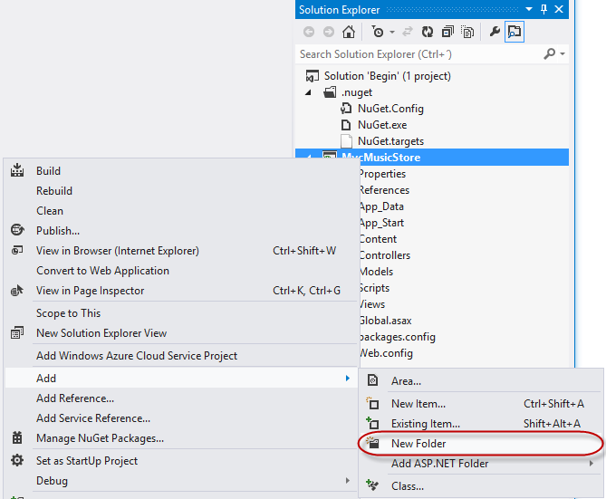

    *Adding a new folder*
4. Name the folder *ViewModels*.

    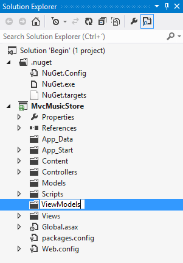

    *ViewModels folder in Solution Explorer*
5. Create a **ViewModel** class. To do this, right-click on the **ViewModels** folder recently created, select **Add** and then **New Item**. Under **Code**, choose the **Class** item and name the file *StoreIndexViewModel.cs*, then click **Add**.

    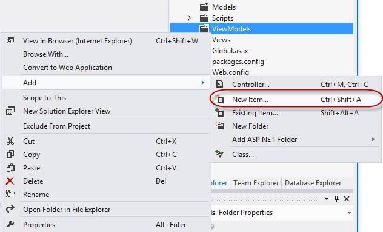

    *Adding a new Class*

    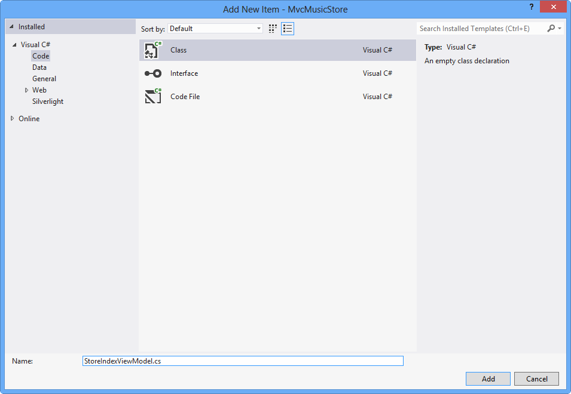

    *Creating StoreIndexViewModel class*

#### Task 2 - Adding Properties to the ViewModel class

There are two parameters to be passed from the StoreController to the View template in order to generate the expected HTML response: the number of genres in the store and a list of those genres.

In this task, you will add those 2 properties to the **StoreIndexViewModel** class: **NumberOfGenres** (an integer) and **Genres** (a list of strings).

1. Add **NumberOfGenres** and **Genres** properties to the **StoreIndexViewModel** class. To do this, add the following 2 lines to the class definition:

    (Code Snippet - *ASP.NET MVC 4 Fundamentals - Ex5 StoreIndexViewModel properties*)

    [!code-csharp[Main](aspnet-mvc-4-fundamentals/samples/sample11.cs)]

    > [!NOTE]
    > The **{ get; set; }** notation makes use of C#'s auto-implemented properties feature. It provides the benefits of a property without requiring us to declare a backing field.

#### Task 3 - Updating StoreController to use the StoreIndexViewModel

The **StoreIndexViewModel** class encapsulates the information needed to pass from **StoreController**'s **Index** method to a View template in order to generate a response.

In this task, you will update the **StoreController** to use the **StoreIndexViewModel**.

1. Open **StoreController** class.

    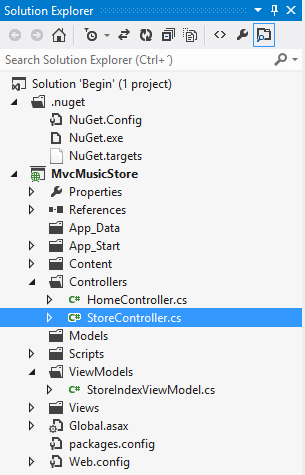

    *Opening StoreController class*
2. In order to use the **StoreIndexViewModel** class from the **StoreController**, add the following namespace at the top of the **StoreController** code:

    (Code Snippet - *ASP.NET MVC 4 Fundamentals - Ex5 StoreIndexViewModel using ViewModels*)

    [!code-csharp[Main](aspnet-mvc-4-fundamentals/samples/sample12.cs)]
3. Change the **StoreController**'s **Index** action method so that it creates and populates a **StoreIndexViewModel** object and then passes it off to a View template to generate an HTML response with it.

    > [!NOTE]
    > In Lab &quot;ASP.NET MVC Models and Data Access&quot; you will write code that retrieves the list of store genres from a database. In the following code, you will create a **List** of dummy data genres that will populate the **StoreIndexViewModel**.
    > 
    > After creating and setting up the **StoreIndexViewModel** object, it will be passed as an argument to the **View** method. This indicates that the View template will use that object to generate an HTML response with it.
4. Replace the **Index** method with the following code:

    (Code Snippet - *ASP.NET MVC 4 Fundamentals - Ex5 StoreController Index method*)

    [!code-csharp[Main](aspnet-mvc-4-fundamentals/samples/sample13.cs)]

    > [!NOTE]
    > If you're unfamiliar with C#, you may assume that using **var** means that the **viewModel** variable is late-bound. That's not correct - the C# compiler is using type-inference based on what you assign to the variable to determine that **viewModel** is of type **StoreIndexViewModel**. Also, by compiling the local **viewModel** variable as a **StoreIndexViewModel** type you get compile-time checking and Visual Studio code-editor support.

#### Task 4 - Creating a View Template that Uses StoreIndexViewModel

In this task, you will create a View template that will use a StoreIndexViewModel object passed from the Controller to display a list of genres.

1. Before creating the new View template, let's build the project so that the **Add View Dialog** knows about the **StoreIndexViewModel** class. Build the project by selecting the **Build** menu item and then **Build MvcMusicStore**.

    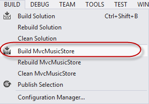

    *Building the project*
2. Create a new View template. To do that, right-click inside the **Index** method and select **Add View**.

    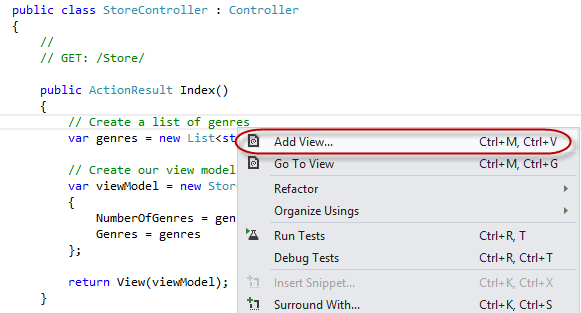

    *Adding a View*
3. Because the **Add View Dialog** was invoked from the **StoreController**, it will add the View template by default in a **\Views\Store\Index.cshtml** file. Check the **Create a strongly-typed-view** checkbox and then select **StoreIndexViewModel** as the **Model class**. Also, make sure that the View engine selected is **Razor**. Click **Add**.

    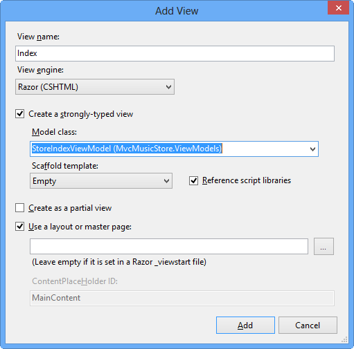

    *Add View Dialog*

    The **\Views\Store\Index.cshtml** View template file is created and opened. Based on the information provided to the **Add View** dialog in the last step, the View template will expect a **StoreIndexViewModel** instance as the data to use to generate an HTML response. You will notice that the template inherits a `ViewPage<musicstore.viewmodels.storeindexviewmodel>` in C#.

#### Task 5 - Updating the View Template

In this task, you will update the View template created in the last task to retrieve the number of genres and their names within the page.

> [!NOTE]
> You will use @ syntax (often referred to as &quot;code nuggets&quot;) to execute code within the View template.

1. In the **Index.cshtml** file, within the **Store** folder, replace its code with the following:

    [!code-cshtml[Main](aspnet-mvc-4-fundamentals/samples/sample14.cshtml)]

    > [!NOTE]
    > As soon as you finish typing the period after the word **Model**, Visual Studio's Intellisense will show a list of possible properties and methods to choose from.
    > 
    > 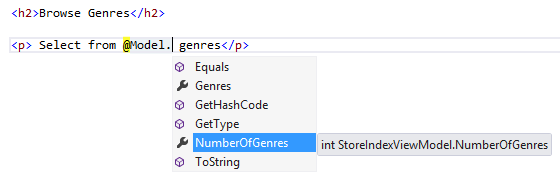
    > 
    > *Getting Model properties and methods with Visual Studio's IntelliSense*
    > 
    > The **Model** property references the **StoreIndexViewModel** object that the Controller passed to the View template. This means that you can access all of the data passed from the Controller to the View template via the **Model** property, and format it into an appropriate HTML response within the View template.
    > 
    > You can just select the **NumberOfGenres** property from the Intellisense list rather than typing it in and then it will auto-complete it by pressing the **tab key**.
2. Loop over the genre list in **StoreIndexViewModel** and create an HTML **&lt;ul&gt;** list using a **foreach** loop.
(C#)

    [!code-cshtml[Main](aspnet-mvc-4-fundamentals/samples/sample15.cshtml)]
3. Press **F5** to run the Application and browse **/Store**. You will see the list of genres passed in the **StoreIndexViewModel** object from the **StoreController** to the View template.

    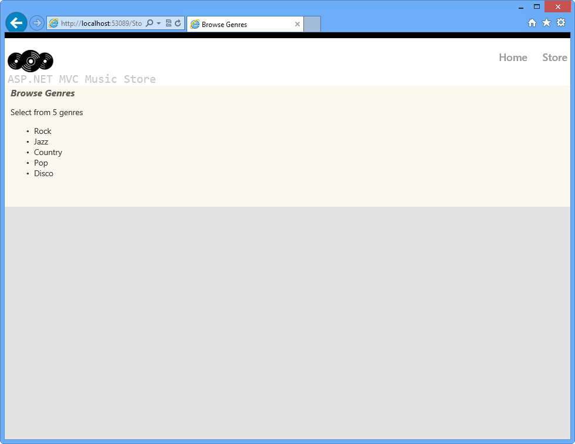

    *View displaying a list of genres*
4. Close the browser.

### Exercise 6: Using Parameters in View

In Exercise 3 you learned how to pass parameters to the Controller. In this exercise, you will learn how to use those parameters in the View template. For that purpose, you will be introduced first to Model classes that will help you to manage your data and domain logic. Additionally, you will learn how to create links to pages inside the ASP.NET MVC application without worrying of things like URL paths encoding.

#### Task 1 - Adding Model Classes

Unlike ViewModels, which are created just to pass information from the Controller to the View, Model classes are built to contain and manage data and domain logic. In this task you will add two model classes to represent these concepts: **Genre** and **Album**.

1. If not already open, start **VS Express for Web**
2. In the **File** menu, choose **Open Project**. In the Open Project dialog, browse to **Source\Ex06-UsingParametersInView\Begin**, select **Begin.sln** and click **Open**. Alternatively, you may continue with the solution that you obtained after completing the previous exercise.

    1. If you opened the provided **Begin** solution, you will need to download some missing NuGet packages before continue. To do this, click the **Project** menu and select **Manage NuGet Packages**.
    2. In the **Manage NuGet Packages** dialog, click **Restore** in order to download missing packages.
    3. Finally, build the solution by clicking **Build** | **Build Solution**.

    > [!NOTE]
    > One of the advantages of using NuGet is that you don't have to ship all the libraries in your project, reducing the project size. With NuGet Power Tools, by specifying the package versions in the Packages.config file, you will be able to download all the required libraries the first time you run the project. This is why you will have to run these steps after you open an existing solution from this lab.
3. Add a **Genre** Model class. To do this, right-click the **Models** folder in the **Solution Explorer**, select **Add** and then the **New Item** option. Under **Code**, choose the **Class** item and name the file *Genre.cs*, then click **Add**.

    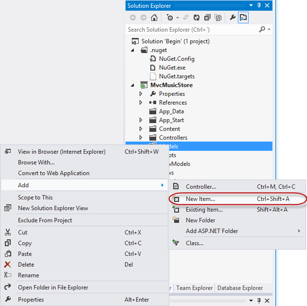

    *Adding a new item*

    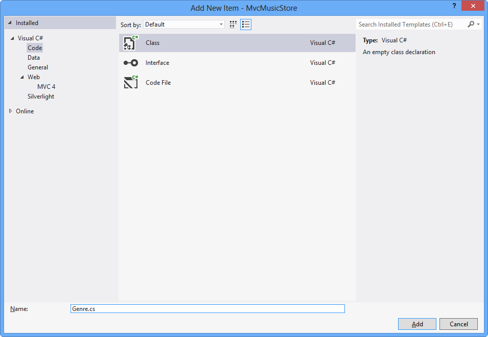

    *Add Genre Model Class*
4. Add a **Name** property to the Genre class. To do this, add the following code:

    (Code Snippet - *ASP.NET MVC 4 Fundamentals - Ex6 Genre*)

    [!code-csharp[Main](aspnet-mvc-4-fundamentals/samples/sample16.cs)]
5. Following the same procedure as before, add an **Album** class. To do this, right-click the **Models** folder in the **Solution Explorer**, select **Add** and then the **New Item** option. Under **Code**, choose the **Class** item and name the file *Album.cs*, then click **Add**.
6. Add two properties to the Album class: **Genre** and **Title**. To do this, add the following code:

    (Code Snippet - *ASP.NET MVC 4 Fundamentals - Ex6 Album*)

    [!code-csharp[Main](aspnet-mvc-4-fundamentals/samples/sample17.cs)]

#### Task 2 - Adding a StoreBrowseViewModel

A **StoreBrowseViewModel** will be used in this task to show the Albums that match a selected Genre. In this task, you will create this class and then add two properties to handle the **Genre** and its **Album**'s List.

1. Add a **StoreBrowseViewModel** class. To do this, right-click the **ViewModels** folder in the **Solution Explorer**, select **Add** and then the **New Item** option. Under **Code**, choose the **Class** item and name the file *StoreBrowseViewModel.cs*, then click **Add**.
2. Add a reference to the Models in **StoreBrowseViewModel** class. To do this, add the following using namespace:

    (Code Snippet - *ASP.NET MVC 4 Fundamentals - Ex6 UsingModel*)

    [!code-csharp[Main](aspnet-mvc-4-fundamentals/samples/sample18.cs)]
3. Add two properties to **StoreBrowseViewModel** class: **Genre** and **Albums**. To do this, add the following code:

    (Code Snippet - *ASP.NET MVC 4 Fundamentals - Ex6 ModelProperties*)

    [!code-csharp[Main](aspnet-mvc-4-fundamentals/samples/sample19.cs)]

    > [!NOTE]
    > What is **List&lt;Album&gt;** ?: This definition is using the **List&lt;T&gt;** type, where **T** constrains the type to which elements of this **List** belong to, in this case **Album** (or any of its descendants).
    > 
    > This ability to design classes and methods that defer the specification of one or more types until the class or method is declared and instantiated by client code is a feature of the C# language called **Generics**.
    > 
    > **List&lt;T&gt;** is the generic equivalent of the **ArrayList** type and is available in the **System.Collections.Generic** namespace. One of the benefits of using **generics** is that since the type is specified, you do not need to take care of type checking operations such as casting the elements into **Album** as you would do with an **ArrayList**.

#### Task 3 - Using the New ViewModel in the StoreController

In this task, you will modify the **StoreController**'s **Browse** and **Details** action methods to use the new **StoreBrowseViewModel**.

1. Add a reference to the Models folder in **StoreController** class. To do this, expand the **Controllers** folder in the **Solution Explorer** and open the **StoreController** class. Then add the following code:

    (Code Snippet - *ASP.NET MVC 4 Fundamentals - Ex6 UsingModelInController*)

    [!code-csharp[Main](aspnet-mvc-4-fundamentals/samples/sample20.cs)]
2. Replace the **Browse** action method to use the **StoreViewBrowseController** class. You will create a Genre and two new Albums objects with dummy data (in the next Hands-on Lab you will consume real data from a database). To do this, replace the **Browse** method with the following code:

    (Code Snippet - *ASP.NET MVC 4 Fundamentals - Ex6 BrowseMethod*)

    [!code-csharp[Main](aspnet-mvc-4-fundamentals/samples/sample21.cs)]
3. Replace the **Details** action method to use the **StoreViewBrowseController** class. You will create a new **Album** object to be returned to the **View**. To do this, replace the **Details** method with the following code:

    (Code Snippet - *ASP.NET MVC 4 Fundamentals - Ex6 DetailsMethod*)

    [!code-csharp[Main](aspnet-mvc-4-fundamentals/samples/sample22.cs)]

#### Task 4 - Adding a Browse View Template

In this task, you will add a **Browse** View to show the Albums found for a specific Genre.

1. Before creating the new View template, you should build the project so that the **Add View** Dialog knows about the **ViewModel** class to use. Build the project by selecting the **Build** menu item and then **Build MvcMusicStore**.
2. Add a **Browse** View. To do this, right-click in the **Browse** action method of the **StoreController** and click **Add View**.
3. In the **Add View** dialog box, verify that the View Name is **Browse**. Check the **Create a strongly-typed view** checkbox and select **StoreBrowseViewModel** from the **Model class** dropdown. Leave the other fields with their default value. Then click **Add**.

    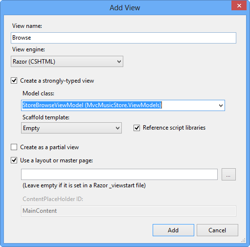

    *Adding a Browse View*
4. Modify the **Browse.cshtml** to display the Genre's information, accessing the **StoreBrowseViewModel** object that is passed to the view template. To do this, replace the content with the following:
(C#)

    [!code-cshtml[Main](aspnet-mvc-4-fundamentals/samples/sample23.cshtml)]

#### Task 5 - Running the Application

In this task, you will test that the **Browse** method retrieves Albums from the **Browse** method action.

1. Press **F5** to run the Application.
2. The project starts in the Home page. Change the URL to **/Store/Browse?Genre=Disco** to verify that the action returns two Albums.

    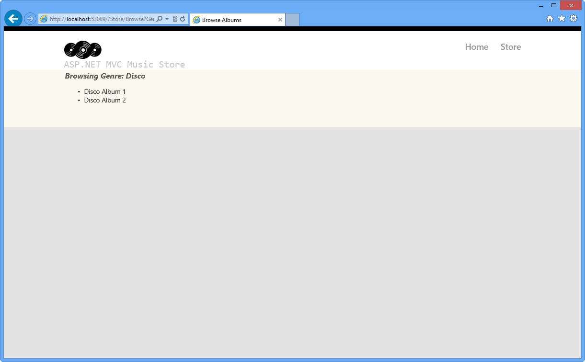

    *Browsing Store Disco Albums*

#### Task 6 - Displaying information About a Specific Album

In this task, you will implement the **Store/Details** view to display information about a specific album. In this Hands-on Lab, everything you will display about the album is already contained in the **View** template. So, instead of creating a **StoreDetailsViewModel** class, you will use the current **StoreBrowseViewModel** template passing the Album to it.

1. Close the browser if needed, to return to the Visual Studio window. Add a new **Details** view for the **StoreController**'s **Details** action method. To do this, right-click the **Details** method in the **StoreController** class and click **Add View**.
2. In the **Add View** dialog, verify that the **View Name** is **Details**. Check the **Create a strongly-typed view** checkbox and select **Album** from the **Model class** drop-down. Leave the other fields with their default value. Then click **Add**. This will create and open a **\Views\Store\Details.cshtml** file.

    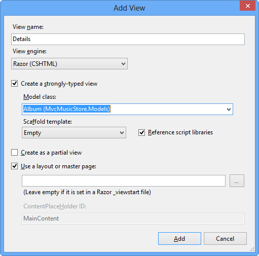

    *Adding a Details View*
3. Modify the **Details.cshtml** file to display the Album's information, accessing the **Album** object that is passed to the view template. To do this, replace the content with the following:
(C#)

    [!code-cshtml[Main](aspnet-mvc-4-fundamentals/samples/sample24.cshtml)]

#### Task 7 - Running the Application

In this task, you will test that the **Details** View retrieves Album's information from the **Details action** method.

1. Press **F5** to run the Application.
2. The project starts in the **Home** page. Change the URL to **/Store/Details/5** to verify the album's information.

    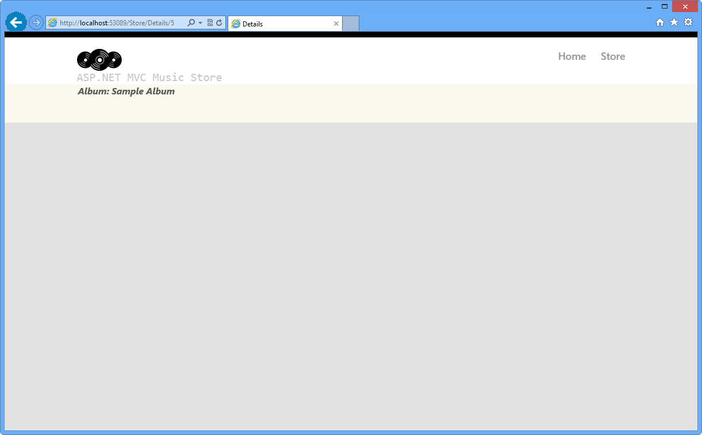

    *Browsing Album's Detail*

#### Task 8 - Adding Links Between Pages

In this task, you will add a link in the Store View to have a link in every Genre name to the appropriate **/Store/Browse** URL. This way, when you click on a Genre, for instance **Disco**, it will navigate to **/Store/Browse?genre=Disco** URL.

1. Close the browser if needed, to return to the Visual Studio window. Update the **Index** page to add a link to the **Browse** page. To do this, in the **Solution Explorer** expand the **Views** folder, then the **Store** folder and double-click the **Index.cshtml** page.
2. Add a link to the Browse view indicating the genre selected. To do this, replace the following highlighted code within the **&lt;li&gt;** tags:
(C#)

    [!code-cshtml[Main](aspnet-mvc-4-fundamentals/samples/sample25.cshtml)]

    > [!NOTE]
    > another approach would be linking directly to the page, with a code like the following:
    > 
    > &lt;a href=&quot;/Store/Browse?genre=@genreName&quot;&gt;@genreName&lt;/a&gt;
    > 
    > Although this approach works, it depends on a hardcoded string. If you later rename the Controller, you will have to change this instruction manually. A better alternative is to use an **HTML Helper** method. ASP.NET MVC includes an HTML Helper method which is available for such tasks. The **Html.ActionLink()** helper method makes it easy to build HTML **&lt;a&gt;** links, making sure URL paths are properly URL encoded.
    > 
    > Htlm.ActionLink has several overloads. In this exercise you will use one that takes three parameters:
    > 
    > 1. Link text, which will display the Genre name
    > 2. Controller action name (**Browse**)
    > 3. Route parameter values, specifying both the name (**Genre**) and the value (**Genre name**)

#### Task 9 - Running the Application

In this task, you will test that each Genre is displayed with a link to the appropriate **/Store/Browse** URL.

1. Press **F5** to run the Application.
2. The project starts in the Home page. Change the URL to **/Store** to verify that each Genre links to the appropriate **/Store/Browse** URL.

    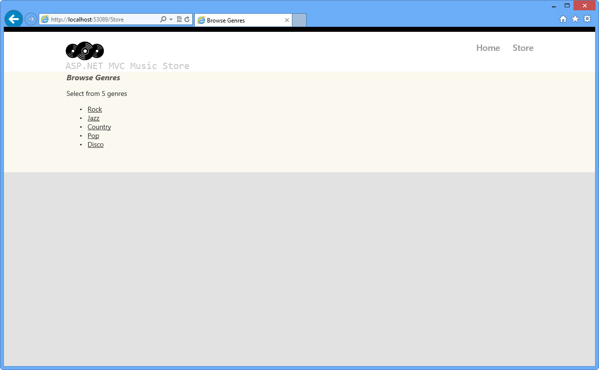

    *Browsing Genres with links to Browse page*

#### Task 10 - Using Dynamic ViewModel Collection to Pass Values

In this task, you will learn a simple and powerful method to pass values between the Controller and the View without making any changes in the Model. ASP.NET MVC 4 provides the collection &quot;ViewModel&quot;, which can be assigned to any dynamic value and accessed inside controllers and views as well.

You will now use the ViewBag dynamic collection to pass a list of &quot;**Starred genres**&quot; from the controller to the view. The Store Index view will access to **ViewModel** and display the information.

1. Close the browser if needed, to return to the Visual Studio window. Open **StoreController.cs** and modify **Index** method to create a list of starred genres into ViewModel collection :

    [!code-csharp[Main](aspnet-mvc-4-fundamentals/samples/sample26.cs)]

    > [!NOTE]
    > You could also use the syntax **ViewBag[&quot;Starred&quot;]** to access the properties.
2. The star icon **&quot;starred.png&quot;** is included in the **Source\Assets\Images** folder of this lab. In order to add it to the application, drag their content from a **Windows Explorer** window into the **Solution Explorer** in Visual Web Developer Express, as shown below:

    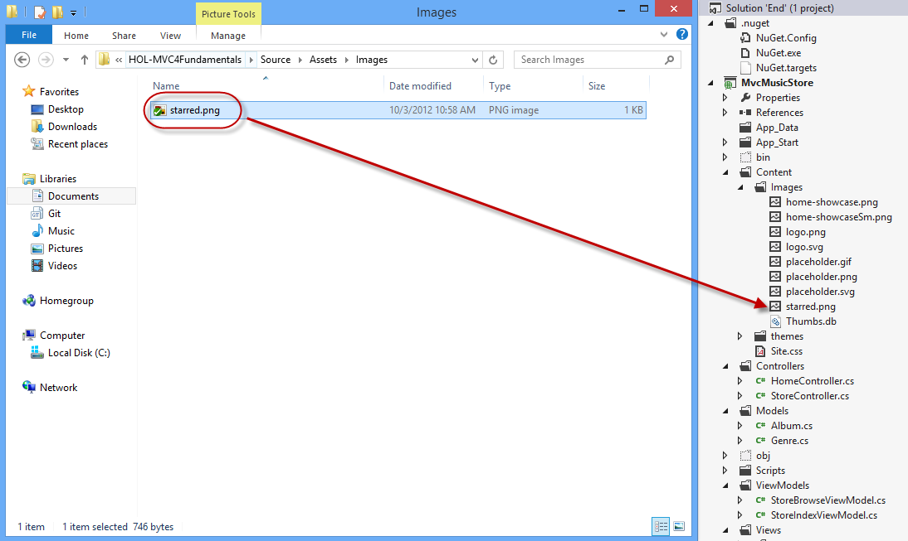

    *Adding star image to the solution*
3. Open the view **Store/Index.cshtml** and modify the content. You will read the &quot;starred&quot; property in the **ViewBag** collection, and ask if the current genre name is in the list. In that case you will show a star icon right to the genre link.
(C#)

    [!code-cshtml[Main](aspnet-mvc-4-fundamentals/samples/sample27.cshtml)]

#### Task 11 - Running the Application

In this task, you will test that the starred genres display a star icon.

1. Press **F5** to run the Application.
2. The project starts in the **Home** page. Change the URL to **/Store** to verify that each featured genre has the respecting label:

    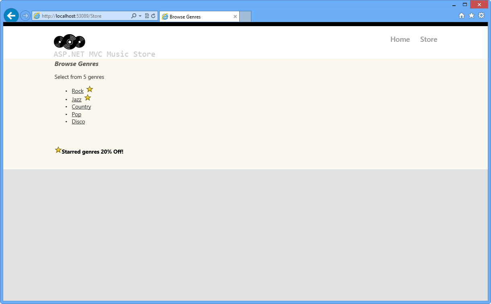

    *Browsing Genres with starred elements*

### Exercise 7: A lap around ASP.NET MVC 4 new template

In this exercise, you will explore the enhancements in the ASP.NET MVC 4 project templates, taking a look at the most relevant features of the new template.

#### Task 1: Exploring the ASP.NET MVC 4 Internet Application Template

1. If not already open, start **VS Express for Web**
2. Select the **File | New | Project** menu command. In the **New Project** dialog, select the **Visual C#|Web** template on the left pane tree, and choose the **ASP.NET MVC 4 Web Application**. **Name** the project *MusicStore* and update the **solution name** to *Begin*, then select a location (or leave the default) and click **OK**.

    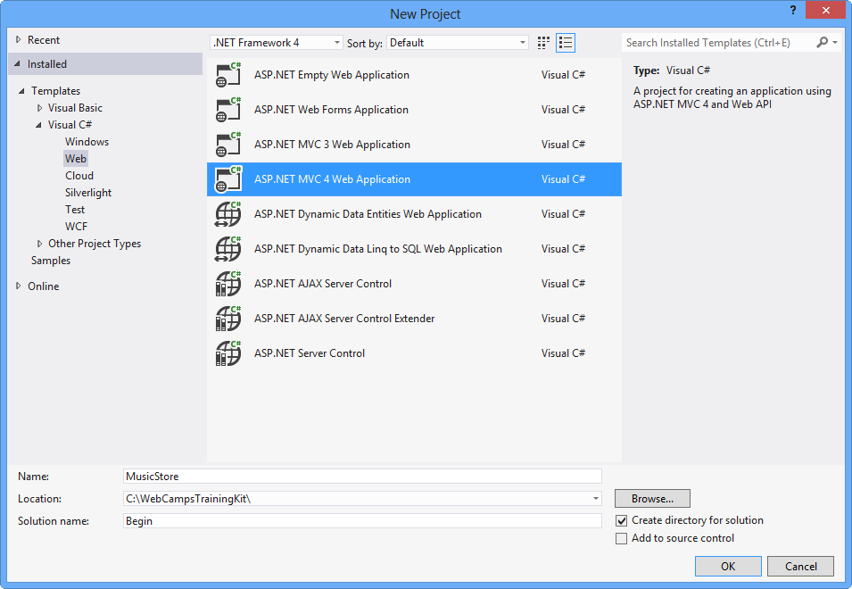

    *Creating a new ASP.NET MVC 4 Project*
3. In the **New ASP.NET MVC 4 Project** dialog, select the **Internet Application** project template and click **OK**. Notice you can select either Razor or ASPX as the view engine.

    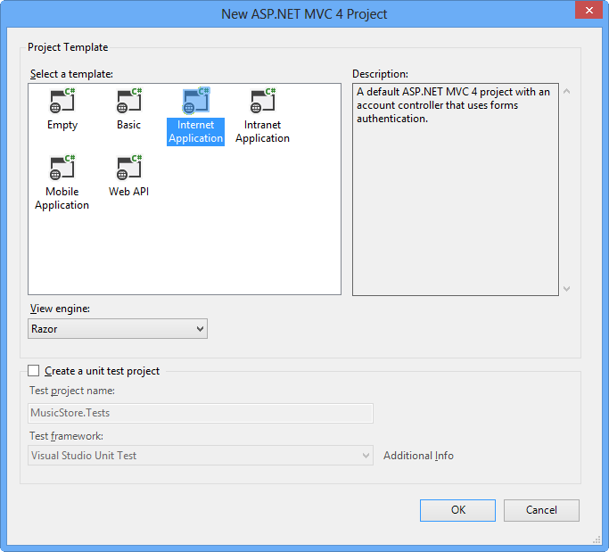

    *Creating a new ASP.NET MVC 4 Internet Application*

    > [!NOTE]
    > Razor syntax has been introduced in ASP.NET MVC 3. Its goal is to minimize the number of characters and keystrokes required in a file, enabling a fast and fluid coding workflow. Razor leverages existing C#/VB (or other) language skills and delivers a template markup syntax that enables an awesome HTML construction workflow.
4. Press **F5** to run the solution and see the renewed template. You can check out the following features:

    1. **Modern-style templates**

        The templates have been renewed, providing more modern-looking styles.

        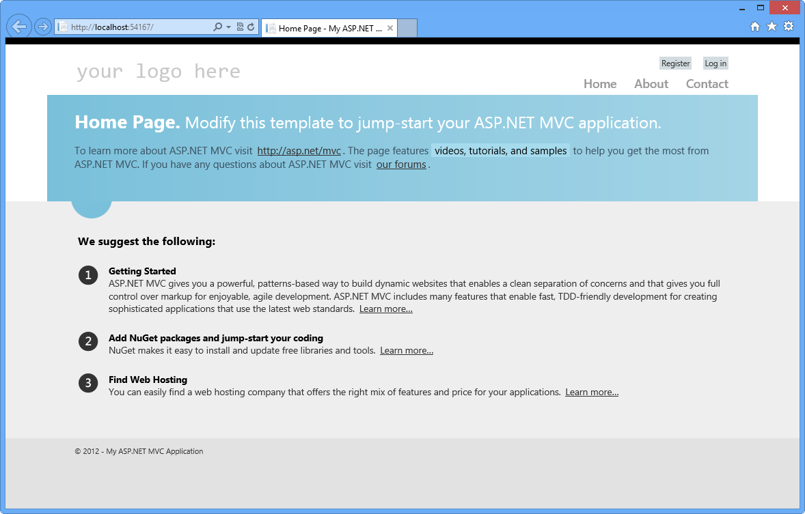

        *ASP.NET MVC 4 restyled templates*
    2. **Adaptive Rendering**

        Check out resizing the browser window and notice how the page layout dynamically adapts to the new window size. These templates use the adaptive rendering technique to render properly in both desktop and mobile platforms without any customization.

        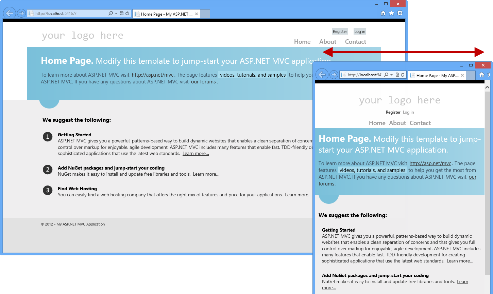

        *ASP.NET MVC 4 project template in different browser sizes*
5. Close the browser to stop the debugger and return to Visual Studio.
6. Now you are able to explore the solution and check out some of the new features introduced by ASP.NET MVC 4 in the project template.

    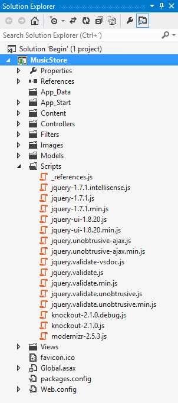

    *The ASP.NET MVC 4 Internet Application Project Template*

    1. **HTML5 markup**

        Browse template views to find out the new theme markup, for example open **About.cshtml** view within **Home** folder.

        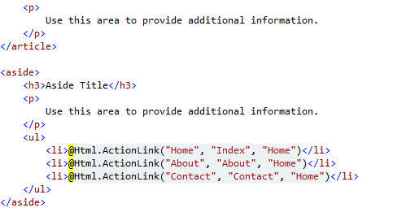

        *New template, using Razor and HTML5 markup*
    2. **JavaScript libraries included**

        1. **jQuery**: jQuery simplifies HTML document traversing, event handling, animating, and Ajax interactions.
        2. **jQuery UI**: This library provides abstractions for low-level interaction and animation, advanced effects and themeable widgets, built on top of the jQuery JavaScript Library.

            > [!NOTE]
            > You can learn about jQuery and jQuery UI in [[http://docs.jquery.com/](http://docs.jquery.com/)](http://docs.jquery.com/).
        3. **KnockoutJS**: The ASP.NET MVC 4 default template now includes **KnockoutJS**, a JavaScript MVVM framework that lets you create rich and highly responsive web applications using JavaScript and HTML. Like in ASP.NET MVC 3, jQuery and jQuery UI libraries are also included in ASP.NET MVC 4.

            > [!NOTE]
            > You can get more information about KnockOutJS library in this link: [http://learn.knockoutjs.com/](http://learn.knockoutjs.com/).
        4. **Modernizr**: This library runs automatically, making your site compatible with older browsers when using HTML5 and CSS3 technologies.

            > [!NOTE]
            > You can get more information about Modernizr library in this link: [http://www.modernizr.com/](http://www.modernizr.com/).
    3. **SimpleMembership included in the solution**

        SimpleMembership has been designed as a replacement for the previous ASP.NET Role and Membership provider system. It has many new features that make it easier for the developer to secure web pages in a more flexible way.

        The Internet template already has set up a few things to integrate SimpleMembership, for example, the AccountController is prepared to use OAuthWebSecurity (for OAuth account registration, login, management, etc.) and Web Security.

        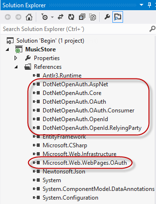

        *SimpleMembership Included in the solution*

        > [!NOTE]
        > Find more information about [OAuthWebSecurity](https://msdn.microsoft.com/en-us/library/jj158393(v=vs.111).aspx) in MSDN.

> [!NOTE]
> Additionally, you can deploy this application to Windows Azure Web Sites following [Appendix B: Publishing an ASP.NET MVC 4 Application using Web Deploy](#AppendixB).

* * *

## Summary

By completing this Hands-On Lab you have learned the fundamentals of ASP.NET MVC:

- The core elements of an MVC application and how they interact
- How to create an ASP.NET MVC Application
- How to add and configure Controllers to handle parameters passed through the URL and querystring
- How to add a layout master page to setup a template for common HTML content, a StyleSheet to enhance the look and feel and a View template to display HTML content
- How to use the ViewModel pattern for passing properties to the View template to display dynamic information
- How to use parameters passed to Controllers in the View template
- How to add links to pages inside the ASP.NET MVC application
- How to add and use dynamic properties in a View
- The enhancements in the ASP.NET MVC 4 project templates

## Appendix A: Installing Visual Studio Express 2012 for Web

You can install **Microsoft Visual Studio Express 2012 for Web** or another &quot;Express&quot; version using the **[Microsoft Web Platform Installer](https://www.microsoft.com/web/downloads/platform.aspx)**. The following instructions guide you through the steps required to install *Visual studio Express 2012 for Web* using *Microsoft Web Platform Installer*.

1. Go to [[https://go.microsoft.com/?linkid=9810169](https://go.microsoft.com/?linkid=9810169)](https://go.microsoft.com/?linkid=9810169). Alternatively, if you already have installed Web Platform Installer, you can open it and search for the product &quot;*Visual Studio Express 2012 for Web with Windows Azure SDK*&quot;.
2. Click on **Install Now**. If you do not have **Web Platform Installer** you will be redirected to download and install it first.
3. Once **Web Platform Installer** is open, click **Install** to start the setup.

    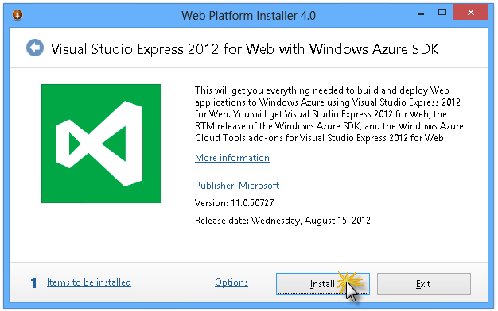

    *Install Visual Studio Express*
4. Read all the products' licenses and terms and click **I Accept** to continue.

    

    *Accepting the license terms*
5. Wait until the downloading and installation process completes.

    

    *Installation progress*
6. When the installation completes, click **Finish**.

    

    *Installation completed*
7. Click **Exit** to close Web Platform Installer.
8. To open Visual Studio Express for Web, go to the **Start** screen and start writing &quot;**VS Express**&quot;, then click on the **VS Express for Web** tile.

    

    *VS Express for Web tile*

## Appendix B: Publishing an ASP.NET MVC 4 Application using Web Deploy

This appendix will show you how to create a new web site from the Windows Azure Management Portal and publish the application you obtained by following the lab, taking advantage of the Web Deploy publishing feature provided by Windows Azure.

#### Task 1 - Creating a New Web Site from the Windows Azure Portal

1. Go to the [Windows Azure Management Portal](https://manage.windowsazure.com/) and sign in using the Microsoft credentials associated with your subscription.

    > [!NOTE]
    > With Windows Azure you can host 10 ASP.NET Web Sites for free and then scale as your traffic grows. You can sign up [here](http://aka.ms/aspnet-hol-azure).

    

    *Log on to Windows Azure Management Portal*
2. Click **New** on the command bar.

    

    *Creating a new Web Site*
3. Click **Compute** | **Web Site**. Then select **Quick Create** option. Provide an available URL for the new web site and click **Create Web Site**.

    > [!NOTE]
    > A Windows Azure Web Site is the host for a web application running in the cloud that you can control and manage. The Quick Create option allows you to deploy a completed web application to the Windows Azure Web Site from outside the portal. It does not include steps for setting up a database.

    

    *Creating a new Web Site using Quick Create*
4. Wait until the new **Web Site** is created.
5. Once the Web Site is created click the link under the **URL** column. Check that the new Web Site is working.

    

    *Browsing to the new web site*

    

    *Web site running*
6. Go back to the portal and click the name of the web site under the **Name** column to display the management pages.

    

    *Opening the Web Site management pages*
7. In the **Dashboard** page, under the **quick glance** section, click the **Download publish profile** link.

    > [!NOTE]
    > The *publish profile* contains all of the information required to publish a web application to a Windows Azure website for each enabled publication method. The publish profile contains the URLs, user credentials and database strings required to connect to and authenticate against each of the endpoints for which a publication method is enabled. **Microsoft WebMatrix 2**, **Microsoft Visual Studio Express for Web** and **Microsoft Visual Studio 2012** support reading publish profiles to automate configuration of these programs for publishing web applications to Windows Azure websites.

    

    *Downloading the Web Site publish profile*
8. Download the publish profile file to a known location. Further in this exercise you will see how to use this file to publish a web application to a Windows Azure Web Sites from Visual Studio.

    

    *Saving the publish profile file*

#### Task 2 - Configuring the Database Server

If your application makes use of SQL Server databases you will need to create a SQL Database server. If you want to deploy a simple application that does not use SQL Server you might skip this task.

1. You will need a SQL Database server for storing the application database. You can view the SQL Database servers from your subscription in the Windows Azure Management portal at **Sql Databases** | **Servers** | **Server's Dashboard**. If you do not have a server created, you can create one using the **Add** button on the command bar. Take note of the **server name and URL, administrator login name and password**, as you will use them in the next tasks. Do not create the database yet, as it will be created in a later stage.

    

    *SQL Database Server Dashboard*
2. In the next task you will test the database connection from Visual Studio, for that reason you need to include your local IP address in the server's list of **Allowed IP Addresses**. To do that, click **Configure**, select the IP address from **Current Client IP Address** and paste it on the **Start IP Address** and **End IP Address** text boxes and click the  button.

    

    *Adding Client IP Address*
3. Once the **Client IP Address** is added to the allowed IP addresses list, click on **Save** to confirm the changes.

    

    *Confirm Changes*

#### Task 3 - Publishing an ASP.NET MVC 4 Application using Web Deploy

1. Go back to the ASP.NET MVC 4 solution. In the **Solution Explorer**, right-click the web site project and select **Publish**.

    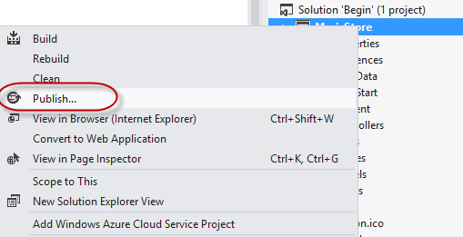

    *Publishing the web site*
2. Import the publish profile you saved in the first task.

    

    *Importing publish profile*
3. Click **Validate Connection**. Once Validation is complete click **Next**.

    > [!NOTE]
    > Validation is complete once you see a green checkmark appear next to the Validate Connection button.

    

    *Validating connection*
4. In the **Settings** page, under the **Databases** section, click the button next to your database connection's textbox (i.e. **DefaultConnection**).

    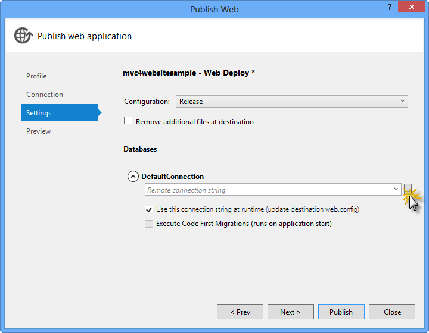

    *Web deploy configuration*
5. Configure the database connection as follows:

    - In the **Server name** type your SQL Database server URL using the *tcp:* prefix.
    - In **User name** type your server administrator login name.
    - In **Password** type your server administrator login password.
    - Type a new database name, for example: *MVC4SampleDB*.

    

    *Configuring destination connection string*
6. Then click **OK**. When prompted to create the database click **Yes**.

    

    *Creating the database*
7. The connection string you will use to connect to SQL Database in Windows Azure is shown within Default Connection textbox. Then click **Next**.

    

    *Connection string pointing to SQL Database*
8. In the **Preview** page, click **Publish**.

    

    *Publishing the web application*
9. Once the publishing process finishes, your default browser will open the published web site.

    

    *Application published to Windows Azure*

## Appendix C: Using Code Snippets

With code snippets, you have all the code you need at your fingertips. The lab document will tell you exactly when you can use them, as shown in the following figure.

*Using Visual Studio code snippets to insert code into your project*

***To add a code snippet using the keyboard (C# only)***

1. Place the cursor where you would like to insert the code.
2. Start typing the snippet name (without spaces or hyphens).
3. Watch as IntelliSense displays matching snippets' names.
4. Select the correct snippet (or keep typing until the entire snippet's name is selected).
5. Press the Tab key twice to insert the snippet at the cursor location.

*Start typing the snippet name*

*Press Tab to select the highlighted snippet*

*Press Tab again and the snippet will expand*

***To add a code snippet using the mouse (C#, Visual Basic and XML)*** 1. Right-click where you want to insert the code snippet.

1. Select **Insert Snippet** followed by **My Code Snippets**.
2. Pick the relevant snippet from the list, by clicking on it.

*Right-click where you want to insert the code snippet and select Insert Snippet*

*Pick the relevant snippet from the list, by clicking on it*