ASP.NET MVC 4 Helpers, Forms and Validation
====================
by [Web Camps Team](https://twitter.com/webcamps)

> In **ASP.NET MVC 4 Models and Data Access** Hands-on Lab, you have been loading and displaying data from the database. In this Hands-on Lab, you will add to the **Music Store** application the ability to edit that data.
> 
> With that goal in mind, you will first create the controller that will support the Create, Read, Update and Delete (CRUD) actions of albums. You will generate an Index View template taking advantage of ASP.NET MVC's scaffolding feature to display the albums' properties in an HTML table. To enhance that view, you will add a custom HTML helper that will truncate long descriptions.
> 
> Afterwards, you will add the Edit and Create Views that will let you alter the albums in the database, with the help of form elements like dropdowns.
> 
> Lastly, you will let users delete an album and also you will prevent them from entering wrong data by validating their input.
> 
> > [!NOTE]
> > This Hands-on Lab assumes you have basic knowledge of **ASP.NET MVC**. If you have not used **ASP.NET MVC** before, we recommend you to go over **ASP.NET MVC Fundamentals** Hands-on Lab.
> 
> 
> This lab walks you through the enhancements and new features previously described by applying minor changes to a sample Web application provided in the Source folder.
> 
> All sample code and snippets are included in the Web Camps Training Kit, available at [https://www.microsoft.com/en-us/download/29843](https://www.microsoft.com/en-us/download/29843).

### Objectives

In this Hands-On Lab, you will learn how to:

- Create a controller to support CRUD operations
- Generate an Index View to display entity properties in an HTML table
- Add a custom HTML helper
- Create and customize an Edit View
- Differentiate between action methods that react to either HTTP-GET or HTTP-POST calls
- Add and customize a Create View
- Handle the deletion of an entity
- Validate user input

### Prerequisites

You must have the following items to complete this lab:

- [Microsoft Visual Studio Express 2012 for Web](https://www.microsoft.com/visualstudio/eng/products/visual-studio-express-for-web) or superior (read [Appendix A](#AppendixA) for instructions on how to install it).

### Setup

**Installing Code Snippets**

For convenience, much of the code you will be managing along this lab is available as Visual Studio code snippets. To install the code snippets run **.\Source\Setup\CodeSnippets.vsi** file.

If you are not familiar with the Visual Studio Code Snippets, and want to learn how to use them, you can refer to the appendix from this document &quot;[Appendix B: Using Code Snippets](#AppendixB)&quot;.

* * *

## Exercises

The following exercises make up this Hands-On Lab:

1. [Creating the Store Manager controller and its Index view](#Exercise1)
2. [Adding an HTML Helper](#Exercise2)
3. [Creating the Edit View](#Exercise3)
4. [Adding a Create View](#Exercise4)
5. [Handling Deletion](#Exercise5)
6. [Adding Validation](#Exercise6)
7. [Using Unobtrusive jQuery at Client Side](#Exercise7)

> [!NOTE]
> Each exercise is accompanied by an **End** folder containing the resulting solution you should obtain after completing the exercises. You can use this solution as a guide if you need additional help working through the exercises.

Estimated time to complete this lab: **60 minutes**

### Exercise 1: Creating the Store Manager controller and its Index view

In this exercise, you will learn how to create a new controller to support CRUD operations, customize its Index action method to return a list of albums from the database and finally generating an Index View template taking advantage of ASP.NET MVC's scaffolding feature to display the albums' properties in an HTML table.

#### Task 1 - Creating the StoreManagerController

In this task, you will create a new controller called **StoreManagerController** to support CRUD operations.

1. Open the **Begin** solution located at **Source/Ex1-CreatingTheStoreManagerController/Begin/** folder.

    1. You will need to download some missing NuGet packages before continue. To do this, click the **Project** menu and select **Manage NuGet Packages**.
    2. In the **Manage NuGet Packages** dialog, click **Restore** in order to download missing packages.
    3. Finally, build the solution by clicking **Build** | **Build Solution**.

    > [!NOTE]
    > One of the advantages of using NuGet is that you don't have to ship all the libraries in your project, reducing the project size. With NuGet Power Tools, by specifying the package versions in the Packages.config file, you will be able to download all the required libraries the first time you run the project. This is why you will have to run these steps after you open an existing solution from this lab.
2. Add a new controller. To do this, right-click the **Controllers** folder within the Solution Explorer, select **Add** and then the **Controller** command. Change the **Controller** **Name** to **StoreManagerController** and make sure the option **MVC controller with empty read/write actions** is selected. Click **Add**.

    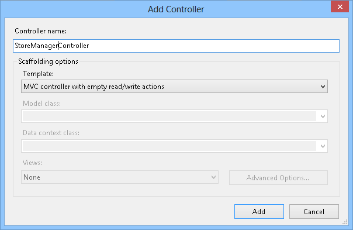

    *Add Controller Dialog*

    A new Controller class is generated. Since you indicated to add actions for read/write, stub methods for those, common CRUD actions are created with TODO comments filled in, prompting to include the application specific logic.

#### Task 2 - Customizing the StoreManager Index

In this task, you will customize the StoreManager Index action method to return a View with the list of albums from the database.

1. In the StoreManagerController class, add the following *using* directives.

    (Code Snippet - *ASP.NET MVC 4 Helpers and Forms and Validation - Ex1 using MvcMusicStore*)

    [!code-csharp[Main](aspnet-mvc-4-helpers-forms-and-validation/samples/sample1.cs)]
2. Add a field to the **StoreManagerController** to hold an instance of **MusicStoreEntities.**

    (Code Snippet - *ASP.NET MVC 4 Helpers and Forms and Validation - Ex1 MusicStoreEntities*)

    [!code-csharp[Main](aspnet-mvc-4-helpers-forms-and-validation/samples/sample2.cs)]
3. Implement the StoreManagerController Index action to return a View with the list of albums.

    The Controller action logic will be very similar to the StoreController's Index action written earlier. Use LINQ to retrieve all albums, including Genre and Artist information for display.

    (Code Snippet - *ASP.NET MVC 4 Helpers and Forms and Validation - Ex1 StoreManagerController Index*)

    [!code-csharp[Main](aspnet-mvc-4-helpers-forms-and-validation/samples/sample3.cs)]

#### Task 3 - Creating the Index View

In this task, you will create the Index View template to display the list of albums returned by the **StoreManager** Controller.

1. Before creating the new View template, you should build the project so that the **Add View Dialog** knows about the **Album** class to use. Select **Build | Build MvcMusicStore** to build the project.
2. Right-click inside the **Index** action method and select **Add View**. This will bring up the **Add View** dialog.

    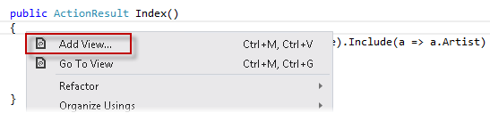

    *Adding a View from within the Index method*
3. In the Add View dialog, verify that the View Name is **Index**. Select the **Create a strongly-typed view** option, and select **Album (MvcMusicStore.Models)** from the **Model class** drop-down. Select **List** from the **Scaffold template** drop-down. Leave the **View engine** to **Razor** and the other fields with their default value and then click **Add**.

    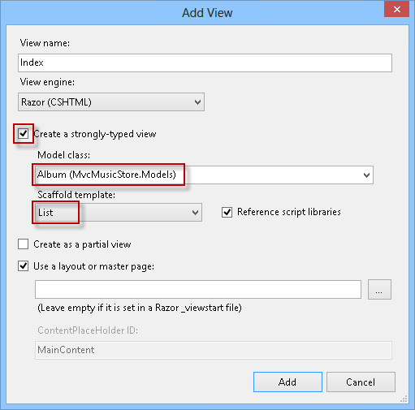

    *Adding an Index View*

#### Task 4 - Customizing the scaffold of the Index View

In this task, you will adjust the simple View template created with ASP.NET MVC scaffolding feature to have it display the fields you want.

> [!NOTE]
> The **scaffolding** support within ASP.NET MVC generates a simple View template which lists all fields in the Album model. **Scaffolding** provides a quick way to get started on a strongly typed view: rather than having to write the View template manually, scaffolding quickly generates a default template and then you can modify the generated code.

1. Review the code created. The generated list of fields will be part of the following HTML table that **Scaffolding** is using for displaying tabular data.

    [!code-cshtml[Main](aspnet-mvc-4-helpers-forms-and-validation/samples/sample4.cshtml)]
2. Replace the **&lt;table&gt;** code with the following code to display only the **Genre**, **Artist**, **Album Title**, and **Price** fields. This deletes the **AlbumId** and **Album Art URL** columns. Also, it changes GenreId and ArtistId columns to display their linked class properties of **Artist.Name** and **Genre.Name**, and removes the **Details** link.

    [!code-cshtml[Main](aspnet-mvc-4-helpers-forms-and-validation/samples/sample5.cshtml)]
3. Change the following descriptions.

    [!code-cshtml[Main](aspnet-mvc-4-helpers-forms-and-validation/samples/sample6.cshtml)]

#### Task 5 - Running the Application

In this task, you will test that the **StoreManager** **Index** View template displays a list of albums according to the design of the previous steps.

1. Press **F5** to run the Application.
2. The project starts in the Home page. Change the URL to **/StoreManager** to verify that a list of albums is displayed, showing their **Title**, **Artist** and **Genre**.

    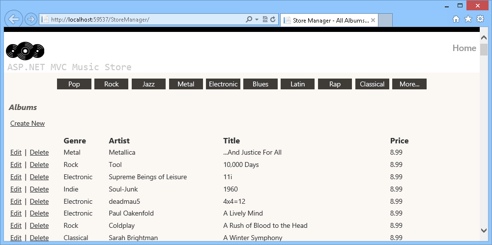

    *Browsing the list of albums*

### Exercise 2: Adding an HTML Helper

The StoreManager Index page has one potential issue: Title and Artist Name properties can both be long enough to throw off the table formatting. In this exercise you will learn how to add a custom HTML helper to truncate that text.

In the following figure, you can see how the format is modified because of the length of the text when you use a small browser size.

*Browsing the list of Albums with not truncated text*

#### Task 1 - Extending the HTML Helper

In this task, you will add a new method **Truncate** to the **HTML** object exposed within ASP.NET MVC Views. To do this, you will implement an **extension method** to the built-in **System.Web.Mvc.HtmlHelper** class provided by ASP.NET MVC.

> [!NOTE]
> To read more about **Extension Methods**, please visit this msdn article. [https://msdn.microsoft.com/en-us/library/bb383977.aspx](https://msdn.microsoft.com/en-us/library/bb383977.aspx).

1. Open the **Begin** solution located at **Source/Ex2-AddingAnHTMLHelper/Begin/** folder. Otherwise, you might continue using the **End** solution obtained by completing the previous exercise.

    1. If you opened the provided **Begin** solution, you will need to download some missing NuGet packages before continue. To do this, click the **Project** menu and select **Manage NuGet Packages**.
    2. In the **Manage NuGet Packages** dialog, click **Restore** in order to download missing packages.
    3. Finally, build the solution by clicking **Build** | **Build Solution**.

    > [!NOTE]
    > One of the advantages of using NuGet is that you don't have to ship all the libraries in your project, reducing the project size. With NuGet Power Tools, by specifying the package versions in the Packages.config file, you will be able to download all the required libraries the first time you run the project. This is why you will have to run these steps after you open an existing solution from this lab.
2. Open StoreManager's Index View. To do this, in the Solution Explorer expand the **Views** folder, then the **StoreManager** and open the **Index.cshtml** file.
3. Add the following code below the **@model** directive to define the **Truncate** helper method.

    [!code-cshtml[Main](aspnet-mvc-4-helpers-forms-and-validation/samples/sample7.cshtml)]

#### Task 2 - Truncating Text in the Page

In this task, you will use the **Truncate** method to truncate the text in the View template.

1. Open StoreManager's Index View. To do this, in the Solution Explorer expand the **Views** folder, then the **StoreManager** and open the **Index.cshtml** file.
2. Replace the lines that show the **Artist Name** and Album's **Title**. To do this, replace the following lines.

    [!code-cshtml[Main](aspnet-mvc-4-helpers-forms-and-validation/samples/sample8.cshtml)]

#### Task 3 - Running the Application

In this task, you will test that the **StoreManager** **Index** View template truncates the Album's Title and Artist Name.

1. Press **F5** to run the Application.
2. The project starts in the Home page. Change the URL to **/StoreManager** to verify that long texts in the **Title** and **Artist** column are truncated.

    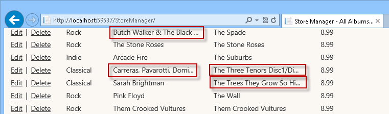

    *Truncated Titles and Artist Names*

### Exercise 3: Creating the Edit View

In this exercise, you will learn how to create a form to allow store managers to edit an Album. They will browse the **/StoreManager/Edit/id** URL (**id** being the unique id of the album to edit), thus making an HTTP-GET call to the server.

The Controller Edit action method will retrieve the appropriate Album from the database, create a **StoreManagerViewModel** object to encapsulate it (along with a list of Artists and Genres), and then pass it off to a View template to render the HTML page back to the user. This page will contain a **&lt;form&gt;** element with textboxes and dropdowns for editing the Album properties.

Once the user updates the Album form values and clicks the **Save** button, the changes are submitted via an HTTP-POST call back to **/StoreManager/Edit/id**. Although the URL remains the same as in the last call, ASP.NET MVC identifies that this time it is an HTTP-POST and therefore executes a different Edit action method (one decorated with **[HttpPost]**).

#### Task 1 - Implementing the HTTP-GET Edit Action Method

In this task, you will implement the HTTP-GET version of the Edit action method to retrieve the appropriate Album from the database, as well as a list of all Genres and Artists. It will package this data up into the **StoreManagerViewModel** object defined in the last step, which will then be passed to a View template to render the response with.

1. Open the **Begin** solution located at **Source/Ex3-CreatingTheEditView/Begin/** folder. Otherwise, you might continue using the **End** solution obtained by completing the previous exercise.

    1. If you opened the provided **Begin** solution, you will need to download some missing NuGet packages before continue. To do this, click the **Project** menu and select **Manage NuGet Packages**.
    2. In the **Manage NuGet Packages** dialog, click **Restore** in order to download missing packages.
    3. Finally, build the solution by clicking **Build** | **Build Solution**.

    > [!NOTE]
    > One of the advantages of using NuGet is that you don't have to ship all the libraries in your project, reducing the project size. With NuGet Power Tools, by specifying the package versions in the Packages.config file, you will be able to download all the required libraries the first time you run the project. This is why you will have to run these steps after you open an existing solution from this lab.
2. Open the **StoreManagerController** class. To do this, expand the **Controllers** folder and double-click **StoreManagerController.cs**.
3. Replace the **HTTP-GET Edit** action method with the following code to retrieve the appropriate **Album** as well as the **Genres** and **Artists** lists.

    (Code Snippet - *ASP.NET MVC 4 Helpers and Forms and Validation - Ex3 StoreManagerController HTTP-GET Edit action*)

    [!code-csharp[Main](aspnet-mvc-4-helpers-forms-and-validation/samples/sample9.cs)]

    > [!NOTE]
    > You are using **System.Web.Mvc** **SelectList** for Artists and Genres instead of the **System.Collections.Generic** List.
    > 
    > **SelectList** is a cleaner way to populate HTML dropdowns and manage things like current selection. Instantiating and later setting up these ViewModel objects in the controller action will make the Edit form scenario cleaner.

#### Task 2 - Creating the Edit View

In this task, you will create an Edit View template that will later display the album properties.

1. Create the Edit View. To do this, right-click inside the **Edit** action method and select **Add View**.
2. In the Add View dialog, verify that the View Name is **Edit**. Check the **Create a strongly-typed view** checkbox and select **Album (MvcMusicStore.Models)** from the **View data class** drop-down. Select **Edit** from the **Scaffold template** drop-down. Leave the other fields with their default value and then click **Add**.

    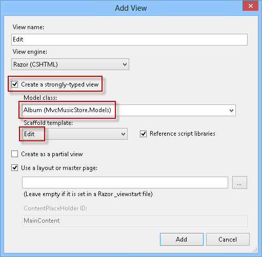

    *Adding an Edit view*

#### Task 3 - Running the Application

In this task, you will test that the **StoreManager** **Edit** View page displays the properties' values for the album passed as parameter.

1. Press **F5** to run the Application.
2. The project starts in the Home page. Change the URL to **/StoreManager/Edit/1** to verify that the properties' values for the album passed are displayed.

    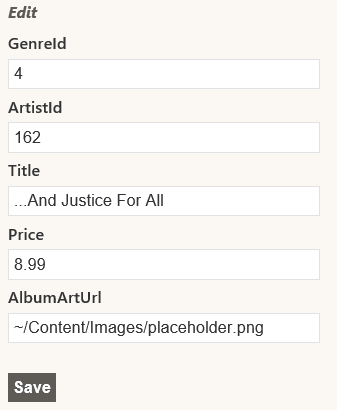

    *Browsing Album's Edit view*

#### Task 4 - Implementing drop-downs on the Album Editor Template

In this task, you will add drop-downs to the View template created in the last task, so that the user can select from a list of Artists and Genres.

1. Replace all the **Album** fieldset code with the following:

    [!code-cshtml[Main](aspnet-mvc-4-helpers-forms-and-validation/samples/sample10.cshtml)]

    > [!NOTE]
    > An **Html.DropDownList** helper has been added to render drop-downs for choosing Artists and Genres. The parameters passed to **Html.DropDownList** are:
    > 
    > 1. The name of the form field (**&quot;ArtistId&quot;**).
    > 2. The **SelectList** of values for the drop-down.

#### Task 5 - Running the Application

In this task, you will test that the **StoreManager** **Edit** View page displays drop-downs instead of Artist and Genre ID text fields.

1. Press **F5** to run the Application.
2. The project starts in the Home page. Change the URL to **/StoreManager/Edit/1** to verify that it displays drop-downs instead of Artist and Genre ID text fields.

    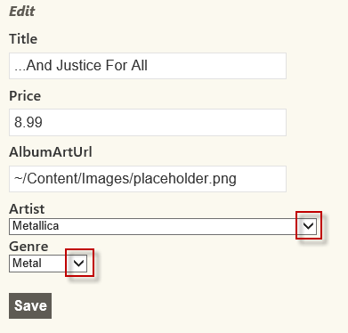

    *Browsing Album's Edit view, this time with dropdowns*

#### Task 6 - Implementing the HTTP-POST Edit action method

Now that the Edit View displays as expected, you need to implement the HTTP-POST Edit Action method to save the changes made to the Album.

1. Close the browser if needed, to return to the Visual Studio window. Open **StoreManagerController** from the **Controllers** folder.
2. Replace **HTTP-POST Edit** action method code with the following (note that the method that must be replaced is overloaded version that receives two parameters):

    (Code Snippet - *ASP.NET MVC 4 Helpers and Forms and Validation - Ex3 StoreManagerController HTTP-POST Edit action*)

    [!code-csharp[Main](aspnet-mvc-4-helpers-forms-and-validation/samples/sample11.cs)]

    > [!NOTE]
    > This method will be executed when the user clicks the **Save** button of the View and performs an HTTP-POST of the form values back to the server to persist them in the database. The decorator **[HttpPost]** indicates that the method should be used for those HTTP-POST scenarios. The method takes an **Album** object. ASP.NET MVC will automatically create the Album object from the posted &lt;form&gt; values.
    > 
    > The method will perform these steps:
    > 
    > 1. If model is valid:
    > 
    >     1. Update the album entry in the context to mark it as a modified object.
    >     2. Save the changes and redirect to the index view.
    > 2. If the model is not valid, it will populate the ViewBag with the **GenreId** and **ArtistId**, then it will return the view with the received Album object to allow the user perform any required update.

#### Task 7 - Running the Application

In this task, you will test that the **StoreManager Edit** View page actually saves the updated Album data in the database.

1. Press **F5** to run the Application.
2. The project starts in the Home page. Change the URL to **/StoreManager/Edit/1**. Change the Album title to **Load** and click on **Save**. Verify that album's title actually changed in the list of albums.

    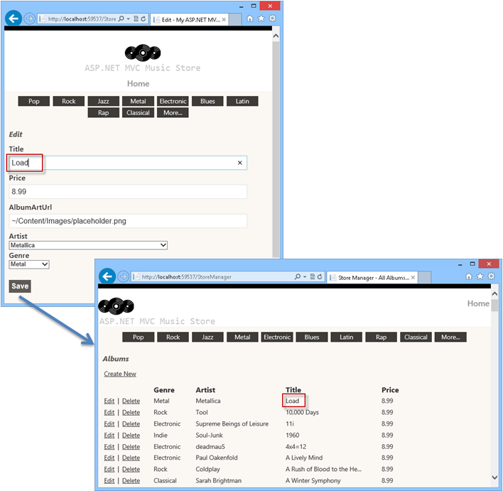

    *Updating an Album*

### Exercise 4: Adding a Create View

Now that the **StoreManagerController** supports the **Edit** ability, in this exercise you will learn how to add a Create View template to let store managers add new Albums to the application.

Like you did with the Edit functionality, you will implement the Create scenario using two separate methods within the **StoreManagerController** class:

1. One action method will display an empty form when store managers first visit the **/StoreManager/Create** URL.
2. A second action method will handle the scenario where the store manager clicks the **Save** button within the form and submits the values back to the **/StoreManager/Create** URL as an HTTP-POST.

#### Task 1 - Implementing the HTTP-GET Create action method

In this task, you will implement the HTTP-GET version of the Create action method to retrieve a list of all Genres and Artists, package this data up into a **StoreManagerViewModel** object, which will then be passed to a View template.

1. Open the **Begin** solution located at **Source/Ex4-AddingACreateView/Begin/** folder. Otherwise, you might continue using the **End** solution obtained by completing the previous exercise.

    1. If you opened the provided **Begin** solution, you will need to download some missing NuGet packages before continue. To do this, click the **Project** menu and select **Manage NuGet Packages**.
    2. In the **Manage NuGet Packages** dialog, click **Restore** in order to download missing packages.
    3. Finally, build the solution by clicking **Build** | **Build Solution**.

    > [!NOTE]
    > One of the advantages of using NuGet is that you don't have to ship all the libraries in your project, reducing the project size. With NuGet Power Tools, by specifying the package versions in the Packages.config file, you will be able to download all the required libraries the first time you run the project. This is why you will have to run these steps after you open an existing solution from this lab.
2. Open **StoreManagerController** class. To do this, expand the **Controllers** folder and double-click **StoreManagerController.cs**.
3. Replace the **Create** action method code with the following:

    (Code Snippet - *ASP.NET MVC 4 Helpers and Forms and Validation - Ex4 StoreManagerController HTTP-GET Create action*)

    [!code-csharp[Main](aspnet-mvc-4-helpers-forms-and-validation/samples/sample12.cs)]

#### Task 2 - Adding the Create View

In this task, you will add the Create View template that will display a new (empty) Album form.

1. Right-click inside the **Create** action method and select **Add View**. This will bring up the Add View dialog.
2. In the Add View dialog, verify that the View Name is **Create**. Select the **Create a strongly-typed view** option and select **Album (MvcMusicStore.Models)** from the **Model class** drop-down and **Create** from the **Scaffold template** drop-down. Leave the other fields with their default value and then click **Add**.

    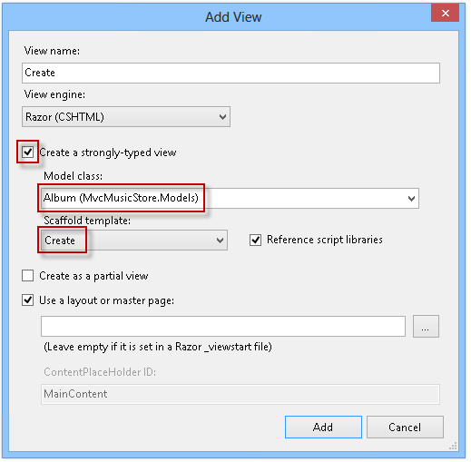

    *Adding the Create View*
3. Update the **GenreId** and **ArtistId** fields to use a drop-down list as shown below:

    [!code-cshtml[Main](aspnet-mvc-4-helpers-forms-and-validation/samples/sample13.cshtml)]

#### Task 3 - Running the Application

In this task, you will test that the **StoreManager** **Create** View page displays an empty Album form.

1. Press **F5** to run the Application.
2. The project starts in the Home page. Change the URL to **/StoreManager/Create**. Verify that an empty form is displayed for filling the new Album properties.

    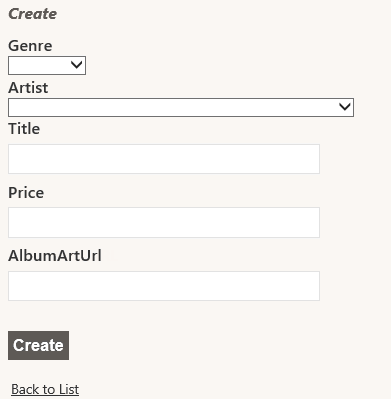

    *Create View with an empty form*

#### Task 4 - Implementing the HTTP-POST Create Action Method

In this task, you will implement the HTTP-POST version of the Create action method that will be invoked when a user clicks the **Save** button. The method should save the new album in the database.

1. Close the browser if needed, to return to the Visual Studio window. Open **StoreManagerController** class. To do this, expand the **Controllers** folder and double-click **StoreManagerController.cs**.
2. Replace **HTTP-POST Create** action method code with the following:

    (Code Snippet - *ASP.NET MVC 4 Helpers and Forms and Validation - Ex4 StoreManagerController HTTP- POST Create action*)

    [!code-csharp[Main](aspnet-mvc-4-helpers-forms-and-validation/samples/sample14.cs)]

    > [!NOTE]
    > The Create action is pretty similar to the previous Edit action method but instead of setting the object as modified, it is being added to the context.

#### Task 5 - Running the Application

In this task, you will test that the **StoreManager Create** View page lets you create a new Album and then redirects to the StoreManager Index View.

1. Press **F5** to run the Application.
2. The project starts in the Home page. Change the URL to **/StoreManager/Create**. Fill all the form fields with data for a new Album, like the one in the following figure:

    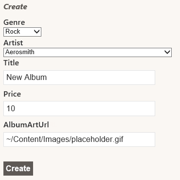

    *Creating an Album*
3. Verify that you get redirected to the StoreManager Index View that includes the new Album just created.

    

    *New Album Created*

### Exercise 5: Handling Deletion

The ability to delete albums is not yet implemented. This is what this exercise will be about. Like before, you will implement the Delete scenario using two separate methods within the **StoreManagerController** class:

1. One action method will display a confirmation form
2. A second action method will handle the form submission

#### Task 1 - Implementing the HTTP-GET Delete Action Method

In this task, you will implement the HTTP-GET version of the Delete action method to retrieve the album's information.

1. Open the **Begin** solution located at **Source/Ex5-HandlingDeletion/Begin/** folder. Otherwise, you might continue using the **End** solution obtained by completing the previous exercise.

    1. If you opened the provided **Begin** solution, you will need to download some missing NuGet packages before continue. To do this, click the **Project** menu and select **Manage NuGet Packages**.
    2. In the **Manage NuGet Packages** dialog, click **Restore** in order to download missing packages.
    3. Finally, build the solution by clicking **Build** | **Build Solution**.

    > [!NOTE]
    > One of the advantages of using NuGet is that you don't have to ship all the libraries in your project, reducing the project size. With NuGet Power Tools, by specifying the package versions in the Packages.config file, you will be able to download all the required libraries the first time you run the project. This is why you will have to run these steps after you open an existing solution from this lab.
2. Open **StoreManagerController** class. To do this, expand the **Controllers** folder and double-click **StoreManagerController.cs**.
3. The Delete controller action is exactly the same as the previous Store Details controller action: it queries the **album** object from the database using the **id** provided in the URL and returns the appropriate **View**. To do this, replace the HTTP-GET **Delete** action method code with the following:

    (Code Snippet - *ASP.NET MVC 4 Helpers and Forms and Validation - Ex5 Handling Deletion HTTP-GET Delete action*)

    [!code-csharp[Main](aspnet-mvc-4-helpers-forms-and-validation/samples/sample15.cs)]
4. Right-click inside the **Delete** action method and select **Add View**. This will bring up the Add View dialog.
5. In the Add View dialog, verify that the View name is **Delete**. Select the **Create a strongly-typed view** option and select **Album (MvcMusicStore.Models)** from the **Model class** drop-down. Select **Delete** from the **Scaffold template** drop-down. Leave the other fields with their default value and then click **Add**.

    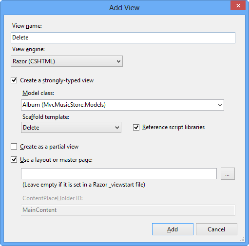

    *Adding a Delete View*
6. The Delete template shows all the fields from the model. You will show only the album's title. To do this, replace the content of the view with the following code:

    [!code-cshtml[Main](aspnet-mvc-4-helpers-forms-and-validation/samples/sample16.cshtml)]

#### Task 2 - Running the Application

In this task, you will test that the **StoreManager** **Delete** View page displays a confirmation deletion form.

1. Press **F5** to run the Application.
2. The project starts in the Home page. Change the URL to **/StoreManager**. Select one album to delete by clicking **Delete** and verify that the new view is uploaded.

    

    *Deleting an Album*

#### Task 3- Implementing the HTTP-POST Delete Action Method

In this task, you will implement the HTTP-POST version of the Delete action method that will be invoked when a user clicks the **Delete** button. The method should delete the album in the database.

1. Close the browser if needed, to return to the Visual Studio window. Open **StoreManagerController** class. To do this, expand the **Controllers** folder and double-click **StoreManagerController.cs**.
2. Replace **HTTP-POST Delete** action method code with the following:

    (Code Snippet - *ASP.NET MVC 4 Helpers and Forms and Validation - Ex5 Handling Deletion HTTP-POST Delete action*)

    [!code-csharp[Main](aspnet-mvc-4-helpers-forms-and-validation/samples/sample17.cs)]

#### Task 4 - Running the Application

In this task, you will test that the **StoreManager Delete** View page lets you delete an Album and then redirects to the StoreManager Index View.

1. Press **F5** to run the Application.
2. The project starts in the Home page. Change the URL to **/StoreManager**. Select one album to delete by clicking **Delete.** Confirm the deletion by clicking **Delete** button:

    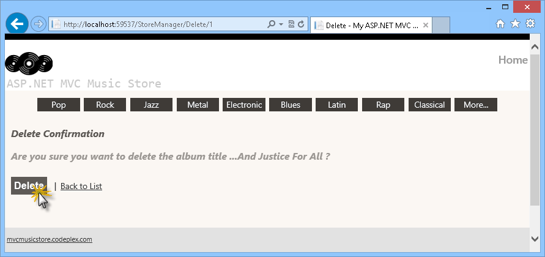

    *Deleting an Album*
3. Verify that the album was deleted since it does not appear in the **Index** page.

### Exercise 6: Adding Validation

Currently, the Create and Edit forms you have in place do not perform any kind of validation. If the user leaves a required field blank or type letters in the price field, the first error you will get will be from the database.

You can add validation to the application by adding Data Annotations to your model class. Data Annotations allow describing the rules you want applied to your model properties, and ASP.NET MVC will take care of enforcing and displaying appropriate message to users.

#### Task 1 - Adding Data Annotations

In this task, you will add Data Annotations to the Album Model that will make the Create and Edit page display validation messages when appropriate.

For a simple Model class, adding a Data Annotation is just handled by adding a **using** statement for **System.ComponentModel.DataAnnotation**, then placing a **[Required]** attribute on the appropriate properties. The following example would make the **Name** property a required field in the View.

[!code-csharp[Main](aspnet-mvc-4-helpers-forms-and-validation/samples/sample18.cs)]

This is a little more complex in cases like this application where the Entity Data Model is generated. If you added Data Annotations directly to the model classes, they would be overwritten if you update the model from the database. Instead, you can make use of metadata partial classes which will exist to hold the annotations and are associated with the model classes using the **[MetadataType]** attribute.

1. Open the **Begin** solution located at **Source/Ex6-AddingValidation/Begin/** folder. Otherwise, you might continue using the **End** solution obtained by completing the previous exercise.

    1. If you opened the provided **Begin** solution, you will need to download some missing NuGet packages before continue. To do this, click the **Project** menu and select **Manage NuGet Packages**.
    2. In the **Manage NuGet Packages** dialog, click **Restore** in order to download missing packages.
    3. Finally, build the solution by clicking **Build** | **Build Solution**.

    > [!NOTE]
    > One of the advantages of using NuGet is that you don't have to ship all the libraries in your project, reducing the project size. With NuGet Power Tools, by specifying the package versions in the Packages.config file, you will be able to download all the required libraries the first time you run the project. This is why you will have to run these steps after you open an existing solution from this lab.
2. Open the **Album.cs** from the **Models** folder.
3. Replace **Album.cs** content with the highlighted code, so that it looks like the following:

    > [!NOTE]
    > The line **[DisplayFormat(ConvertEmptyStringToNull=false)]** indicates that empty strings from the model won't be converted to null when the data field is updated in the data source. This setting will avoid an exception when the Entity Framework assigns null values to the model before Data Annotation validates the fields.

    (Code Snippet - *ASP.NET MVC 4 Helpers and Forms and Validation - Ex6 Album metadata partial class*)

    [!code-csharp[Main](aspnet-mvc-4-helpers-forms-and-validation/samples/sample19.cs)]

    > [!NOTE]
    > This **Album** partial class has a **MetadataType** attribute which points to the **AlbumMetaData** class for the Data Annotations. These are some of the Data Annotation attributes you are using to annotate the Album model:
    > 
    > - Required - Indicates that the property is a required field
    > - DisplayName - Defines the text to be used on form fields and validation messages
    > - DisplayFormat - Specifies how data fields are displayed and formatted.
    > - StringLength - Defines a maximum length for a string field
    > - Range - Gives a maximum and minimum value for a numeric field
    > - ScaffoldColumn - Allows hiding fields from editor forms

#### Task 2 - Running the Application

In this task, you will test that the Create and Edit pages validate fields, using the display names chosen in the last task.

1. Press **F5** to run the Application.
2. The project starts in the Home page. Change the URL to **/StoreManager/Create**. Verify that the display names match the ones in the partial class (like **Album Art URL** instead of **AlbumArtUrl**)
3. Click **Create**, without filling the form. Verify that you get the corresponding validation messages.

    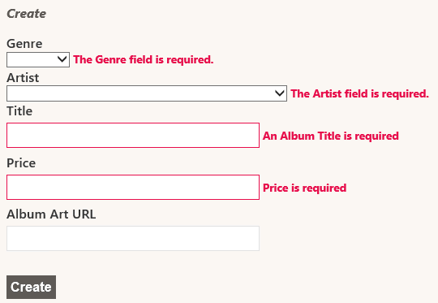

    *Validated fields in the Create page*
4. You can verify that the same occurs with the **Edit** page. Change the URL to **/StoreManager/Edit/1** and verify that the display names match the ones in the partial class (like **Album Art URL** instead of **AlbumArtUrl**). Empty the **Title** and **Price** fields and click **Save**. Verify that you get the corresponding validation messages.

    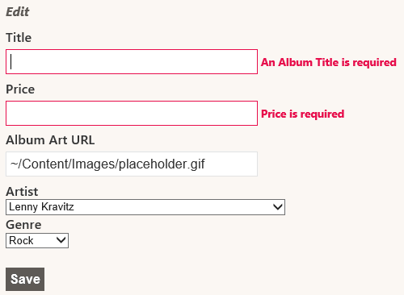

    *Validated fields in the Edit page*

### Exercise 7: Using Unobtrusive jQuery at Client Side

In this exercise, you will learn how to enable MVC 4 Unobtrusive jQuery validation at client side.

> [!NOTE]
> The Unobtrusive jQuery uses data-ajax prefix JavaScript to invoke action methods on the server rather than intrusively emitting inline client scripts.

#### Task 1 - Running the Application before Enabling Unobtrusive jQuery

In this task, you will run the application before including jQuery in order to compare both validation models.

1. Open the **Begin** solution located at **Source/Ex7-UnobtrusivejQueryValidation/Begin/** folder. Otherwise, you might continue using the **End** solution obtained by completing the previous exercise.

    1. If you opened the provided **Begin** solution, you will need to download some missing NuGet packages before continue. To do this, click the **Project** menu and select **Manage NuGet Packages**.
    2. In the **Manage NuGet Packages** dialog, click **Restore** in order to download missing packages.
    3. Finally, build the solution by clicking **Build** | **Build Solution**.

    > [!NOTE]
    > One of the advantages of using NuGet is that you don't have to ship all the libraries in your project, reducing the project size. With NuGet Power Tools, by specifying the package versions in the Packages.config file, you will be able to download all the required libraries the first time you run the project. This is why you will have to run these steps after you open an existing solution from this lab.
2. Press **F5** to run the application.
3. The project starts in the Home page. Browse **/StoreManager/Create** and click **Create** without filling the form to verify that you get validation messages:

    

    *Client validation disabled*
4. In the browser, open the HTML source code:

    [!code-html[Main](aspnet-mvc-4-helpers-forms-and-validation/samples/sample20.html)]

#### Task 2 - Enabling Unobtrusive Client Validation

In this task, you will enable jQuery **unobtrusive client validation** from **Web.config** file, which is by default set to false in all new ASP.NET MVC 4 projects. Additionally, you will add the necessary scripts references to make jQuery Unobtrusive Client Validation work.

1. Open **Web.Config** file at project root, and make sure that the **ClientValidationEnabled** and **UnobtrusiveJavaScriptEnabled** keys values are set to **true**.

    [!code-xml[Main](aspnet-mvc-4-helpers-forms-and-validation/samples/sample21.xml)]

    > [!NOTE]
    > You can also enable client validation by code at Global.asax.cs to get the same results:
    > 
    > **HtmlHelper.ClientValidationEnabled = true;**
    > 
    > Additionally, you can assign ClientValidationEnabled attribute into any controller to have a custom behavior.
2. Open **Create.cshtml** at **Views\StoreManager**.
3. Make sure the following script files, **jquery.validate** and **jquery.validate.unobtrusive**, are referenced in the view throught the &quot;**~/bundles/jqueryval**&quot; bundle.

    [!code-cshtml[Main](aspnet-mvc-4-helpers-forms-and-validation/samples/sample22.cshtml)]

    > [!NOTE]
    > All these jQuery libraries are included in MVC 4 new projects. You can find more libraries in the **/Scripts** folder of you project.
    > 
    > In order to make this validation libraries work, you need to add a reference to the jQuery framework library. Since this reference is already added in the **\_Layout.cshtml** file, you do not need to add it in this particular view.

#### Task 3 - Running the Application Using Unobtrusive jQuery Validation

In this task, you will test that the **StoreManager** create view template performs client side validation using jQuery libraries when the user creates a new album.

1. Press **F5** to run the application.
2. The project starts in the Home page. Browse **/StoreManager/Create** and click **Create** without filling the form to verify that you get validation messages:

    

    *Client validation with jQuery enabled*
3. In the browser, open the source code for Create view:

    [!code-html[Main](aspnet-mvc-4-helpers-forms-and-validation/samples/sample23.html)]

    > [!NOTE]
    > For each client validation rule, Unobtrusive jQuery adds an attribute with data-val-*rulename*=&quot;*message*&quot;. Below is a list of tags that Unobtrusive jQuery inserts into the html input field to perform client validation:
    > 
    > - Data-val
    > - Data-val-number
    > - Data-val-range
    > - Data-val-range-min / Data-val-range-max
    > - Data-val-required
    > - Data-val-length
    > - Data-val-length-max / Data-val-length-min
    > 
    > All the data values are filled with model **Data Annotation**. Then, all the logic that works at server side can be run at client side. For example, Price attribute has the following data annotation in the model:
    > 
    > [!code-csharp[Main](aspnet-mvc-4-helpers-forms-and-validation/samples/sample24.cs)]
    > 
    > After using Unobtrusive jQuery, the generated code is:
    >  
    > [!code-html[Main](aspnet-mvc-4-helpers-forms-and-validation/samples/sample25.html)]

* * *

## Summary

By completing this Hands-On Lab you have learned how to enable users to change the data stored in the database with the use of the following:

- Controller actions like Index, Create, Edit, Delete
- ASP.NET MVC's scaffolding feature for displaying properties in an HTML table
- Custom HTML helpers to improve user experience
- Action methods that react to either HTTP-GET or HTTP-POST calls
- A shared editor template for similar View templates like Create and Edit
- Form elements like drop-downs
- Data annotations for Model validation
- Client Side Validation using jQuery Unobtrusive library

## Appendix A: Installing Visual Studio Express 2012 for Web

You can install **Microsoft Visual Studio Express 2012 for Web** or another &quot;Express&quot; version using the **[Microsoft Web Platform Installer](https://www.microsoft.com/web/downloads/platform.aspx)**. The following instructions guide you through the steps required to install *Visual studio Express 2012 for Web* using *Microsoft Web Platform Installer*.

1. Go to [[https://go.microsoft.com/?linkid=9810169](https://go.microsoft.com/?linkid=9810169)](https://go.microsoft.com/?linkid=9810169). Alternatively, if you already have installed Web Platform Installer, you can open it and search for the product &quot;*Visual Studio Express 2012 for Web with Windows Azure SDK*&quot;.
2. Click on **Install Now**. If you do not have **Web Platform Installer** you will be redirected to download and install it first.
3. Once **Web Platform Installer** is open, click **Install** to start the setup.

    

    *Install Visual Studio Express*
4. Read all the products' licenses and terms and click **I Accept** to continue.

    

    *Accepting the license terms*
5. Wait until the downloading and installation process completes.

    

    *Installation progress*
6. When the installation completes, click **Finish**.

    

    *Installation completed*
7. Click **Exit** to close Web Platform Installer.
8. To open Visual Studio Express for Web, go to the **Start** screen and start writing &quot;**VS Express**&quot;, then click on the **VS Express for Web** tile.

    

    *VS Express for Web tile*

## Appendix B: Using Code Snippets

With code snippets, you have all the code you need at your fingertips. The lab document will tell you exactly when you can use them, as shown in the following figure.

*Using Visual Studio code snippets to insert code into your project*

***To add a code snippet using the keyboard (C# only)***

1. Place the cursor where you would like to insert the code.
2. Start typing the snippet name (without spaces or hyphens).
3. Watch as IntelliSense displays matching snippets' names.
4. Select the correct snippet (or keep typing until the entire snippet's name is selected).
5. Press the Tab key twice to insert the snippet at the cursor location.

*Start typing the snippet name*

*Press Tab to select the highlighted snippet*

*Press Tab again and the snippet will expand*

***To add a code snippet using the mouse (C#, Visual Basic and XML)*** 1. Right-click where you want to insert the code snippet.

1. Select **Insert Snippet** followed by **My Code Snippets**.
2. Pick the relevant snippet from the list, by clicking on it.

*Right-click where you want to insert the code snippet and select Insert Snippet*

*Pick the relevant snippet from the list, by clicking on it*