ASP.NET MVC 4 Models and Data Access
====================
by [Web Camps Team](https://twitter.com/webcamps)

> [!NOTE]
> This Hands-on Lab assumes you have basic knowledge of **ASP.NET MVC**. If you have not used **ASP.NET MVC** before, we recommend you to go over **ASP.NET MVC 4 Fundamentals** Hands-on Lab.
> 
> This lab walks you through the enhancements and new features previously described by applying minor changes to a sample Web application provided in the Source folder.
> 
> All sample code and snippets are included in the Web Camps Training Kit, available at [https://www.microsoft.com/en-us/download/29843](https://www.microsoft.com/en-us/download/29843).

In **ASP.NET MVC Fundamentals** Hands-on Lab, you have been passing hard-coded data from the Controllers to the View templates. But, in order to build a real Web application, you might want to use a real database.

This Hands-on Lab will show you how to use a database engine in order to store and retrieve the data needed for the Music Store application. To accomplish that, you will start with an existing database and create the Entity Data Model from it. Throughout this lab, you will meet the **Database First** approach as well as the **Code First** approach.

However, you can also use the **Model First** approach, create the same model using the tools, and then generate the database from it.

*Database First vs. Model First*

After generating the Model, you will make the proper adjustments in the StoreController to provide the Store Views with the data taken from the database, instead of using hard-coded data. You will not need to make any change to the View templates because the StoreController will be returning the same ViewModels to the View templates, although this time the data will come from the database.

**The Code First Approach**

The Code First approach allows us to define the model from the code without generating classes that are generally coupled with the framework.

In code first, model objects are defined with POCOs, &quot;Plain Old CLR Objects&quot;. POCOs are simple plain classes that have no inheritance and do not implement interfaces. We can automatically generate the database from them, or we can use an existing database and generate the class mapping from the code.

The benefits of using this approach is that the Model remains independent from the persistence framework (in this case, Entity Framework), as the POCOs classes are not coupled with the mapping framework.

> [!NOTE]
> This Lab is based on ASP.NET MVC 4 and a version of the Music Store sample application customized and minimized to fit only the features shown in this Hands-On Lab.
> 
> If you wish to explore the whole **Music Store** tutorial application you can find it in [[http://mvcmusicstore.codeplex.com/](http://mvcmusicstore.codeplex.com/)](http://mvcmusicstore.codeplex.com/).

### Prerequisites

You must have the following items to complete this lab:

- [Microsoft Visual Studio Express 2012 for Web](https://www.microsoft.com/visualstudio/eng/products/visual-studio-express-for-web) or superior (read [Appendix A](#AppendixA) for instructions on how to install it).

### Setup

**Installing Code Snippets**

For convenience, much of the code you will be managing along this lab is available as Visual Studio code snippets. To install the code snippets run **.\Source\Setup\CodeSnippets.vsi** file.

If you are not familiar with the Visual Studio Code Snippets, and want to learn how to use them, you can refer to the appendix from this document &quot;[Appendix C: Using Code Snippets](#AppendixC)&quot;.

* * *

## Exercises

This Hands-on Lab is comprised by the following exercises:

1. [Exercise 1: Adding a Database](#Exercise1)
2. [Exercise 2: Creating a Database using Code First](#Exercise2)
3. [Exercise 3: Querying the Database with Parameters](#Exercise3)

> [!NOTE]
> Each exercise is accompanied by an **End** folder containing the resulting solution you should obtain after completing the exercises. You can use this solution as a guide if you need additional help working through the exercises.

Estimated time to complete this lab: **35 minutes**.

### Exercise 1: Adding a Database

In this exercise, you will learn how to add a database with the tables of the MusicStore application to the solution in order to consume its data. Once the database is generated with the model, and added to the solution, you will modify the StoreController class to provide the View template with the data taken from the database, instead of using hard-coded values.

#### Task 1 - Adding a Database

In this task, you will add an already created database with the main tables of the MusicStore application to the solution.

1. Open the **Begin** solution located at **Source/Ex1-AddingADatabaseDBFirst/Begin/** folder.

    1. You will need to download some missing NuGet packages before continue. To do this, click the **Project** menu and select **Manage NuGet Packages**.
    2. In the **Manage NuGet Packages** dialog, click **Restore** in order to download missing packages.
    3. Finally, build the solution by clicking **Build** | **Build Solution**.

    > [!NOTE]
    > One of the advantages of using NuGet is that you don't have to ship all the libraries in your project, reducing the project size. With NuGet Power Tools, by specifying the package versions in the Packages.config file, you will be able to download all the required libraries the first time you run the project. This is why you will have to run these steps after you open an existing solution from this lab.
2. Add **MvcMusicStore** database file. In this Hands-on Lab, you will use an already created database called **MvcMusicStore.mdf**. To do that, right-click **App\_Data** folder, point to **Add** and then click **Existing Item**. Browse to **\Source\Assets** and select the **MvcMusicStore.mdf** file.

    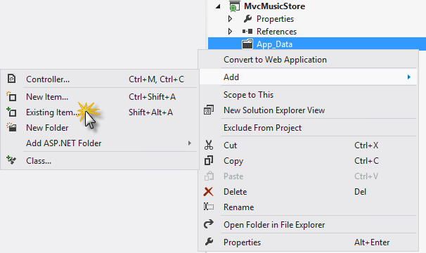

    *Adding an Existing Item*

    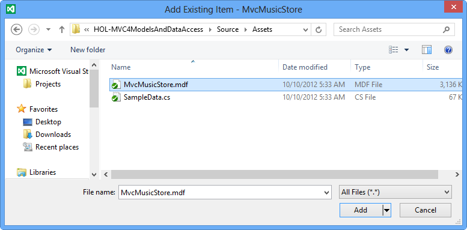

    *MvcMusicStore.mdf database file*

    The database has been added to the project. Even when the database is located inside the solution, you can query and update it as it was hosted in a different database server.

    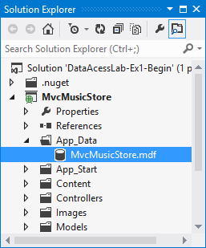

    *MvcMusicStore database in Solution Explorer*
3. Verify the connection to the database. To do this, double-click **MvcMusicStore.mdf** to establish a connection.

    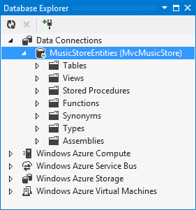

    *Connecting to MvcMusicStore.mdf*

#### Task 2 - Creating a Data Model

In this task, you will create a data model to interact with the database added in the previous task.

1. Create a data model that will represent the database. To do this, in Solution Explorer right-click the **Models** folder, point to **Add** and then click **New Item**. In the **Add New Item** dialog, select the **Data** template and then the **ADO.NET Entity Data Model** item. Change the data model name to **StoreDB.edmx** and click **Add**.

    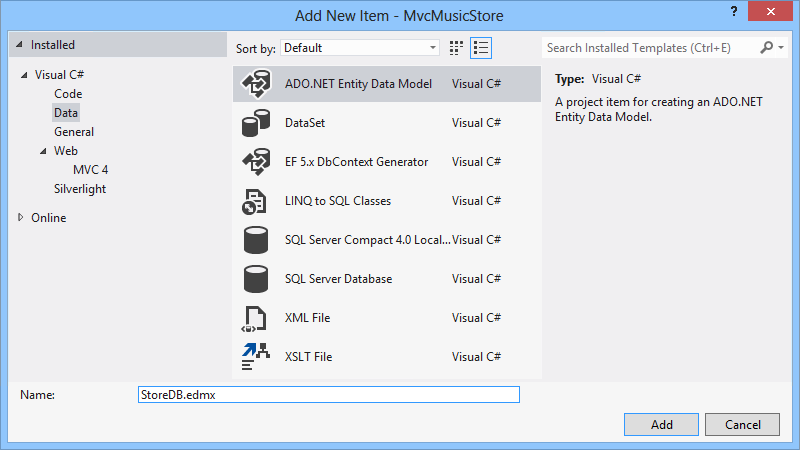

    *Adding the StoreDB ADO.NET Entity Data Model*
2. The **Entity Data Model Wizard** will appear. This wizard will guide you through the creation of the model layer. Since the model should be created based on the existing database recentyl added, select **Generate from database** and click **Next**.

    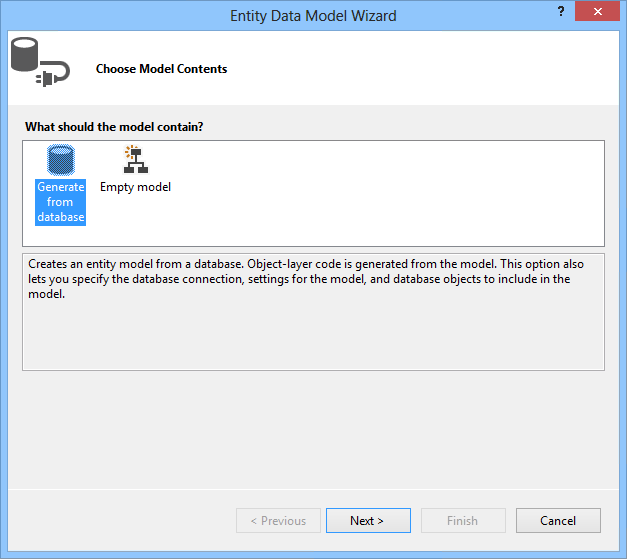

    *Choosing the model content*
3. Since you are generating a model from a database, you will need to specify the connection to use. Click **New Connection**.
4. Select **Microsoft SQL Server Database File** and click **Continue**.

    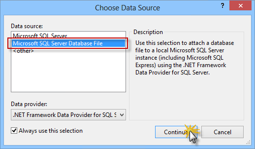

    *Choose data source dialog*
5. Click **Browse** and select the database **MvcMusicStore.mdf** you located in the **App\_Data** folder and click **OK**.

    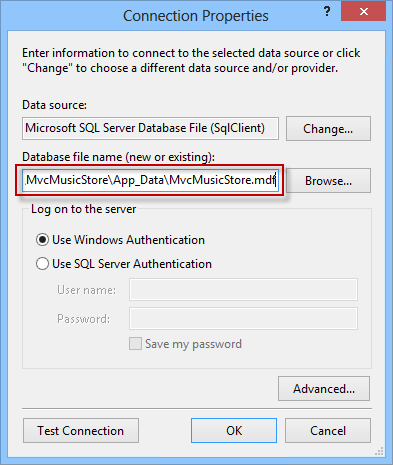

    *Connection properties*
6. The generated class should have the same name as the entity connection string, so change its name to **MusicStoreEntities** and click **Next**.

    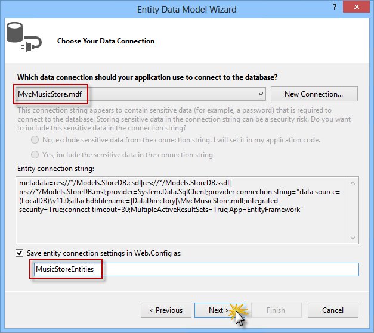

    *Choosing the data connection*
7. Choose the database objects to use. As the Entity Model will use just the database's tables, select the **Tables** option, and make sure that the **Include foreign key columns in the model** and **Pluralize or singularize generated object names** options are also selected. Change the Model Namespace to **MvcMusicStore.Model** and click **Finish**.

    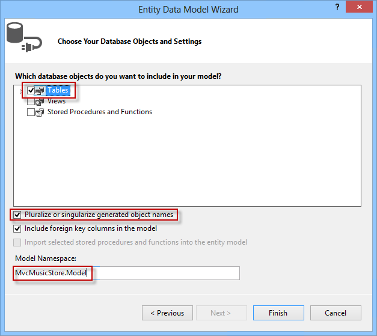

    *Choosing the database objects*

    > [!NOTE]
    > If a Security Warning dialog is shown, click **OK** to run the template and generate the classes for the model entities.
8. An entity diagram for the database will appear, while a separate class that maps each table to the database will be created. For example, the **Albums** table will be represented by an **Album** class, where each column in the table will map to a class property. This will allow you to query and work with objects that represent rows in the database.

    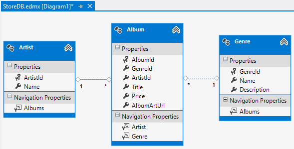

    *Entity diagram*

> [!NOTE]
> The T4 templates (.tt) run code to generate the entities classes and will overwrite the existing classes with the same name. In this example, the classes &quot;Album&quot;, &quot;Genre&quot; and &quot;Artist&quot; were overwritten with the generated code.

#### Task 3 - Building the Application

In this task, you will check that, although the model generation have removed the **Album**, **Genre** and **Artist** model classes, the project builds successfully by using the new data model classes.

1. Build the project by selecting the **Build** menu item and then **Build MvcMusicStore**.

    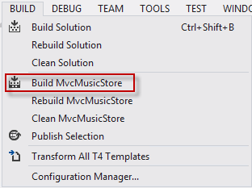

    *Building the project*
2. The project builds successfully. Why does it still work? It works because the database tables have fields that include the properties that you were using in the removed classes **Album** and **Genre**.

    

    *Builds succeeded*
3. While the designer displays the entities in a diagram format, they are really C# classes. Expand the **StoreDB.edmx** node in the Solution Explorer and then **StoreDB.tt**, you will see the new generated entities.

    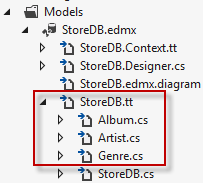

    *Generated files*

#### Task 4 - Querying the Database

In this task, you will update the StoreController class so that, instead of using hardcoded data, it will query the database to retrieve the information.

1. Open **Controllers\StoreController.cs** and add the following field to the class to hold an instance of the **MusicStoreEntities** class, named **storeDB**:

    (Code Snippet - *Models And Data Access - Ex1 storeDB*)

    [!code-csharp[Main](aspnet-mvc-4-models-and-data-access/samples/sample1.cs)]
2. The **MusicStoreEntities** class exposes a collection property for each table in the database. Update **Browse** action method to retrieve a Genre with all of the **Albums**.

    (Code Snippet - *Models And Data Access - Ex1 Store Browse*)

    [!code-csharp[Main](aspnet-mvc-4-models-and-data-access/samples/sample2.cs)]

    > [!NOTE]
    > You are using a capability of .NET called **LINQ** (language-integrated query) to write strongly-typed query expressions against these collections - which will execute code against the database and return objects that you can program against.
    > 
    > For more information about LINQ, please visit the [msdn site](https://msdn.microsoft.com/en-us/library/bb397926&amp;#040;v=vs.110&amp;#041;.aspx).
3. Update **Index** action method to retrieve all the genres.

    (Code Snippet - *Models And Data Access - Ex1 Store Index*)

    [!code-csharp[Main](aspnet-mvc-4-models-and-data-access/samples/sample3.cs)]
4. Update **Index** action method to retrieve all the genres and transform the collection to a list.

    (Code Snippet - *Models And Data Access - Ex1 Store GenreMenu*)

    [!code-csharp[Main](aspnet-mvc-4-models-and-data-access/samples/sample4.cs)]

#### Task 5 - Running the Application

In this task, you will check that the Store Index page will now display the Genres stored in the database instead of the hardcoded ones. There is no need to change the View template because the **StoreController** is returning the same entities as before, although this time the data will come from the database.

1. Rebuild the solution and press **F5** to run the Application.
2. The project starts in the Home page. Verify that the menu of **Genres** is no longer a hardcoded list, and the data is directly retrieved from the database.

    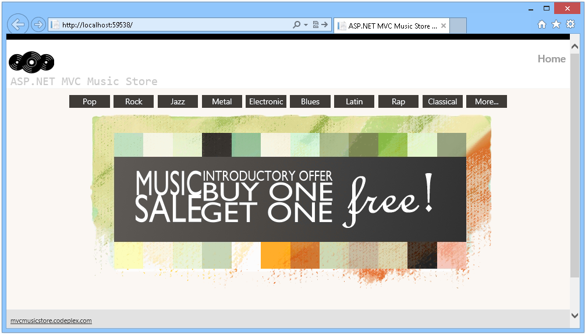

    *Browsing Genres from the database*
3. Now browse to any genre and verify the albums are populated from database.

    

    *Browsing Albums from the database*

### Exercise 2: Creating a Database Using Code First

In this exercise, you will learn how to use the Code First approach to create a database with the tables of the MusicStore application, and how to access its data.

Once the model is generated, you will modify the StoreController to provide the View template with the data taken from the database, instead of using hardcoded values.

> [!NOTE]
> If you have completed Exercise 1 and have already worked with the Database First approach, you will now learn how to get the same results with a different process. The tasks that are in common with Exercise 1 have been marked to make your reading easier. If you have not completed Exercise 1 but would like to learn the Code First approach, you can start from this exercise and get a full coverage of the topic.

#### Task 1 - Populating Sample Data

In this task, you will populate the database with sample data when it is intially created using Code-First.

1. Open the **Begin** solution located at **Source/Ex2-CreatingADatabaseCodeFirst/Begin/** folder. Otherwise, you might continue using the **End** solution obtained by completing the previous exercise.

    1. If you opened the provided **Begin** solution, you will need to download some missing NuGet packages before continue. To do this, click the **Project** menu and select **Manage NuGet Packages**.
    2. In the **Manage NuGet Packages** dialog, click **Restore** in order to download missing packages.
    3. Finally, build the solution by clicking **Build** | **Build Solution**.

    > [!NOTE]
    > One of the advantages of using NuGet is that you don't have to ship all the libraries in your project, reducing the project size. With NuGet Power Tools, by specifying the package versions in the Packages.config file, you will be able to download all the required libraries the first time you run the project. This is why you will have to run these steps after you open an existing solution from this lab.
2. Add the **SampleData.cs** file to the **Models** folder. To do that, right-click **Models** folder, point to **Add** and then click **Existing Item**. Browse to **\Source\Assets** and select the **SampleData.cs** file.

    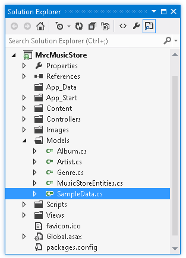

    *Sample data populate code*
3. Open the **Global.asax.cs** file and add the following *using* statements.

    (Code Snippet - *Models And Data Access - Ex2 Global Asax Usings*)

    [!code-csharp[Main](aspnet-mvc-4-models-and-data-access/samples/sample5.cs)]
4. In the **Application\_Start()** method add the following line to set the database initializer.

    (Code Snippet - *Models And Data Access - Ex2 Global Asax SetInitializer*)

    [!code-csharp[Main](aspnet-mvc-4-models-and-data-access/samples/sample6.cs)]

#### Task 2 - Configuring the connection to the Database

Now that you have already added a database to our project, you will write in the **Web.config** file the connection string.

1. Add a connection string at **Web.config**. To do that, open **Web.config** at project root and replace the connection string named DefaultConnection with this line in the **&lt;connectionStrings&gt;** section:

    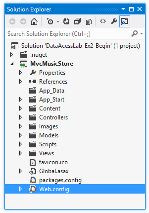

    *Web.config file location*

    [!code-xml[Main](aspnet-mvc-4-models-and-data-access/samples/sample7.xml)]

#### Task 3 - Working with the Model

Now that you have already configured the connection to the database, you will link the model with the database tables. In this task, you will create a class that will be linked to the database with Code First. Remember that there is an existent POCO model class that should be modified.

> [!NOTE]
> If you completed Exercise 1, you will note that this step was performed by a wizard. By doing Code First, you will manually create classes that will be linked to data entities.

1. Open the POCO model class **Genre** from **Models** project folder and include an ID. Use an int property with the name **GenreId**.

    (Code Snippet - *Models And Data Access - Ex2 Code First Genre*)

    [!code-csharp[Main](aspnet-mvc-4-models-and-data-access/samples/sample8.cs)]

    > [!NOTE]
    > To work with Code First conventions, the class Genre must have a primary key property that will be automatically detected.
    > 
    > You can read more about Code First Conventions in this [msdn article](https://msdn.microsoft.com/en-us/library/hh161541&amp;#040;v=vs.103&amp;#041;.aspx).
2. Now, open the POCO model class **Album** from **Models** project folder and include the foreign keys, create properties with the names **GenreId** and **ArtistId**. This class already have the **GenreId** for the primary key.

    (Code Snippet - *Models And Data Access - Ex2 Code First Album*)

    [!code-csharp[Main](aspnet-mvc-4-models-and-data-access/samples/sample9.cs)]
3. Open the POCO model class **Artist** and include the **ArtistId** property.

    (Code Snippet - *Models And Data Access - Ex2 Code First Artist*)

    [!code-csharp[Main](aspnet-mvc-4-models-and-data-access/samples/sample10.cs)]
4. Right-click the **Models** project folder and select **Add | Class**. Name the file **MusicStoreEntities.cs**. Then, click **Add.**

    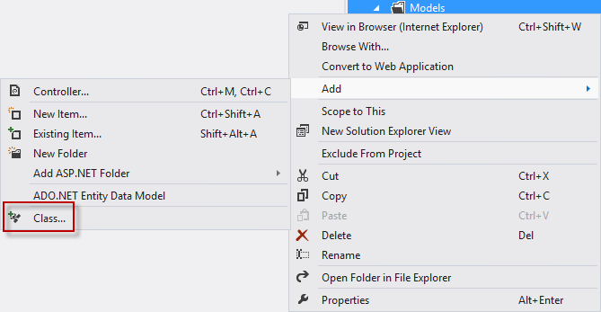

    *Adding a new item*

    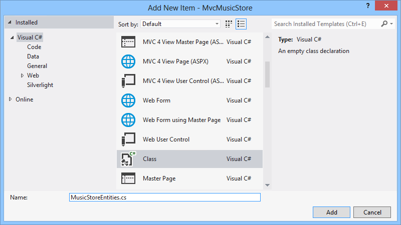

    *Adding a class*
5. Open the class you have just created, **MusicStoreEntities.cs**, and include the namespaces **System.Data.Entity** and **System.Data.Entity.Infrastructure**.

    [!code-csharp[Main](aspnet-mvc-4-models-and-data-access/samples/sample11.cs)]
6. Replace the class declaration to extend the **DbContext** class: declare a public **DBSet** and override **OnModelCreating** method. After this step you will get a domain class that will link your model with the Entity Framework. In order to do that, replace the class code with the following:

    (Code Snippet - *Models And Data Access - Ex2 Code First MusicStoreEntities*)

    [!code-csharp[Main](aspnet-mvc-4-models-and-data-access/samples/sample12.cs)]

    > [!NOTE]
    > With Entity Framework **DbContext** and **DBSet** you will be able to query the POCO class Genre. By extending **OnModelCreating** method, you are specifying in the **code** how Genre will be mapped to a database table. You can find more information about DBContext and DBSet in this msdn article: [link](https://msdn.microsoft.com/en-us/library/system.data.entity.dbcontext(v=vs.103).aspx)

#### Task 4 - Querying the Database

In this task, you will update the StoreController class so that, instead of using hardcoded data, it will retrieve it from the database.

> [!NOTE]
> This task is in common with Exercise 1.
> 
> If you completed Exercise 1 you will note these steps are the same in both approaches (Database first or Code first). They are different in how the data is linked with the model, but the access to data entities is yet transparent from the controller.

1. Open **Controllers\StoreController.cs** and add the following field to the class to hold an instance of the **MusicStoreEntities** class, named **storeDB**:

    (Code Snippet - *Models And Data Access - Ex1 storeDB*)

    [!code-csharp[Main](aspnet-mvc-4-models-and-data-access/samples/sample13.cs)]
2. The **MusicStoreEntities** class exposes a collection property for each table in the database. Update **Browse** action method to retrieve a Genre with all of the **Albums**.

    (Code Snippet - *Models And Data Access - Ex2 Store Browse*)

    [!code-csharp[Main](aspnet-mvc-4-models-and-data-access/samples/sample14.cs)]

    > [!NOTE]
    > You are using a capability of .NET called **LINQ** (language-integrated query) to write strongly-typed query expressions against these collections - which will execute code against the database and return objects that you can program against.
    > 
    > For more information about LINQ, please visit the [msdn site](https://msdn.microsoft.com/en-us/library/bb397926(v=vs.110).aspx).
3. Update **Index** action method to retrieve all the genres.

    (Code Snippet - *Models And Data Access - Ex2 Store Index*)

    [!code-csharp[Main](aspnet-mvc-4-models-and-data-access/samples/sample15.cs)]
4. Update **Index** action method to retrieve all the genres and transform the collection to a list.

    (Code Snippet - *Models And Data Access - Ex2 Store GenreMenu*)

    [!code-csharp[Main](aspnet-mvc-4-models-and-data-access/samples/sample16.cs)]

#### Task 5 - Running the Application

In this task, you will check that the Store Index page will now display the Genres stored in the database instead of the hardcoded ones. There is no need to change the View template because the **StoreController** is returning the same **StoreIndexViewModel** as before, but this time the data will come from the database.

1. Rebuild the solution and press **F5** to run the Application.
2. The project starts in the Home page. Verify that the menu of **Genres** is no longer a hardcoded list, and the data is directly retrieved from the database.

    

    *Browsing Genres from the database*
3. Now browse to any genre and verify the albums are populated from database.

    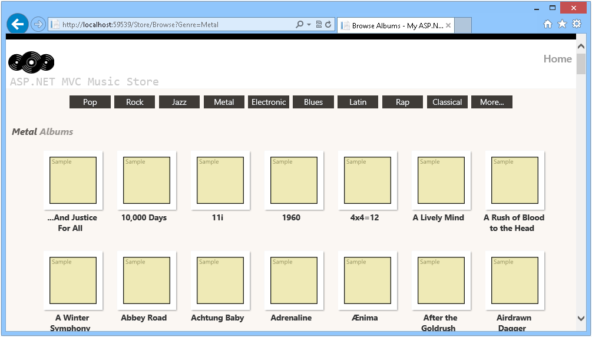

    *Browsing Albums from the database*

### Exercise 3: Querying the Database with Parameters

In this exercise, you will learn how to query the database using parameters, and how to use Query Result Shaping, a feature that reduces the number database accesses retrieving data in a more efficient way.

> [!NOTE]
> For further information on Query Result Shaping, visit the following [msdn article](https://msdn.microsoft.com/en-us/library/bb896272&amp;#040;v=vs.100&amp;#041;.aspx).

#### Task 1 - Modifying StoreController to Retrieve Albums from Database

In this task, you will change the **StoreController** class to access the database to retrieve albums from a specific genre.

1. Open the **Begin** solution located at the **Source\Ex3-QueryingTheDatabaseWithParametersCodeFirst\Begin** folder if you want to use Code-First approach or **Source\Ex3-QueryingTheDatabaseWithParametersDBFirst\Begin** folder if you want to use Database-First approach. Otherwise, you might continue using the **End** solution obtained by completing the previous exercise.

    1. If you opened the provided **Begin** solution, you will need to download some missing NuGet packages before continue. To do this, click the **Project** menu and select **Manage NuGet Packages**.
    2. In the **Manage NuGet Packages** dialog, click **Restore** in order to download missing packages.
    3. Finally, build the solution by clicking **Build** | **Build Solution**.

    > [!NOTE]
    > One of the advantages of using NuGet is that you don't have to ship all the libraries in your project, reducing the project size. With NuGet Power Tools, by specifying the package versions in the Packages.config file, you will be able to download all the required libraries the first time you run the project. This is why you will have to run these steps after you open an existing solution from this lab.
2. Open the **StoreController** class to change the **Browse** action method. To do this, in the **Solution Explorer**, expand the **Controllers** folder and double-click **StoreController.cs**.
3. Change the **Browse** action method to retrieve albums for a specific genre. To do this, replace the following code:

    (Code Snippet - *Models And Data Access - Ex3 StoreController BrowseMethod*)

    [!code-csharp[Main](aspnet-mvc-4-models-and-data-access/samples/sample17.cs)]

    > [!NOTE]
    > To populate a collection of the entity, you need to use the **Include** method to specify you want to retrieve the albums too. You can use the .**Single()** extension in LINQ because in this case only one genre is expected for an album. The **Single()** method takes a Lambda expression as a parameter, which in this case specifies a single Genre object such that its name matches the value defined.
    > 
    > You will take advantage of a feature that allows you to indicate other related entities you want loaded as well when the Genre object is retrieved. This feature is called **Query Result Shaping**, and enables you to reduce the number of times needed to access the database to retrieve information. In this scenario, you will want to pre-fetch the Albums for the Genre you retrieve.
    > 
    > The query includes **Genres.Include(&quot;Albums&quot;)** to indicate that you want related albums as well. This will result in a more efficient application, since it will retrieve both Genre and Album data in a single database request.

#### Task 2 - Running the Application

In this task, you will run the application and retrieve albums of a specific genre from the database.

1. Press **F5** to run the Application.
2. The project starts in the Home page. Change the URL to **/Store/Browse?genre=Pop** to verify that the results are being retrieved from the database.

    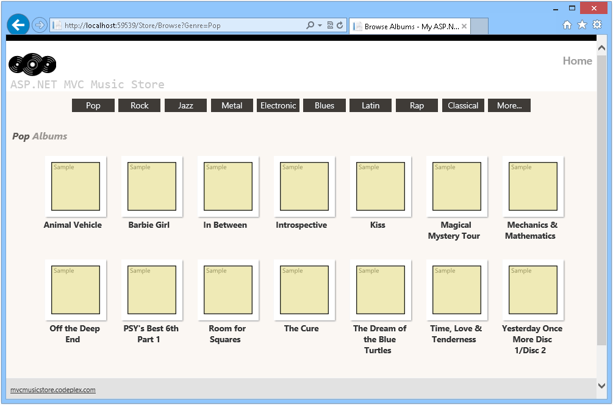

    *Browsing /Store/Browse?genre=Pop*

#### Task 3 - Accessing Albums by Id

In this task, you will repeat the previous procedure to get albums by their Id.

1. Close the browser if needed, to return to Visual Studio. Open the **StoreController** class to change the **Details** action method. To do this, in the **Solution Explorer**, expand the **Controllers** folder and double-click **StoreController.cs**.
2. Change the **Details** action method to retrieve albums details based on their **Id**. To do this, replace the following code:

    (Code Snippet - *Models And Data Access - Ex3 StoreController DetailsMethod*)

    [!code-csharp[Main](aspnet-mvc-4-models-and-data-access/samples/sample18.cs)]

#### Task 4 - Running the Application

In this task, you will run the Application in a web browser and obtain album details by their Id.

1. Press **F5** to run the Application.
2. The project starts in the Home page. Change the URL to **/Store/Details/51** or browse the genres and select an album to verify that the results are being retrieved from the database.

    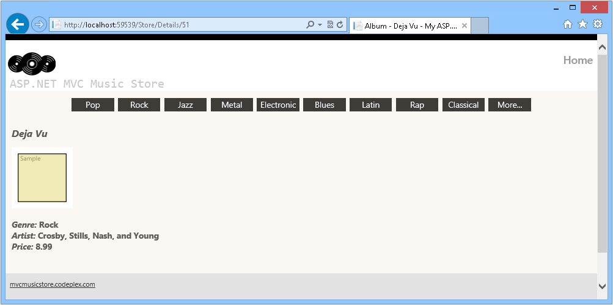

    *Browsing /Store/Details/51*

> [!NOTE]
> Additionally, you can deploy this application to Windows Azure Web Sites following [Appendix B: Publishing an ASP.NET MVC 4 Application using Web Deploy](#AppendixB).

* * *

## Summary

By completing this Hands-on Lab you have learned the fundamentals of ASP.NET MVC Models and Data Access, using the **Database First** approach as well as the **Code First** Approach:

- How to add a database to the solution in order to consume its data
- How to update Controllers to provide View templates with the data taken from the database instead of hard-coded one
- How to query the database using parameters
- How to use the Query Result Shaping, a feature that reduces the number of database accesses, retrieving data in a more efficient way
- How to use both Database First and Code First approaches in Microsoft Entity Framework to link the database with the model

## Appendix A: Installing Visual Studio Express 2012 for Web

You can install **Microsoft Visual Studio Express 2012 for Web** or another &quot;Express&quot; version using the **[Microsoft Web Platform Installer](https://www.microsoft.com/web/downloads/platform.aspx)**. The following instructions guide you through the steps required to install *Visual studio Express 2012 for Web* using *Microsoft Web Platform Installer*.

1. Go to [[https://go.microsoft.com/?linkid=9810169](https://go.microsoft.com/?linkid=9810169)](https://go.microsoft.com/?linkid=9810169). Alternatively, if you already have installed Web Platform Installer, you can open it and search for the product &quot;*Visual Studio Express 2012 for Web with Windows Azure SDK*&quot;.
2. Click on **Install Now**. If you do not have **Web Platform Installer** you will be redirected to download and install it first.
3. Once **Web Platform Installer** is open, click **Install** to start the setup.

    

    *Install Visual Studio Express*
4. Read all the products' licenses and terms and click **I Accept** to continue.

    

    *Accepting the license terms*
5. Wait until the downloading and installation process completes.

    

    *Installation progress*
6. When the installation completes, click **Finish**.

    

    *Installation completed*
7. Click **Exit** to close Web Platform Installer.
8. To open Visual Studio Express for Web, go to the **Start** screen and start writing &quot;**VS Express**&quot;, then click on the **VS Express for Web** tile.

    

    *VS Express for Web tile*

## Appendix B: Publishing an ASP.NET MVC 4 Application using Web Deploy

This appendix will show you how to create a new web site from the Windows Azure Management Portal and publish the application you obtained by following the lab, taking advantage of the Web Deploy publishing feature provided by Windows Azure.

#### Task 1 - Creating a New Web Site from the Windows Azure Portal

1. Go to the [Windows Azure Management Portal](https://manage.windowsazure.com/) and sign in using the Microsoft credentials associated with your subscription.

    > [!NOTE]
    > With Windows Azure you can host 10 ASP.NET Web Sites for free and then scale as your traffic grows. You can sign up [here](http://aka.ms/aspnet-hol-azure).

    

    *Log on to Windows Azure Management Portal*
2. Click **New** on the command bar.

    

    *Creating a new Web Site*
3. Click **Compute** | **Web Site**. Then select **Quick Create** option. Provide an available URL for the new web site and click **Create Web Site**.

    > [!NOTE]
    > A Windows Azure Web Site is the host for a web application running in the cloud that you can control and manage. The Quick Create option allows you to deploy a completed web application to the Windows Azure Web Site from outside the portal. It does not include steps for setting up a database.

    

    *Creating a new Web Site using Quick Create*
4. Wait until the new **Web Site** is created.
5. Once the Web Site is created click the link under the **URL** column. Check that the new Web Site is working.

    

    *Browsing to the new web site*

    

    *Web site running*
6. Go back to the portal and click the name of the web site under the **Name** column to display the management pages.

    

    *Opening the Web Site management pages*
7. In the **Dashboard** page, under the **quick glance** section, click the **Download publish profile** link.

    > [!NOTE]
    > The *publish profile* contains all of the information required to publish a web application to a Windows Azure website for each enabled publication method. The publish profile contains the URLs, user credentials and database strings required to connect to and authenticate against each of the endpoints for which a publication method is enabled. **Microsoft WebMatrix 2**, **Microsoft Visual Studio Express for Web** and **Microsoft Visual Studio 2012** support reading publish profiles to automate configuration of these programs for publishing web applications to Windows Azure websites.

    

    *Downloading the Web Site publish profile*
8. Download the publish profile file to a known location. Further in this exercise you will see how to use this file to publish a web application to a Windows Azure Web Sites from Visual Studio.

    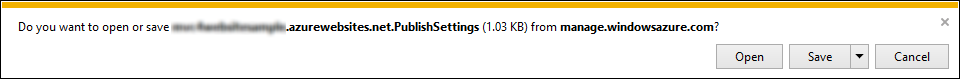

    *Saving the publish profile file*

#### Task 2 - Configuring the Database Server

If your application makes use of SQL Server databases you will need to create a SQL Database server. If you want to deploy a simple application that does not use SQL Server you might skip this task.

1. You will need a SQL Database server for storing the application database. You can view the SQL Database servers from your subscription in the Windows Azure Management portal at **Sql Databases** | **Servers** | **Server's Dashboard**. If you do not have a server created, you can create one using the **Add** button on the command bar. Take note of the **server name and URL, administrator login name and password**, as you will use them in the next tasks. Do not create the database yet, as it will be created in a later stage.

    

    *SQL Database Server Dashboard*
2. In the next task you will test the database connection from Visual Studio, for that reason you need to include your local IP address in the server's list of **Allowed IP Addresses**. To do that, click **Configure**, select the IP address from **Current Client IP Address** and paste it on the **Start IP Address** and **End IP Address** text boxes and click the  button.

    

    *Adding Client IP Address*
3. Once the **Client IP Address** is added to the allowed IP addresses list, click on **Save** to confirm the changes.

    

    *Confirm Changes*

#### Task 3 - Publishing an ASP.NET MVC 4 Application using Web Deploy

1. Go back to the ASP.NET MVC 4 solution. In the **Solution Explorer**, right-click the web site project and select **Publish**.

    

    *Publishing the web site*
2. Import the publish profile you saved in the first task.

    

    *Importing publish profile*
3. Click **Validate Connection**. Once Validation is complete click **Next**.

    > [!NOTE]
    > Validation is complete once you see a green checkmark appear next to the Validate Connection button.

    

    *Validating connection*
4. In the **Settings** page, under the **Databases** section, click the button next to your database connection's textbox (i.e. **DefaultConnection**).

    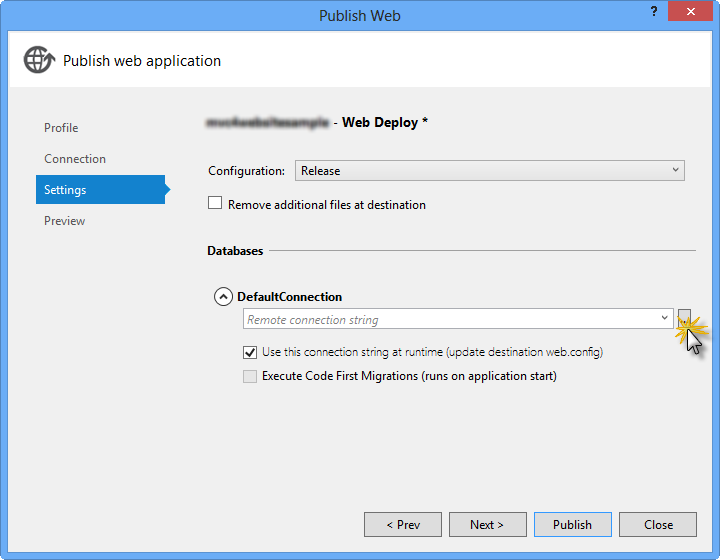

    *Web deploy configuration*
5. Configure the database connection as follows:

    - In the **Server name** type your SQL Database server URL using the *tcp:* prefix.
    - In **User name** type your server administrator login name.
    - In **Password** type your server administrator login password.
    - Type a new database name.

    

    *Configuring destination connection string*
6. Then click **OK**. When prompted to create the database click **Yes**.

    

    *Creating the database*
7. The connection string you will use to connect to SQL Database in Windows Azure is shown within Default Connection textbox. Then click **Next**.

    

    *Connection string pointing to SQL Database*
8. In the **Preview** page, click **Publish**.

    

    *Publishing the web application*
9. Once the publishing process finishes, your default browser will open the published web site.

## Appendix C: Using Code Snippets

With code snippets, you have all the code you need at your fingertips. The lab document will tell you exactly when you can use them, as shown in the following figure.

*Using Visual Studio code snippets to insert code into your project*

***To add a code snippet using the keyboard (C# only)***

1. Place the cursor where you would like to insert the code.
2. Start typing the snippet name (without spaces or hyphens).
3. Watch as IntelliSense displays matching snippets' names.
4. Select the correct snippet (or keep typing until the entire snippet's name is selected).
5. Press the Tab key twice to insert the snippet at the cursor location.

*Start typing the snippet name*

*Press Tab to select the highlighted snippet*

*Press Tab again and the snippet will expand*

***To add a code snippet using the mouse (C#, Visual Basic and XML)*** 1. Right-click where you want to insert the code snippet.

1. Select **Insert Snippet** followed by **My Code Snippets**.
2. Pick the relevant snippet from the list, by clicking on it.

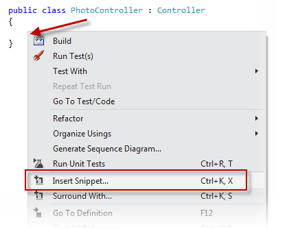

*Right-click where you want to insert the code snippet and select Insert Snippet*

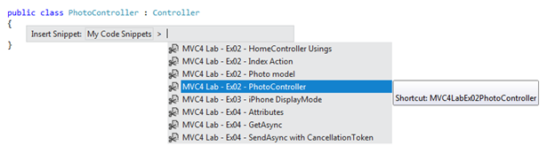

*Pick the relevant snippet from the list, by clicking on it*