What's New in ASP.NET MVC 4
====================
by [Web Camps Team](https://twitter.com/webcamps)

[Download Web Camps Training Kit](http://www.microsoft.com/en-us/download/29843)

> ASP.NET MVC 4 is a framework for building scalable, standards-based web applications using well-established design patterns and the power of the ASP.NET and the .NET framework. This new, fourth version of the framework focuses on making mobile web application development easier.
> 
> To begin with, when you create a new ASP.NET MVC 4 project there is now a mobile application project template you can use to build a standalone app specifically for mobile devices. Additionally, ASP.NET MVC 4 integrates with jQuery Mobile through a jQuery.Mobile.MVC NuGet package. jQuery Mobile is an HTML5-based framework for developing web apps that are compatible with all popular mobile device platforms, including Windows Phone, iPhone, Android and so on. However, if you need specialization, ASP.NET MVC 4 also enables you to serve different views for different devices and provide device-specific optimizations.
> 
> In this hands-on lab, you will start with the ASP.NET MVC 4 &quot;Internet Application&quot; project template to create a Photo Gallery application. You will progressively enhance the app using jQuery Mobile and ASP.NET MVC 4's new features to make it compatible with different mobile devices and desktop web browsers. You will also learn about new code recipes for code generation and how ASP.NET MVC 4 makes it easier for you to write asynchronous action methods by supporting Task&lt;ActionResult&gt; return types.
> 
> All sample code and snippets are included in the Web Camps Training Kit, available at [https://www.microsoft.com/en-us/download/29843](https://www.microsoft.com/en-us/download/29843).

### Objectives

In this hands-on lab, you will learn how to:

- Take advantage of the enhancements to the ASP.NET MVC project templates-including the new mobile application project template
- Use the HTML5 viewport attribute and CSS media queries to improve the display on mobile devices
- Use jQuery Mobile for progressive enhancements and for building touch-optimized web UI
- Create mobile-specific views
- Use the view-switcher component to toggle between mobile and desktop views in the application
- Create asynchronous controllers using task support

### Prerequisites

You must have the following items to complete this lab:

- [Microsoft Visual Studio Express 2012 for Web](https://www.microsoft.com/visualstudio/eng/products/visual-studio-express-for-web) or superior (read [Appendix B](#AppendixB) for instructions on how to install it).
- [ASP.NET MVC 4](../../../mvc4.md) (included in the Microsoft Visual Studio 2012 installation)
- Windows Phone Emulator (included in the [Windows Phone 7.1.1 SDK](https://www.microsoft.com/en-us/download/details.aspx?id=29233))
- Optional - [WebMatrix 2](https://www.microsoft.com/web/webmatrix/) with **Electric Plum iPhone Simulator** extension (only for Exercise 3 used to browse the web application with an iPhone simulator)

### Setup

Throughout the lab document, you will be instructed to insert code blocks. For your convenience, most of that code is provided as Visual Studio Code Snippets, which you can use from within Visual Studio to avoid having to add it manually.

To install the code snippets:

1. Open a Windows Explorer window and browse to the lab's **Source\Setup** folder.
2. Double-click the **Setup.cmd** file in this folder to install the Visual Studio code snippets.

If you are not familiar with the Visual Studio Code Snippets, and want to learn how to use them, you can refer to the appendix from this document &quot;[Appendix A: Using Code Snippets](#AppendixA)&quot;.

## Exercises

This hands-on lab includes the following exercises:

1. [New ASP.NET MVC 4 Project Templates](#Exercise1)
2. [Creating the Photo Gallery Web Application](#Exercise2)
3. [Adding Support for Mobile Devices](#Exercise3)
4. [Using Asynchronous Controllers](#Exercise4)

> [!NOTE]
> Each exercise is accompanied by an **End** folder containing the resulting solution you should obtain after completing the exercises. You can use this solution as a guide if you need additional help working through the exercises.

Estimated time to complete this lab: **60 minutes**.

### Exercise 1: New ASP.NET MVC 4 Project Templates

In this exercise, you will explore the enhancements in the ASP.NET MVC 4 Project templates. In addition to the Internet Application template, already present in MVC 3, this version now includes a separate template for Mobile applications. First, you will look at some relevant features of each of the templates. Then, you will work on rendering your page properly on the different platforms by using the right approach.

#### Task 1 - Exploring the Internet Application Template

1. Open **Visual Studio**.
2. Select the **File | New | Project** menu command. In the **New Project** dialog, select the **Visual C# | Web** template on the left pane tree, and choose **ASP.NET MVC 4 Web Application.** Name the project **PhotoGallery**, select a location (or leave the default) and click **OK**.

    > [!NOTE]
    > You will later customize the PhotoGallery ASP.NET MVC 4 solution you are now creating.

    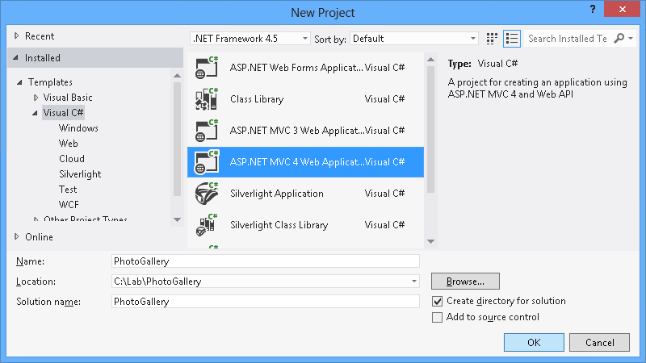

    *Creating a new project*
3. In the **New ASP.NET MVC 4 Project** dialog, select the **Internet Application** project template and click **OK**. Make sure you have selected Razor as the view engine.

    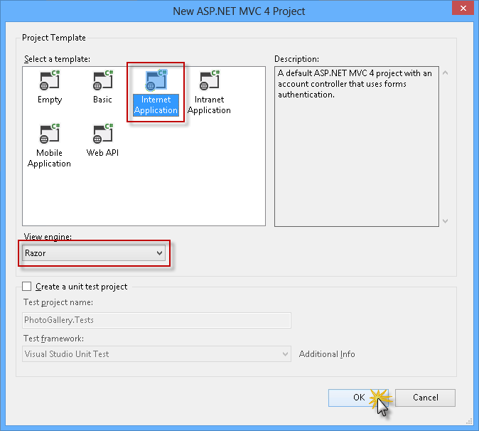

    *Creating a new ASP.NET MVC 4 Internet Application*

    > [!NOTE]
    > Razor syntax has been introduced in ASP.NET MVC 3. Its goal is to minimize the number of characters and keystrokes required in a file, enabling a fast and fluid coding workflow. Razor leverages existing C# / VB (or other) language skills and delivers a template markup syntax that enables an awesome HTML construction workflow.
4. Press **F5** to run the solution and see the renewed templates. You can check out the following features:

    **Modern-style templates**

    The templates have been renewed, providing more modern-looking styles.

    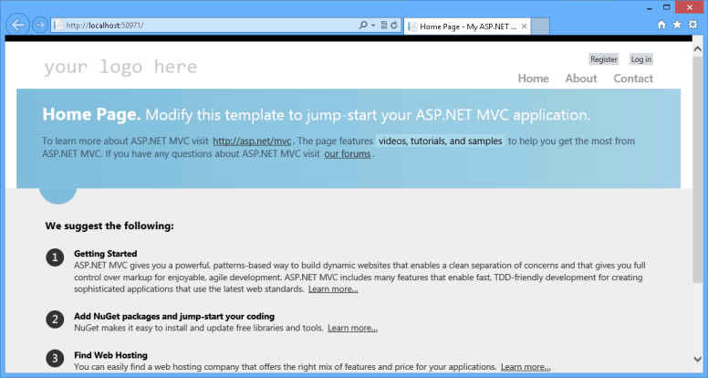

    *ASP.NET MVC 4 restyled templates*

    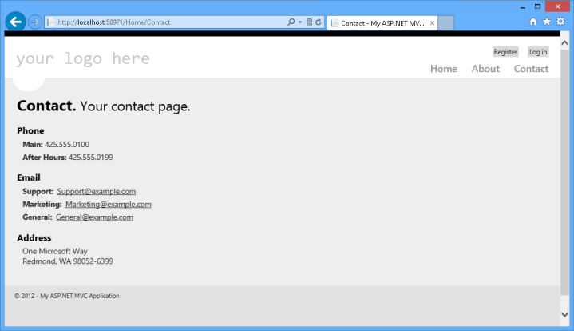

    *New Contact page*

    **Adaptive Rendering**

    Check out resizing the browser window and notice how the page layout dynamically adapts to the new window size. These templates use the adaptive rendering technique to render properly in both desktop and mobile platforms without any customization.

    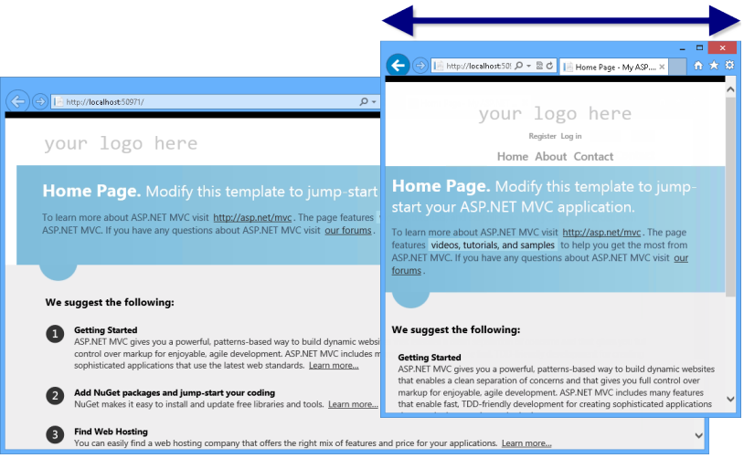

    *ASP.NET MVC 4 project template in different browser sizes*

    **Richer UI with JavaScript**

    Another enhancement to default project templates is the use of JavaScript to provide a more interactive JavaScript. The Login and Register links used in the template exemplify how to use the jQuery Validations to validate the input fields from client-side.

    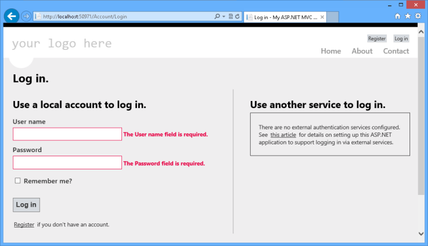

    *jQuery Validation*

    > [!NOTE]
    > Notice the two log in sections, in the first section you can log in using a registerd account from the site and in the second section you can altenativelly log in using another authentication service like google (disabled by default).
5. Close the browser to stop the debugger and return to Visual Studio.
6. Open the file **AuthConfig.cs** located under the **App\_Start** folder.
7. Remove the comment from the last line to register Google client for *OAuth* authentication.

    [!code-csharp[Main](whats-new-in-aspnet-mvc-4/samples/sample1.cs)]

    > [!NOTE]
    > Notice you can easily enable authentication using any OpenID or OAuth service like Facebook, Twitter, Microsoft, etc.
8. Press **F5** to run the solution and navigate to the login page.
9. Select **Google** service to log in.

    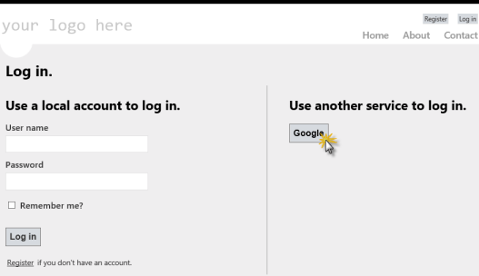

    *Selecting the log in service*
10. Log in using your Google account.
11. Allow the site (localhost) to retrieve information from Google account.
12. Finally, you will have to register in the site to associate the Google account.

    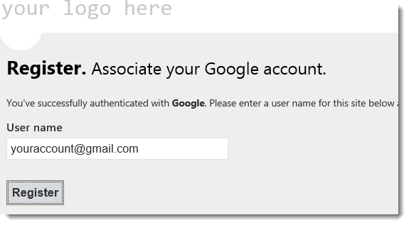

    *Associating your Google account*
13. Close the browser to stop the debugger and return to Visual Studio.
14. Now explore the solution to check out some other new features introduced by ASP.NET MVC 4 in the project template.

    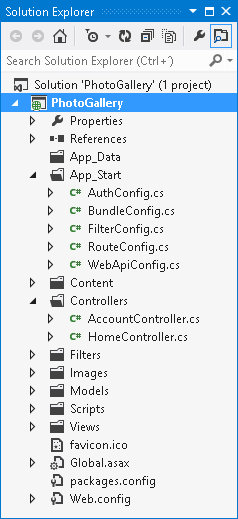

    *The ASP.NET MVC 4 Internet Application Project Template*

    - **HTML 5 Markup**

        Browse template views to find out the new theme markup.

        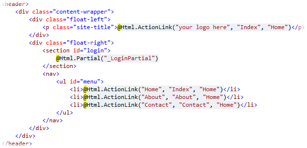

        *New template, using Razor and HTML5 markup (About.cshtml).*
    - **Updated JavaScript libraries**

        The ASP.NET MVC 4 default template now includes KnockoutJS, a JavaScript MVVM framework that lets you create rich and highly responsive web applications using JavaScript and HTML. Like in MVC3, jQuery and jQuery UI libraries are also included in ASP.NET MVC 4.

        > [!NOTE]
        > You can get more information about KnockOutJS library in this link: [[http://learn.knockoutjs.com/](http://learn.knockoutjs.com/)](http://learn.knockoutjs.com/). Additionally, you can learn about jQuery and jQuery UI in [[http://docs.jquery.com/](http://docs.jquery.com/)](http://docs.jquery.com/).

#### Task 2 - Exploring the Mobile Application Template

ASP.NET MVC 4 facilitates the development of websites for mobile and tablet browsers. This template has the same application structure as the Internet Application template (notice that the controller code is practically identical), but its style was modified to render properly in touch-based mobile devices.

1. Select the **File | New | Project** menu command. In the **New Project** dialog, select the **Visual C# | Web** template on the left pane tree, and choose the **ASP.NET MVC 4 Web Application.** Name the project **PhotoGallery.Mobile**, select a location (or leave the default), select &quot;Add to solution&quot; and click **OK**.
2. In the **New ASP.NET MVC 4 Project** dialog, select the **Mobile Application** project template and click **OK**. Make sure you have selected Razor as the view engine.

    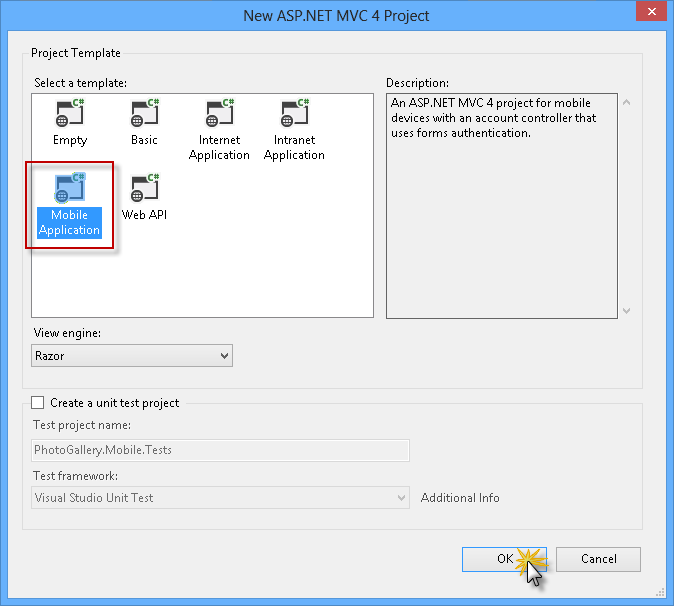

    *Creating a new ASP.NET MVC 4 Mobile Application*
3. Now you are able to explore the solution and check out some of the new features introduced by the ASP.NET MVC 4 solution template for mobile:

    - **jQuery Mobile Library**

        The Mobile Application project template includes the jQuery Mobile library, which is an open source library for mobile browser compatibility. jQuery Mobile applies progressive enhancement to mobile browsers that support CSS and JavaScript. Progressive enhancement enables all browsers to display the basic content of a web page, while it only enables the most powerful browsers to display the rich content. The JavaScript and CSS files, included in the jQuery Mobile style, help mobile browsers to fit the content in the screen without making any change in the page markup.

        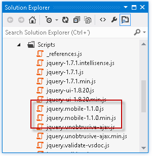

        *jQuery mobile library included in the template*
    - **HTML5 based markup**

        

        *Mobile application template using HTML5 markup, (Login.cshtml and index.cshtml)*
4. Press **F5** to run the solution.
5. Open the **Windows Phone 7 Emulator**.
6. In the phone start screen, open Internet Explorer. Check out the URL where the desktop application started and browse to that URL from the phone (e.g. `http://localhost:[PortNumber]/`).
7. Now you are able to enter the login page or check out the about page. Notice that the style of the website is based on the new Metro app for mobile. The ASP.NET MVC 4 project template is correctly displayed on mobile devices, making sure all the elements of the page are visible and enabled. Notice that the links on the header are big enough to be clicked or tapped.

    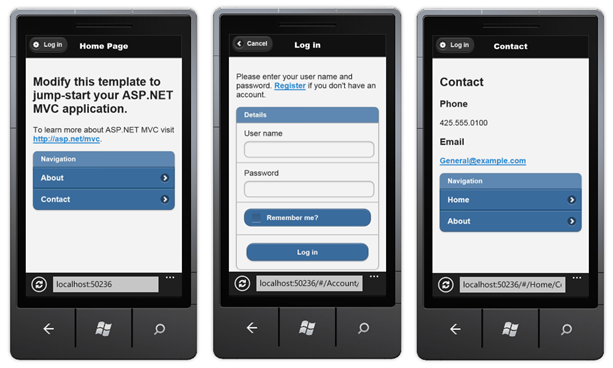

    *Project template pages in a mobile device*
8. The new template also uses the **Viewport meta tag**. Most mobile browsers define a width for a virtual browser window or &quot;viewport&quot;, which is larger than the actual width of the mobile device. This enables mobile browsers to display the entire web page inside the virtual display. The **Viewport meta tag** allows web developers to set the width, height and scale of the browser area on mobile devices **.** The ASP.NET MVC 4 template for Mobile Applications sets the viewport to the device width (&quot;width=device-width&quot;) in the layout template (*Views\Shared\_Layout.cshtml*), so that all the pages will have their viewport set to the device screen width. Notice that the Viewport meta tag will not change the default browser view.
9. Open **\_Layout.cshtml**, located in the **Views | Shared** folder, and comment the Viewport meta tag. Run the application, if not already opened, and check out the differences.

    [!code-cshtml[Main](whats-new-in-aspnet-mvc-4/samples/sample2.cshtml)]

    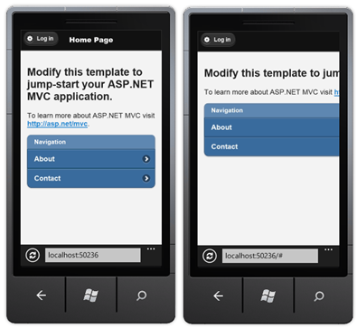

    *The site after commenting the viewport meta tag*
10. In Visual Studio, press **SHIFT** + **F5** to stop debugging the application.
11. Uncomment the viewport meta tag.

    [!code-cshtml[Main](whats-new-in-aspnet-mvc-4/samples/sample3.cshtml)]

#### Task 3 - Using Adaptive Rendering

In this task, you will learn another method to render a Web page correctly on mobile devices and Web browsers at the same time without any customization. You have already used Viewport meta tag with a similar purpose. Now you will meet another powerful method: *adaptive rendering*.

Adaptive rendering is a technique that uses **CSS3 media queries** to customize the style applied to a page. Media queries define conditions inside a style sheet, grouping CSS styles under a certain condition. Only when the condition is true, the style is applied to the declared objects.

The flexibility provided by the adaptive rendering technique enables any customization for displaying the site on different devices. You can define as many styles as you want on a single style sheet without writing logic code to choose the style. Therefore, it is a very neat way of adapting page styles, as it reduces the amount of duplicated code and logic for rendering purposes. On the other hand, bandwidth consumption would increase, as the size of your CSS files could grow marginally.

By using the adaptive rendering technique, your site will be **displayed properly, regardless of the browser.** However, you should consider if the bandwidth extra load is a concern.

> [!NOTE]
> The basic format of a media query is: @media \[Scope: all | handheld | print | projection | screen\] ([property:value] and ... [property:value])

Examples of media queries: &gt;**@media all and (max-width: 1000px) and (min-width: 700px) {}:** For all the resolutions between 700px and 1000px.

> **@media screen and (min-width: 400px) and (max-width: 700px) { ... }:** Only for screens. The resolution must be between 400 and 700px.
> 
> **@media handheld and (min-width: 20em), screen and (min-width: 20em) { ... }:** For handhelds(mobile and devices) and screens. The minimum width must be greater than 20em.
> 
> You can find more information about this on the [W3C site](http://www.w3.org/TR/css3-mediaqueries/).

You will now explore how the adaptive rendering works, improving the readability of the ASP.NET MVC 4 default website template.

1. Open the **PhotoGallery.sln** solution you have created at Task 1 and select the **PhotoGallery** project. Press **F5** to run the solution.
2. Resize the browser's width, setting the windows to half or to less than a quarter of its original size. Notice what happens with the items in the header: Some elements will not appear in the visible area of the header.
3. Open **Site.css** file from the Visual Studio Solution explorer, located in **Content** project folder. Press **CTRL + F** to open Visual Studio integrated search, and write **@media** to locate the **CSS media query**.

    The media query condition defined in this template works in this way: When the browser's window size is below **850 px**, the CSS rules applied are the ones defined inside this media block.

    

    *Locating the media query*
4. Replace the max-width attribute value set in 850 px with **10px**, in order to disable the adaptive rendering, and press **CTRL + S** to save the changes. Return to the browser and press **CTRL + F5** to refresh the page with the changes you have made. Notice the differences in both pages when adjusting the width of the window.

    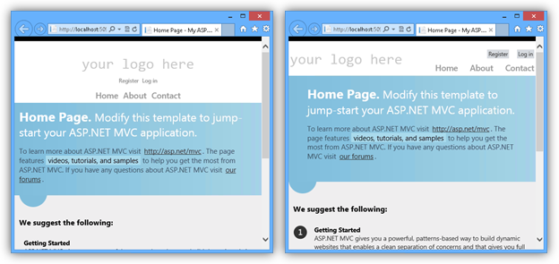

    *In the left, the page is applying the @media style, in the right, the style is omitted*

    Now, let's check out what happens on mobile devices:

    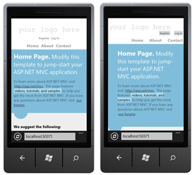

    *In the left, the page is applying the @media style, in the right, the style is omitted*

    Although you will notice that the changes when the page is rendered in a Web browser are not very significant, when using a mobile device the differences become more obvious. On the left side of the image, we can see that the custom style improved the readability.

    Adaptive rendering can be used in many more scenarios, making it easier to apply conditional styling to a Web site and solving common style issues with a neat approach.

    The Viewport meta tag and CSS media queries are not specific to ASP.NET MVC 4, so you can take advantage of these features in any web application.
5. In Visual Studio, press **SHIFT** + **F5** to stop debugging the application.

### Exercise 2: Creating the Photo Gallery Web Application

In this exercise, you will work on a Photo Gallery application to display photos. You will start with the ASP.NET MVC 4 project template, and then you will add a feature to retrieve photos from a service and display them in the home page.

In the following exercise, you will update this solution to enhance the way it is displayed on mobile devices.

#### Task 1 - Creating a Mock Photo Service

In this task, you will create a mock of the photo service to retrieve the content that will be displayed in the gallery. To do this, you will add a new controller that will simply return a JSON file with the data of each photo.

1. Open **Visual Studio** if not already opened.
2. Select the **File | New | Project** menu command. In the **New Project** dialog, select the **Visual C# | Web** template on the left pane tree, and choose **ASP.NET MVC 4 Web Application.** Name the project **PhotoGallery**, select a location (or leave the default) and click **OK**. Alternatively, you can continue working from your existing ASP.NET MVC 4 **Internet Application** solution from **Exercise 1** and skip the next step.
3. In the **New ASP.NET MVC 4 Project** dialog box, select the **Internet Application** project template and click **OK**. Make sure you have Razor selected as the View Engine.
4. In the **Solution Explorer**, right-click the **App\_Data** folder of your project, and select **Add | Existing Item**. Browse to the **Source\Assets\App\_Data** folder of this lab and add the **Photos.json** file.
5. Create a new controller with the name **PhotoController**. To do this, right-click on the **Controllers** folder, go to **Add** and select **Controller.** Complete the controller name, leave the **Empty MVC controller** template and click **Add**.

    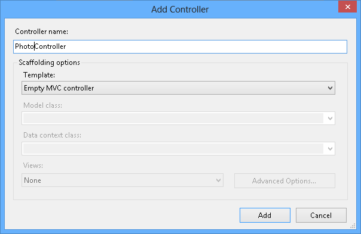

    *Adding the PhotoController*
6. Replace the **Index** method with the following **Gallery** action, and return the content from the JSON file you have recently added to the project.

    (Code Snippet - *ASP.NET MVC 4 Lab - Ex02 - Gallery Action*)

    [!code-csharp[Main](whats-new-in-aspnet-mvc-4/samples/sample4.cs)]
7. Press **F5** to run the solution, and then browse to the following URL in order to test the mocked photo service: `http://localhost:[port]/photo/gallery` (the [port] value depends on the current port where the application was launched). The request to this URL should retrieve the content of the **Photos.json** file.

    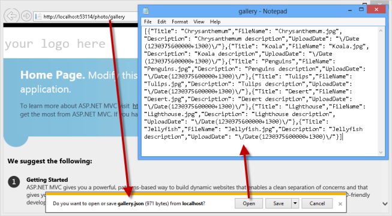

    *Testing the mocked photo service*

In a real implementation you could use [ASP.NET Web API](../../../../web-api/index.md) to implement the Photo Gallery service. ASP.NET Web API is a framework that makes it easy to build HTTP services that reach a broad range of clients, including browsers and mobile devices. ASP.NET Web API is an ideal platform for building RESTful applications on the .NET Framework.

#### Task 2 - Displaying the Photo Gallery

In this task, you will update the Home page to show the photo gallery by using the mocked service you created in the first task of this exercise. You will add model files and update the gallery views.

1. In Visual Studio, press **SHIFT** + **F5** to stop debugging the application.
2. Create the **Photo** class in the **Models** folder. To do this, right-click on the **Models** folder, select **Add** and click **Class**. Then, set the name to **Photo.cs** and click **Add**.
3. Add the following members to the **Photo** class.

    (Code Snippet - *ASP.NET MVC 4 Lab - Ex02 - Photo model*)

    [!code-csharp[Main](whats-new-in-aspnet-mvc-4/samples/sample5.cs)]
4. Open the **HomeController.cs** file from the **Controllers** folder.
5. Add the following using statements.

    (Code Snippet - *ASP.NET MVC 4 Lab - Ex02 - HomeController Usings*)

    [!code-csharp[Main](whats-new-in-aspnet-mvc-4/samples/sample6.cs)]
6. Update the **Index** action to use **HttpClient** to retrieve the gallery data, and then use the **JavaScriptSerializer** to deserialize it to the view model.

    (Code Snippet - *ASP.NET MVC 4 Lab - Ex02 - Index Action*)

    [!code-csharp[Main](whats-new-in-aspnet-mvc-4/samples/sample7.cs)]
7. Open the **Index.cshtml** file located under the **Views\Home** folder and replace all the content with the following code.

    This code loops through all the photos retrieved from the service and displays them into an unordered list.

    (Code Snippet - *ASP.NET MVC 4 Lab - Ex02 - Photo List*)

    [!code-cshtml[Main](whats-new-in-aspnet-mvc-4/samples/sample8.cshtml)]
8. In the **Solution Explorer**, right-click the **Content** folder of your project, and select **Add | Existing Item**. Browse to the **Source\Assets\Content** folder of this lab and add the **Site.css** file. You will have to confirm its replacement. If you have the **Site.css** file open, you will have to confirm to reload the file also.
9. Open File Explorer and copy the entire **Photos** folder located under the **Source\Assets** folder of this lab to the root folder of your project in Solution Explorer.
10. Run the application. You should now see the home page displaying the photos in the gallery.

    

    *Photo Gallery*
11. In Visual Studio, press **SHIFT** + **F5** to stop debugging the application.

### Exercise 3: Adding support for mobile devices

One of the key updates in ASP.NET MVC 4 is the support for mobile development. In this exercise, you will explore ASP.NET MVC 4 new features for mobile applications by extending the PhotoGallery solution you have created in the previous exercise.

#### Task 1 - Installing jQuery Mobile in an ASP.NET MVC 4 Application

1. Open the **Begin** solution located at **Source/Ex3-MobileSupport/Begin/** folder. Otherwise, you might continue using the **End** solution obtained by completing the previous exercise.

    1. If you opened the provided **Begin** solution, you will need to download some missing NuGet packages before continue. To do this, click the **Project** menu and select **Manage NuGet Packages**.
    2. In the **Manage NuGet Packages** dialog, click **Restore** in order to download missing packages.
    3. Finally, build the solution by clicking **Build** | **Build Solution**.

    > [!NOTE]
    > One of the advantages of using NuGet is that you don't have to ship all the libraries in your project, reducing the project size. With NuGet Power Tools, by specifying the package versions in the Packages.config file, you will be able to download all the required libraries the first time you run the project. This is why you will have to run these steps after you open an existing solution from this lab.
2. Open the **Package Manager Console** by clicking the **Tools** &gt; **Library Package Manager** &gt; **Package Manager Console** menu option.

    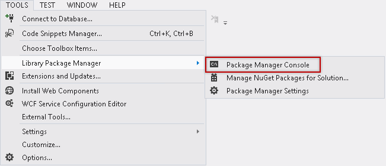

    *Opening the NuGet Package Manager Console*
3. In the Package Manager Console run the following command to install the **jQuery.Mobile.MVC** package.

    jQuery Mobile is an open source library for building touch-optimized web UI. The jQuery.Mobile.MVC NuGet package includes helpers to use jQuery Mobile with an ASP.NET MVC 4 application.

    > [!NOTE]
    > By running the following command, you will be downloading the jQuery.Mobile.MVC library from Nuget.

    PM

    [!code-powershell[Main](whats-new-in-aspnet-mvc-4/samples/sample9.ps1)]

    This command installs jQuery Mobile and some helper files, including the following:

    - **Views/Shared/\_Layout.Mobile.cshtml**: is a jQuery Mobile-based layout optimized for a smaller screen. When the website receives a request from a mobile browser, it will replace the original layout (\_Layout.cshtml) with this one.
    - A view-switcher component: consists of the **Views/Shared/\_ViewSwitcher.cshtml** partial view and the **ViewSwitcherController.cs** controller. This component will show a link on mobile browsers to enable users to switch to the desktop version of the page.  
        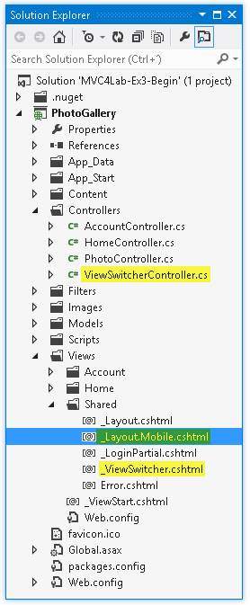

        *Photo Gallery project with mobile support*
4. Register the Mobile bundles. To do this, open the **Global.asax.cs** file and add the following line.

    (Code Snippet - *ASP.NET MVC 4 Lab - Ex03 - Register Mobile Bundles*)

    [!code-csharp[Main](whats-new-in-aspnet-mvc-4/samples/sample10.cs)]
5. Run the application using a desktop web browser.
6. Open the **Windows Phone 7 Emulator,** located in **Start Menu | All Programs | Windows Phone SDK 7.1 | Windows Phone Emulator.**
7. In the phone start screen, open Internet Explorer. Check out the URL where the application started and browse to that URL with the phone browser (e.g. `http://localhost:[PortNumber]/`).

    You will notice that your application will look different in the Windows Phone emulator, as the jQuery.Mobile.MVC has created new assets in your project that show views optimized for mobile devices.

    Notice the message at the top of the phone, showing the link that switches to the Desktop view. Additionally, the **\_Layout.Mobile.cshtml** layout that was created by the package you have installed is including a different layout in the application.

    > [!NOTE]
    > So far, there is no link to get back to mobile view. It will be included in later versions.

    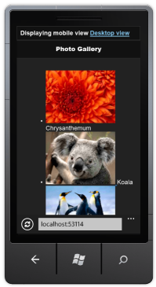

    *Mobile view of the Photo Gallery Home page*
8. In Visual Studio, press **SHIFT** + **F5** to stop debugging the application.

#### Task 2 - Creating Mobile Views

In this task, you will create a mobile version of the index view with content adapted for better appareance in mobile devices.

1. Copy the **Views\Home\Index.cshtml** view and paste it to create a copy, rename the new file to **Index.Mobile.cshtml**.
2. Open the new created **Index.Mobile.cshtml** view and replace the existing &lt;ul&gt; tag with this code. By doing this, you will be updating the &lt;ul&gt; tag with jQuery Mobile data annotations to use the mobile themes from jQuery.

    [!code-html[Main](whats-new-in-aspnet-mvc-4/samples/sample11.html)]

    > [!NOTE] 
    > 
    > Notice that:
    > 
    > - The **data-role** attribute set to **listview** will render the list using the listview styles.
    > 
    > - The **data-inset** attribute set to true will show the list with rounded border and margin.
    > 
    > - The **data-filter** attribute set to **true** will generate a search box.
    > 
    > You can learn more about jQuery Mobile conventions in the project documentation: [[http://jquerymobile.com/demos/1.1.1/](http://jquerymobile.com/demos/1.1.1/)](http://jquerymobile.com/demos/1.1.1/)
3. Press **CTRL + S** to save the changes.
4. Switch to the **Windows Phone Emulator** and refresh the site. Notice the new look and feel of the gallery list, as well as the new search box located on the top. Then, type a word in the search box (for instance, **Tulips**) to start a search in the photo gallery.

    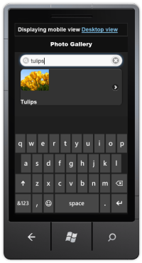

    *Gallery using listview style with filtering*

    To summarize, you have used the View Mobilizer recipe to create a copy of the Index view with the &quot;mobile&quot; suffix. This suffix indicates to ASP.NET MVC 4 that every request generated from a mobile device will use this copy of the index. Additionally, you have updated the mobile version of the Index view to use jQuery Mobile for enhancing the site look and feel in mobile devices.
5. Go back to Visual Studio and open **Site.Mobile.css** located under the **Content** folder.
6. Fix the positioning of the photo title to make it show at the right side of the image. To do this, add the following code to the **Site.Mobile.css** file.

    CSS

    [!code-css[Main](whats-new-in-aspnet-mvc-4/samples/sample12.css)]
7. Press **CTRL + S** to save the changes.
8. Switch back to the **Windows Phone Emulator** and refresh the site. Notice the photo title is properly positioned now.

    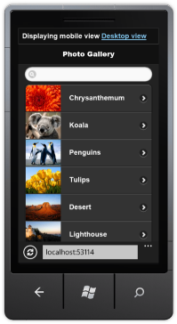

    *Title positioned on the right side of the image*

#### Task 3 - jQuery Mobile Themes

Every layout and widget in jQuery Mobile is designed around a new object-oriented CSS framework that makes it possible to apply a complete unified visual design theme to sites and applications.

jQuery Mobile's default Theme includes 5 swatches that are given letters (a, b, c, d, e) for quick reference.

In this task, you will update the mobile layout to use a different theme than the default.

1. Switch back to Visual Studio.
2. Open the **\_Layout.Mobile.cshtml** file located in **Views\Shared**.
3. Find the div element with the data-role set to &quot;page&quot; and update the **data-theme** to &quot;**e**&quot;.

    [!code-html[Main](whats-new-in-aspnet-mvc-4/samples/sample13.html)]
4. Press **CTRL + S** to save the changes.
5. Refresh the site in the **Windows Phone Emulator** and notice the new colors scheme.

    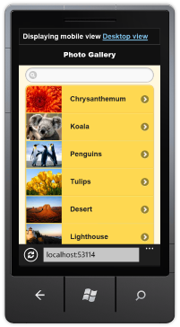

    *Mobile layout with a different color scheme*

#### Task 4 - Using the View-Switcher Component and the Browser Overriding Features

A convention for mobile-optimized web pages is to add a link whose text is something like Desktop view or Full site mode that lets users switch to a desktop version of the page. The jQuery.Mobile.MVC package includes a sample **view-switcher** component for this purpose used in the **\_Layout.Mobile.cshtml** view.

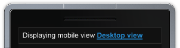

*Link to switch to Desktop View*

The view switcher uses a new feature called **Browser Overriding**. This feature lets your application treat requests as if they were coming from a different browser (user agent) than the one they are actually coming from.

In this task, you will explore the sample implementation of a view-switcher added by jQuery.Mobile.MVC and the new browser overriding features in ASP.NET MVC 4.

1. Switch back to Visual Studio.
2. Open the **\_Layout.Mobile.cshtml** view located under the **Views\Shared** folder and notice the view-switcher component being referenced as a partial view.

    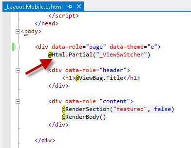

    *Mobile layout using View-Switcher component*
3. Open the **\_ViewSwitcher.cshtml** partial view.

    The partial view uses the new method **ViewContext.HttpContext.GetOverriddenBrowser()** to determine the origin of the web request and show the corresponding link to switch either to the Desktop or Mobile views.

    The **GetOverridenBrowser** method returns an **HttpBrowserCapabilitiesBase** instance that corresponds to the user agent currently set for the request (actual or overridden). You can use this value to get properties such as **IsMobileDevice**.

    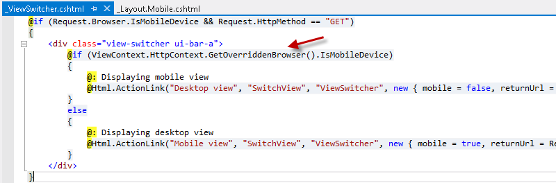

    *ViewSwitcher partial view*
4. Open the **ViewSwitcherController.cs** class located in the **Controllers** folder. Check out that SwitchView action is called by the link in the ViewSwitcher component, and notice the new HttpContext methods.

    - The **HttpContext.ClearOverridenBrowser()** method removes any overridden user agent for the current request.
    - The **HttpContext.SetOverridenBrowser()** method overrides the request's actual user agent value using the specified user agent.  
        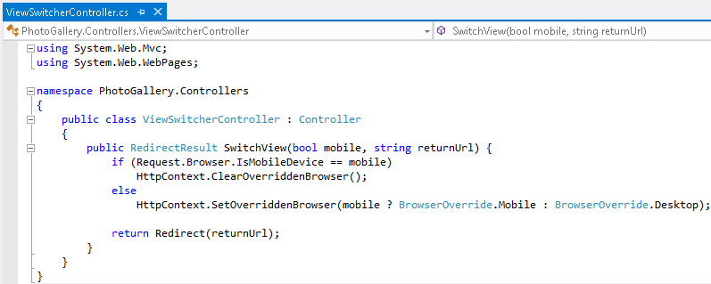  
*ViewSwitcher Controller*

        Browser Overriding is a core feature of ASP.NET MVC 4, which is also available even if you do not install the jQuery.Mobile.MVC package. However, this feature affects only view, layout, and partial-view, and it does not affect any of the features that depend on the Request.Browser object.

#### Task 5 - Adding the View-Switcher in the Desktop View

In this task, you will update the desktop layout to include the view-switcher. This will allow mobile users to go back to the mobile view when browsing the desktop view.

1. Refresh the site in the **Windows Phone Emulator**.
2. Click on the **Desktop view** link at the top of the gallery. Notice there is no view-switcher in the desktop view to allow you return to the mobile view.
3. Go back to Visual Studio and open the **\_Layout.cshtml** view.
4. Find the login section and insert a call to render the **\_ViewSwitcher** partial view below the **\_LogOnPartial** partial view. Then, press **CTRL + S** to save the changes.

    [!code-cshtml[Main](whats-new-in-aspnet-mvc-4/samples/sample14.cshtml)]
5. Press **CTRL + S** to save the changes.
6. Refresh the page in the Windows Phone Emulator and double-click the screen to zoom in. Notice that the home page now shows the **Mobile view** link that switches from mobile to desktop view.

    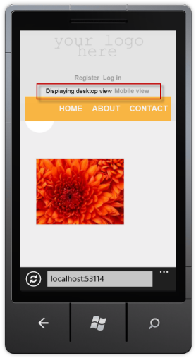

    *View Switcher rendered in desktop view*
7. Switch to the Mobile view again and browse to **About** page (http://localhost[port]/Home/About). Notice that, even if you haven't created an About.Mobile.cshtml view, the About page is displayed using the mobile layout (\_Layout.Mobile.cshtml).

    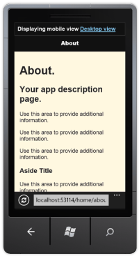

    *About page*
8. Finally, open the site in a desktop Web browser. Notice that none of the previous updates has affected the desktop view.

    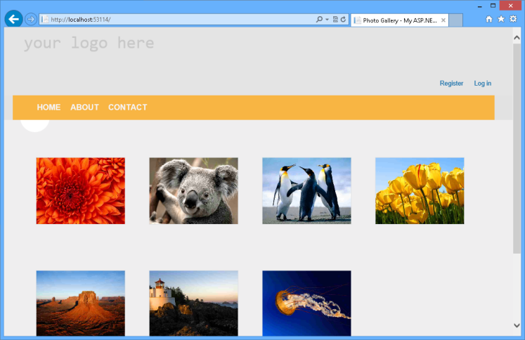

    *PhotoGallery desktop view*

#### Task 6 - Creating New Display Modes

The new display modes feature lets an application select views depending on the browser that is generating the request. For example, if a desktop browser requests the Home page, the application will return the **Views\Home\Index.cshtml** template. Then, if a mobile browser requests the Home page, the application will return the **Views\Home\Index.mobile.cshtml** template.

In this task, you will create a customized layout for iPhone devices, and you will have to simulate requests from iPhone devices. To do this, you can use either an iPhone emulator/simulator (like [Electric Mobile Simulator](http://www.electricplum.com/)) or a browser with add-ons that modify the user agent. For instructions on how to set the user agent string in an Safari browser to emulate an iPhone, see [How to let Safari pretend it's IE](http://www.davidalison.com/2008/05/how-to-let-safari-pretend-its-ie.html) in David Alison's blog.

**Notice that this task is optional and you can continue throughout the lab without executing it.**

1. In Visual Studio, press **SHIFT** + **F5** to stop debugging the application.
2. Open **Global.asax.cs** and add the following using statement.

    [!code-csharp[Main](whats-new-in-aspnet-mvc-4/samples/sample15.cs)]
3. Add the following highlighted code into the Application\_Start method.

    (Code Snippet - *ASP.NET MVC 4 Lab - Ex03 - iPhone DisplayMode*)

    [!code-csharp[Main](whats-new-in-aspnet-mvc-4/samples/sample16.cs)]

    You have registered a new **DefaultDisplayMode named &quot;iPhone&quot;**, within the static **DisplayModeProvider.Instance.Modes** static list, that will be matched against each incoming request. If the incoming request contains the string &quot;iPhone&quot;, ASP.NET MVC will find the views whose name contain the &quot;iPhone&quot; suffix. The 0 parameter indicates how specific is the new mode; for instance, this view is more specific than the general &quot;.mobile&quot; rule that matches requests from mobile devices.

    After this code runs, when an iPhone browser generates a request, your application will use the **Views\Shared\\_Layout.iPhone.cshtml** layout you will create in the next steps.

    > [!NOTE]
    > This way of testing the request for iPhone has been simplified for demo purposes and might not work as expected for every iPhone user agent string (for example test is case sensitive).
4. Create a copy of the **\_Layout.Mobile.cshtml** file in the **Views\Shared** folder and rename the copy to &quot;**\_Layout.iPhone.csthml**&quot;.
5. Open **\_Layout.iPhone.csthml** you created in the previous step.
6. Find the div element with the data-role attribute set to **page** and change the **data-theme** attribute to &quot;**a**&quot;.

    [!code-cshtml[Main](whats-new-in-aspnet-mvc-4/samples/sample17.cshtml)]

    Now you have 3 layouts in your ASP.NET MVC 4 application:

    1. **\_Layout.cshtml**: default layout used for desktop browsers.
    2. **\_Layout.mobile.cshtml**: default layout used for mobile devices.
    3. **\_Layout.iPhone.cshtml**: specific layout for iPhone devices, using a different color scheme to differentiate from \_Layout.mobile.cshtml.
7. Press **F5** to run the application and browse the site in the **Windows Phone Emulator**.
8. Open an **iPhone simulator** (see [Appendix C](#AppendixC) for instructions on how to install and configure an iPhone simulator), and browse to the site too. Notice that each phone is using the specific template.

    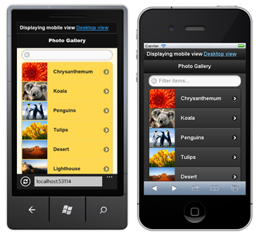

    *Using different views for each mobile device*

### Exercise 4: Using Asynchronous Controllers

Microsoft .NET Framework 4.5 introduces new language features in C# and Visual Basic to provide a new foundation for asynchrony in .NET programming. This new foundation makes asynchronous programming similar to - and about as straightforward as - synchronous programming. You are now able to write asynchronous action methods in ASP.NET MVC 4 by using the **AsyncController** class. You can use asynchronous action methods for long-running, non-CPU bound requests. This avoids blocking the Web server from performing work while the request is being processed. The AsyncController class is typically used for long-running Web service calls.

This exercise explains the basics of asynchronous operation in ASP.NET MVC 4. If you want a deeper dive, you can check out the following article: [[https://msdn.microsoft.com/en-us/library/ee728598%28v=vs.100%29.aspx](https://msdn.microsoft.com/en-us/library/ee728598%28v=vs.100%29.aspx)](https://msdn.microsoft.com/en-us/library/ee728598%28v=vs.100%29.aspx)

#### Task 1 - Implementing an Asynchronous Controller

1. Open the **Begin** solution located at **Source/Ex4-Async/Begin/** folder. Otherwise, you might continue using the **End** solution obtained by completing the previous exercise.

    1. If you opened the provided **Begin** solution, you will need to download some missing NuGet packages before continue. To do this, click the **Project** menu and select **Manage NuGet Packages**.
    2. In the **Manage NuGet Packages** dialog, click **Restore** in order to download missing packages.
    3. Finally, build the solution by clicking **Build** | **Build Solution**.

    > [!NOTE]
    > One of the advantages of using NuGet is that you don't have to ship all the libraries in your project, reducing the project size. With NuGet Power Tools, by specifying the package versions in the Packages.config file, you will be able to download all the required libraries the first time you run the project. This is why you will have to run these steps after you open an existing solution from this lab.
2. Open the **HomeController.cs** class from the **Controllers** folder.
3. Add the following using statement.

    [!code-csharp[Main](whats-new-in-aspnet-mvc-4/samples/sample18.cs)]
4. Update the **HomeController** class to inherit from **AsyncController**. Controllers that derive from AsyncController enable ASP.NET to process asynchronous requests, and they can still service synchronous action methods.

    [!code-csharp[Main](whats-new-in-aspnet-mvc-4/samples/sample19.cs)]
5. Add the **async** keyword to the **Index** method and make it return the type **Task&lt;ActionResult&gt;**.

    [!code-csharp[Main](whats-new-in-aspnet-mvc-4/samples/sample20.cs)]

    > [!NOTE]
    > The **async** keyword is one of the new keywords the .NET Framework 4.5 provides; it tells the compiler that this method contains asynchronous code. A **Task** object represents an asynchronous operation that may complete at some point in the future.
6. Replace the **client.GetAsync()** call with the full async version using await keyword as shown below.

    (Code Snippet - *ASP.NET MVC 4 Lab - Ex04 - GetAsync*)

    [!code-csharp[Main](whats-new-in-aspnet-mvc-4/samples/sample21.cs)]

    > [!NOTE]
    > In the previous version, you were using the **Result** property from the **Task** object to block the thread until the result is returned (sync version).
    > 
    > Adding the **await** keyword tells the compiler to asynchronously wait for the task returned from the method call. This means that the rest of the code will be executed as a callback only after the awaited method completes. Another thing to notice is that you do not need to change your try-catch block in order to make this work: the exceptions that happen in background or in foreground will still be caught without any extra work using a handler provided by the framework.
7. Change the code to continue with the asynchronous implementation by replacing the lines with the new code as shown below

    (Code Snippet - *ASP.NET MVC 4 Lab - Ex04 - ReadAsStringAsync*)

    [!code-csharp[Main](whats-new-in-aspnet-mvc-4/samples/sample22.cs)]
8. Run the application. You will notice no major changes, but your code will not block a thread from the thread pool making a better usage of the server resources and improving performance.

    > [!NOTE]
    > You can learn more about the new asynchronous programming features in the lab &quot;**Asynchronous Programming in .NET 4.5 with C# and Visual Basic**&quot; included in the Visual Studio Training Kit.

#### Task 2 - Handling Time-Outs with Cancellation Tokens

Asynchronous action methods that return Task instances can also support time-outs. In this task, you will update the Index method code to handle a time-out scenario using a cancellation token.

1. Go back to Visual Studio and press **SHIFT + F5** to stop debugging.
2. Add the following using statement to the **HomeController.cs** file.

    [!code-csharp[Main](whats-new-in-aspnet-mvc-4/samples/sample23.cs)]
3. Update the Index action to receive a **CancellationToken** argument.

    [!code-csharp[Main](whats-new-in-aspnet-mvc-4/samples/sample24.cs)]
4. Update the **GetAsync** call to pass the cancellation token.

    (Code Snippet - *ASP.NET MVC 4 Lab - Ex04 - SendAsync with CancellationToken*)

    [!code-csharp[Main](whats-new-in-aspnet-mvc-4/samples/sample25.cs)]
5. Decorate the *Index* method with an **AsyncTimeout** attribute set to 500 milliseconds and a **HandleError** attribute configured to handle **TaskCanceledException** by redirecting to a **TimedOut** view.

    (Code Snippet - *ASP.NET MVC 4 Lab - Ex04 - Attributes*)

    [!code-csharp[Main](whats-new-in-aspnet-mvc-4/samples/sample26.cs)]
6. Open the **PhotoController** class and update the **Gallery** method to delay the execution 1000 miliseconds (1 second) to simulate a long running task.

    [!code-csharp[Main](whats-new-in-aspnet-mvc-4/samples/sample27.cs)]
7. Open the **Web.config** file and enable custom errors by adding the following element.

    [!code-xml[Main](whats-new-in-aspnet-mvc-4/samples/sample28.xml)]
8. Create a new view in **Views\Shared** named **TimedOut** and use the default layout. In the Solution Explorer, right-click the **Views\Shared** folder and select **Add | View**.

    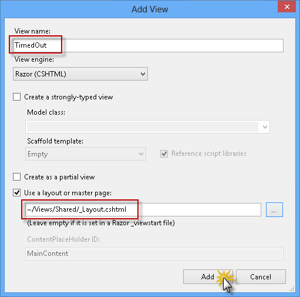

    *Using different views for each mobile device*
9. Update the **TimedOut** view content as shown below.

    [!code-cshtml[Main](whats-new-in-aspnet-mvc-4/samples/sample29.cshtml)]
10. Run the application and navigate to the root URL. As you have added a **Thread.Sleep** of 1000 milliseconds, you will get a time-out error, generated by the **AsyncTimeout** attribute and catch by the **HandleError** attribute.

    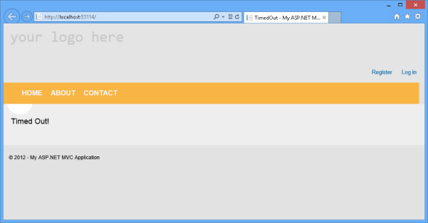

    *Time-out exception handled*

> [!NOTE]
> Additionally, you can deploy this application to Windows Azure Web Sites following [Appendix D: Publishing an ASP.NET MVC 4 Application using Web Deploy](#AppendixD).

## Summary

In this hands-on-lab, you've observed some of the new features resident in ASP.NET MVC 4. The following concepts have been discussed:

- Take advantage of the enhancements to the ASP.NET MVC project templates-including the new mobile application project template
- Use the HTML5 viewport attribute and CSS media queries to improve the display on mobile devices
- Use jQuery Mobile for progressive enhancements and for building touch-optimized web UI
- Create mobile-specific views
- Use the view-switcher component to toggle between mobile and desktop views in the application
- Create asynchronous controllers using task support

## Appendix A: Using Code Snippets

With code snippets, you have all the code you need at your fingertips. The lab document will tell you exactly when you can use them, as shown in the following figure.

*Using Visual Studio code snippets to insert code into your project*

***To add a code snippet using the keyboard (C# only)***

1. Place the cursor where you would like to insert the code.
2. Start typing the snippet name (without spaces or hyphens).
3. Watch as IntelliSense displays matching snippets' names.
4. Select the correct snippet (or keep typing until the entire snippet's name is selected).
5. Press the Tab key twice to insert the snippet at the cursor location.

*Start typing the snippet name*

*Press Tab to select the highlighted snippet*

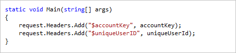

*Press Tab again and the snippet will expand*

***To add a code snippet using the mouse (C#, Visual Basic and XML)***

1. Right-click where you want to insert the code snippet.
2. Select **Insert Snippet** followed by **My Code Snippets**.
3. Pick the relevant snippet from the list, by clicking on it.

*Right-click where you want to insert the code snippet and select Insert Snippet*

*Pick the relevant snippet from the list, by clicking on it*

## Appendix B: Installing Visual Studio Express 2012 for Web

You can install **Microsoft Visual Studio Express 2012 for Web** or another &quot;Express&quot; version using the **[Microsoft Web Platform Installer](https://www.microsoft.com/web/downloads/platform.aspx)**. The following instructions guide you through the steps required to install *Visual studio Express 2012 for Web* using *Microsoft Web Platform Installer*.

1. Go to [[https://go.microsoft.com/?linkid=9810169](https://go.microsoft.com/?linkid=9810169)](https://go.microsoft.com/?linkid=9810169). Alternatively, if you already have installed Web Platform Installer, you can open it and search for the product &quot;*Visual Studio Express 2012 for Web with Windows Azure SDK*&quot;.
2. Click on **Install Now**. If you do not have **Web Platform Installer** you will be redirected to download and install it first.
3. Once **Web Platform Installer** is open, click **Install** to start the setup.

    

    *Install Visual Studio Express*
4. Read all the products' licenses and terms and click **I Accept** to continue.

    

    *Accepting the license terms*
5. Wait until the downloading and installation process completes.

    

    *Installation progress*
6. When the installation completes, click **Finish**.

    

    *Installation completed*
7. Click **Exit** to close Web Platform Installer.
8. To open Visual Studio Express for Web, go to the **Start** screen and start writing &quot;**VS Express**&quot;, then click on the **VS Express for Web** tile.

    

    *VS Express for Web tile*

## Appendix C: Installing WebMatrix 2 and iPhone Simulator

To run your site in a simulated iPhone device you can use the WebMatrix extension &quot;Electric Mobile Simulator for the iPhone&quot;. Also, you can configure the same extension to run the simulator from Visual Studio 2012.

#### Task 1 - Installing WebMatrix 2

1. Go to [[https://go.microsoft.com/?linkid=9809776](https://go.microsoft.com/?linkid=9809776)](https://go.microsoft.com/?linkid=9810169). Alternatively, if you already have installed Web Platform Installer, you can open it and search for the product &quot;*WebMatrix 2*&quot;.
2. Click on **Install Now**. If you do not have **Web Platform Installer** you will be redirected to download and install it first.
3. Once **Web Platform Installer** is open, click **Install** to start the setup.

    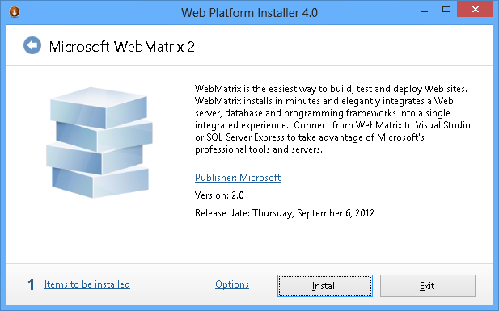

    *Install WebMatrix 2*
4. Read all the products' licenses and terms and click **I Accept** to continue.

    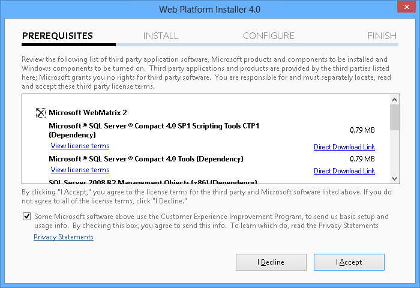

    *Accepting the license terms*
5. Wait until the downloading and installation process completes.

    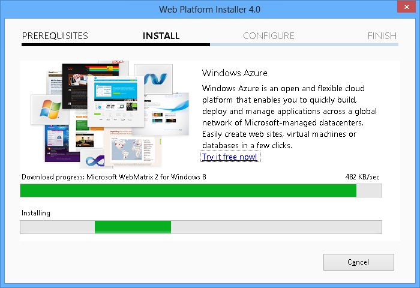

    *Installation progress*
6. When the installation completes, click **Finish**.

    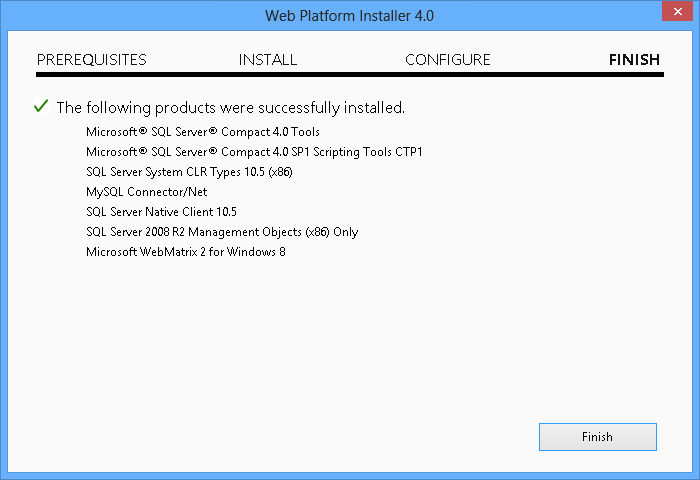

    *Installation completed*
7. Click **Exit** to close Web Platform Installer.

#### Task 2 - Installing the iPhone Simulator Extension

1. Run **WebMatrix** and open any existing Web site or create a new one.
2. Click the **Run** button from the **Home** ribbon and select **Add new**.

    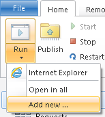

    *Adding new WebMatrix extension*
3. Select **iPhone Simulator** and click **Install**.

    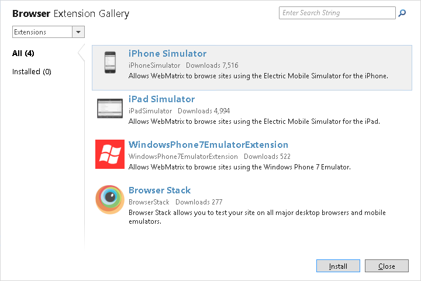

    *Browsing WebMatrix extensions*
4. In the package details, click **Install** to continue with the extension installation.

    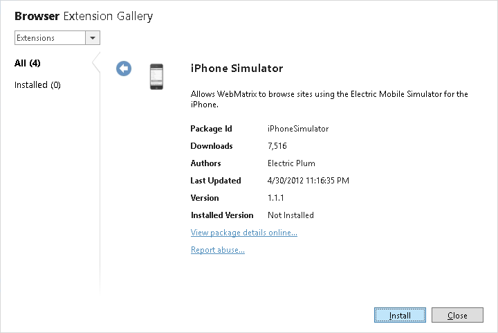

    *iPhone Simulator extension*
5. Read and accept the extension EULA.

    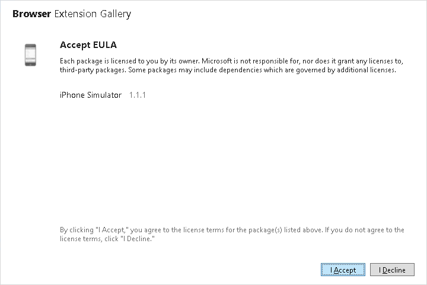

    *WebMatrix extension EULA*
6. Now, you can run your Web site from WebMatrix using the iPhone Simulator option.

    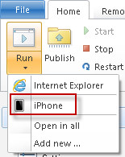

    *Run using iPhone*

#### Task 3 - Configuring Visual Studio 2012 to run iPhone Simulator

1. Open **Visual Studio 2012** and open any Web site or create a new project.
2. Click the down arrow from the Run button and select **Browse with**.

    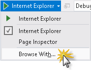

    *Browse with*
3. In the &quot;Browse With&quot; dialog, click **Add**.
4. In the &quot;Add Program&quot; dialog, use the following values:

    - **Program**: C:\Users\*{CurrentUser}*\AppData\Local\Microsoft\WebMatrix\Extensions\20\iPhoneSimulator\ElectricMobileSim\ElectricMobileSim.exe *(update the path accordingly)*
    - **Arguments**: &quot;1&quot;
    - **Friendly name**: iPhone Simulator

    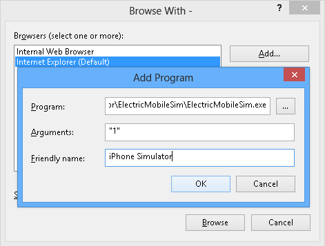

    *Add program to browse with*
5. Click **OK** and close the dialogs.
6. Now you are able to run your Web applications in the iPhone simulator from Visual Studio 2012.

    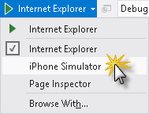

    *Browse with iPhone Simulator*

## Appendix D: Publishing an ASP.NET MVC 4 Application using Web Deploy

This appendix will show you how to create a new web site from the Windows Azure Management Portal and publish the application you obtained by following the lab, taking advantage of the Web Deploy publishing feature provided by Windows Azure.

#### Task 1 - Creating a New Web Site from the Windows Azure Portal

1. Go to the [Windows Azure Management Portal](https://manage.windowsazure.com/) and sign in using the Microsoft credentials associated with your subscription.

    > [!NOTE]
    > With Windows Azure you can host 10 ASP.NET Web Sites for free and then scale as your traffic grows. You can sign up [here](http://aka.ms/aspnet-hol-azure).

    

    *Log on to Windows Azure Management Portal*
2. Click **New** on the command bar.

    

    *Creating a new Web Site*
3. Click **Compute** | **Web Site**. Then select **Quick Create** option. Provide an available URL for the new web site and click **Create Web Site**.

    > [!NOTE]
    > A Windows Azure Web Site is the host for a web application running in the cloud that you can control and manage. The Quick Create option allows you to deploy a completed web application to the Windows Azure Web Site from outside the portal. It does not include steps for setting up a database.

    

    *Creating a new Web Site using Quick Create*
4. Wait until the new **Web Site** is created.
5. Once the Web Site is created click the link under the **URL** column. Check that the new Web Site is working.

    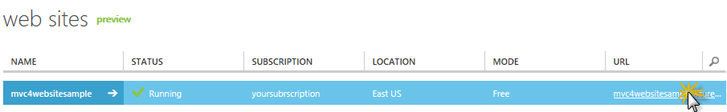

    *Browsing to the new web site*

    

    *Web site running*
6. Go back to the portal and click the name of the web site under the **Name** column to display the management pages.

    

    *Opening the Web Site management pages*
7. In the **Dashboard** page, under the **quick glance** section, click the **Download publish profile** link.

    > [!NOTE]
    > The *publish profile* contains all of the information required to publish a web application to a Windows Azure website for each enabled publication method. The publish profile contains the URLs, user credentials and database strings required to connect to and authenticate against each of the endpoints for which a publication method is enabled. **Microsoft WebMatrix 2**, **Microsoft Visual Studio Express for Web** and **Microsoft Visual Studio 2012** support reading publish profiles to automate configuration of these programs for publishing web applications to Windows Azure websites.

    

    *Downloading the Web Site publish profile*
8. Download the publish profile file to a known location. Further in this exercise you will see how to use this file to publish a web application to a Windows Azure Web Sites from Visual Studio.

    

    *Saving the publish profile file*

#### Task 2 - Configuring the Database Server

If your application makes use of SQL Server databases you will need to create a SQL Database server. If you want to deploy a simple application that does not use SQL Server you might skip this task.

1. You will need a SQL Database server for storing the application database. You can view the SQL Database servers from your subscription in the Windows Azure Management portal at **Sql Databases** | **Servers** | **Server's Dashboard**. If you do not have a server created, you can create one using the **Add** button on the command bar. Take note of the **server name and URL, administrator login name and password**, as you will use them in the next tasks. Do not create the database yet, as it will be created in a later stage.

    

    *SQL Database Server Dashboard*
2. In the next task you will test the database connection from Visual Studio, for that reason you need to include your local IP address in the server's list of **Allowed IP Addresses**. To do that, click **Configure**, select the IP address from **Current Client IP Address** and paste it on the **Start IP Address** and **End IP Address** text boxes and click the  button.

    

    *Adding Client IP Address*
3. Once the **Client IP Address** is added to the allowed IP addresses list, click on **Save** to confirm the changes.

    

    *Confirm Changes*

#### Task 3 - Publishing an ASP.NET MVC 4 Application using Web Deploy

1. Go back to the ASP.NET MVC 4 solution. In the **Solution Explorer**, right-click the web site project and select **Publish**.

    

    *Publishing the web site*
2. Import the publish profile you saved in the first task.

    

    *Importing publish profile*
3. Click **Validate Connection**. Once Validation is complete click **Next**.

    > [!NOTE]
    > Validation is complete once you see a green checkmark appear next to the Validate Connection button.

    

    *Validating connection*
4. In the **Settings** page, under the **Databases** section, click the button next to your database connection's textbox (i.e. **DefaultConnection**).

    

    *Web deploy configuration*
5. Configure the database connection as follows:

    - In the **Server name** type your SQL Database server URL using the *tcp:* prefix.
    - In **User name** type your server administrator login name.
    - In **Password** type your server administrator login password.
    - Type a new database name, for example: *MVC4SampleDB*.

    

    *Configuring destination connection string*
6. Then click **OK**. When prompted to create the database click **Yes**.

    

    *Creating the database*
7. The connection string you will use to connect to SQL Database in Windows Azure is shown within Default Connection textbox. Then click **Next**.

    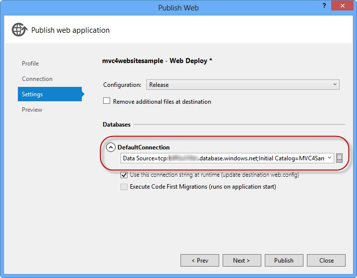

    *Connection string pointing to SQL Database*
8. In the **Preview** page, click **Publish**.

    

    *Publishing the web application*
9. Once the publishing process finishes, your default browser will open the published web site.

    

    *Application published to Windows Azure*