Part 1: Overview and File->New Project
====================
by [Jon Galloway](https://github.com/jongalloway)

> The MVC Music Store is a tutorial application that introduces and explains step-by-step how to use ASP.NET MVC and Visual Studio for web development.  
>   
> The MVC Music Store is a lightweight sample store implementation which sells music albums online, and implements basic site administration, user sign-in, and shopping cart functionality.  
>   
> This tutorial series details all of the steps taken to build the ASP.NET MVC Music Store sample application. Part 1 covers Overview and File-&gt;New Project.

## Overview

The MVC Music Store is a tutorial application that introduces and explains step-by-step how to use ASP.NET MVC and Visual Web Developer for web development. We'll be starting slowly, so beginner level web development experience is okay.

The application we'll be building is a simple music store. There are three main parts to the application: shopping, checkout, and administration.

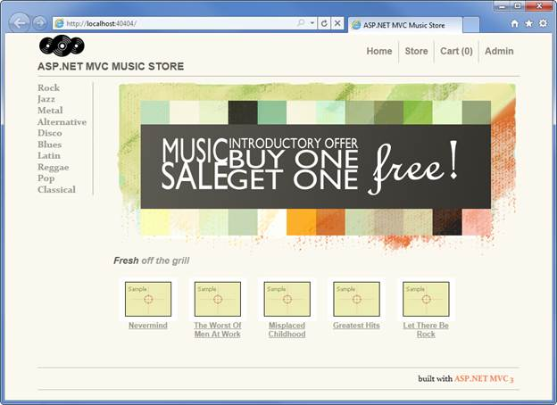

Visitors can browse Albums by Genre:

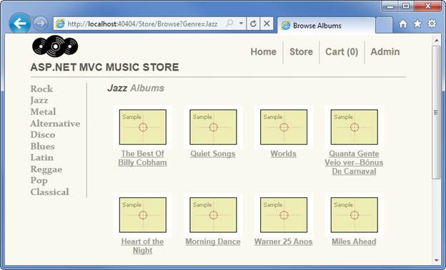

They can view a single album and add it to their cart:

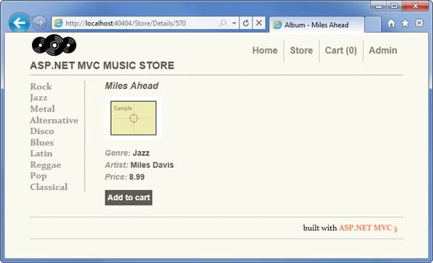

They can review their cart, removing any items they no longer want:

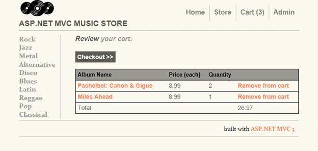

Proceeding to Checkout will prompt them to login or register for a user account.

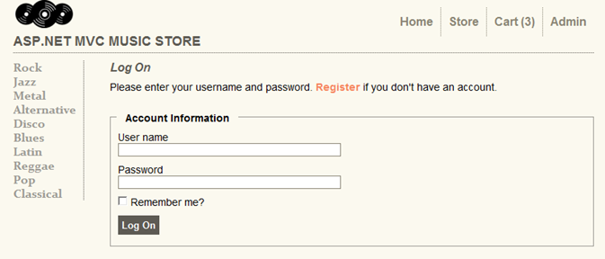

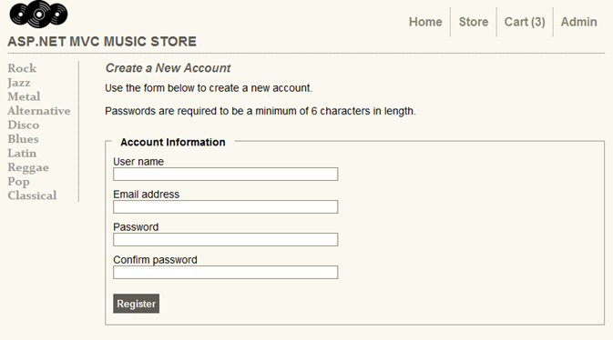

After creating an account, they can complete the order by filling out shipping and payment information. To keep things simple, we're running an amazing promotion: everything's free if they enter promotion code "FREE"!

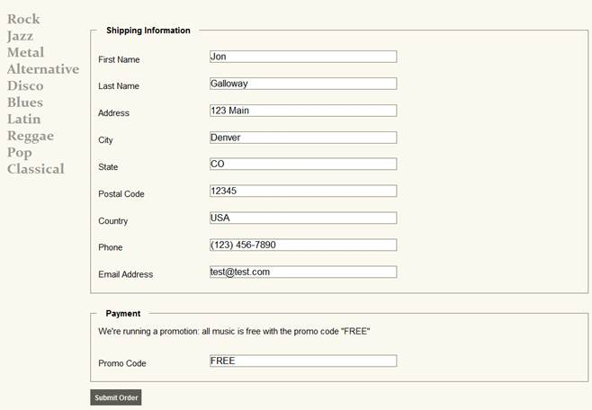

After ordering, they see a simple confirmation screen:

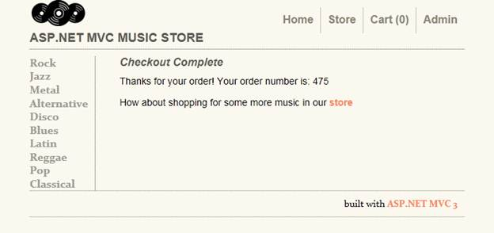

In addition to customer-faceing pages, we'll also build an administrator section that shows a list of albums from which Administrators can Create, Edit, and Delete albums:

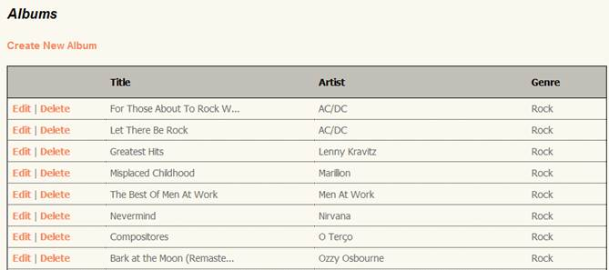

## 1. File -&gt; New Project

### Installing the software

This tutorial will begin by creating a new ASP.NET MVC 3 project using the free Visual Web Developer 2010 Express (which is free), and then we'll incrementally add features to create a complete functioning application. Along the way, we'll cover database access, form posting scenarios, data validation, using master pages for consistent page layout, using AJAX for page updates and validation, user login, and more.

You can follow along step by step, or you can download the completed application from [http://mvcmusicstore.codeplex.com](http://mvcmusicstore.codeplex.com).

You can use either Visual Studio 2010 SP1 or Visual Web Developer 2010 Express SP1 (a free version of Visual Studio 2010) to build the application. We'll be using the SQL Server Compact (also free) to host the database. Before you start, make sure you've installed the prerequisites listed below.

- [Visual Studio Web Developer Express SP1 prerequisites]
- [ASP.NET MVC 3 Tools Update]
- [SQL Server Compact 4.0] - including both runtime and tools support

### Creating a new ASP.NET MVC 3 project

We'll start by selecting "New Project" from the File menu in Visual Web Developer. This brings up the New Project dialog.

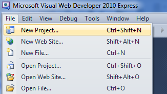

We'll select the Visual C# -&gt; Web Templates group on the left, then choose the "ASP.NET MVC 3 Web Application" template in the center column. Name your project MvcMusicStore and press the OK button.

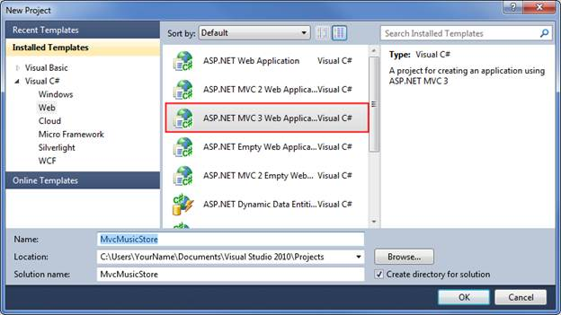

This will display a secondary dialog which allows us to make some MVC specific settings for our project. Select the following:

Project Template - select Empty

View Engine - select Razor

Use HTML5 semantic markup - checked

Verify that your settings are as shown below, then press the OK button.

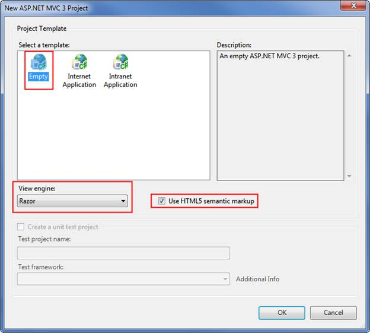

This will create our project. Let's take a look at the folders that have been added to our application in the Solution Explorer on the right side.

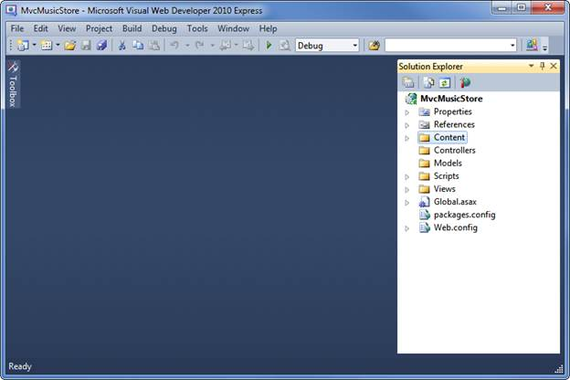

The Empty MVC 3 template isn't completely empty – it adds a basic folder structure:

ASP.NET MVC makes use of some basic naming conventions for folder names:

| **Folder** | **Purpose** |
| --- | --- |
| **/Controllers** | Controllers respond to input from the browser, decide what to do with it, and return response to the user. |
| **/Views** | Views hold our UI templates |
| **/Models** | Models hold and manipulate data |
| **/Content** | This folder holds our images, CSS, and any other static content |
| **/Scripts** | This folder holds our JavaScript files |

These folders are included even in an Empty ASP.NET MVC application because the ASP.NET MVC framework by default uses a "convention over configuration" approach and makes some default assumptions based on folder naming conventions. For instance, controllers look for views in the Views folder by default without you having to explicitly specify this in your code. Sticking with the default conventions reduces the amount of code you need to write, and can also make it easier for other developers to understand your project. We'll explain these conventions more as we build our application.

*Please use the Discussions at [http://mvcmusicstore.codeplex.com](http://mvcmusicstore.codeplex.com) for any questions or comments.*

>[!div class="step-by-step"]
[Next](mvc-music-store-part-2.md)