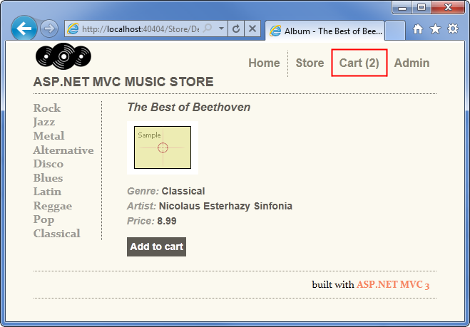
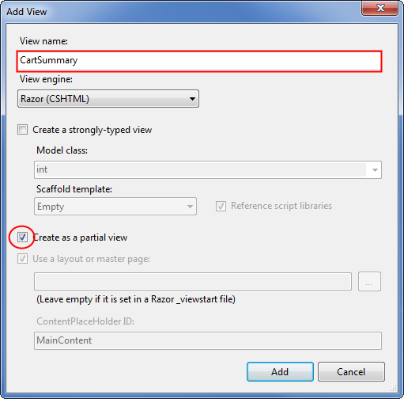
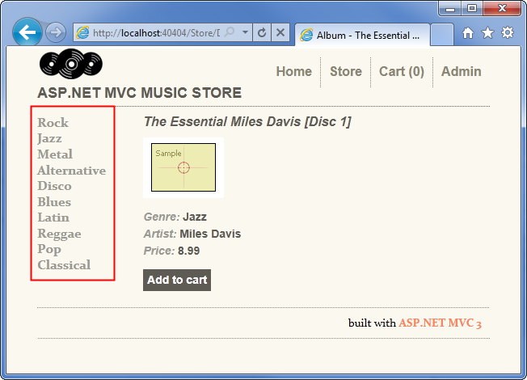
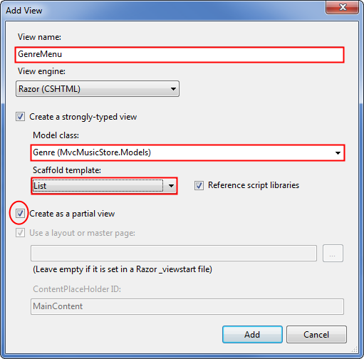
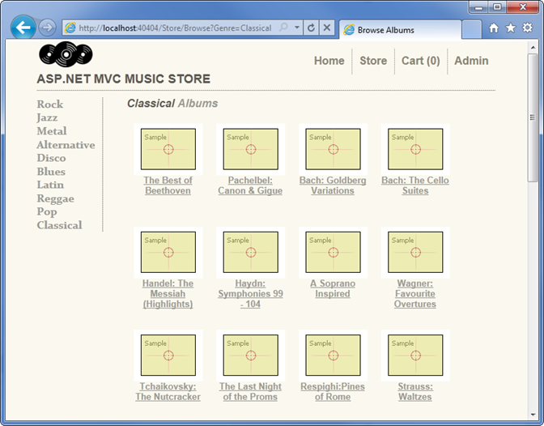
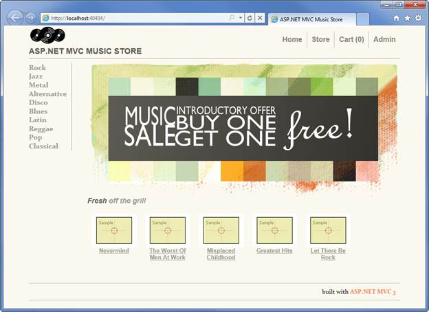

Part 10: Final Updates to Navigation and Site Design, Conclusion
====================
by [Jon Galloway](https://github.com/jongalloway)

> The MVC Music Store is a tutorial application that introduces and explains step-by-step how to use ASP.NET MVC and Visual Studio for web development.  
>   
> The MVC Music Store is a lightweight sample store implementation which sells music albums online, and implements basic site administration, user sign-in, and shopping cart functionality.  
>   
> This tutorial series details all of the steps taken to build the ASP.NET MVC Music Store sample application. Part 10 covers Final Updates to Navigation and Site Design, Conclusion.

We've completed all the major functionality for our site, but we still have some features to add to the site navigation, the home page, and the Store Browse page.

## Creating the Shopping Cart Summary Partial View

We want to expose the number of items in the user's shopping cart across the entire site.

We can easily implement this by creating a partial view which is added to our Site.master.

As shown previously, the ShoppingCart controller includes a CartSummary action method which returns a partial view:

[!code-csharp[Main](mvc-music-store-part-10/samples/sample1.cs)]

To create the CartSummary partial view, right-click on the Views/ShoppingCart folder and select Add View. Name the view CartSummary and check the "Create a partial view" checkbox as shown below.

The CartSummary partial view is really simple - it's just a link to the ShoppingCart Index view which shows the number of items in the cart. The complete code for CartSummary.cshtml is as follows:

[!code-cshtml[Main](mvc-music-store-part-10/samples/sample2.cshtml)]

We can include a partial view in any page in the site, including the Site master, by using the Html.RenderAction method. RenderAction requires us to specify the Action Name ("CartSummary") and the Controller Name ("ShoppingCart") as below.

[!code-cshtml[Main](mvc-music-store-part-10/samples/sample3.cshtml)]

Before adding this to the site Layout, we will also create the Genre Menu so we can make all of our Site.master updates at one time.

## Creating the Genre Menu Partial View

We can make it a lot easier for our users to navigate through the store by adding a Genre Menu which lists all the Genres available in our store.

We will follow the same steps also create a GenreMenu partial view, and then we can add them both to the Site master. First, add the following GenreMenu controller action to the StoreController:

[!code-csharp[Main](mvc-music-store-part-10/samples/sample4.cs)]

This action returns a list of Genres which will be displayed by the partial view, which we will create next.

*Note: We have added the [ChildActionOnly] attribute to this controller action, which indicates that we only want this action to be used from a Partial View. This attribute will prevent the controller action from being executed by browsing to /Store/GenreMenu. This isn't required for partial views, but it is a good practice, since we want to make sure our controller actions are used as we intend. We are also returning PartialView rather than View, which lets the view engine know that it shouldn't use the Layout for this view, as it is being included in other views.*

Right-click on the GenreMenu controller action and create a partial view named GenreMenu which is strongly typed using the Genre view data class as shown below.

Update the view code for the GenreMenu partial view to display the items using an unordered list as follows.

[!code-cshtml[Main](mvc-music-store-part-10/samples/sample5.cshtml)]

## Updating Site Layout to display our Partial Views

We can add our partial views to the Site Layout (/Views/Shared/\_Layout.cshtml) by calling Html.RenderAction(). We'll add them both in, as well as some additional markup to display them, as shown below:

[!code-cshtml[Main](mvc-music-store-part-10/samples/sample6.cshtml)]

Now when we run the application, we will see the Genre in the left navigation area and the Cart Summary at the top.

## Update to the Store Browse page

The Store Browse page is functional, but doesn't look very good. We can update the page to show the albums in a better layout by updating the view code (found in /Views/Store/Browse.cshtml) as follows:

[!code-cshtml[Main](mvc-music-store-part-10/samples/sample7.cshtml)]

Here we are making use of Url.Action rather than Html.ActionLink so that we can apply special formatting to the link to include the album artwork.

*Note: We are displaying a generic album cover for these albums. This information is stored in the database and is editable via the Store Manager. You are welcome to add your own artwork.*

Now when we browse to a Genre, we will see the albums shown in a grid with the album artwork.

## Updating the Home Page to show Top Selling Albums

We want to feature our top selling albums on the home page to increase sales. We'll make some updates to our HomeController to handle that, and add in some additional graphics as well.

First, we'll add a navigation property to our Album class so that EntityFramework knows that they're associated. The last few lines of our **Album** class should now look like this:

[!code-csharp[Main](mvc-music-store-part-10/samples/sample8.cs)]

*Note: This will require adding a using statement to bring in the System.Collections.Generic namespace.*

First, we'll add a storeDB field and the MvcMusicStore.Models using statements, as in our other controllers. Next, we'll add the following method to the HomeController which queries our database to find top selling albums according to OrderDetails.

[!code-csharp[Main](mvc-music-store-part-10/samples/sample9.cs)]

This is a private method, since we don't want to make it available as a controller action. We are including it in the HomeController for simplicity, but you are encouraged to move your business logic into separate service classes as appropriate.

With that in place, we can update the Index controller action to query the top 5 selling albums and return them to the view.

[!code-csharp[Main](mvc-music-store-part-10/samples/sample10.cs)]

The complete code for the updated HomeController is as shown below.

[!code-csharp[Main](mvc-music-store-part-10/samples/sample11.cs)]

Finally, we'll need to update our Home Index view so that it can display a list of albums by updating the Model type and adding the album list to the bottom. We will take this opportunity to also add a heading and a promotion section to the page.

[!code-cshtml[Main](mvc-music-store-part-10/samples/sample12.cshtml)]

Now when we run the application, we'll see our updated home page with top selling albums and our promotional message.

## Conclusion

We've seen that that ASP.NET MVC makes it easy to create a sophisticated website with database access, membership, AJAX, etc. pretty quickly. Hopefully this tutorial has given you the tools you need to get started building your own ASP.NET MVC applications!

*Please use the Discussions at [http://mvcmusicstore.codeplex.com](http://mvcmusicstore.codeplex.com) for any questions or comments.*

>[!div class="step-by-step"]
[Previous](mvc-music-store-part-9.md)