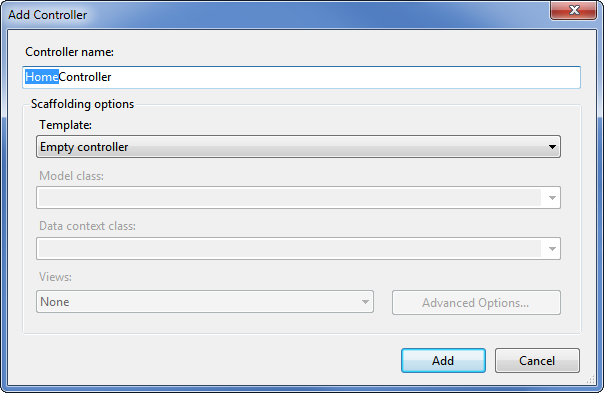
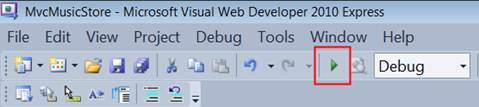
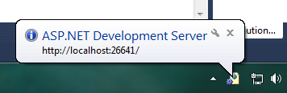
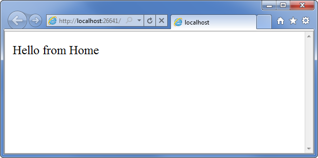
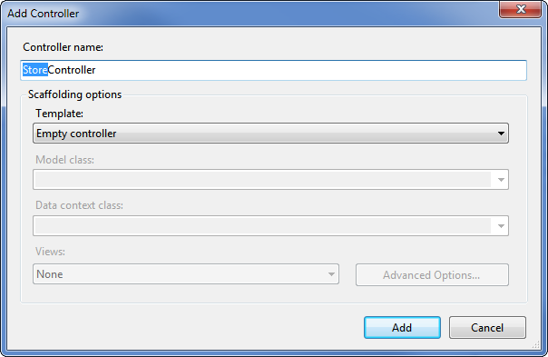
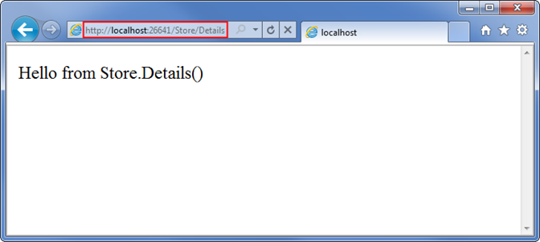
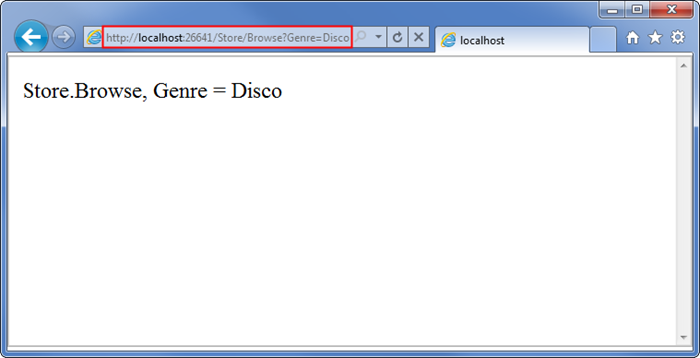
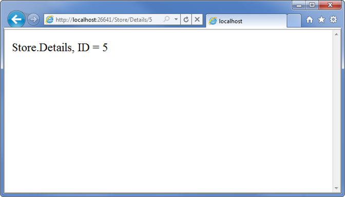

Part 2: Controllers
====================
by [Jon Galloway](https://github.com/jongalloway)

> The MVC Music Store is a tutorial application that introduces and explains step-by-step how to use ASP.NET MVC and Visual Studio for web development.  
>   
> The MVC Music Store is a lightweight sample store implementation which sells music albums online, and implements basic site administration, user sign-in, and shopping cart functionality.  
>   
> This tutorial series details all of the steps taken to build the ASP.NET MVC Music Store sample application. Part 2 covers Controllers.

With traditional web frameworks, incoming URLs are typically mapped to files on disk. For example: a request for a URL like "/Products.aspx" or "/Products.php" might be processed by a "Products.aspx" or "Products.php" file.

Web-based MVC frameworks map URLs to server code in a slightly different way. Instead of mapping incoming URLs to files, they instead map URLs to methods on classes. These classes are called "Controllers" and they are responsible for processing incoming HTTP requests, handling user input, retrieving and saving data, and determining the response to send back to the client (display HTML, download a file, redirect to a different URL, etc.).

## Adding a HomeController

We'll begin our MVC Music Store application by adding a Controller class that will handle URLs to the Home page of our site. We'll follow the default naming conventions of ASP.NET MVC and call it HomeController.

Right-click the "Controllers" folder within the Solution Explorer and select "Add", and then the "Controller…" command:

This will bring up the "Add Controller" dialog. Name the controller "HomeController" and press the Add button.

This will create a new file, HomeController.cs, with the following code:

[!code-csharp[Main](mvc-music-store-part-2/samples/sample1.cs)]

To start as simply as possible, let's replace the Index method with a simple method that just returns a string. We'll make two changes:

- Change the method to return a string instead of an ActionResult
- Change the return statement to return "Hello from Home"

The method should now look like this:

[!code-csharp[Main](mvc-music-store-part-2/samples/sample2.cs)]

## Running the Application

Now let's run the site. We can start our web-server and try out the site using any of the following::

- Choose the Debug ⇨ Start Debugging menu item
- Click the Green arrow button in the toolbar 
- Use the keyboard shortcut, F5.

Using any of the above steps will compile our project, and then cause the ASP.NET Development Server that is built-into Visual Web Developer to start. A notification will appear in the bottom corner of the screen to indicate that the ASP.NET Development Server has started up, and will show the port number that it is running under.

Visual Web Developer will then automatically open a browser window whose URL points to our web-server. This will allow us to quickly try out our web application:

Okay, that was pretty quick – we created a new website, added a three line function, and we've got text in a browser. Not rocket science, but it's a start.

*Note: Visual Web Developer includes the ASP.NET Development Server, which will run your website on a random free "port" number. In the screenshot above, the site is running at `http://localhost:26641/`, so it's using port 26641. Your port number will be different. When we talk about URL's like /Store/Browse in this tutorial, that will go after the port number. Assuming a port number of 26641, browsing to /Store/Browse will mean browsing to `http://localhost:26641/Store/Browse`.*

## Adding a StoreController

We added a simple HomeController that implements the Home Page of our site. Let's now add another controller that we'll use to implement the browsing functionality of our music store. Our store controller will support three scenarios:

- A listing page of the music genres in our music store
- A browse page that lists all of the music albums in a particular genre
- A details page that shows information about a specific music album

We'll start by adding a new StoreController class.. If you haven't already, stop running the application either by closing the browser or selecting the Debug ⇨ Stop Debugging menu item.

Now add a new StoreController. Just like we did with HomeController, we'll do this by right-clicking on the "Controllers" folder within the Solution Explorer and choosing the Add-&gt;Controller menu item

Our new StoreController already has an "Index" method. We'll use this "Index" method to implement our listing page that lists all genres in our music store. We'll also add two additional methods to implement the two other scenarios we want our StoreController to handle: Browse and Details.

These methods (Index, Browse and Details) within our Controller are called "Controller Actions", and as you've already seen with the HomeController.Index()action method, their job is to respond to URL requests and (generally speaking) determine what content should be sent back to the browser or user that invoked the URL.

We'll start our StoreController implementation by changing theIndex() method to return the string "Hello from Store.Index()" and we'll add similar methods for Browse() and Details():

[!code-csharp[Main](mvc-music-store-part-2/samples/sample3.cs)]

Run the project again and browse the following URLs:

- /Store
- /Store/Browse
- /Store/Details

Accessing these URLs will invoke the action methods within our Controller and return string responses:

That's great, but these are just constant strings. Let's make them dynamic, so they take information from the URL and display it in the page output.

First we'll change the Browse action method to retrieve a querystring value from the URL. We can do this by adding a "genre" parameter to our action method. When we do this ASP.NET MVC will automatically pass any querystring or form post parameters named "genre" to our action method when it is invoked.

[!code-csharp[Main](mvc-music-store-part-2/samples/sample4.cs)]

*Note: We're using the HttpUtility.HtmlEncode utility method to sanitize the user input. This prevents users from injecting Javascript into our View with a link like /Store/Browse?Genre=&lt;script&gt;window.location='http://hackersite.com'&lt;/script&gt;.*

Now let's browse to /Store/Browse?Genre=Disco

Let's next change the Details action to read and display an input parameter named ID. Unlike our previous method, we won't be embedding the ID value as a querystring parameter. Instead we'll embed it directly within the URL itself. For example: /Store/Details/5.

ASP.NET MVC lets us easily do this without having to configure anything. ASP.NET MVC's default routing convention is to treat the segment of a URL after the action method name as a parameter named "ID". If your action method has a parameter named ID then ASP.NET MVC will automatically pass the URL segment to you as a parameter.

[!code-csharp[Main](mvc-music-store-part-2/samples/sample5.cs)]

Run the application and browse to /Store/Details/5:

Let's recap what we've done so far:

- We've created a new ASP.NET MVC project in Visual Web Developer
- We've discussed the basic folder structure of an ASP.NET MVC application
- We've learned how to run our website using the ASP.NET Development Server
- We've created two Controller classes: a HomeController and a StoreController
- We've added Action Methods to our controllers which respond to URL requests and return text to the browser

*Please use the Discussions at [http://mvcmusicstore.codeplex.com](http://mvcmusicstore.codeplex.com) for any questions or comments.*

>[!div class="step-by-step"]
[Previous](mvc-music-store-part-1.md)
[Next](mvc-music-store-part-3.md)