Part 3: Views and ViewModels
====================
by [Jon Galloway](https://github.com/jongalloway)

> The MVC Music Store is a tutorial application that introduces and explains step-by-step how to use ASP.NET MVC and Visual Studio for web development.  
>   
> The MVC Music Store is a lightweight sample store implementation which sells music albums online, and implements basic site administration, user sign-in, and shopping cart functionality.  
>   
> This tutorial series details all of the steps taken to build the ASP.NET MVC Music Store sample application. Part 3 covers Views and ViewModels.

So far we've just been returning strings from controller actions. That's a nice way to get an idea of how controllers work, but it's not how you'd want to build a real web application. We are going to want a better way to generate HTML back to browsers visiting our site – one where we can use template files to more easily customize the HTML content send back. That's exactly what Views do.

## Adding a View template

To use a view-template, we'll change the HomeController Index method to return an ActionResult, and have it return View(), like below:

[!code-csharp[Main](mvc-music-store-part-3/samples/sample1.cs)]

The above change indicates that instead of returned a string, we instead want to use a "View" to generate a result back.

We'll now add an appropriate View template to our project. To do this we'll position the text cursor within the Index action method, then right-click and select "Add View". This will bring up the Add View dialog:

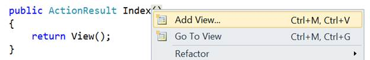 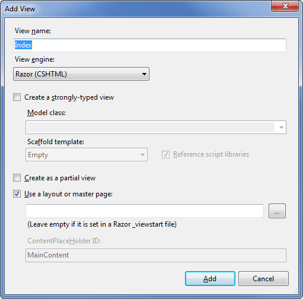

The "Add View" dialog allows us to quickly and easily generate View template files. By default the "Add View" dialog pre-populates the name of the View template to create so that it matches the action method that will use it. Because we used the "Add View" context menu within the Index() action method of our HomeController, the "Add View" dialog above has "Index" as the view name pre-populated by default. We don't need to change any of the options on this dialog, so click the Add button.

When we click the Add button, Visual Web Developer will create a new Index.cshtml view template for us in the \Views\Home directory, creating the folder if doesn't already exist.

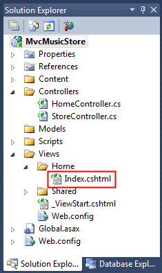

The name and folder location of the "Index.cshtml" file is important, and follows the default ASP.NET MVC naming conventions. The directory name, \Views\Home, matches the controller - which is named HomeController. The view template name, Index, matches the controller action method which will be displaying the view.

ASP.NET MVC allows us to avoid having to explicitly specify the name or location of a view template when we use this naming convention to return a view. It will by default render the \Views\Home\Index.cshtml view template when we write code like below within our HomeController:

[!code-csharp[Main](mvc-music-store-part-3/samples/sample2.cs)]

Visual Web Developer created and opened the "Index.cshtml" view template after we clicked the "Add" button within the "Add View" dialog. The contents of Index.cshtml are shown below.

[!code-cshtml[Main](mvc-music-store-part-3/samples/sample3.cshtml)]

This view is using the Razor syntax, which is more concise than the Web Forms view engine used in ASP.NET Web Forms and previous versions of ASP.NET MVC. The Web Forms view engine is still available in ASP.NET MVC 3, but many developers find that the Razor view engine fits ASP.NET MVC development really well.

The first three lines set the page title using ViewBag.Title. We'll look at how this works in more detail soon, but first let's update the text heading text and view the page. Update the &lt;h2&gt; tag to say "This is the Home Page" as shown below.

[!code-cshtml[Main](mvc-music-store-part-3/samples/sample4.cshtml)]

Running the application shows that our new text is visible on the home page.

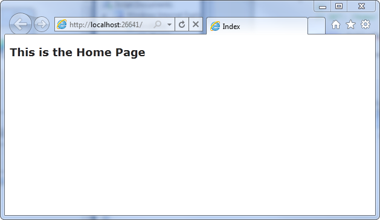

## Using a Layout for common site elements

Most websites have content which is shared between many pages: navigation, footers, logo images, stylesheet references, etc. The Razor view engine makes this easy to manage using a page called \_Layout.cshtml which has automatically been created for us inside the /Views/Shared folder.

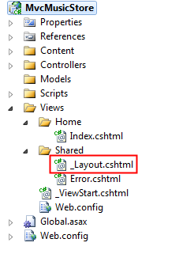

Double-click on this folder to view the contents, which are shown below.

[!code-cshtml[Main](mvc-music-store-part-3/samples/sample5.cshtml)]

The content from our individual views will be displayed by the @RenderBody() command, and any common content that we want to appear outside of that can be added to the \_Layout.cshtml markup. We'll want our MVC Music Store to have a common header with links to our Home page and Store area on all pages in the site, so we'll add that to the template directly above that @RenderBody() statement.

[!code-cshtml[Main](mvc-music-store-part-3/samples/sample6.cshtml)]

## Updating the StyleSheet

The empty project template includes a very streamlined CSS file which just includes styles used to display validation messages. Our designer has provided some additional CSS and images to define the look and feel for our site, so we'll add those in now.

The updated CSS file and Images are included in the Content directory of MvcMusicStore-Assets.zip which is available at http://mvcmusicstore.codeplex.com. We'll select both of them in Windows Explorer and drop them into our Solution's Content folder in Visual Web Developer, as shown below:

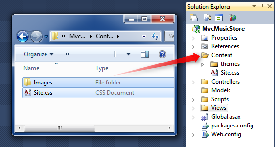

You'll be asked to confirm if you want to overwrite the existing Site.css file. Click Yes.

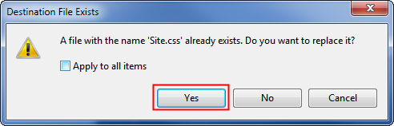

The Content folder of your application will now appear as follows:

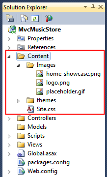

Now let's run the application and see how our changes look on the Home page.

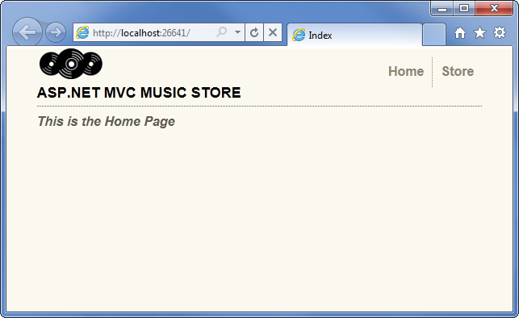

- Let's review what's changed: The HomeController's Index action method found and displayed the \Views\Home\Index.cshtmlView template, even though our code called "return View()", because our View template followed the standard naming convention.
- The Home Page is displaying a simple welcome message that is defined within the \Views\Home\Index.cshtml view template.
- The Home Page is using our \_Layout.cshtml template, and so the welcome message is contained within the standard site HTML layout.

## Using a Model to pass information to our View

A View template that just displays hardcoded HTML isn't going to make a very interesting web site. To create a dynamic web site, we'll instead want to pass information from our controller actions to our view templates.

In the Model-View-Controller pattern, the term Model refers to objects which represent the data in the application. Often, model objects correspond to tables in your database, but they don't have to.

Controller action methods which return an ActionResult can pass a model object to the view. This allows a Controller to cleanly package up all the information needed to generate a response, and then pass this information off to a View template to use to generate the appropriate HTML response. This is easiest to understand by seeing it in action, so let's get started.

First we'll create some Model classes to represent Genres and Albums within our store. Let's start by creating a Genre class. Right-click the "Models" folder within your project, choose the "Add Class" option, and name the file "Genre.cs".

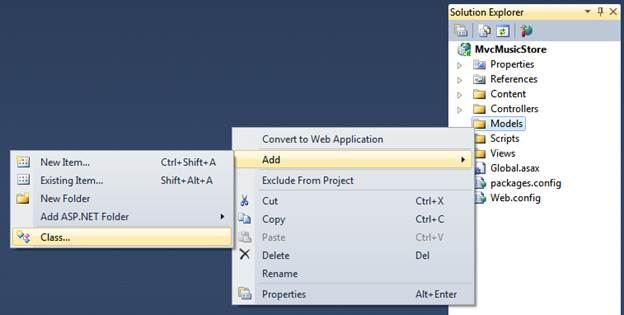

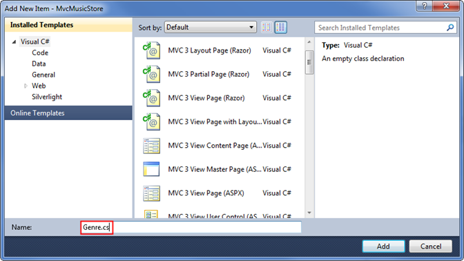

Then add a public string Name property to the class that was created:

[!code-csharp[Main](mvc-music-store-part-3/samples/sample7.cs)]

*Note: In case you're wondering, the { get; set; } notation is making use of C#'s auto-implemented properties feature. This gives us the benefits of a property without requiring us to declare a backing field.*

Next, follow the same steps to create an Album class (named Album.cs) that has a Title and a Genre property:

[!code-csharp[Main](mvc-music-store-part-3/samples/sample8.cs)]

Now we can modify the StoreController to use Views which display dynamic information from our Model. If - for demonstration purposes right now - we named our Albums based on the request ID, we could display that information as in the view below.

We'll start by changing the Store Details action so it shows the information for a single album. Add a "using" statement to the top of the **StoreControllers** class to include the MvcMusicStore.Models namespace, so we don't need to type MvcMusicStore.Models.Album every time we want to use the album class. The "usings" section of that class should now appear as below.

[!code-csharp[Main](mvc-music-store-part-3/samples/sample9.cs)]

Next, we'll update the Details controller action so that it returns an ActionResult rather than a string, as we did with the HomeController's Index method.

[!code-csharp[Main](mvc-music-store-part-3/samples/sample10.cs)]

Now we can modify the logic to return an Album object to the view. Later in this tutorial we will be retrieving the data from a database – but for right now we will use "dummy data" to get started.

[!code-csharp[Main](mvc-music-store-part-3/samples/sample11.cs)]

*Note: If you're unfamiliar with C#, you may assume that using var means that our album variable is late-bound. That's not correct – the C# compiler is using type-inference based on what we're assigning to the variable to determine that album is of type Album and compiling the local album variable as an Album type, so we get compile-time checking and Visual Studio code-editor support.*

Let's now create a View template that uses our Album to generate an HTML response. Before we do that we need to build the project so that the Add View dialog knows about our newly created Album class. You can build the project by selecting the Debug⇨Build MvcMusicStore menu item (for extra credit, you can use the Ctrl-Shift-B shortcut to build the project).

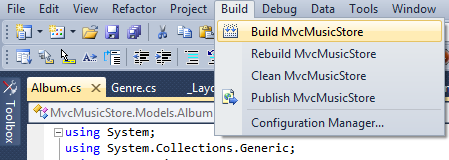

Now that we've set up our supporting classes, we're ready to build our View template. Right-click within the Details method and select "Add View…" from the context menu.

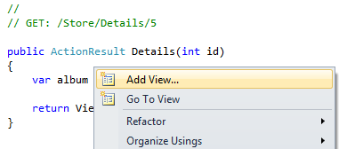

We are going to create a new View template like we did before with the HomeController. Because we are creating it from the StoreController it will by default be generated in a \Views\Store\Index.cshtml file.

Unlike before, we are going to check the "Create a strongly-typed" view checkbox. We are then going to select our "Album" class within the "View data-class" drop-downlist. This will cause the "Add View" dialog to create a View template that expects that an Album object will be passed to it to use.

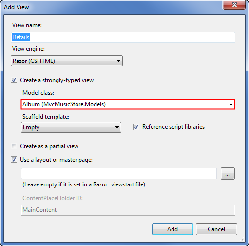

When we click the "Add" button our \Views\Store\Details.cshtml View template will be created, containing the following code.

[!code-cshtml[Main](mvc-music-store-part-3/samples/sample12.cshtml)]

Notice the first line, which indicates that this view is strongly-typed to our Album class. The Razor view engine understands that it has been passed an Album object, so we can easily access model properties and even have the benefit of IntelliSense in the Visual Web Developer editor.

Update the &lt;h2&gt; tag so it displays the Album's Title property by modifying that line to appear as follows.

[!code-cshtml[Main](mvc-music-store-part-3/samples/sample13.cshtml)]

Notice that IntelliSense is triggered when you enter the period after the @Model keyword, showing the properties and methods that the Album class supports.

Let's now re-run our project and visit the /Store/Details/5 URL. We'll see details of an Album like below.

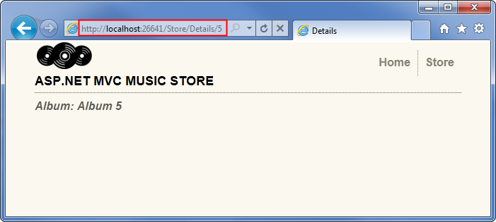

Now we'll make a similar update for the Store Browse action method. Update the method so it returns an ActionResult, and modify the method logic so it creates a new Genre object and returns it to the View.

[!code-csharp[Main](mvc-music-store-part-3/samples/sample14.cs)]

Right-click in the Browse method and select "Add View…" from the context menu, then add a View that is strongly-typed add a strongly typed to the Genre class.

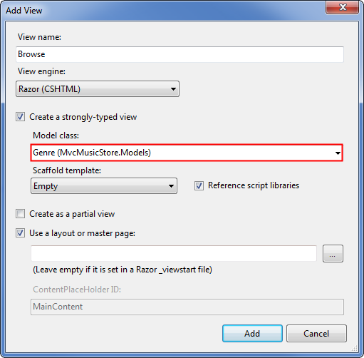

Update the &lt;h2&gt; element in the view code (in /Views/Store/Browse.cshtml) to display the Genre information.

[!code-cshtml[Main](mvc-music-store-part-3/samples/sample15.cshtml)]

Now let's re-run our project and browse to the /Store/Browse?Genre=Disco URL. We'll see the Browse page displayed like below.

Finally, let's make a slightly more complex update to the **Store Index** action method and view to display a list of all the Genres in our store. We'll do that by using a List of Genres as our model object, rather than just a single Genre.

[!code-csharp[Main](mvc-music-store-part-3/samples/sample16.cs)]

Right-click in the Store Index action method and select Add View as before, select Genre as the Model class, and press the Add button.

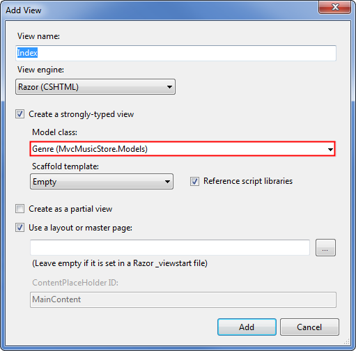

First we'll change the @model declaration to indicate that the view will be expecting several Genre objects rather than just one. Change the first line of /Store/Index.cshtml to read as follows:

[!code-cshtml[Main](mvc-music-store-part-3/samples/sample17.cshtml)]

This tells the Razor view engine that it will be working with a model object that can hold several Genre objects. We're using an IEnumerable&lt;Genre&gt; rather than a List&lt;Genre&gt; since it's more generic, allowing us to change our model type later to any object type that supports the IEnumerable interface.

Next, we'll loop through the Genre objects in the model as shown in the completed view code below.

[!code-cshtml[Main](mvc-music-store-part-3/samples/sample18.cshtml)]

Notice that we have full IntelliSense support as we enter this code, so that when we type "@Model." we see all methods and properties supported by an IEnumerable of type Genre.

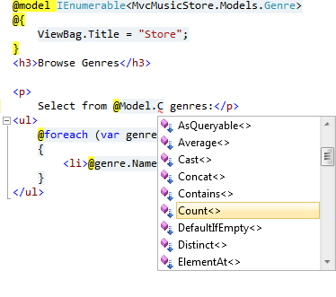

Within our "foreach" loop, Visual Web Developer knows that each item is of type Genre, so we see IntelliSence for each the Genre type.

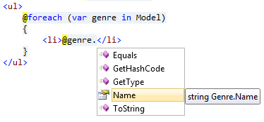

Next, the scaffolding feature examined the Genre object and determined that each will have a Name property, so it loops through and writes them out. It also generates Edit, Details, and Delete links to each individual item. We'll take advantage of that later in our store manager, but for now we'd like to have a simple list instead.

When we run the application and browse to /Store, we see that both the count and list of Genres is displayed.

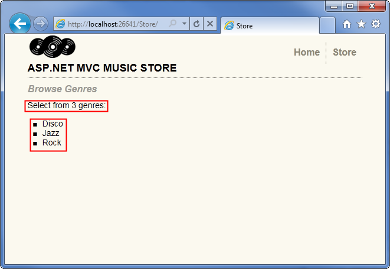

## Adding Links between pages

Our /Store URL that lists Genres currently lists the Genre names simply as plain text. Let's change this so that instead of plain text we instead have the Genre names link to the appropriate /Store/Browse URL, so that clicking on a music genre like "Disco" will navigate to the /Store/Browse?genre=Disco URL. We could update our \Views\Store\Index.cshtml View template to output these links using code like below **(don't type this in - we're going to improve on it)**:

[!code-html[Main](mvc-music-store-part-3/samples/sample19.html)]

That works, but it could lead to trouble later since it relies on a hardcoded string. For instance, if we wanted to rename the Controller, we'd need to search through our code looking for links that need to be updated.

An alternative approach we can use is to take advantage of an HTML Helper method. ASP.NET MVC includes HTML Helper methods which are available from our View template code to perform a variety of common tasks just like this. The Html.ActionLink() helper method is a particularly useful one, and makes it easy to build HTML &lt;a&gt; links and takes care of annoying details like making sure URL paths are properly URL encoded.

Html.ActionLink() has several different overloads to allow specifying as much information as you need for your links. In the simplest case, you'll supply just the link text and the Action method to go to when the hyperlink is clicked on the client. For example, we can link to "/Store/" Index() method on the Store Details page with the link text "Go to the Store Index" using the following call:

[!code-cshtml[Main](mvc-music-store-part-3/samples/sample20.cshtml)]

*Note: In this case, we didn't need to specify the controller name because we're just linking to another action within the same controller that's rendering the current view.*

Our links to the Browse page will need to pass a parameter, though, so we'll use another overload of the Html.ActionLink method that takes three parameters:

- 1. Link text, which will display the Genre name
- 2. Controller action name (Browse)
- 3. Route parameter values, specifying both the name (Genre) and the value (Genre name)

Putting that all together, here's how we'll write those links to the Store Index view:

[!code-cshtml[Main](mvc-music-store-part-3/samples/sample21.cshtml)]

Now when we run our project again and access the /Store/ URL we will see a list of genres. Each genre is a hyperlink – when clicked it will take us to our /Store/Browse?genre=*[genre]* URL.

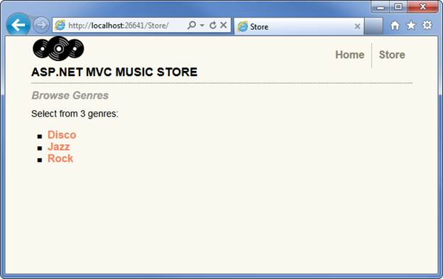

The HTML for the genre list looks like this:

[!code-html[Main](mvc-music-store-part-3/samples/sample22.html)]

*Please use the Discussions at [http://mvcmusicstore.codeplex.com](http://mvcmusicstore.codeplex.com) for any questions or comments.*

>[!div class="step-by-step"]
[Previous](mvc-music-store-part-2.md)
[Next](mvc-music-store-part-4.md)