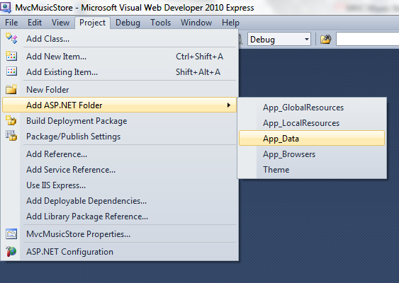
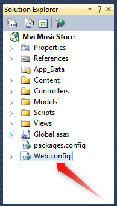
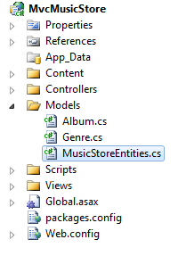
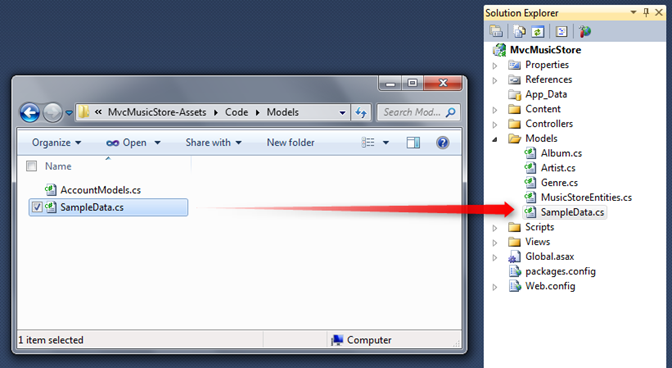
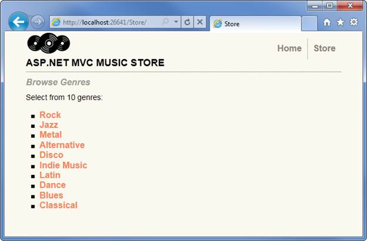
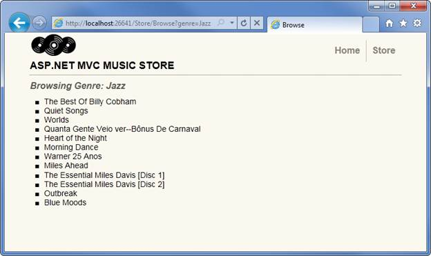
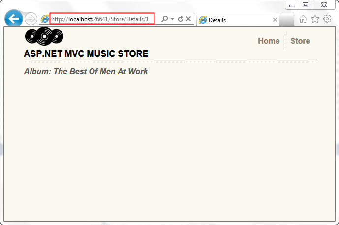

Part 4: Models and Data Access
====================
by [Jon Galloway](https://github.com/jongalloway)

> The MVC Music Store is a tutorial application that introduces and explains step-by-step how to use ASP.NET MVC and Visual Studio for web development.  
>   
> The MVC Music Store is a lightweight sample store implementation which sells music albums online, and implements basic site administration, user sign-in, and shopping cart functionality.
> 
> This tutorial series details all of the steps taken to build the ASP.NET MVC Music Store sample application. Part 4 covers Models and Data Access.

So far, we've just been passing "dummy data" from our Controllers to our View templates. Now we're ready to hook up a real database. In this tutorial we'll be covering how to use SQL Server Compact Edition (often called SQL CE) as our database engine. SQL CE is a free, embedded, file based database that doesn't require any installation or configuration, which makes it really convenient for local development.

## Database access with Entity Framework Code-First

We'll use the Entity Framework (EF) support that is included in ASP.NET MVC 3 projects to query and update the database. EF is a flexible object relational mapping (ORM) data API that enables developers to query and update data stored in a database in an object-oriented way.

Entity Framework version 4 supports a development paradigm called code-first. Code-first allows you to create model object by writing simple classes (also known as POCO from "plain-old" CLR objects), and can even create the database on the fly from your classes.

### Changes to our Model Classes

We will be leveraging the database creation feature in Entity Framework in this tutorial. Before we do that, though, let's make a few minor changes to our model classes to add in some things we'll be using later on.

#### Adding the Artist Model Classes

Our Albums will be associated with Artists, so we'll add a simple model class to describe an Artist. Add a new class to the Models folder named Artist.cs using the code shown below.

[!code-csharp[Main](mvc-music-store-part-4/samples/sample1.cs)]

#### Updating our Model Classes

Update the Album class as shown below.

[!code-csharp[Main](mvc-music-store-part-4/samples/sample2.cs)]

Next, make the following updates to the Genre class.

[!code-csharp[Main](mvc-music-store-part-4/samples/sample3.cs)]

### Adding the App\_Data folder

We'll add an App\_Data directory to our project to hold our SQL Server Express database files. App\_Data is a special directory in ASP.NET which already has the correct security access permissions for database access. From the Project menu, select Add ASP.NET Folder, then App\_Data.

### Creating a Connection String in the web.config file

We will add a few lines to the website's configuration file so that Entity Framework knows how to connect to our database. Double-click on the Web.config file located in the root of the project.

Scroll to the bottom of this file and add a &lt;connectionStrings&gt; section directly above the last line, as shown below.

[!code-xml[Main](mvc-music-store-part-4/samples/sample4.xml)]

### Adding a Context Class

Right-click the Models folder and add a new class named MusicStoreEntities.cs.

This class will represent the Entity Framework database context, and will handle our create, read, update, and delete operations for us. The code for this class is shown below.

[!code-csharp[Main](mvc-music-store-part-4/samples/sample5.cs)]

That's it - there's no other configuration, special interfaces, etc. By extending the DbContext base class, our MusicStoreEntities class is able to handle our database operations for us. Now that we've got that hooked up, let's add a few more properties to our model classes to take advantage of some of the additional information in our database.

### Adding our store catalog data

We will take advantage of a feature in Entity Framework which adds "seed" data to a newly created database. This will pre-populate our store catalog with a list of Genres, Artists, and Albums. The MvcMusicStore-Assets.zip download - which included our site design files used earlier in this tutorial - has a class file with this seed data, located in a folder named Code.

Within the Code / Models folder, locate the SampleData.cs file and drop it into the Models folder in our project, as shown below.

Now we need to add one line of code to tell Entity Framework about that SampleData class. Double-click on the Global.asax file in the root of the project to open it and add the following line to the top the Application\_Start method.

[!code-csharp[Main](mvc-music-store-part-4/samples/sample6.cs)]

At this point, we've completed the work necessary to configure Entity Framework for our project.

## Querying the Database

Now let's update our StoreController so that instead of using "dummy data" it instead calls into our database to query all of its information. We'll start by declaring a field on the **StoreController** to hold an instance of the MusicStoreEntities class, named storeDB:

[!code-csharp[Main](mvc-music-store-part-4/samples/sample7.cs)]

### Updating the Store Index to query the database

The MusicStoreEntities class is maintained by the Entity Framework and exposes a collection property for each table in our database. Let's update our StoreController's Index action to retrieve all Genres in our database. Previously we did this by hard-coding string data. Now we can instead just use the Entity Framework context Generes collection:

[!code-csharp[Main](mvc-music-store-part-4/samples/sample8.cs)]

No changes need to happen to our View template since we're still returning the same StoreIndexViewModel we returned before - we're just returning live data from our database now.

When we run the project again and visit the "/Store" URL, we'll now see a list of all Genres in our database:

### Updating Store Browse and Details to use live data

With the /Store/Browse?genre=*[some-genre]* action method, we're searching for a Genre by name. We only expect one result, since we shouldn't ever have two entries for the same Genre name, and so we can use the .Single() extension in LINQ to query for the appropriate Genre object like this (don't type this yet):

[!code-csharp[Main](mvc-music-store-part-4/samples/sample9.cs)]

The Single method takes a Lambda expression as a parameter, which specifies that we want a single Genre object such that its name matches the value we've defined. In the case above, we are loading a single Genre object with a Name value matching Disco.

We'll take advantage of an Entity Framework feature that allows us to indicate other related entities we want loaded as well when the Genre object is retrieved. This feature is called Query Result Shaping, and enables us to reduce the number of times we need to access the database to retrieve all of the information we need. We want to pre-fetch the Albums for Genre we retrieve, so we'll update our query to include from Genres.Include("Albums") to indicate that we want related albums as well. This is more efficient, since it will retrieve both our Genre and Album data in a single database request.

With the explanations out of the way, here's how our updated Browse controller action looks:

[!code-csharp[Main](mvc-music-store-part-4/samples/sample10.cs)]

We can now update the Store Browse View to display the albums which are available in each Genre. Open the view template (found in /Views/Store/Browse.cshtml) and add a bulleted list of Albums as shown below.

[!code-cshtml[Main](mvc-music-store-part-4/samples/sample11.cshtml)]

Running our application and browsing to /Store/Browse?genre=Jazz shows that our results are now being pulled from the database, displaying all albums in our selected Genre.

We'll make the same change to our /Store/Details/[id] URL, and replace our dummy data with a database query which loads an Album whose ID matches the parameter value.

[!code-csharp[Main](mvc-music-store-part-4/samples/sample12.cs)]

Running our application and browsing to /Store/Details/1 shows that our results are now being pulled from the database.

Now that our Store Details page is set up to display an album by the Album ID, let's update the **Browse** view to link to the Details view. We will use Html.ActionLink, exactly as we did to link from Store Index to Store Browse at the end of the previous section. The complete source for the Browse view appears below.

[!code-cshtml[Main](mvc-music-store-part-4/samples/sample13.cshtml)]

We're now able to browse from our Store page to a Genre page, which lists the available albums, and by clicking on an album we can view details for that album.

*Please use the Discussions at [http://mvcmusicstore.codeplex.com](http://mvcmusicstore.codeplex.com) for any questions or comments.*

>[!div class="step-by-step"]
[Previous](mvc-music-store-part-3.md)
[Next](mvc-music-store-part-5.md)