Part 5: Edit Forms and Templating
====================
by [Jon Galloway](https://github.com/jongalloway)

> The MVC Music Store is a tutorial application that introduces and explains step-by-step how to use ASP.NET MVC and Visual Studio for web development.  
>   
> The MVC Music Store is a lightweight sample store implementation which sells music albums online, and implements basic site administration, user sign-in, and shopping cart functionality.
> 
> This tutorial series details all of the steps taken to build the ASP.NET MVC Music Store sample application. Part 5 covers Edit Forms and Templating.

In the past chapter, we were loading data from our database and displaying it. In this chapter, we'll also enable editing the data.

## Creating the StoreManagerController

We'll begin by creating a new controller called **StoreManagerController**. For this controller, we will be taking advantage of the Scaffolding features available in the ASP.NET MVC 3 Tools Update. Set the options for the Add Controller dialog as shown below.

When you click the Add button, you'll see that the ASP.NET MVC 3 scaffolding mechanism does a good amount of work for you:

- It creates the new StoreManagerController with a local Entity Framework variable
- It adds a StoreManager folder to the project's Views folder
- It adds Create.cshtml, Delete.cshtml, Details.cshtml, Edit.cshtml, and Index.cshtml view, strongly typed to the Album class

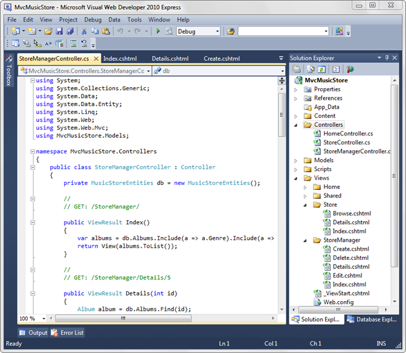

The new StoreManager controller class includes CRUD (create, read, update, delete) controller actions which know how to work with the Album model class and use our Entity Framework context for database access.

## Modifying a Scaffolded View

It's important to remember that, while this code was generated for us, it's standard ASP.NET MVC code, just like we've been writing throughout this tutorial. It's intended to save you the time you'd spend on writing boilerplate controller code and creating the strongly typed views manually, but this isn't the kind of generated code you may have seen prefaced with dire warnings in comments about how you mustn't change the code. This is your code, and you're expected to change it.

So, let's start with a quick edit to the StoreManager Index view (/Views/StoreManager/Index.cshtml). This view will display a table which lists the Albums in our store with Edit / Details / Delete links, and includes the Album's public properties. We'll remove the AlbumArtUrl field, as it's not very useful in this display. In &lt;table&gt; section of the view code, remove the &lt;th&gt; and &lt;td&gt; elements surrounding AlbumArtUrl references, as indicated by the highlighted lines below:

[!code-cshtml[Main](mvc-music-store-part-5/samples/sample1.cshtml)]

The modified view code will appear as follows:

[!code-cshtml[Main](mvc-music-store-part-5/samples/sample2.cshtml)]

## A first look at the Store Manager

Now run the application and browse to /StoreManager/. This displays the Store Manager Index we just modified, showing a list of the albums in the store with links to Edit, Details, and Delete.

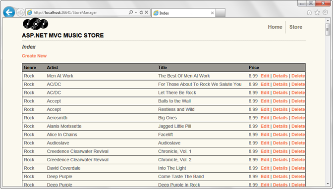

Clicking the Edit link displays an edit form with fields for the Album, including dropdowns for Genre and Artist.

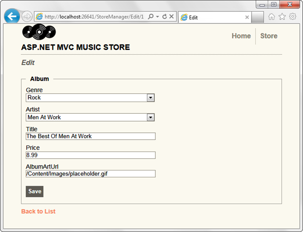

Click the "Back to List" link at the bottom, then click on the Details link for an Album. This displays the detail information for an individual Album.

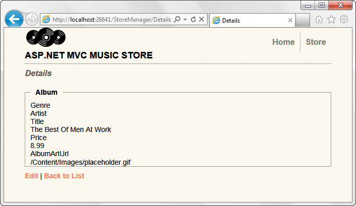

Again, click the Back to List link, then click on a Delete link. This displays a confirmation dialog, showing the album details and asking if we're sure we want to delete it.

Clicking the Delete button at the bottom will delete the album and return you to the Index page, which shows the album deleted.

We're not done with the Store Manager, but we have working controller and view code for the CRUD operations to start from.

## Looking at the Store Manager Controller code

The Store Manager Controller contains a good amount of code. Let's go through this from top to bottom. The controller includes some standard namespaces for an MVC controller, as well as a reference to our Models namespace. The controller has a private instance of MusicStoreEntities, used by each of the controller actions for data access.

[!code-csharp[Main](mvc-music-store-part-5/samples/sample3.cs)]

### Store Manager Index and Details actions

The index view retrieves a list of Albums, including each album's referenced Genre and Artist information, as we previously saw when working on the Store Browse method. The Index view is following the references to the linked objects so that it can display each album's Genre name and Artist name, so the controller is being efficient and querying for this information in the original request.

[!code-csharp[Main](mvc-music-store-part-5/samples/sample4.cs)]

The StoreManager Controller's Details controller action works exactly the same as the Store Controller Details action we wrote previously - it queries for the Album by ID using the Find() method, then returns it to the view.

[!code-csharp[Main](mvc-music-store-part-5/samples/sample5.cs)]

### The Create Action Methods

The Create action methods are a little different from ones we've seen so far, because they handle form input. When a user first visits /StoreManager/Create/ they will be shown an empty form. This HTML page will contain a &lt;form&gt; element that contains dropdown and textbox input elements where they can enter the album's details.

After the user fills in the Album form values, they can press the "Save" button to submit these changes back to our application to save within the database. When the user presses the "save" button the &lt;form&gt; will perform an HTTP-POST back to the /StoreManager/Create/ URL and submit the &lt;form&gt; values as part of the HTTP-POST.

ASP.NET MVC allows us to easily split up the logic of these two URL invocation scenarios by enabling us to implement two separate "Create" action methods within our StoreManagerController class – one to handle the initial HTTP-GET browse to the /StoreManager/Create/ URL, and the other to handle the HTTP-POST of the submitted changes.

### Passing information to a View using ViewBag

We've used the ViewBag earlier in this tutorial, but haven't talked much about it. The ViewBag allows us to pass information to the view without using a strongly typed model object. In this case, our Edit HTTP-GET controller action needs to pass both a list of Genres and Artists to the form to populate the dropdowns, and the simplest way to do that is to return them as ViewBag items.

The ViewBag is a dynamic object, meaning that you can type ViewBag.Foo or ViewBag.YourNameHere without writing code to define those properties. In this case, the controller code uses ViewBag.GenreId and ViewBag.ArtistId so that the dropdown values submitted with the form will be GenreId and ArtistId, which are the Album properties they will be setting.

These dropdown values are returned to the form using the SelectList object, which is built just for that purpose. This is done using code like this:

[!code-csharp[Main](mvc-music-store-part-5/samples/sample6.cs)]

As you can see from the action method code, three parameters are being used to create this object:

- The list of items the dropdown will be displaying. Note that this isn't just a string - we're passing a list of Genres.
- The next parameter being passed to the SelectList is the Selected Value. This how the SelectList knows how to pre-select an item in the list. This will be easier to understand when we look at the Edit form, which is pretty similar.
- The final parameter is the property to be displayed. In this case, this is indicating that the Genre.Name property is what will be shown to the user.

With that in mind, then, the HTTP-GET Create action is pretty simple - two SelectLists are added to the ViewBag, and no model object is passed to the form (since it hasn't been created yet).

[!code-csharp[Main](mvc-music-store-part-5/samples/sample7.cs)]

### HTML Helpers to display the Drop Downs in the Create View

Since we've talked about how the drop down values are passed to the view, let's take a quick look at the view to see how those values are displayed. In the view code (/Views/StoreManager/Create.cshtml), you'll see the following call is made to display the Genre drop down.

[!code-cshtml[Main](mvc-music-store-part-5/samples/sample8.cshtml)]

This is known as an HTML Helper - a utility method which performs a common view task. HTML Helpers are very useful in keeping our view code concise and readable. The Html.DropDownList helper is provided by ASP.NET MVC, but as we'll see later it's possible to create our own helpers for view code we'll reuse in our application.

The Html.DropDownList call just needs to be told two things - where to get the list to display, and what value (if any) should be pre-selected. The first parameter, GenreId, tells the DropDownList to look for a value named GenreId in either the model or ViewBag. The second parameter is used to indicate the value to show as initially selected in the drop down list. Since this form is a Create form, there's no value to be preselected and String.Empty is passed.

### Handling the Posted Form values

As we discussed before, there are two action methods associated with each form. The first handles the HTTP-GET request and displays the form. The second handles the HTTP-POST request, which contains the submitted form values. Notice that controller action has an [HttpPost] attribute, which tells ASP.NET MVC that it should only respond to HTTP-POST requests.

[!code-csharp[Main](mvc-music-store-part-5/samples/sample9.cs)]

This action has four responsibilities:

- 1. Read the form values
- 2. Check if the form values pass any validation rules
- 3. If the form submission is valid, save the data and display the updated list
- 4. If the form submission is not valid, redisplay the form with validation errors

#### Reading Form Values with Model Binding

The controller action is processing a form submission that includes values for GenreId and ArtistId (from the drop down list) and textbox values for Title, Price, and AlbumArtUrl. While it's possible to directly access form values, a better approach is to use the Model Binding capabilities built into ASP.NET MVC. When a controller action takes a model type as a parameter, ASP.NET MVC will attempt to populate an object of that type using form inputs (as well as route and querystring values). It does this by looking for values whose names match properties of the model object, e.g. when setting the new Album object's GenreId value, it looks for an input with the name GenreId. When you create views using the standard methods in ASP.NET MVC, the forms will always be rendered using property names as input field names, so this the field names will just match up.

#### Validating the Model

The model is validated with a simple call to ModelState.IsValid. We haven't added any validation rules to our Album class yet - we'll do that in a bit - so right now this check doesn't have much to do. What's important is that this ModelStat.IsValid check will adapt to the validation rules we put on our model, so future changes to validation rules won't require any updates to the controller action code.

#### Saving the submitted values

If the form submission passes validation, it's time to save the values to the database. With Entity Framework, that just requires adding the model to the Albums collection and calling SaveChanges.

[!code-csharp[Main](mvc-music-store-part-5/samples/sample10.cs)]

Entity Framework generates the appropriate SQL commands to persist the value. After saving the data, we redirect back to the list of Albums so we can see our update. This is done by returning RedirectToAction with the name of the controller action we want displayed. In this case, that's the Index method.

#### Displaying invalid form submissions with Validation Errors

In the case of invalid form input, the dropdown values are added to the ViewBag (as in the HTTP-GET case) and the bound model values are passed back to the view for display. Validation errors are automatically displayed using the @Html.ValidationMessageFor HTML Helper.

#### Testing the Create Form

To test this out, run the application and browse to /StoreManager/Create/ - this will show you the blank form which was returned by the StoreController Create HTTP-GET method.

Fill in some values and click the Create button to submit the form.

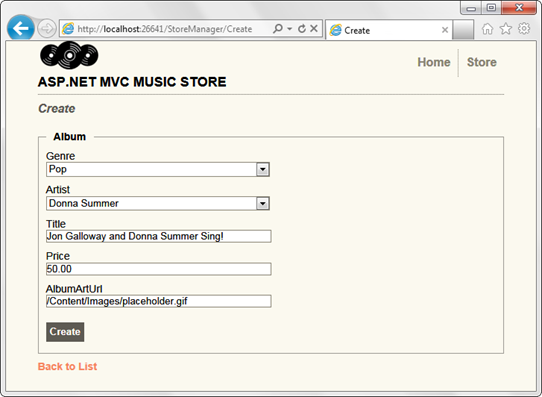

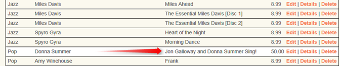

### Handling Edits

The Edit action pair (HTTP-GET and HTTP-POST) are very similar to the Create action methods we just looked at. Since the edit scenario involves working with an existing album, the Edit HTTP-GET method loads the Album based on the "id" parameter, passed in via the route. This code for retrieving an album by AlbumId is the same as we've previously looked at in the Details controller action. As with the Create / HTTP-GET method, the drop down values are returned via the ViewBag. This allows us to return an Album as our model object to the view (which is strongly typed to the Album class) while passing additional data (e.g. a list of Genres) via the ViewBag.

[!code-csharp[Main](mvc-music-store-part-5/samples/sample11.cs)]

The Edit HTTP-POST action is very similar to the Create HTTP-POST action. The only difference is that instead of adding a new album to the db.Albums collection, we're finding the current instance of the Album using db.Entry(album) and setting its state to Modified. This tells Entity Framework that we are modifying an existing album as opposed to creating a new one.

[!code-csharp[Main](mvc-music-store-part-5/samples/sample12.cs)]

We can test this out by running the application and browsing to /StoreManger/, then clicking the Edit link for an album.

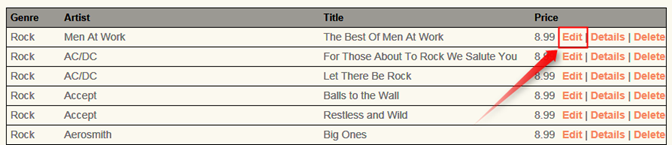

This displays the Edit form shown by the Edit HTTP-GET method. Fill in some values and click the Save button.

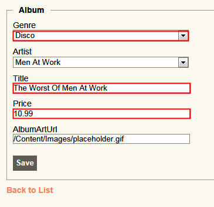

This posts the form, saves the values, and returns us to the Album list, showing that the values were updated.

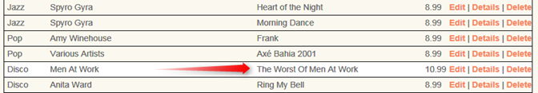

### Handling Deletion

Deletion follows the same pattern as Edit and Create, using one controller action to display the confirmation form, and another controller action to handle the form submission.

The HTTP-GET Delete controller action is exactly the same as our previous Store Manager Details controller action.

[!code-csharp[Main](mvc-music-store-part-5/samples/sample13.cs)]

We display a form that's strongly typed to an Album type, using the Delete view content template.

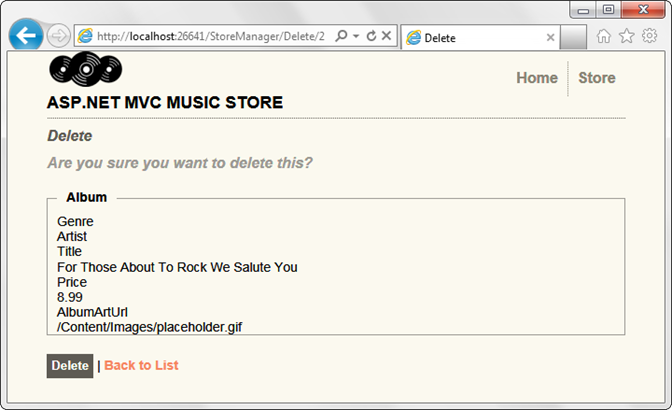

The Delete template shows all the fields for the model, but we can simplify that down quite a bit. Change the view code in /Views/StoreManager/Delete.cshtml to the following.

[!code-cshtml[Main](mvc-music-store-part-5/samples/sample14.cshtml)]

This displays a simplified Delete confirmation.

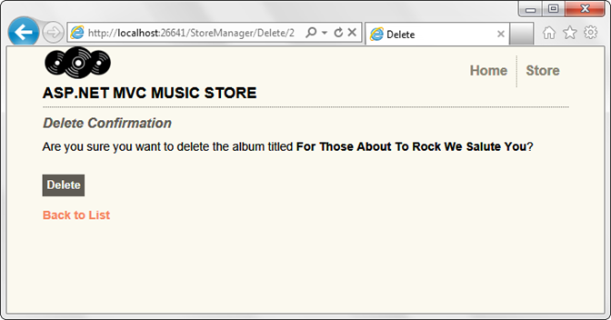

Clicking the Delete button causes the form to be posted back to the server, which executes the DeleteConfirmed action.

[!code-csharp[Main](mvc-music-store-part-5/samples/sample15.cs)]

Our HTTP-POST Delete Controller Action takes the following actions:

- 1. Loads the Album by ID
- 2. Deletes it the album and save changes
- 3. Redirects to the Index, showing that the Album was removed from the list

To test this, run the application and browse to /StoreManager. Select an album from the list and click the Delete link.

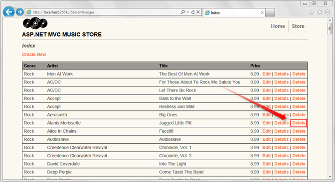

This displays our Delete confirmation screen.

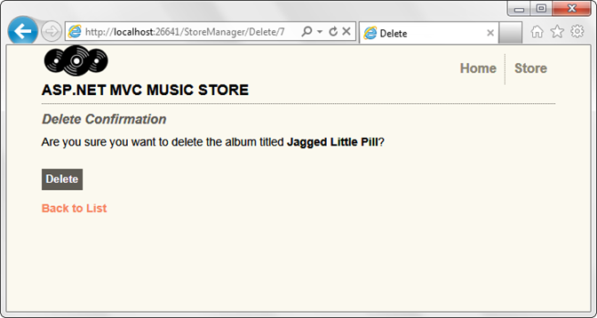

Clicking the Delete button removes the album and returns us to the Store Manager Index page, which shows that the album has been deleted.

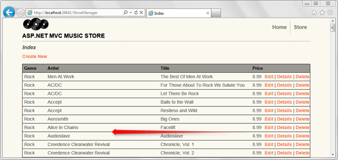

### Using a custom HTML Helper to truncate text

We've got one potential issue with our Store Manager Index page. Our Album Title and Artist Name properties can both be long enough that they could throw off our table formatting. We'll create a custom HTML Helper to allow us to easily truncate these and other properties in our Views.

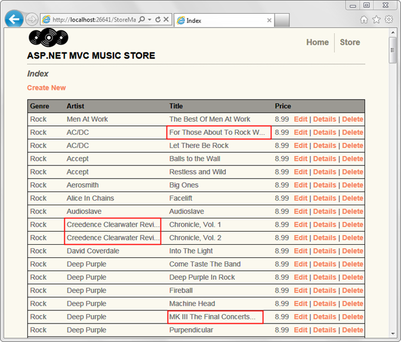

Razor's @helper syntax has made it pretty easy to create your own helper functions for use in your views. Open the /Views/StoreManager/Index.cshtml view and add the following code directly after the @model line.

[!code-cshtml[Main](mvc-music-store-part-5/samples/sample16.cshtml)]

This helper method takes a string and a maximum length to allow. If the text supplied is shorter than the length specified, the helper outputs it as-is. If it is longer, then it truncates the text and renders "…" for the remainder.

Now we can use our Truncate helper to ensure that both the Album Title and Artist Name properties are less than 25 characters. The complete view code using our new Truncate helper appears below.

[!code-cshtml[Main](mvc-music-store-part-5/samples/sample17.cshtml)]

Now when we browse the /StoreManager/ URL, the albums and titles are kept below our maximum lengths.

Note: This shows the simple case of creating and using a helper in one view. To learn more about creating helpers that you can use throughout your site, see my blog post: [http://bit.ly/mvc3-helper-options](http://bit.ly/mvc3-helper-options)

*Please use the Discussions at [http://mvcmusicstore.codeplex.com](http://mvcmusicstore.codeplex.com) for any questions or comments.*

>[!div class="step-by-step"]
[Previous](mvc-music-store-part-4.md)
[Next](mvc-music-store-part-6.md)