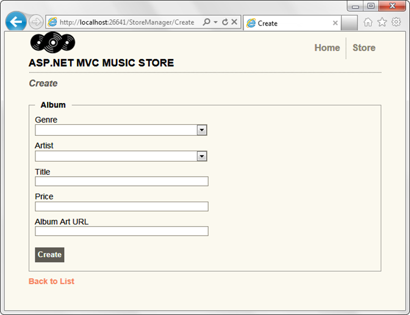
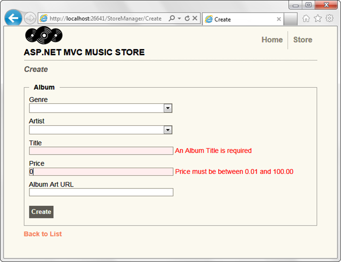
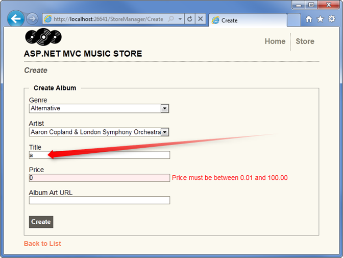

Part 6: Using Data Annotations for Model Validation
====================
by [Jon Galloway](https://github.com/jongalloway)

> The MVC Music Store is a tutorial application that introduces and explains step-by-step how to use ASP.NET MVC and Visual Studio for web development.  
>   
> The MVC Music Store is a lightweight sample store implementation which sells music albums online, and implements basic site administration, user sign-in, and shopping cart functionality.  
>   
> This tutorial series details all of the steps taken to build the ASP.NET MVC Music Store sample application. Part 6 covers Using Data Annotations for Model Validation.

We have a major issue with our Create and Edit forms: they're not doing any validation. We can do things like leave required fields blank or type letters in the Price field, and the first error we'll see is from the database.

We can easily add validation to our application by adding Data Annotations to our model classes. Data Annotations allow us to describe the rules we want applied to our model properties, and ASP.NET MVC will take care of enforcing them and displaying appropriate messages to our users.

## Adding Validation to our Album Forms

We'll use the following Data Annotation attributes:

- **Required** – Indicates that the property is a required field
- **DisplayName** – Defines the text we want used on form fields and validation messages
- **StringLength** – Defines a maximum length for a string field
- **Range** – Gives a maximum and minimum value for a numeric field
- **Bind** – Lists fields to exclude or include when binding parameter or form values to model properties
- **ScaffoldColumn** – Allows hiding fields from editor forms

*Note: For more information on Model Validation using Data Annotation attributes, see the MSDN documentation at*[`https://go.microsoft.com/fwlink/?LinkId=159063`](https://go.microsoft.com/fwlink/?LinkId=159063)

Open the Album class and add the following *using* statements to the top.

[!code-csharp[Main](mvc-music-store-part-6/samples/sample1.cs)]

Next, update the properties to add display and validation attributes as shown below.

[!code-csharp[Main](mvc-music-store-part-6/samples/sample2.cs)]

While we're there, we've also changed the Genre and Artist to virtual properties. This allows Entity Framework to lazy-load them as necessary.

[!code-csharp[Main](mvc-music-store-part-6/samples/sample3.cs)]

After having added these attributes to our Album model, our Create and Edit screen immediately begin validating fields and using the Display Names we've chosen (e.g. Album Art Url instead of AlbumArtUrl). Run the application and browse to /StoreManager/Create.

Next, we'll break some validation rules. Enter a price of 0 and leave the Title blank. When we click on the Create button, we will see the form displayed with validation error messages showing which fields did not meet the validation rules we have defined.

## Testing the Client-Side Validation

Server-side validation is very important from an application perspective, because users can circumvent client-side validation. However, webpage forms which only implement server-side validation exhibit three significant problems.

1. The user has to wait for the form to be posted, validated on the server, and for the response to be sent to their browser.
2. The user doesn't get immediate feedback when they correct a field so that it now passes the validation rules.
3. We are wasting server resources to perform validation logic instead of leveraging the user's browser.

Fortunately, the ASP.NET MVC 3 scaffold templates have client-side validation built in, requiring no additional work whatsoever.

Typing a single letter in the Title field satisfies the validation requirements, so the validation message is immediately removed.

*Please use the Discussions at [http://mvcmusicstore.codeplex.com](http://mvcmusicstore.codeplex.com) for any questions or comments.*

>[!div class="step-by-step"]
[Previous](mvc-music-store-part-5.md)
[Next](mvc-music-store-part-7.md)