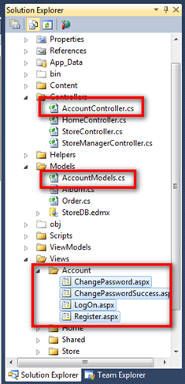
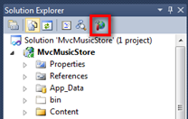
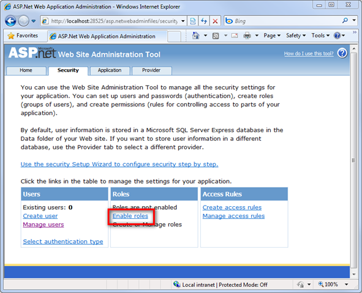
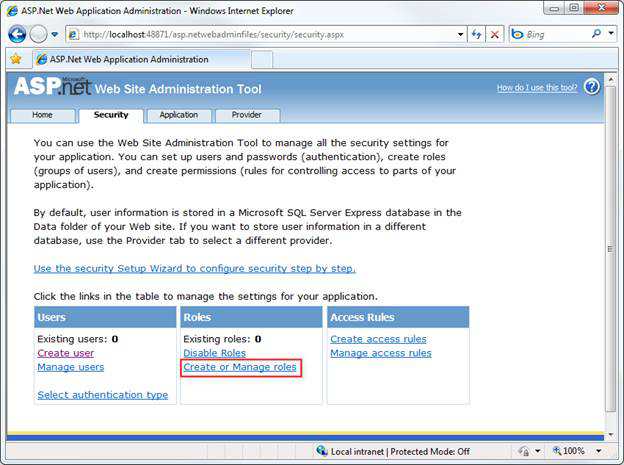
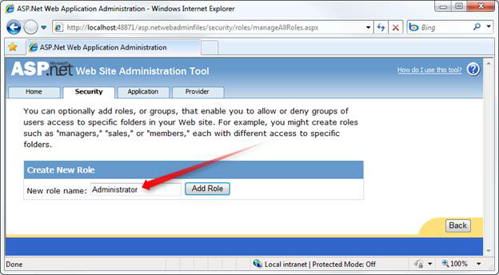
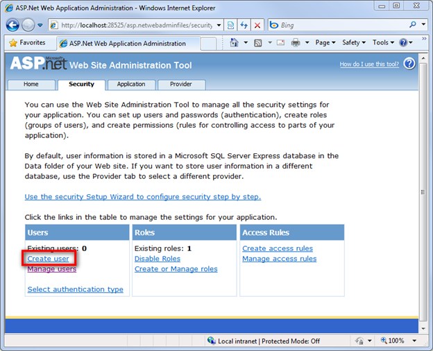
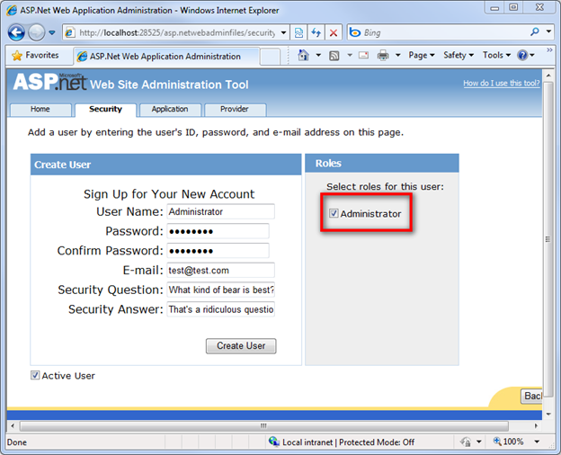
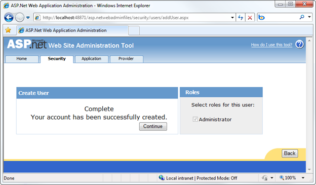
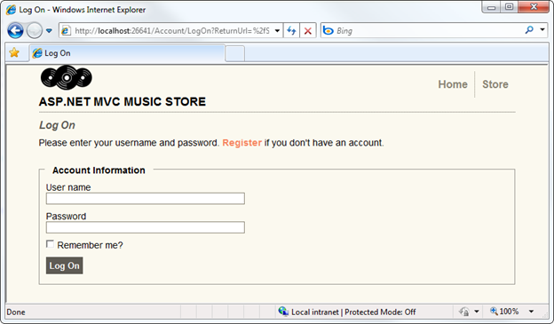

Part 7: Membership and Authorization
====================
by [Jon Galloway](https://github.com/jongalloway)

> The MVC Music Store is a tutorial application that introduces and explains step-by-step how to use ASP.NET MVC and Visual Studio for web development.  
>   
> The MVC Music Store is a lightweight sample store implementation which sells music albums online, and implements basic site administration, user sign-in, and shopping cart functionality.  
>   
> This tutorial series details all of the steps taken to build the ASP.NET MVC Music Store sample application. Part 7 covers Membership and Authorization.

Our Store Manager controller is currently accessible to anyone visiting our site. Let's change this to restrict permission to site administrators.

## Adding the AccountController and Views

One difference between the full ASP.NET MVC 3 Web Application template and the ASP.NET MVC 3 Empty Web Application template is that the empty template doesn't include an Account Controller. We'll add an Account Controller by copying a few files from a new ASP.NET MVC application created from the full ASP.NET MVC 3 Web Application template.

Create a new ASP.NET MVC application using the full ASP.NET MVC 3 Web Application template and copy the following files into the same directories in our project:

1. Copy AccountController.cs in the Controllers directory
2. Copy AccountModels in the Models directory
3. Create an Account directory inside the Views directory and copy all four views in

Change the namespace for the Controller and Model classes so they begin with MvcMusicStore. The AccountController class should use the MvcMusicStore.Controllers namespace, and the AccountModels class should use the MvcMusicStore.Models namespace.

*Note: These files are also available in the MvcMusicStore-Assets.zip download from which we copied our site design files at the beginning of the tutorial. The Membership files are located in the Code directory.*

The updated solution should look like the following:

## Adding an Administrative User with the ASP.NET Configuration site

Before we require Authorization in our website, we'll need to create a user with access. The easiest way to create a user is to use the built-in ASP.NET Configuration website.

Launch the ASP.NET Configuration website by clicking following the icon in the Solution Explorer.

This launches a configuration website. Click on the Security tab on the home screen, then click the "Enable roles" link in the center of the screen.

Click the "Create or Manage roles" link.

Enter "Administrator" as the role name and press the Add Role button.

Click the Back button, then click on the Create user link on the left side.

Fill in the user information fields on the left using the following information:

| **Field** | **Value** |
| --- | --- |
| **User Name** | Administrator |
| **Password** | password123! |
| **Confirm Password** | password123! |
| **E-mail** | (any e-mail address will work) |
| **Security Question** | (whatever you like) |
| **Security Answer** | (whatever you like) |

*Note: You can of course use any password you'd like. The above password is shown as an example, and is assumed in the support forums on CodePlex. The default password security settings require a password that is 7 characters long and contains one non-alphanumeric character.*

Select the Administrator role for this user, and click the Create User button.

At this point, you should see a message indicating that the user was created successfully.

You can now close the browser window.

## Role-based Authorization

Now we can restrict access to the StoreManagerController using the [Authorize] attribute, specifying that the user must be in the Administrator role to access any controller action in the class.

[!code-csharp[Main](mvc-music-store-part-7/samples/sample1.cs)]

*Note: The [Authorize] attribute can be placed on specific action methods as well as at the Controller class level.*

Now browsing to /StoreManager brings up a Log On dialog:

After logging on with our new Administrator account, we're able to go to the Album Edit screen as before.

>[!div class="step-by-step"]
[Previous](mvc-music-store-part-6.md)
[Next](mvc-music-store-part-8.md)