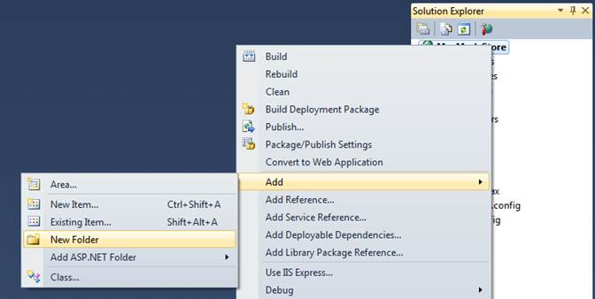
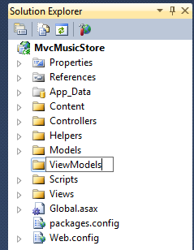
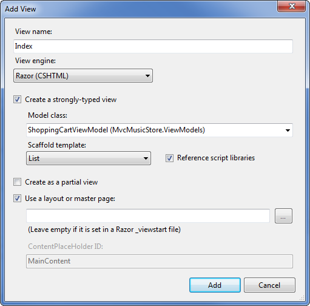
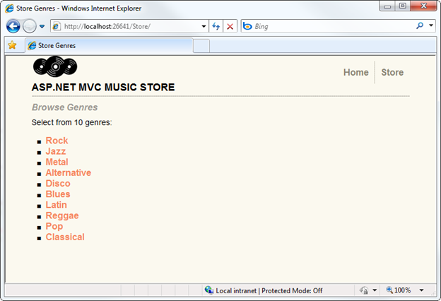
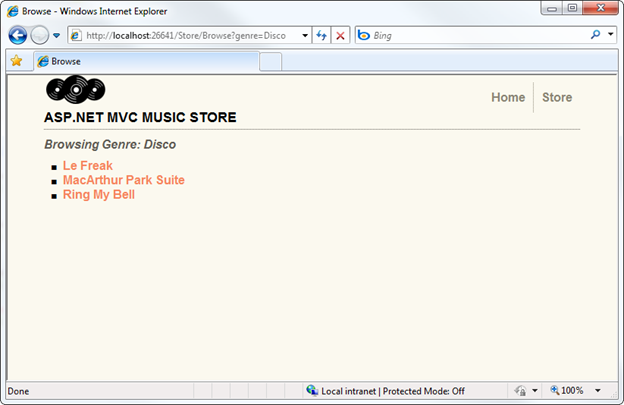
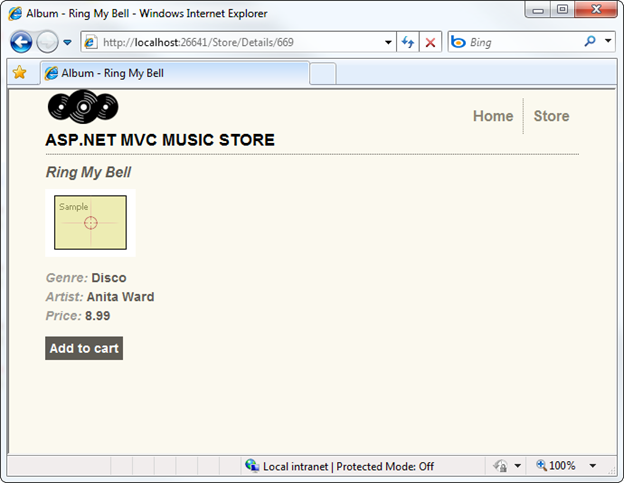
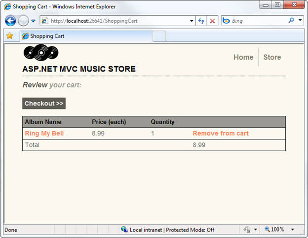
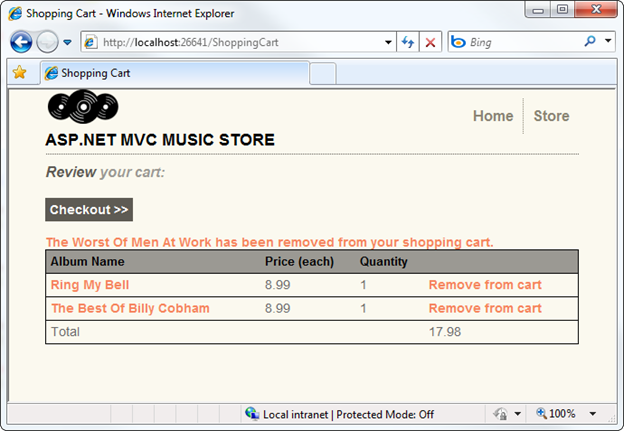

Part 8: Shopping Cart with Ajax Updates
====================
by [Jon Galloway](https://github.com/jongalloway)

> The MVC Music Store is a tutorial application that introduces and explains step-by-step how to use ASP.NET MVC and Visual Studio for web development.  
>   
> The MVC Music Store is a lightweight sample store implementation which sells music albums online, and implements basic site administration, user sign-in, and shopping cart functionality.  
>   
> This tutorial series details all of the steps taken to build the ASP.NET MVC Music Store sample application. Part 8 covers Shopping Cart with Ajax Updates.

We'll allow users to place albums in their cart without registering, but they'll need to register as guests to complete checkout. The shopping and checkout process will be separated into two controllers: a ShoppingCart Controller which allows anonymously adding items to a cart, and a Checkout Controller which handles the checkout process. We'll start with the Shopping Cart in this section, then build the Checkout process in the following section.

## Adding the Cart, Order, and OrderDetail model classes

Our Shopping Cart and Checkout processes will make use of some new classes. Right-click the Models folder and add a Cart class (Cart.cs) with the following code.

[!code-csharp[Main](mvc-music-store-part-8/samples/sample1.cs)]

This class is pretty similar to others we've used so far, with the exception of the [Key] attribute for the RecordId property. Our Cart items will have a string identifier named CartID to allow anonymous shopping, but the table includes an integer primary key named RecordId. By convention, Entity Framework Code-First expects that the primary key for a table named Cart will be either CartId or ID, but we can easily override that via annotations or code if we want. This is an example of how we can use the simple conventions in Entity Framework Code-First when they suit us, but we're not constrained by them when they don't.

Next, add an Order class (Order.cs) with the following code.

[!code-csharp[Main](mvc-music-store-part-8/samples/sample2.cs)]

This class tracks summary and delivery information for an order. **It won't compile yet**, because it has an OrderDetails navigation property which depends on a class we haven't created yet. Let's fix that now by adding a class named OrderDetail.cs, adding the following code.

[!code-csharp[Main](mvc-music-store-part-8/samples/sample3.cs)]

We'll make one last update to our MusicStoreEntities class to include DbSets which expose those new Model classes, also including a DbSet&lt;Artist&gt;. The updated MusicStoreEntities class appears as below.

[!code-csharp[Main](mvc-music-store-part-8/samples/sample4.cs)]

## Managing the Shopping Cart business logic

Next, we'll create the ShoppingCart class in the Models folder. The ShoppingCart model handles data access to the Cart table. Additionally, it will handle the business logic to for adding and removing items from the shopping cart.

Since we don't want to require users to sign up for an account just to add items to their shopping cart, we will assign users a temporary unique identifier (using a GUID, or globally unique identifier) when they access the shopping cart. We'll store this ID using the ASP.NET Session class.

*Note: The ASP.NET Session is a convenient place to store user-specific information which will expire after they leave the site. While misuse of session state can have performance implications on larger sites, our light use will work well for demonstration purposes.*

The ShoppingCart class exposes the following methods:

**AddToCart** takes an Album as a parameter and adds it to the user's cart. Since the Cart table tracks quantity for each album, it includes logic to create a new row if needed or just increment the quantity if the user has already ordered one copy of the album.

**RemoveFromCart** takes an Album ID and removes it from the user's cart. If the user only had one copy of the album in their cart, the row is removed.

**EmptyCart** removes all items from a user's shopping cart.

**GetCartItems** retrieves a list of CartItems for display or processing.

**GetCount** retrieves a the total number of albums a user has in their shopping cart.

**GetTotal** calculates the total cost of all items in the cart.

**CreateOrder** converts the shopping cart to an order during the checkout phase.

**GetCart** is a static method which allows our controllers to obtain a cart object. It uses the **GetCartId** method to handle reading the CartId from the user's session. The GetCartId method requires the HttpContextBase so that it can read the user's CartId from user's session.

Here's the complete **ShoppingCart class**:

[!code-csharp[Main](mvc-music-store-part-8/samples/sample5.cs)]

## ViewModels

Our Shopping Cart Controller will need to communicate some complex information to its views which doesn't map cleanly to our Model objects. We don't want to modify our Models to suit our views; Model classes should represent our domain, not the user interface. One solution would be to pass the information to our Views using the ViewBag class, as we did with the Store Manager dropdown information, but passing a lot of information via ViewBag gets hard to manage.

A solution to this is to use the *ViewModel* pattern. When using this pattern we create strongly-typed classes that are optimized for our specific view scenarios, and which expose properties for the dynamic values/content needed by our view templates. Our controller classes can then populate and pass these view-optimized classes to our view template to use. This enables type-safety, compile-time checking, and editor IntelliSense within view templates.

We'll create two View Models for use in our Shopping Cart controller: the ShoppingCartViewModel will hold the contents of the user's shopping cart, and the ShoppingCartRemoveViewModel will be used to display confirmation information when a user removes something from their cart.

Let's create a new ViewModels folder in the root of our project to keep things organized. Right-click the project, select Add / New Folder.

Name the folder ViewModels.

Next, add the ShoppingCartViewModel class in the ViewModels folder. It has two properties: a list of Cart items, and a decimal value to hold the total price for all items in the cart.

[!code-csharp[Main](mvc-music-store-part-8/samples/sample6.cs)]

Now add the ShoppingCartRemoveViewModel to the ViewModels folder, with the following four properties.

[!code-csharp[Main](mvc-music-store-part-8/samples/sample7.cs)]

## The Shopping Cart Controller

The Shopping Cart controller has three main purposes: adding items to a cart, removing items from the cart, and viewing items in the cart. It will make use of the three classes we just created: ShoppingCartViewModel, ShoppingCartRemoveViewModel, and ShoppingCart. As in the StoreController and StoreManagerController, we'll add a field to hold an instance of MusicStoreEntities.

Add a new Shopping Cart controller to the project using the Empty controller template.

Here's the complete ShoppingCart Controller. The Index and Add Controller actions should look very familiar. The Remove and CartSummary controller actions handle two special cases, which we'll discuss in the following section.

[!code-csharp[Main](mvc-music-store-part-8/samples/sample8.cs)]

## Ajax Updates with jQuery

We'll next create a Shopping Cart Index page that is strongly typed to the ShoppingCartViewModel and uses the List View template using the same method as before.

However, instead of using an Html.ActionLink to remove items from the cart, we'll use jQuery to "wire up" the click event for all links in this view which have the HTML class RemoveLink. Rather than posting the form, this click event handler will just make an AJAX callback to our RemoveFromCart controller action. The RemoveFromCart returns a JSON serialized result, which our jQuery callback then parses and performs four quick updates to the page using jQuery:

- 1. Removes the deleted album from the list
- 2. Updates the cart count in the header
- 3. Displays an update message to the user
- 4. Updates the cart total price

Since the remove scenario is being handled by an Ajax callback within the Index view, we don't need an additional view for RemoveFromCart action. Here is the complete code for the /ShoppingCart/Index view:

[!code-cshtml[Main](mvc-music-store-part-8/samples/sample9.cshtml)]

In order to test this out, we need to be able to add items to our shopping cart. We'll update our **Store Details** view to include an "Add to cart" button. While we're at it, we can include some of the Album additional information which we've added since we last updated this view: Genre, Artist, Price, and Album Art. The updated Store Details view code appears as shown below.

[!code-cshtml[Main](mvc-music-store-part-8/samples/sample10.cshtml)]

Now we can click through the store and test adding and removing Albums to and from our shopping cart. Run the application and browse to the Store Index.

Next, click on a Genre to view a list of albums.

Clicking on an Album title now shows our updated Album Details view, including the "Add to cart" button.

Clicking the "Add to cart" button shows our Shopping Cart Index view with the shopping cart summary list.

After loading up your shopping cart, you can click on the Remove from cart link to see the Ajax update to your shopping cart.

We've built out a working shopping cart which allows unregistered users to add items to their cart. In the following section, we'll allow them to register and complete the checkout process.

*Please use the Discussions at [http://mvcmusicstore.codeplex.com](http://mvcmusicstore.codeplex.com) for any questions or comments.*

>[!div class="step-by-step"]
[Previous](mvc-music-store-part-7.md)
[Next](mvc-music-store-part-9.md)