Using OAuth Providers with MVC 4
====================
by [Tom FitzMacken](https://github.com/tfitzmac)

> This tutorial shows you how to build an ASP.NET MVC 4 web application that enables users to log in with credentials from an external provider, such as Facebook, Twitter, Microsoft, or Google, and then integrate some of the functionality from those providers into your web application. For simplicity, this tutorial focuses on working with credentials from Facebook.
> 
> To use external credentials in an ASP.NET MVC 5 web application, see [Create an ASP.NET MVC 5 App with Facebook and Google OAuth2 and OpenID Sign-on](../security/create-an-aspnet-mvc-5-app-with-facebook-and-google-oauth2-and-openid-sign-on.md).
> 
> Enabling these credentials in your web sites provides a significant advantage because millions of users already have accounts with these external providers. These users may be more inclined to sign up for your site if they do not have to create and remember a new set of credentials. Also, after a user has logged in through one of these providers, you can incorporate social operations from the provider.

## What you'll build

There are two main goals in this tutorial:

1. Enable a user to log in with credentials from an OAuth provider.
2. Retrieve account information from the provider and integrate that information with the account registration for your site.

Although the examples in this tutorial focus on using Facebook as the authentication provider, you can modify the code to use any of the providers. The steps to implement any provider are very similar to the steps you will see in this tutorial. You will only notice significant differences when making direct calls to the provider's API set.

## Prerequisites

- [Microsoft Visual Studio 2012](https://www.microsoft.com/visualstudio/eng/downloads#vs) or [Microsoft Visual Studio Express 2012 for Web](https://www.microsoft.com/visualstudio/eng/downloads#d-2012-express)

Or

- Microsoft Visual Studio 2010 SP1 or [Visual Web Developer Express 2010 SP1](https://www.microsoft.com/visualstudio/eng/downloads#d-2010-express)
- [ASP.NET MVC 4](https://go.microsoft.com/fwlink/?LinkId=243392)

Furthermore, this topic assumes you have basic knowledge about ASP.NET MVC and Visual Studio. If you need an introduction to ASP.NET MVC 4, see [Intro to ASP.NET MVC 4](getting-started-with-aspnet-mvc4/intro-to-aspnet-mvc-4.md).

## Create the project

In Visual Studio, create a new ASP.NET MVC 4 Web Application, and name it &quot;OAuthMVC&quot;. You can target either .NET Framework 4.5 or 4.

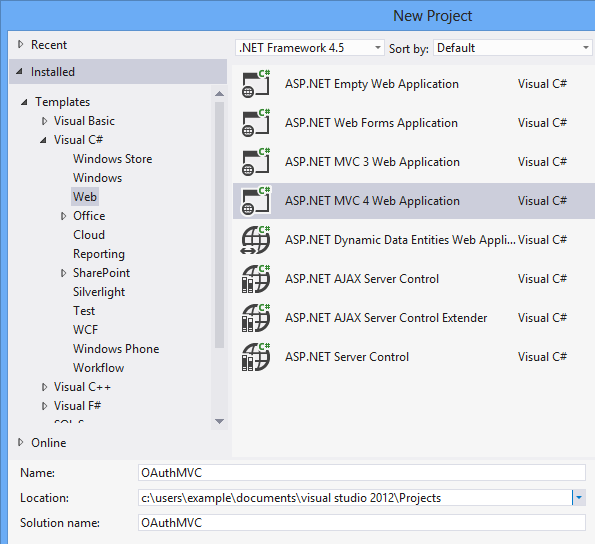

In the New ASP.NET MVC 4 Project window, select **Internet Application** and leave **Razor** as the view engine.

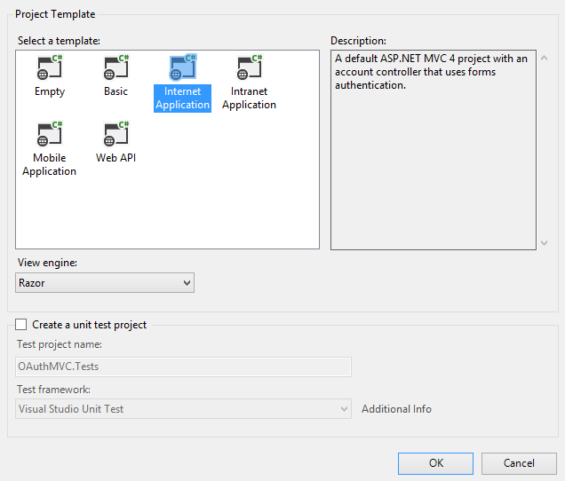

## Enable a provider

When you create an MVC 4 web application with the Internet Application template, the project is created with a file named AuthConfig.cs in the App\_Start folder.

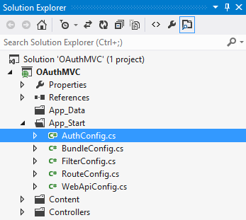

The AuthConfig file contains code to register clients for external authentication providers. By default, this code is commented out, so none of the external providers are enabled.

[!code-csharp[Main](using-oauth-providers-with-mvc/samples/sample1.cs)]

You must uncomment this code to use the external authentication client. You uncomment only the providers you want to include in your site. For this tutorial, you will only enable the Facebook credentials.

[!code-csharp[Main](using-oauth-providers-with-mvc/samples/sample2.cs)]

Notice in the above example that the method includes empty strings for the registration parameters. If you try to run the application now, the application throws an argument exception because empty strings are not allowed for the parameters. To provide valid values, you must register your web site with the external providers, as shown in the next section.

## Registering with an external provider

To authenticate users with credentials from an external provider, you must register your web site with the provider. When you register your site, you will receive the parameters (such as key or id, and secret) to include when registering the client. You must have an account with the providers you wish to use.

This tutorial does not show all of the steps you must perform to register with these providers. The steps are typically not difficult. To successfully register your site, follow the instructions provided on those sites. To get started with registering your site, see the developer site for:

- [Facebook](https://developers.facebook.com/)
- [Google](https://developers.google.com/)
- [Microsoft](http://manage.dev.live.com/)
- [Twitter](https://dev.twitter.com/)

When registering your site with Facebook, you can provide &quot;localhost&quot; for the site domain and `&quot;http://localhost/&quot;` for the URL, as shown in the image below. Using localhost works with most providers, but currently does not work with the Microsoft provider. For the Microsoft provider, you must include a valid web site URL.

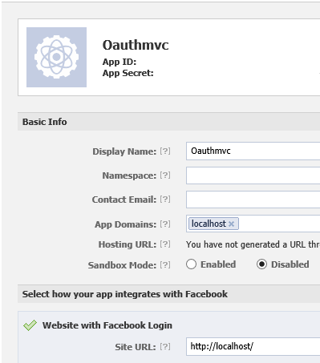

In the previous image, the values for the app id, app secret, and contact email have been removed. When you actually register your site, those values will be present. You will want to note the values for app id and app secret because you will add them to your application.

## Creating test users

If you do not mind using an existing Facebook account to test your site, you can skip this section.

You can easily create test users for your application within the Facebook app management page. You can use these test accounts to log in to your site. You create test users by clicking the **Roles** link in the left navigation pane and the clicking the **Create** link.

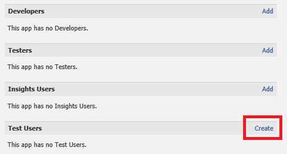

The Facebook site automatically creates the number of test accounts that you request.

## Adding application id and secret from the provider

Now that you have received the id and secret from Facebook, go back to the AuthConfig file and add them as the parameter values. The values shown below are not real values.

[!code-csharp[Main](using-oauth-providers-with-mvc/samples/sample3.cs)]

## Log in with external credentials

That is all you have to do to enable external credentials in your site. Run your application and click the login link in the upper right corner. The template automatically recognizes that you have registered Facebook as a provider and includes a button for the provider. If you register multiple providers, a button for each one is automatically included.

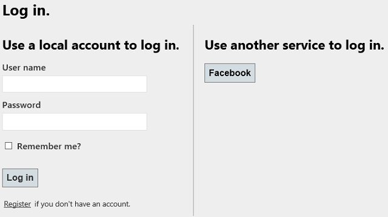

This tutorial does not cover how to customize the log in buttons for the external providers. For that information, see [Customizing the login UI when using OAuth/OpenID](https://blogs.msdn.com/b/pranav_rastogi/archive/2012/08/24/customizing-the-login-ui-when-using-oauth-openid.aspx).

Click on the Facebook button to log in with Facebook credentials. When you select one of the external providers, you are redirected to that site and prompted by that service to log in.

The following image shows the login screen for Facebook. It notes that you are using your Facebook account to log in to a site named oauthmvcexample.

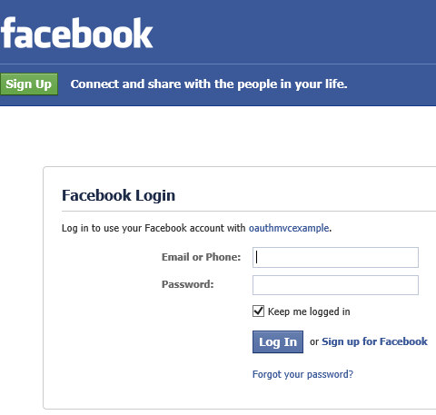

After logging in with Facebook credentials, a page informs the user that the site will have access to basic information.

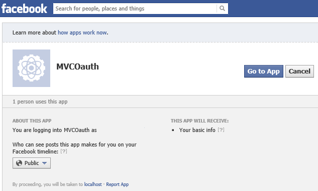

After selecting **Go to App**, the user must register for the site. The following image shows the registration page after a user has logged in with Facebook credentials. The user name is typically pre-filled with a name from the provider.

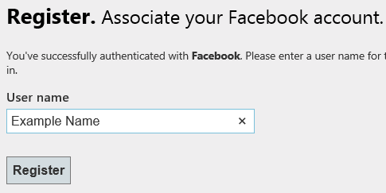

Click **Register** to complete registration. Close the browser.

You can see that the new account has been added to your database. In Server Explorer, open the **DefaultConnection** database and open the **Tables** folder.

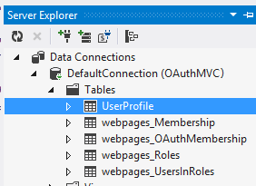

Right-click the **UserProfile** table and select **Show Table Data**.

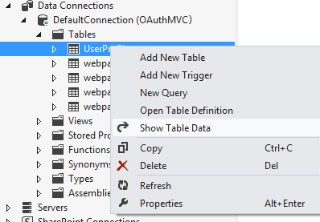

You will see the new account you added. Look at the data in **webpage\_OAuthMembership** table. You will see more data related to the external provider for the account you just added.

If you only want to enable external authentication, you are done. However, you can further integrate information from the provider into the new user registration process, as shown in the following sections.

## Create models for additional user information

As you noticed in the previous sections, you do not need to retrieve any additional information for the built-in account registration to work. However, most external providers pass back additional information about the user. The following sections show how to retain that information and save it to a database. Specifically, you will retain values for the user's full name, the URI of the user's personal web page, and a value that indicates whether Facebook has verified the account.

You will use [Code First Migrations](https://msdn.microsoft.com/en-us/data/jj591621) to add a table for storing additional user information. You are adding the table to an existing database, so you will first need to create a snapshot of the current database. By creating a snapshot of the current database, you can later create a migration that contains only the new table. To create a snapshot of the current database:

1. Open the **Package Manager Console**
2. Run the command **enable-migrations**
3. Run the command **add-migration initial –IgnoreChanges**
4. Run the command **update-database**

Now, you will add the new properties. In the Models folder, open the AccountModels.cs file, and find the RegisterExternalLoginModel class. The RegisterExternalLoginModel class holds values that come back from the authentication provider. Add properties named FullName and Link, as highlighted below.

[!code-csharp[Main](using-oauth-providers-with-mvc/samples/sample4.cs?highlight=9-13)]

Also in AccountModels.cs, add a new class called ExtraUserInformation. This class represents the new table which will be created in the database.

[!code-csharp[Main](using-oauth-providers-with-mvc/samples/sample5.cs)]

In the UsersContext class, add the highlighted code below to create a DbSet property for the new class.

[!code-csharp[Main](using-oauth-providers-with-mvc/samples/sample6.cs?highlight=9)]

You are now ready to create the new table. Open the Package Manager Console again and this time:

1. Run the command **add-migration AddExtraUserInformation**
2. Run the command **update-database**

The new table now exists in the database.

## Retrieve the additional data

There are two ways to retrieve additional user data. The first way is to retain user data that is passed back, by default, during the authentication request. The second way is to specifically call the provider API and request more information. Values for FullName and Link are automatically passed back by Facebook. A value that indicates whether Facebook has verified the account is retrieved through a call to the Facebook API. First, you will populate values for FullName and Link, and then later, you will get the verified value.

To retrieve the additional user data, open the **AccountController.cs** file in the **Controllers** folder.

This file contains the logic for logging, registering, and managing accounts. In particular, notice the methods called **ExternalLoginCallback** and **ExternalLoginConfirmation**. Within these methods, you can add code to customize external login operations for your application. The first line of the **ExternalLoginCallback** method contains:

[!code-csharp[Main](using-oauth-providers-with-mvc/samples/sample7.cs)]

Additional user data is passed back in the **ExtraData** property of the **AuthenticationResult** object that is returned from the **VerifyAuthentication** method. The Facebook client contains the following values in the **ExtraData** property:

- id
- name
- link
- gender
- accesstoken

Other providers will have similar but slightly different data in the ExtraData property.

If the user is new to your site, you will retrieve some the additional data and pass that data to the confirmation view. The last block of code in the method is run only if the user is new to your site. Replace the following line:

[!code-csharp[Main](using-oauth-providers-with-mvc/samples/sample8.cs)]

With this line:

[!code-csharp[Main](using-oauth-providers-with-mvc/samples/sample9.cs)]

This change merely includes values for the FullName and Link properties.

In the **ExternalLoginConfirmation** method, modify the code as highlighted below to save the additional user information.

[!code-csharp[Main](using-oauth-providers-with-mvc/samples/sample10.cs?highlight=4,7-13)]

## Adjusting the view

The additional user data that you retrieve from the provider will be displayed in the registration page.

In the **Views**/**Account** folder, open **ExternalLoginConfirmation.cshtml**. Below the existing field for user name, add fields for FullName, Link, and PictureLink.

[!code-cshtml[Main](using-oauth-providers-with-mvc/samples/sample11.cshtml)]

You are now almost ready to run the application and register a new user with the additional information saved. You must have an account that is not already registered with the site. You can either use a different test account, or delete the rows in the **UserProfile** and **webpages\_OAuthMembership** tables for the account you wish to reuse. By deleting those rows, you will ensure that the account is registered again.

Run the application and register the new user. Notice that this time the confirmation page contains more values.

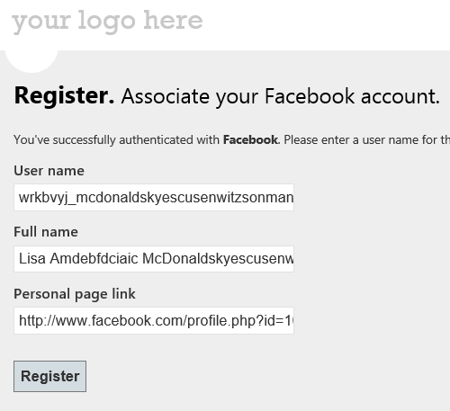

After completing registration, close the browser. Look in the database to notice the new values in the **ExtraUserInformation** table.

## Install NuGet package for Facebook API

Facebook provides an [API](https://developers.facebook.com/docs/reference/apis/) that you can call to perform operations. You can call the Facebook API either by directing sending HTTP requests, or by using installing a NuGet package that facilitates sending those requests. Using a NuGet package is shown in this tutorial, but installing NuGet package is not essential. This tutorial shows how to use the Facebook C# SDK package. There are other NuGet packages that assist with calling the Facebook API.

From the **Manage NuGet Packages** windows, select the Facebook C# SDK package.

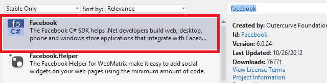

You will use the Facebook C# SDK to call an operation that requires the access token for the user. The next section shows how to get the access token.

## Retrieve access token

Most external providers pass back an access token after the user's credentials are verified. This access token is very important because it enables you to call operations that are only available to authenticated users. Therefore, retrieving and storing the access token is essential when you want to provide more functionality.

Depending on the external provider, the access token may be valid for only a limited amount of time. To ensure that you have a valid access token, you will retrieve it each time the user logs in, and store it as a session value rather than save it to a database.

In the **ExternalLoginCallback** method, the access token is also passed back in the **ExtraData** property of the **AuthenticationResult** object. Add the highlighted code to **ExternalLoginCallback** to save the access token in the **Session** object. This code is run every time the user logs in with a Facebook account.

[!code-csharp[Main](using-oauth-providers-with-mvc/samples/sample12.cs?highlight=11-14)]

Although this example retrieves an access token from Facebook, you can retrieve the access token from any external provider through the same key named &quot;accesstoken&quot;.

## Logging off

The default **LogOff** method logs the user out of your application, but does not log the user out of the external provider. To log the user out of Facebook, and prevent the token from persisting after the user has logged off, you can add the following highlighted code to the **LogOff** method in the AccountController.

[!code-csharp[Main](using-oauth-providers-with-mvc/samples/sample13.cs?highlight=6-14)]

The value you provide in the `next` parameter is the URL to use after the user has logged out of Facebook. When testing on your local computer, you would provide the correct port number for your local site. In production, you would provide a default page, such as contoso.com.

## Retrieve user information that requires the access token

Now that you have stored the access token and installed the Facebook C# SDK package, you can use them together to request additional user information from Facebook. In the **ExternalLoginConfirmation** method, create an instance of the **FacebookClient** class by passing the value of the access token. Request the value of the **verified** property for the current, authenticated user. The **verified** property indicates whether Facebook has validated the account through some other means, such as sending a message to a cell phone. Save this value in the database.

[!code-csharp[Main](using-oauth-providers-with-mvc/samples/sample14.cs?highlight=7-18,25)]

You will again need to either delete the records in the database for the user, or use a different Facebook account.

Run the application, and register the new user. Look at the **ExtraUserInformation** table to see the value for the Verified property.

## Conclusion

In this tutorial, you created a site that is integrated with Facebook for user authentication and registration data. You learned about the default behavior that is set up for MVC 4 web application, and how to customize that default behavior.

## Related topics

- [Create an ASP.NET MVC app with auth and SQL DB and deploy to Azure App Service](https://www.windowsazure.com/en-us/develop/net/tutorials/web-site-with-sql-database/)
- [ASP.NET MVC Facebook Birthday App](../getting-started/aspnet-mvc-facebook-birthday-app.md)