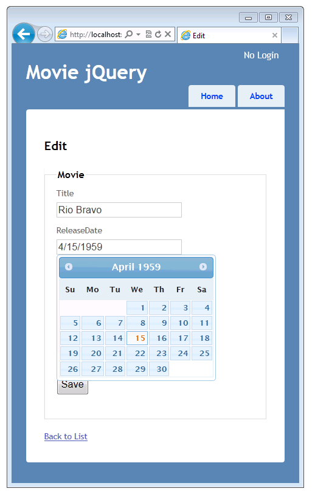
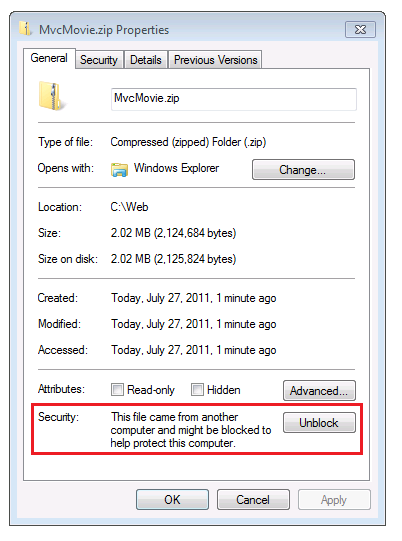
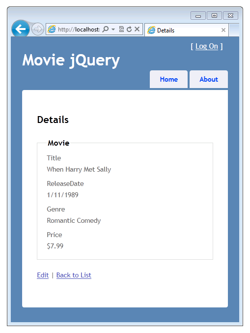
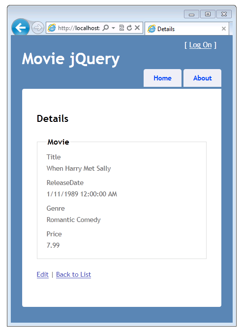

Using the HTML5 and jQuery UI Datepicker Popup Calendar with ASP.NET MVC - Part 1
====================
by [Rick Anderson](https://github.com/Rick-Anderson)

> This tutorial will teach you the basics of how to work with editor templates, display templates, and the jQuery UI datepicker popup calendar in an ASP.NET MVC Web application.

This tutorial will teach you the basics of how to work with editor templates, display templates, and the jQuery [UI datepicker popup calendar](http://plugins.jquery.com/project/datepicker) in an ASP.NET MVC Web application. For this tutorial, you can use Microsoft Visual Web Developer 2010 Express Service Pack 1 (&quot;Visual Web Developer&quot;), which is a free version of Microsoft Visual Studio, or you can use Visual Studio 2010 SP1 if you already have that.

Before you start, make sure you've installed the prerequisites listed below. You can install all of them by clicking the following link: [Web Platform Installer](https://www.microsoft.com/web/gallery/install.aspx?appid=VWD2010SP1Pack). Alternatively, you can individually install the required software using the following links:

- [Visual Studio Web Developer Express SP1 prerequisites](https://www.microsoft.com/web/gallery/install.aspx?appid=VWD2010SP1Pack)
- [ASP.NET MVC 3 Tools Update](https://www.microsoft.com/web/gallery/install.aspx?appsxml=&amp;appid=MVC3)
- [SQL Server Compact 4.0](https://www.microsoft.com/web/gallery/install.aspx?appid=SQLCE;SQLCEVSTools_4_0)(runtime + tools support)

If you're using Visual Studio 2010 instead of Visual Web Developer, install the prerequisites by clicking the following link: [Visual Studio 2010 prerequisites](https://www.microsoft.com/web/gallery/install.aspx?appsxml=&amp;appid=VS2010SP1Pack).

This tutorial assumes you have completed the [Getting Started with MVC 3](../getting-started-with-aspnet-mvc3/cs/intro-to-aspnet-mvc-3.md) tutorial or that you're familiar with ASP.NET MVC development. This tutorial starts with the completed project from the [Getting Started with MVC 3](../getting-started-with-aspnet-mvc3/cs/intro-to-aspnet-mvc-3.md) tutorial.

This tutorial shows code in C#. However, the [starter project](https://archive.msdn.microsoft.com/Project/Download/FileDownload.aspx?ProjectName=aspnetmvcsamples&amp;DownloadId=15800) and completed project are also available in Visual Basic.

A Visual Studio project with C# and Visual Basic source code is available to accompany this topic: [Download](https://archive.msdn.microsoft.com/Project/Download/FileDownload.aspx?ProjectName=aspnetmvcsamples&amp;DownloadId=15800).

### What You'll Build

You'll add templates (specifically, edit and display templates) to the simple movie-listing application that was created in the [Getting Started with MVC 3](../getting-started-with-aspnet-mvc3/cs/intro-to-aspnet-mvc-3.md) tutorial. You will also add a [jQuery UI datepicker](http://jqueryui.com/demos/datepicker/) popup calendar to simplify the process of entering dates. The following screenshot shows the modified application with the jQuery UI datepicker popup calendar displayed.

### Skills You'll Learn

Here's what you'll learn:

- How to use attributes from the [DataAnnotations](https://msdn.microsoft.com/en-us/library/system.componentmodel.dataannotations.aspx) namespace to control the format of data when it's displayed and when it's in edit mode.
- How to create templates (edit and display templates) to control the formatting of data.
- How to add the [jQuery UI datepicker](http://jqueryui.com/demos/datepicker/) as a way to enter date fields.

### Getting Started

If you don't already have the movie-listing application from the starter project, download it using the following link: [Download](https://code.msdn.microsoft.com/Project/Download/FileDownload.aspx?https://archive.msdn.microsoft.com/Project/Download/FileDownload.aspx?ProjectName=aspnetmvcsamples&amp;DownloadId=15800). Then in Windows Explorer, right-click the *MvcMovie.zip* file and select **Properties**. In the **MvcMovie.zip Properties** dialog box, select **Unblock**. (Unblocking prevents a security warning that occurs when you try to use a *.zip* file that you've downloaded from the web.)

Right-click the *MvcMovie.zip* file and select **Extract All** to unzip the file. In Visual Web Developer or Visual Studio 2010, open the *MvcMovieCS\_TU.sln* file.

In **Solution Explorer**, double-click the *Views\Shared\\_Layout.cshtml* to open it. Change the `H1` header from **MVC Movie App** to **Movie jQuery**. Press CTRL+F5 to run the application and click the **Home** tab, which takes you to the `Index` method of the movie controller. To try out the application, select the **Edit** link and the **Details** link for one of the movies. Notice that in the Index, Edit, and Details views, the release date and price are nicely formatted:

The formatting for the date and the price is the result of using the [DisplayFormat](https://msdn.microsoft.com/en-us/library/system.componentmodel.dataannotations.displayformatattribute.aspx) attribute on properties of the `Movie` class.

Open the *Movie.cs* file and comment out the `DisplayFormat` attribute on the `ReleaseDate` and `Price` properties. The resulting `Movie` class looks like this:

[!code-csharp[Main](using-the-html5-and-jquery-ui-datepicker-popup-calendar-with-aspnet-mvc-part-1/samples/sample1.cs)]

Press CTRL+F5 again to run the application and select the **Home** tab to view the movie list. This time the release date shows the date and time, and the price field no longer shows the currency symbol. Your change in the `Movie` class has undone the nice formatting that you saw earlier, but you'll fix that in a moment.

### Using the DataAnnotations DataType Attribute to Specify the Data Type

Replace the commented-out `DisplayFormat` attribute for the `ReleaseDate` property with the [DataType](https://msdn.microsoft.com/en-us/library/system.componentmodel.dataannotations.datatype.aspx) attribute, using the `Date` enumeration. Replace the `DisplayFormat` attribute for the `Price` property with the [DataType](https://msdn.microsoft.com/en-us/library/system.componentmodel.dataannotations.datatype.aspx) attribute again, this time using the `Currency` enumeration. This is what the completed code looks like:

[!code-csharp[Main](using-the-html5-and-jquery-ui-datepicker-popup-calendar-with-aspnet-mvc-part-1/samples/sample2.cs)]

Run the application. Now the release date and the price properties are formatted correctly (that is, using appropriate date and currency formats). The [DataType](https://msdn.microsoft.com/en-us/library/system.componentmodel.dataannotations.datatype.aspx) attribute provides type metadata for the built-in ASP.NET MVC templates so that the fields render in the correct format. Using the `DataType` attribute is preferable to using the `DisplayFormat` attribute that was originally in the code, because the `DataType` attribute makes the model cleaner and more flexible for purposes like internationalization.

In the next section you'll see how to make custom templates to display date fields.

>[!div class="step-by-step"]
[Next](using-the-html5-and-jquery-ui-datepicker-popup-calendar-with-aspnet-mvc-part-2.md)