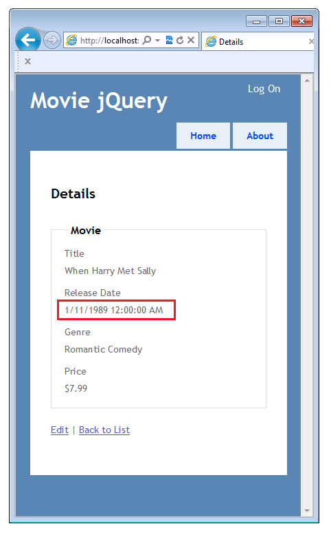
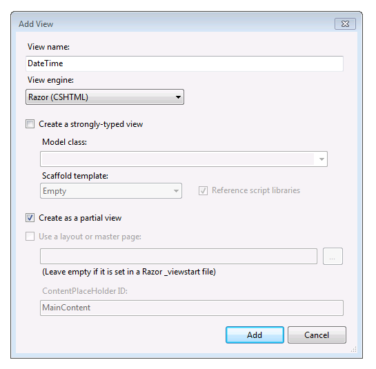
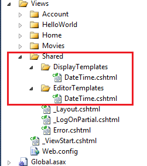
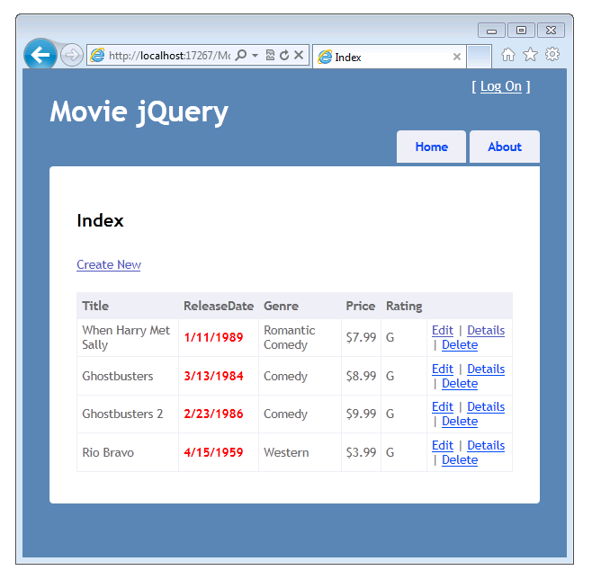
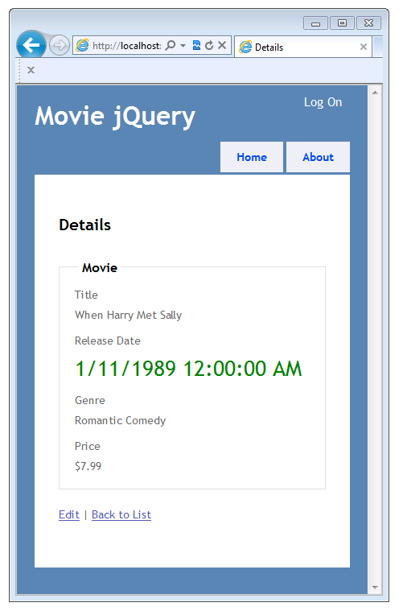

Using the HTML5 and jQuery UI Datepicker Popup Calendar with ASP.NET MVC - Part 2
====================
by [Rick Anderson](https://github.com/Rick-Anderson)

> This tutorial will teach you the basics of how to work with editor templates, display templates, and the jQuery UI datepicker popup calendar in an ASP.NET MVC Web application.

## Adding an Automatic DateTime Template

In the first part of this tutorial, you saw how you can add attributes to the model to explicitly specify formatting, and how you can explicitly specify the template that's used to render the model. For example, the [DisplayFormat](https://msdn.microsoft.com/en-us/library/system.componentmodel.dataannotations.displayformatattribute.aspx) attribute in the following code explicity specifies the formatting for the `ReleaseDate` property.

[!code-csharp[Main](using-the-html5-and-jquery-ui-datepicker-popup-calendar-with-aspnet-mvc-part-2/samples/sample1.cs)]

In the following example, the [DataType](https://msdn.microsoft.com/en-us/library/system.componentmodel.dataannotations.datatype.aspx) attribute, using the `Date` enumeration, specifies that the date template should be used to render the model. If there's no date template in your project, the built-in date template is used.

[!code-csharp[Main](using-the-html5-and-jquery-ui-datepicker-popup-calendar-with-aspnet-mvc-part-2/samples/sample2.cs)]

However, ASP.MVC can perform type matching using convention-over-configuration, by looking for a template that matches the name of a type. This lets you create a template that automatically formats data without using any attributes or code at all. For this part of the tutorial, you'll create a template that's automatically applied to model properties of type [DateTime](https://msdn.microsoft.com/en-us/library/system.datetime.aspx). You won't need to use an attribute or other configuration to specify that the template should be used to render all model properties of type [DateTime](https://msdn.microsoft.com/en-us/library/system.datetime.aspx).

You'll also learn a way to customize the display of individual properties or even individual fields.

To begin, let's remove existing formatting information and display full dates in the application.

Open the *Movie.cs* file and comment out the `DataType` attribute on the `ReleaseDate` property:

[!code-csharp[Main](using-the-html5-and-jquery-ui-datepicker-popup-calendar-with-aspnet-mvc-part-2/samples/sample3.cs)]

Press CTRL+F5 to run the application.

Notice that the `ReleaseDate` property now displays both the date and time, because that's the default when no formatting information is provided.

### Adding CSS Styles for Testing New Templates

Before you create a template for formatting dates, you'll add a few CSS style rules that you can apply to the new templates. These will help you verify that the rendered page is using the new template.

Open the *Content\Site.cs*s file and add the following CSS rules to the bottom of the file:

[!code-css[Main](using-the-html5-and-jquery-ui-datepicker-popup-calendar-with-aspnet-mvc-part-2/samples/sample4.css)]

### Adding DateTime Display Templates

Now you can create the new template. In the *Views\Movies* folder, create a *DisplayTemplates* folder.

In the *Views\Shared* folder, create a *DisplayTemplates* folder and an *EditorTemplates* folder.

The display templates in the *Views\Shared\DisplayTemplates* folder will be used by all controllers. The display templates in the *Views\Movie\DisplayTemplates* folder will be used only by the `Movie` controller. (If a template with the same name appears in both folders, the template in the *Views\Movie\DisplayTemplates* folder — that is, the more specific template — takes precedence for views returned by the `Movie` controller.)

In **Solution Explorer**, expand the *Views* folder, expand the *Shared* folder, and then right-click the *Views\Shared\DisplayTemplates* folder.

Click **Add** and then click **View**. The **Add View** dialog box is displayed.

In the **View name** box, type `DateTime`. (You must use this name in order to match the name of the type.)

Select the **Create as a partial view** check box. Make sure that the **Use a layout or master page** and **Create a strongly-typed view** check boxes are not selected.

Click **Add**. A *DateTime.cshtml* template is created in the *Views\Shared\DisplayTemplates*.

The following image shows the *Views* folder in **Solution Explorer** after the `DateTime` display and editor templates are created.

Open the *Views\Shared\DisplayTemplates\DateTime.cshtml* file and add the following markup, which uses the [String.Format](https://msdn.microsoft.com/en-us/library/system.string.format.aspx) method to format the property as a date without the time. (The `{0:d}` format specifies short date format.)

[!code-csharp[Main](using-the-html5-and-jquery-ui-datepicker-popup-calendar-with-aspnet-mvc-part-2/samples/sample5.cs)]

Repeat this step to create a `DateTime` template in the *Views\Movie\DisplayTemplates* folder. Use the following code in the *Views\Movie\DisplayTemplates\DateTime.cshtml* file.

[!code-csharp[Main](using-the-html5-and-jquery-ui-datepicker-popup-calendar-with-aspnet-mvc-part-2/samples/sample6.cs)]

The `loud-1` CSS class causes the date to be display in bold red text. You added the `loud-1` CSS class just as a temporary measure so you can easily see when this particular template is being used.

What you've done is created and customized templates that ASP.NET will use to display dates. The more general template (in the *Views\Shared\DisplayTemplates* folder) displays a simple short date. The template that's specifically for the `Movie` controller (in the *Views\Movies\DisplayTemplates* folder) displays a short date that's also formatted as bold red text.

Press CTRL+F5 to run the application. The browser renders the Index view for the application.

The `ReleaseDate` property now displays the date in a bold red font without the time.This helps you confirm that the `DateTime` templated helper in the *Views\Movies\DisplayTemplates* folder is selected over the `DateTime` templated helper in the shared folder (*Views\Shared\DisplayTemplates*).

Now rename the *Views\Movies\DisplayTemplates\DateTime.cshtml* file to *Views\Movies\DisplayTemplates\LoudDateTime.cshtml*.

Press CTRL+F5 to run the application.

This time the `ReleaseDate` property displays a date without the time and without the bold red font. This illustrates that a template that has the name of the data type (in this case `DateTime`) is automatically used to display all model properties of that type. After you renamed the *DateTime.cshtml* file to *LoudDateTime.cshtml*, ASP.NET no longer found a template in the *Views\Movies\DisplayTemplates* folder, so it used the *DateTime.cshtml* template from the *Views\Movies\Shared\* folder.

(The template matching is case insensitive, so you could have created the template file name with any casing. For example, *DATETIME.chstml, datetime.cshtml*, and *DaTeTiMe.cshtml* would all match the `DateTime` type.)

To review: at this point, the `ReleaseDate` field is being displayed using the *Views\Movies\DisplayTemplates\DateTime.cshtml* template, which displays the data using a short date format, but otherwise adds no special format.

### Using UIHint to Specify a Display Template

If your web application has many `DateTime` fields and by default you want to display all or most of them in date-only format, the *DateTime.cshtml* template is a good approach. But what if you have a few dates where you want to display the full date and time? No problem. You can create an additional template and use the [UIHint](https://msdn.microsoft.com/en-us/library/system.componentmodel.dataannotations.uihintattribute.uihint.aspx) attribute to specify formatting for the full date and time. You can then selectively apply that template. You can use the [UIHint](https://msdn.microsoft.com/en-us/library/system.componentmodel.dataannotations.uihintattribute.uihint.aspx) attribute at the model level or you can specify the template inside a view. In this section, you'll see how to use the `UIHint` attribute to selectively change the formatting for some instances of date-time fields.

Open the *Views\Movies\DisplayTemplates\LoudDateTime.cshtml* file and replace the existing code with the following:

[!code-cshtml[Main](using-the-html5-and-jquery-ui-datepicker-popup-calendar-with-aspnet-mvc-part-2/samples/sample7.cshtml)]

This causes the full date and time to be displayed and adds the CSS class that makes the text green and large.

Open the *Movie.cs* file and add the [UIHint](https://msdn.microsoft.com/en-us/library/system.componentmodel.dataannotations.uihintattribute.uihint.aspx) attribute to the `ReleaseDate` property, as shown in the following example:

[!code-csharp[Main](using-the-html5-and-jquery-ui-datepicker-popup-calendar-with-aspnet-mvc-part-2/samples/sample8.cs)]

This tells ASP.NET MVC that when it displays the `ReleaseDate` property (specifically, and not just any `DateTime` object), it should use the *LoudDateTime.cshtml* template.

Press CTRL+F5 to run the application.

Notice that the `ReleaseDate` property now displays the date and time in a large green font.

Return to the `UIHint` attribute in the *Movie.cs* file and comment it out so the *LoudDateTime.cshtml* template won't be used. Run the application again. The release date is not displayed large and green. This verifies that the *Views\Shared\DisplayTemplates\DateTime.cshtml* template is used in the Index and Details views.

As mentioned earlier, you can also apply a template in a view, which lets you apply the template to an individual instance of some data. Open the *Views\Movies\Details.cshtml* view. Add `"LoudDateTime"` as the second parameter of the [Html.DisplayFor](https://msdn.microsoft.com/en-us/library/ee407420.aspx) call for the `ReleaseDate` field. The completed code looks like this:

[!code-cshtml[Main](using-the-html5-and-jquery-ui-datepicker-popup-calendar-with-aspnet-mvc-part-2/samples/sample9.cshtml)]

This specifies that the `LoudDateTime` template should be used to display the model property, regardless of what attributes are applied to the model.

Press CTRL+F5 to run the application.

Verify that the movie index page is using the *Views\Shared\DisplayTemplates\DateTime.cshtml* template (red bold) and the *Movie\Details* page is using the *Views\Movies\DisplayTemplates\LoudDateTime.cshtml* template (large and green).

In the next section, you'll create a template for a complex type.

>[!div class="step-by-step"]
[Previous](using-the-html5-and-jquery-ui-datepicker-popup-calendar-with-aspnet-mvc-part-1.md)
[Next](using-the-html5-and-jquery-ui-datepicker-popup-calendar-with-aspnet-mvc-part-3.md)