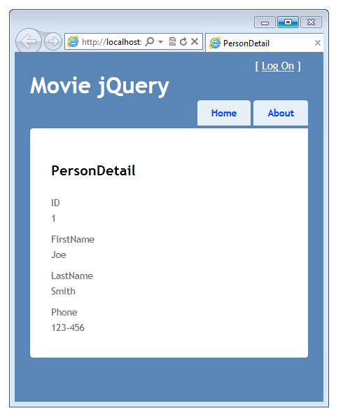
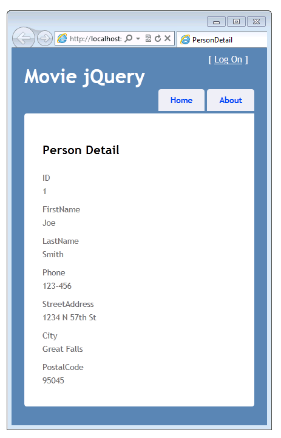
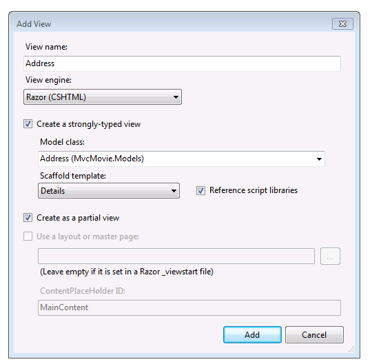

Using the HTML5 and jQuery UI Datepicker Popup Calendar with ASP.NET MVC - Part 3
====================
by [Rick Anderson](https://github.com/Rick-Anderson)

> This tutorial will teach you the basics of how to work with editor templates, display templates, and the jQuery UI datepicker popup calendar in an ASP.NET MVC Web application.

## Working with Complex Types

In this section you'll create an address class and learn how to create a template to display it.

In the *Models* folder, create a new class file named *Person.cs* where you'll put two types: a `Person` class and an `Address` class. The `Person` class will contain a property that's typed as `Address`. The `Address` type is a complex type, meaning it's not one of the built-in types like `int`, `string`, or `double`. Instead, it has several properties. The code for the new classes looks like this:

[!code-csharp[Main](using-the-html5-and-jquery-ui-datepicker-popup-calendar-with-aspnet-mvc-part-3/samples/sample1.cs)]

In the `Movie` controller, add the following `PersonDetail` action to display a person instance:

[!code-csharp[Main](using-the-html5-and-jquery-ui-datepicker-popup-calendar-with-aspnet-mvc-part-3/samples/sample2.cs)]

Then add the following code to the `Movie` controller to populate the `Person` model with some sample data:

[!code-csharp[Main](using-the-html5-and-jquery-ui-datepicker-popup-calendar-with-aspnet-mvc-part-3/samples/sample3.cs)]

Open the *Views\Movies\PersonDetail.cshtml* file and add the following markup for the `PersonDetail` view.

[!code-cshtml[Main](using-the-html5-and-jquery-ui-datepicker-popup-calendar-with-aspnet-mvc-part-3/samples/sample4.cshtml)]

Press Ctrl+F5 to run the application and navigate to *Movies/PersonDetail*.

The `PersonDetail` view doesn't contain the `Address` complex type, as you can see in this screenshot. (No address is shown.)

The `Address` model data is not displayed because it's a complex type. To display the address information, open the *Views\Movies\PersonDetail.cshtml* file again and add the following markup.

[!code-cshtml[Main](using-the-html5-and-jquery-ui-datepicker-popup-calendar-with-aspnet-mvc-part-3/samples/sample5.cshtml)]

The complete markup for the `PersonDetail` now view looks like this:

[!code-cshtml[Main](using-the-html5-and-jquery-ui-datepicker-popup-calendar-with-aspnet-mvc-part-3/samples/sample6.cshtml)]

Run the application again and display the `PersonDetail` view. The address information is now displayed:

### Creating a Template for a Complex Type

In this section you'll create a template that will be used to render the `Address` complex type. When you create a template for the `Address` type, ASP.NET MVC can automatically use it to format an address model anywhere in the application. This gives you a way to control the rendering of the `Address` type from just one place in the application.

In the *Views\Shared\DisplayTemplates* folder, create a strongly typed partial view named **Address**:

Click **Add**, and then open the new *Views\Shared\DisplayTemplates\Address.cshtml* file. The new view contains the following generated markup:

[!code-cshtml[Main](using-the-html5-and-jquery-ui-datepicker-popup-calendar-with-aspnet-mvc-part-3/samples/sample7.cshtml)]

Run the application and display the `PersonDetail` view. This time, the `Address` template that you just created is used to display the `Address` complex type, so the display looks like the following:

### Summary: Ways to Specify the Model Display Format and Template

You've seen that you can specify the format or template for a model property by using the following approaches:

- Applying the `DisplayFormat` attribute to a property in the model. For example, the following code causes the date to be displayed without the time:

    [!code-csharp[Main](using-the-html5-and-jquery-ui-datepicker-popup-calendar-with-aspnet-mvc-part-3/samples/sample8.cs)]
- Applying a [DataType](https://msdn.microsoft.com/en-us/library/system.componentmodel.dataannotations.datatype.aspx) attribute to a property in the model and specifying the data type. For example, the following code causes the date to be displayed without the time.

    [!code-csharp[Main](using-the-html5-and-jquery-ui-datepicker-popup-calendar-with-aspnet-mvc-part-3/samples/sample9.cs)]

    If the application contains a *date.cshtml* template in the *Views\Shared\DisplayTemplates* folder or the *Views\Movies\DisplayTemplates* folder, that template will be used to render the `DateTime` property. Otherwise the built-in ASP.NET templating system displays the property as a date.
- Creating a display template in the *Views\Shared\DisplayTemplates* folder or the *Views\Movies\DisplayTemplates* folder whose name matches the data type that you want to format. For example, you saw that the *Views\Shared\DisplayTemplates\DateTime.cshtml* was used to render `DateTime` properties in a model, without adding an attribute to the model and without adding any markup to views.
- Using the [UIHint](https://msdn.microsoft.com/en-us/library/system.componentmodel.dataannotations.uihintattribute.uihint.aspx) attribute on the model to specify the template to display the model property.
- Explicitly adding the display template name to the [Html.DisplayFor](https://msdn.microsoft.com/en-us/library/ee407420.aspx) call in a view.

The approach you use depends on what you need to do in your application. It's not uncommon to mix these approaches to get exactly the kind of formatting that you need.

In the next section, you'll switch gears a bit and move from customizing how data is displayed to customizing how it's entered. You'll hook up the jQuery datepicker to the edit views in the application in order to provide a slick way to specify dates.

>[!div class="step-by-step"]
[Previous](using-the-html5-and-jquery-ui-datepicker-popup-calendar-with-aspnet-mvc-part-2.md)
[Next](using-the-html5-and-jquery-ui-datepicker-popup-calendar-with-aspnet-mvc-part-4.md)