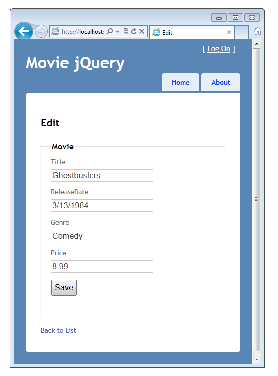
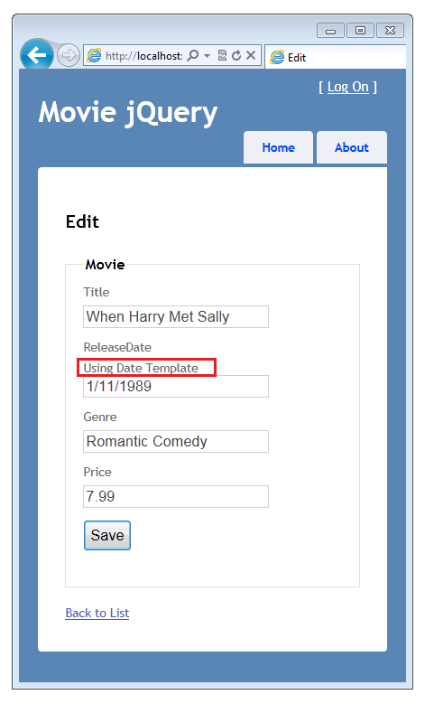
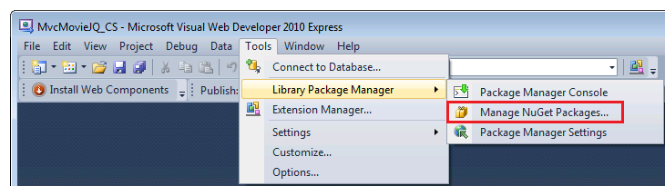
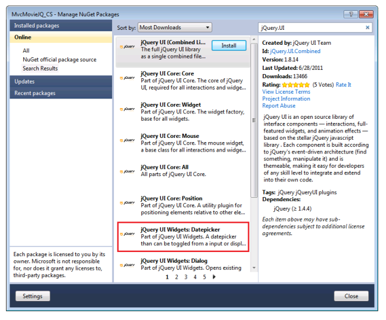
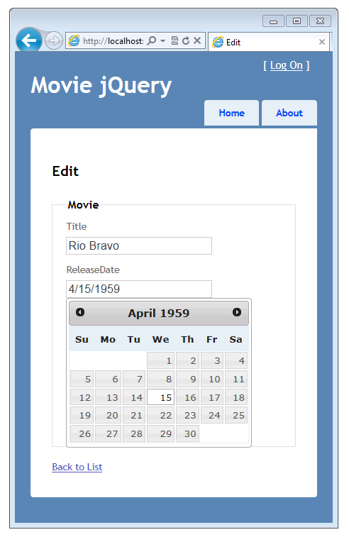

Using the HTML5 and jQuery UI Datepicker Popup Calendar with ASP.NET MVC - Part 4
====================
by [Rick Anderson](https://github.com/Rick-Anderson)

> This tutorial will teach you the basics of how to work with editor templates, display templates, and the jQuery UI datepicker popup calendar in an ASP.NET MVC Web application.

### Adding a Template for Editing Dates

In this section you'll create a template for editing dates that will be applied when ASP.NET MVC displays UI for editing model properties that are marked with the **Date** enumeration of the [DataType](https://msdn.microsoft.com/en-us/library/system.componentmodel.dataannotations.datatype.aspx) attibute. The template will render only the date; time will not be displayed. In the template you'll use the [jQuery UI Datepicker](http://jqueryui.com/demos/datepicker/) popup calendar to provide a way to edit dates.

To begin, open the *Movie.cs* file and add the [DataType](https://msdn.microsoft.com/en-us/library/system.componentmodel.dataannotations.datatypeattribute.aspx) attribute with the **Date** enumeration to the `ReleaseDate` property, as shown in the following code:

[!code-csharp[Main](using-the-html5-and-jquery-ui-datepicker-popup-calendar-with-aspnet-mvc-part-4/samples/sample1.cs)]

This code causes the `ReleaseDate` field to be displayed without the time in both display templates and edit templates. If your application contains a *date.cshtml* template in the *Views\Shared\EditorTemplates* folder or in the *Views\Movies\EditorTemplates* folder, that template will be used to render any `DateTime` property while editing. Otherwise the built-in ASP.NET templating system will display the property as a date.

Press CTRL+F5 to run the application. Select an edit link to verify that the input field for the release date is showing only the date.

In **Solution Explorer**, expand the *Views* folder, expand the *Shared* folder, and then right-click the *Views\Shared\EditorTemplates* folder.

Click **Add**, and then click **View**. The **Add View** dialog box is displayed.

In the **View name** box, type &quot;Date&quot;.

Select the **Create as a partial view** check box. Make sure that the **Use a layout or master page** and **Create a strongly-typed view** check boxes are not selected.

Click **Add**. The *Views\Shared\EditorTemplates\Date.cshtml* template is created.

Add the following code to the *Views\Shared\EditorTemplates\Date.cshtml* template.

[!code-cshtml[Main](using-the-html5-and-jquery-ui-datepicker-popup-calendar-with-aspnet-mvc-part-4/samples/sample2.cshtml)]

The first line declares the model to be a `DateTime` type. Although you don't need to declare the model type in edit and display templates, it's a best practice so that you get compile-time checking of the model being passed to the view. (Another benefit is that you then get IntelliSense for the model in the view in Visual Studio.) If the model type is not declared, ASP.NET MVC considers it a [dynamic](https://msdn.microsoft.com/en-us/library/dd264741.aspx) type and there's no compile-time type checking. If you declare the model to be a `DateTime` type, it becomes strongly typed.

The second line is just literal HTML markup that displays &quot;Using Date Template&quot; before a date field. You'll use this line temporarily to verify that this date template is being used.

The next line is an [Html.TextBox](https://msdn.microsoft.com/en-us/library/system.web.mvc.html.inputextensions.textbox.aspx) helper that renders an `input` field that's a text box. The third parameter for the helper uses an anonymous type to set the class for the text box to `datefield` and the type to `date`. (Because `class` is a reserved in C#, you need to use the `@` character to escape the `class` attribute in the C# parser.)

The `date` type is an HTML5 input type that enables HTML5-aware browsers to render a HTML5 calendar control. Later on you'll add some JavaScript to hook up the jQuery datepicker to the `Html.TextBox` element using the `datefield` class.

Press CTRL+F5 to run the application. You can verify that the `ReleaseDate` property in the edit view is using the edit template because the template displays &quot;Using Date Template&quot; just before the `ReleaseDate` text input box, as shown in this image:

In your browser, view the source of the page. (For example, right-click the page and select **View source**.) The following example shows some of the markup for the page, illustrating the `class` and `type` attributes in the rendered HTML.

[!code-html[Main](using-the-html5-and-jquery-ui-datepicker-popup-calendar-with-aspnet-mvc-part-4/samples/sample3.html)]

Return to the *Views\Shared\EditorTemplates\Date.cshtml* template and remove the &quot;Using Date Template&quot; markup. Now the completed template looks like this:

[!code-cshtml[Main](using-the-html5-and-jquery-ui-datepicker-popup-calendar-with-aspnet-mvc-part-4/samples/sample4.cshtml)]

### Adding a jQuery UI Datepicker Popup Calendar using NuGet

In this section you'll add the [jQuery UI datepicker](http://jqueryui.com/demos/datepicker/) popup calendar to the date-edit template. The [jQuery UI](http://jqueryui.com/) library provides support for animation, advanced effects, and customizable widgets. It's built on top of the jQuery JavaScript library. The datepicker popup calendar makes it easy and natural to enter dates using a calendar instead of entering a string. The popup calendar also limits users to legal dates — ordinary text entry for a date would let you enter something like `2/33/1999` ( February 33rd, 1999), but the [jQuery UI datepicker](http://jqueryui.com/demos/datepicker/) popup calendar won't allow that.

First, you have to install the jQuery UI libraries. To do that, you'll use NuGet, which is a package manager that's included in SP1 versions of Visual Studio 2010 and Visual Web Developer.

In Visual Web Developer, from the **Tools** menu, select **Library Package Manager** and then select **Manage NuGet Packages**.

Note: If the **Tools** menu doesn't display the **Library Package Manager** command, you need to install NuGet by following the instructions on the [Installing NuGet](http://docs.nuget.org/docs/start-here/installing-nuget) page of the NuGet website.   
  
If you're using Visual Studio instead of Visual Web Developer, from the **Tools** menu, select **Library Package Manager** and then select **Add Library Package Reference**.

In the **MVCMovie - Manage NuGet Packages** dialog box, click the **Online** tab on the left and then enter &quot;jQuery.UI&quot; in the search box. Select j **Query UI WIdgets:Datepicker**, then select the **Install** button.

NuGet adds these debug versions and minified versions of jQuery UI Core and the jQuery UI date picker to your project:

- *jquery.ui.core.js*
- *jquery.ui.core.min.js*
- *jquery.ui.datepicker.js*
- *jquery.ui.datepicker.min.js*

Note: The debug versions (the files without the *.min.js* extension) are useful for debugging, but in a production site, you'd include only the minified versions.

To actually use the jQuery date picker, you need to create a jQuery script that will hook up the calendar widget to the edit template. In **Solution Explorer**, right-click the *Scripts* folder and select **Add**, then **New Item**, and then **JScript File**. Name the file *DatePickerReady.js*.

Add the following code to the *DatePickerReady.js* file:

[!code-javascript[Main](using-the-html5-and-jquery-ui-datepicker-popup-calendar-with-aspnet-mvc-part-4/samples/sample5.js)]

If you're not familiar with jQuery, here's a brief explanation of what this does: the first line is the &quot;jQuery ready&quot; function, which is called when all the DOM elements in a page have loaded. The second line selects all DOM elements that have the class name `datefield`, then invokes the `datepicker` function for each of them. (Remember that you added the `datefield` class to the *Views\Shared\EditorTemplates\Date.cshtml* template earlier in the tutorial.)

Next, open the *Views\Shared\\_Layout.cshtml* file. You need to add references to the following files, which are all required so that you can use the date picker:

- *Content/themes/base/jquery.ui.core.css*
- *Content/themes/base/jquery.ui.datepicker.css*
- *Content/themes/base/jquery.ui.theme.css*
- *jquery.ui.core.min.js*
- *jquery.ui.datepicker.min.js*
- *DatePickerReady.js*

The following example shows the actual code that you should add at the bottom of the `head` element in the *Views\Shared\\_Layout.cshtml* file.

[!code-cshtml[Main](using-the-html5-and-jquery-ui-datepicker-popup-calendar-with-aspnet-mvc-part-4/samples/sample6.cshtml)]

The complete `head` section is shown here:

[!code-cshtml[Main](using-the-html5-and-jquery-ui-datepicker-popup-calendar-with-aspnet-mvc-part-4/samples/sample7.cshtml)]

The [URL content helper](https://msdn.microsoft.com/en-us/library/system.web.mvc.urlhelper.content.aspx) method converts the resource path to an absolute path. You must use `@URL.Content` to correctly reference these resources when the application is running on IIS.

Press CTRL+F5 to run the application. Select an edit link, then put the insertion point into the **ReleaseDate** field. The jQuery UI popup calendar is displayed.

Like most jQuery controls, the datepicker lets you customize it extensively. For information, see [Visual Customization: Designing a jQuery UI theme](http://learn.jquery.com/jquery-ui/getting-started/#visual-customization-designing-a-jquery-ui-theme) on the [jQuery UI](http://learn.jquery.com/jquery-ui/getting-started/) site.

### Supporting the HTML5 Date Input Control

As more browsers support HTML5, you'll want to use the native HTML5 input, such as the `date` input element, and not use the jQuery UI calendar. You can add logic to your application to automatically use HTML5 controls if the browser supports them. To do this, replace the contents of the *DatePickerReady.js* file with the following:

[!code-javascript[Main](using-the-html5-and-jquery-ui-datepicker-popup-calendar-with-aspnet-mvc-part-4/samples/sample8.js)]

The first line of this script uses Modernizr to verify that HTML5 date input is supported. If it's not supported, the jQuery UI date picker is hooked up instead. ([Modernizr](http://www.modernizr.com/docs/) is an open-source JavaScript library that detects the availability of native implementations of HTML5 and CSS3. Modernizr is included in any new ASP.NET MVC projects that you create.)

After you've made this change, you can test it by using a browser that supports HTML5, such as Opera 11. Run the application using an HTML5-compatible browser and edit a movie entry. The HTML5 date control is used instead of the jQuery UI popup calendar:

Because new versions of browsers are implementing HTML5 incrementally, a good approach for now is to add code to your website that accommodates a wide variety of HTML5 support. For example, a more robust *DatePickerReady.js* script is shown below that lets your site support browsers that only partially support the HTML5 date control.

[!code-javascript[Main](using-the-html5-and-jquery-ui-datepicker-popup-calendar-with-aspnet-mvc-part-4/samples/sample9.js)]

This script selects HTML5 `input` elements of type `date` that don't fully support the HTML5 date control. For those elements, it hooks up the jQuery UI popup calendar and then changes the `type` attribute from `date` to `text`. By changing the `type` attribute from `date` to `text`, partial HTML5 date support is eliminated. An even more robust *DatePickerReady.js* script can be found at [JSFIDDLE](http://jsfiddle.net/XSTK8/15/).

### Adding Nullable Dates to the Templates

If you use one of the existing date templates and pass a null date, you'll get a run-time error. To make the date templates more robust, you'll change them to handle null values. To support nullable dates, change the code in the *Views\Shared\DisplayTemplates\DateTime.cshtml* to the following:

[!code-cshtml[Main](using-the-html5-and-jquery-ui-datepicker-popup-calendar-with-aspnet-mvc-part-4/samples/sample10.cshtml)]

The code returns an empty string when the model is **null**.

Change the code in the *Views\Shared\EditorTemplates\Date.cshtml* file to the following:

[!code-cshtml[Main](using-the-html5-and-jquery-ui-datepicker-popup-calendar-with-aspnet-mvc-part-4/samples/sample11.cshtml)]

When this code runs, if the model is not null, the model's `DateTime` value is used. If the model is null, the current date is used instead.

### Wrapup

This tutorial has covered the basics of ASP.NET templated helpers and shows you how to use the jQuery UI datepicker popup calendar in an ASP.NET MVC application. For more information, try these resources:

- For information on localization, see Rajeesh's blog [JQueryUI Datepicker in ASP.Net MVC](http://www.rajeeshcv.com/2010/02/jqueryui-datepicker-in-asp-net-mvc/).
- For information about jQuery UI, see [jQuery UI](http://docs.jquery.com/UI).
- For information about how to localize the datepicker control, see [UI/Datepicker/Localization](http://docs.jquery.com/UI/Datepicker/Localization).
- For more information about the ASP.NET MVC templates, see Brad Wilson's blog series on [ASP.NET MVC 2 Templates](http://bradwilson.typepad.com/blog/2009/10/aspnet-mvc-2-templates-part-1-introduction.html). Although the series was written for ASP.NET MVC 2, the material still applies for the current version of ASP.NET MVC.

>[!div class="step-by-step"]
[Previous](using-the-html5-and-jquery-ui-datepicker-popup-calendar-with-aspnet-mvc-part-3.md)