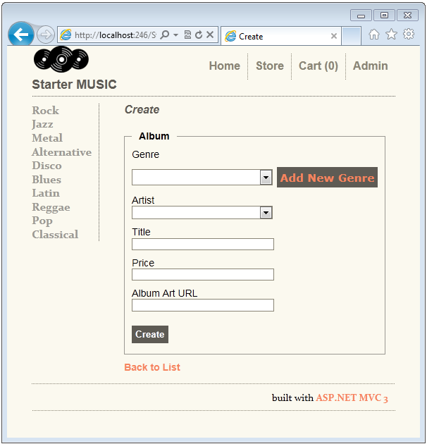
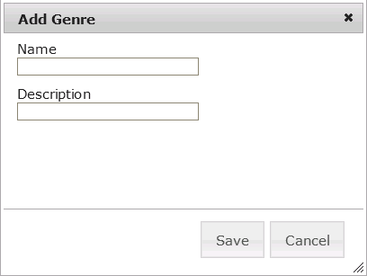
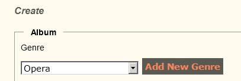
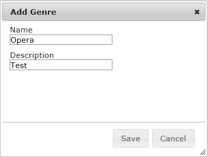
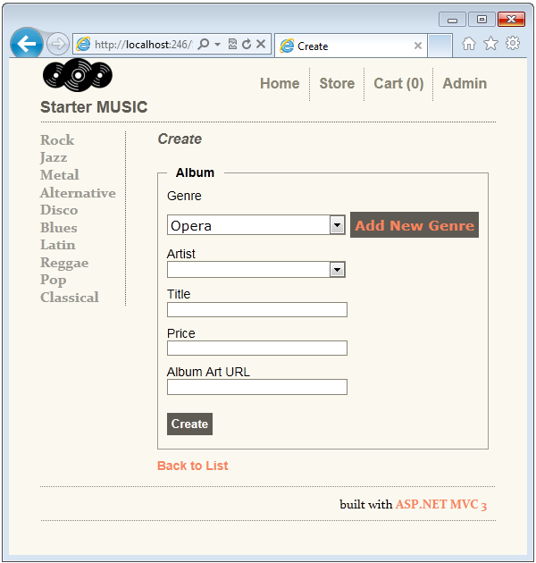
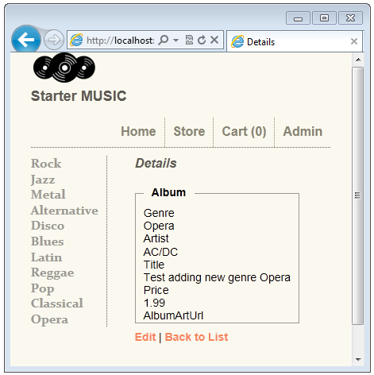
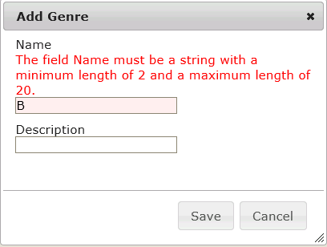
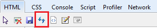
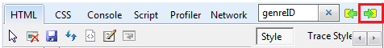
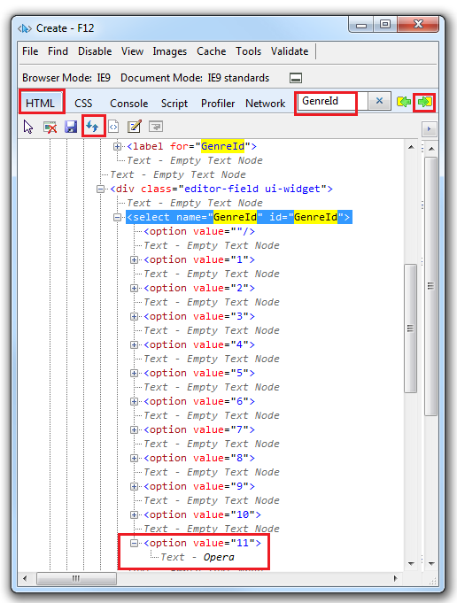

Adding a New Category to the DropDownList using jQuery UI
====================
by [Rick Anderson](https://github.com/Rick-Anderson)

The HTML `Select` tag is ideal for presenting a list of fixed category data, but often times you need to add a new category. Suppose we want to add the genre "Opera" to the categories in our database? In this section, we will use jQuery UI to add a dialog box we can use to add a new category. The image below shows how the UI will present in the browser.

When a user selects the **Add New Genre** link, a pop-up dialog box prompts the user for a new genre name (and optionally a description). The image below show the **Add Genre** pop-up dialog.

When a new genre name is entered and the **Save** button is pushed, the following happens:

1. An AJAX call posts the data to the Create method of the Genre Controller, which saves the new genre to the database and returns the new genre information (genre name and ID) as JSON.
2. JavaScript adds the new genre data to the select list.
3. JavaScript makes the new genre the selected item.

 In the image below, **Opera** was added to the database and selected in the **Genre** drop down list. 

Open the *Views\StoreManager\Create.cshtml* file and replace the genre markup with the following the following code:

[!code-cshtml[Main](adding-a-new-category-to-the-dropdownlist-using-jquery-ui/samples/sample1.cshtml)]

The `_ChooseGenre` partial view will contain all the logic to hook up the JavaScript and jQuery used to implement the add new genre feature. Once we have completed the code it will be simple to do the same with the artist UI.

In Solution Explorer, right click the *Views\StoreManager* folder and select **Add**, then **View**. In the **View name** input, enter `_ChooseGenre` then select **Add**. Replace the markup in the *Views\StoreManager\\_ChooseGenre.cshtml* file with the following:

[!code-cshtml[Main](adding-a-new-category-to-the-dropdownlist-using-jquery-ui/samples/sample2.cshtml)]

The first line declares that we are passing in an `Album` as our model, exactly the same model statement found in the Create view. The next few lines are the **Label** helper markup. The next line is the **DropDownList** helper call, exactly the same as in the original Create view. The next line adds a link with the name `Add New Genre`, and styles it like a button. The line containing `ValidationMessageFor` is copied directly from the Create view. The following lines:

[!code-html[Main](adding-a-new-category-to-the-dropdownlist-using-jquery-ui/samples/sample3.html)]

creates a hidden div, with the ID of `genreDialog`. We will use jQuery to hook up our **Add Genre** dialog box with the ID `genreDialog` in this div. The last two script tags contain links to the JavaScript files we will use to implement the add new genre feature. The */Scripts/chooseGenre.js* file is provided for you in the project, we will examine it later in the tutorial.

Run the application and click on the **Add New Genre** button. In the **Add Genre** dialog box, enter **Opera** in the **Name** input box.

Click the **Save** button. An AJAX call creates the Opera category and then populates the dropdown list with Opera, and sets Opera as the selected genre.

Enter an artist, title and price, then select the **Create** button. If you enter a price less than $8.99, the new album will appear at the top of the Index view. Verify the new album entry was saved in the database.

Try creating a new genre with only one letter. The following code in the *Models\Genre.cs* file sets the minimum and maximum length of the genre name.

[!code-csharp[Main](adding-a-new-category-to-the-dropdownlist-using-jquery-ui/samples/sample4.cs)]

Client side validation reports you must enter a string between 2 and 20 characters.

### Examining How a New Genre is Added to the Database and the Select List.

Open the *Scripts\chooseGenre.js* file and examine the code.

[!code-javascript[Main](adding-a-new-category-to-the-dropdownlist-using-jquery-ui/samples/sample5.js)]

The second line uses the ID `genreDialog` to create a dialog box on the div tag in the *Views\StoreManager\\_ChooseGenre.cshtml* file. Most of the named parameters are self explanatory. The `autoOpen` parameter is set to false, selecting the **Create Genre** button will open the dialogue explicitly (this is described latter on). The dialog has two buttons, **Save** and **Cancel**. The **Cancel** button closes the dialog. The following code shows the **Save** button function.

[!code-javascript[Main](adding-a-new-category-to-the-dropdownlist-using-jquery-ui/samples/sample6.js)]

The `var createGenreForm` is selected from the `createGenreForm` ID. The `createGenreForm` ID was set in the following code found in the *Views\Genre\\_CreateGenre.cshtml* file.

[!code-cshtml[Main](adding-a-new-category-to-the-dropdownlist-using-jquery-ui/samples/sample7.cshtml)]

The [Html.BeginForm](https://msdn.microsoft.com/en-us/library/dd492714.aspx) helper overload used in the *Views\Genre\\_CreateGenre.cshtml* file generates HTML with an action attribute containing the URL to submit the form. You can see this by displaying the create album page in a browser and selecting show source in the browser. The following markup shows the generated HTML containing the form tag.

[!code-html[Main](adding-a-new-category-to-the-dropdownlist-using-jquery-ui/samples/sample8.html)]

The jQuery `$.post` line makes an AJAX call to the action attribute (`/StoreManager/Create`) and passes in the data from the **Create Genre** dialog box. The data consists of the name for the new genre and an optional description. If the AJAX call is successful, the new genre name and value are added to the Select markup, and the new genre is set to the selected value. Because this is dynamically generated markup, you can't see the new select option by viewing the source in the browser. You can see the new HTML with the IE 9 F12 developer tools. To view the new select option, in Internet Explorer 9, hit the F12 key to start the F12 developer tools. Navigate to the Create page and add a new genre so the new genre is selected in the genre select list. In the F12 developer tools:

1. Select the HTML tab.
2. Hit the refresh icon.  
    
3. In the search box, enter GenreID.
4. Using the next icon,   
      
 navigate to the following select tag:

    [!code-html[Main](adding-a-new-category-to-the-dropdownlist-using-jquery-ui/samples/sample9.html)]
5. Expand the last option value.

The following code in the *Scripts\chooseGenre.js* file shows the how the **Add New Genre** button gets connected to the click event, and how the **Add New Genre** dialog box is created.

[!code-javascript[Main](adding-a-new-category-to-the-dropdownlist-using-jquery-ui/samples/sample10.js)]

The first line creates a click function attached to the **Add New Genre** button. The following markup from the Views\StoreManager\\_ChooseGenre.cshtml file shows how the **Add New Genre** button is created:

[!code-cshtml[Main](adding-a-new-category-to-the-dropdownlist-using-jquery-ui/samples/sample11.cshtml)]

The load method creates and opens the Add Genre dialog and calls the jQuery `parse` method so client validation occurs on data entered in the dialog.

In this section you have learned how to create a dialog that can be used to add new category data to a select list. You can follow the same procedure to create UI to add a new artist to the artist select list. This tutorial has given an overview of working with the ASP.NET MVC HTML helper **DropDownList**. For additional information on working with the **DropDownList**, see the addition references section below. Please let us know if this tutorial has been helpful.

Rick.Anderson[at]Microsoft.com

### Additional References

- [ASP.NET MVC–Cascading Dropdown Lists Tutorial](https://weblogs.asp.net/raduenuca/archive/2011/03/06/asp-net-mvc-cascading-dropdown-lists-tutorial-part-1-defining-the-problem-and-the-context.aspx) by [Radu Enuca](https://weblogs.asp.net/raduenuca/default.aspx)
- [Chosen](http://harvesthq.github.com/chosen/) A JavaScript plugin that support multi-select and filtering.

### Contributors

- [Radu Enuca](https://weblogs.asp.net/raduenuca/default.aspx)
- Jean-Sébastien Goupil
- [Brad Wilson](http://bradwilson.typepad.com/)

### Reviewers

- Jean-Sébastien Goupil
- [Brad Wilson](http://bradwilson.typepad.com/)
- Mike Pope
- Tom Dykstra

>[!div class="step-by-step"]
[Previous](examining-how-aspnet-mvc-scaffolds-the-dropdownlist-helper.md)