Examining  how  ASP.NET MVC scaffolds the DropDownList Helper
====================
by [Rick Anderson](https://github.com/Rick-Anderson)

In **Solution Explorer**, right-click the *Controllers* folder and then select **Add Controller**. Name the controller **StoreManagerController**. Set the options for the **Add Controller** dialog as shown in the image below.

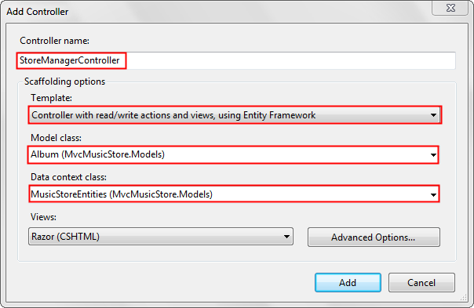

Edit the *StoreManager\Index.cshtml* view and remove `AlbumArtUrl`. Removing `AlbumArtUrl` will make the presentation more readable. The completed code is shown below.

[!code-cshtml[Main](examining-how-aspnet-mvc-scaffolds-the-dropdownlist-helper/samples/sample1.cshtml)]

Open the *Controllers\StoreManagerController.cs* file and find the `Index` method. Add the `OrderBy` clause so the albums will be sorted by price. The complete code is shown below.

[!code-csharp[Main](examining-how-aspnet-mvc-scaffolds-the-dropdownlist-helper/samples/sample2.cs)]

Sorting by price will make it easier to test changes to the database. When you are testing the edit and create methods, you can use a low price so the saved data will appear first.

Open the *StoreManager\Edit.cshtml* file. Add the following line just after the legend tag.

[!code-cshtml[Main](examining-how-aspnet-mvc-scaffolds-the-dropdownlist-helper/samples/sample3.cshtml)]

The following code shows the context of this change:

[!code-cshtml[Main](examining-how-aspnet-mvc-scaffolds-the-dropdownlist-helper/samples/sample4.cshtml)]

The `AlbumId` is required to make changes to an album record.

Press CTRL+F5 to run the application. Select to the **Admin** link, then select the **Create New** link to create a new album. Verify the album information was saved. Edit an album and verify the changes you made are persisted.

### The Album Schema

The `StoreManager` controller created by the MVC scaffolding mechanism allows CRUD (Create, Read, Update, Delete) access to the albums in the music store database. The schema for album information is shown below:

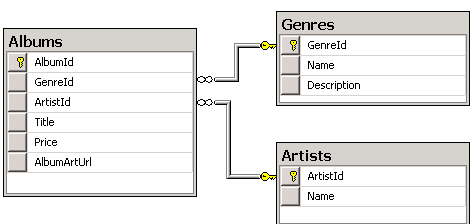

The `Albums` table does not store the album genre and description, it stores a foreign key to the `Genres` table. The `Genres` table contains the genre name and description. Likewise, the `Albums` table doesn't contain the album artists name, but a foreign key to the `Artists` table. The `Artists` table contains the artist's name. If you examine the data in the `Albums` table, you can see each row contains a foreign key to the `Genres` table and a foreign key to the `Artists` table. The image below show some table data from the `Albums` table.

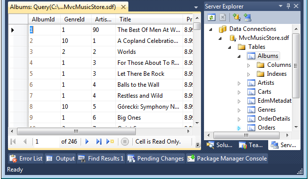

### The HTML Select Tag

The HTML `<select>` element (created by the HTML [DropDownList](https://msdn.microsoft.com/en-us/library/dd492948.aspx) helper) is used to display a complete list of values (such as the list of genres). For edit forms, when the current value is known, the select list can display the current value. We saw this previously when we set the selected value to **Comedy**. The select list is ideal for displaying category or foreign key data. The `<select>` element for the Genre foreign key displays the list of possible genre names, but when you save the form the Genre property is updated with the Genre foreign key value, not the displayed genre name. In the image below, the genre selected is **Disco** and the artist is **Donna Summer**.

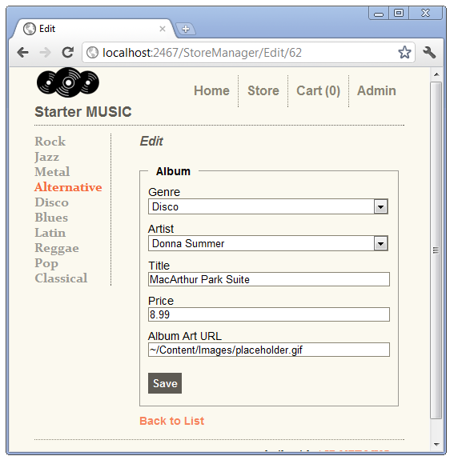

### Examining the ASP.NET MVC Scaffolded Code

Open the *Controllers\StoreManagerController.cs* file and find the `HTTP GET Create` method.

[!code-csharp[Main](examining-how-aspnet-mvc-scaffolds-the-dropdownlist-helper/samples/sample5.cs)]

The `Create` method adds two [SelectList](https://msdn.microsoft.com/en-us/library/system.web.mvc.selectlist.aspx) objects to the `ViewBag`, one to contain the genre information, and one to contain the artist information. The [SelectList](https://msdn.microsoft.com/en-us/library/dd505286.aspx) constructor overload used above takes three arguments:

[!code-csharp[Main](examining-how-aspnet-mvc-scaffolds-the-dropdownlist-helper/samples/sample6.cs)]

1. *items*: An [IEnumerable](https://msdn.microsoft.com/en-us/library/system.collections.ienumerable.aspx) containing the items in the list. In the example above, the list of genres returned by `db.Genres`.
2. *dataValueField*: The name of the property in the **IEnumerable** list that contains the key value. In the example above, `GenreId` and `ArtistId`.
3. *dataTextField*: The name of the property in the **IEnumerable** list that contains the information to display. In both the artists and genre table, the `name` field is used.

Open the *Views\StoreManager\Create.cshtml* file and examine the `Html.DropDownList` helper markup for the genre field.

[!code-cshtml[Main](examining-how-aspnet-mvc-scaffolds-the-dropdownlist-helper/samples/sample7.cshtml)]

The first line shows that the create view takes an `Album` model. In the `Create` method shown above, no model was passed, so the view gets a **null** `Album` model. At this point we are creating a new album so we don't have any `Album` data for it.

The [Html.DropDownList](https://msdn.microsoft.com/en-us/library/dd492948.aspx) overload shown above takes the name of the field to bind to the model. It also uses this name to look for a **ViewBag** object containing a [SelectList](https://msdn.microsoft.com/en-us/library/dd505286.aspx) object. Using this overload, you are required to name the **ViewBag SelectList** object `GenreId`. The second parameter (`String.Empty`) is the text to display when no item is selected. This is exactly what we want when creating a new album. If you removed the second parameter and used the following code:

[!code-cshtml[Main](examining-how-aspnet-mvc-scaffolds-the-dropdownlist-helper/samples/sample8.cshtml)]

The select list would default to the first element, or Rock in our sample.

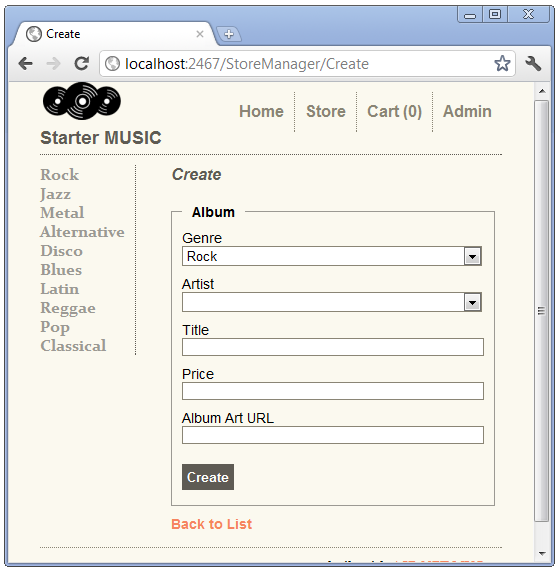

Examining the `HTTP POST Create` method.

[!code-csharp[Main](examining-how-aspnet-mvc-scaffolds-the-dropdownlist-helper/samples/sample9.cs)]

This overload of the `Create` method takes an `album` object, created by the ASP.NET MVC model binding system from the form values posted. When you submit a new album, if model state is valid and there are no database errors, the new album is added the database. The following image shows the creation of a new album.

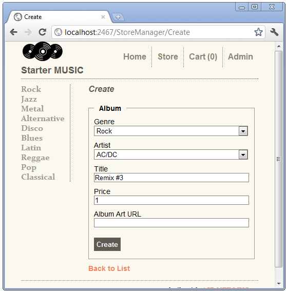

You can use the [fiddler tool](http://www.fiddler2.com/fiddler2/) to examine the posted form values that ASP.NET MVC model binding uses to create the album object.

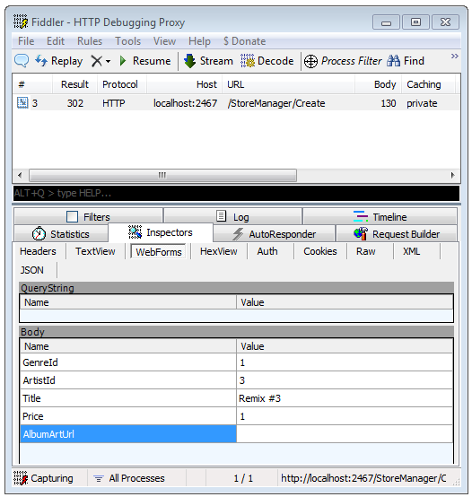.

### Refactoring the ViewBag SelectList Creation

Both the `Edit` methods and the `HTTP POST Create` method have identical code to set up the **SelectList** in the **ViewBag**. In the spirit of [DRY](http://en.wikipedia.org/wiki/Don't_repeat_yourself), we will refactor this code. We'll make use of this refactored code later.

Create a new method to add a genre and artist **SelectList** to the **ViewBag**.

[!code-csharp[Main](examining-how-aspnet-mvc-scaffolds-the-dropdownlist-helper/samples/sample10.cs)]

Replace the two lines setting the `ViewBag` in each of the `Create` and `Edit` methods with a call to the `SetGenreArtistViewBag` method. The completed code is shown below.

[!code-csharp[Main](examining-how-aspnet-mvc-scaffolds-the-dropdownlist-helper/samples/sample11.cs)]

Create a new album and edit an album to verify the changes work.

### Explicitly Passing the SelectList to the DropDownList

The create and edit views created by the ASP.NET MVC scaffolding use the following **DropDownList** overload:

[!code-csharp[Main](examining-how-aspnet-mvc-scaffolds-the-dropdownlist-helper/samples/sample12.cs)]

The `DropDownList` markup for the create view is shown below.

[!code-cshtml[Main](examining-how-aspnet-mvc-scaffolds-the-dropdownlist-helper/samples/sample13.cshtml)]

Because the `ViewBag` property for the `SelectList` is named `GenreId`, the **DropDownList** helper will use the `GenreId`**SelectList** in the **ViewBag**. In the following **DropDownList** overload, the `SelectList` is explicitly passed in.

[!code-csharp[Main](examining-how-aspnet-mvc-scaffolds-the-dropdownlist-helper/samples/sample14.cs)]

Open the *Views\StoreManager\Edit.cshtml* file, and change the **DropDownList** call to explicitly pass in the **SelectList**, using the overload above. Do this for the Genre category. The completed code is shown below:

[!code-cshtml[Main](examining-how-aspnet-mvc-scaffolds-the-dropdownlist-helper/samples/sample15.cshtml)]

Run the application and click the **Admin** link, then navigate to a Jazz album and select the **Edit** link.

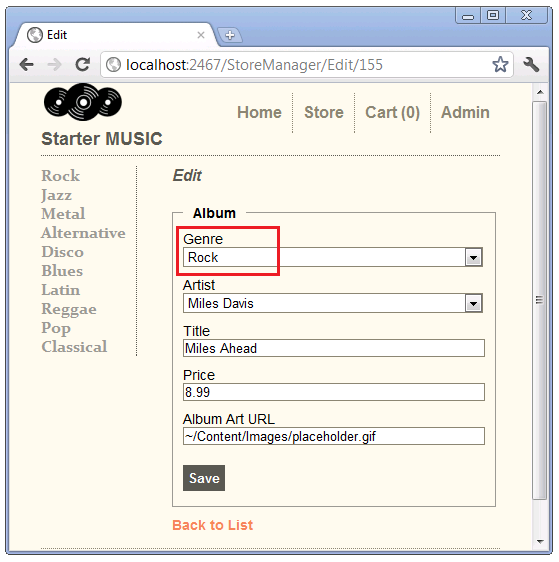

Instead of showing Jazz as the currently selected genre, Rock is displayed. When the string argument (the property to bind) and the **SelectList** object have the same name, the selected value is not used. When there is no selected value provided, browsers default to the first element in the **SelectList**(which is **Rock** in the example above). This is a known limitation of the **DropDownList** helper.

Open the *Controllers\StoreManagerController.cs* file and change the **SelectList** object names to `Genres` and `Artists`. The completed code is shown below:

[!code-csharp[Main](examining-how-aspnet-mvc-scaffolds-the-dropdownlist-helper/samples/sample16.cs)]

The names Genres and Artists are better names for the categories, as they contain more than just the ID of each category. The refactoring we did earlier paid off. Instead of changing the **ViewBag** in four methods, our changes were isolated to the `SetGenreArtistViewBag` method.

Change the **DropDownList** call in the create and edit views to use the new **SelectList** names. The new markup for the edit view is shown below:

[!code-cshtml[Main](examining-how-aspnet-mvc-scaffolds-the-dropdownlist-helper/samples/sample17.cshtml)]

The Create view requires an empty string to prevent the first item in the SelectList from being displayed.

[!code-cshtml[Main](examining-how-aspnet-mvc-scaffolds-the-dropdownlist-helper/samples/sample18.cshtml)]

Create a new album and edit an album to verify the changes work. Test the edit code by selecting an album with a genre other than Rock.

### Using a View Model with the DropDownList Helper

Create a new class in the ViewModels folder named `AlbumSelectListViewModel`. Replace the code in the `AlbumSelectListViewModel` class with the following:

[!code-csharp[Main](examining-how-aspnet-mvc-scaffolds-the-dropdownlist-helper/samples/sample19.cs)]

The `AlbumSelectListViewModel` constructor takes an album, a list of artists and genres and creates an object containing the album and a `SelectList` for genres and artists.

Build the project so the `AlbumSelectListViewModel` is available when we create a view in the next step.

Add an `EditVM` method to the `StoreManagerController`. The completed code is shown below.

[!code-csharp[Main](examining-how-aspnet-mvc-scaffolds-the-dropdownlist-helper/samples/sample20.cs)]

Right click `AlbumSelectListViewModel`, select **Resolve**, then **using MvcMusicStore.ViewModels;**.

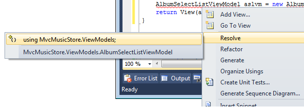

Alternatively, you can add the following using statement:

[!code-csharp[Main](examining-how-aspnet-mvc-scaffolds-the-dropdownlist-helper/samples/sample21.cs)]

Right click `EditVM` and select **Add View**. Use the options shown below.

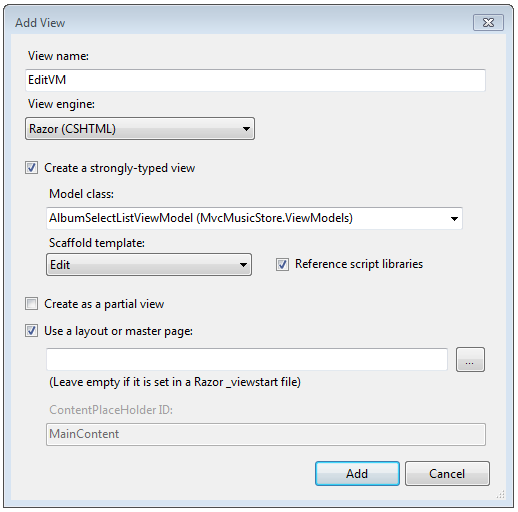

Select **Add**, then replace the contents of the *Views\StoreManager\EditVM.cshtml* file with the following:

[!code-cshtml[Main](examining-how-aspnet-mvc-scaffolds-the-dropdownlist-helper/samples/sample22.cshtml)]

The `EditVM` markup is very similar to the original `Edit` markup with the following exceptions.

- Model properties in the `Edit` view are of the form `model.property`(for example, `model.Title` ). Model properties in the `EditVm` view are of the form `model.Album.property`(for example, `model.Album.Title`). That's because the `EditVM` view is passed a container for an `Album`, not an `Album` as in the `Edit` view.
- The **DropDownList** second parameter comes from the view model, not the **ViewBag**.
- The **BeginForm** helper in the `EditVM` view explicitly posts back to the `Edit` action method. By posting back to the `Edit` action, we don't have to write an `HTTP POST EditVM` action and can reuse the `HTTP POST` `Edit` action.

Run the application and edit an album. Change the URL to use `EditVM`. Change a field and hit the **Save** button to verify the code is working.

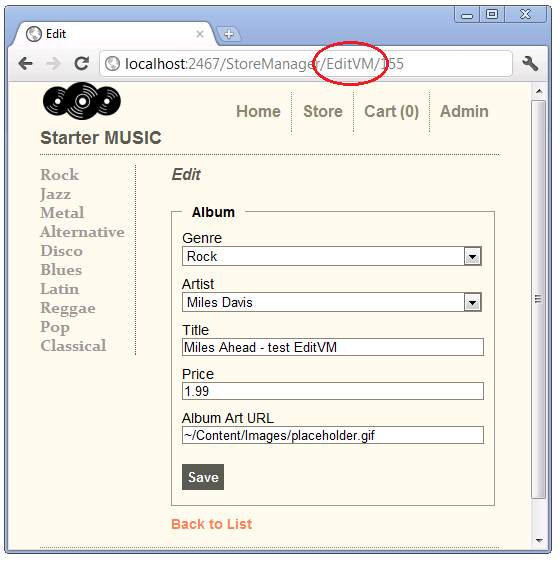

### Which Approach Should You Use?

All three approaches shown are acceptible. Many developers prefer to explictily pass the `SelectList` to the `DropDownList` using the `ViewBag`. This approach has the added advantage of giving you the flexibility of using a more appropriate name for the collection. The one caveat is you cannot name the `ViewBag SelectList` object the same name as the model property.

Some developers prefer the ViewModel approach. Others consider the the more verbose markup and generated HTML of the ViewModel approach a disadvantage.

In this section we have learned three approaches to using the **DropDownList** with category data. In the next section, we'll show how to add a new category.

>[!div class="step-by-step"]
[Previous](using-the-dropdownlist-helper-with-aspnet-mvc.md)
[Next](adding-a-new-category-to-the-dropdownlist-using-jquery-ui.md)