Using the DropDownList Helper with ASP.NET MVC
====================
by [Rick Anderson](https://github.com/Rick-Anderson)

This tutorial will teach you the basics of working with the [DropDownList](https://msdn.microsoft.com/en-us/library/dd492948.aspx) helper and the [ListBox](https://msdn.microsoft.com/en-us/library/system.web.mvc.html.selectextensions.listbox.aspx) helper in an ASP.NET MVC Web application. You can use Microsoft Visual Web Developer 2010 Express Service Pack 1, which is a free version of Microsoft Visual Studio to follow the tutorial. Before you start, make sure you've installed the prerequisites listed below. You can install all of them by clicking the following link: [Web Platform Installer](https://www.microsoft.com/web/gallery/install.aspx?appid=VWD2010SP1Pack). Alternatively, you can individually install the prerequisites using the following links:

- [Visual Studio Web Developer Express SP1 prerequisites](https://www.microsoft.com/web/gallery/install.aspx?appid=VWD2010SP1Pack) 
- [ASP.NET MVC 3 Tools Update](https://www.microsoft.com/web/gallery/install.aspx?appsxml=&amp;appid=MVC3)
- [SQL Server Compact 4.0](https://www.microsoft.com/web/gallery/install.aspx?appid=SQLCE;SQLCEVSTools_4_0)(runtime + tools support)

If you're using Visual Studio 2010 instead of Visual Web Developer 2010, install the prerequisites by clicking the following link: [Visual Studio 2010 prerequisites](https://www.microsoft.com/web/gallery/install.aspx?appsxml=&amp;appid=VS2010SP1Pack). This tutorial assumes you have completed the [Intro to ASP.NET MVC](../getting-started-with-aspnet-mvc3/cs/intro-to-aspnet-mvc-3.md) tutorial or the[ASP.NET MVC Music Store](../mvc-music-store/mvc-music-store-part-1.md) tutorial or you are familiar with ASP.NET MVC development. This tutorial starts with a modified project from the [ASP.NET MVC Music Store](../mvc-music-store/mvc-music-store-part-1.md) tutorial. You can download the starter project with the following link [Download the C# version](https://archive.msdn.microsoft.com/Project/Download/FileDownload.aspx?ProjectName=aspnetmvcsamples&amp;DownloadId=15829).

A Visual Web Developer project with the completed tutorial C# source code is available to accompany this topic. [Download](https://code.msdn.microsoft.com/Using-the-DropDownList-67f9367d).

### What You'll Build

You'll create action methods and views that use the [DropDownList](https://msdn.microsoft.com/en-us/library/system.web.mvc.html.selectextensions.dropdownlist.aspx) helper to select a category. You will also use **jQuery** to add an insert category dialog that can be used when a new category (such as genre or artist) is needed. Below is a screenshot of the Create view showing links to add a new genre and add a new artist.

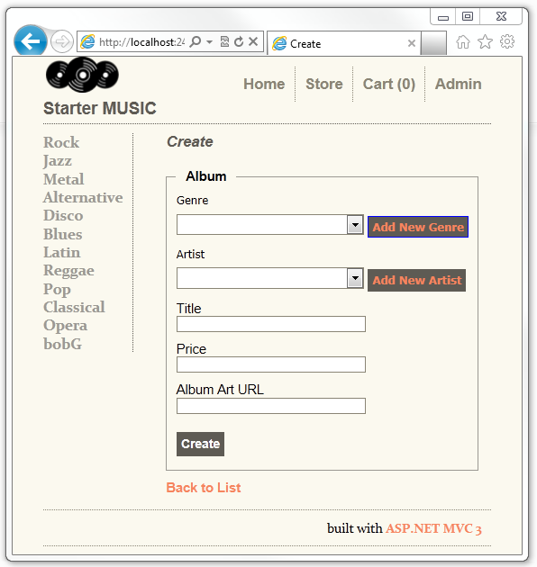

### Skills You'll Learn

Here's what you'll learn:

- How to use the [DropDownList](https://msdn.microsoft.com/en-us/library/system.web.mvc.html.selectextensions.dropdownlist.aspx) helper to select category data.
- How to add a **jQuery** dialog to add new categories.

### Getting Started

Start by downloading the starter project with the following link, [Download](https://archive.msdn.microsoft.com/Project/Download/FileDownload.aspx?ProjectName=aspnetmvcsamples&amp;DownloadId=15829). In Windows Explorer, right click on the *DDL\_Starter.zip* file and select properties. In the **DDL\_Starter.zip Properties** dialog box, select Unblock.

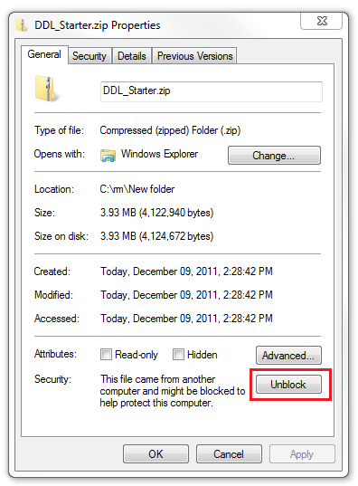

Right click the DDL\_Starter.zip file and select **Extract All** to unzip the file. Open the *StartMusicStore.sln* file with Visual Web Developer 2010 Express ("Visual Web Developer" or "VWD" for short) or Visual Studio 2010.

Press CTRL+F5 to run the application and click the **Test** link.

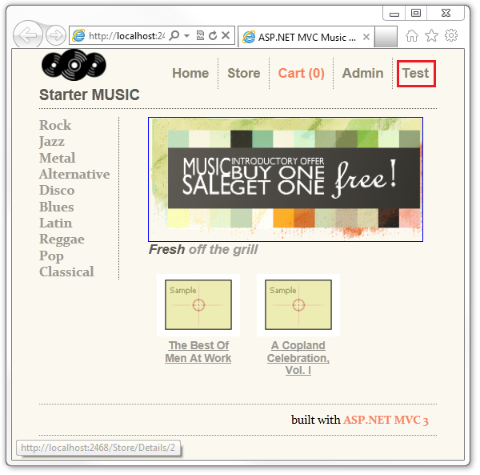

Select the **Select Movie Category (Simple)** link. A Movie Type Select list is displayed, with Comedy the selected value.

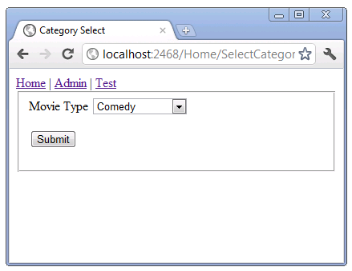

Right click in the browser and select view source. The HTML for the page is displayed. The code below shows the HTML for the select element.

[!code-html[Main](using-the-dropdownlist-helper-with-aspnet-mvc/samples/sample1.html)]

You can see that each item in the select list has a value (0 for Action, 1 for Drama, 2 for Comedy and 3 for Science Fiction) and a display name (Action, Drama, Comedy and Science Fiction). The code above is standard HTML for a select list.

Change the select list to Drama and hit the **Submit** button. The URL in the browser is `http://localhost:2468/Home/CategoryChosen?MovieType=1` and the page displays **You Selected: 1**.

Open the *Controllers\HomeController.cs* file and examine the `SelectCategory` method.

[!code-csharp[Main](using-the-dropdownlist-helper-with-aspnet-mvc/samples/sample2.cs)]

The [DropDownList](https://msdn.microsoft.com/en-us/library/dd492738.aspx) helper used to create an HTML select list requires a **IEnumerable&lt;SelectListItem &gt;**, either explicitly or implicitly. That is, you can pass the **IEnumerable&lt;SelectListItem &gt;** explicitly to the [DropDownList](https://msdn.microsoft.com/en-us/library/dd492738.aspx) helper or you can add the **IEnumerable&lt;SelectListItem &gt;** to the [ViewBag](https://blogs.msdn.com/b/rickandy/archive/2011/01/28/dynamic-v-strongly-typed-views.aspx) using the same name for the **SelectListItem** as the model property. Passing in the **SelectListItem** implicitly and explicitly is covered in the next part of the tutorial. The code above shows the simplest possible way to create an **IEnumerable&lt;SelectListItem &gt;** and populate it with text and values. Note the `Comedy`[SelectListItem](https://msdn.microsoft.com/en-us/library/system.web.mvc.selectlistitem.aspx) has the [Selected](https://msdn.microsoft.com/en-us/library/system.web.mvc.selectlistitem.selected.aspx) property set to **true;** this will cause the rendered select list to show **Comedy** as the selected item in the list.

The **IEnumerable&lt;SelectListItem &gt;** created above is added to the [ViewBag](https://blogs.msdn.com/b/rickandy/archive/2011/01/28/dynamic-v-strongly-typed-views.aspx) with the name MovieType. This is how we pass the **IEnumerable&lt;SelectListItem &gt;** implicitly to the [DropDownList](https://msdn.microsoft.com/en-us/library/dd492738.aspx) helper shown below.

Open the *Views\Home\SelectCategory.cshtml* file and examine the markup.

[!code-cshtml[Main](using-the-dropdownlist-helper-with-aspnet-mvc/samples/sample3.cshtml)]

On the third line, we set the layout to Views/Shared/\_Simple\_Layout.cshtml, which is a simplified version of the standard layout file. We do this to keep the display and rendered HTML simple.

In this sample we are not changing the state of the application, so we will submit the data using an **HTTP GET**, not **HTTP POST**. See the W3C section [Quick Checklist for Choosing HTTP GET or POST](http://www.w3.org/2001/tag/doc/whenToUseGet.html#checklist). Because we are not changing the application and posting the form, we use the [Html.BeginForm](https://msdn.microsoft.com/en-us/library/dd460344.aspx) overload that allows us to specify the action method, controller and form method (**HTTP POST** or **HTTP GET**). Typically views contain the [Html.BeginForm](https://msdn.microsoft.com/en-us/library/dd505244.aspx) overload that takes no parameters. The no parameter version defaults to posting the form data to the POST version of the same action method and controller.

The following line

[!code-cshtml[Main](using-the-dropdownlist-helper-with-aspnet-mvc/samples/sample4.cshtml)]

passes a string argument to the **DropDownList** helper. This string, "MovieType" in our example, does two things:

- It provides the key for the **DropDownList** helper to find a **IEnumerable&lt;SelectListItem &gt;** in the **ViewBag**.
- It is data-bound to the MovieType form element. If the submit method is **HTTP GET**, `MovieType` will be a query string. If the submit method is **HTTP POST**, `MovieType` will be added in the message body. The following image shows the query string with the value of 1.

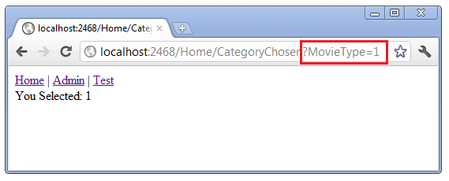

The following code shows the `CategoryChosen` method the form was submitted to.

[!code-csharp[Main](using-the-dropdownlist-helper-with-aspnet-mvc/samples/sample5.cs)]

Navigate back to the test page and select the **HTML SelectList** link. The HTML page renders a select element similar to the simple ASP.NET MVC test page. Right click the browser window and select **view source**. The HTML markup for the select list is essentially identical. Test the HTML page, it works like the ASP.NET MVC action method and view we previously tested.

### Improving the Movie Select List with Enums

If the categories in your application are fixed and will not change, you can take advantage of enums to make your code more robust and simpler to extend. When you add a new category, the correct category value is generated. The avoids copy and paste errors when you add a new category but forget to update the category value.

Open the *Controllers\HomeController.cs* file and examine the following code:

[!code-csharp[Main](using-the-dropdownlist-helper-with-aspnet-mvc/samples/sample6.cs)]

The [enum](https://msdn.microsoft.com/en-us/library/sbbt4032(VS.80).aspx) `eMovieCategories` captures the four movie types. The `SetViewBagMovieType` method creates the **IEnumerable&lt;SelectListItem &gt;** from the `eMovieCategories`**enum**, and sets the `Selected` property from the `selectedMovie` parameter. The `SelectCategoryEnum` action method uses the same view as the `SelectCategory` action method.

Navigate to the Test page and click on the `Select Movie Category (Enum)` link. This time, instead of a value (number) being displayed, a string representing the enum is displayed.

### Posting Enum Values

HTML Forms are typically used to post data to the server. The following code shows the `HTTP GET` and `HTTP POST` versions of the `SelectCategoryEnumPost` method.

[!code-csharp[Main](using-the-dropdownlist-helper-with-aspnet-mvc/samples/sample7.cs)]

By passing a `eMovieCategories` enum to the `POST` method, we can extract both the enum value and the enum string. Run the sample and navigate to the Test page. Click on the `Select Movie Category(Enum Post)` link. Select a movie type and then hit the submit button. The display shows both the value and the name of the movie type.

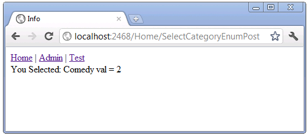

### Creating a Multiple Section Select Element

The [ListBox](https://msdn.microsoft.com/en-us/library/system.web.mvc.html.selectextensions.listbox.aspx) HTML helper renders the HTML `<select>` element with the `multiple` attribute, which allows the users to make multiple selections. Navigate to the Test link, then select the **Multi Select Country** link. The rendered UI allows you to select multiple countries. In the image below, Canada and China are selected.

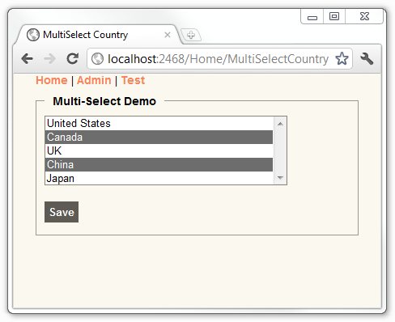

### Examining the MultiSelectCountry Code

Examine the following code from the *Controllers\HomeController.cs* file.

[!code-csharp[Main](using-the-dropdownlist-helper-with-aspnet-mvc/samples/sample8.cs)]

The `GetCountries` method creates a list of countries, then passes it to the `MultiSelectList` constructor. The `MultiSelectList` constructor overload used in the `GetCountries` method above takes four parameters:

[!code-csharp[Main](using-the-dropdownlist-helper-with-aspnet-mvc/samples/sample9.cs)]

1. *items*: An [IEnumerable](https://msdn.microsoft.com/en-us/library/system.collections.ienumerable.aspx) containing the items in the list. In the example above, the list of Countries.
2. *dataValueField*: The name of the property in the **IEnumerable** list that contains the value. In the example above, the `ID` property.
3. *dataTextField*: The name of the property in the **IEnumerable** list that contains the information to display. In the example above, the `name` property.
4. *selectedValues*: The list of selected values.

In the example above, the `MultiSelectCountry` method passes a `null` value for the selected countries, so no countries are selected when the UI is displayed. The following code shows the Razor markup used to render the `MultiSelectCountry` view.

[!code-cshtml[Main](using-the-dropdownlist-helper-with-aspnet-mvc/samples/sample10.cshtml)]

The HTML helper [ListBox](https://msdn.microsoft.com/en-us/library/dd470200.aspx) method used above take two parameters, the name of the property to model bind and the [MultiSelectList](https://msdn.microsoft.com/en-us/library/system.web.mvc.multiselectlist.aspx) containing the select options and values. The `ViewBag.YouSelected` code above is used to display the values of the countries you selected when you submit the form. Examine the HTTP POST overload of the `MultiSelectCountry` method.

[!code-csharp[Main](using-the-dropdownlist-helper-with-aspnet-mvc/samples/sample11.cs)]

The `ViewBag.YouSelected` dynamic property contains the selected countries, obtained for the `Countries` entry in the form collection. In this version the GetCountries method is passed a list of the selected countries, so when the `MultiSelectCountry` view is displayed, the selected countries are selected in the UI.

### Making a Select Element Friendly with the Harvest Chosen jQuery Plugin

The Harvest [Chosen](http://harvesthq.github.com/chosen/) jQuery plugin can be added to an HTML &lt;select&gt; element to create a user friendly UI. The images below demonstrate the Harvest [Chosen](http://harvesthq.github.com/chosen/) jQuery plugin with `MultiSelectCountry` view.

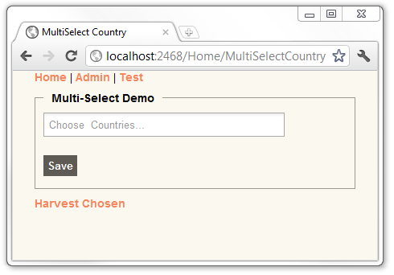

In the two images below, **Canada** is selected.

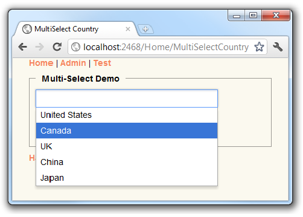

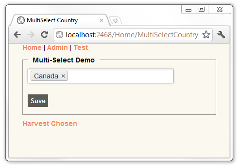

In the image above, Canada is selected, and it contains an **x** you can click to remove the selection. The image below shows Canada, China, and Japan selected.

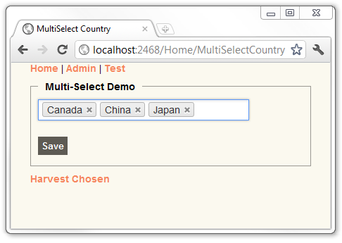

### Hooking up the Harvest Chosen jQuery Plugin

The following section is easier to follow if you have some experience with jQuery. If you have never used jQuery before, you might want to try one of the following jQuery tutorials.

- [How jQuery Works](http://docs.jquery.com/Tutorials:How_jQuery_Works) by [John Resig](http://ejohn.org/)
- [Getting Started with jQuery](http://docs.jquery.com/Tutorials:Getting_Started_with_jQuery) by [Jörn Zaefferer](http://bassistance.de/)
- [Live Examples of jQuery](http://codylindley.com/blogstuff/js/jquery/#) by [Cody Lindley](http://codylindley.com/)

The Chosen plugin is included in the starter and completed sample projects that accompany this tutorial. For this tutorial you will only need to use jQuery to hook it up to the UI. To use the Harvest Chosen jQuery plugin in an ASP.NET MVC project, you must:

1. Download Chosen plugin from [github](https://github.com/harvesthq/chosen/). This step has been done for you.
2. Add the Chosen folder to your ASP.NET MVC project. Add the assets from the Chosen plugin you downloaded in the previous step to the Chosen folder. This step has been done for you.
3. Hook up the chosen plugin to the **DropDownList** or **ListBox** HTML helper.

### Hooking up the Chosen Plugin to the MultiSelectCountry View.

Open the *Views\Home\MultiSelectCountry.cshtml* file and add an `htmlAttributes` parameter to the `Html.ListBox`. The parameter you will add contains a class name for the select list(`@class = "chzn-select"`). The completed code is shown below:

[!code-cshtml[Main](using-the-dropdownlist-helper-with-aspnet-mvc/samples/sample12.cshtml)]

In the code above, we are adding the HTML attribute and attribute value `class = "chzn-select"`. The @ character preceding class has nothing to do with the Razor view engine. `class` is a [C# keyword](https://msdn.microsoft.com/en-us/library/x53a06bb.aspx). C# keywords cannot be used as identifiers unless they include @ as a prefix. In the example above, `@class` is a valid identifier but **class** is not because **class** is a keyword.

Add references to the *Chosen/chosen.jquery.js* and *Chosen/chosen.css* files. The *Chosen/chosen.jquery.js* and implements the functionally of the Chosen plugin. The *Chosen/chosen.css* file provides the styling. Add these references to the bottom of the *Views\Home\MultiSelectCountry.cshtml* file. The following code shows how to reference the Chosen plugin.

[!code-cshtml[Main](using-the-dropdownlist-helper-with-aspnet-mvc/samples/sample13.cshtml)]

Activate the Chosen plugin using the class name used in the **Html.ListBox** code. In the example above, the class name is `chzn-select`. Add the following line to the bottom of the *Views\Home\MultiSelectCountry.cshtml* view file. This line activates the Chosen plugin.

[!code-html[Main](using-the-dropdownlist-helper-with-aspnet-mvc/samples/sample14.html)]

The following line is the syntax to call the jQuery ready function, which selects the DOM element with class name `chzn-select`.

[!code-powershell[Main](using-the-dropdownlist-helper-with-aspnet-mvc/samples/sample15.ps1)]

The wrapped set returned from the above call then applies the chosen method (`.chosen();`), which hooks up the Chosen plugin.

The following code shows the completed *Views\Home\MultiSelectCountry.cshtml* view file.

[!code-cshtml[Main](using-the-dropdownlist-helper-with-aspnet-mvc/samples/sample16.cshtml)]

Run the application and navigate to the `MultiSelectCountry` view. Try adding and deleting countries. The sample download provided also contains a `MultiCountryVM` method and view that implements the MultiSelectCountry functionality using a view model instead of a **ViewBag**.

In the next section you'll see how the ASP.NET MVC scaffolding mechanism works with the **DropDownList** helper.

>[!div class="step-by-step"]
[Next](examining-how-aspnet-mvc-scaffolds-the-dropdownlist-helper.md)