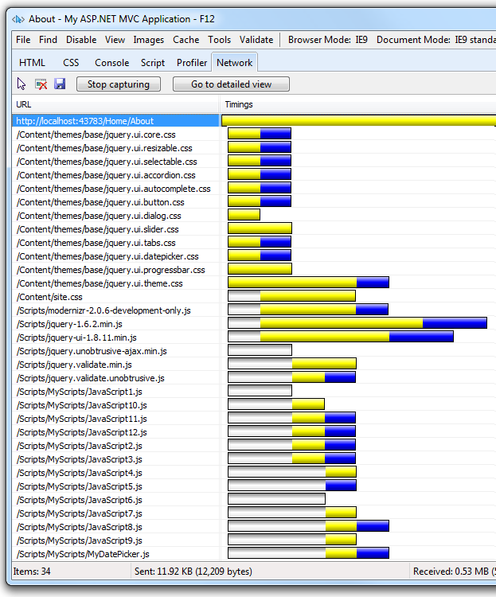
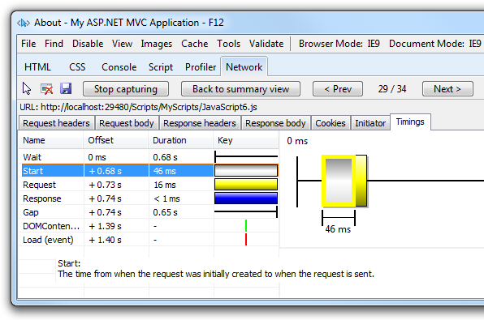
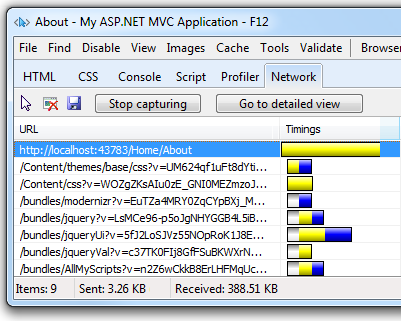
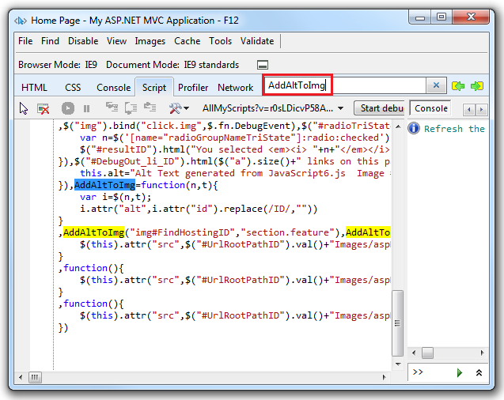
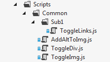
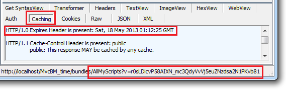
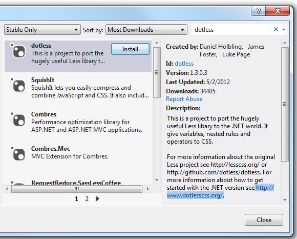

Bundling and Minification
====================
by [Rick Anderson](https://github.com/Rick-Anderson)

> Bundling and minification are two techniques you can use in ASP.NET 4.5 to improve request load time. Bundling and minification improves load time by reducing the number of requests to the server and reducing the size of requested assets (such as CSS and JavaScript.)

Most of the current major browsers limit the number of [simultaneous connections](http://www.browserscope.org/?category=network) per each hostname to six. That means that while six requests are being processed, additional requests for assets on a host will be queued by the browser. In the image below, the IE F12 developer tools network tabs shows the timing for assets required by the About view of a sample application.

The gray bars show the time the request is queued by the browser waiting on the six connection limit. The yellow bar is the request time to first byte, that is, the time taken to send the request and receive the first response from the server. The blue bars show the time taken to receive the response data from the server. You can double-click on an asset to get detailed timing information. For example, the following image shows the timing details for loading the */Scripts/MyScripts/JavaScript6.js* file.

The preceding image shows the **Start** event, which gives the time the request was queued because of the browser limit the number of simultaneous connections. In this case, the request was queued for 46 milliseconds waiting for another request to complete.

## Bundling

Bundling is a new feature in ASP.NET 4.5 that makes it easy to combine or bundle multiple files into a single file. You can create CSS, JavaScript and other bundles. Fewer files means fewer HTTP requests and that can improve first page load performance.

The following image shows the same timing view of the About view shown previously, but this time with bundling and minification enabled.

## Minification

Minification performs a variety of different code optimizations to scripts or css, such as removing unnecessary white space and comments and shortening variable names to one character. Consider the following JavaScript function.

[!code-javascript[Main](bundling-and-minification/samples/sample1.js)]

After minification, the function is reduced to the following:

[!code-javascript[Main](bundling-and-minification/samples/sample2.js)]

In addition to removing the comments and unnecessary whitespace, the following parameters and variable names were renamed (shortened) as follows:

| **Original** | **Renamed** |
| --- | --- |
| imageTagAndImageID | n |
| imageContext | t |
| imageElement | i |

## Impact of Bundling and Minification

The following table shows several important differences between listing all the assets individually and using bundling and minification (B/M) in the sample program.

|  | **Using B/M** | **Without B/M** | **Change** |
| --- | --- | --- | --- |
| **File Requests** | 9 | 34 | 256% |
| **KB Sent** | 3.26 | 11.92 | 266% |
| **KB Received** | 388.51 | 530 | 36% |
| **Load Time** | 510 MS | 780 MS | 53% |

The bytes sent had a significant reduction with bundling as browsers are fairly verbose with the HTTP headers they apply on requests. The received bytes reduction is not as large because the largest files (*Scripts\jquery-ui-1.8.11.min.js* and *Scripts\jquery-1.7.1.min.js*) are already minified. Note: The timings on the sample program used the [Fiddler](http://www.fiddler2.com/fiddler2/) tool to simulate a slow network. (From the Fiddler **Rules** menu, select **Performance** then **Simulate Modem Speeds**.)

## Debugging Bundled and Minified JavaScript

It's easy to debug your JavaScript in a development environment (where the [compilation Element](https://msdn.microsoft.com/en-us/library/s10awwz0.aspx) in the *Web.config* file is set to `debug="true"` ) because the JavaScript files are not bundled or minified. You can also debug a release build where your JavaScript files are bundled and minified. Using the IE F12 developer tools, you debug a JavaScript function included in a minified bundle using the following approach:

1. Select the **Script** tab and then select the **Start debugging** button.
2. Select the bundle containing the JavaScript function you want to debug using the assets button.  
    
3. Format the minified JavaScript by selecting the **Configuration button** , and then selecting **Format JavaScript**.
4. In the **Search Scrip** t input box, select the name of the function you want to debug. In the following image, **AddAltToImg** was entered in the **Search Scrip** t input box.  
    

For more information on debugging with the F12 developer tools, see the MSDN article [Using the F12 Developer Tools to Debug JavaScript Errors](https://msdn.microsoft.com/en-us/library/ie/gg699336(v=vs.85).aspx).

## Controlling Bundling and Minification

Bundling and minification is enabled or disabled by setting the value of the debug attribute in the [compilation Element](https://msdn.microsoft.com/en-us/library/s10awwz0.aspx)  in the *Web.config* file. In the following XML, `debug` is set to true so bundling and minification is disabled.

[!code-xml[Main](bundling-and-minification/samples/sample3.xml?highlight=2)]

To enable bundling and minification, set the `debug` value to "false". You can override the *Web.config* setting with the `EnableOptimizations` property on the `BundleTable` class. The following code enables bundling and minification and overrides any setting in the *Web.config* file.

[!code-csharp[Main](bundling-and-minification/samples/sample4.cs?highlight=7)]

> [!NOTE]
> Unless `EnableOptimizations` is `true` or the debug attribute in the [compilation Element](https://msdn.microsoft.com/en-us/library/s10awwz0.aspx)  in the *Web.config* file is set to `false`, files will not be bundled or minified. Additionally, the .min version of files will not be used, the full debug versions will be selected. `EnableOptimizations` overrides the debug attribute in the [compilation Element](https://msdn.microsoft.com/en-us/library/s10awwz0.aspx)  in the *Web.config* file

## Using Bundling and Minification with ASP.NET Web Forms and Web Pages

- For Web Pages, see the blog entry [Adding Web Optimization to a Web Pages Site](https://blogs.msdn.com/b/rickandy/archive/2012/08/15/adding-web-optimization-to-a-web-pages-site.aspx).
- For Web Forms, see the blog entry [Adding Bundling and Minification to Web Forms](https://blogs.msdn.com/b/rickandy/archive/2012/08/14/adding-bundling-and-minification-to-web-forms.aspx).

## Using Bundling and Minification with ASP.NET MVC

In this section we will create an ASP.NET MVC project to examine bundling and minification. First, create a new ASP.NET MVC internet project named **MvcBM** without changing any of the defaults.

Open the *App\_Start\BundleConfig.cs* file and examine the `RegisterBundles` method which is used to create, register and configure bundles. The following code shows a portion of the `RegisterBundles` method.

[!code-csharp[Main](bundling-and-minification/samples/sample5.cs)]

The  preceding code creates a new JavaScript bundle named *~/bundles/jquery* that includes all the appropriate (that is debug or minified but not .*vsdoc*) files in the *Scripts* folder that match the wild card string "~/Scripts/jquery-{version}.js". For ASP.NET MVC 4, this means with a debug configuration, the file *jquery-1.7.1.js* will be added to the bundle. In a release configuration, *jquery-1.7.1.min.js* will be added. The bundling framework follows several common conventions such as:

- Selecting ".min" file for release when "FileX.min.js" and "FileX.js" exist.
- Selecting the non ".min" version for debug.
- Ignoring "-vsdoc" files (such as jquery-1.7.1-vsdoc.js), which are used only by IntelliSense.

The `{version}` wild card matching shown above is used to automatically create a jQuery bundle with the appropriate version of jQuery in your *Scripts* folder. In this example, using a wild card provides the following benefits:

- Allows you to use NuGet to update to a newer jQuery version without changing the preceding bundling code or jQuery references in your view pages.
- Automatically selects the full version for debug configurations and the ".min" version for release builds.

## Using a CDN

 The follow code replaces the local jQuery bundle with a CDN jQuery bundle.

[!code-csharp[Main](bundling-and-minification/samples/sample6.cs)]

In the code above, jQuery will be requested from the CDN while in release mode and the debug version of jQuery will be fetched locally in debug mode. When using a CDN, you should have a fallback mechanism in case the CDN request fails. The following markup fragment from the end of the layout file shows script added to request jQuery should the CDN fail.

[!code-cshtml[Main](bundling-and-minification/samples/sample7.cshtml?highlight=5-13)]

## Creating a Bundle

The [Bundle](https://msdn.microsoft.com/en-us/library/system.web.optimization.bundle(v=VS.110).aspx) class `Include` method takes an array of strings, where each string is a virtual path to resource. The following code from the RegisterBundles method in the *App\_Start\BundleConfig.cs* file shows how multiple files are added to a bundle:

[!code-csharp[Main](bundling-and-minification/samples/sample8.cs)]

The [Bundle](https://msdn.microsoft.com/en-us/library/system.web.optimization.bundle(v=VS.110).aspx) class `IncludeDirectory` method is provided to add all the files in a directory (and optionally all subdirectories) which match a search pattern. The [Bundle](https://msdn.microsoft.com/en-us/library/system.web.optimization.bundle(v=VS.110).aspx) class `IncludeDirectory` API is shown below:

[!code-csharp[Main](bundling-and-minification/samples/sample9.cs)]

Bundles are referenced in views using the Render method, ( `Styles.Render` for CSS and `Scripts.Render` for JavaScript). The following markup from the *Views\Shared\\_Layout.cshtml* file shows how the default ASP.NET internet project views reference CSS and JavaScript bundles.

[!code-cshtml[Main](bundling-and-minification/samples/sample10.cshtml?highlight=5-6,11)]

Notice the Render methods takes an array of strings, so you can add multiple bundles in one line of code. You will generally want to use the Render methods which create the necessary HTML to reference the asset. You can use the `Url` method to generate the URL to the asset without the markup needed to reference the asset. Suppose you wanted to use the new HTML5 [async](http://www.whatwg.org/specs/web-apps/current-work/#attr-script-async) attribute. The following code shows how to reference modernizr using the `Url` method.

[!code-cshtml[Main](bundling-and-minification/samples/sample11.cshtml?highlight=11)]

## Using the "\*" Wildcard Character to Select Files

The virtual path specified in the `Include` method and the search pattern in the `IncludeDirectory` method can accept one "\*" wildcard character as a prefix or suffix to in the last path segment. The search string is case insensitive. The `IncludeDirectory` method has the option of searching subdirectories.

Consider a project with the following JavaScript files:

- *Scripts\Common\AddAltToImg.js*
- *Scripts\Common\ToggleDiv.js*
- *Scripts\Common\ToggleImg.js*
- *Scripts\Common\Sub1\ToggleLinks.js*

The following table shows the files added to a bundle using the wildcard as shown:

| **Call** | **Files Added or Exception Raised** |
| --- | --- |
| Include("~/Scripts/Common/\*.js") | *AddAltToImg.js, ToggleDiv.js, ToggleImg.js* |
| Include("~/Scripts/Common/T\*.js") | Invalid pattern exception. The wildcard character is only allowed on the prefix or suffix. |
| Include("~/Scripts/Common/\*og.\*") | Invalid pattern exception. Only one wildcard character is allowed. |
| "Include("~/Scripts/Common/T\*") | *ToggleDiv.js, ToggleImg.js* |
| "Include("~/Scripts/Common/\*") | Invalid pattern exception. A pure wildcard segment is not valid. |
| IncludeDirectory("~/Scripts/Common", "T\*") | *ToggleDiv.js, ToggleImg.js* |
| IncludeDirectory("~/Scripts/Common", "T\*",true) | *ToggleDiv.js, ToggleImg.js, ToggleLinks.js* |

Explicitly adding each file to a bundle is generally the preferred over wildcard loading of files for the following reasons:

- Adding scripts by wildcard defaults to loading them in alphabetical order, which is typically not what you want. CSS and JavaScript files frequently need to be added in a specific (non-alphabetic) order. You can mitigate this risk by adding a custom [IBundleOrderer](https://msdn.microsoft.com/en-us/library/system.web.optimization.ibundleorderer(VS.110).aspx) implementation, but explicitly adding each file is less error prone. For example, you might add new assets to a folder in the future which might require you to modify your [IBundleOrderer](https://msdn.microsoft.com/en-us/library/system.web.optimization.ibundleorderer(VS.110).aspx) implementation.
- View specific files added to a directory using wild card loading can be included in all views referencing that bundle. If the view specific script is added to a bundle, you may get a JavaScript error on other views that reference the bundle.
- CSS files that import other files result in the imported files loaded twice. For example, the following code creates a bundle with most of the jQuery UI theme CSS files loaded twice. 

    [!code-csharp[Main](bundling-and-minification/samples/sample12.cs)]

 The wild card selector "\*.css" brings in each CSS file in the folder, including the *Content\themes\base\jquery.ui.all.css* file. The *jquery.ui.all.css* file imports other CSS files.

## Bundle Caching

Bundles set the HTTP Expires Header one year from when the bundle is created. If you navigate to a previously viewed page, Fiddler shows IE does not make a conditional request for the bundle, that is, there are no HTTP GET requests from IE for the bundles and no HTTP 304 responses from the server. You can force IE to make a conditional request for each bundle with the F5 key (resulting in a HTTP 304 response for each bundle). You can force a full refresh by using ^F5 (resulting in a HTTP 200 response for each bundle.)

The following image shows the **Caching** tab of the Fiddler response pane:

The request   
`http://localhost/MvcBM_time/bundles/AllMyScripts?v=r0sLDicvP58AIXN_mc3QdyVvVj5euZNzdsa2N1PKvb81`  
 is for the bundle **AllMyScripts** and contains a query string pair **v=r0sLDicvP58AIXN\_mc3QdyVvVj5euZNzdsa2N1PKvb81**. The query string **v** has a value token that is a unique identifier used for caching. As long as the bundle doesn't change, the ASP.NET application will request the **AllMyScripts** bundle using this token. If any file in the bundle changes, the ASP.NET optimization framework will generate a new token, guaranteeing that browser requests for the bundle will get the latest bundle.

If you run the IE9 F12 developer tools and navigate to a previously loaded page, IE incorrectly shows conditional GET requests made to each bundle and the server returning HTTP 304. You can read why IE9 has problems determining if a conditional request was made in the blog entry [Using CDNs and Expires to Improve Web Site Performance](https://blogs.msdn.com/b/rickandy/archive/2011/05/21/using-cdns-to-improve-web-site-performance.aspx).

## LESS, CoffeeScript, SCSS, Sass Bundling.

The bundling and minification framework provides a mechanism to process intermediate languages such as [SCSS](http://sass-lang.com/), [Sass](http://sass-lang.com/), [LESS](http://www.dotlesscss.org/) or [Coffeescript](http://coffeescript.org/), and apply transforms such as minification to the resulting bundle. For example, to add [.less](http://www.dotlesscss.org/) files to your MVC 4 project:

1. Create a folder for your LESS content. The following example uses the *Content\MyLess* folder.
2. Add the [.less](http://www.dotlesscss.org/) NuGet package **dotless** to your project.  
    
3. Add a class that implements the [IBundleTransform](https://msdn.microsoft.com/en-us/library/system.web.optimization.ibundletransform(VS.110).aspx) interface. For the .less transform, add the following code to your project.

    [!code-csharp[Main](bundling-and-minification/samples/sample13.cs)]
4. Create a bundle of LESS files with the `LessTransform` and the [CssMinify](https://msdn.microsoft.com/en-us/library/system.web.optimization.cssminify(VS.110).aspx) transform. Add the following code to the `RegisterBundles` method in the *App\_Start\BundleConfig.cs* file.

    [!code-csharp[Main](bundling-and-minification/samples/sample14.cs)]
5. Add the following code to any views which references the LESS bundle.

    [!code-cshtml[Main](bundling-and-minification/samples/sample15.cshtml)]

## Bundle Considerations

A good convention to follow when creating bundles is to include "bundle" as a prefix in the bundle name. This will prevent a possible [routing conflict](https://forums.asp.net/post/5012037.aspx).

Once you update one file in a bundle, a new token is generated for the bundle query string parameter and the full bundle must be downloaded the next time a client requests a page containing the bundle. In traditional markup where each asset is listed individually, only the changed file would be downloaded. Assets that change frequently may not be good candidates for bundling.

Bundling and minification primarily improve the first page request load time. Once a webpage has been requested, the browser caches the assets (JavaScript, CSS and images) so bundling and minification won't provide any performance boost when requesting the same page, or pages on the same site requesting the same assets. If you don't set the expires header correctly on your assets, and you don't use bundling and minification, the browsers freshness heuristics will mark the assets stale after a few days and the browser will require a validation request for each asset. In this case, bundling and minification provide a performance increase after the first page request. For details, see the blog [Using CDNs and Expires to Improve Web Site Performance](https://blogs.msdn.com/b/rickandy/archive/2011/05/21/using-cdns-to-improve-web-site-performance.aspx).

The browser limitation of six simultaneous connections per each hostname can be mitigated by using a [CDN](https://blogs.msdn.com/b/rickandy/archive/2011/05/21/using-cdns-to-improve-web-site-performance.aspx). Because the CDN will have a different hostname than your hosting site, asset requests from the CDN will not count against the six simultaneous connections limit to your hosting environment. A CDN can also provide common package caching and edge caching advantages.

Bundles should be partitioned by pages that need them. For example, the default ASP.NET MVC template for an internet application creates a jQuery Validation bundle separate from jQuery. Because the default views created have no input and do not post values, they don't include the validation bundle.

The `System.Web.Optimization` namespace is implemented in System.Web.Optimization.DLL. It leverages the WebGrease library (WebGrease.dll) for minification capabilities, which in turn uses Antlr3.Runtime.dll.

*I use Twitter to make quick posts and share links. My Twitter handle is*: [@RickAndMSFT](http://twitter.com/RickAndMSFT)

## Additional Resources

- Video:[Bundling and Optimizing](https://channel9.msdn.com/Events/aspConf/aspConf/Bundling-and-Optimizing) by [Howard Dierking](https://twitter.com/#!/howard_dierking)
- [Adding Web Optimization to a Web Pages Site](https://blogs.msdn.com/b/rickandy/archive/2012/08/15/adding-web-optimization-to-a-web-pages-site.aspx).
- [Adding Bundling and Minification to Web Forms](https://blogs.msdn.com/b/rickandy/archive/2012/08/14/adding-bundling-and-minification-to-web-forms.aspx).
- [Performance Implications of Bundling and Minification on Web Browsing](https://blogs.msdn.com/b/henrikn/archive/2012/06/17/performance-implications-of-bundling-and-minification-on-http.aspx) by [Henrik F Nielsen](http://en.wikipedia.org/wiki/Henrik_Frystyk_Nielsen) [@frystyk](https://twitter.com/frystyk)
- [Using CDNs and Expires to Improve Web Site Performance](https://blogs.msdn.com/b/rickandy/archive/2011/05/21/using-cdns-to-improve-web-site-performance.aspx) by Rick Anderson [@RickAndMSFT](https://twitter.com/#!/RickAndMSFT)
- [Minimize RTT (round-trip times)](https://developers.google.com/speed/docs/best-practices/rtt)

## Contributors

- Hao Kung
- [Howard Dierking](https://twitter.com/#!/howard_dierking)
- Diana LaRose