Profile and debug your ASP.NET MVC app with Glimpse
====================
by [Rick Anderson](https://github.com/Rick-Anderson)

> Glimpse is a thriving and growing family of open source NuGet packages that provides detailed performance, debugging and diagnostic information for ASP.NET apps. It's trivial to install, lightweight, ultra-fast, and displays key performance metrics at the bottom of every page. It allows you to drill down into your app when you need to find out what's going on at the server. Glimpse provides so much valuable information we recommend you use it throughout your development cycle, including your Azure test environment. While [Fiddler](http://www.telerik.com/fiddler) and the [F-12 development tools](https://msdn.microsoft.com/en-us/library/ie/gg589512(v=vs.85).aspx) provide a client side view, Glimpse provides a detailed view from the server. This tutorial will focus on using the Glimpse ASP.NET MVC and EF packages, but many other packages are available. Where possible I will link to the appropriate [Glimpse docs](http://getglimpse.com/Docs/) which I help maintain. Glimpse is an open source project, you too can contribute to the source code and the docs.

- [Installing Glimpse](#ig)
- [Enable Glimpse for localhost](#eg)
- [The Timeline tab](#Time)
- [Model Binding](#mb)
- [Routes](#route)
- [Using Glimpse on Azure](#da)
- [Additional Resources](#addRes)

## Installing Glimpse

You can install Glimpse from the NuGet package manager console or from the **Manage NuGet Packages** console. For this demo, I'll install the Mvc5 and EF6 packages:

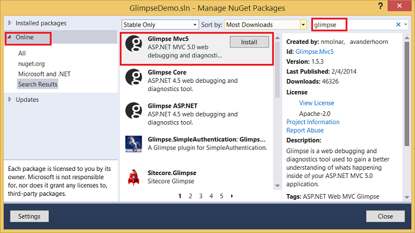

Search for *Glimpse.EF*

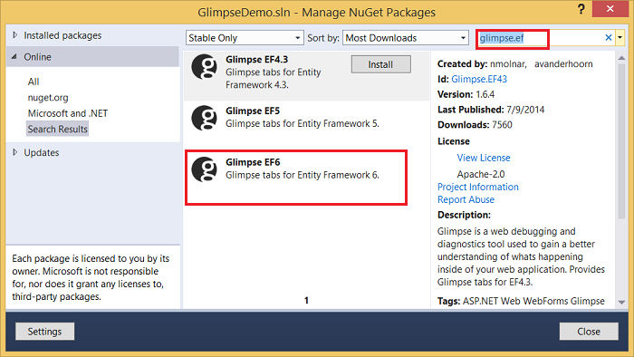

By selecting **Installed packages**, you can see the Glimpse dependent modules installed:

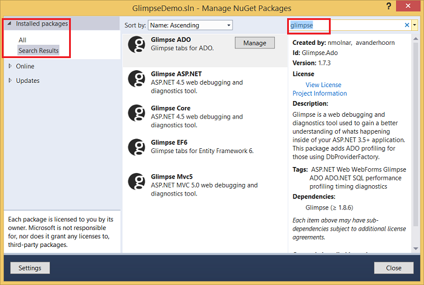

The following commands install Glimpse MVC5 and EF6 modules from the package manager console:

[!code-console[Main](profile-and-debug-your-aspnet-mvc-app-with-glimpse/samples/sample1.cmd)]

## Enable Glimpse for localhost

Navigate to http://localhost:&lt;port #&gt;/glimpse.axd and click the **Turn Glimpse On** button.

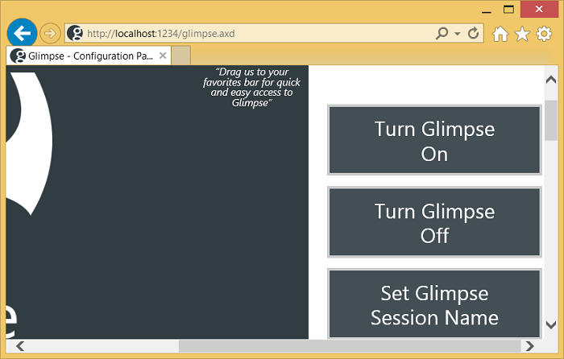

If you have your favorites bar displayed, you can drag and drop the Glimpse buttons and add them as bookmarklets:

You can now navigate your app, and the **Heads Up Display** (HUD) is shown at the bottom of the page.

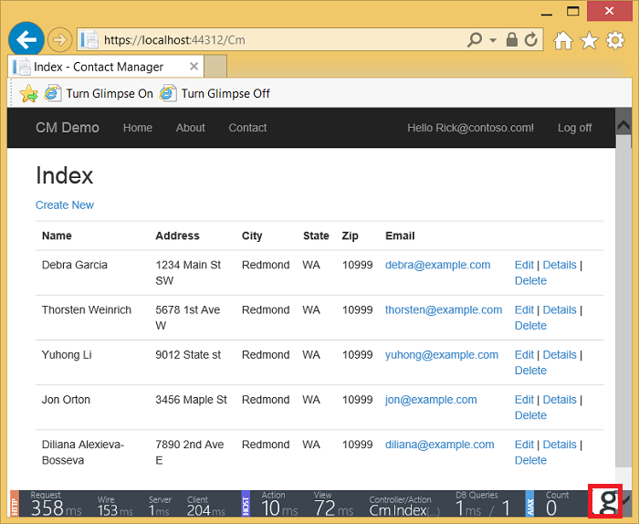

The [Glimpse HUD page](http://getglimpse.com/Docs/Heads-up-Display) details the timing information shown above. The unobtrusive performance data the HUD displays can notify you of a problem immediately - before you get to the test cycle. Clicking on the &quot;g&quot; in the lower right corner brings up the Glimpse panel:

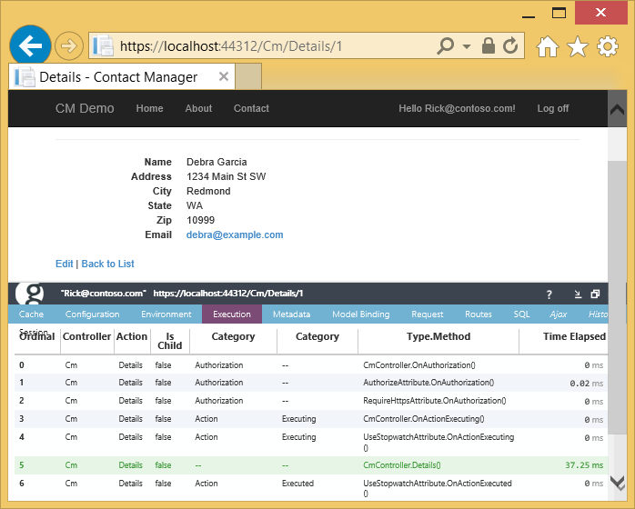

In the image above, the [Execution tab](http://getglimpse.com/Docs/Execution-Tab) is selected, which shows timing details of the actions and filters in the pipeline. You can see my [Stop Watch filter timer](http://www.nuget.org/packages/StopWatch/) start at stage 6 of the pipeline. While my light weight timer can provide useful profile/timing data, it misses all the time spent in authorization and rendering the view. You can read about my timer at [Profile and Time your ASP.NET MVC app all the way to Azure](https://blogs.msdn.com/b/webdev/archive/2014/07/29/profile-and-time-your-asp-net-mvc-app-all-the-way-to-azure.aspx). The [Tabs](http://getglimpse.com/Docs/Tabs) page provides links to detailed information on each tab.

## The Timeline tab

I've modified Tom Dykstra's outstanding [EF 6/MVC 5 tutorial](../getting-started/getting-started-with-ef-using-mvc/creating-an-entity-framework-data-model-for-an-asp-net-mvc-application.md) with the following code change to the instructors controller:

[!code-csharp[Main](profile-and-debug-your-aspnet-mvc-app-with-glimpse/samples/sample2.cs?highlight=1,20-31)]

The code above allows me to pass in query string (`eager`) to control eager or explicit loading of data. In the image below, explicit loading is used and the timing page shows each enrollment loaded in the `Index` action method:

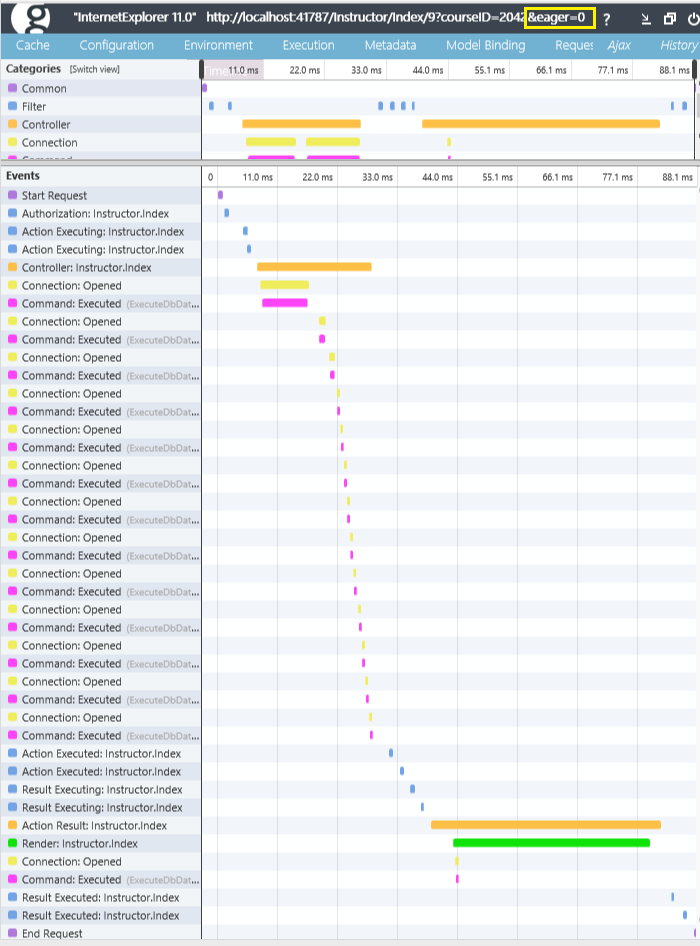

In the following code, eager is specified, and each enrollment is fetched after the `Index` view is called:

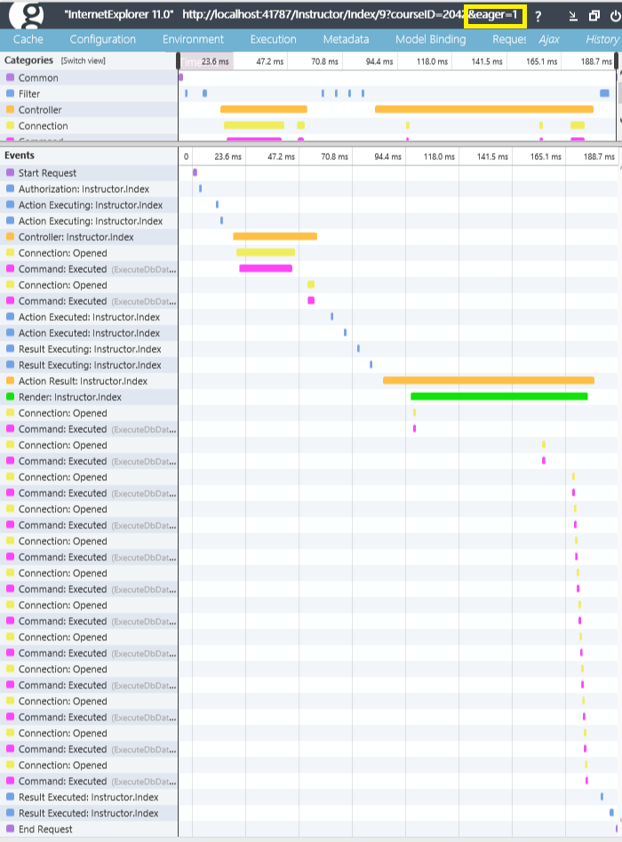

You can hover over a time segment to get detailed timing information:

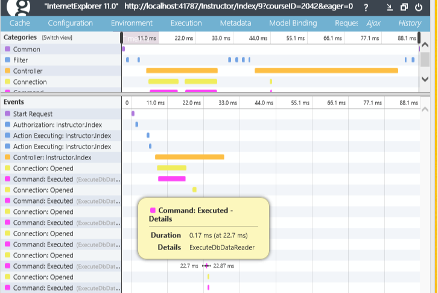

## Model Binding

The [model binding tab](http://getglimpse.com/Docs/Model-Binding-Tab) provides a wealth of information to help you understand how your form variables are bound and why some are not bound as would expect. The image below shows the **?** icon, which you can click on to bring up the glimpse help page for that feature.

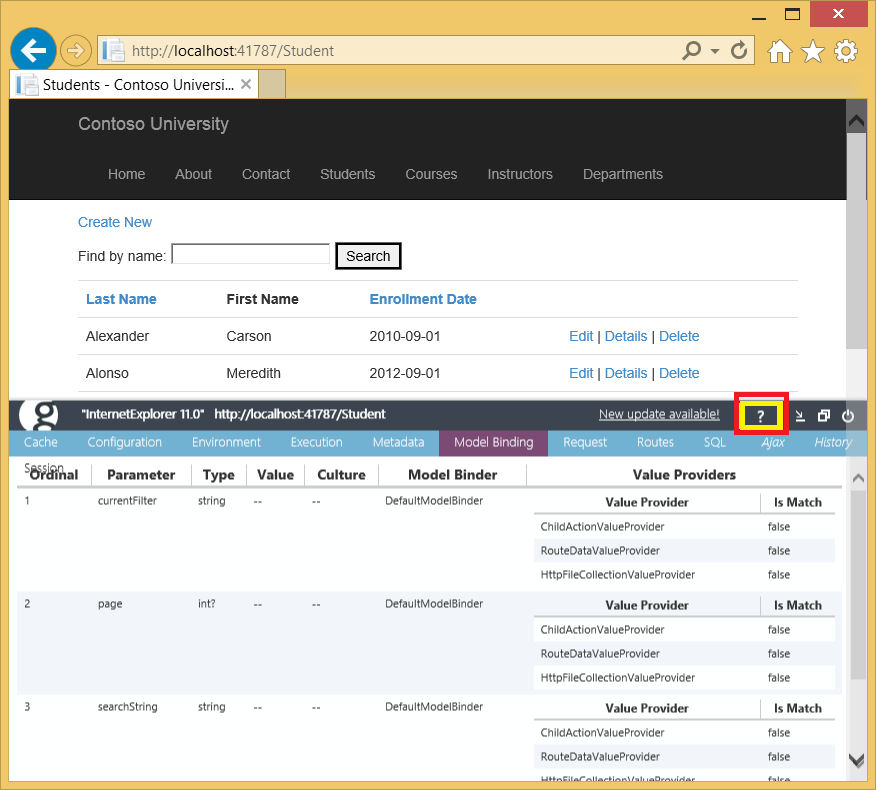

## Routes

 The Glimpse Routes tab will can help you debug and understand routing. In the image below, the product route is selected (and it shows in green, a Glimpse convention). 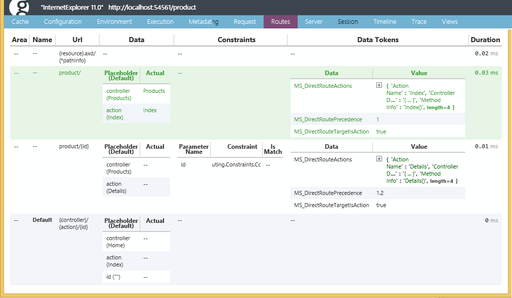 Route constraints, Areas and data tokens are also displayed. See [Glimpse Routes](http://getglimpse.com/Docs/Routes-Tab) and [Attribute Routing in ASP.NET MVC 5](https://blogs.msdn.com/b/webdev/archive/2013/10/17/attribute-routing-in-asp-net-mvc-5.aspx) for more information. 

## Using Glimpse on Azure

The Glimpse default security policy only allows Glimpse data to be displayed from local host. You can change this security policy so you can view this data on a remote server (such as a web app on Azure). For test environments on Azure, add the highlighted mark up to the bottom of the *web.confg* file to enable Glimpse:

[!code-xml[Main](profile-and-debug-your-aspnet-mvc-app-with-glimpse/samples/sample3.xml?highlight=2-6)]

With this change alone, any user can see your Glimpse data on a remote site. Consider adding the markup above to a publish profile so it's only deployed an applyed when you use that publish profile (for example, your Azure test proifle.) To restrict Glimpse data, we will add the `canViewGlimpseData` role and only allow users in this role to view Glimpse data.

Remove the comments from the *GlimpseSecurityPolicy.cs* file and change the [IsInRole](https://msdn.microsoft.com/en-us/library/system.security.principal.iprincipal.isinrole(v=vs.110).aspx) call from `Administrator` to the `canViewGlimpseData` role:

[!code-csharp[Main](profile-and-debug-your-aspnet-mvc-app-with-glimpse/samples/sample4.cs?highlight=6)]

> [!WARNING]
> Security - The rich data provided by Glimpse could expose the security of your app. Microsoft has not performed a security audit of Glimpse for use on productions apps.

For information on adding roles, see my [Deploy a Secure ASP.NET MVC 5 web app with Membership, OAuth, and SQL Database to Azure](https://azure.microsoft.com/en-us/documentation/articles/web-sites-dotnet-deploy-aspnet-mvc-app-membership-oauth-sql-database/) tutorial.

## Additional Resources

- [Deploy a Secure ASP.NET MVC 5 app with Membership, OAuth, and SQL Database to Azure](https://azure.microsoft.com/en-us/documentation/articles/web-sites-dotnet-deploy-aspnet-mvc-app-membership-oauth-sql-database/)
- [Glimpse Configuration](http://getglimpse.com/Docs/Configuration) - Doc page on configuring tabs, runtime policy, logging and more.