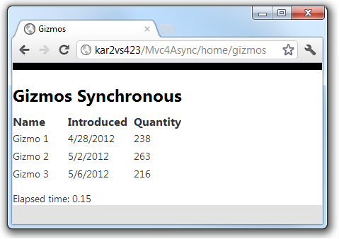
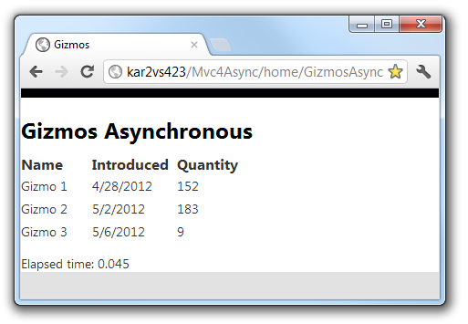
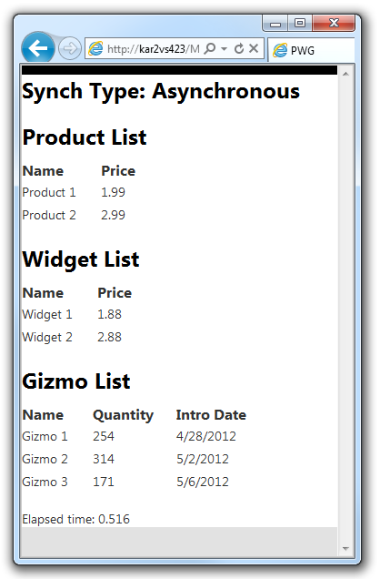
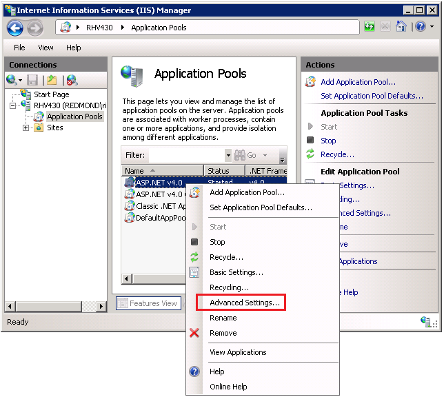
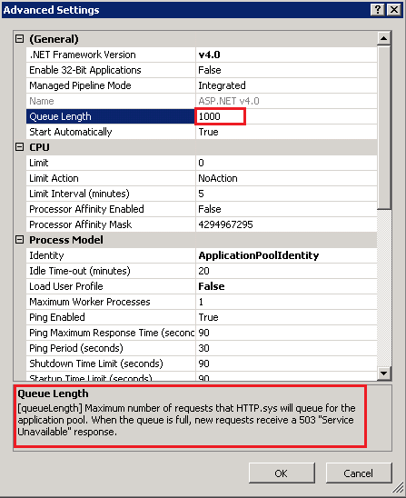

Using Asynchronous Methods in ASP.NET MVC 4
====================
by [Rick Anderson](https://github.com/Rick-Anderson)

> This tutorial will teach you the basics of building an asynchronous ASP.NET MVC Web application using [Visual Studio Express 2012 for Web](https://www.microsoft.com/visualstudio/11/en-us), which is a free version of Microsoft Visual Studio. You can also use [Visual Studio 2012](https://www.microsoft.com/visualstudio/11/en-us).

> A complete sample is provided for this tutorial on github
>  [https://github.com/RickAndMSFT/Async-ASP.NET/](https://github.com/RickAndMSFT/Async-ASP.NET/)

The ASP.NET MVC 4 [Controller](https://msdn.microsoft.com/en-us/library/system.web.mvc.controller(VS.108).aspx) class in combination [.NET 4.5](https://msdn.microsoft.com/en-us/library/w0x726c2(VS.110).aspx) enables you to write asynchronous action methods that return an object of type [Task&lt;ActionResult&gt;](https://msdn.microsoft.com/en-us/library/dd321424(VS.110).aspx). The .NET Framework 4 introduced an asynchronous programming concept referred to as a [Task](https://msdn.microsoft.com/en-us/library/system.threading.tasks.task.aspx) and ASP.NET MVC 4 supports [Task](https://msdn.microsoft.com/en-us/library/system.threading.tasks.task.aspx). Tasks are represented by the **Task** type and related types in the [System.Threading.Tasks](https://msdn.microsoft.com/en-us/library/system.threading.tasks.aspx) namespace. The .NET Framework 4.5 builds on this asynchronous support with the [await](https://msdn.microsoft.com/en-us/library/hh156528(VS.110).aspx) and [async](https://msdn.microsoft.com/en-us/library/hh156513(VS.110).aspx) keywords that make working with [Task](https://msdn.microsoft.com/en-us/library/system.threading.tasks.task.aspx) objects much less complex than previous asynchronous approaches. The [await](https://msdn.microsoft.com/en-us/library/hh156528(VS.110).aspx) keyword is syntactical shorthand for indicating that a piece of code should asynchronously wait on some other piece of code. The [async](https://msdn.microsoft.com/en-us/library/hh156513(VS.110).aspx) keyword represents a hint that you can use to mark methods as task-based asynchronous methods. The combination of **await**, **async**, and the **Task** object makes it much easier for you to write asynchronous code in .NET 4.5. The new model for asynchronous methods is called the *Task-based Asynchronous Pattern* (**TAP**). This tutorial assumes you have some familiarity with asynchronous programing using [await](https://msdn.microsoft.com/en-us/library/hh156528(VS.110).aspx) and [async](https://msdn.microsoft.com/en-us/library/hh156513(VS.110).aspx) keywords and the [Task](https://msdn.microsoft.com/en-us/library/system.threading.tasks.task.aspx) namespace.

For more information on the using [await](https://msdn.microsoft.com/en-us/library/hh156528(VS.110).aspx) and [async](https://msdn.microsoft.com/en-us/library/hh156513(VS.110).aspx) keywords and the [Task](https://msdn.microsoft.com/en-us/library/system.threading.tasks.task.aspx) namespace, see the following references.

- [Whitepaper: Asynchrony in .NET](https://go.microsoft.com/fwlink/?LinkId=204844)
- [Async/Await FAQ](https://blogs.msdn.com/b/pfxteam/archive/2012/04/12/10293335.aspx)
- [Visual Studio Asynchronous Programming](https://msdn.microsoft.com/en-us/vstudio/gg316360)

##   How Requests Are Processed by the Thread Pool

On the web server, the .NET Framework maintains a pool of threads that are used to service ASP.NET requests. When a request arrives, a thread from the pool is dispatched to process that request. If the request is processed synchronously, the thread that processes the request is busy while the request is being processed, and that thread cannot service another request.   
  
This might not be a problem, because the thread pool can be made large enough to accommodate many busy threads. However, the number of threads in the thread pool is limited (the default maximum for .NET 4.5 is 5,000). In large applications with high concurrency of long-running requests, all available threads might be busy. This condition is known as thread starvation. When this condition is reached, the web server queues requests. If the request queue becomes full, the web server rejects requests with an HTTP 503 status (Server Too Busy). The CLR thread pool has limitations on new thread injections. If concurrency is bursty (that is, your web site can suddenly get a large number of requests) and all available request threads are busy because of backend calls with high latency, the limited thread injection rate can make your application respond very poorly. Additionally, each new thread added to the thread pool has overhead (such as 1 MB of stack memory). A web application using synchronous methods to service high latency calls where the thread pool grows to the .NET 4.5 default maximum of 5, 000 threads would consume approximately 5 GB more memory than an application able the service the same requests using asynchronous methods and only 50 threads. When you're doing asynchronous work, you're not always using a thread. For example, when you make an asynchronous web service request, ASP.NET will not be using any threads between the **async** method call and the **await**. Using the thread pool to service requests with high latency can lead to a large memory footprint and poor utilization of the server hardware.

## Processing Asynchronous Requests

In web applications that sees a large number of concurrent requests at start-up or has a bursty load (where concurrency increases suddenly), making these web service calls asynchronous will increase the responsiveness of your application. An asynchronous request takes the same amount of time to process as a synchronous request. For example, if a request makes a web service call that requires two seconds to complete, the request takes two seconds whether it is performed synchronously or asynchronously. However, during an asynchronous call, a thread is not blocked from responding to other requests while it waits for the first request to complete. Therefore, asynchronous requests prevent request queuing and thread pool growth when there are many concurrent requests that invoke long-running operations.

##   Choosing Synchronous or Asynchronous Action Methods

This section lists guidelines for when to use synchronous or asynchronous action methods. These are just guidelines; examine each application individually to determine whether asynchronous methods help with performance.

In general, use synchronous methods for the following conditions:

- The operations are simple or short-running.
- Simplicity is more important than efficiency.
- The operations are primarily CPU operations instead of operations that involve extensive disk or network overhead. Using asynchronous action methods on CPU-bound operations provides no benefits and results in more overhead.

 In general, use asynchronous methods for the following conditions:

- You're calling services that can be consumed through asynchronous methods, and you're using .NET 4.5 or higher.
- The operations are network-bound or I/O-bound instead of CPU-bound.
- Parallelism is more important than simplicity of code.
- You want to provide a mechanism that lets users cancel a long-running request.
- When the benefit of switching threads out weights the cost of the context switch. In general, you should make a method asynchronous if the synchronous method waits on the ASP.NET request thread while doing no work. By making the call asynchronous, the ASP.NET request thread is not stalled doing no work while it waits for the web service request to complete.
- Testing shows that the blocking operations are a bottleneck in site performance and that IIS can service more requests by using asynchronous methods for these blocking calls.

 The downloadable sample shows how to use asynchronous action methods effectively. The sample provided was designed to provide a simple demonstration of asynchronous programming in ASP.NET MVC 4 using .NET 4.5. The sample is not intended to be a reference architecture for asynchronous programming in ASP.NET MVC. The sample program calls [ASP.NET Web API](../../../web-api/index.md) methods which in turn call [Task.Delay](https://msdn.microsoft.com/en-us/library/hh139096(VS.110).aspx) to simulate long-running web service calls. Most production applications will not show such obvious benefits to using asynchronous action methods.   
  
Few applications require all action methods to be asynchronous. Often, converting a few synchronous action methods to asynchronous methods provides the best efficiency increase for the amount of work required.

##   The Sample Application

You can download the sample application from [https://github.com/RickAndMSFT/Async-ASP.NET/](https://github.com/RickAndMSFT/Async-ASP.NET) on the [GitHub](https://github.com/) site. The repository consists of three projects:

- *Mvc4Async*: The ASP.NET MVC 4 project that contains the code used in this tutorial. It makes Web API calls to the **WebAPIpgw** service.
- *WebAPIpgw*: The ASP.NET MVC 4 Web API project that implements the `Products, Gizmos and Widgets` controllers. It provides the data for the *WebAppAsync* project and the *Mvc4Async* project.
- *WebAppAsync*: The ASP.NET Web Forms project used in another tutorial.

##   The Gizmos Synchronous Action Method

 The following code shows the `Gizmos` synchronous action method that is used to display a list of gizmos. (For this article, a gizmo is a fictional mechanical device.) 

[!code-csharp[Main](using-asynchronous-methods-in-aspnet-mvc-4/samples/sample1.cs)]

The following code shows the `GetGizmos` method of the gizmo service.

[!code-csharp[Main](using-asynchronous-methods-in-aspnet-mvc-4/samples/sample2.cs)]

The `GizmoService GetGizmos` method passes a URI to an ASP.NET Web API HTTP service which returns a list of gizmos data. The *WebAPIpgw* project contains the implementation of the Web API `gizmos, widget` and `product` controllers.  
The following image shows the gizmos view from the sample project.

##   Creating an Asynchronous Gizmos Action Method

The sample uses the new [async](https://msdn.microsoft.com/en-us/library/hh156513(VS.110).aspx) and [await](https://msdn.microsoft.com/en-us/library/hh156528(VS.110).aspx) keywords (available in .NET 4.5 and Visual Studio 2012) to let the compiler be responsible for maintaining the complicated transformations necessary for asynchronous programming. The compiler lets you write code using the C#'s synchronous control flow constructs and the compiler automatically applies the transformations necessary to use callbacks in order to avoid blocking threads.

The following code shows the `Gizmos` synchronous method and the `GizmosAsync` asynchronous method. If your browser supports the [HTML 5 `<mark>` element](http://www.w3.org/wiki/HTML/Elements/mark), you'll see the changes in `GizmosAsync` in yellow highlight.

[!code-csharp[Main](using-asynchronous-methods-in-aspnet-mvc-4/samples/sample3.cs)]

[!code-csharp[Main](using-asynchronous-methods-in-aspnet-mvc-4/samples/sample4.cs?highlight=1,3,5)]

 The following changes were applied to allow the `GizmosAsync` to be asynchronous.

- The method is marked with the [async](https://msdn.microsoft.com/en-us/library/hh156513(VS.110).aspx) keyword, which tells the compiler to generate callbacks for parts of the body and to automatically create a `Task<ActionResult>` that is returned.
- &quot;Async&quot; was appended to the method name. Appending "Async" is not required but is the convention when writing asynchronous methods.
- The return type was changed from `ActionResult` to `Task<ActionResult>`. The return type of `Task<ActionResult>` represents ongoing work and provides callers of the method with a handle through which to wait for the asynchronous operation's completion. In this case, the caller is the web service. `Task<ActionResult>` represents ongoing work with a result of `ActionResult.`
- The [await](https://msdn.microsoft.com/en-us/library/hh156528(VS.110).aspx) keyword was applied to the web service call.
- The asynchronous web service API was called (`GetGizmosAsync`).

Inside of the `GetGizmosAsync` method body another asynchronous method, `GetGizmosAsync` is called. `GetGizmosAsync` immediately returns a `Task<List<Gizmo>>` that will eventually complete when the data is available. Because you don't want to do anything else until you have the gizmo data, the code awaits the task (using the **await** keyword). You can use the **await** keyword only in methods annotated with the **async** keyword.

The **await** keyword does not block the thread until the task is complete. It signs up the rest of the method as a callback on the task, and immediately returns. When the awaited task eventually completes, it will invoke that callback and thus resume the execution of the method right where it left off. For more information on using the [await](https://msdn.microsoft.com/en-us/library/hh156528(VS.110).aspx) and [async](https://msdn.microsoft.com/en-us/library/hh156513(VS.110).aspx) keywords and the [Task](https://msdn.microsoft.com/en-us/library/system.threading.tasks.task.aspx) namespace, see the [async references](#asyncRefs) section.

The following code shows the `GetGizmos` and `GetGizmosAsync` methods.

[!code-csharp[Main](using-asynchronous-methods-in-aspnet-mvc-4/samples/sample5.cs)]

[!code-csharp[Main](using-asynchronous-methods-in-aspnet-mvc-4/samples/sample6.cs?highlight=1,4-8)]

 The asynchronous changes are similar to those made to the **GizmosAsync** above. 

- The method signature was annotated with the [async](https://msdn.microsoft.com/en-us/library/hh156513(VS.110).aspx) keyword, the return type was changed to `Task<List<Gizmo>>`, and *Async* was appended to the method name.
- The asynchronous [HttpClient](https://msdn.microsoft.com/en-us/library/system.net.http.httpclient(VS.110).aspx) class is used instead of the [WebClient](https://msdn.microsoft.com/en-us/library/system.net.webclient.aspx) class.
- The [await](https://msdn.microsoft.com/en-us/library/hh156528(VS.110).aspx) keyword was applied to the [HttpClient](https://msdn.microsoft.com/en-us/library/system.net.http.httpclient(VS.110).aspx) asynchronous methods.

The following image shows the asynchronous gizmo view.

The browsers presentation of the gizmos data is identical to the view created by the synchronous call. The only difference is the asynchronous version may be more performant under heavy loads.

##   Performing Multiple Operations in Parallel

Asynchronous action methods have a significant advantage over synchronous methods when an action must perform several independent operations. In the sample provided, the synchronous method `PWG`(for Products, Widgets and Gizmos) displays the results of three web service calls to get a list of products, widgets, and gizmos. The [ASP.NET Web API](../../../web-api/index.md) project that provides these services uses [Task.Delay](https://msdn.microsoft.com/en-us/library/hh139096(VS.110).aspx) to simulate latency or slow network calls. When the delay is set to 500 milliseconds, the asynchronous `PWGasync` method takes a little over 500 milliseconds to complete while the synchronous `PWG` version takes over 1,500 milliseconds. The synchronous `PWG` method is shown in the following code.

[!code-csharp[Main](using-asynchronous-methods-in-aspnet-mvc-4/samples/sample7.cs)]

The asynchronous `PWGasync` method is shown in the following code.

[!code-csharp[Main](using-asynchronous-methods-in-aspnet-mvc-4/samples/sample8.cs?highlight=1,3,12)]

The following image shows the view returned from the **PWGasync** method.

##   Using a Cancellation Token

Asynchronous action methods returning `Task<ActionResult>`are cancelable, that is they take a [CancellationToken](https://msdn.microsoft.com/en-us/library/system.threading.cancellationtoken(VS.110).aspx) parameter when one is provided with the [AsyncTimeout](https://msdn.microsoft.com/en-us/library/system.web.mvc.asynctimeoutattribute(VS.108).aspx) attribute. The following code shows the `GizmosCancelAsync` method with a timeout of 150 milliseconds.

[!code-csharp[Main](using-asynchronous-methods-in-aspnet-mvc-4/samples/sample9.cs?highlight=1-3,5,10)]

The following code shows the GetGizmosAsync overload, which takes a [CancellationToken](https://msdn.microsoft.com/en-us/library/system.threading.cancellationtoken(VS.110).aspx) parameter.

[!code-csharp[Main](using-asynchronous-methods-in-aspnet-mvc-4/samples/sample10.cs)]

In the sample application provided, selecting the *Cancellation Token Demo* link calls the `GizmosCancelAsync` method and demonstrates the cancelation of the asynchronous call.

##   Server Configuration for High Concurrency/High Latency Web Service Calls

To realize the benefits of an asynchronous web application, you might need to make some changes to the default server configuration. Keep the following in mind when configuring and stress testing your asynchronous web application.

- Windows 7, Windows Vista and all Windows client operating systems have a maximum of 10 concurrent requests. You'll need a Windows Server operating system to see the benefits of asynchronous methods under high load.
- Register .NET 4.5 with IIS from an elevated command prompt:  
 %windir%\Microsoft.NET\Framework64\v4.0.30319\aspnet\_regiis -i  
 See    [ASP.NET IIS Registration Tool (Aspnet\_regiis.exe)](https://msdn.microsoft.com/en-us/library/k6h9cz8h.aspx)
- You might need to increase the [HTTP.sys](https://www.iis.net/learn/get-started/introduction-to-iis/introduction-to-iis-architecture) queue limit from the default value of 1,000 to 5,000. If the setting is too low, you may see [HTTP.sys](https://www.iis.net/learn/get-started/introduction-to-iis/introduction-to-iis-architecture) reject requests with a HTTP 503 status. To change the HTTP.sys queue limit:

    - Open IIS manager and navigate to the Application Pools pane.
    - Right click on the target application pool and select **Advanced Settings**.  
        
    - In the **Advanced Settings** dialog box, change *Queue Length* from 1,000 to 5,000.  
          
  
 Note in the images above, the .NET framework is listed as v4.0, even though the application pool is using .NET 4.5. To understand this discrepancy, see the following:

    - [.NET Versioning and Multi-Targeting - .NET 4.5 is an in-place upgrade to .NET 4.0](http://www.hanselman.com/blog/NETVersioningAndMultiTargetingNET45IsAnInplaceUpgradeToNET40.aspx)
    - [How to set an IIS Application or AppPool to use ASP.NET 3.5 rather than 2.0](http://www.hanselman.com/blog/HowToSetAnIISApplicationOrAppPoolToUseASPNET35RatherThan20.aspx)
    - [.NET Framework Versions and Dependencies](https://msdn.microsoft.com/en-us/library/bb822049(VS.110).aspx)
- If your application is using web services or System.NET to communicate with a backend over HTTP you may need to increase the [connectionManagement/maxconnection](https://msdn.microsoft.com/en-us/library/fb6y0fyc(VS.110).aspx) element. For ASP.NET applications, this is limited by the autoConfig feature to 12 times the number of CPUs. That means that on a quad-proc, you can have at most 12 \* 4 = 48 concurrent connections to an IP end point. Because this is tied to [autoConfig](https://msdn.microsoft.com/en-us/library/7w2sway1(VS.110).aspx), the easiest way to increase `maxconnection` in an ASP.NET application is to set [System.Net.ServicePointManager.DefaultConnectionLimit](https://msdn.microsoft.com/en-us/library/system.net.servicepointmanager.defaultconnectionlimit(VS.110).aspx) programmatically in the from `Application_Start` method in the *global.asax* file. See the sample download for an example.
- In .NET 4.5, the default of 5000 for [MaxConcurrentRequestsPerCPU](https://blogs.msdn.com/tmarq/archive/2007/07/21/asp-net-thread-usage-on-iis-7-0-and-6-0.aspx) should be fine.
