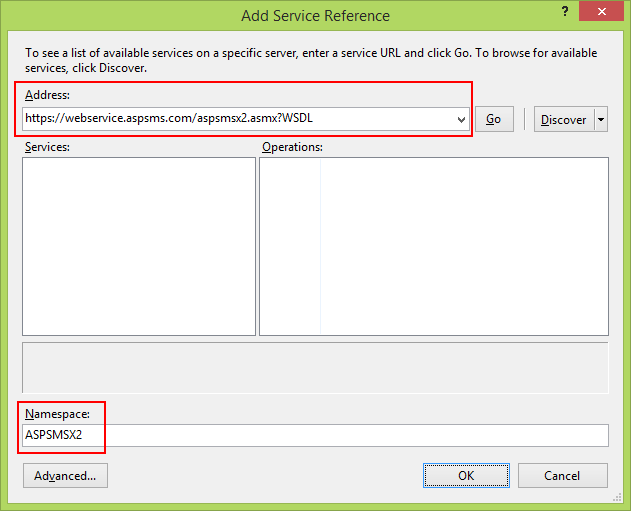
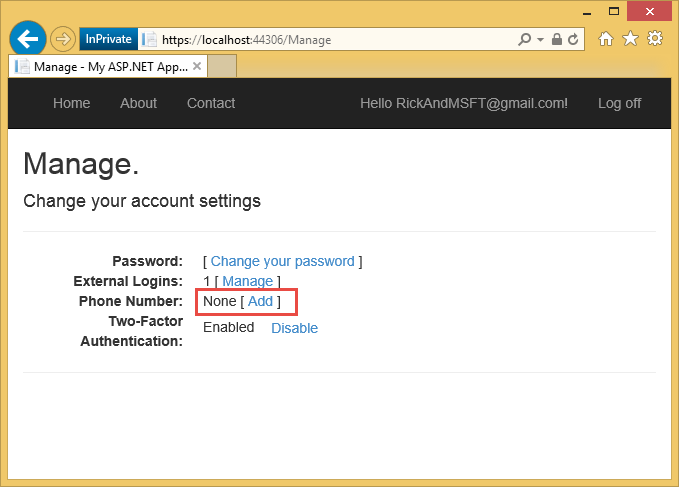
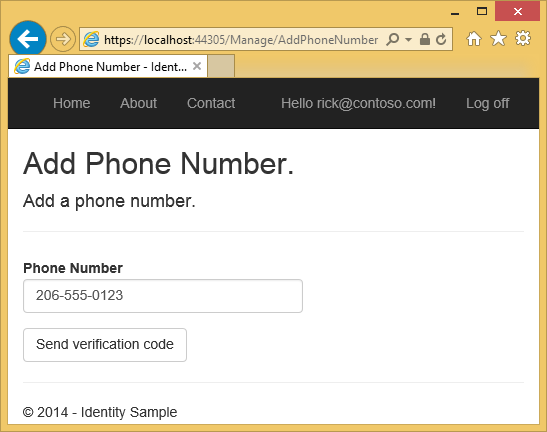
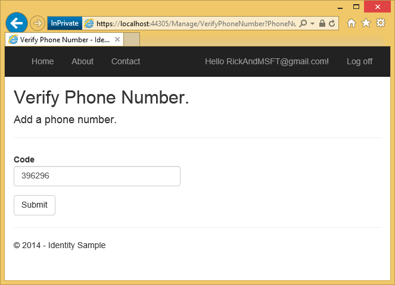
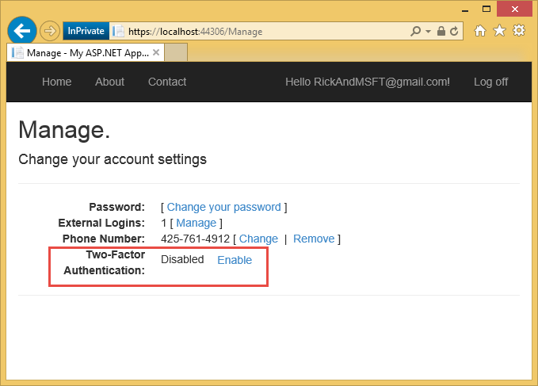
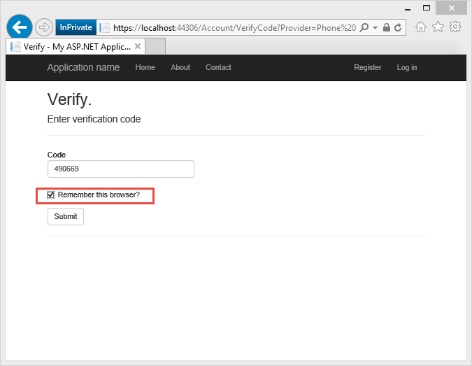

ASP.NET MVC 5 app with SMS and email Two-Factor Authentication
====================
by [Rick Anderson](https://github.com/Rick-Anderson)

> This tutorial shows you how to build an ASP.NET MVC 5 web app with Two-Factor Authentication. You should complete [Create a secure ASP.NET MVC 5 web app with log in, email confirmation and password reset](create-an-aspnet-mvc-5-web-app-with-email-confirmation-and-password-reset.md) before proceeding. You can download the completed application [here](https://code.msdn.microsoft.com/MVC-5-with-2FA-email-8f26d952). The download contains debugging helpers that let you test email confirmation and SMS without setting up an email or SMS provider.
> 
> This tutorial was written by [Rick Anderson](https://blogs.msdn.com/rickAndy) ( Twitter: [@RickAndMSFT](https://twitter.com/RickAndMSFT) ).

- [Create an ASP.NET MVC app](#createMvc)
- [Set up SMS for Two-factor authentication](#SMS)
- [Enable Two-factor authentication](#enable2)
- [Additional Resources](#addRes)

## Create an ASP.NET MVC app

Start by installing and running [Visual Studio Express 2013 for Web](https://go.microsoft.com/fwlink/?LinkId=299058) or [Visual Studio 2013](https://go.microsoft.com/fwlink/?LinkId=306566). Install [Visual Studio 2013 Update 3](https://go.microsoft.com/fwlink/?LinkId=390465) or higher.

> [!NOTE]
> Warning: You should complete [Create a secure ASP.NET MVC 5 web app with log in, email confirmation and password reset](create-an-aspnet-mvc-5-web-app-with-email-confirmation-and-password-reset.md) before proceeding. You must install [Visual Studio 2013 Update 3](https://go.microsoft.com/fwlink/?LinkId=390465) or higher to complete this tutorial.

1. Create a new ASP.NET Web project and select the MVC template. Web Forms also supports ASP.NET Identity, so you could follow similar steps in a web forms app.  
    
2. Leave the default authentication as **Individual User Accounts**. If you'd like to host the app in Azure, leave the check box checked. Later in the tutorial we will deploy to Azure. You can [open an Azure account for free](https://azure.microsoft.com/en-us/pricing/free-trial/?WT.mc_id=A261C142F).
3. Set the [project to use SSL](create-an-aspnet-mvc-5-app-with-facebook-and-google-oauth2-and-openid-sign-on.md).

## Set up SMS for Two-factor authentication

This tutorial provides instructions for using either Twilio or ASPSMS but you can use any other SMS provider.

1. **Creating a User Account with an SMS provider**  
  
 Create a [Twilio](https://www.twilio.com/try-twilio) or an [ASPSMS](https://www.aspsms.com/asp.net/identity/testcredits/) account.
2. **Installing additional packages or adding service references**  
  
 Twilio:  
 In the Package Manager Console, enter the following command:  
    `Install-Package Twilio`  
  
 ASPSMS:  
 The following service reference needs to be added:  
  
      
  
 Address:  
    `https://webservice.aspsms.com/aspsmsx2.asmx?WSDL`  
  
 Namespace:  
    `ASPSMSX2`
3. **Figuring out SMS Provider User credentials**  
  
 Twilio:  
 From the **Dashboard** tab of your Twilio account, copy the **Account SID** and **Auth token**.  
  
 ASPSMS:  
 From your account settings, navigate to **Userkey** and copy it together with your self-defined **Password**.  
  
 We will later store these values in the *web.config* file within the keys `"SMSAccountIdentification"` and `"SMSAccountPassword"` .
4. **Specifying SenderID / Originator**  
  
 Twilio:  
 From the **Numbers** tab, copy your Twilio phone number.  
  
 ASPSMS:  
 Within the **Unlock Originators** Menu, unlock one or more Originators or choose an alphanumeric Originator (Not supported by all networks).  
  
 We will later store this value in the *web.config* file within the key `"SMSAccountFrom"` .
5. **Transferring SMS provider credentials into app**  
  
 Make the credentials and sender phone number available to the app. To keep things simple we will store these values in the *web.config* file. When we deploy to Azure, we can store the values securely in the **app settings** section on the web site configure tab. 

    [!code-xml[Main](aspnet-mvc-5-app-with-sms-and-email-two-factor-authentication/samples/sample1.xml?highlight=8-10)]

    > [!WARNING]
    > Security - Never store sensitive data in your source code. The account and credentials are added to the code above to keep the sample simple. See [Best practices for deploying passwords and other sensitive data to ASP.NET and Azure](../../../identity/overview/features-api/best-practices-for-deploying-passwords-and-other-sensitive-data-to-aspnet-and-azure.md).
6. **Implementation of data transfer to SMS provider**  
  
 Configure the `SmsService`  class in the *App\_Start\IdentityConfig.cs* file.  
  
 Depending on the used SMS provider activate either the **Twilio** or the **ASPSMS** section: 

    [!code-csharp[Main](aspnet-mvc-5-app-with-sms-and-email-two-factor-authentication/samples/sample2.cs)]
7. Update the *Views\Manage\Index.cshtml* Razor view: (note: don't just remove the comments in the exiting code, use the code below.)  

    [!code-cshtml[Main](aspnet-mvc-5-app-with-sms-and-email-two-factor-authentication/samples/sample3.cshtml?highlight=29-66)]
8. Verify the `EnableTwoFactorAuthentication` and `DisableTwoFactorAuthentication` action methods in the `ManageController` have the[[ValidateAntiForgeryToken]](https://msdn.microsoft.com/en-us/library/system.web.mvc.validateantiforgerytokenattribute(v=vs.118).aspx) attribute:  

    [!code-csharp[Main](aspnet-mvc-5-app-with-sms-and-email-two-factor-authentication/samples/sample4.cs?highlight=3,16)]
9. Run the app and log in with the account you previously registered.
10. Click on your User ID, which activates the `Index` action method in `Manage` controller.  
    
11. Click Add.  
    
12. The `AddPhoneNumber` action method displays a dialog box to enter a phone number that can receive SMS messages.

    [!code-csharp[Main](aspnet-mvc-5-app-with-sms-and-email-two-factor-authentication/samples/sample5.cs)]

    
13. In a few seconds you will get a text message with the verification code. Enter it and press **Submit**.  
    
14. The Manage view shows your phone number was added.

## Enable two-factor authentication

In the template generated app, you need to use the UI to enable two-factor authentication (2FA). To enable 2FA, click on your user ID (email alias) in the navigation bar.

Click on enable 2FA.

Logout, then log back in. If you've enabled email (see my [previous tutorial](../../../identity/overview/features-api/account-confirmation-and-password-recovery-with-aspnet-identity.md)), you can select the SMS or email for 2FA.

The Verify Code page is displayed where you can enter the code (from SMS or email).

Clicking on the **Remember this browser** check box will exempt you from needing to use 2FA to log in when using the browser and device where you checked the box. As long as malicious users can't gain access to your device, enabling 2FA and clicking on the **Remember this browser** will provide you with convenient one step password access, while still retaining strong 2FA protection for all access from non-trusted devices. You can do this on any private device you regularly use.

This tutorial provides a quick introduction to enabling 2FA on a new ASP.NET MVC app. My tutorial [Two-factor authentication using SMS and email with ASP.NET Identity](../../../identity/overview/features-api/two-factor-authentication-using-sms-and-email-with-aspnet-identity.md) goes into detail on the code behind the sample.

## Additional Resources

- [Two-factor authentication using SMS and email with ASP.NET Identity](../../../identity/overview/features-api/two-factor-authentication-using-sms-and-email-with-aspnet-identity.md) Goes into detail on Two-factor authentication
- [Links to ASP.NET Identity Recommended Resources](../../../identity/overview/getting-started/aspnet-identity-recommended-resources.md)
- [Account Confirmation and Password Recovery with ASP.NET Identity](../../../identity/overview/features-api/account-confirmation-and-password-recovery-with-aspnet-identity.md) Goes into more detail on password recovery and account confirmation.
- [MVC 5 App with Facebook, Twitter, LinkedIn and Google OAuth2 Sign-on](create-an-aspnet-mvc-5-app-with-facebook-and-google-oauth2-and-openid-sign-on.md) This tutorial shows you how to write an ASP.NET MVC 5 app with Facebook and Google OAuth 2 authorization. It also shows how to add additional data to the Identity database.
- [Deploy a Secure ASP.NET MVC app with Membership, OAuth, and SQL Database to Azure Web](https://www.windowsazure.com/en-us/develop/net/tutorials/web-site-with-sql-database/). This tutorial adds Azure deployment, how to secure your app with roles, how to use the membership API to add users and roles, and additional security features.
- [Creating a Google app for OAuth 2 and connecting the app to the project](create-an-aspnet-mvc-5-app-with-facebook-and-google-oauth2-and-openid-sign-on.md#goog)
- [Creating the app in Facebook and connecting the app to the project](create-an-aspnet-mvc-5-app-with-facebook-and-google-oauth2-and-openid-sign-on.md#fb)
- [Setting up SSL in the Project](create-an-aspnet-mvc-5-app-with-facebook-and-google-oauth2-and-openid-sign-on.md#ssl)