Code! MVC 5 App with Facebook, Twitter, LinkedIn and Google OAuth2 Sign-on (C#)
====================
by [Rick Anderson](https://github.com/Rick-Anderson)

> This tutorial shows you how to build an ASP.NET MVC 5 web application that enables users to log in using [OAuth 2.0](http://oauth.net/2/) with credentials from an external authentication provider, such as Facebook, Twitter, LinkedIn, Microsoft, or Google. For simplicity, this tutorial focuses on working with credentials from Facebook and Google.
> 
> Enabling these credentials in your web sites provides a significant advantage because millions of users already have accounts with these external providers. These users may be more inclined to sign up for your site if they do not have to create and remember a new set of credentials.
> 
> See also [ASP.NET MVC 5 app with SMS and email Two-Factor Authentication](aspnet-mvc-5-app-with-sms-and-email-two-factor-authentication.md).
> 
> The tutorial also shows how to add profile data for the user, and how to use the Membership API to add roles. This tutorial was written by [Rick Anderson](https://blogs.msdn.com/rickAndy) ( Please follow me on Twitter: [@RickAndMSFT](https://twitter.com/RickAndMSFT) ).

## Getting Started

Start by installing and running [Visual Studio Express 2013 for Web](https://go.microsoft.com/fwlink/?LinkId=299058) or [Visual Studio 2013](https://go.microsoft.com/fwlink/?LinkId=306566). Install Visual Studio [2013 Update 3](https://go.microsoft.com/fwlink/?LinkId=390521) or higher. For help with Dropbox, GitHub, Linkedin, Instagram, buffer, salesforce, STEAM, Stack Exchange, Tripit, twitch, Twitter, Yahoo and more, see this [one stop guide](http://www.oauthforaspnet.com/).

> [!NOTE]
> You must install Visual Studio [2013 Update 3](https://go.microsoft.com/fwlink/?LinkId=390521) or higher to use Google OAuth 2 and to debug locally without SSL warnings.

Click **New Project** from the **Start** page, or you can use the menu and select **File**, and then **New Project**.

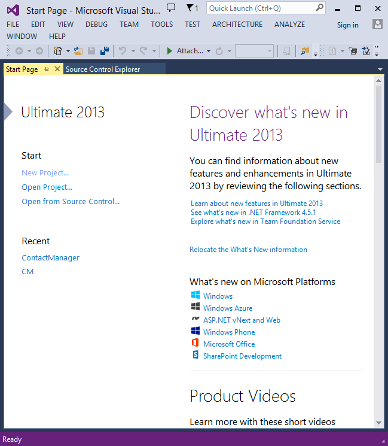  
 

## Creating Your First Application

Click **New Project**, then select **Visual C#** on the left, then **Web** and then select **ASP.NET Web Application**. Name your project "MvcAuth" and then click **OK**.

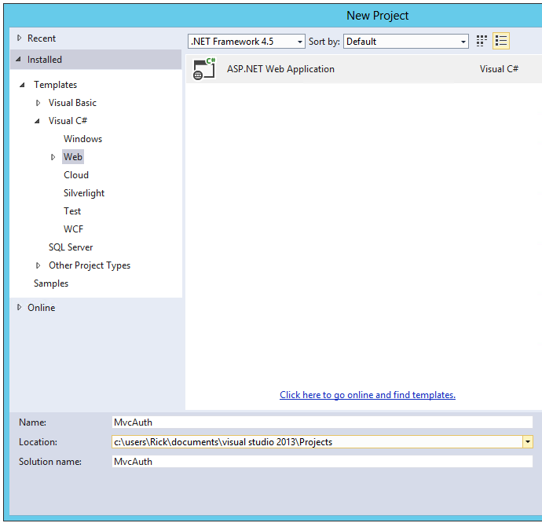

In the **New ASP.NET Project** dialog, click **MVC**. If the Authentication is not **Individual User Accounts**, click the **Change Authentication** button and select **Individual User Accounts**. By checking **Host in the cloud**, the app will be very easy to host in Azure.

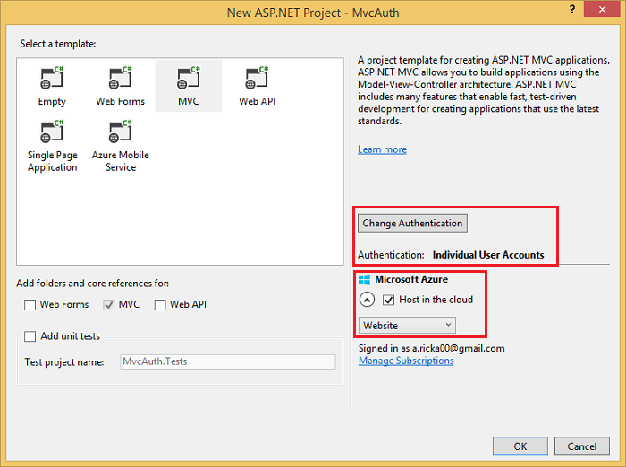

If you selected **Host in the cloud**, complete the configure dialog.

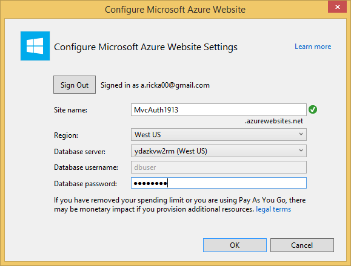

### Use NuGet to update to the latest OWIN middleware

Use the NuGet package manager to update the [OWIN middleware](../../../aspnet/overview/owin-and-katana/getting-started-with-owin-and-katana.md). Select **Updates** in the left menu. You can click on the **Update All** button or you can search for only OWIN packages (shown in the next image):

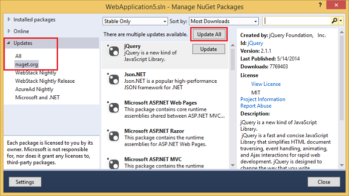

In the image below, only OWIN packages are shown:

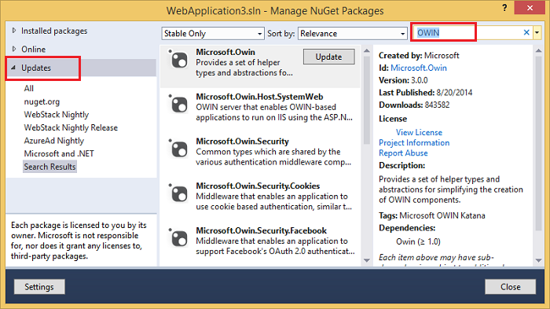

From the Package Manager Console (PMC), you can enter the `Update-Package` command, which will update all packages.

Press **F5** or **Ctrl+F5** to run the application. In the image below, the port number is 1234. When you run the application, you'll see a different port number.

Depending on the size of your browser window, you might need to click the navigation icon to see the **Home**, **About**, **Contact**, **Register** and **Log in** links.

  
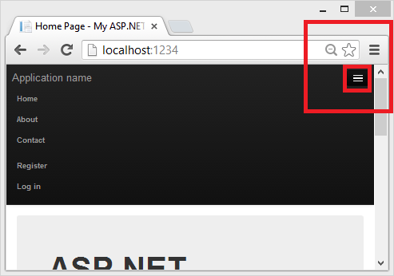 

## Setting up SSL in the Project

To connect to authentication providers like Google and Facebook, you will need to set up IIS-Express to use SSL. It's important to keep using SSL after login and not drop back to HTTP, your login cookie is just as secret as your username and password, and without using SSL you're sending it in clear-text across the wire. Besides, you've already taken the time to perform the handshake and secure the channel (which is the bulk of what makes HTTPS slower than HTTP) before the MVC pipeline is run, so redirecting back to HTTP after you're logged in won't make the current request or future requests much faster.

1. In **Solution Explorer**, click the **MvcAuth** project.
2. Hit the F4 key to show the project properties. Alternatively, from the **View** menu you can select **Properties Window**.
3. Change **SSL Enabled** to True.  
  
    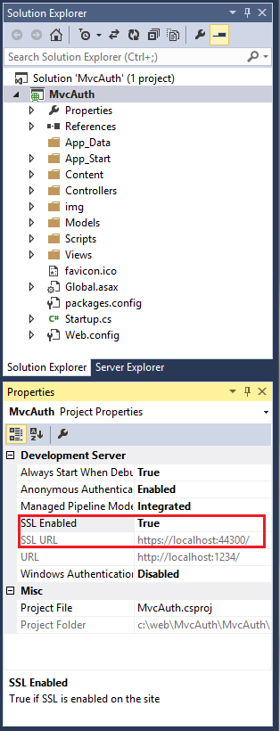
4. Copy the SSL URL (which will be `https://localhost:44300/` unless you've created other SSL projects).
5. In **Solution Explorer**, right click the **MvcAuth** project and select **Properties**.
6. Select the **Web** tab, and then paste the SSL URL into the **Project Url** box. Save the file (Ctl+S). You will need this URL to configure Facebook and Google authentication apps.  
  
    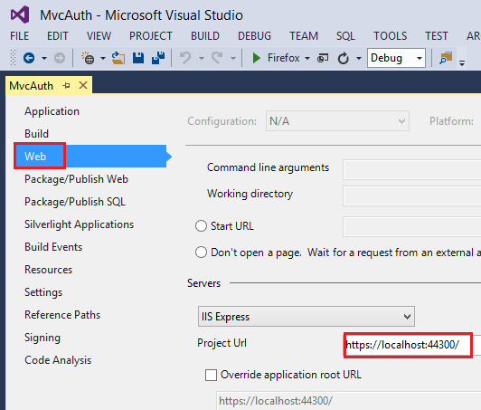
7. Add the [RequireHttps](https://msdn.microsoft.com/en-us/library/system.web.mvc.requirehttpsattribute.aspx) attribute to the `Home` controller to require all requests must use HTTPS. A more secure approach is to add the [RequireHttps](https://msdn.microsoft.com/en-us/library/system.web.mvc.requirehttpsattribute.aspx) filter to the application. See the section &quot;Protect the Application with SSL and the Authorize Attribute&quot; in my tutoral [Create an ASP.NET MVC app with auth and SQL DB and deploy to Azure App Service](https://www.windowsazure.com/en-us/documentation/articles/web-sites-dotnet-deploy-aspnet-mvc-app-membership-oauth-sql-database/). A portion of the Home controller is shown below.

    [!code-csharp[Main](create-an-aspnet-mvc-5-app-with-facebook-and-google-oauth2-and-openid-sign-on/samples/sample1.cs?highlight=1)]
8. Press CTRL+F5 to run the application. If you've installed the certificate in the past, you can skip the rest of this section and jump to [Creating a Google app for OAuth 2 and connecting the app to the project](#goog), otherwise, follow the instructions to trust the self-signed certificate that IIS Express has generated.  
  
    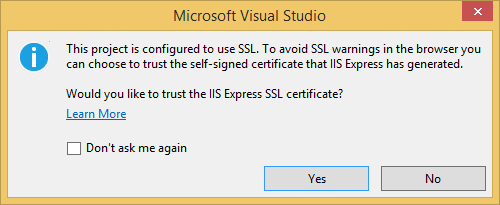
9. Read the **Security Warning** dialog and then click **Yes** if you want to install the certificate representing localhost.  
  
    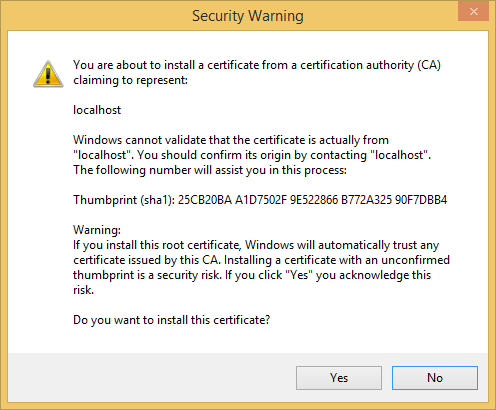
10. IE shows the *Home* page and there are no SSL warnings.  
  
    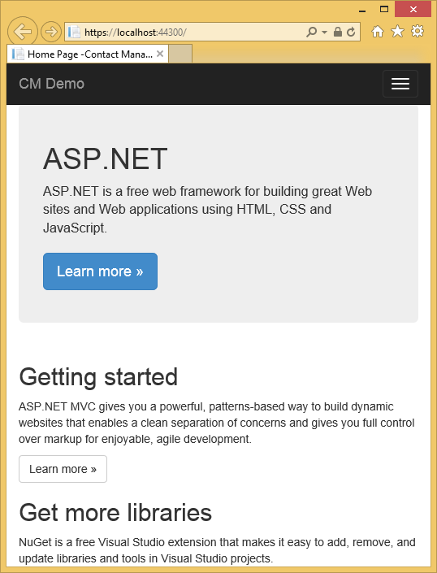
11. Google Chrome also accepts the certificate and will show HTTPS content without a warning. Firefox uses its own certificate store, so it will display a warning. For our application you can safely click **I Understand the Risks**.   
  
    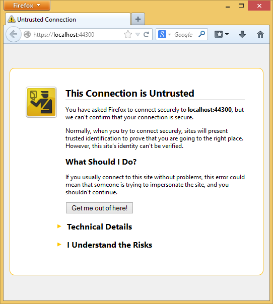

## Creating a Google app for OAuth 2 and connecting the app to the project

1. Navigate to the [Google Developers Console](https://console.developers.google.com/).
1. If you haven't created a project before, select **Credentials** in the left tab, and then select **Create**.
1. In the left tab, click **Credentials**.
1. Click **Create credentials** then **OAuth client ID**. 

    1. In the **Create Client ID** dialog, keep the default **Web application** for the application type.
    2. Set the **Authorized JavaScript** origins to the SSL URL you used above (`https://localhost:44300/` unless you've created other SSL projects)
    3. Set the **Authorized redirect URI** to:  
         `https://localhost:44300/signin-google/`
5. Click the OAuth Consent screen menu item, then set your email address and product name. When you have completed the form click **Save**.
6. Click the Library menu item, search **Google+ API**, click on it then press Enable.
  
    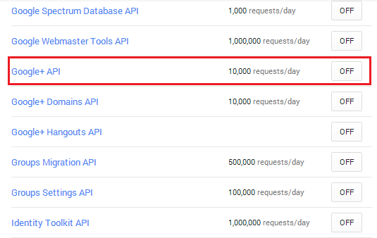  
  
 The image below shows the enabled APIs.  
  
    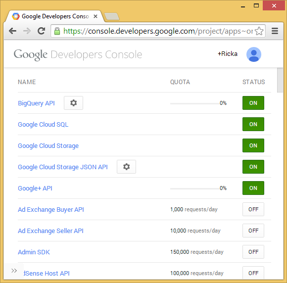
7. Copy and paste the **AppId** and **App Secret** into the `UseGoogleAuthentication` method. The **AppId** and **App Secret** values shown below are samples and will not work.

    [!code-csharp[Main](create-an-aspnet-mvc-5-app-with-facebook-and-google-oauth2-and-openid-sign-on/samples/sample2.cs?highlight=37-39)]

    > [!WARNING]
    > Security - Never store sensitive data in your source code. The account and credentials are added to the code above to keep the sample simple. See [Best practices for deploying passwords and other sensitive data to ASP.NET and Azure App Service](../../../identity/overview/features-api/best-practices-for-deploying-passwords-and-other-sensitive-data-to-aspnet-and-azure.md).
8. Press **CTRL+F5** to build and run the application. Click the **Log in** link.  
  
    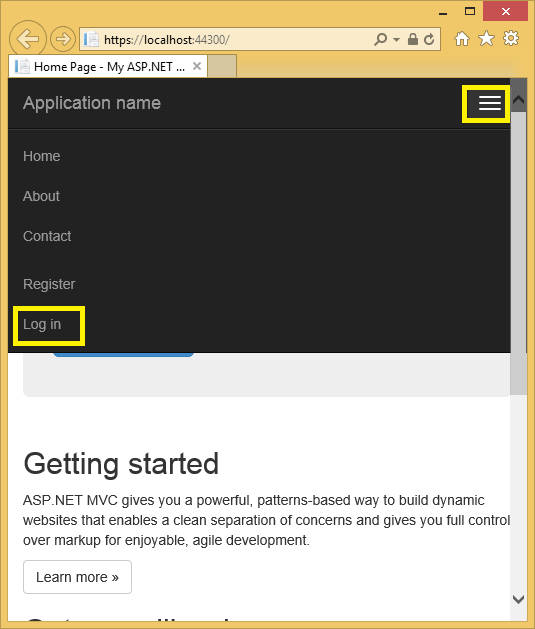
9. Under **Use another service to log in**, click **Google**.  
  
    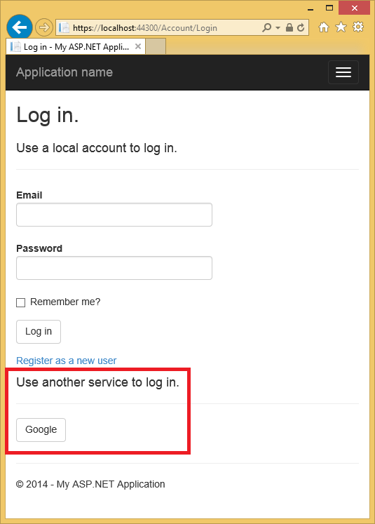

    > [!NOTE]
    > If you miss any of the steps above you will get a HTTP 401 error. Recheck your steps above. If you miss a required setting (for example **product name**), add the missing item and save, it can take a few minutes for authentication to work.
10. You will be redirected to the google site where you will enter your credentials.   
  
    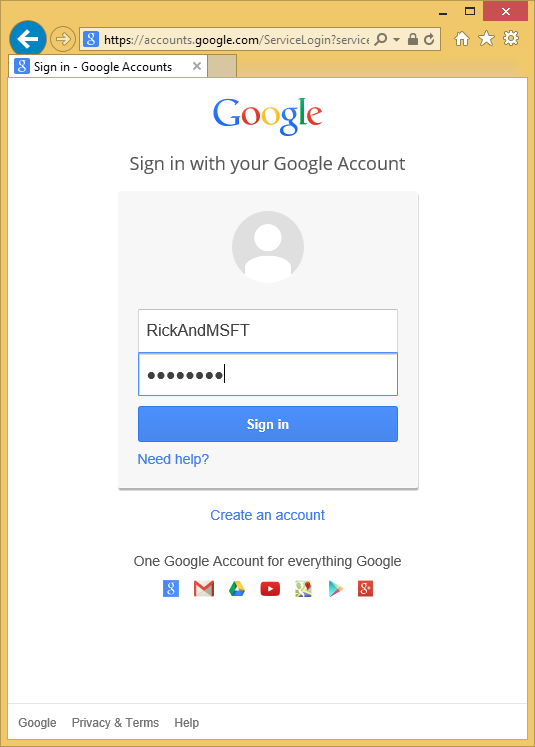
11. After you enter your credentials, you will be prompted to give permissions to the web application you just created:
  
    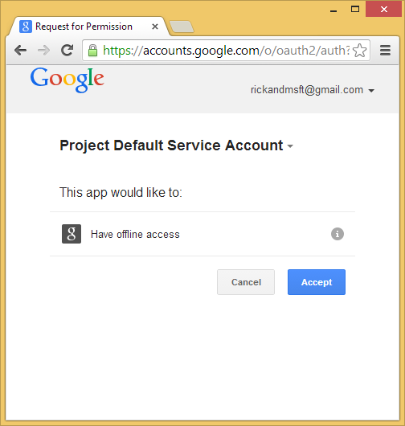
12. Click **Accept**. You will now be redirected back to the **Register** page of the MvcAuth application where you can register your Google account. You have the option of changing the local email registration name used for your Gmail account, but you generally want to keep the default email alias (that is, the one you used for authentication). Click **Register**.  
  
    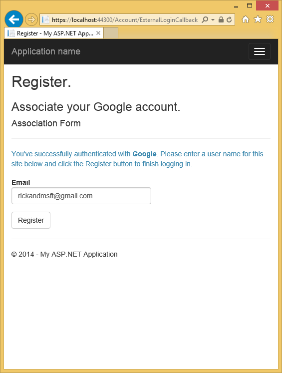

## Creating the app in Facebook and connecting the app to the project

For Facebook OAuth2 authentication, you need to copy to your project some settings from an application that you create in Facebook.

1. In your browser, navigate to [https://developers.facebook.com/apps](https://developers.facebook.com/apps) and log in by entering your Facebook credentials.
2. If you aren't already registered as a Facebook developer, click **Register as a Developer** and follow the directions to register.
3. On the **Apps** tab, click **Create New App**.

    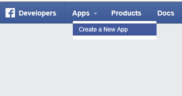
4. Enter an **App Name** and **Category**, then click **Create App**.

    This must be unique across Facebook. The **App Namespace** is the part of the URL that your App will use to access the Facebook application for authentication (for example, https://apps.facebook.com/{App Namespace}). If you don't specify an **App Namespace**, the **App ID** will be used for the URL. The **App ID** is a long system-generated number that you will see in the next step.

    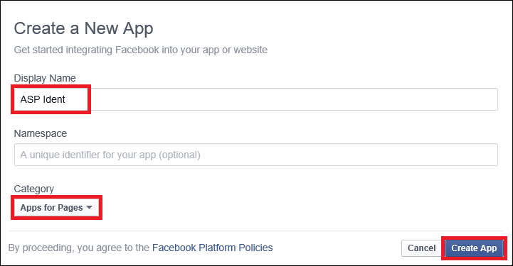
5. Submit the standard security check.

    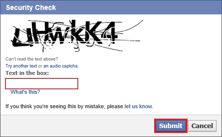
6. Select **Settings** for the left menu bar.
7. On the **Basic** settings section of the page select **Add Platform** to specify that you are adding a website application. 
8. Select **Website** from the platform choices.  
  
    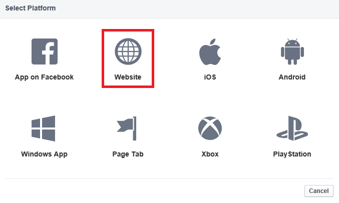
9. Make a note of your **App ID** and your **App Secret** so that you can add both into your MVC application later in this tutorial. Also, Add your Site URL (`https://localhost:44300/`) to test your MVC application. Also, add a **Contact Email**. Then, select **Save Changes**.   

    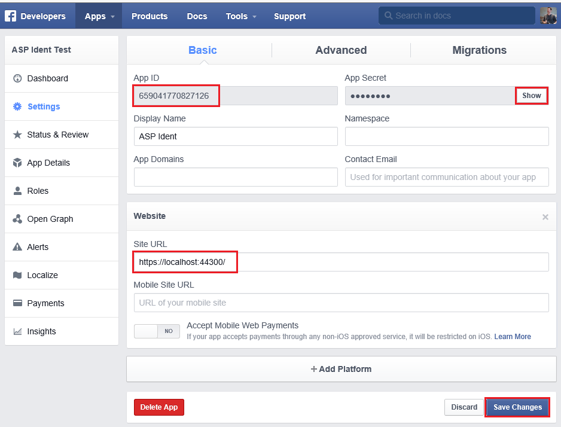

    > [!NOTE]
    > Note that you will only be able to authenticate using the email alias you have registered. Other users and test accounts will not be able to register. You can grant other Facebook accounts access to the application on the Facebook **Developer Roles** tab.
10. In Visual Studio, open *App\_Start\Startup.Auth.cs*.
11. Copy and paste the **AppId** and **App Secret** into the `UseFacebookAuthentication` method. The **AppId** and **App Secret** values shown below are samples and will not work.

    [!code-csharp[Main](create-an-aspnet-mvc-5-app-with-facebook-and-google-oauth2-and-openid-sign-on/samples/sample3.cs?highlight=33-35,38-39)]
12. Click **Save Changes**.
13. Press **CTRL+F5** to run the application.

Select **Log in** to display the Login page. Click **Facebook** under **Use another service to log in.**

Enter your Facebook credentials.

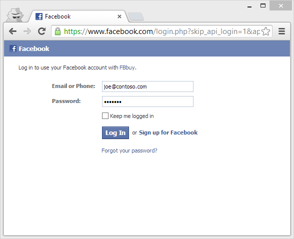

You will be prompted to grant permission for the application to access your public profile and friend list.

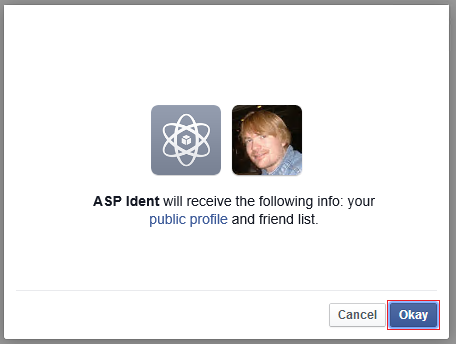

You are now logged in. You can now register this account with the application.

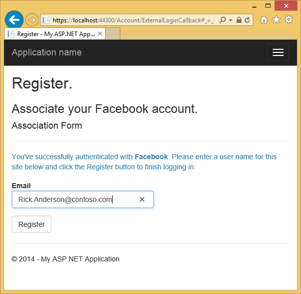

When you register, an entry is added to the *Users* table of the membership database.

## Examine the Membership Data

In the **View** menu, click **Server Explorer**.

Expand **DefaultConnection (MvcAuth)**, expand **Tables**, right click **AspNetUsers** and click **Show Table Data**.

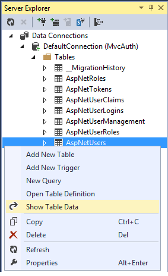

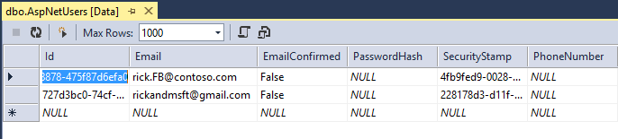

## Adding Profile Data to the User Class

In this section you'll add birth date and home town to the user data during registration, as shown in the following image.

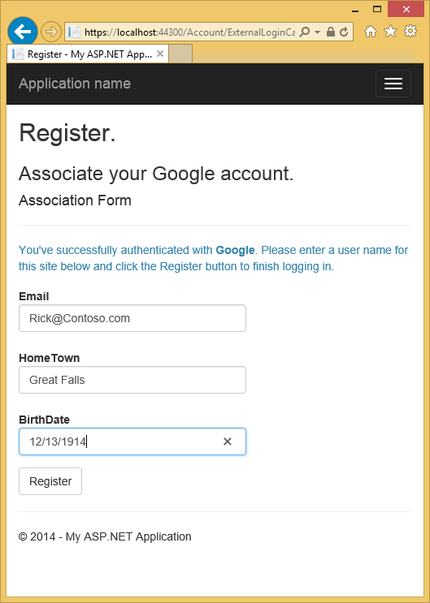

Open the *Models\IdentityModels.cs* file and add birth date and home town properties:

[!code-csharp[Main](create-an-aspnet-mvc-5-app-with-facebook-and-google-oauth2-and-openid-sign-on/samples/sample4.cs?highlight=3-4)]

Open the *Models\AccountViewModels.cs* file and the set birth date and home town properties in `ExternalLoginConfirmationViewModel`.

[!code-csharp[Main](create-an-aspnet-mvc-5-app-with-facebook-and-google-oauth2-and-openid-sign-on/samples/sample5.cs?highlight=8-9)]

Open the *Controllers\AccountController.cs* file and add code for birth date and home town in the `ExternalLoginConfirmation` action method as shown:

[!code-csharp[Main](create-an-aspnet-mvc-5-app-with-facebook-and-google-oauth2-and-openid-sign-on/samples/sample6.cs?highlight=21-23)]

Add birth date and home town to the *Views\Account\ExternalLoginConfirmation.cshtml* file:

[!code-cshtml[Main](create-an-aspnet-mvc-5-app-with-facebook-and-google-oauth2-and-openid-sign-on/samples/sample7.cshtml?highlight=27-40)]

Delete the membership database so you can again register your Facebook account with your application and verify you can add the new birth date and home town profile information.

From **Solution Explorer**, click the **Show All Files** icon, then right click *Add\_Data\aspnet-MvcAuth-&lt;dateStamp&gt;.mdf* and click **Delete**.

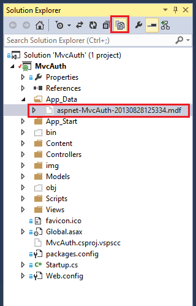

From the **Tools** menu, click **NuGet Package Manger**, then click **Package Manager Console** (PMC). Enter the following commands in the PMC.

1. Enable-Migrations
2. Add-Migration Init
3. Update-Database

Run the application and use FaceBook and Google to log in and register some users.

## Examine the Membership Data

In the **View** menu, click **Server Explorer**.

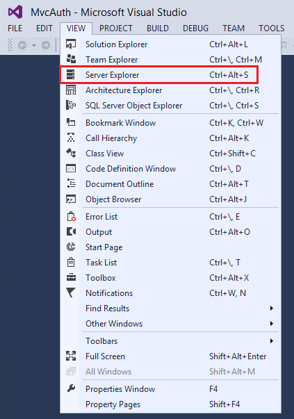

Right click **AspNetUsers** and click **Show Table Data**.

The `HomeTown` and `BirthDate` fields are shown below.

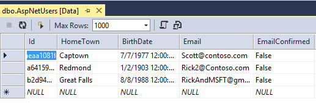

## Logging off your App and Logging in With Another Account

If you log on to your app with Facebook,, and then log out and try to log in again with a different Facebook account (using the same browser), you will be immediately logged in to the previous Facebook account you used. In order to use another account, you need to navigate to Facebook and log out at Facebook. The same rule applies to any other 3rd party authentication provider. Alternatively, you can log in with another account by using a different browser.

## Next Steps

See [Introducing the Yahoo and LinkedIn OAuth security providers for OWIN](http://www.jerriepelser.com/blog/introducing-the-yahoo-linkedin-oauth-security-providers-for-owin/) by Jerrie Pelser for Yahoo and LinkedIn instructions. See Jerrie's Pretty social login buttons for ASP.NET MVC 5 to get enable social login buttons.

Follow my tutorial [Create an ASP.NET MVC app with auth and SQL DB and deploy to Azure App Service](https://www.windowsazure.com/en-us/develop/net/tutorials/web-site-with-sql-database/), which continues this tutorial and shows the following:

1. How to deploy your app to Azure.
2. How to secure you app with roles.
3. How to secure your app with the [RequireHttps](https://msdn.microsoft.com/en-us/library/system.web.mvc.requirehttpsattribute(v=vs.108).aspx) and [Authorize](https://msdn.microsoft.com/en-us/library/system.web.mvc.authorizeattribute(v=vs.100).aspx) filters.
4. How to use the membership API to add users and roles.

Please leave feedback on how you liked this tutorial and what we could improve. You can also request new topics at [Show Me How With Code](http://aspnet.uservoice.com/forums/228522-show-me-how-with-code). You can even ask for and vote on new features to be added to ASP.NET. For example, you can vote for a tool to [create and manage users and roles.](http://aspnet.uservoice.com/forums/41199-general-asp-net/suggestions/5646857-asp-net-identity-membership-db-tool-to-mangage-use)

For an good explanation of how ASP.NET External Authentication Services work, see Robert McMurray's [External Authentication Services](https://asp.net/web-api/overview/security/external-authentication-services). Robert's article also goes into detail in enabling Microsoft and Twitter authentication. Tom Dykstra's excellent [EF/MVC tutorial](../getting-started/getting-started-with-ef-using-mvc/creating-an-entity-framework-data-model-for-an-asp-net-mvc-application.md) shows how to work with the Entity Framework.
