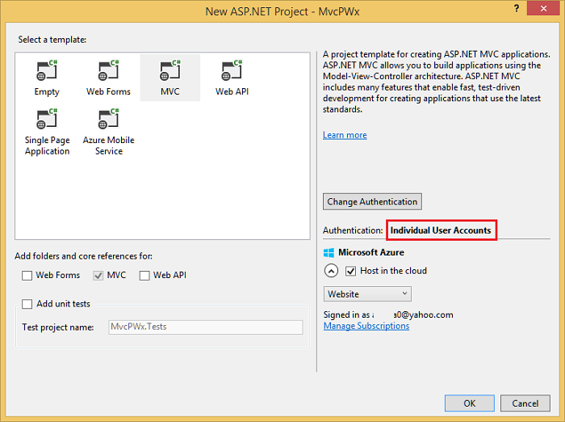
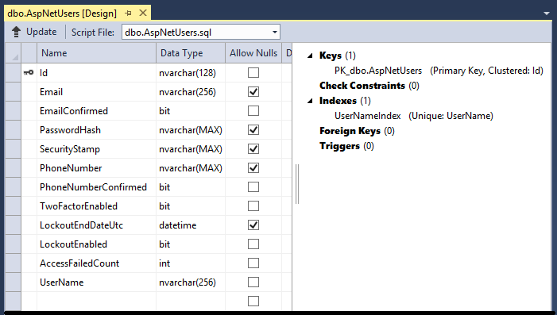
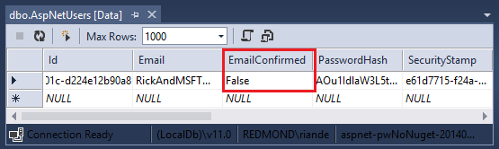
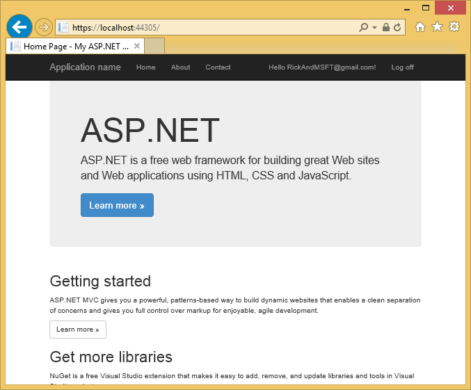

Create a secure ASP.NET MVC 5 web app with log in, email confirmation and password reset (C#)
====================
by [Rick Anderson](https://github.com/Rick-Anderson)

> This tutorial shows you how to build an ASP.NET MVC 5 web app with email confirmation and password reset using the ASP.NET Identity membership system. You can download the completed application [here](https://code.msdn.microsoft.com/MVC-5-with-2FA-email-8f26d952). The download contains debugging helpers that let you test email confirmation and SMS without setting up an email or SMS provider.
> 
> This tutorial was written by [Rick Anderson](https://blogs.msdn.com/rickAndy) ( Twitter: [@RickAndMSFT](https://twitter.com/RickAndMSFT) ).

## Create an ASP.NET MVC app

Start by installing and running [Visual Studio Express 2013 for Web](https://go.microsoft.com/fwlink/?LinkId=299058) or [Visual Studio 2013](https://go.microsoft.com/fwlink/?LinkId=306566). Install [Visual Studio 2013 Update 3](https://go.microsoft.com/fwlink/?LinkId=390465) or higher.

> [!NOTE]
> Warning: You must install [Visual Studio 2013 Update 3](https://go.microsoft.com/fwlink/?LinkId=390465) or higher to complete this tutorial.

1. Create a new ASP.NET Web project and select the MVC template. Web Forms also supports ASP.NET Identity, so you could follow similar steps in a web forms app.  
    
2. Leave the default authentication as **Individual User Accounts**. If you'd like to host the app in Azure, leave the check box checked. Later in the tutorial we will deploy to Azure. You can [open an Azure account for free](https://azure.microsoft.com/en-us/pricing/free-trial/?WT.mc_id=A261C142F).
3. Set the [project to use SSL](create-an-aspnet-mvc-5-app-with-facebook-and-google-oauth2-and-openid-sign-on.md).
4. Run the app, click the **Register** link and register a user. At this point, the only validation on the email is with the [[EmailAddress]](https://msdn.microsoft.com/en-us/library/system.componentmodel.dataannotations.emailaddressattribute(v=vs.110).aspx) attribute.
5. In Server Explorer, navigate to **Data Connections\DefaultConnection\Tables\AspNetUsers**, right click and select **Open table definition**.

    The following image shows the `AspNetUsers` schema:

    
6. Right click on the **AspNetUsers** table and select **Show Table Data**.  
      
 At this point the email has not been confirmed.
7. Click on the row and select delete. You'll add this email again in the next step, and send a confirmation email.

## Email confirmation

It's a best practice to confirm the email of a new user registration to verify they are not impersonating someone else (that is, they haven't registered with someone else's email). Suppose you had a discussion forum, you would want to prevent `"bob@example.com"` from registering as `"joe@contoso.com"`. Without email confirmation, `"joe@contoso.com"` could get unwanted email from your app. Suppose Bob accidently registered as `"bib@example.com"` and hadn't noticed it, he wouldn't be able to use password recover because the app doesn't have his correct email. Email confirmation provides only limited protection from bots and doesn't provide protection from determined spammers, they have many working email aliases they can use to register.

You generally want to prevent new users from posting any data to your web site before they have been confirmed by email, a SMS text message or another mechanism. In the sections below, we will enable email confirmation and modify the code to prevent newly registered users from logging in until their email has been confirmed.

## Hook up SendGrid

Although this tutorial only shows how to add email notification through [SendGrid](http://sendgrid.com/), you can send email using SMTP and other mechanisms (see [additional resources](#addRes)).

1. In the Package Manager Console, enter the following the following command: 

    [!code-console[Main](create-an-aspnet-mvc-5-web-app-with-email-confirmation-and-password-reset/samples/sample1.cmd)]
2. Go to the [Azure SendGrid sign up page](https://go.microsoft.com/fwlink/?linkid=271033&clcid=0x409) and register for free SendGrid account. Add code similar to the following to configure SendGrid:

    [!code-csharp[Main](create-an-aspnet-mvc-5-web-app-with-email-confirmation-and-password-reset/samples/sample2.cs?highlight=3,5)]

You'll need to add the following includes:

[!code-csharp[Main](create-an-aspnet-mvc-5-web-app-with-email-confirmation-and-password-reset/samples/sample3.cs)]

To keep this sample simple, we'll store the app settings in the *web.config* file:

[!code-xml[Main](create-an-aspnet-mvc-5-web-app-with-email-confirmation-and-password-reset/samples/sample4.xml)]

> [!WARNING]
> Security - Never store sensitive data in your source code. The account and credentials are stored in the appSetting. On Azure, you can securely store these values on the **[Configure](https://blogs.msdn.com/b/webdev/archive/2014/06/04/queuebackgroundworkitem-to-reliably-schedule-and-run-long-background-process-in-asp-net.aspx)** tab in the Azure portal. See [Best practices for deploying passwords and other sensitive data to ASP.NET and Azure](../../../identity/overview/features-api/best-practices-for-deploying-passwords-and-other-sensitive-data-to-aspnet-and-azure.md).

### Enable email confirmation in the Account controller

[!code-csharp[Main](create-an-aspnet-mvc-5-web-app-with-email-confirmation-and-password-reset/samples/sample5.cs?highlight=16-21)]

Verify the *Views\Account\ConfirmEmail.cshtml* file has correct razor syntax. ( The @ character in the first line might be missing. )

[!code-cshtml[Main](create-an-aspnet-mvc-5-web-app-with-email-confirmation-and-password-reset/samples/sample6.cshtml?highlight=1)]

Run the app and click the Register link. Once you submit the registration form, you are logged in.

Check your email account and click on the link to confirm your email.

## Require email confirmation before log in

Currently once a user completes the registration form, they are logged in. You generally want to confirm their email before logging them in. In the section below, we will modify the code to require new users to have a confirmed email before they are logged in (authenticated). Update the `HttpPost Register` method with the following highlighted changes:

[!code-csharp[Main](create-an-aspnet-mvc-5-web-app-with-email-confirmation-and-password-reset/samples/sample7.cs?highlight=14-15,23-30)]

By commenting out the `SignInAsync` method, the user will not be signed in by the registration. The `TempData["ViewBagLink"] = callbackUrl;` line can be used to [debug the app](#dbg) and test registration without sending email. `ViewBag.Message` is used to display the confirm instructions. The [download sample](https://code.msdn.microsoft.com/MVC-5-with-2FA-email-8f26d952) contains code to test email confirmation without setting up email, and can also be used to debug the application.

Create a `Views\Shared\Info.cshtml` file and add the following razor markup:

[!code-cshtml[Main](create-an-aspnet-mvc-5-web-app-with-email-confirmation-and-password-reset/samples/sample8.cshtml)]

Add the [Authorize attribute](https://msdn.microsoft.com/en-us/library/system.web.mvc.authorizeattribute(v=vs.118).aspx) to the `Contact` action method of the Home controller. You can use click on the **Contact** link to verify anonymous users don't have access and authenticated users do have access.

[!code-csharp[Main](create-an-aspnet-mvc-5-web-app-with-email-confirmation-and-password-reset/samples/sample9.cs?highlight=1)]

You must also update the `HttpPost Login` action method:

[!code-csharp[Main](create-an-aspnet-mvc-5-web-app-with-email-confirmation-and-password-reset/samples/sample10.cs?highlight=13-22)]

Update the *Views\Shared\Error.cshtml* view to display the error message:

[!code-cshtml[Main](create-an-aspnet-mvc-5-web-app-with-email-confirmation-and-password-reset/samples/sample11.cshtml?highlight=8-17)]

Delete any accounts in the **AspNetUsers** table that contain the email alias you wish to test with. Run the app and verify you can't log in until you have confirmed your email address. Once you confirm your email address, click the **Contact** link.

## Password recovery/reset

Remove the comment characters from the `HttpPost ForgotPassword` action method in the account controller:

[!code-csharp[Main](create-an-aspnet-mvc-5-web-app-with-email-confirmation-and-password-reset/samples/sample12.cs?highlight=17-20)]

Remove the comment characters from the `ForgotPassword` [ActionLink](https://msdn.microsoft.com/en-us/library/system.web.mvc.html.linkextensions.actionlink(v=vs.118).aspx) in the *Views\Account\Login.cshtml* razor view file:

[!code-cshtml[Main](create-an-aspnet-mvc-5-web-app-with-email-confirmation-and-password-reset/samples/sample13.cshtml?highlight=47-50)]

The Log in page will now show a link to reset the password.

## Resend email confirmation link

Once a user creates a new local account, they are emailed a confirmation link they are required to use before they can log on. If the user accidently deletes the confirmation email, or the email never arrives, they will need the confirmation link sent again. The following code changes show how to enable this.

Add the following helper method to the bottom of the *Controllers\AccountController.cs* file:

[!code-csharp[Main](create-an-aspnet-mvc-5-web-app-with-email-confirmation-and-password-reset/samples/sample14.cs)]

Update the Register method to use the new helper:

[!code-csharp[Main](create-an-aspnet-mvc-5-web-app-with-email-confirmation-and-password-reset/samples/sample15.cs?highlight=17)]

Update the Login method to resend the password when if the user account has not been confirmed:

[!code-csharp[Main](create-an-aspnet-mvc-5-web-app-with-email-confirmation-and-password-reset/samples/sample16.cs?highlight=20)]

## Combine social and local login accounts

You can combine local and social accounts by clicking on your email link. In the following sequence **RickAndMSFT@gmail.com** is first created as a local login, but you can create the account as a social log in first, then add a local login.

Click on the **Manage** link. Note the 0 external (social logins) associated with this account.

Click the link to another log in service and accept the app requests. The two accounts have been combined, you will be able to log on with either account. You might want your users to add local accounts in case their social log in authentication service is down, or more likely they have lost access to their social account.

In the following image, Tom is a social log in (which you can see from the **External Logins: 1** shown on the page).

Clicking on **Pick a password** allows you to add a local log on associated with the same account.

## Email confirmation in more depth

My tutorial [Account Confirmation and Password Recovery with ASP.NET Identity](../../../identity/overview/features-api/account-confirmation-and-password-recovery-with-aspnet-identity.md) goes into this topic with more details.

## Debugging the app

If you don't get an email containing the link:

- Check your junk or spam folder.
- Log into your SendGrid account and click on the [Email Activity link](https://sendgrid.com/logs/index).

To test the verification link without email, download the [completed sample](https://code.msdn.microsoft.com/MVC-5-with-2FA-email-8f26d952). The confirmation link and confirmation codes will be displayed on the page.

## Additional Resources

- [Links to ASP.NET Identity Recommended Resources](../../../identity/overview/getting-started/aspnet-identity-recommended-resources.md)
- [Account Confirmation and Password Recovery with ASP.NET Identity](../../../identity/overview/features-api/account-confirmation-and-password-recovery-with-aspnet-identity.md) Goes into more detail on password recovery and account confirmation.
- [MVC 5 App with Facebook, Twitter, LinkedIn and Google OAuth2 Sign-on](create-an-aspnet-mvc-5-app-with-facebook-and-google-oauth2-and-openid-sign-on.md) This tutorial shows you how to write an ASP.NET MVC 5 app with Facebook and Google OAuth 2 authorization. It also shows how to add additional data to the Identity database.
- [Deploy a Secure ASP.NET MVC app with Membership, OAuth, and SQL Database to Azure](https://www.windowsazure.com/en-us/develop/net/tutorials/web-site-with-sql-database/). This tutorial adds Azure deployment, how to secure your app with roles, how to use the membership API to add users and roles, and additional security features.
- [Creating a Google app for OAuth 2 and connecting the app to the project](create-an-aspnet-mvc-5-app-with-facebook-and-google-oauth2-and-openid-sign-on.md#goog)
- [Creating the app in Facebook and connecting the app to the project](create-an-aspnet-mvc-5-app-with-facebook-and-google-oauth2-and-openid-sign-on.md#fb)
- [Setting up SSL in the Project](create-an-aspnet-mvc-5-app-with-facebook-and-google-oauth2-and-openid-sign-on.md#ssl)