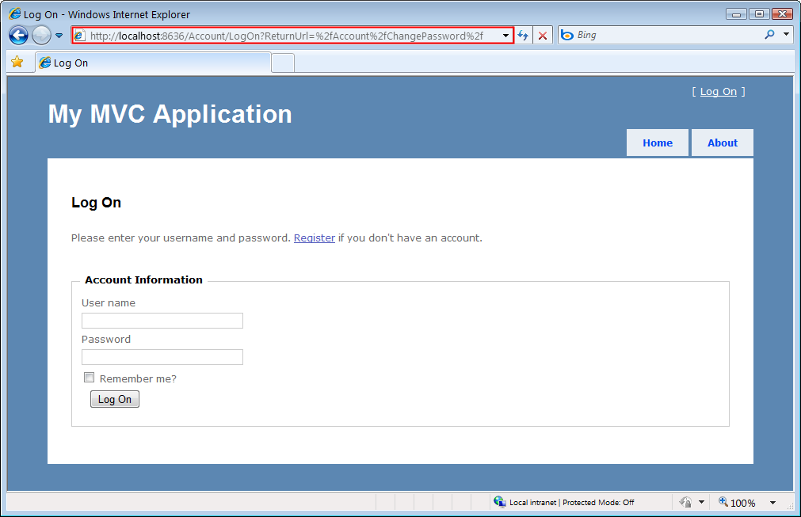
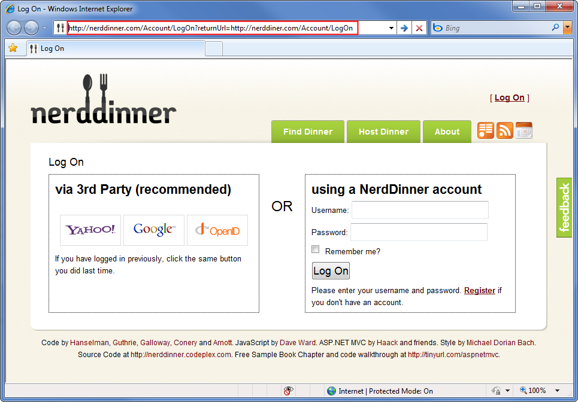
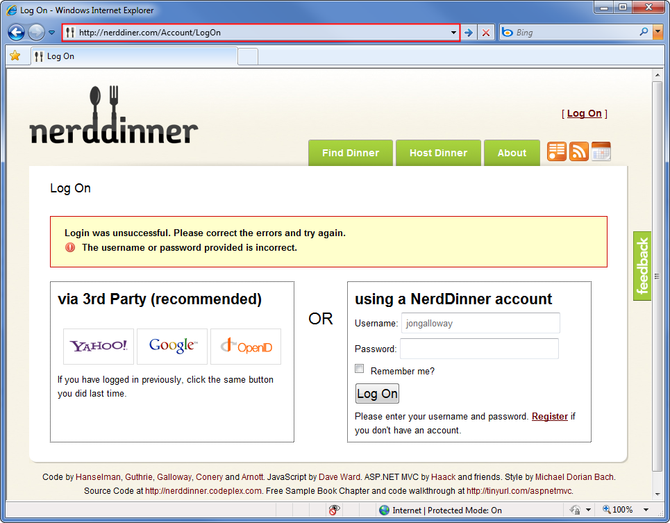
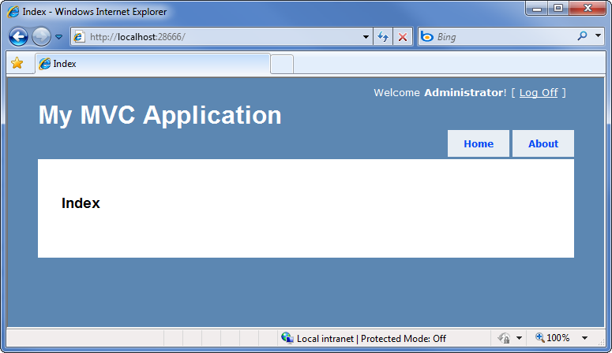

Preventing Open Redirection Attacks (C#)
====================
by [Jon Galloway](https://github.com/jongalloway)

> This tutorial explains how you can prevent open redirection attacks in your ASP.NET MVC applications. This tutorial discusses the changes that have been made in the AccountController in ASP.NET MVC 3 and demonstrates how you can apply these changes in your existing ASP.NET MVC 1.0 and 2 applications.

## What is an Open Redirection Attack?

Any web application that redirects to a URL that is specified via the request such as the querystring or form data can potentially be tampered with to redirect users to an external, malicious URL. This tampering is called an open redirection attack.

Whenever your application logic redirects to a specified URL, you must verify that the redirection URL hasn't been tampered with. The login used in the default AccountController for both ASP.NET MVC 1.0 and ASP.NET MVC 2 is vulnerable to open redirection attacks. Fortunately, it is easy to update your existing applications to use the corrections from the ASP.NET MVC 3 Preview.

To understand the vulnerability, let's look at how the login redirection works in a default ASP.NET MVC 2 Web Application project. In this application, attempting to visit a controller action that has the [Authorize] attribute will redirect unauthorized users to the /Account/LogOn view. This redirect to /Account/LogOn will include a returnUrl querystring parameter so that the user can be returned to the originally requested URL after they have successfully logged in.

In the screenshot below, we can see that an attempt to access the /Account/ChangePassword view when not logged in results in a redirect to /Account/LogOn?ReturnUrl=%2fAccount%2fChangePassword%2f.

**Figure 01**: Login page with an open redirection

Since the ReturnUrl querystring parameter is not validated, an attacker can modify it to inject any URL address into the parameter to conduct an open redirection attack. To demonstrate this, we can modify the ReturnUrl parameter to [http://bing.com](http://bing.com), so the resulting login URL will be /Account/LogOn?ReturnUrl=http://www.bing.com/. Upon successfully logging in to the site, we are redirected to [http://bing.com](http://bing.com). Since this redirection is not validated, it could instead point to a malicious site that attempts to trick the user.

### A more complex Open Redirection Attack

Open redirection attacks are especially dangerous because an attacker knows that we're trying to log into a specific website, which makes us vulnerable to a [phishing attack](https://www.microsoft.com/protect/fraud/phishing/symptoms.aspx). For example, an attacker could send malicious e-mails to website users in an attempt to capture their passwords. Let's look at how this would work on the NerdDinner site. (Note that the live NerdDinner site has been updated to protect against open redirection attacks.)

First, an attacker sends us a link to the login page on NerdDinner that includes a redirect to their forged page:

[http://nerddinner.com/Account/LogOn?returnUrl=http://nerddiner.com/Account/LogOn](http://nerddinner.com/Account/LogOn?returnUrl=http://nerddiner.com/Account/LogOn)

Note that the return URL points to nerddiner.com, which is missing an "n" from the word dinner. In this example, this is a domain that the attacker controls. When we access the above link, we're taken to the legitimate NerdDinner.com login page.

**Figure 02**: NerdDinner login page with an open redirection

When we correctly log in, the ASP.NET MVC AccountController's LogOn action redirects us to the URL specified in the returnUrl querystring parameter. In this case, it's the URL that the attacker has entered, which is [http://nerddiner.com/Account/LogOn](http://nerddiner.com/Account/LogOn). Unless we're extremely watchful, it's very likely we won't notice this, especially because the attacker has been careful to make sure that their forged page looks exactly like the legitimate login page. This login page includes an error message requesting that we login again. Clumsy us, we must have mistyped our password.

**Figure 03**: Forged NerdDinner Login screen

When we retype our user name and password, the forged login page saves the information and sends us back to the legitimate NerdDinner.com site. At this point, the NerdDinner.com site has already authenticated us, so the forged login page can redirect directly to that page. The end result is that the attacker has our user name and password, and we are unaware that we've provided it to them.

## Looking at the vulnerable code in the AccountController LogOn Action

The code for the LogOn action in an ASP.NET MVC 2 application is shown below. Note that upon a successful login, the controller returns a redirect to the returnUrl. You can see that no validation is being performed against the returnUrl parameter.

**Listing 1 – ASP.NET MVC 2 LogOn action in `AccountController.cs`**

[!code-csharp[Main](preventing-open-redirection-attacks/samples/sample1.cs)]

Now let's look at the changes to the ASP.NET MVC 3 LogOn action. This code has been changed to validate the returnUrl parameter by calling a new method in the System.Web.Mvc.Url helper class named `IsLocalUrl()`.

**Listing 2 – ASP.NET MVC 3 LogOn action in `AccountController.cs`**

[!code-csharp[Main](preventing-open-redirection-attacks/samples/sample2.cs)]

This has been changed to validate the return URL parameter by calling a new method in the System.Web.Mvc.Url helper class, `IsLocalUrl()`.

## Protecting Your ASP.NET MVC 1.0 and MVC 2 Applications

We can take advantage of the ASP.NET MVC 3 changes in our existing ASP.NET MVC 1.0 and 2 applications by adding the IsLocalUrl() helper method and updating the LogOn action to validate the returnUrl parameter.

The UrlHelper IsLocalUrl() method actually just calling into a method in System.Web.WebPages, as this validation is also used by ASP.NET Web Pages applications.

**Listing 3 – The IsLocalUrl() method from the ASP.NET MVC 3 UrlHelper `class`**

[!code-csharp[Main](preventing-open-redirection-attacks/samples/sample3.cs)]

The IsUrlLocalToHost method contains the actual validation logic, as shown in Listing 4.

**Listing 4 – IsUrlLocalToHost() method from the System.Web.WebPages RequestExtensions class**

[!code-csharp[Main](preventing-open-redirection-attacks/samples/sample4.cs)]

In our ASP.NET MVC 1.0 or 2 application, we'll add a IsLocalUrl() method to the AccountController, but you're encouraged to add it to a separate helper class if possible. We will make two small changes to the ASP.NET MVC 3 version of IsLocalUrl() so that it will work inside the AccountController. First, we'll change it from a public method to a private method, since public methods in controllers can be accessed as controller actions. Second, we'll modify the call that checks the URL host against the application host. That call makes use of a local RequestContext field in the UrlHelper class. Instead of using this.RequestContext.HttpContext.Request.Url.Host, we will use this.Request.Url.Host. The following code shows the modified IsLocalUrl() method for use with a controller class in ASP.NET MVC 1.0 and 2 applications.

**Listing 5 – IsLocalUrl() method, which is modified for use with an MVC Controller class**

[!code-csharp[Main](preventing-open-redirection-attacks/samples/sample5.cs)]

Now that the IsLocalUrl() method is in place, we can call it from our LogOn action to validate the returnUrl parameter, as shown in the following code.

**Listing 6 – Updated LogOn method which validates the returnUrl parameter**

[!code-csharp[Main](preventing-open-redirection-attacks/samples/sample6.cs)]

Now we can test an open redirection attack by attempting to log in using an external return URL. Let's use /Account/LogOn?ReturnUrl=http://www.bing.com/ again.

**Figure 04**: Testing the updated LogOn Action

After successfully logging in, we are redirected to the Home/Index Controller action rather than the external URL.

**Figure 05**: Open Redirection attack defeated

## Summary

Open redirection attacks can occur when redirection URLs are passed as parameters in the URL for an application. The ASP.NET MVC 3 template includes code to protect against open redirection attacks. You can add this code with some modification to ASP.NET MVC 1.0 and 2 applications. To protect against open redirection attacks when logging into ASP.NET 1.0 and 2 applications, add a IsLocalUrl() method and validate the returnUrl parameter in the LogOn action.